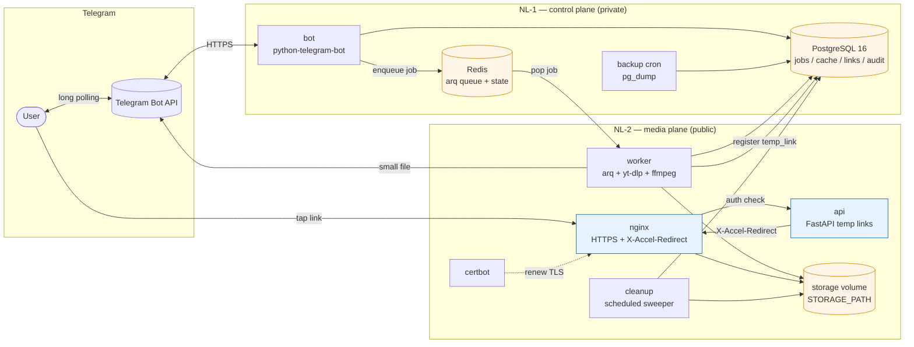

# 00 — Overview

> Status: Stable
> Audience: everyone (humans, AI agents, ops, new joiners)
> Read next: [`01-product-purpose.md`](01-product-purpose.md), [`02-architecture.md`](02-architecture.md)

This document is the **5-minute system briefing**. After reading it you should
know what DWTGBot does, what it is *not*, and the shape of the system enough
to navigate the rest of the docs.

---

## 1. What DWTGBot is

A production-grade **Telegram bot** that lets users download media from
**YouTube** and **Instagram** by sending a link to the bot in chat. The bot:

1. Validates the link and detects the platform.
2. Fetches metadata and presents available **download options** as inline
   buttons (e.g. `Видео 720p`, `Только аудио (MP3)`, `Скачать всё`).
3. Queues the chosen download to a worker.
4. Delivers the result back to the chat:
   - **small files** (≤ ~50 MB) → uploaded directly into Telegram;
   - **large files** → served via a **tokenized HTTPS link** with TTL +
     download limit, behind Nginx.

The bot is built to be **operated by a small team** for an arbitrary number
of users (Telegram’s natural rate limits apply).

---

## 2. What DWTGBot is NOT

- **Not** a media library / streaming service. It does not store media long-term.
- **Not** a re-encoding / editing tool. It only does what `yt-dlp` + `ffmpeg`
  do as part of a download (audio extraction, video+audio merge).
- **Not** a multi-tenant SaaS. There is no per-tenant isolation, no billing,
  no team accounts.
- **Not** a public file hosting. Temp links expire (TTL) and are usable
  a limited number of times.
- **Not** a generic Telegram bot framework. The bot exists to serve **media
  download intents** specifically.

If you find yourself adding a feature that violates one of the above, escalate
via an ADR before writing code.

---

## 3. Topologies: `single` and `split` (NL-1 / NL-2)

Проект поддерживает две топологии ([ADR-0011](adr/0011-single-server-topology.md)).
Код приложения и образы в них одинаковые, отличается только compose-обвязка:

| Топология | Хосты | Стеки | Когда |
|---|---|---|---|
| **`single`** | 1 | `deploy/single` = control + media на одном хосте | старт и малый масштаб (рекомендуемый путь установки) |
| **`split`** | 2 (WireGuard) | `deploy/nl1` + `deploy/nl2` | рост нагрузки или требования к изоляции |

Переход `single → split` проходит без миграции данных: имена volume и контейнеров
совпадают (runbook — [`24-runbooks.md`](24-runbooks.md) §26,
пороги — [`37-load-and-capacity.md`](37-load-and-capacity.md) §8.0).
В `single` плоскости control и media разделены сетями Docker, а не хостами:
nginx не подключён к сети с Postgres и Redis, а порты данных не публикуются.

Ниже описано, что даёт `split`. На одном хосте теряется изоляция blast radius,
а изоляция сетей сохраняется.

Cleanly separating the **control plane** (stateful, bot-facing) from the
**media plane** (stateless, traffic-heavy) yields three concrete wins:

1. **Blast radius isolation.** A worker crash, a disk-full event, or a
   yt-dlp regression does not bring down the bot or the database.
2. **Independent scaling.** NL-2 can be vertically/horizontally scaled with
   storage and CPU for downloads; NL-1 stays small.
3. **Attack surface minimization.** Postgres and Redis are never internet-
   exposed; they listen only on the WireGuard private subnet to NL-2.

| Server | Role | Public ports | Stateful? |
|---|---|---|---|
| **NL-1** | bot + postgres + redis + backups | none (only Telegram outbound) | yes |
| **NL-2** | worker + nginx + certbot + cleanup + storage | 80, 443 | files yes, DB no |

В `single` те же сервисы работают на одном хосте, публичные порты — только 80 и 443.

See [ADR-0001](adr/0001-two-server-topology.md) for the split rationale and [ADR-0011](adr/0011-single-server-topology.md) for the single topology (it supersedes [ADR-0005](adr/0005-locked-architectural-assumptions.md) rows 2–4).

### 3.1 System topology (one-screen mental map)

Three things to internalise from this diagram:

1. **Postgres and Redis live on NL-1 and never appear on the public side.** They are reachable from NL-2 only over the WireGuard private subnet. В `single` они вообще не публикуют порты и доступны только в сети `dwtgbot_internal`.
2. **The bot never touches the storage volume.** Disk lives on NL-2 (в `single` — на том же хосте, но volume в контейнер bot не монтируется). The bot delegates by enqueueing.
3. **Files leave the system through exactly two doors**: Telegram upload (small) or Nginx `X-Accel-Redirect` (large). There is no third path.

---

## 4. Tech stack at a glance

| Concern | Choice | Doc |
|---|---|---|
| Language | Python 3.14+ | [ADR-0005 §3.1](adr/0005-locked-architectural-assumptions.md), [ADR-0009](adr/0009-python-314-runtime.md) |
| Bot framework | `python-telegram-bot` 21.x | [ADR-0002](adr/0002-python-telegram-bot.md), [`06-bot-flow.md`](06-bot-flow.md) |
| Download engine | `yt-dlp` (Python API) | [`08-download-pipeline.md`](08-download-pipeline.md) |
| Media processing | `ffmpeg` (subprocess) | [`08-download-pipeline.md`](08-download-pipeline.md) |
| Queue | Redis + `arq` | [ADR-0005 §3.6](adr/0005-locked-architectural-assumptions.md), [`09-queue-and-workers.md`](09-queue-and-workers.md) |
| Database | PostgreSQL 16 + SQLAlchemy 2 + Alembic | [ADR-0005 §3.7](adr/0005-locked-architectural-assumptions.md), [`12-db-schema.md`](12-db-schema.md) |
| Internal/public API | FastAPI + uvicorn | [`10-temp-links-and-delivery.md`](10-temp-links-and-delivery.md), [`15-healthchecks.md`](15-healthchecks.md) |
| Reverse proxy | Nginx + Certbot | [ADR-0004](adr/0004-temp-links-via-nginx-x-accel.md), [`19-docker-architecture.md`](19-docker-architecture.md) |
| Containerization | Docker + Docker Compose | [ADR-0005 §3.10](adr/0005-locked-architectural-assumptions.md) |
| CI/CD | GitHub Actions | [ADR-0005 §3.11](adr/0005-locked-architectural-assumptions.md), [`21-cicd.md`](21-cicd.md) |
| OS target | Ubuntu 24.04 LTS | [`20-deployment.md`](20-deployment.md) |
| Logging | `structlog` JSON | [`14-logging-observability.md`](14-logging-observability.md) |
| Lint / format / types | `ruff check` + `ruff format` (black-compatible) + `mypy` | [`27-coding-standards.md`](27-coding-standards.md) |
| Tests | `pytest` | [`18-testing-strategy.md`](18-testing-strategy.md) |

> 🔒 **LOCKED:** every row above is fixed by an architectural decision.
> The consolidated register lives in
> [**ADR-0005 — Locked architectural assumptions**](adr/0005-locked-architectural-assumptions.md)
> §2 — read it before proposing changes to any of these choices.

---

## 5. Capabilities (functional summary)

### Commands
- `/start` — welcome + brief usage.
- `/help` — usage hints + supported platforms.
- `/about` — version, environment.
- `/health` — bot self-report (event loop + queue connectivity).

### YouTube
- Returns **only the resolutions actually available** for the source video
  (intersected with the bucket set 360p / 480p / 720p / 1080p).
- Always offers an **MP3 audio-only** option.
- Estimates approximate file size when video duration is known.
- Merges video + audio streams via ffmpeg when needed.

### Instagram
- Detects single video, single photo, or carousel.
- Carousels: download all, video-only, or photo-only; ZIP-pack on demand.

### Delivery
- Auto-routes the result based on file size and `TELEGRAM_MAX_UPLOAD_MB`.
- Temp links carry a TTL (`TEMP_LINK_TTL_SECONDS`) and a use counter
  (`TEMP_LINK_MAX_DOWNLOADS`).
- Files are served via Nginx with `X-Accel-Redirect` from an `internal`
  location — direct disk access is never exposed.

### Operations
- TUI `bash deploy/scripts/install.sh` menu for setup + day-2 ops.
- Idempotent in-place updates via `deploy_update.sh`.
- Automated Postgres backups + interactive restore.
- Periodic cleanup of expired links and orphan files.
- ufw-based firewall presets per server.

---

## 6. Constraints and limits

| Constraint | Value (default) | Where to change |
|---|---|---|
| Telegram upload size cap | 49 MB (under the 50 MB Bot API limit) | `TELEGRAM_MAX_UPLOAD_MB` |
| Single download hard ceiling | 2 GB | `MAX_FILE_SIZE_MB` |
| Temp link TTL | 24 hours | `TEMP_LINK_TTL_SECONDS` |
| Temp link uses | 5 | `TEMP_LINK_MAX_DOWNLOADS` |
| Worker concurrency | 2 jobs / worker | `WORKER_CONCURRENCY` |
| Job timeout | 30 min | `JOB_TIMEOUT_SECONDS` |
| Job retries | 2 (then DLQ) | `JOB_MAX_RETRIES` |
| yt-dlp timeout | 15 min | `DOWNLOAD_TIMEOUT_SECONDS` |
| Cleanup tick | 1 hour | `CLEANUP_INTERVAL_SECONDS` |
| Backup retention | 14 days | `BACKUP_RETENTION_DAYS` |

Full reference: [`13-config-and-env.md`](13-config-and-env.md).

---

## 7. Key technical risks (and mitigations)

| Risk | Likelihood | Impact | Mitigation |
|---|---|---|---|
| `yt-dlp` breaks after upstream YouTube/IG change | High | Bot stops working | Pin version; runbook for hot-bump; staged rollout via CI |
| Disk fills on NL-2 | Medium | Worker fails, links 5xx | `cleanup_worker` + retention; storage monitoring |
| Telegram rate limits / 429 | Medium | Slow delivery | `AIORateLimiter` in `python-telegram-bot`; user-visible queueing |
| Postgres outage on NL-1 | Low | Bot returns errors | Healthcheck → systemd restart; backups + restore drill |
| Redis outage | Low | Jobs can’t be enqueued | Healthcheck; arq retries; backups not needed (volatile) |
| Token leakage in logs | Low | Bot hijack | Never log `BOT_TOKEN`/passwords; logging redaction policy in [`14`](14-logging-observability.md) |
| Path traversal via filenames | Low | Disk corruption / data leak | Mandatory `ensure_within(STORAGE_PATH, …)`; tested in `app/tests/test_filenames.py` |
| Untrusted callback_data spoof | Low | Logic confusion | Callbacks validated against Redis state store; see [`06-bot-flow.md`](06-bot-flow.md) |
| Certbot rate-limit lockout | Low | TLS expiry | Use Let's Encrypt staging during setup; runbook for restoration |

For full incident playbooks see [`24-runbooks.md`](24-runbooks.md).

---

## 8. Why this design — the very short version

- **Provider-based architecture** keeps platform-specific weirdness behind a
  thin interface so adding TikTok later is a small, well-bounded PR.
- **Composition root** (`app/composition/`) is the only place that wires
  concrete classes; everything else depends on protocols/ABCs. This is what
  enables fast unit tests with fakes (no Redis/DB needed).
- **arq + idempotent job IDs** prevent duplicate processing if the bot
  re-enqueues the same job during a flap.
- **Nginx `X-Accel-Redirect`** keeps file-serving in `nginx`, while keeping
  authentication in Python — best of both worlds.
- **Postgres/Redis недоступны извне в обеих топологиях.** В `split`
  (NL-1 + NL-2 + WireGuard) к ним можно попасть только через приватную
  сеть WireGuard. В `single` Postgres/Redis не публикуют порты на хост, а
  `nginx` подключён только к сети `dwtgbot_media` и не видит внутреннюю сеть.

For the long version: [`02-architecture.md`](02-architecture.md) and the
ADRs.

---

## 9. Anti-patterns at a glance

These are forbidden in this codebase. Each is detailed in the relevant doc.

- ❌ Putting business logic in bot handlers (it belongs in
  `app/application/use_cases/`). See [`03`](03-project-structure.md).
- ❌ Importing `app.infrastructure.*` from `app.domain.*` or `app.application.*`.
  See [`03`](03-project-structure.md).
- ❌ Calling subprocess with shell strings or string interpolation.
  See [`08`](08-download-pipeline.md), [`17`](17-security.md).
- ❌ Building any disk path without `ensure_within(STORAGE_PATH, …)`.
  See [`11`](11-storage-strategy.md), [`17`](17-security.md).
- ❌ Logging tokens, passwords, full URLs with secrets, or full
  `BOT_TOKEN`. See [`14`](14-logging-observability.md), [`17`](17-security.md).
- ❌ Adding env vars without updating `Settings` + `.env.example` + docs.
  See [`13`](13-config-and-env.md), [`27`](27-coding-standards.md).
- ❌ Writing tests that hit the network or a real DB without the
  `integration` marker. See [`18`](18-testing-strategy.md).
- ❌ Editing an old Alembic migration that has been deployed to production.
  See [`12`](12-db-schema.md).

---

## 10. Where to go next

- **First-day onboarding:** [`01-product-purpose.md`](01-product-purpose.md) → [`02-architecture.md`](02-architecture.md) → [`03-project-structure.md`](03-project-structure.md) → [`05-data-flow.md`](05-data-flow.md).
- **Implementing a feature:** [`28-implementation-playbook.md`](28-implementation-playbook.md).
- **AI agent making changes:** [`25-agent-guide.md`](25-agent-guide.md), [`26-cursor-rules.md`](26-cursor-rules.md).
- **Going on-call:** [`24-runbooks.md`](24-runbooks.md), [`31-troubleshooting.md`](31-troubleshooting.md).

---

## 11. Onboarding checklist (first day)

Tick these off in order. Each item is doable in 10–30 minutes; the whole thing is half a day.

**Read** (don't skim):
- [ ] This file (`00-overview.md`).
- [ ] [`01-product-purpose.md`](01-product-purpose.md) — what we are and aren't.
- [ ] [`02-architecture.md`](02-architecture.md) §§1–4 — the layered model.
- [ ] [`03-project-structure.md`](03-project-structure.md) §§1–5 — directory tree + dependency matrix.
- [ ] [`05-data-flow.md`](05-data-flow.md) — one happy-path traced end-to-end.
- [ ] [`13-config-and-env.md`](13-config-and-env.md) §1 + the env-var table.

**Verify your local environment**:
- [ ] Python 3.14+ installed (`python3 --version`).
- [ ] Docker + Docker Compose v2 installed (`docker compose version`).
- [ ] Repo cloned; `make setup` (or `pip install -r requirements-dev.txt`) succeeds.
- [ ] `ruff check .` and `ruff format --check .` exit 0.
- [ ] `mypy app` exits 0.
- [ ] `pytest -m "not integration"` exits 0.

**Run the system locally** (optional but strongly recommended):
- [ ] Copy `.env.example` to `.env` and fill `BOT_TOKEN` (use a sandbox bot from BotFather).
- [ ] `cp deploy/single/.env.example deploy/single/.env`, заполнить значения, затем `make single-up` поднимает весь стек (bot, postgres, redis, api, worker, nginx) на одной машине.
- [ ] (Опционально, split) `docker compose -f deploy/nl1/docker-compose.yml up -d` и `docker compose -f deploy/nl2/docker-compose.yml up -d`.
- [ ] DM your sandbox bot a YouTube short — receive a file in chat.
- [ ] Open the worker logs (`docker compose logs -f worker`) and find the `job_done` event for that download.

**Know your safety nets** before you commit anything:
- [ ] You can find the relevant doc for any topic via [`docs/README.md`](README.md).
- [ ] You know where ADRs live (`docs/adr/`) and that "locked" decisions need one.
- [ ] You've skimmed [`25-agent-guide.md`](25-agent-guide.md) §§1–4 (or [`28-implementation-playbook.md`](28-implementation-playbook.md) §§1–6 if you're a human).

If any box can't be ticked after a reasonable attempt, file an issue tagged `onboarding` — that means the docs or the bootstrap drifted.

---

## 12. Common mistakes by new contributors

| Mistake | Why it happens | What to do instead |
|---|---|---|
| Adding business logic to a bot handler ("just a small `if`") | Handlers feel like the natural place because that's where the user interaction is | Put the logic in `app/application/use_cases/`; the handler stays a thin adapter |
| Importing from `app.infrastructure.*` in `app.application.*` | Copy-pasting a quick fix that "works" | Depend on the protocol in `app.application.services` or `app.domain.repositories`; wire concretes only in `app/composition/` |
| Editing an old Alembic migration to "fix" the schema | Faster than writing a new one | Always write a *new* migration. Old ones may already be applied in prod |
| Adding an env var only in `.env.example` (or only in compose) | The two surfaces look alike, easy to miss one | Add to **all five**: `app/config.py` Settings model, `.env.example`, the relevant compose fragment's env block (`deploy/compose/{control,media}.yml`), the per-topology `deploy/{single,nl1,nl2}/.env.example`, and `docs/13-config-and-env.md` |
| Logging a token, password, or full Telegram update payload while debugging | "I'll remove it before commit" | Never log secrets. Use [`14-logging-observability.md`](14-logging-observability.md) — log structured fields, never raw payloads |
| Writing a test that hits the real Telegram / YouTube / Postgres | The fakes look intimidating | Use the protocol-based fakes from `app/tests/conftest.py`. Real-service tests must be marked `@pytest.mark.integration` |
| Treating `STORAGE_PATH` like a regular directory (`os.path.join`) | It's just a path, right? | Always go through `LocalStorage.job_dir(...)` and `ensure_within(...)`. Direct `os.path.join` of untrusted input is a path-traversal bug waiting to happen |
| Tweaking `docker-compose.yml` directly on a server during an incident | Pressure of an outage | Edit in the repo, PR, deploy. Hot-edits drift between hosts and disappear on the next `deploy_update.sh` |
