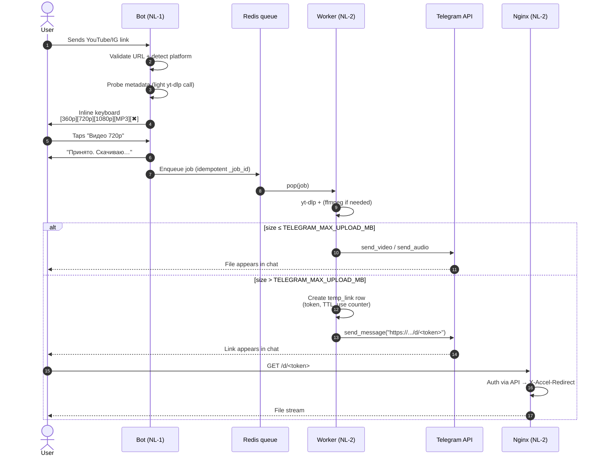
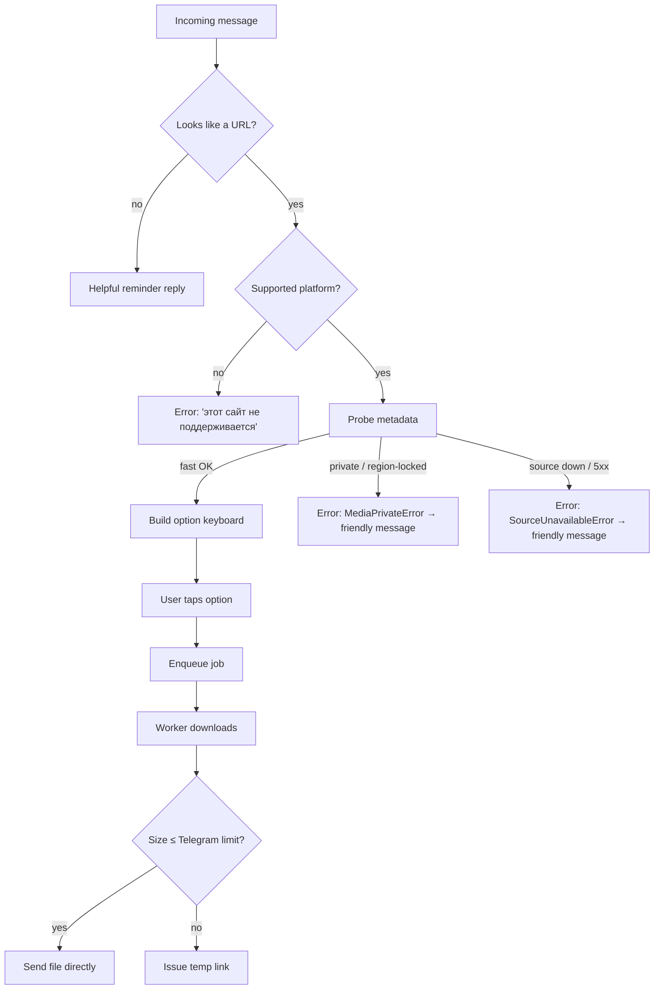

# 01 — Product purpose

> Status: Stable
> Audience: product, engineering, AI agents
> Read next: [`02-architecture.md`](02-architecture.md)

This document captures the *product intent* of DWTGBot — the **why**. Anything
in code or in other docs that contradicts this file should be flagged.

---

## 1. Problem statement

End-users want to grab media from public posts on YouTube and Instagram —
typically to watch offline, share, or archive — but the official apps make
this either impossible or inconvenient. Existing third-party tools are:

- web-based with intrusive ads,
- desktop-only,
- unreliable when sites change,
- or carry malware risk.

Telegram is where these users already are. A **bot inside their existing
chat client** removes the friction entirely: paste a link → tap a quality →
get the file.

---

## 2. Target users

| Persona | Need | How DWTGBot helps |
|---|---|---|
| **Casual viewer** | Grab a single short clip occasionally | Paste link → one tap → file in chat |
| **Power user** | Specific quality, audio-only podcasts, IG carousels | Multi-option keyboard, MP3 mode, ZIP for galleries |
| **Operator (you)** | A bot for a small community / personal use | Two-server stack, automated ops, predictable cost |

Out of personas: enterprise tenants, content creators (we don't re-encode
or watermark), public unauthenticated users at scale (we are not a SaaS).

---

## 3. User journey — happy path

End-to-end target: **< 60 s for a 5-minute 720p video** (most of the time
is spent in `yt-dlp` + ffmpeg, not in our pipeline).

### 3.1 Decision the bot makes per request

---

## 4. User journey — failure / edge cases

| Situation | Bot behaviour | Why |
|---|---|---|
| Unsupported domain (e.g. TikTok) | "Эта ссылка не поддерживается. Поддерживаются YouTube и Instagram." | Clear scope boundary; no false promise |
| Malformed URL | "Не удалось распознать ссылку. Пришли полный URL." | Fail fast, not silently |
| Private/region-locked content | "Это видео недоступно (приватное или региональное ограничение)." | Mapped from `MediaPrivateError` |
| Source temporarily down | "Источник сейчас недоступен. Попробуй позже." | Retryable; user-friendly |
| File too big for direct send | Auto-switch to temp link delivery | Transparent — user gets a link |
| Worker crash mid-job | arq retries up to `JOB_MAX_RETRIES`; if still failing — user sees an error msg | No silent loss |
| Stale callback (clicked an old keyboard) | "Эти варианты устарели. Пришли ссылку заново." | Old `request_id` → not in Redis state store |

The full mapping is in [`16-error-handling.md`](16-error-handling.md).

---

## 5. Functional scope (in / out)

### In scope

- Commands: `/start`, `/help`, `/about`, `/health`.
- YouTube downloads (video qualities + MP3 audio).
- Instagram downloads (single + carousel + photo/video filtering).
- Direct Telegram delivery for small files.
- Tokenized HTTPS link delivery for large files.
- Job queue with status tracking and retries.
- Operational tooling: backups, restore, cleanup, healthchecks, deploy.
- Structured JSON logging with correlation IDs.

### Out of scope (today)

- Other platforms (TikTok, Twitter/X, SoundCloud, Vimeo) — pluggable later
  via [`30-add-new-provider-guide.md`](30-add-new-provider-guide.md), but not
  shipped.
- User accounts / per-user quotas / billing.
- Bot admin web UI.
- Push notifications / scheduling / "watchlists".
- Re-encoding to arbitrary formats outside what `yt-dlp` postprocessors support.
- Subtitles / chapters extraction (could be added).
- Video editing (trim, crop) — explicit non-goal.
- Distributing pirated content from paywalled sources — we only handle
  publicly accessible URLs.

If a request lands in "out of scope", either reject it at the bot layer or
write an ADR before extending scope.

---

## 6. Non-functional goals

| Goal | Concrete target |
|---|---|
| Availability | Bot reachable ≥ 99.5% (single-region; depends on hosting) |
| Median small-file delivery | < 30 s from user tap to file in chat |
| Median large-file link issue | < 90 s from user tap to link in chat |
| Recovery point objective (RPO) | ≤ 24 h (daily Postgres backups) |
| Recovery time objective (RTO) | ≤ 60 min on a clean VM with backups in hand |
| Operability | One operator can run the system in part-time mode |
| Onboarding | A new dev should be productive in < 1 day with these docs |

---

## 7. Success criteria for a feature

A feature ships when **all** of these are true:

1. ✅ It maps to a documented user journey in this doc (or a new ADR adds one).
2. ✅ It does not change a `🔒 LOCKED` decision without superseding the ADR.
3. ✅ It has unit tests in `app/tests/` (no integration unless marked).
4. ✅ It updates the affected topic doc(s) under `docs/`.
5. ✅ It passes `ruff format --check`, `ruff check`, `mypy`, `pytest`.
6. ✅ For ops/deploy changes — `bash -n` on scripts and `shellcheck` clean.
7. ✅ For DB changes — Alembic migration + rollback path documented.
8. ✅ It does not log secrets and respects [`17-security.md`](17-security.md).

The full PR checklist lives in [`29-feature-development-guide.md`](29-feature-development-guide.md).

---

## 8. Anti-patterns (product-level, explicitly forbidden directions)

These would change the project's *nature*. They require a product-level
decision and supersession of this document — not just an engineering ADR:

- ❌ **Pivoting to a public, unauthenticated download service** ("anyone
  with the URL can use it") — breaks the hosting cost model and the
  ToS posture toward upstream platforms.
- ❌ **Storing user-uploaded content** (vs. fetched media) — turns the bot
  into general-purpose file hosting with completely different
  security / compliance / abuse-handling requirements.
- ❌ **Adding monetization** (ads, paid tier, tip jar inside the bot) —
  out of charter; introduces payment-processing scope nobody signed up for.
- ❌ **Removing temp-link expiry / use counter** — turns the system into
  a permanent CDN, which the storage budget does not support and which
  changes the compliance posture for cached media.
- ❌ **Adding human-in-the-loop moderation** of user content — would require
  a moderator workflow, queue UI, and audit pipeline far beyond our scope.
- ❌ **Re-encoding / watermarking / editing media** beyond what
  `yt-dlp` + `ffmpeg` postprocessors do as part of a download — moves
  the project into the "video editor" category.
- ❌ **Bypassing platform paywalls or DRM** — even if technically possible
  with a yt-dlp extractor; this is a hard "no" for legal and ethical reasons.

If a request from a stakeholder requires *any* of the above, do **not**
prototype it. Reply with a pointer to this section and ask for a written
product-level decision first.

---

## 9. Common product-level mistakes (and how to avoid them)

Mistakes that look like "small UX requests" but are really product
direction shifts in disguise. Spot them early.

| Surface request | Why it's actually a product shift | Correct response |
|---|---|---|
| "Can the bot keep the file forever — TTL is annoying" | Removes link expiry → permanent CDN → §8 | Explain the storage / compliance reason; offer to *increase* the TTL within reason via env var |
| "Let users upload their own videos and the bot just hosts them" | Crosses the fetched-vs-uploaded line → §8 | Out of scope; suggest a separate project |
| "Add a 'donate' button in `/help`" | Inline monetization → §8 | Out of charter; donation links can live outside the bot if the operator wants |
| "Auto-translate captions / generate subtitles" | New feature surface; ML stack; cost | ADR + explicit non-goal review before any code |
| "Allow batch links (50 URLs in one message)" | Changes rate-limit posture toward platforms; abuse vector | Reject in §10 below; if really needed, ADR + caps |
| "Show preview thumbnails before download" | Extra metadata roundtrip per URL → 2× upstream load | Acceptable only if cached and bounded; needs design doc |
| "Add a 'public bot' mode anyone can use" | Removes operator-as-gatekeeper → §8 | Hard no without a written abuse / quota model |

The pattern: **ask "does this change *who* the product is for or *what*
it stores?"** If yes → product decision, not engineering decision.

---

## 10. Future product extension points (kept open by design)

These are *not* committed roadmap items, but the architecture deliberately
leaves room for them. Each links to the technical extension point.

| Direction | Why it's plausible | Where the seam is | Read |
|---|---|---|---|
| **More platforms** (TikTok, SoundCloud, Vimeo, Twitter/X) | yt-dlp already supports them; only UX integration is missing | `app/infrastructure/providers/` + `Platform` enum | [`30-add-new-provider-guide.md`](30-add-new-provider-guide.md) |
| **Per-user quotas** (e.g. "X GiB / day") | Operator-level need once user count grows | `audit_logs` aggregation + bot pre-enqueue check | [`32-roadmap-and-extension-points.md`](32-roadmap-and-extension-points.md) §3 |
| **Object-storage backend** (S3-compatible) | Frees NL-2 disk; enables multi-region | `LocalStorage` swap + temp-link 307 redirect | [`11-storage-strategy.md`](11-storage-strategy.md) §12 |
| **Subtitles / chapters extraction** | Natural extension of yt-dlp postprocessors | New download `Option` + provider hook | [`07-provider-architecture.md`](07-provider-architecture.md) |
| **Localised UI strings** (currently RU-only) | i18n if user base grows beyond RU | `app/bot/strings/` (single source) | [`06-bot-flow.md`](06-bot-flow.md) |
| **Multiple operator deployments / shared installer** | Make it trivial to spin up a private clone | `deploy/scripts/install.sh` parametrisation | [`20-deployment.md`](20-deployment.md) |
| **Webhook mode** (instead of long polling) | Lower latency at scale | `app/bot/main.py` + Nginx route on NL-1 | ADR required (currently long-polling-only) |

If you implement one of these, update this table to mark it as shipped
(or move it into the in-scope section §5).

---

## 11. Glossary preview

For full definitions see [`33-glossary.md`](33-glossary.md). The terms you
will see most:

- **Job** — one user-initiated download (a row in `download_jobs`).
- **Provider** — code that knows one platform (`YouTubeProvider`, …).
- **Option** — a user-selectable choice on the keyboard (e.g. `video_720`).
- **Temp link** — a tokenized HTTPS URL serving one file with TTL + counter.
- **NL-1 / NL-2** — control plane / media plane servers.
