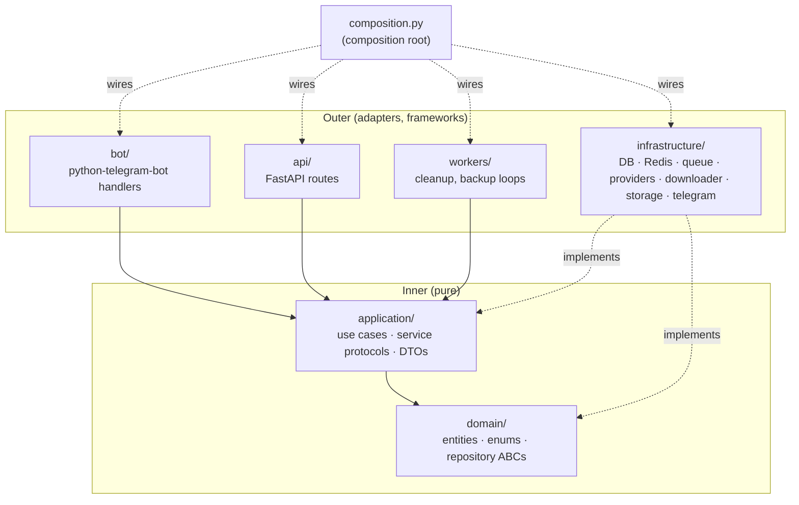
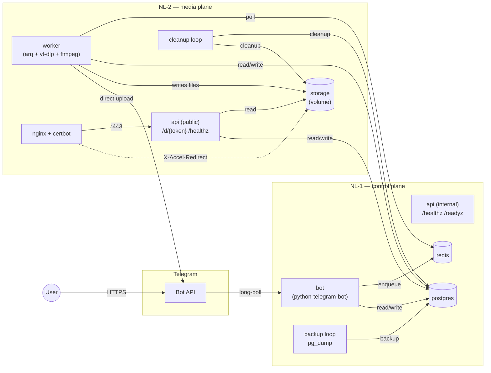
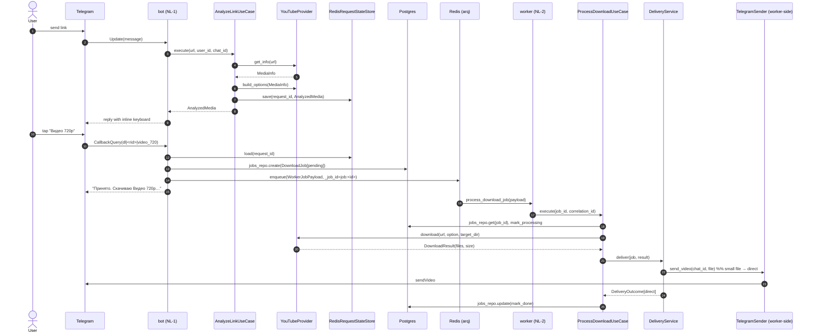
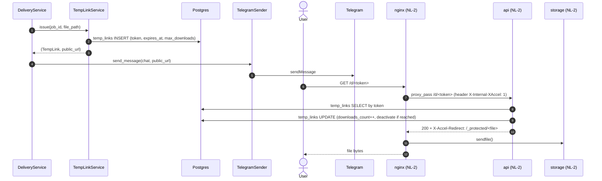
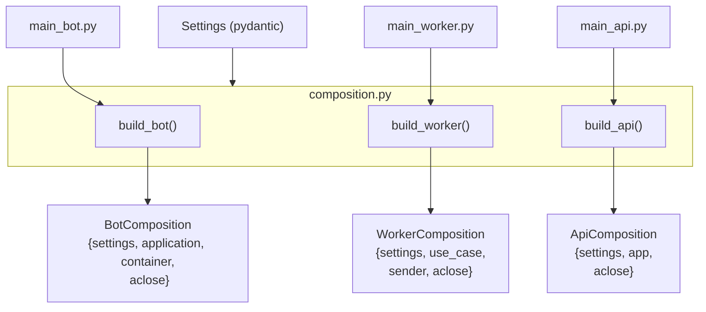

# 02 — Architecture

> Status: Stable
> Audience: engineers, architects, AI agents (mandatory before any change)
> Read next: [`03-project-structure.md`](03-project-structure.md), [`04-domain-model.md`](04-domain-model.md), [`05-data-flow.md`](05-data-flow.md)

This document is the canonical description of how DWTGBot is structured at
runtime and at the source level. It is the **first** doc to read before
making any non-trivial change.

---

## 1. Architectural style — hexagonal-lite

We follow a **layered (hexagonal-lite)** architecture with strict
dependency rules. The system is split into layers; **dependencies always
point inward** — outer layers (infrastructure, adapters) depend on inner
layers (application, domain), never the reverse.



**Reading the diagram:**
- Solid arrows = "depends on" (imports allowed).
- Dashed arrows = "implements / wires".
- The **composition root** (`app/composition.py`) is the *only* module that
  knows about both inner and outer layers. It instantiates concrete
  infrastructure and injects it into use cases.

For the precise import-allowed matrix see [`03-project-structure.md`](03-project-structure.md#7-dependency-rules--the-matrix).

---

## 2. Layer responsibilities

| Layer | Folder | Owns | Forbidden |
|---|---|---|---|
| **Domain** | `app/domain/` | Pure dataclass entities, enums, repository ABCs, business invariants | Importing infrastructure, importing application; no I/O |
| **Application** | `app/application/` | Use cases, service protocols (`Provider`, `QueueProducer`, `RequestStateStore`), DTOs | Importing infrastructure; instantiating concrete repos |
| **Infrastructure** | `app/infrastructure/` | DB (SQLAlchemy), Redis, arq, yt-dlp/ffmpeg runners, providers, storage, Telegram client | Containing business logic; bypassing `app/composition.py` |
| **Bot (adapter)** | `app/bot/` | python-telegram-bot handlers, callbacks, keyboards, middleware | Containing business logic; calling infrastructure directly |
| **API (adapter)** | `app/api/` | FastAPI routers, lifecycle, internal/public endpoints | Containing business logic; bypassing use cases |
| **Workers (adapter)** | `app/workers/` | Long-running loops (cleanup, backup) | Containing business logic; running outside the composition lifecycle |
| **Composition** | `app/composition.py` | The single composition root | Knowing UI/handler details |
| **Entrypoints** | `app/main_bot.py`, `main_api.py`, `main_worker.py` | Process startup, signal handling, calling composition | Holding any logic |

Each layer also has a topic doc in `docs/`:

- Domain: [`04-domain-model.md`](04-domain-model.md)
- Application + use cases: implied across [`05-data-flow.md`](05-data-flow.md), [`07-provider-architecture.md`](07-provider-architecture.md), [`09-queue-and-workers.md`](09-queue-and-workers.md)
- Infrastructure (providers): [`07-provider-architecture.md`](07-provider-architecture.md), [`08-download-pipeline.md`](08-download-pipeline.md)
- Bot: [`06-bot-flow.md`](06-bot-flow.md)
- API: [`10-temp-links-and-delivery.md`](10-temp-links-and-delivery.md), [`15-healthchecks.md`](15-healthchecks.md)
- Workers: [`23-cleanup-retention.md`](23-cleanup-retention.md), [`22-backup-restore.md`](22-backup-restore.md)

---

## 3. Container view (runtime)

The system runs as a set of containers split across two servers connected by a
private network (e.g. WireGuard).



Notes:

- **Telegram → bot**: long-polling. Bot makes outbound calls only.
- **bot → redis/postgres**: local docker network on NL-1.
- **worker on NL-2 → redis/postgres on NL-1**: over WireGuard private subnet.
  Postgres/Redis are firewalled from the public internet.
- **worker → Telegram**: the worker holds its own `telegram.Bot` client and
  uploads media directly, bypassing the bot process. This avoids piping large
  files through the bot's event loop.
- **Public traffic → nginx (NL-2)**: only ports 80/443 are open. `:80` exists
  only for ACME challenges; everything else redirects to `:443`.

For the deeper Docker layout and volumes see [`19-docker-architecture.md`](19-docker-architecture.md).

---

## 4. Sequence — small-file YouTube download



For the large-file path and the temp-link sequence see [`10-temp-links-and-delivery.md`](10-temp-links-and-delivery.md).

---

## 5. Sequence — large-file delivery (temp link)



Why this dance:
- **Authentication stays in Python.** Token lookup, expiry check, counter
  decrement happen in FastAPI.
- **Bytes are served by nginx**, never by Python. Memory-safe and
  high-throughput via the kernel `sendfile()` path.
- The `/_protected/` Nginx location is `internal` — direct GET from the
  outside returns 404. There is no way to access a file without a valid
  token.

---

## 6. Data flow — high level

```mermaid
flowchart LR
    URL[/Telegram message<br/>with URL/] --> Detect[detect_platform]
    Detect -->|Platform| Provider
    Provider -->|MediaInfo| Options[build_options]
    Options -->|AnalyzedMedia| State[(Redis<br/>state store)]
    Options --> KB[Inline keyboard]
    KB -->|callback dl|rid|key| Resolve[load AnalyzedMedia]
    Resolve --> Job[(jobs row<br/>pending)]
    Job --> Queue[(Redis arq queue)]
    Queue --> Worker[worker process]
    Worker --> ytdlp[yt-dlp + ffmpeg]
    ytdlp --> Files[(STORAGE_PATH)]
    Files --> Delivery{size <= telegram limit?}
    Delivery -- yes --> SendDirect[Telegram sendVideo/Document/Audio]
    Delivery -- no --> TempLink[(temp_links row)]
    TempLink --> URLOut[/HTTPS link to user/]
    URLOut --> Nginx[nginx X-Accel-Redirect]
    Nginx --> Files
```

End-to-end narrative version: [`05-data-flow.md`](05-data-flow.md).

---

## 7. Composition root pattern

`app/composition.py` is the **only** module that imports both inner and
outer layers. It builds three "compositions":



Why three separate compositions:

- Each process needs a **different subset** of dependencies (the bot does not
  need a `TelegramSender` worker-side client; the worker does not need
  `python-telegram-bot` Application; the API does not need either).
- Cleanly separating them makes startup faster and reduces blast radius:
  if FastAPI fails to load, the bot is unaffected.
- Each composition exposes an `aclose()` for ordered, idempotent shutdown.

For test purposes, fakes can be passed to any layer because the inner layers
depend on protocols/ABCs, not concretions.

---

## 8. Why this architecture (decision summary)

This section consolidates the *why*. Full reasoning lives in the ADRs.

> 🔒 **Canonical lock register:** [ADR-0005 — Locked architectural assumptions](adr/0005-locked-architectural-assumptions.md)
> §2 enumerates the twelve foundational decisions. The table below maps
> each architectural principle to its ADR(s); cells pointing to ADR-0005
> reference the relevant section there.

| Decision | Why we did it | ADR |
|---|---|---|
| Hexagonal layering | Testability with fakes; allow swapping infra | (foundational principle; see this doc §§1–4) |
| Two-server topology | Blast radius isolation, security, scaling | [ADR-0001](adr/0001-two-server-topology.md) + [ADR-0005 §3.2](adr/0005-locked-architectural-assumptions.md) |
| NL-1 service composition | Stateful + non-public co-located; minimal firewall surface | [ADR-0005 §3.3](adr/0005-locked-architectural-assumptions.md) |
| NL-2 service composition | Media-traffic-heavy + public; isolated from control plane | [ADR-0005 §3.4](adr/0005-locked-architectural-assumptions.md) |
| Python 3.14+ | Ecosystem fit (yt-dlp, telegram, fastapi); typing maturity; PEP 749 / 750 / 779 / JIT (see [ADR-0009](adr/0009-python-314-runtime.md)) | [ADR-0005 §3.1](adr/0005-locked-architectural-assumptions.md), [ADR-0009](adr/0009-python-314-runtime.md) |
| Bot framework `python-telegram-bot` | Async, mature, well-maintained | [ADR-0002](adr/0002-python-telegram-bot.md) |
| Redis queue (arq) | Already needed for state; one infra component fewer | [ADR-0005 §3.6](adr/0005-locked-architectural-assumptions.md) |
| PostgreSQL as source of truth | Strong typing, transactions, migrations | [ADR-0005 §3.7](adr/0005-locked-architectural-assumptions.md) |
| Temp links over storing in Telegram | Telegram 50 MB limit; deletion control; no third-party dependency for "permanent" links | [ADR-0004](adr/0004-temp-links-via-nginx-x-accel.md) + [ADR-0005 §3.8](adr/0005-locked-architectural-assumptions.md) |
| Provider pattern | Per-platform isolation, extensibility, testability | [ADR-0005 §3.5](adr/0005-locked-architectural-assumptions.md) |
| Structured JSON logging | Correlation IDs across services; jq-driven runbooks | [ADR-0005 §3.9](adr/0005-locked-architectural-assumptions.md) |
| Docker + Compose | Reproducible, idempotent, low-ceremony | [ADR-0005 §3.10](adr/0005-locked-architectural-assumptions.md) |
| GitHub Actions CI/CD | Co-located with code, free tier, single auth surface | [ADR-0005 §3.11](adr/0005-locked-architectural-assumptions.md) |
| Bash TUI installer | Bash present everywhere; right size for the operator flow | [ADR-0005 §3.12](adr/0005-locked-architectural-assumptions.md) |
| `ruff format` (no `black`) | Single tool; faster on this codebase | [ADR-0003](adr/0003-ruff-format-no-black.md) |
| Composition root | Single wiring location, easy to fake | (foundational principle; see `app/composition.py`) |
| Worker holds its own `telegram.Bot` | Bypass bot event loop for large uploads | (implied; see `09`, `10`) |
| Nginx `X-Accel-Redirect` | Auth in Python, bytes in nginx | [ADR-0004](adr/0004-temp-links-via-nginx-x-accel.md) |
| `pydantic-settings` fail-fast | Catch misconfig before traffic | (implied; see `13`) |

---

## 9. Anti-patterns (forbidden architectural moves)

These are *categorically* forbidden. A PR violating any of them will not
merge.

1. **Importing `app.infrastructure.*` from `app.domain.*` or `app.application.*`.**
   Breaks the layering and kills test isolation.
2. **Bypassing the composition root.** No module other than
   `app/composition.py`, `app/main_*.py`, and `app/bot/application.py`'s factory
   should instantiate concrete infrastructure (e.g. `RedisRequestStateStore()`).
   Use the protocol type, accept it via constructor injection.
3. **Calling `Provider`s from bot handlers directly.** Always go through a
   use case (`AnalyzeLinkUseCase`, `EnqueueDownloadUseCase`, …).
4. **Putting business decisions in handlers.** Handlers parse the update,
   call the use case, render the response. That's it.
5. **Letting domain entities depend on SQLAlchemy / Redis / arq.** Entities
   are pure dataclasses. ORM models live in `app/infrastructure/db/models.py`
   and are mapped from/to entities in repositories.
6. **Cross-server state sharing without DB or Redis.** No file-based ad-hoc
   queues, no shared NFS, no "just write a JSON in /tmp".
7. **Direct file system reads/writes outside `LocalStorage`.** Path traversal
   protection lives there; bypassing it is a security bug.
8. **Subprocess via shell strings or `shell=True`.** See [`08`](08-download-pipeline.md), [`17`](17-security.md).
9. **Mutating Alembic migrations after deploy.** See [`12`](12-db-schema.md).
10. **Adding a new top-level package** (sibling to `app/`, `deploy/`, `docker/`)
    without an ADR.

---

## 10. Extension points

Where you are *expected* to plug in:

| Need | Plug here | Guide |
|---|---|---|
| New media platform | `app/infrastructure/providers/<name>.py` + register in `DefaultProviderRegistry` | [`30-add-new-provider-guide.md`](30-add-new-provider-guide.md) |
| New bot command | `app/bot/handlers/commands.py` + register in `app/bot/application.py` | [`28-implementation-playbook.md`](28-implementation-playbook.md) |
| New use case | `app/application/use_cases/<name>.py` + wire in `composition.py` | [`28-implementation-playbook.md`](28-implementation-playbook.md) |
| New healthcheck | `app/api/internal/health.py` (extend `readyz`) | [`15-healthchecks.md`](15-healthchecks.md) |
| New env variable | `app/config.py` (`Settings`) + `.env.example` + `13-config-and-env.md` | [`13`](13-config-and-env.md), [`27`](27-coding-standards.md) |
| New DB table / column | New Alembic migration + new ORM model + new repo | [`12-db-schema.md`](12-db-schema.md), [`28`](28-implementation-playbook.md) |
| New worker (long-running) | `app/workers/<name>_worker.py` + service in compose | [`23-cleanup-retention.md`](23-cleanup-retention.md) (template) |
| New deploy script | `deploy/scripts/<name>.sh` sourcing `helpers.sh` | [`20-deployment.md`](20-deployment.md), [`27`](27-coding-standards.md) |

---

## 11. Things that look like they should be extension points but are not

- **Adding a second bot framework.** No. python-telegram-bot is locked.
- **Replacing arq with Celery / Dramatiq.** No. Locked by [ADR-0005 §3.6](adr/0005-locked-architectural-assumptions.md).
- **Splitting infrastructure into multiple Python packages.** No. Single
  `app.infrastructure.*` keeps imports predictable.
- **Adding a new "domain service" layer between `application` and `domain`.**
  No. Use cases are the only orchestration layer.
- **Replacing FastAPI with another HTTP framework.** Not without an ADR;
  the public temp-link endpoint and healthchecks are tightly coupled to
  FastAPI lifespan + uvicorn signals.

---

## 12. Diagrams "as code" — keeping them honest

All diagrams in this doc are written in Mermaid and are checked by humans
during PR review. There is no automated verification. Rules to keep them
useful:

- Keep them small. Each diagram answers **one** question.
- Update them in the **same PR** as the code change they describe.
- Do not add stylistic noise (icons, colors) unless it adds info.
- If a diagram contradicts the code — the diagram is wrong by definition;
  fix it before merging.

---

## 13. Summary checklist for changes touching architecture

Use this before opening a PR that affects layer boundaries, the composition
root, the data flow, or the deployment topology.

- [ ] Does the change preserve the dependency direction (outer → inner)?
- [ ] Did I update [`02-architecture.md`](02-architecture.md) and the
      affected sequence diagram?
- [ ] Did I add a `🔒 LOCKED` ADR if the change is architectural?
- [ ] Did I keep [`33-glossary.md`](33-glossary.md) consistent
      (no new term left undefined)?
- [ ] Did I update any of: [`05-data-flow.md`](05-data-flow.md),
      [`19-docker-architecture.md`](19-docker-architecture.md),
      [`20-deployment.md`](20-deployment.md) if their diagrams changed?
- [ ] Did I keep the composition root the only wiring point?
- [ ] Did I extend the relevant test fixtures, not bypass them?
