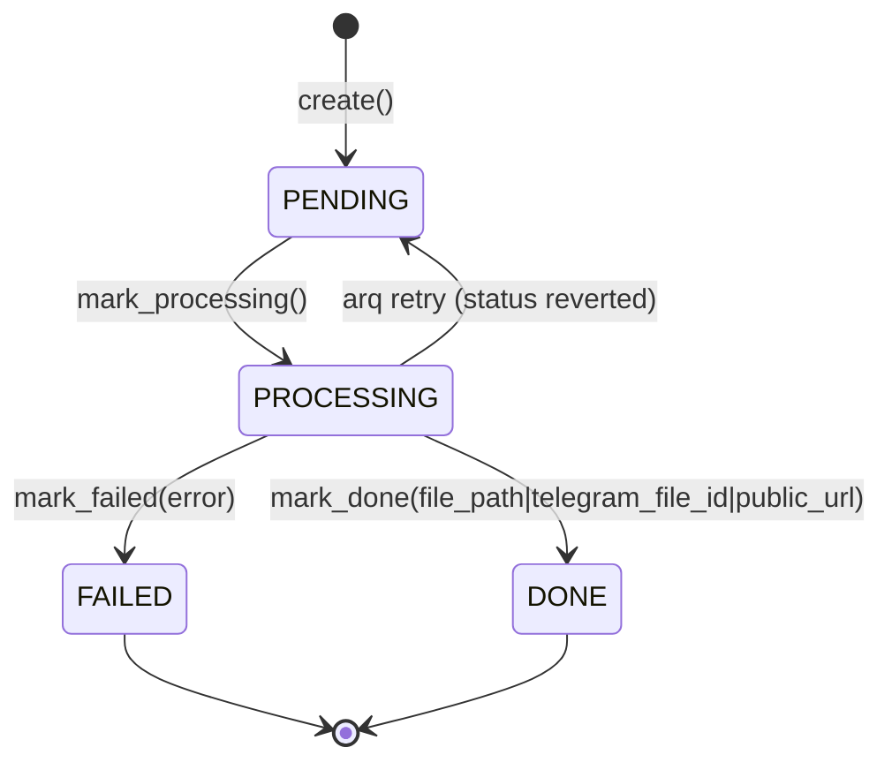
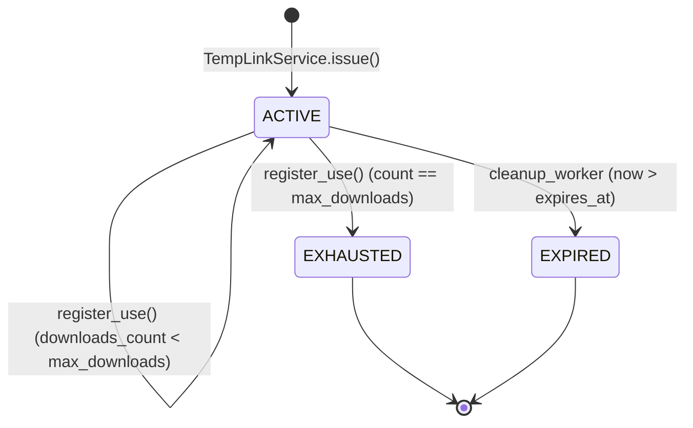
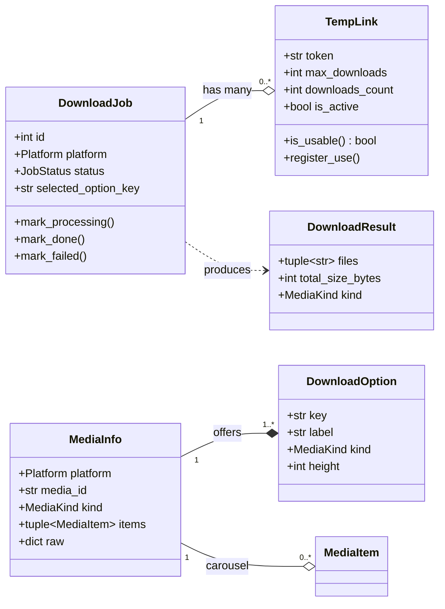

# 04 — Domain model

> Status: Stable
> Audience: engineers, AI agents
> Read next: [`05-data-flow.md`](05-data-flow.md), [`12-db-schema.md`](12-db-schema.md)

This document defines the **language** the system uses internally: entities,
value objects, enums, their invariants, and their state machines. The domain
layer in `app/domain/` is the source of truth — ORM models in
`app/infrastructure/db/models.py` mirror these entities, never the reverse.

---

## 1. Entity catalogue

| Entity | Module | Lifetime | Persisted | Mutability |
|---|---|---|---|---|
| `DownloadJob` | `app/domain/entities/download_job.py` | minutes–hours | `download_jobs` table | mutable (state machine) |
| `MediaInfo` | `app/domain/entities/media_info.py` | seconds (in-flight, optionally cached) | `media_cache` table | frozen |
| `DownloadOption` | same module | seconds (UI keyboard) | no | frozen |
| `MediaItem` | same module | inside `MediaInfo` | no | frozen |
| `DownloadResult` | same module | seconds (worker → delivery) | no | frozen |
| `TempLink` | `app/domain/entities/temp_link.py` | hours–days | `temp_links` table | mutable (counter) |
| `MediaCacheRecord` | (DTO + ORM) | until expiry | `media_cache` | mutable on upsert |
| `AuditEvent` | (ORM only, optional) | append-only | `audit_logs` | immutable |

### Cross-cutting enums (`app/domain/enums.py`)

```python
class Platform(str, Enum):     YOUTUBE = "youtube";    INSTAGRAM = "instagram"
class JobStatus(str, Enum):    PENDING = "pending";    PROCESSING = "processing"
                               DONE    = "done";       FAILED     = "failed"
class MediaKind(str, Enum):    VIDEO = "video";        AUDIO   = "audio"
                               PHOTO = "photo";        GALLERY = "gallery"
class DeliveryMethod(str, Enum): TELEGRAM_UPLOAD = "telegram_upload"
                                 TEMP_LINK       = "temp_link"
```

All enums inherit from `str` so they round-trip through Postgres native ENUM
and JSON without manual conversion.

---

## 2. `DownloadJob` — the central entity

### Shape

```python
@dataclass(slots=True)
class DownloadJob:
    id: int | None
    user_id: int
    chat_id: int
    source_url: str
    platform: Platform
    media_id: str | None
    title: str | None
    selected_option_key: str | None       # opaque to the bot, meaningful to the provider
    selected_format: str | None           # provider-resolved format string (e.g. yt-dlp spec)
    status: JobStatus = JobStatus.PENDING
    file_path: str | None
    file_size: int | None
    mime_type: str | None
    telegram_file_id: str | None
    public_url: str | None
    error_message: str | None
    retries_count: int = 0
    extra: dict[str, Any]
    created_at: datetime
    updated_at: datetime
    completed_at: datetime | None
```

### Invariants

- `id` is `None` only before persistence; the repository sets it on `create`.
- `created_at`, `updated_at` are timezone-aware UTC.
- `error_message` is truncated to 1000 chars by `mark_failed`.
- `retries_count >= 0` (DB CHECK constraint mirrors this).
- After `mark_done` or `mark_failed`, `completed_at` is set and equals
  `updated_at`.
- A `DONE` job has at least one of: `file_path`, `telegram_file_id`,
  `public_url`. (Soft invariant — enforced by `DeliveryService`, not DB.)

### State machine



Notes:
- arq retries handle the `PROCESSING → PENDING` transition; the worker
  marks `PROCESSING` again on the next pickup.
- We do not have a `CANCELLED` state. If we add one (e.g. user pressed
  "Cancel" before the worker started), update this diagram **and** the
  state-transition table in [`09-queue-and-workers.md`](09-queue-and-workers.md).

### Methods

| Method | Effect |
|---|---|
| `mark_processing()` | `status → PROCESSING`, refresh `updated_at` |
| `mark_done(...)` | `status → DONE`, set delivery fields, `completed_at` = now |
| `mark_failed(error_message)` | `status → FAILED`, store truncated error, `completed_at` = now |

These methods are the *only* sanctioned way to mutate `status`. Bypassing
them in a repository implementation is a bug.

---

## 3. `MediaInfo`, `DownloadOption`, `MediaItem`, `DownloadResult`

### `DownloadOption` — what the user picks

```python
@dataclass(frozen=True, slots=True)
class DownloadOption:
    key: str                      # opaque to bot; resolved by the provider
    label: str                    # human-readable; rendered in the inline keyboard
    kind: MediaKind
    height: int | None            # video resolution bucket (None for audio)
    bitrate_kbps: int | None
    container: str | None         # "mp4", "mp3", "zip", ...
    estimated_size_bytes: int | None
```

Invariant: `key` is unique within a `MediaInfo`'s option list.
The bot never inspects `key`; it round-trips it through Telegram callback
data and back to the provider.

### `MediaItem` — one element of a gallery

```python
@dataclass(frozen=True, slots=True)
class MediaItem:
    kind: MediaKind
    url: str
    width: int | None
    height: int | None
    duration_sec: float | None
```

Used by Instagram for carousel items; YouTube does not populate this.

### `MediaInfo` — provider-agnostic metadata

```python
@dataclass(frozen=True, slots=True)
class MediaInfo:
    platform: Platform
    media_id: str
    title: str
    kind: MediaKind                       # primary kind; gallery → MediaKind.GALLERY
    duration_sec: float | None
    items: tuple[MediaItem, ...]          # empty for non-galleries
    thumbnail_url: str | None
    raw: dict[str, Any]                   # provider-specific stash (do not depend on
                                          #   it from outside the provider)
```

Invariants:
- `media_id` is always a non-empty string (provider-specific format).
- `raw` may carry whatever the provider needs at download time (e.g.
  `available_heights`, `webpage_url`, `gallery_urls`). The bot must not rely
  on `raw`.

### `DownloadResult` — what the worker hands to delivery

```python
@dataclass(frozen=True, slots=True)
class DownloadResult:
    files: tuple[str, ...]                # absolute paths inside STORAGE_PATH
    total_size_bytes: int
    primary_mime: str
    title: str
    kind: MediaKind
```

Invariants:
- All paths in `files` are under `STORAGE_PATH` (verified by `LocalStorage`).
- `total_size_bytes` is the sum of file sizes on disk at result time, not an
  estimate.
- `kind` determines how `DeliveryService` uploads: `VIDEO` → `sendVideo`,
  `AUDIO` → `sendAudio`, `PHOTO` → `sendPhoto`, otherwise `sendDocument` /
  ZIP-and-link.

---

## 4. `TempLink`

### Shape

```python
@dataclass(slots=True)
class TempLink:
    id: int | None
    token: str                            # secrets.token_urlsafe(TEMP_LINK_TOKEN_BYTES)
    job_id: int
    file_path: str                        # absolute path under STORAGE_PATH
    expires_at: datetime                  # UTC, > created_at
    max_downloads: int                    # >= 1
    downloads_count: int = 0              # 0 .. max_downloads
    is_active: bool = True
    created_at: datetime
    updated_at: datetime
```

### Invariants

- `token` is unique (DB UNIQUE).
- `max_downloads >= 1` (DB CHECK).
- `0 <= downloads_count <= max_downloads`.
- `is_active` becomes `False` permanently once `downloads_count == max_downloads`
  (set inside `register_use()`); cleanup also flips `is_active` for expired
  links.
- `file_path` must be under `STORAGE_PATH` — verified at issue and again at
  serve.

### Lifecycle



### Method semantics

| Method | Effect |
|---|---|
| `is_usable(now=None)` | Returns `True` iff `is_active and expires_at > now and downloads_count < max_downloads` |
| `register_use()` | `downloads_count += 1`; if equal to `max_downloads`, set `is_active = False`. **Idempotent caller responsibility:** repository must persist *after* this call to avoid lost updates |

### Why a counter rather than a one-shot bool

Some users open a link twice (mobile preview + browser), or share it within a
small group. `max_downloads = 5` is the comfortable default. Setting
`max_downloads = 1` makes it one-shot.

---

## 5. `MediaCacheRecord` (cache table)

There is no Python entity for this — it lives only as an ORM model and a
repository (`SqlAlchemyMediaCacheRepository`). It exists to short-circuit
metadata fetches (yt-dlp's `extract_info`) when the same link is sent again
within `MEDIA_CACHE_TTL_SECONDS`.

| Field | Notes |
|---|---|
| `source_url` | UNIQUE; lookup key |
| `platform` | denormalized, useful for stats |
| `media_id` | indexed for cross-link discovery |
| `title` | quick UI hint |
| `metadata_json` | `MediaInfo.raw`-shaped JSONB |
| `expires_at` | TTL boundary |

The application layer treats expired rows as absent.

---

## 6. State / type interactions



---

## 7. Repository ABCs (in `app/domain/repositories/`)

The domain defines **what** persistence operations exist. Concrete
implementations live in `app/infrastructure/db/repositories/`.

### `JobsRepository`

```python
class JobsRepository(ABC):
    async def create(self, job: DownloadJob) -> DownloadJob: ...
    async def get(self, job_id: int) -> DownloadJob | None: ...
    async def update(self, job: DownloadJob) -> DownloadJob: ...
    async def increment_retries(self, job_id: int) -> int: ...
```

Contract:
- `create` sets `id` on the returned entity.
- `update` is whole-row; partial updates not exposed (keeps it boring).
- `increment_retries` is the single atomic op for retry bookkeeping.

### `TempLinksRepository`

```python
class TempLinksRepository(ABC):
    async def create(self, link: TempLink) -> TempLink: ...
    async def get_by_token(self, token: str) -> TempLink | None: ...
    async def update(self, link: TempLink) -> TempLink: ...
    async def deactivate_expired(self) -> int: ...                # batch op for cleanup
    async def list_inactive_with_files(self, limit: int = 500) -> list[TempLink]: ...
```

### `MediaCacheRepository`

```python
class MediaCacheRepository(ABC):
    async def upsert(self, source_url: str, *, platform: Platform,
                     media_id: str | None, title: str | None,
                     metadata: dict[str, Any], ttl_seconds: int) -> None: ...
    async def get_fresh(self, source_url: str) -> MediaCacheRecord | None: ...
    async def purge_expired(self) -> int: ...
```

---

## 8. How entities map to DB

| Entity | ORM model | Notes |
|---|---|---|
| `DownloadJob` | `DownloadJobModel` | Postgres native ENUM for `platform`, `status` |
| `TempLink` | `TempLinkModel` | UNIQUE token + CASCADE to `download_jobs.id` |
| `MediaCacheRecord` | `MediaCacheModel` | UNIQUE `source_url`; `JSONB` for `metadata_json` |
| (none) | `AuditLogModel` | optional structured event log |
| (none) | `AppSettingModel` | runtime feature flags |

Mapping is done inside repository implementations. The application never
sees ORM types. See [`12-db-schema.md`](12-db-schema.md) for the full
schema, indexes, and migration policy.

---

## 9. Anti-patterns

1. **Adding a SQLAlchemy `Mapped[...]` annotation to a domain entity.** Domain
   stays pure; ORM lives in `infrastructure/db/models.py`.
2. **Mutating `status` outside `mark_*` methods.** Skips state-transition
   validation and breaks readability of state changes in code review.
3. **Using `MediaInfo.raw` from outside the owning provider.** It is a
   provider-private stash; cross-reading it couples layers.
4. **Storing time as naive datetimes anywhere.** Always tz-aware UTC.
5. **Adding fields to entities without updating the ORM model AND the
   migration.** All three must move together in the same PR.
6. **Treating `DownloadOption.key` as a structured value.** It is opaque to
   anything outside the provider that produced it. Do not parse it in the bot.
7. **Decrementing `downloads_count` on errors.** A served byte is a served
   byte; if you rolled back the response, that's an operational concern, not
   a domain concern.

---

## 10. Common mistakes

| Mistake | Fix |
|---|---|
| New "delivery field" added to `DownloadJob` but `mark_done` not updated | Update `mark_done` to set the new field; otherwise it never persists |
| Compared a `Platform` enum to a raw string | Use `Platform.YOUTUBE`; do not write `"youtube"` literals |
| Returned `DownloadJob` from a repository without an `id` | Repository contract requires `id` set after `create`; assert in tests |
| Set `expires_at = datetime.utcnow()` (naive) | Use `datetime.now(timezone.utc)` everywhere |
| Tried to cache `MediaInfo` containing absolute file paths | `MediaInfo` is metadata only; paths are in `DownloadResult` and never persisted |

---

## 11. Extension checklist — adding a new entity

- [ ] Define the dataclass in `app/domain/entities/<name>.py`. Pure, no I/O.
- [ ] Define invariants in methods, not callers.
- [ ] Add a repository ABC if it has its own persistence lifecycle.
- [ ] Add the ORM model in `app/infrastructure/db/models.py`.
- [ ] Add the repository implementation under
      `app/infrastructure/db/repositories/`.
- [ ] Generate an Alembic migration; review the diff.
- [ ] Wire the repository in `app/composition.py`.
- [ ] Add unit tests for the entity (state machine, invariants).
- [ ] Add a section to this document.
- [ ] Update [`12-db-schema.md`](12-db-schema.md).
- [ ] Update [`33-glossary.md`](33-glossary.md) with the new term.
