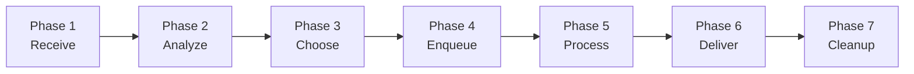
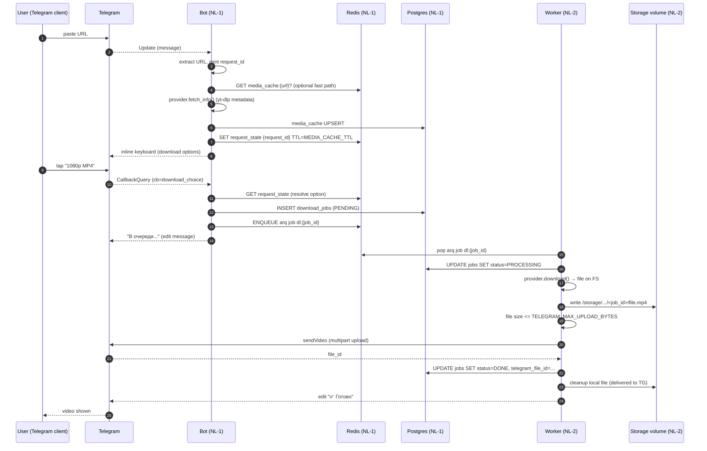
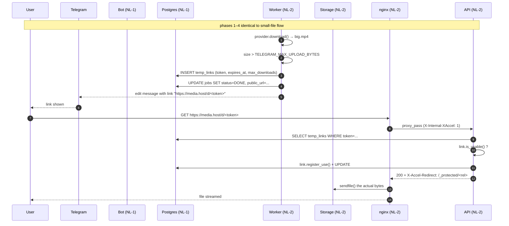
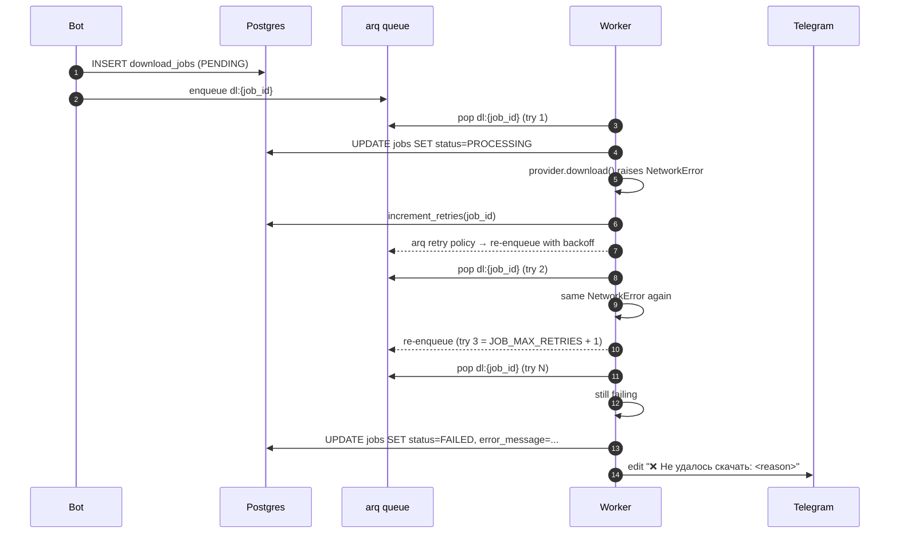
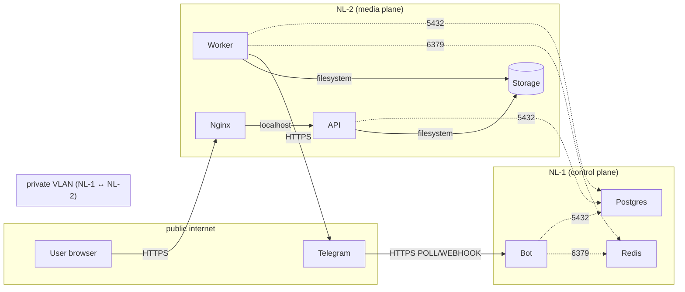

# 05 — Data flow

> Status: Stable
> Audience: engineers, AI agents
> Read next: [`06-bot-flow.md`](06-bot-flow.md), [`08-download-pipeline.md`](08-download-pipeline.md), [`10-temp-links-and-delivery.md`](10-temp-links-and-delivery.md)

This document traces a request from the moment a user pastes a URL to the
moment they receive a file (or a link). It complements
[`02-architecture.md`](02-architecture.md), which described the *static*
arrangement of components; here we describe the *dynamic* journey of data.

> **Authoritative invariant.** A request is identified by a deterministic
> `request_id`. The same `request_id` survives across the bot, Redis state
> store, arq queue, worker, and structured log lines. If you break this
> invariant you break correlation and observability simultaneously.

---

## 1. Conceptual phases

| Phase | Where it runs | Side effects |
|---|---|---|
| 1. Receive | bot (NL-1) | log line, `request_id` minted |
| 2. Analyze | bot (NL-1) → provider (yt-dlp) on NL-1 *only for metadata* | `media_cache` upsert, Redis state put |
| 3. Choose | bot (NL-1) | Redis state read; inline keyboard |
| 4. Enqueue | bot (NL-1) | row in `download_jobs`, arq job pushed to Redis |
| 5. Process | worker (NL-2) | `download_jobs` row updated, file in `STORAGE_PATH` |
| 6. Deliver | worker (NL-2) → Telegram or → `temp_links` row | `download_jobs.status = DONE`, optional `temp_links` row |
| 7. Cleanup | scheduler (NL-2) | files unlinked, `temp_links.is_active = false` |

---

## 2. Identifiers and correlation

Every request gathers identifiers as it flows. We log them as structured
fields (see [`13-config-and-env.md`](13-config-and-env.md) and
[`14-logging-observability.md`](14-logging-observability.md)).

| Identifier | Source | Lives in | Purpose |
|---|---|---|---|
| `update_id` | Telegram | bot logs | Trace a single Telegram update |
| `chat_id`, `user_id` | Telegram | bot + worker logs | User-level filtering |
| `request_id` | minted by bot middleware | logs everywhere | Correlate one user request end-to-end |
| `job_id` | DB sequence | logs from enqueue onward, arq job id | Correlate background processing |
| `arq_job_id` | deterministic: `dl:{job_id}` | arq queue | Idempotent enqueue |
| `token` | `TempLinkService.issue` | logs (truncated), `temp_links` row | Identify a delivery URL |

Idempotency: posting the same URL twice yields two different `request_id`s but
**reuses the same `arq_job_id`** (`dl:{job_id}`) once enqueued. arq de-dupes
by job id.

---

## 3. End-to-end happy path (small file)

Persisted state at the end:
- `download_jobs(id=N).status = DONE`
- `download_jobs(id=N).telegram_file_id = ...`
- File **removed** from disk (delivered to Telegram, no need to keep it).
- `media_cache(source_url).expires_at` refreshed.

---

## 4. End-to-end happy path (large file → temp link)

Persisted state at the end of the first download:
- `download_jobs(id=N).public_url` set, `status = DONE`.
- `temp_links(token).downloads_count = 1`.
- File **kept** on disk until the link is exhausted/expired (see Phase 7).

---

## 5. End-to-end failure path

State at the end:
- `download_jobs(id=N).status = FAILED`
- `download_jobs(id=N).retries_count = JOB_MAX_RETRIES`
- `download_jobs(id=N).error_message` truncated to 1000 chars.
- File partially written? → cleanup workflow removes it on its next pass.

---

## 6. Where data lives at each step

This is the **single source of truth** for "where is X right now?" — refer
to it during incident triage.

| Data | Phase 1 | Phase 2 | Phase 3 | Phase 4 | Phase 5 | Phase 6 | Phase 7 |
|---|---|---|---|---|---|---|---|
| URL | Telegram update | Bot in-memory | Redis state | `download_jobs.source_url` | same | same | same (if kept) |
| Resolved option | — | Bot in-memory | Redis state | `download_jobs.selected_format` | same | same | same |
| Job row | — | — | — | `download_jobs` (PENDING) | PROCESSING | DONE/FAILED | DONE (or removed if `purge_done_after`) |
| Downloaded file | — | — | — | — | `STORAGE_PATH/.../job_id/...` | same (if temp link) or **deleted** (if TG upload) | deleted on link expiry |
| Telegram file_id | — | — | — | — | — | `download_jobs.telegram_file_id` | same |
| Public URL | — | — | — | — | — | `download_jobs.public_url`, `temp_links` | same until cleanup |

---

## 7. Cross-network data movement

This is **the most security-relevant** view of the system.

Rules enforced by the firewall config (see
[`20-deployment.md`](20-deployment.md)):

- **Public internet**: only Nginx on NL-2 (`80/tcp`, `443/tcp`) and Bot's
  outgoing connections to Telegram.
- **Private VLAN**: Postgres `5432/tcp` and Redis `6379/tcp` on NL-1 are
  reachable **only** from NL-2's private IP.
- **NL-2 internal**: API listens on `127.0.0.1:8001` only; Nginx is the
  sole front door. Worker listens on nothing.

If you find any process listening on a public IP that isn't Nginx, that's a
firewall regression — escalate.

---

## 8. Caching layers (where data is duplicated)

| Cache | Scope | TTL | Invalidation |
|---|---|---|---|
| `media_cache` (Postgres) | per-URL metadata | `MEDIA_CACHE_TTL_SECONDS` | row TTL (lazy on read) + `purge_expired` cron |
| Redis `request_state` | per-update conversation state | `MEDIA_CACHE_TTL_SECONDS` | TTL eviction |
| Telegram `file_id` | per-job (in `download_jobs.telegram_file_id`) | as long as Telegram keeps the file | none from our side |
| HTTP cache (Nginx) | none for `/d/{token}` (`Cache-Control: no-store`) | n/a | n/a |

We deliberately do **not** cache `DownloadResult` files between users — same
URL re-downloaded by another user creates a fresh job. The reason: per-user
cookies/auth could surface different content, and we'd rather pay the
bandwidth than ship the wrong file.

---

## 9. Data destruction guarantees

| Data | When destroyed | Who destroys it |
|---|---|---|
| Local downloaded file (delivered to TG) | immediately after upload | worker (`process_download` use case) |
| Local downloaded file (delivered via link) | on link expiry / exhaustion | cleanup worker (NL-2 scheduler) |
| `temp_links` row | flag `is_active=false` set; row deleted lazily | cleanup worker |
| `download_jobs` row | retained (for audit) unless explicit purge configured | DBA / future migration |
| Redis `request_state` | TTL | Redis itself |

We rely on cleanup running. If it stops, **NL-2 disk fills up** — see
[`31-troubleshooting.md`](31-troubleshooting.md) for triage.

---

## 10. Anti-patterns

1. **Fanning a single request out into multiple jobs.** One user URL = one
   `DownloadJob` row = one arq job. Galleries are handled inside one job.
2. **Storing the file path in the bot.** The bot never sees `STORAGE_PATH`;
   only the worker and the API do.
3. **Reading from `media_cache` directly in the worker.** The worker uses
   the provider; the provider may consult cache, but the worker should not
   bypass it.
4. **Forwarding `DownloadJob` ORM objects to the bot for display.** The bot
   never imports ORM types — pass domain entities or render strings only.
5. **Letting an untrusted URL reach the worker without DB persistence.**
   The DB row is the audit record; if it isn't there, we can't trace it.

---

## 11. Common mistakes

| Mistake | Symptom | Fix |
|---|---|---|
| Two arq jobs created for the same `job_id` | duplicate uploads | Producer must use `_job_id="dl:{job_id}"` |
| Worker logs missing `job_id` | hard to debug | Use `bind_correlation(job_id=...)` at the top of the use case |
| File deleted before Telegram upload completed | `404 Not Found` from TG | Always `await` `sender.send_*` before unlinking |
| Temp link served while file already deleted | `410 Gone` from API | This is *correct*; UI message should explain it |
