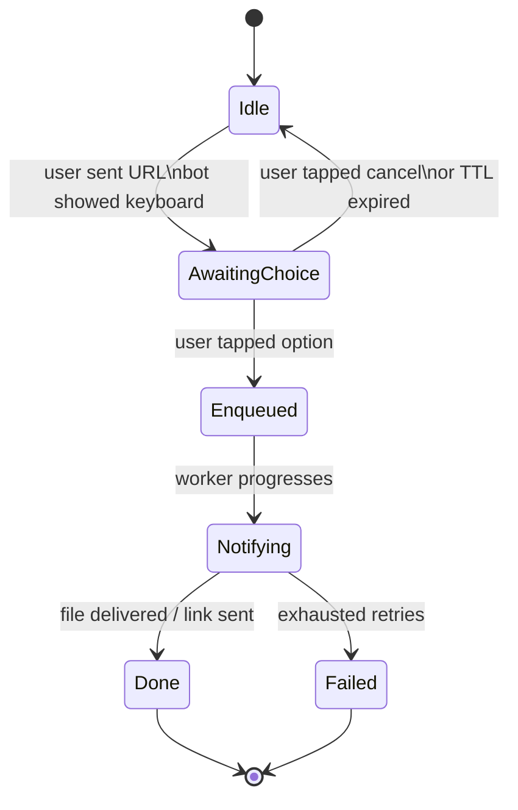
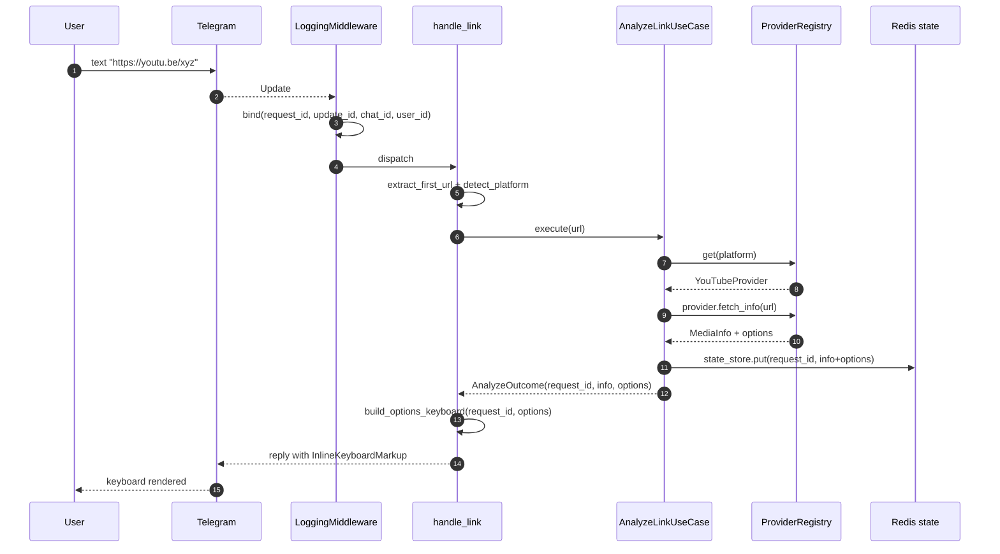
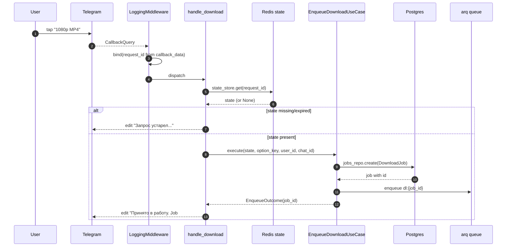

# 06 — Bot flow (Telegram side)

> Status: Stable
> Audience: bot/UX engineers, AI agents adding handlers
> Read next: [`07-provider-architecture.md`](07-provider-architecture.md), [`14-logging-observability.md`](14-logging-observability.md)

This document is the canonical reference for the Telegram-facing layer:
how updates enter the system, which handlers process them, how state is
correlated across messages, and the contracts that handlers must obey.

The bot lives entirely in `app/bot/` and runs in the `bot` container on
NL-1. It is intentionally **thin**: it parses, validates, dispatches to use
cases, and renders. It owns no business logic.

---

## 1. Runtime model

- Single process, single asyncio loop.
- Long-polling via `python-telegram-bot` (no webhook by default — see ADR-005
  in [`adr/`](adr/README.md)).
- One `BotContainer` is built at startup by `app/composition/:build_bot()`
  and injected into PTB's `Application.bot_data` under a fixed key.
- Handlers retrieve dependencies via `get_container(context.bot_data)`.

```mermaid
flowchart LR
    Update[Telegram Update] --> M[LoggingMiddleware]
    M --> R{Router}
    R -->|/start /help /health /about| C[handlers/commands.py]
    R -->|text with URL| L[handlers/links.py]
    R -->|callback_query dl|...| K[callbacks/download.py]
    R -->|errors| E[handlers/errors.py]
    C --> Out[reply / edit message]
    L --> AnalyzeUC[AnalyzeLinkUseCase] --> Out
    K --> EnqueueUC[EnqueueDownloadUseCase] --> Out
```

---

## 2. Handler catalogue

### `handlers/commands.py`

| Handler | Trigger | Side effects |
|---|---|---|
| `cmd_start` | `/start` | reply with greeting + capabilities |
| `cmd_help` | `/help` | reply with usage instructions |
| `cmd_health` | `/health` | report bot/queue/db status (admin-only optional) |
| `cmd_about` | `/about` | version, build sha, links |

These handlers are pure-render: they read `Settings`, never touch use cases.

### `handlers/links.py`

| Handler | Trigger | Calls |
|---|---|---|
| `handle_link` | any text containing a URL | `AnalyzeLinkUseCase.execute(url)` → renders inline keyboard |

Validates and normalizes the URL via `app/utils/url.py:extract_first_url`
+ `detect_platform`. If no URL is present, the message is silently ignored.

### `callbacks/download.py`

| Callback | Pattern | Calls |
|---|---|---|
| `handle_download` | `dl|<request_id>|<option_key>` | `EnqueueDownloadUseCase.execute(...)` |
| `handle_cancel` | `x|<request_id>` | clears Redis state, edits message |

### `handlers/errors.py`

PTB-level error handler: logs unhandled exceptions with the active
correlation context and replies with a generic "что-то пошло не так".

### `middleware/logging_mw.py`

A pre-handler tap that:
1. Mints a `request_id` for every update (UUID v4).
2. Binds `update_id`, `chat_id`, `user_id`, `request_id` into the
   contextvar bag (see `app/utils/correlation.py`).
3. Logs `update_received` with the bound context.
4. Records latency on completion (success or failure).

> **Rule:** every public handler must enter a `bind_context(...)` block
> before doing real work. The middleware mints `request_id`; downstream
> handlers may add `job_id` once it's known.

---

## 3. UX flow (state diagram)



The bot does **not** maintain an in-memory FSM per user. State sits in
Redis under `request_state:<request_id>`. The TTL is
`MEDIA_CACHE_TTL_SECONDS` (default 600s). After expiry, the inline buttons
become non-functional and reply with "запрос устарел, отправьте ссылку
заново". This is by design — see Anti-pattern #3.

---

## 4. Callback data contract

Telegram limits `callback_data` to 64 bytes. Our wire format:

```
dl|<request_id>|<option_key>
x|<request_id>
```

- `request_id` — UUID4 (36 chars). It is the *only* trusted identifier.
- `option_key` — opaque provider-defined string; the bot does not parse it.

Defense-in-depth: even if a user fabricates `callback_data`, the bot
validates `request_id` against the Redis state store. Unknown / expired
requests are rejected with a friendly message.

The codec lives in `app/bot/callbacks/codec.py`. **Do not** widen the wire
format without:
1. Counting bytes for the longest realistic payload.
2. Updating `MAX_CALLBACK_LEN` and the round-trip tests in
   `app/tests/test_callback_codec.py`.

---

## 5. Sequence: paste URL → keyboard



Notes:
- `state_store.put` writes a JSON blob keyed by `request_id`. The blob
  contains everything `EnqueueDownloadUseCase` needs to start a job — it
  does not re-call yt-dlp.
- The keyboard rows are built from `options`, one button per option,
  arranged in compact rows (see `keyboards/download_options.py`).

---

## 6. Sequence: tap option → enqueue



The bot answers the callback (`callback_query.answer()`) early to dismiss
the spinner, then edits the original message with progress. The original
keyboard is removed after enqueue.

---

## 7. Allowed and forbidden in handlers

| Allowed | Forbidden |
|---|---|
| `await container.<use_case>.execute(...)` | direct DB session usage |
| `await context.bot.send_*` / `message.reply_*` | direct yt-dlp / ffmpeg invocation |
| reading `Settings` for static text | importing ORM models |
| catching `AppError` and rendering `exc.user_message` | swallowing `Exception` silently |
| `bind_context(...)` enrichment | starting background tasks (`asyncio.create_task`) without bookkeeping |

Handlers must:
- Always render *something* to the user on every error path. A silent
  handler is a bad handler.
- Never log raw user PII beyond `user_id` / `chat_id`. Do not log
  `effective_user.full_name`, etc.
- Never block the loop on CPU work — delegate to `asyncio.to_thread` or to
  the worker.

---

## 8. Error rendering policy

Errors fall into three buckets:

1. **Domain errors** (`AppError` subclasses): they carry a `user_message`.
   Reply with that message, log at `INFO`/`WARNING` depending on type.
2. **External errors** (yt-dlp 4xx/5xx, Telegram rate limit): map to
   `AppError` inside the provider/sender layer. Bot never sees raw
   third-party exceptions.
3. **Unexpected errors** (`Exception`): caught by `errors.py`. Reply with a
   generic message; log with `_logger.exception(...)` so the traceback is
   captured.

Mapping table (representative):

| Exception | User message | Log level |
|---|---|---|
| `InvalidUrlError` | "Это не похоже на ссылку." | INFO |
| `UnsupportedPlatformError` | "Этот источник пока не поддерживается." | INFO |
| `MediaUnavailableError` | "Видео недоступно (приватное / удалено / гео-блок)." | WARNING |
| `ProviderError` (other) | "Не удалось получить медиа. Попробуйте позже." | WARNING |
| `Exception` | "Что-то пошло не так..." | ERROR (with traceback) |

---

## 9. Correlation rules (for AI agents writing new handlers)

Every handler MUST start with:

```python
async def my_handler(update: Update, context: ContextTypes.DEFAULT_TYPE) -> None:
    chat = update.effective_chat
    user = update.effective_user
    if chat is None or user is None:
        return
    container = get_container(context.bot_data)
    with bind_context(user_id=user.id, chat_id=chat.id):
        ...
```

If the handler creates or addresses a job, also bind `job_id`:

```python
with bind_context(job_id=job.id):
    ...
```

The middleware already binds `request_id`. Do not mint another one inside
a handler unless you are starting a brand-new conversation that is not a
follow-up of an inbound update.

---

## 10. Anti-patterns

1. **Hidden state in `bot_data` or `chat_data`.** PTB stores those in
   memory; surviving restarts requires extra plumbing we don't have. Use
   Redis (`RedisRequestStateStore`) for anything beyond the lifetime of a
   single update.
2. **Long-running work in handlers.** Anything > ~200 ms must go to the
   worker. Even metadata fetch (`AnalyzeLinkUseCase`) is bounded; if it
   exceeds a few seconds, the user sees a typing indicator for too long.
3. **"Sticky" inline keyboards.** Don't try to keep buttons functional
   forever. The Redis TTL is the contract; do not work around it.
4. **Handlers importing infra modules.** Handlers must import only:
   `app.bot.*`, `app.utils.*`, `app.exceptions`, `app.config` (read-only),
   `app.application.use_cases.*` (via the container). Importing
   `app.infrastructure.*` from a handler is a layering violation.
5. **Replying with markdown that contains user-controlled content.**
   Always escape with the local `_escape` helper before placing into
   `parse_mode="HTML"` strings.
6. **Calling `update.message.reply_text(...)` without `await`.** Easy
   mistake; ruff warns about it; do not silence the warning.

---

## 11. Adding a new command — checklist

- [ ] Add the handler function to `app/bot/handlers/commands.py` (or a new
      module if the command is large).
- [ ] Register it in `app/bot/application.py`.
- [ ] If it needs business logic, route through a use case in
      `app/application/use_cases/` — never embed logic in the handler.
- [ ] Add unit tests using a fake `Update` and a fake container.
- [ ] Document it in this file (`06-bot-flow.md`) and (if
      user-facing) in `README.md`'s "Usage" section.
- [ ] If the command produces large output, paginate or send as a file —
      Telegram will reject overly long messages.

---

## 12. Common mistakes

| Mistake | Symptom | Fix |
|---|---|---|
| Forgot `await message.reply_text(...)` | Nothing happens; ruff warning ignored | Restore the `await` |
| `callback_data` exceeds 64 bytes | `BadRequest: button_data_invalid` | Shorten `request_id` (don't) or remove debug suffixes from `option_key` |
| Inline keyboard rendered after `await` to slow IO | User sees stale state | Run analyze first, then render once |
| Bot crashes when `update.effective_message is None` (edited captions, etc.) | TypeError | Always check optional fields at top of handler |
| Two handlers compete for the same update | One handler "wins", the other doesn't run | Use PTB filters / order; do not register overlapping `MessageHandler`s |
