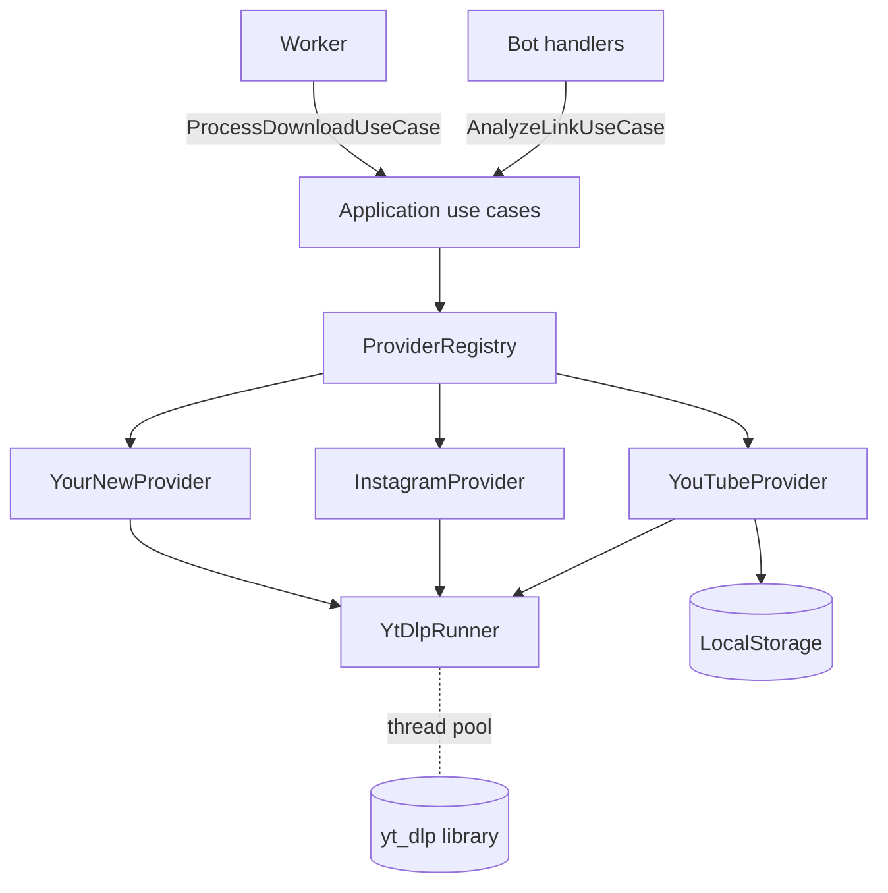
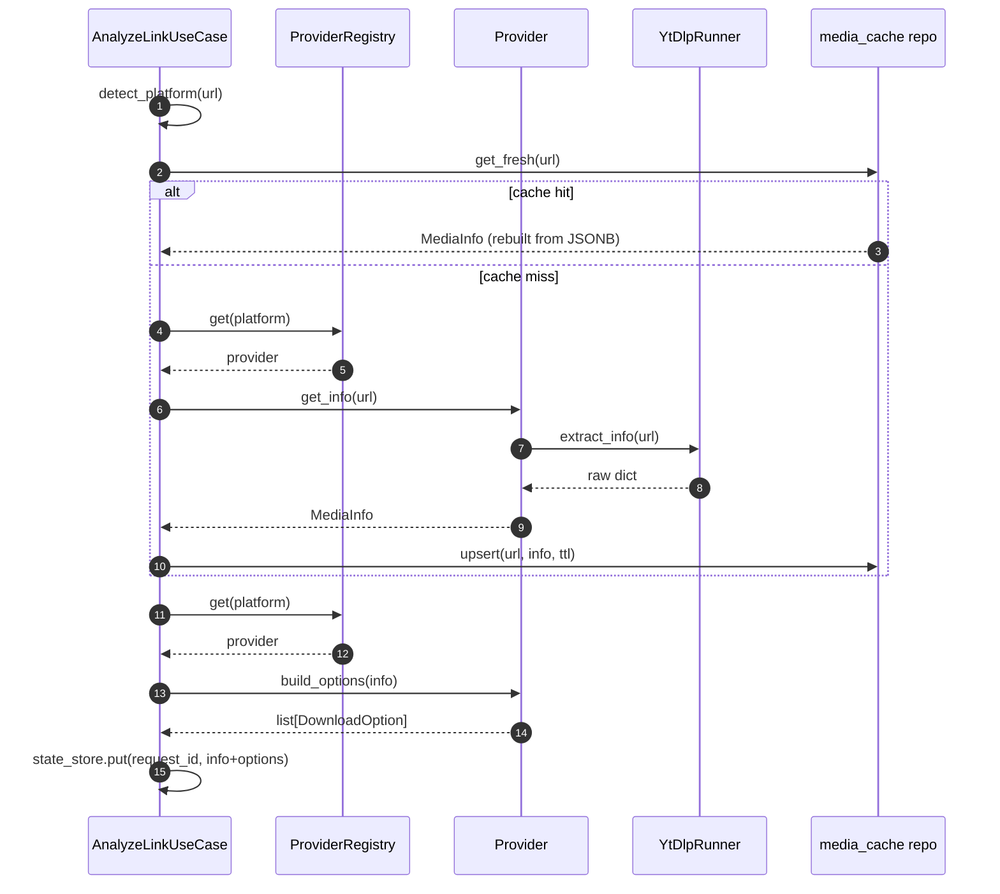
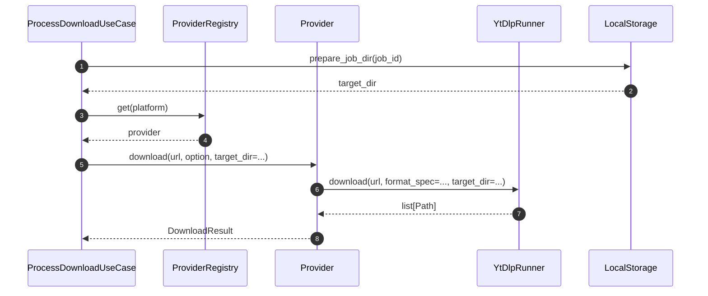

# 07 — Provider architecture

> Status: **Reference** (contract + diagrams; the operational "how to add a provider" lives in [`30-add-new-provider-guide.md`](30-add-new-provider-guide.md))
> Audience: engineers reading the contract before changing or adding a provider
> Read next: [`08-download-pipeline.md`](08-download-pipeline.md), [`30-add-new-provider-guide.md`](30-add-new-provider-guide.md), [`adr/`](adr/README.md)

Providers are the **only** place that knows about specific media platforms.
Everything outside `app/infrastructure/providers/` and `app/application/services/providers.py`
is platform-agnostic.

This document is the **reference** for:
- the provider contract (`BaseProvider`) — §§2–6,
- how the registry resolves the right provider — §3,
- existing providers' quirks — §7,
- error mapping — §9,
- anti-patterns — §§10–11.

> 🧭 If you came here to **add a new platform**, jump straight to
> [`30-add-new-provider-guide.md`](30-add-new-provider-guide.md). The
> step-by-step workflow, runnable verification commands, full
> TikTokProvider worked example, and definition-of-done checklists all
> live there. §8 of this document is just a one-table cross-reference.

---

## 1. Layering



Key facts:
- Use cases depend on the **`ProviderRegistry` protocol**, not on concrete
  providers. That's how new platforms slot in.
- Providers depend on the **`YtDlpRunner` and `LocalStorage`** primitives.
  They never call `subprocess` directly.
- No provider is allowed to call Telegram, the queue, or the DB. Those are
  someone else's job.

---

## 2. Contract: `BaseProvider`

```python
class BaseProvider(ABC):
    platform: Platform

    async def get_info(self, url: str) -> MediaInfo: ...
    def build_options(self, info: MediaInfo) -> list[DownloadOption]: ...
    async def download(self, url: str, option: DownloadOption,
                       *, target_dir: str) -> DownloadResult: ...
```

### `get_info(url)`
- Async; bounded latency (target < 5 s).
- Network-only call, no disk writes.
- Returns a fully-populated `MediaInfo`. `MediaInfo.raw` may carry
  provider-private state used later by `download()`.
- Maps third-party errors to `AppError` subclasses (`MediaUnavailableError`,
  `ProviderError`, `InvalidUrlError`).

### `build_options(info)`
- **Sync, deterministic, side-effect free.** Same `info` → same options.
- Must reflect *real* availability — never offer a quality the source
  cannot deliver. The YouTube provider intersects `_VIDEO_HEIGHTS` with the
  actually-available heights from `info.raw["available_heights"]`.
- Each `DownloadOption.key` must be unique within the returned list.
- Audio-only is offered when sensible (any audio stream present).
- Sets `estimated_size_bytes` when possible — the bot uses it for warnings
  about large downloads.

### `download(url, option, *, target_dir)`
- Async; all blocking work delegated to `YtDlpRunner` (which uses
  `asyncio.to_thread`) or `asyncio.create_subprocess_exec` for ffmpeg.
- `target_dir` is a fresh, job-specific subdirectory under `STORAGE_PATH`.
  The provider must write only inside it.
- Returns a `DownloadResult` with absolute paths to all produced files.
- Maps yt-dlp errors to `AppError` subclasses.

---

## 3. The registry

```python
class ProviderRegistry(Protocol):
    def get(self, platform: Platform) -> BaseProvider: ...
    def supports(self, platform: Platform) -> bool: ...
```

Implemented by `DefaultProviderRegistry([yt, ig])` in
`app/infrastructure/providers/registry.py`. Wired in `composition.py`
inside `_build_provider_registry`. Adding a provider = appending it to the
list and updating the wiring.

```python
def _build_provider_registry(settings, storage) -> ProviderRegistry:
    ytdlp = YtDlpRunner(settings)
    yt = YouTubeProvider(settings=settings, ytdlp=ytdlp, storage=storage)
    ig = InstagramProvider(settings=settings, ytdlp=ytdlp, storage=storage)
    return DefaultProviderRegistry([yt, ig])
```

The `Platform` enum is the routing key. Adding a new platform requires
extending the enum (and the migration that recreates the Postgres ENUM type).

---

## 4. URL → `Platform` resolution

`app/utils/url.py` owns URL detection:

```python
def detect_platform(url: str) -> Platform | None:
    host = urlparse(url).netloc.lower()
    if host.endswith(("youtube.com", "youtu.be")):
        return Platform.YOUTUBE
    if host.endswith("instagram.com"):
        return Platform.INSTAGRAM
    return None
```

Rules:
- Detection is **host-based only**. Do not parse path or query string.
- Unknown host → `UnsupportedPlatformError`. The bot replies with a
  user-facing message; no use case is started.
- A new provider's host(s) must be added here in the same PR. Otherwise the
  registry will have it but `detect_platform` will never produce its
  `Platform` value.

---

## 5. Sequence: analyze + offer options



`build_options` runs **after** the cache hit too — never store options in
the cache. They are cheap to recompute and may carry size estimates that
depend on local config (not just the URL).

---

## 6. Sequence: download



The provider returns. The use case is responsible for delivery and cleanup;
the provider does **not** unlink files.

---

## 7. Existing providers — quick reference

### `YouTubeProvider` (`app/infrastructure/providers/youtube.py`)

- **Hosts**: `*.youtube.com`, `youtu.be`.
- **Options**: 360p / 480p / 720p / 1080p MP4 (intersected with availability)
  + MP3 audio @ 192 kbps.
- **Format spec** (video): yt-dlp's
  `bestvideo[height<=H][ext=mp4]+bestaudio[ext=m4a]` with sane fallbacks.
- **Audio**: `bestaudio/best` then `FFmpegExtractAudio` postprocessor.
- **Auth**: respects `YOUTUBE_COOKIES_FILE` for age/auth-gated videos and
  Shorts. Keep the same path on NL-1 and NL-2 because NL-1 probes metadata
  and NL-2 downloads bytes.
- **Size estimates**: rough bitrate buckets per height + duration; null
  when duration unknown.
- **Playlists**: only the first entry is kept; treat playlist URLs as
  single-video URLs (intentional UX choice).

### `InstagramProvider` (`app/infrastructure/providers/instagram.py`)

- **Hosts**: `*.instagram.com`.
- **Options**: type-based — Video / Image (single) / Carousel (gallery).
- **Auth**: respects `INSTAGRAM_COOKIES_FILE` (canonical path
  `/srv/dwtgbot/secrets/cookies-instagram.txt`, bind-mounted RO into both
  bot and worker). Required in practice for most public posts because
  Instagram now serves the login wall to non-residential egress IPs.
  Missing file → provider logs `instagram_cookiefile_missing` and falls
  through to anonymous fetch (which usually surfaces `MediaPrivateError`
  to the user). Setup: [`20-deployment.md` §5.1.2](20-deployment.md);
  rotation: [`24-runbooks.md` §5.4 step 4](24-runbooks.md).
- **Carousels**: `download()` produces multiple files; `DownloadResult.kind`
  is `MediaKind.GALLERY`.
- **Stories/Reels**: handled as videos.

---

## 8. Adding a new platform — see `30-add-new-provider-guide.md`

> **Canonical procedure** for adding a new provider lives in
> [`30-add-new-provider-guide.md`](30-add-new-provider-guide.md) — a
> 32-section operational guide with step-by-step workflow, runnable
> verification commands per step, full TikTokProvider worked example,
> anti-pattern catalogue, and definition-of-done checklists.
>
> This document (`07-`) only describes the **contract** the new provider
> must implement (§§2–6) and the **error mapping** it must follow (§9).

The minimum touchpoints (full discussion in `30-`):

| # | Touchpoint | Why |
|---|---|---|
| 1 | `app/domain/enums.py:Platform` | new enum value |
| 2 | Alembic migration | extend the Postgres `platform` ENUM |
| 3 | `app/utils/url.py:detect_platform` | URL → Platform routing |
| 4 | `app/infrastructure/providers/<name>.py` | implement `BaseProvider` |
| 5 | `app/composition.py:_build_provider_registry` | register the instance |
| 6 | tests (URL detection, `build_options`, integration with marker) | safety |
| 7 | docs (`07-` §7, `00-`, `30-` Appendix, `README.md`) | discoverability |
| 8 | optional: cookies / rate-limit settings in `13-config-and-env.md` | platform-specific |

If you find yourself touching **anything** outside `30-`'s
"Step-by-step provider implementation workflow", stop — you're probably
violating layering. See `26-cursor-rules.md` for the refusal protocol.

---

## 9. Error mapping reference

Providers must translate yt-dlp / network errors into our domain errors so
that the bot can render meaningful messages.

| Symptom | Map to | Example check |
|---|---|---|
| URL is well-formed but yt-dlp says "Unsupported URL" | `UnsupportedPlatformError` | yt-dlp `UnsupportedError` |
| Geo-block, private, removed | `MediaUnavailableError` | yt-dlp `DownloadError` with specific phrases |
| Network failures (DNS, TCP timeout) | `NetworkError` (subclass of `ProviderError`) | `aiohttp.ClientError`, `socket.gaierror` |
| Rate limit (429) | `RateLimitError` (subclass of `ProviderError`) | yt-dlp HTTP 429 |
| Anything else | `ProviderError("yt-dlp failed: ...")` | catch-all |

The provider must **not** swallow errors. If unsure, escalate to
`ProviderError` and log with `_logger.exception(...)`.

---

## 10. Anti-patterns

1. **Provider knows about Telegram, queue, or DB.** Strictly forbidden;
   that's why we have use cases.
2. **Provider writes outside `target_dir`.** Path traversal risk; will be
   rejected by the storage layer's `assert_under_max` and `ensure_within`
   checks anyway, but never write that code in the first place.
3. **Provider-specific state leaking via `MediaInfo.raw` to the bot.** The
   bot must remain unaware of `raw`. If you need to surface something to
   the UI, model it as a typed field on `MediaInfo` or `DownloadOption`.
4. **Adding a yt-dlp option that fetches subtitles, comments, or
   thumbnails by default.** Out of scope; only fetch what we ship.
5. **Hard-coding cookies or credentials.** All secrets via `Settings`.
6. **Returning a `DownloadResult` with paths the worker can't relativise
   under `STORAGE_PATH`.** Always write inside the provided `target_dir`.
7. **Calling `time.sleep` or `requests.get`.** Async only; blocking calls
   freeze the worker's event loop.

---

## 11. Common mistakes

| Mistake | Symptom | Fix |
|---|---|---|
| New `option_key` collides with existing one | Wrong format downloaded | Audit `build_options`; keys must be unique |
| Forgot to add the platform to the URL detector | "Источник не поддерживается" even though provider exists | Update `detect_platform` |
| Provider raises raw `Exception` | Bot shows "Что-то пошло не так..." | Map to `AppError` subclass |
| `build_options` returns 0 options | Bot replies "не удалось получить вариантов" | Always offer at least one option (e.g. audio) when feasible |
| `download()` writes to `target_dir` parent | `StorageError` from storage layer | Always pass `target_dir` to yt-dlp's `outtmpl` |
| New platform added but ENUM migration forgotten | `InvalidTextRepresentation` from Postgres | Alembic migration must update the `platform` ENUM |

---

## 12. Future extension points

- **Shared cookie jar service**: today each provider reads its own cookies
  file. A central `CookieJarService` could rotate identities or expire
  cookies on auth failures.
- **Rate limiter per host**: `aiolimiter` token bucket keyed by hostname.
- **Provider feature flags**: `app_settings` table + `AppSettingModel`
  could disable providers at runtime without redeploy.
