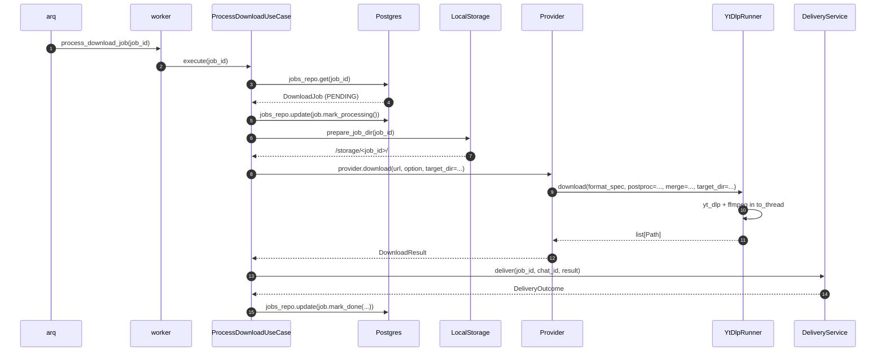

# 08 — Download pipeline (yt-dlp + ffmpeg)

> Status: Stable
> Audience: engineers debugging downloads, AI agents tweaking format specs
> Read next: [`07-provider-architecture.md`](07-provider-architecture.md), [`11-storage-strategy.md`](11-storage-strategy.md)

This document explains how a single `download_jobs` row becomes a finished
file on disk: the `YtDlpRunner`, the ffmpeg call paths, the format strings,
and the failure modes you will actually see in production.

---

## 1. Pipeline overview

```mermaid
flowchart LR
    UC[ProcessDownloadUseCase] --> Prep[LocalStorage.prepare_job_dir]
    Prep --> Prov[Provider.download]
    Prov --> YDL[YtDlpRunner.download]
    YDL -->|asyncio.to_thread| YT[yt_dlp.YoutubeDL]
    YT --> FFM[ffmpeg<br/>postprocessor / merge]
    FFM --> FS[(target_dir/*.{ext})]
    FS --> Result[DownloadResult]
    Result --> Deliver[DeliveryService]
```

Component responsibilities:

| Component | Responsibility |
|---|---|
| `LocalStorage.prepare_job_dir(job_id)` | create `STORAGE_PATH/<job_id>/`, ensure perms |
| `Provider.download(...)` | translate `DownloadOption` → yt-dlp format spec + postprocessors |
| `YtDlpRunner.download(...)` | call yt-dlp safely; classify errors |
| `yt_dlp.YoutubeDL` | actual HTTP / HLS / DASH download |
| `ffmpeg` | merge separate video+audio streams; transcode audio |
| `DownloadResult` | hand off paths + metadata to delivery |

---

## 2. The `YtDlpRunner`

```python
class YtDlpRunner:
    async def extract_info(self, url: str, *,
                           extra_opts: dict | None = None) -> dict[str, Any]: ...
    async def download(self, url: str, *, format_spec: str,
                       target_dir: Path,
                       postprocessors: list[dict] | None = None,
                       merge_output_format: str | None = None,
                       extra_opts: dict | None = None) -> list[Path]: ...
```

### `extract_info`
- `skip_download=True`, `socket_timeout=30 s`, `retries=1`.
- `extra_opts` lets providers inject extractor-specific params (for example
  YouTube / Instagram `cookiefile`) while preserving shared guards
  (`allowed_extractors`, `match_filter`) and proxy wiring.
- Runs `ydl.sanitize_info(...)` so what we cache is JSON-safe.
- All exceptions normalised through `_classify(...)`.

### `download`
- Hard-coded options:
  - `outtmpl = "<target_dir>/%(title).80B [%(id)s].%(ext)s"` — bounded
    title length, deterministic id-suffixed filename, restricted charset.
  - `restrictfilenames = True` — no shell-special characters.
  - `concurrent_fragment_downloads = 4` — better throughput on HLS/DASH.
  - `socket_timeout = 30 s`, `retries = 2`, `fragment_retries = 2` —
    short retries; the *job* is retried by arq for bigger failures.
  - `ffmpeg_location = settings.FFMPEG_BIN` — explicit binary path.
- Returns sorted list of files inside `target_dir`.

### Error classification

`_classify` maps yt-dlp's `DownloadError` to our hierarchy:

| Substring in error message | Mapped exception |
|---|---|
| "private" / "login required" | `MediaPrivateError` |
| "not found" / "does not exist" / "removed" / "404" | `MediaNotFoundError` |
| "unsupported url" | `ProviderError` |
| anything else | `DownloadError` |

Anything not a `YtDlpDownloadError` (e.g. `RuntimeError`, parser bugs) is
re-raised as `ProviderError("yt-dlp failure: ...")` after a full
`_logger.exception(...)`.

---

## 3. Format-spec patterns (YouTube)

The YouTube provider builds yt-dlp format strings from the chosen height:

```text
bestvideo[height<=H][ext=mp4]+bestaudio[ext=m4a]
  / bestvideo[height<=H]+bestaudio
  / best[height<=H]
```

Reading left-to-right:

1. **Preferred**: pick the best MP4 video stream up to height `H`, mux with
   the best M4A audio stream — yields a clean MP4 with no transcode.
2. **Fallback 1**: any best video up to `H` + any best audio. ffmpeg merges
   into the chosen `merge_output_format` (`mp4`).
3. **Fallback 2**: a single combined `best[height<=H]` stream.

This order is explicit so we maximise quality while minimising ffmpeg work.

For audio:

```text
format    = bestaudio/best
postproc  = FFmpegExtractAudio(preferredcodec=mp3, preferredquality=192)
```

ffmpeg encodes to MP3 at the user-selected bitrate (192 kbps default).

---

## 4. Format-spec patterns (Instagram)

Instagram is simpler — yt-dlp does most of the work:

| Option kind | Format spec | Postprocessors |
|---|---|---|
| Video | `best` | none |
| Image | yt-dlp returns image directly | none |
| Carousel (gallery) | iterate entries; same per-item logic | none |

The provider may pass `INSTAGRAM_COOKIES_FILE` via `extra_opts={"cookiefile": ...}`
to access auth-required posts. See [`13-config-and-env.md`](13-config-and-env.md).

---

## 5. ffmpeg call paths

We invoke ffmpeg **only** through yt-dlp:
- `merge_output_format="mp4"` triggers ffmpeg's `mux` phase.
- `FFmpegExtractAudio` postprocessor triggers transcode.

We do **not** spawn `ffmpeg` ourselves elsewhere (e.g. for thumbnails,
resizing, or watermarking) — that simplifies failure modes and audit.

If you need to add a direct ffmpeg call:
1. Use `asyncio.create_subprocess_exec(self._settings.FFMPEG_BIN, ...)`.
2. Always `await proc.wait()` with a timeout (`asyncio.wait_for`).
3. Capture stderr to a buffer and include it in `DownloadError` on
   non-zero exit code.
4. Add a section to this document.

---

## 6. End-to-end sequence (worker side)



---

## 7. Filesystem layout per job

```
$STORAGE_PATH/
└── <job_id>/                        # prepared by LocalStorage
    ├── <title> [<media_id>].mp4     # YouTube video
    ├── <title> [<media_id>].mp3     # YouTube audio (alt)
    ├── <title> [<media_id>].jpg     # Instagram image
    └── <title>_carousel_NN.<ext>    # Instagram carousel items
```

Rules:
- Every job gets its own subdirectory keyed by `job_id` (deterministic; no
  collisions across users).
- `outtmpl` ensures filenames are restricted (`restrictfilenames=True`) and
  bounded (`%(title).80B`).
- The directory survives until either:
  - all files are uploaded to Telegram (then deleted by the worker), or
  - the temp link is exhausted/expired (then deleted by cleanup).

---

## 8. Timeouts

| Layer | Setting | Default | Notes |
|---|---|---|---|
| HTTP socket | `socket_timeout` | 30 s | both `extract_info` and `download` |
| HTTP retries | `retries` | 2 | yt-dlp internal retries |
| Fragment retries (HLS/DASH) | `fragment_retries` | 2 | per fragment |
| Job timeout | `JOB_TIMEOUT_SECONDS` | 1800 s | enforced by arq; kills the whole job |
| Job retries | `JOB_MAX_RETRIES` | 2 | arq re-enqueues up to N times |

If you change `JOB_TIMEOUT_SECONDS`, also re-evaluate
`concurrent_fragment_downloads` — too many concurrent fragments under a
short timeout can flap.

---

## 9. Failure taxonomy

| What broke | Where it surfaces | What user sees |
|---|---|---|
| URL gibberish | `extract_first_url` returns nothing | "Это не похоже на ссылку." |
| Host unsupported | `detect_platform` returns `None` | "Этот источник пока не поддерживается." |
| yt-dlp says "Private video" / "Sign in to confirm your age" | `MediaPrivateError` | "Видео приватное / требует авторизации." |
| Removed / 404 | `MediaNotFoundError` | "Видео недоступно или удалено." |
| Network / TLS / DNS | `DownloadError` ("network") | "Не удалось скачать. Попробуйте позже." |
| Format unavailable | `DownloadError` | same as above; logs include `format_spec` |
| ffmpeg merge failed | `DownloadError` (yt-dlp wraps it) | same as above |
| Job > timeout | arq `asyncio.TimeoutError` | "Не удалось скачать (таймаут)." after retries exhausted |
| Disk full | `OSError ENOSPC` from `LocalStorage` | "Сервер занят. Попробуйте позже." (logged as ERROR + alert) |

---

## 10. Anti-patterns

1. **Calling `yt_dlp.YoutubeDL` directly from a use case or the bot.** Only
   the runner may. Otherwise we lose the `to_thread` boundary and risk
   blocking the event loop.
2. **Reusing the same `target_dir` across jobs.** Always job-scoped.
3. **Setting `outtmpl` without `%(id)s`.** Without the id, two videos with
   identical titles overwrite each other.
4. **Disabling `restrictfilenames`.** Re-introduces shell-special chars in
   paths; opens path-handling bugs.
5. **Silencing yt-dlp errors to "be nice".** Errors must propagate so arq
   can decide whether to retry.
6. **Adding `--external-downloader aria2c`.** Significantly more moving
   parts; not worth it at our scale.
7. **Pre-fetching 4K/8K because "users would like it".** Out of scope; we
   target Telegram-friendly sizes by default.

---

## 11. Common mistakes

| Mistake | Symptom | Fix |
|---|---|---|
| Forgot `ffmpeg` in worker container | yt-dlp errors with "ffmpeg not found" | Build `worker.Dockerfile`; verify `which ffmpeg` |
| `STORAGE_PATH` not writable by the worker user (uid 1000) | `PermissionError` on `prepare_job_dir` | `chown -R 1000:1000` on the volume |
| `JOB_TIMEOUT_SECONDS` too small for long videos | Repeated retries, eventual FAILED | Increase timeout for known long content; never set < 300 s in prod |
| `media_cache` contains stale `available_heights` | Bot offers 1080p but download fails | Cache TTL is short (10 min); shorten further if you change provider behaviour |
| Two jobs with same `job_id` | Impossible: ids come from DB sequence | If you see this, your repository is broken; investigate |

---

## 12. Performance notes

- A single worker handles `WORKER_CONCURRENCY` jobs in parallel (default 2).
  Each yt-dlp download runs in its own thread, so increase `WORKER_CONCURRENCY`
  cautiously — disk IO and bandwidth become bottlenecks before CPU does.
- `concurrent_fragment_downloads=4` is a sweet spot for typical residential
  bandwidth; higher values rarely help and cause more retries on flaky CDNs.
- ffmpeg muxing is fast (no transcode) for the YouTube video path. The
  audio path *does* transcode, which takes a few seconds for typical
  songs; it's still cheaper than maintaining a server-side transcoder.
