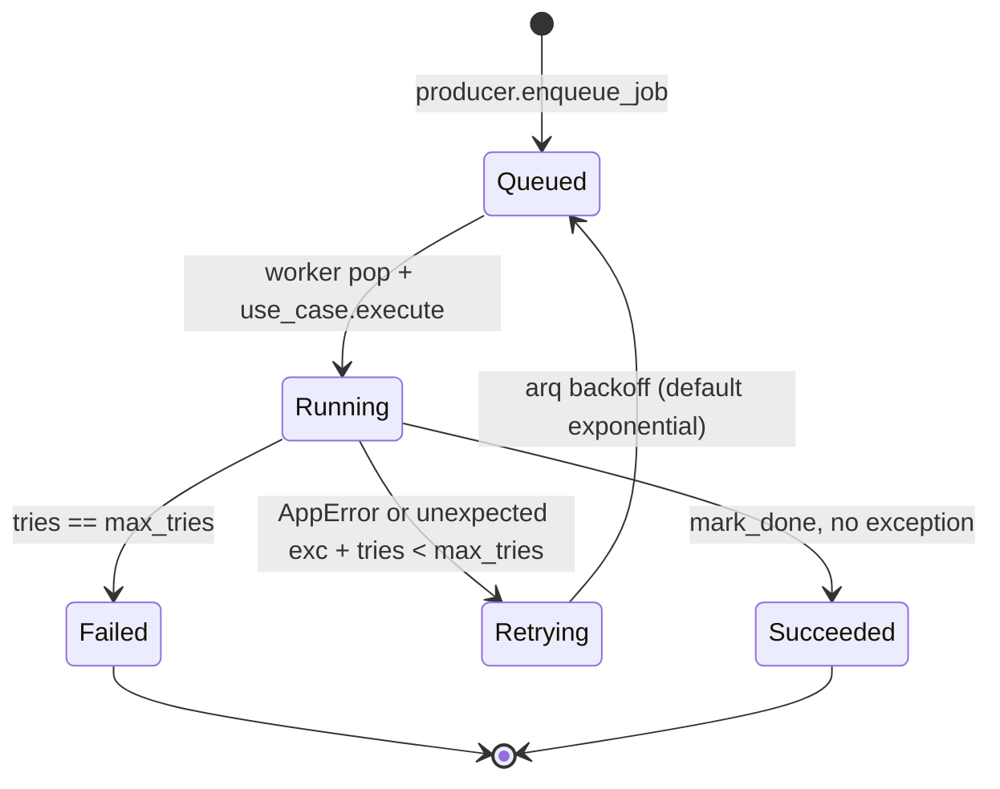
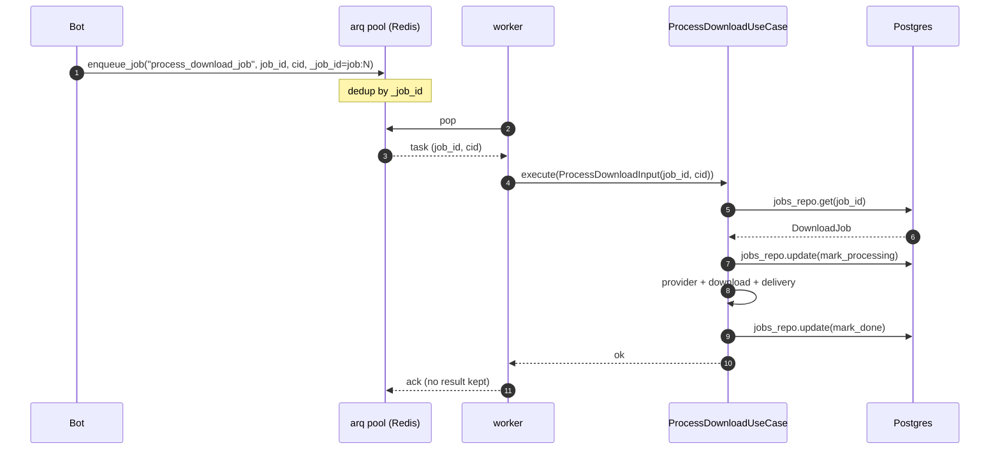
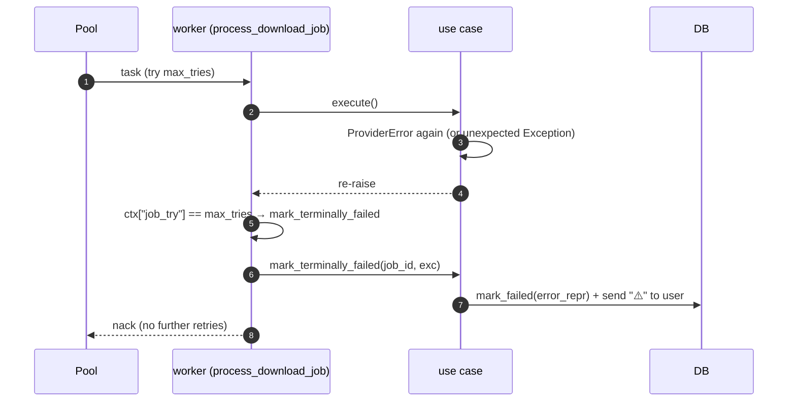

# 09 — Queue and workers (arq)

> Status: Stable
> Audience: backend / SRE engineers, AI agents touching task scheduling
> Read next: [`08-download-pipeline.md`](08-download-pipeline.md), [`05-data-flow.md`](05-data-flow.md)

This document describes how background work is scheduled, executed, retried,
and observed. We use **arq** (Redis-backed asyncio queue). The design is
intentionally minimal — one task type, deterministic ids, short blast
radius for incidents.

---

## 1. Topology

```mermaid
flowchart LR
    Bot[Bot (NL-1)] -->|enqueue_job<br/>_job_id="job:N"| R[(Redis on NL-1)]
    R -->|pop| W1[Worker process #1 (NL-2)]
    R -->|pop| W2[Worker process #2 (NL-2)]
    W1 -->|to_thread| YDL[yt-dlp]
    W2 -->|to_thread| YDL
    W1 -->|update| DB[(Postgres on NL-1)]
    W2 -->|update| DB
    W1 -->|HTTPS| TG[Telegram]
    W2 -->|HTTPS| TG
```

- Producer = the bot container on NL-1, via `ArqQueueProducer`.
- Consumer = arq worker container(s) on NL-2, started by
  `arq app.infrastructure.queue.worker_settings.WorkerSettings`.
- Broker = the same Redis instance used for `request_state`. Using one
  Redis simplifies operations and reduces blast radius. Logical separation
  is by key prefix (`arq:dwtgbot:*` vs. `request_state:*`).

---

## 2. Configuration

| Setting | Where | Default | Notes |
|---|---|---|---|
| Queue name | `WorkerSettings.queue_name` | `"arq:dwtgbot"` | Hardcoded — single queue |
| Concurrency | `WorkerSettings.max_jobs` ← `WORKER_CONCURRENCY` | `2` | Concurrent jobs per worker process |
| Job timeout | `WorkerSettings.job_timeout` ← `JOB_TIMEOUT_SECONDS` | `1800` s | arq cancels the coroutine on timeout |
| Max tries | `WorkerSettings.max_tries` ← `JOB_MAX_RETRIES + 1` | `3` (= 1 try + 2 retries) | First attempt + retries |
| Result retention | `WorkerSettings.keep_result` | `0` | We persist outcome in DB, not Redis |
| Redis URL | `WorkerSettings.redis_settings` | from `Settings.REDIS_URL` | Sentinel/Cluster not used |

To run more workers, run more containers — each is a process with its own
event loop and its own `max_jobs` slots.

---

## 3. The single task: `process_download_job`

Located in `app/infrastructure/queue/tasks.py`. Signature:

```python
async def process_download_job(ctx: dict[str, Any],
                               job_id: int,
                               correlation_id: str) -> None:
    use_case: ProcessDownloadUseCase = ctx["use_case"]
    await use_case.execute(ProcessDownloadInput(job_id=job_id,
                                                correlation_id=correlation_id))
```

Why so thin: we want the task body to be a stable boundary that arq can
schedule. All real logic lives in the use case, which is testable without
arq.

---

## 4. Idempotency contract

Producer (in `ArqQueueProducer.enqueue_download`):

```python
await self._pool.enqueue_job(
    PROCESS_DOWNLOAD_TASK,
    payload.job_id,
    payload.correlation_id,
    _job_id=f"job:{payload.job_id}",
)
```

- `_job_id` is **deterministic**: `job:{db_pk}`. arq treats the same id as
  a duplicate and silently drops the second enqueue.
- This means **double-clicking the inline button is safe** (the second
  enqueue is a no-op).
- It also means: if you re-enqueue a job that already finished (status
  `DONE`/`FAILED`), arq will accept it as a new job *only if the previous
  job's bookkeeping has been cleaned up*. Use `arq` CLI tools (or a future
  admin endpoint) for forced re-runs; do not paper over with random ids.

---

## 5. Worker startup / shutdown

`app/infrastructure/queue/worker_settings.py`:

```python
async def _on_startup(ctx):
    settings = get_settings()
    configure_logging(settings)
    errors = settings.validate_runtime(require_storage=True, require_tools=True)
    if errors: raise RuntimeError(...)
    composition = build_worker(settings)
    await composition.sender.initialize()
    ctx["composition"] = composition
    ctx["use_case"] = composition.use_case
```

What it guarantees:
- Logging configured before the first task ever runs.
- Storage path present and writable; `ffmpeg` and yt-dlp on PATH.
- Telegram bot token validated by `sender.initialize()` (calls `getMe`).
- DI container fully built; all dependencies are reused across tasks.

On shutdown (SIGTERM from Docker), arq drains in-flight tasks
(`shutdown_timeout` — see arq docs), then `_on_shutdown` closes the sender,
Redis, DB engine.

---

## 6. State machine — task lifecycle



Translation to DB `JobStatus`:

| arq state | `JobStatus` (in `download_jobs`) |
|---|---|
| Queued (initial) | `PENDING` |
| Running | `PROCESSING` |
| Retrying (between attempts) | `PROCESSING` (row stays in-flight; never flipped to `FAILED` mid-retry) |
| Failed | `FAILED` (set only on the terminal attempt by `mark_terminally_failed`, or immediately for non-retryable `AppError`s) |
| Succeeded | `DONE` |

Note: between retries the DB row stays `PROCESSING`. The terminal
state is written exactly once per job lifecycle. This is what lets
the per-user cap (`status IN (PENDING, PROCESSING)`) keep the slot
reserved while arq is in backoff (see ADR-0008 §2.1 + §2.2).

---

## 7. Sequence: happy path



## 8. Sequence: retry path

Retry behaviour is driven by `AppError.is_retryable` (see
[`16-error-handling.md`](16-error-handling.md) §1 + §2 and ADR-0008
§2.1). The use case re-raises retryable / unexpected errors; the arq
task wrapper marks the job `FAILED` only on the **last** attempt.

```mermaid
sequenceDiagram
    autonumber
    participant Pool
    participant W as worker (process_download_job)
    participant UC as use case
    participant DB

    Pool ->> W: task (try 1)
    W ->> UC: execute()
    UC ->> DB: mark_processing
    UC ->> UC: provider raises ProviderError (is_retryable=True)
    UC -->> W: re-raise (no DB write; row stays PROCESSING)
    W ->> W: ctx["job_try"]=1 < max_tries → log "job_will_retry"
    W -->> Pool: nack → exponential backoff → re-enqueue (try 2)

    Pool ->> W: task (try 2)
    W ->> UC: execute()
    UC ->> UC: succeeds
    UC ->> DB: mark_done
```



> **Permanent errors** (e.g. `MediaPrivateError`, `FileTooLargeError`,
> `MediaNotFoundError`, `FfmpegError`) bypass retry entirely: the use
> case calls `_fail` on the first attempt and **does not** re-raise,
> so arq stops immediately.

> **Note on row state during retry windows**: between attempts the
> `download_jobs.status` column stays `PROCESSING`. We deliberately do
> not "rewind" to `PENDING`. The per-user concurrency cap reads
> `PENDING ∪ PROCESSING`, so the user's slot stays correctly reserved
> across retry backoff. The row only flips to `FAILED` on the terminal
> attempt or to `DONE` on success — operators can rely on the column
> as the source of truth without polling arq metadata.

---

## 9. Backoff and retries

arq defaults are sane and we don't override them:

- **Backoff**: exponential with jitter, capped (~10s, 30s, 60s, ...).
- **Max tries**: `JOB_MAX_RETRIES + 1` (initial attempt counted).
- **Job timeout**: `JOB_TIMEOUT_SECONDS` per attempt.

Total worst case: `(JOB_MAX_RETRIES + 1) * JOB_TIMEOUT_SECONDS` plus
backoff.

If you change retry behaviour:
1. Update this document.
2. Update [`05-data-flow.md`](05-data-flow.md) failure sequence.
3. Add a note to [`31-troubleshooting.md`](31-troubleshooting.md).

---

## 10. Observability

Worker emits structured log lines bound to:
`job_id, user_id, chat_id, request_id, platform`.

Recommended Grafana/Loki queries (template, paste into your dashboards):

| Goal | Query |
|---|---|
| Failures per provider | `{app="dwtgbot",service="worker"} \| json \| event="job_failed_app_error" \| count_over_time[5m]` |
| P95 job latency | `quantile_over_time(0.95, ...)` (use the `job_done` event with `latency_ms`) |
| Retries | grep for `arq` warnings about `requeueing` |
| Stuck jobs | `download_jobs` rows with `status=PROCESSING AND updated_at < now() - interval '2 * JOB_TIMEOUT_SECONDS seconds'` |

The API container exposes `/healthz` (liveness) and `/readyz` (readiness +
queue ping). The bot container exposes the same. The worker exposes none —
its liveness is "the container is up". If a worker is wedged, the right
signal is "queue grows but `download_jobs` rows are not advancing".

---

## 11. Anti-patterns

1. **Adding a second task type to the queue.** If you need a different
   workflow (e.g. periodic cleanup), use arq's cron functionality in a
   separate `WorkerSettings` rather than overloading
   `process_download_job`.
2. **Random `_job_id`.** Breaks idempotency; users can spam-enqueue.
3. **Calling DB or Telegram from the task body directly.** Always go
   through the use case. The task body is a 3-line glue function and stays
   that way.
4. **Storing per-task progress in arq.** We don't keep results in arq
   (`keep_result=0`); progress lives in `download_jobs`.
5. **Sharing one DB engine across worker processes via a global.** arq
   spawns one process per worker; each must build its own composition in
   `_on_startup`.
6. **Catching `BaseException` in the task.** That includes
   `KeyboardInterrupt` and `asyncio.CancelledError`; arq needs to see them
   to handle timeouts and shutdowns cleanly.

---

## 12. Common mistakes

| Mistake | Symptom | Fix |
|---|---|---|
| Worker container missing `ffmpeg` | First job fails immediately | Build with `worker.Dockerfile` (installs ffmpeg) |
| `JOB_TIMEOUT_SECONDS` smaller than worst-case download | Repeating retries; eventual `FAILED` | Increase timeout; never < 300 s in prod |
| Two worker containers writing to *different* `STORAGE_PATH` | Some links 410 because the file lives on the other host | All workers must mount the **same** volume |
| Forgot to bump `WORKER_CONCURRENCY` after scaling vCPU | Underutilised host | Match concurrency to (cpu × 2) for IO-bound workloads, but watch RAM |
| Producer `_job_id` accidentally includes a timestamp | Double-tap creates duplicate jobs | Keep id deterministic — `job:{db_pk}` |
| Worker startup hard-fails on Telegram outage | Worker won't start; queue grows | Make `sender.initialize()` retryable; keep timeout short |

---

## 13. Future extension points

- **Priority queues**: arq supports queue names; add `arq:dwtgbot:hi` for
  premium users. Requires new producer methods and additional WorkerSettings.
- **Rate limiting per user**: introduce a Redis token bucket at producer
  side (`enqueue_download`). Reject with a friendly message at the bot
  layer rather than queuing forever.
- **Cron tasks**: replace external schedulers (cleanup, backups) with
  arq's `cron_jobs` to consolidate scheduling.
- **Dead-letter queue**: today permanent failures stay in
  `download_jobs.status = FAILED`. A DLQ stream in Redis (or an
  `audit_logs` row) would help if we add a re-driver UI.
