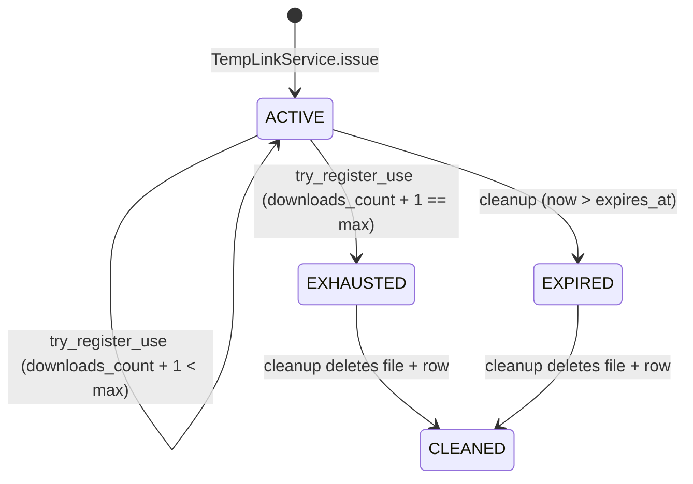

# 10 — Temporary links and delivery

> Status: Stable
> Audience: backend / SRE engineers, security reviewers, AI agents
> Read next: [`11-storage-strategy.md`](11-storage-strategy.md), [`20-deployment.md`](20-deployment.md)

When a downloaded file fits Telegram's per-bot upload limit (50 MiB by
default), the worker uploads it directly. Otherwise it issues a
**temporary HTTPS link** served by Nginx via `X-Accel-Redirect`. This
document is the authoritative reference for that path: the decision
points, the wire format, the security model, and the operational behaviour.

---

## 1. Decision tree

```mermaid
flowchart TD
    R{"DownloadResult"} -->|len(files) == 1| One
    R -->|len(files) > 1| Many

    One{"single file:<br/>size ≤ 50 MiB?"}
    One -->|yes| TG1[sendVideo / sendAudio /<br/>sendPhoto / sendDocument]
    One -->|no| Link1[Issue temp link]

    Many{"each ≤ 50 MiB<br/>and count ≤ 10?"}
    Many -->|yes| TGN[per-file upload<br/>+ caption text]
    Many -->|no| ZIP[ZIP-package on disk]
    ZIP --> Link2[Issue temp link]
```

This is implemented in `app/application/services/delivery_service.py:DeliveryService.deliver`.

| Outcome | `DeliveryMethod` | DB fields populated on `download_jobs` |
|---|---|---|
| Telegram upload (single or gallery) | `TELEGRAM_UPLOAD` | `telegram_file_id`, `file_size`, `mime_type` |
| Temp link (single big file or zipped gallery) | `TEMP_LINK` | `public_url`, `file_size`, `mime_type` |

`MAX_INDIVIDUAL_FILES = 10` is a constant — kept conservative to avoid
flood limits and noisy chats. Adjust only with UX justification.

---

## 2. Token issuance

`TempLinkService.issue(job_id, file_path)` produces:

| Field | Source |
|---|---|
| `token` | `secrets.token_urlsafe(TEMP_LINK_TOKEN_BYTES)` (default 32 bytes ≈ 43 chars) |
| `expires_at` | `now(UTC) + TEMP_LINK_TTL_SECONDS` (default 6 h) |
| `max_downloads` | `TEMP_LINK_MAX_DOWNLOADS` (default 5) |
| `file_path` | absolute path inside `STORAGE_PATH` (validated again at serve time) |
| `is_active` | `True` |

The returned URL is `f"{PUBLIC_BASE_URL}/d/{token}"`. Logs include only
the first 8 chars of the token (`token[:8] + "..."`) to make grep useful
without leaking secrets.

> **Cryptographic strength:** 32 random bytes URL-safe-base64 → 256 bits of
> entropy. Brute-forcing one valid token per million guesses still gives
> infeasible enumeration. We never expose the token in error messages,
> URLs in metrics, or analytics.

---

## 3. Sequence: large file delivery

```mermaid
sequenceDiagram
    autonumber
    participant W as worker (NL-2)
    participant SVC as TempLinkService
    participant DB as Postgres (NL-1)
    participant TG as Telegram
    participant U as User
    participant NX as nginx (NL-2)
    participant API as API (NL-2)
    participant FS as Storage (NL-2)

    W ->> SVC: issue(job_id, file_path)
    SVC ->> DB: temp_links INSERT (token, expires_at, max_downloads)
    DB -->> SVC: TempLink with id
    SVC -->> W: (link, "https://media.host/d/<token>")
    W ->> TG: send_text("📦 Файл слишком большой...<a href=URL>name</a>")
    W ->> DB: jobs.update(mark_done(public_url=URL))

    U ->> NX: GET https://media.host/d/<token>
    NX ->> API: proxy_pass + X-Internal-XAccel: 1
    API ->> DB: SELECT temp_links WHERE token=...
    DB -->> API: TempLink (or None)
    API ->> API: ensure_within(STORAGE_PATH, link.file_path) + file exists?
    alt invalid (404 / 403 / 410, no counter mutation)
        API -->> NX: error code
        NX -->> U: error
    else valid path
        API ->> DB: try_register_use(token)  # atomic UPDATE ... RETURNING
        alt UPDATE matched
            DB -->> API: post-update TempLink
            API -->> NX: 200 + X-Accel-Redirect: /_protected/<relpath><br/>Content-Disposition: attachment; filename="..."
            NX ->> FS: open(STORAGE_PATH/<relpath>)
            NX -->> U: file (sendfile)
        else None (expired / exhausted / lost race with concurrent request)
            API -->> NX: 410
            NX -->> U: error
        end
    end
```

---

## 4. The `/d/{token}` endpoint

Source: `app/api/public/downloads.py`.

Behaviour:

| Condition | HTTP code | Reason |
|---|---|---|
| token unknown | `404 Not Found` | "Link not found" |
| token expired / exhausted / inactive | `410 Gone` | "Link expired or exhausted" |
| `file_path` outside `STORAGE_PATH` | `403 Forbidden` | path-traversal defense |
| `file_path` does not exist on disk | `410 Gone` | "File no longer available" |
| OK + behind nginx | `200 OK` + `X-Accel-Redirect` + `Content-Disposition: attachment` | nginx serves the bytes |
| OK + standalone (dev) | `200 OK` + `FileResponse` (FastAPI streams it) | fallback when no nginx |

Key code points:

```python
link = await composition.temp_links_repo.get_by_token(token)
if link is None: 404
if not link.is_usable(): 410                                             # cheap pre-check
file_path = ensure_within(settings.STORAGE_PATH, Path(link.file_path))   # 403 on traversal
if not file_path.exists() or not file_path.is_file(): 410                # never burn a slot for a missing file

# Atomic increment + deactivate-on-cap. Returns None on a race.
link = await composition.temp_links_repo.try_register_use(token)
if link is None: 410                                                     # expired / exhausted / lost race

if request.headers.get("x-internal-xaccel", "0") == "1":
    rel = file_path.relative_to(settings.STORAGE_PATH)
    return Response(headers={
        "X-Accel-Redirect": f"/_protected/{rel.as_posix()}",
        "Content-Disposition": f'attachment; filename="{file_path.name}"',
    })
return FileResponse(...)
```

`try_register_use(token)` is a single
`UPDATE temp_links SET downloads_count = downloads_count + 1, is_active
= CASE WHEN downloads_count + 1 >= max_downloads THEN false ELSE true
END WHERE token = :t AND is_active AND expires_at > now AND
downloads_count < max_downloads RETURNING *`. This guarantees that a
single-use link served to two concurrent clients is delivered to
exactly one of them — the other gets `410 Gone`. See ADR-0008 §2.5.

Pre-checks (`get_by_token`, `ensure_within`, `file_path.exists()`)
deliberately run **before** the atomic call so a 404/403/410 caused
by a path probe or a cleanup race never consumes a download slot.

---

## 5. Nginx role

Snippet from `deploy/nginx/conf.d/media.conf.template`:

```nginx
location /d/ {
    # Docker embedded DNS + variable in proxy_pass forces per-request
    # re-resolution of the ``api`` hostname so a recreated api container
    # is picked up within ``valid=10s`` (canonical comment lives in
    # ``deploy/nginx/conf.d/media.conf.template``).
    resolver        127.0.0.11 valid=10s ipv6=off;
    set $api_upstream http://api:${API_PORT};
    proxy_pass         $api_upstream;
    proxy_set_header   X-Internal-XAccel "1";
    proxy_buffering    off;
}

location /_protected/ {
    internal;
    alias /var/lib/dwtgbot/storage/;
    sendfile on;
    add_header Content-Disposition "attachment" always;
}
```

- `internal;` — nginx refuses to serve `/_protected/...` for any request
  that did not originate via `X-Accel-Redirect`. This is the bedrock of
  the security model: you cannot access files by path even if you guess
  the layout.
- `alias` maps the URL prefix to `STORAGE_PATH` mounted into the nginx
  container.
- `add_header Content-Disposition "attachment"` — even if a browser would
  inline-render the content, we force download semantics.

> **Operational rule:** if you ever change `alias` or `STORAGE_PATH`,
> restart both nginx and the API container so they agree on paths.

---

## 6. Lifecycle of a temp link



Cleanup is owned by the **cleanup container** on NL-2 (see
[`20-deployment.md`](20-deployment.md)). It runs on a
schedule and:

1. `temp_links_repo.deactivate_expired()` — flips `is_active=false` for
   `expires_at < now()`.
2. `temp_links_repo.list_inactive_with_files(limit=500)` — returns rows
   where the file should be removed.
3. For each, `Path(link.file_path).unlink(missing_ok=True)`.
4. Optionally deletes the row (or keeps for audit; see config).

The exact retention policy lives in `app/workers/cleanup/runner.py` and is
covered in [`09-queue-and-workers.md`](09-queue-and-workers.md).

---

## 7. Telegram upload routing

`DeliveryService._upload_one` selects the right send method based on
`MediaKind`:

| `MediaKind` | Telegram method | Notes |
|---|---|---|
| `VIDEO` | `sendVideo` | uses `supports_streaming=True`, attaches duration when known |
| `AUDIO` | `sendAudio` | sets title/performer when present |
| `PHOTO` | `sendPhoto` | scaled by Telegram automatically |
| `GALLERY` (per item) | inferred from extension | rare; usually `PHOTO`/`VIDEO` per file |
| anything else | `sendDocument` | safe fallback |

For multi-file galleries we deliberately *do not* use `sendMediaGroup` in
the baseline. Per-file uploads are easier to debug and to retry. The
caption is sent as a separate text message after all files.

The Telegram limit is honoured via
`Settings.telegram_max_upload_bytes` (defaults to 50 MiB). If your bot
runs in a self-hosted Bot API server, raise this in `Settings` to up to
2 GiB and re-deploy.

---

## 8. Failure paths

| Failure | Behaviour |
|---|---|
| Telegram upload fails (`Timeout`, `5xx`) | Sender raises; use case logs and proceeds to fail the job (no automatic fallback to link) |
| Temp link issued but worker crashes before sending the message | DB has the row; user gets nothing. Cleanup will reap it. Mitigation: send-text comes *after* `mark_done`, so the next manual re-send can be done by querying `download_jobs.public_url` |
| User shares link in a group; 6 people open it | First 5 succeed; the 6th gets `410 Gone`. Configurable via `TEMP_LINK_MAX_DOWNLOADS` |
| File deleted between issue and serve | `410 Gone` with "File no longer available". Logged at INFO |
| `ensure_within` rejects `file_path` | `403 Forbidden`. Logged at ERROR — investigate immediately |

---

## 9. Security model — recap

1. **Random tokens** (256-bit entropy).
2. **Short TTL** (hours, configurable).
3. **Bounded uses** (default 5).
4. **Path validation** (`ensure_within(STORAGE_PATH, file_path)`).
5. **Internal-only file serving** (`internal;` in nginx).
6. **No directory listing** (nginx default; we never enable autoindex).
7. **Forced download** (`Content-Disposition: attachment`).
8. **No referer or auth required** — the token *is* the credential.
9. **No HTTP caching** — `Cache-Control: no-store` (+ `Pragma: no-cache`
   + `Expires: 0`) is set explicitly by nginx on both `/d/` and
   `/_protected/` so a single-use, time-bounded file is never held by
   intermediaries or the user-agent. See `deploy/nginx/conf.d/media.conf.template`
   and [`17-security.md`](17-security.md) §6.
10. **TLS only** — port 80 redirects to 443; `/d/` is reachable only on
    443.
11. **Per-IP rate limiting on `/d/`** — `limit_req` (10 r/s, burst 20
    nodelay) + `limit_conn` (8 concurrent) declared in
    `deploy/nginx/nginx.conf` and applied in `media.conf.template`.
    Rejected requests get **429 Too Many Requests**, which is logged
    in the JSON access log under `limit_req_status`. See
    [`17-security.md`](17-security.md) §2 row "Token guessing".

---

## 10. Anti-patterns

1. **Bypass nginx for "convenience" in production.** The
   `X-Accel-Redirect` path is the secure, performant path. Direct
   `FileResponse` is for development only.
2. **Make tokens deterministic** (e.g. `hash(job_id+secret)`). One leak =
   total compromise of historical tokens.
3. **Log full tokens.** Use `token[:8] + "..."` everywhere.
4. **Reuse the same token for "the same file" across users.** Tokens are
   per-issue. Cross-user reuse breaks the audit trail and the counter.
5. **Set `TEMP_LINK_MAX_DOWNLOADS = 1` "for security".** The user
   themselves often opens the link twice (preview + browser). Five is the
   tested default; if you need stricter, also extend the message text to
   warn the user.
6. **Add an `/list` endpoint.** Tempting, but no listing — period.

---

## 11. Common mistakes

| Mistake | Symptom | Fix |
|---|---|---|
| Worker writes outside `STORAGE_PATH` | `403 Forbidden` on `/d/<token>` | Always pass `LocalStorage.job_dir(job_id)` to the provider |
| Nginx alias path mismatched with worker mount | `404` from nginx after API returns `200` | Ensure both containers mount the same path with the same uid/gid |
| Counter not incrementing | Off-by-one on retries | Confirm `temp_links_repo.update(link)` runs (it should `await`); add an integration test |
| Cleanup container disabled | Disk fills up | Re-enable; alert on disk > 80% |
| `PUBLIC_BASE_URL` does not match cert SAN | TLS error in browser | Re-issue cert with the right `--domains` |
| Bot sends link before `mark_done` persisted | If worker crashes between, message exists but DB lacks `public_url` | Order: persist first, then send |
| Temp-link URL embedded in **message text** (anchor or plain) | First user click returns 410 "Link expired or exhausted" because Telegram's preview crawler (UA `TelegramBot (like TwitterBot)`) hit `/d/<token>` and consumed slot(s) from `downloads_count` — observed in production 2026-04-26 even with `link_preview_options.is_disabled=True` | Move the URL out of the message body into an inline `url=` button (`InlineKeyboardButton(text="📥 Скачать", url=...)`). Inline URL buttons are not subject to preview generation; the crawler never sees the URL. Keep `link_preview_options(is_disabled=True)` as defense-in-depth. See `DeliveryService._deliver_via_link`. |

---

## 12. Future extension points

- **Per-link auth**: optional Telegram-issued bearer attached to the link
  (`/d/<token>?u=<signed_user_id>`) for stricter sharing. Backwards
  compatible — token alone keeps working.
- **Range requests**: today we serve full files. nginx supports `Range`
  for free; expose it if media players need seeking. Combined with
  `bytes-served` accounting in the API for analytics.
- **CDN offload**: front nginx with Cloudflare R2 / similar; signed URLs
  shorten time-to-first-byte. Significant change — design ADR first.
