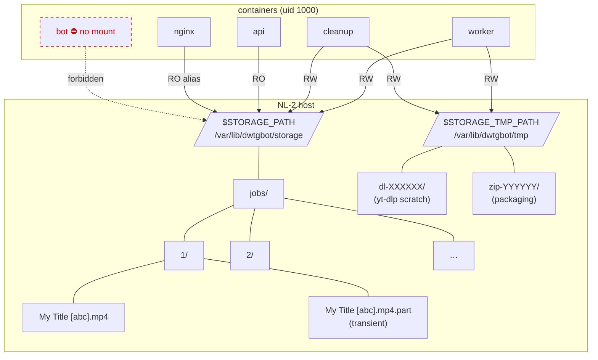

# 11 — Storage strategy

> Status: Stable
> Audience: SRE, backend engineers, security reviewers
> Read next: [`10-temp-links-and-delivery.md`](10-temp-links-and-delivery.md), [`09-queue-and-workers.md`](09-queue-and-workers.md), [`23-cleanup-retention.md`](23-cleanup-retention.md)

This document defines how files live on disk, who is allowed to read or
write where, how we defend against path traversal, how we reclaim space,
and how we enforce hard caps. The single source of truth on disk-related
decisions.

---

## 1. Layout

A single directory tree per host:

```
$STORAGE_PATH/                            # default: /var/lib/dwtgbot/storage
├── jobs/
│   ├── 1/                                # one subdir per download_jobs.id
│   │   ├── My Title [abc123].mp4
│   │   └── My Title [abc123].mp4.part    # transient, removed by yt-dlp
│   ├── 2/
│   └── ...
└── (nothing else — package_zip writes inside jobs/<id>/)

$STORAGE_TMP_PATH/                        # default: /var/lib/dwtgbot/tmp
├── dl-XXXXXX/                            # ephemeral yt-dlp scratch dirs
└── ...
```

Configurable in `app/config.py`:

| Setting | Default | Owner |
|---|---|---|
| `STORAGE_PATH` | `/var/lib/dwtgbot/storage` | the volume mount on NL-2 (в `single` — на единственном хосте; том объявлен в `deploy/compose/media.yml`) |
| `STORAGE_TMP_PATH` | `/var/lib/dwtgbot/tmp` | scratch space — keep local, never mount over NFS |
| `MAX_FILE_SIZE_MB` | `2048` (2 GiB) | hard ceiling per single artefact |

Mounted into:
- **worker** — read/write
- **api** — read-only (it only reads to issue `X-Accel-Redirect`)
- **nginx** — read-only (`alias /var/lib/dwtgbot/storage/`)
- **cleanup** — read/write

Bot does **not** mount the storage volume. It must not.

### 1.1 Layout and access map (visual)



Hard rules from this diagram:

1. **`bot` never mounts the volume.** If you ever feel the urge to add a
   storage mount to the bot service in `deploy/compose/control.yml`
   (или в `deploy/single/single.override.yml` — в `single` bot живёт на
   одном хосте с томом, но монтировать его всё равно нельзя),
   stop — the design has been violated.
2. **Only `worker` and `cleanup` write.** `api` and `nginx` are read-only.
   Reverse this and you're one bug away from a cleanup container deleting
   files an upload is still streaming.
3. **Same host path in worker and nginx.** `X-Accel-Redirect` returns a
   path that nginx must be able to resolve to the same bytes the worker
   wrote. Mismatched mount roots = silent 404s on otherwise valid links.

---

## 2. Path-traversal defense

All path math goes through `app/utils/filenames.py`:

```python
def ensure_within(base: Path, candidate: Path) -> Path:
    base_resolved = base.resolve()
    target_resolved = (base / candidate if not candidate.is_absolute() else candidate).resolve()
    target_resolved.relative_to(base_resolved)        # raises ValueError on escape
    return target_resolved
```

- `Path.resolve()` collapses `..`, `.`, and symlinks before the comparison.
- A `StorageError` is raised on escape; **never** convert this to a "not
  found" — it indicates active mischief.

`sanitize_filename` complements `ensure_within`:
- Strips control characters and shell metas.
- Collapses dot runs and whitespace.
- Preserves a short alphanumeric extension.
- Truncates to `MAX_NAME_LEN = 120`.

**Rule:** any filename that came from outside the system (yt-dlp, user
input, an old DB row) is sanitized before being concatenated to a path.
Any path that came from outside the system is `ensure_within`-ed before
being opened.

---

## 3. Job-scoped writes

`LocalStorage.job_dir(job_id)` returns the canonical write target for a
job:

```python
target = ensure_within(self._root, Path("jobs") / str(job_id))
target.mkdir(parents=True, exist_ok=True)
return target
```

Properties:
- Deterministic (re-running a job hits the same directory; idempotent
  cleanup).
- Per-job (no cross-talk between concurrent jobs).
- Always under `STORAGE_PATH` (`ensure_within` enforces it).

Providers must pass this path as `target_dir` to the runner. The runner's
`outtmpl` writes inside it. Nothing should ever write to
`STORAGE_PATH/jobs/` directly without a `job_id` subdir.

---

## 4. Scratch (`STORAGE_TMP_PATH`)

For yt-dlp working files (`.part`, fragment chunks, etc.) we keep things
inside the job directory by default — yt-dlp manages them. The
`STORAGE_TMP_PATH` exists for cases where we need a clearly transient
workspace (zipping, repacking) without polluting the final job dir:

```python
work = storage.make_tmp_workdir(prefix="zip-")
try:
    ...
finally:
    storage.remove_path(work)
```

Cleanup of `STORAGE_TMP_PATH` happens both:
- In code (`remove_path` after work).
- By the cleanup container, which sweeps `STORAGE_TMP_PATH/*` older than
  N hours.

If you find files in `STORAGE_TMP_PATH` older than a day, that's a
process leak — investigate (likely a worker that crashed without
unwinding its `try/finally`).

---

## 5. Galleries → ZIP packaging

When a job produces multiple files that don't fit Telegram's per-bot
upload, the worker zips them and serves the archive via a temp link.

```python
LocalStorage.package_zip(files, job_id, base_name) -> Path
```

Properties:
- ZIP **STORED** (no compression). Most media is already compressed; we
  pay CPU for nothing if we DEFLATE.
- Output written inside `jobs/<job_id>/<safe_base_name>.zip`. Living in
  the same job dir simplifies cleanup.
- `arcname` is just `src.name` — no nested directories inside the archive.
  The user gets a flat layout when extracting.

Edge cases:
- Files missing at zip time → silently skipped (logged at WARNING by
  `LocalStorage`). The result is the *available* set; cleanup may have
  raced us.
- Empty file list → `StorageError`. Caller must not call `package_zip`
  with no files.

---

## 6. Hard size cap

`assert_under_max(size_bytes)` enforces `MAX_FILE_SIZE_MB`. Any single
result whose total bytes exceeds the cap raises `StorageError` and is
surfaced to the user as "файл слишком большой". The cap exists to:

1. Bound disk consumption per job.
2. Keep ZIP packaging tractable.
3. Match the realistic bandwidth budget of a small VPS.

`MAX_FILE_SIZE_MB` is *not* the Telegram limit — that's
`TELEGRAM_MAX_UPLOAD_BYTES` (50 MiB by default). The relationship:

```text
file size ≤ TELEGRAM_MAX_UPLOAD_BYTES ?  -> upload to Telegram
file size ≤ MAX_FILE_SIZE_MB ?           -> issue temp link
file size > MAX_FILE_SIZE_MB ?           -> reject (StorageError)
```

Order matters. `DeliveryService` checks Telegram first, then link path,
then `_deliver_via_link` re-asserts the cap.

---

## 7. Disk space and free-space accounting

We do **not** preallocate, and we do not check `df` before downloads
today. Reasons:
- yt-dlp does not know the final size in advance for HLS/DASH.
- A pre-check race-conditions with concurrent jobs.

Instead we rely on:
1. **Cleanup container** keeping the floor swept (run every N minutes).
2. **`MAX_FILE_SIZE_MB`** bounding the worst single job.
3. **OS-level alarms** (Prometheus node_exporter, your alerting) for
   "disk > 80%". This is operational responsibility — see
   [`24-runbooks.md`](24-runbooks.md) (§12 — disk full) and
   [`31-troubleshooting.md`](31-troubleshooting.md) for triage.

If you add free-space checks to `LocalStorage`, do so in
`prepare_job_dir`, not deep inside the runner — fail fast.

---

## 8. Cleanup contract

Owned by the cleanup container (NL-2; в `single` — тот же хост, что и bot). Lives in
`app/workers/cleanup_worker.py` (see [`23-cleanup-retention.md`](23-cleanup-retention.md) and [`09-queue-and-workers.md`](09-queue-and-workers.md)).

The cleanup pass does, in order:

1. **Expire links**:
   `temp_links_repo.deactivate_expired()` flips `is_active=false` for
   `expires_at < now()`.
2. **Sweep files** for inactive links:
   `temp_links_repo.list_inactive_with_files(limit=500)` →
   `Path(link.file_path).unlink(missing_ok=True)`.
3. **Sweep job dirs** that contain no remaining files (best-effort
   `rmdir`).
4. **Sweep tmp**: remove `STORAGE_TMP_PATH/*` older than the configured
   threshold.
5. (Optional) **Purge media_cache** rows older than their `expires_at`.

The pass is idempotent. Running it twice in quick succession is safe.

---

## 9. File ownership and permissions

- All containers run as `app:1000` (non-root).
- The host volume must be `chown -R 1000:1000` on first install
  (handled by `deploy/scripts/install.sh`).
- Permissions: `0750` on directories, `0640` on files. yt-dlp creates with
  default umask; the cleanup container does not chmod files.

If you mount the volume into a container that runs as a different uid,
you will see `PermissionError`. Fix the uid, not the permissions.

---

## 10. Anti-patterns

1. **Returning `Path` objects to the bot.** The bot must remain disk-blind.
   Pass strings (URLs, captions) only.
2. **Writing outside `STORAGE_PATH`.** The runner's `outtmpl` should always
   begin with the result of `LocalStorage.job_dir(...)`.
3. **Compressing already-compressed media (DEFLATE).** Wastes CPU; STORE
   is correct.
4. **Symlinks inside `STORAGE_PATH`.** `resolve()` follows them and
   `ensure_within` enforces the resolved boundary, but introducing
   symlinks creates surprising deletion behaviour. Don't.
5. **Trusting filenames from yt-dlp.** Always pass them through
   `sanitize_filename` if you reuse them in non-`outtmpl` paths.
6. **Skipping cleanup "until we monitor disk usage properly".** Disk fills
   in days, not weeks. Cleanup is mandatory.

---

## 11. Common mistakes

| Mistake | Symptom | Fix |
|---|---|---|
| `STORAGE_PATH` mounted read-only into worker | `OSError: [Errno 30]` on `mkdir` | Mount RW into worker; RO into nginx/api is fine |
| Different `STORAGE_PATH` between worker and nginx | API returns 200 with `X-Accel-Redirect`, nginx 404s | Use the same host path; verify with `docker compose config` |
| `MAX_FILE_SIZE_MB` smaller than `TELEGRAM_MAX_UPLOAD_BYTES` | Logical inconsistency: Telegram upload would never trigger after the link path's reject | Keep `MAX_FILE_SIZE_MB` ≥ `TELEGRAM_MAX_UPLOAD_BYTES / (1024*1024)` always |
| File path with a leading `/` from yt-dlp escapes `STORAGE_PATH` | `StorageError: Path traversal blocked` | Always pass `target_dir=...` and let yt-dlp build paths from it |
| Cleanup is running but disk still fills | Likely `STORAGE_TMP_PATH` not swept; or workers leaking partials | Check `STORAGE_TMP_PATH` first; then the worker logs for crashes |
| ZIP with non-ASCII filenames opens with mojibake on Windows | Cosmetic | Use `ZipFile(... encoding='utf-8')` if you ever switch to DEFLATE |

---

## 12. Pre-merge checklist for storage-touching changes

Tick every box before requesting review of any PR that adds, moves, or
deletes a code path that interacts with the filesystem.

**Path safety**
- [ ] Every new `Path` derived from external input goes through
      `ensure_within(STORAGE_PATH, …)` (or `LocalStorage.job_dir(...)`).
- [ ] Every filename that originated outside the system (yt-dlp output,
      DB row, user input) goes through `sanitize_filename(...)` before
      being concatenated into a path.
- [ ] No `os.path.join(STORAGE_PATH, untrusted)` anywhere.
- [ ] No new symlinks created inside `STORAGE_PATH`.

**Mount surface**
- [ ] If a new container needs read access — added with `:ro` in
      the fragment `deploy/compose/media.yml` (сервисы определяются только
      во фрагментах; стеки `deploy/{single,nl1,nl2}/docker-compose.yml`
      содержат лишь `include`).
- [ ] If a new container needs write access — explicitly justified in the
      PR description; matches the access matrix in §1.1.
- [ ] `bot` service in `deploy/compose/control.yml` still has no
      storage mount, в том числе после наложения
      `deploy/single/single.override.yml`.
- [ ] `worker` and `nginx` resolve `STORAGE_PATH` to the same host path
      (re-check by `docker compose config` для обоих стеков:
      `deploy/single/docker-compose.yml` и `deploy/nl2/docker-compose.yml`).

**Lifecycle**
- [ ] Any new file written has an owner: either it's inside
      `jobs/<job_id>/` (cleaned up via `temp_links` lifecycle) or inside
      `STORAGE_TMP_PATH` (swept by cleanup container).
- [ ] No new "long-lived" files outside those two trees.
- [ ] Hard cap (`assert_under_max`) still applies to any new write path.

**Tests**
- [ ] At least one unit test in `app/tests/test_filenames.py` (or peer)
      covering the new path-handling code, including an attempted
      traversal (`..`, absolute path, symlink) that must raise.
- [ ] Tests do not write outside `tmp_path` fixtures.

**Docs**
- [ ] If you added a new directory under `STORAGE_PATH` — the layout in §1
      is updated.
- [ ] If you added a new env var (size cap, retention knob) — covered by
      [`13-config-and-env.md`](13-config-and-env.md).

If any box can't be ticked and you can't justify it in writing, the PR
isn't ready.

---

## 13. Future extension points

- **Quota per user** (e.g. "no more than X GiB / day"): track via
  `audit_logs` aggregation; enforce in the bot before enqueue.
- **Object storage backend**: replace `LocalStorage` with an `S3Storage`
  implementation behind the same interface. The temp-link endpoint would
  return `307` redirects to pre-signed URLs instead of `X-Accel-Redirect`.
- **Streaming transcode**: serve the file while still being transcoded —
  requires reworking the pipeline to expose progress; significant effort.
- **Content-addressed dedup**: hash-based caching across jobs. Currently
  rejected on UX/security grounds (different cookies → different
  content). Reconsider with strict per-user partitioning.
