# 12 — Database schema

> Status: Stable
> Audience: backend / data engineers, AI agents writing migrations
> Read next: [`04-domain-model.md`](04-domain-model.md), [`10-temp-links-and-delivery.md`](10-temp-links-and-delivery.md)

This is the canonical reference for the relational schema. The source of
truth in code is `app/infrastructure/db/models.py` plus the Alembic
migrations under `migrations/versions/`. **Never** change the live schema
by hand — always via a migration.

---

## 1. Tables at a glance

```mermaid
erDiagram
    DOWNLOAD_JOBS ||--o{ TEMP_LINKS : "1..N"
    DOWNLOAD_JOBS {
        BIGINT       id PK
        BIGINT       user_id
        BIGINT       chat_id
        TEXT         source_url
        ENUM         platform
        VARCHAR_128  media_id
        VARCHAR_512  title
        VARCHAR_64   selected_option_key
        VARCHAR_64   selected_format
        ENUM         status
        TEXT         file_path
        BIGINT       file_size
        VARCHAR_128  mime_type
        VARCHAR_255  telegram_file_id
        TEXT         public_url
        TEXT         error_message
        INTEGER      retries_count
        JSONB        extra
        TIMESTAMPTZ  created_at
        TIMESTAMPTZ  updated_at
        TIMESTAMPTZ  completed_at
    }
    TEMP_LINKS {
        BIGINT       id PK
        VARCHAR_128  token
        BIGINT       job_id FK
        TEXT         file_path
        TIMESTAMPTZ  expires_at
        INTEGER      max_downloads
        INTEGER      downloads_count
        BOOLEAN      is_active
        TIMESTAMPTZ  created_at
        TIMESTAMPTZ  updated_at
    }
    MEDIA_CACHE {
        BIGINT       id PK
        TEXT         source_url
        ENUM         platform
        VARCHAR_128  media_id
        VARCHAR_512  title
        JSONB        metadata_json
        TIMESTAMPTZ  expires_at
        TIMESTAMPTZ  created_at
        TIMESTAMPTZ  updated_at
    }
    AUDIT_LOGS {
        BIGINT       id PK
        VARCHAR_64   event_type
        JSONB        payload
        TIMESTAMPTZ  created_at
    }
    APP_SETTINGS {
        VARCHAR_128  key PK
        JSONB        value
        TIMESTAMPTZ  created_at
        TIMESTAMPTZ  updated_at
    }
```



---

## 2. Enums (Postgres native)

We use Postgres native `ENUM` types so values are validated at the
database level. They are created/dropped explicitly inside migrations
(`create_type=False` in the SQLAlchemy types).

| Type | Values | Used by |
|---|---|---|
| `platform` | `youtube`, `instagram` | `download_jobs.platform`, `media_cache.platform` |
| `job_status` | `pending`, `processing`, `done`, `failed` | `download_jobs.status` |

> **Adding a value to an ENUM:** Postgres needs `ALTER TYPE platform ADD
> VALUE 'tiktok'`. Wrap it in a migration that runs **before** any code
> can insert the new value. New ENUM values cannot be removed; plan
> deprecations carefully.

---

## 3. `download_jobs`

The central operational table. Every user request that gets past
"validate URL + pick option" produces exactly one row.

| Column | Type | Notes |
|---|---|---|
| `id` | `bigserial PK` | source of `arq` job id (`job:{id}`) |
| `user_id` | `bigint` | Telegram user id; indexed |
| `chat_id` | `bigint` | Telegram chat id; indexed |
| `source_url` | `text` | normalized URL |
| `platform` | `platform` (ENUM) | indexed |
| `media_id` | `varchar(128)` | provider-resolved id; nullable until first metadata fetch |
| `title` | `varchar(512)` | provider-resolved title; nullable |
| `selected_option_key` | `varchar(64)` | opaque-to-bot string from provider |
| `selected_format` | `varchar(64)` | provider-resolved (e.g. yt-dlp format spec or `mp3`) |
| `status` | `job_status` (ENUM, default `pending`) | indexed |
| `file_path` | `text` | absolute path on NL-2 storage volume (том `dwtgbot_storage` media plane; в `single` — на том же хосте) |
| `file_size` | `bigint` | bytes |
| `mime_type` | `varchar(128)` | best guess (mime.guess or yt-dlp) |
| `telegram_file_id` | `varchar(255)` | filled when delivered via Telegram |
| `public_url` | `text` | filled when delivered via temp link |
| `error_message` | `text` | truncated to 1000 chars by `mark_failed` |
| `retries_count` | `int default 0` | CHECK >= 0 |
| `extra` | `jsonb default '{}'` | escape hatch; do not query by it in hot paths |
| `completed_at` | `timestamptz` | set by `mark_done` / `mark_failed` |
| `created_at`, `updated_at` | `timestamptz default now()` | from `TimestampMixin` |

Indexes:
- `ix_download_jobs_user_id`, `ix_download_jobs_chat_id`,
  `ix_download_jobs_platform`, `ix_download_jobs_status` — single-col
  helpers for ad-hoc queries.
- `ix_download_jobs_status_created_at` — composite, used by ops queries
  ("show stuck jobs") and future scheduling.

Constraints:
- CHECK `retries_count >= 0` (`ck_download_jobs_retries_non_negative`).

---

## 4. `temp_links`

| Column | Type | Notes |
|---|---|---|
| `id` | `bigserial PK` | |
| `token` | `varchar(128)` | UNIQUE; `secrets.token_urlsafe(32)` ≈ 43 chars |
| `job_id` | `bigint FK download_jobs(id)` | `ON DELETE CASCADE` |
| `file_path` | `text` | absolute path under `STORAGE_PATH` |
| `expires_at` | `timestamptz` | UTC; indexed for cleanup |
| `max_downloads` | `int default 1` | CHECK >= 1 |
| `downloads_count` | `int default 0` | CHECK >= 0 |
| `is_active` | `bool default true` | indexed; flipped to false on exhaustion / expiry |
| `created_at`, `updated_at` | `timestamptz default now()` | |

Indexes & constraints:
- UNIQUE `token` (`uq_temp_links_token`) — lookup key.
- `ix_temp_links_job_id`, `ix_temp_links_expires_at`, `ix_temp_links_is_active`.
- CHECK constraints on `max_downloads`, `downloads_count`.
- `fk_temp_links_job_id_download_jobs` — `ON DELETE CASCADE`. Deleting a
  job deletes its links automatically.

Operationally, expired/exhausted rows linger until cleanup deletes the
underlying file and (optionally) the row itself.

---

## 5. `media_cache`

Short-TTL metadata cache to avoid re-calling yt-dlp's `extract_info` for
the same URL.

| Column | Type | Notes |
|---|---|---|
| `id` | `bigserial PK` | |
| `source_url` | `text` | UNIQUE — lookup key |
| `platform` | `platform` (ENUM) | denormalised from URL |
| `media_id` | `varchar(128)` | indexed (cross-link discovery) |
| `title` | `varchar(512)` | UI hint |
| `metadata_json` | `jsonb` | `MediaInfo.raw`-shaped |
| `expires_at` | `timestamptz` | indexed (cleanup) |
| `created_at`, `updated_at` | `timestamptz` | |

Constraints:
- UNIQUE `source_url`.

Application reads treat `expires_at < now()` rows as absent; they are
deleted by the periodic `purge_expired` task.

---

## 6. `audit_logs`

Append-only event log. Currently optional; the application doesn't write
to it by default. Reserved for future structured audit needs (admin
actions, security events).

| Column | Type | Notes |
|---|---|---|
| `id` | `bigserial PK` | |
| `event_type` | `varchar(64)` | indexed |
| `payload` | `jsonb` | event-specific shape |
| `created_at` | `timestamptz default now()` | indexed |

No `updated_at` — events are immutable.

---

## 7. `app_settings`

Optional runtime feature flags / overrides. Not used in core flow today;
reserved for "tweak without redeploy" scenarios.

| Column | Type | Notes |
|---|---|---|
| `key` | `varchar(128) PK` | flag name (e.g. `feature.tiktok`) |
| `value` | `jsonb` | structured value (`{"enabled": true}`) |
| `created_at`, `updated_at` | `timestamptz` | |

If you wire a setting into runtime behaviour, also record it in
[`13-config-and-env.md`](13-config-and-env.md) and ensure changing it
doesn't require a restart (or document that it does).

---

## 8. Index strategy

Read patterns we optimise for:

| Query | Index |
|---|---|
| "find a job by id" | PK |
| "find all jobs for a user" | `ix_download_jobs_user_id` |
| "find a temp link by token" | `uq_temp_links_token` |
| "expire links" | `ix_temp_links_expires_at` |
| "list temp links to clean up" | `ix_temp_links_is_active` |
| "find stuck jobs" (ops) | `ix_download_jobs_status_created_at` |
| "lookup metadata by URL" | `uq_media_cache_source_url` |

We deliberately do **not** index `download_jobs.source_url` — duplicate
URLs across users are common and the column is large; per-job lookup goes
by id.

---

## 9. Migrations

- Tooling: Alembic with async engine (`asyncpg`).
- Naming: timestamped + slug, e.g. `20260101_0000_0001_initial.py`.
- IDs: short slug after timestamp (`0001_initial`); used as `revision` /
  `down_revision`.
- Naming convention for constraints/indexes is enforced via SQLAlchemy's
  `MetaData(naming_convention=...)` (see `app/infrastructure/db/base.py`).

### Workflow

```bash
# 1. Edit ORM model in app/infrastructure/db/models.py
# 2. Generate revision
alembic revision --autogenerate -m "add tiktok value to platform enum"
# 3. *Hand-review* the generated file. Autogenerate is a hint, not a contract.
# 4. Run locally
alembic upgrade head
# 5. Commit. Migrations are part of the same PR as the model change.
```

> **Hard rule:** never edit a migration that has been merged. If you need
> to change behaviour, write a follow-up migration.

### Production rollout

The `bot` container runs `alembic upgrade head` at startup (see
`docker/bot.entrypoint.sh`). For risky migrations:
1. Run migrations manually first via `deploy/scripts/deploy_update.sh`
   (NL-1 mode; в `single` — `deploy_update.sh single`).
2. Take a backup *before* (`deploy/scripts/backup.sh`).
3. Have a tested `downgrade()` for the migration; if you didn't write
   one, document why.

---

## 10. Backups & restore

Backups: `deploy/scripts/backup.sh` runs `pg_dump | gzip` on a schedule
(systemd timer or external cron — see [`20-deployment.md`](20-deployment.md) and [`23-cleanup-retention.md`](23-cleanup-retention.md)).

| Aspect | Setting |
|---|---|
| Mode | `pg_dump` custom format, gzipped |
| Frequency | hourly (configurable) |
| Retention | N most recent, default 24 hourly + 14 daily |
| Location | NL-1 local + (optionally) off-site; в `single` — локально на единственном хосте (вместе с данными), поэтому off-site копия особенно важна |
| Restore | `deploy/scripts/restore.sh` (interactive, asks for confirmation) |

Restore stops services, drops & recreates DB, loads dump, restarts. See
the script comments for the full sequence.

---

## 10.1 Concurrency primitives

A few hot paths rely on Postgres-native concurrency control rather than
optimistic retries. They are documented here so future changes do not
silently drop the guarantee. See ADR-0008 for the rationale.

| Operation | Primitive | Where | What it guarantees |
|---|---|---|---|
| Per-user job cap (`MAX_CONCURRENT_JOBS_PER_USER`) | `pg_advisory_xact_lock(user_id)` inside the same transaction as the count + insert | `JobsRepository.create_if_under_cap` (impl: `app/infrastructure/db/repositories/jobs_repo_impl.py`) | Two concurrent enqueues for the **same** user are serialised; no TOCTOU between `count(active)` and `INSERT`. Lock is freed on COMMIT/ROLLBACK automatically — no bookkeeping. |
| Temp-link single-use counter (`max_downloads`) | Single statement: `UPDATE temp_links SET downloads_count = downloads_count + 1, is_active = CASE WHEN ... END WHERE token = :t AND is_active AND expires_at > now AND downloads_count < max_downloads RETURNING *` | `TempLinksRepository.try_register_use` (impl: `app/infrastructure/db/repositories/temp_links_repo_impl.py`) | Two concurrent `/d/<token>` requests for a `max_downloads=1` link cannot both increment past the cap; the second observes "no row matched" and returns `None`. |

> **Hard rule:** any new "check then write" pattern on `download_jobs`
> or `temp_links` must use one of these primitives — *not* an
> application-level lock and *not* a separate `SELECT` followed by a
> conditional `UPDATE`.

---

## 11. Anti-patterns

1. **Schema changes via `psql` on the live DB.** Always Alembic.
2. **Storing binary data in Postgres.** Files live on disk under
   `STORAGE_PATH`; the DB tracks references.
3. **Adding indexes "just in case".** Each index is write overhead;
   justify with a query.
4. **Reading `download_jobs.extra` in hot paths.** It's a JSONB scratchpad
   for one-off needs. If you find yourself filtering by it, promote to a
   typed column.
5. **Storing user PII (full name, phone, email).** Out of scope. The bot
   only persists Telegram numeric ids.
6. **Soft deletes.** We don't have an `is_deleted` column. Cleanup deletes
   rows. If audit retention is needed, write to `audit_logs`.
7. **`SELECT * FROM download_jobs` in user-facing endpoints.** This table
   grows; always paginate and select explicit columns.
8. **Splitting a check-and-write into two SQL round-trips.** Use the
   primitives in §10.1 (advisory lock or `UPDATE ... WHERE ...
   RETURNING`). A `SELECT count(*)` followed by an unconditional
   `INSERT` is the canonical race we already paid for once.

---

## 12. Common mistakes

| Mistake | Symptom | Fix |
|---|---|---|
| Forgot to add the new ENUM value via migration | `InvalidTextRepresentation` | Write the migration; rollback the deploy until it lands |
| Ran an autogenerated migration without reviewing | Spurious dropped index, unexpected `ALTER TYPE` | Review the diff every time; trim noise |
| Set `nullable=False` on a new column without a default for existing rows | Migration aborts on a non-empty DB | Either provide `server_default` or do a multi-step migration (add nullable → backfill → enforce NOT NULL) |
| Used `datetime.utcnow()` (naive) in a CHECK or default | Tz comparisons go wrong | Use `func.now()` (timestamptz) |
| Cascaded delete on `download_jobs` from a parent we don't have | Surprise: rows vanish | Audit FK rules — currently the only cascade is `temp_links → download_jobs` |
| Long-running migration locks `download_jobs` | Bot can't INSERT, queue stalls | Use `CREATE INDEX CONCURRENTLY`, batch updates, deploy during low traffic |

---

## 13. Sample queries (operations)

These are the queries you'll actually run during incidents.

```sql
-- Stuck jobs (PROCESSING for too long)
SELECT id, user_id, platform, updated_at, retries_count
FROM   download_jobs
WHERE  status = 'processing'
  AND  updated_at < now() - interval '30 minutes'
ORDER BY updated_at;

-- Failure rate per platform (last hour)
SELECT platform,
       count(*) FILTER (WHERE status = 'failed') AS failed,
       count(*)                                   AS total
FROM   download_jobs
WHERE  created_at > now() - interval '1 hour'
GROUP BY platform;

-- Live temp links (still serveable)
SELECT count(*)
FROM   temp_links
WHERE  is_active AND expires_at > now() AND downloads_count < max_downloads;

-- Largest jobs (audit / capacity)
SELECT id, file_size, mime_type, created_at
FROM   download_jobs
WHERE  file_size IS NOT NULL
ORDER BY file_size DESC
LIMIT 20;

-- Recent failures with reasons
SELECT id, platform, error_message, retries_count, completed_at
FROM   download_jobs
WHERE  status = 'failed'
ORDER BY completed_at DESC NULLS LAST
LIMIT 50;
```

Keep these in your runbook (or a saved query in your tooling).
