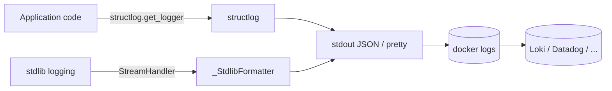

# 14 — Logging and observability

> Status: Stable
> Audience: backend / SRE engineers, on-call responders, AI agents
> Read next: [`15-healthchecks.md`](15-healthchecks.md), [`24-runbooks.md`](24-runbooks.md)

We log a lot — but with discipline. This document defines the logging
contract: format, transport, correlation, taxonomy of events, and what
"observable" actually means for this project.

There are no metrics or tracing backends shipped by default; we rely on
**structured logs** as the primary signal. The format is designed so
ingest into Loki / Datadog / OpenSearch is a one-liner.

---

## 1. Stack at a glance



Key facts:
- One logging configuration in `app/logging_config.py:configure_logging`.
- `structlog` is the API for our code; stdlib `logging` is bridged through
  the same processor chain so third-party libs (`httpx`, `sqlalchemy`,
  `telegram`, `arq`) emit consistent records.
- Output is **always to stdout**. Docker captures it (json-file driver
  with rotation: `max-size: 10m`, `max-file: 5`). No file-based sinks.
- Format is **JSON in production**, ConsoleRenderer (pretty + colors) in
  development.

---

## 2. Configuration

```python
def configure_logging(settings: Settings) -> None:
    timestamper = structlog.processors.TimeStamper(fmt="iso", utc=True)
    shared_processors = [
        structlog.contextvars.merge_contextvars,    # correlation
        structlog.processors.add_log_level,
        structlog.stdlib.add_logger_name,
        timestamper,
        structlog.processors.StackInfoRenderer(),
        structlog.processors.format_exc_info,
    ]
    renderer = (structlog.processors.JSONRenderer()
                if settings.LOG_JSON or settings.is_production
                else structlog.dev.ConsoleRenderer(colors=True))
    structlog.configure(...)
    logging.getLogger().handlers = [_handler_with(renderer)]
```

Properties:
- `merge_contextvars` first → every record automatically inherits the
  bound correlation context.
- `add_log_level` and `add_logger_name` → consistent fields across all
  records.
- `TimeStamper(fmt="iso", utc=True)` → ISO-8601 timestamps in UTC; no
  ambiguity.
- `format_exc_info` → exceptions serialize cleanly into JSON instead of
  multi-line tracebacks that break log parsers.
- Noisy libraries are clamped to `INFO` minimum: `httpx`, `httpcore`,
  `telegram.ext.Application`, `asyncio`.

`configure_logging` is **idempotent** — safe to call multiple times. Each
process entrypoint calls it exactly once before doing anything else.

---

## 3. Correlation context

Source: `app/utils/correlation.py`.

```python
def new_request_id() -> str: return uuid.uuid4().hex

@contextmanager
def bind_context(**kwargs) -> Iterator[None]:
    tokens = structlog.contextvars.bind_contextvars(**kwargs)
    try: yield
    finally: structlog.contextvars.reset_contextvars(**tokens)
```

`bind_context` uses `contextvars`, which work correctly across
`await` boundaries. Bound keys appear on every log line emitted inside
the block, regardless of how deep the call stack is.

### Standard keys

| Key | Type | Source | Lifespan |
|---|---|---|---|
| `request_id` | hex32 (UUID4) | minted by bot middleware on inbound update | from message receive to handler return |
| `update_id` | int | Telegram `Update.update_id` | per update |
| `user_id`, `chat_id` | int | Telegram update | per update |
| `job_id` | int | DB sequence | from enqueue onward, into worker |
| `platform` | str | provider/job | added by worker on pickup |
| `token` | str (truncated) | TempLinkService | API serve |

### Where they get bound

| Layer | Binds |
|---|---|
| `app/bot/middleware/logging_mw.py` | `request_id`, `update_id`, `user_id`, `chat_id` |
| `app/bot/handlers/links.py` | (re)binds `request_id`, `user_id`, `chat_id` for the analyze flow |
| `app/application/use_cases/process_download.py` | `job_id`, `user_id`, `chat_id`, `request_id`, `platform` |
| `app/api/public/downloads.py` | logs include truncated `token` (`token[:8]+"..."`) |

> **Rule:** every async unit of work that has a meaningful identity must
> be entered through `bind_context(...)`. Adding a new background task or
> handler without binding is a bug.

---

## 4. Event taxonomy (the words we log)

Use **snake_case nouns** for the `event` field. Past tense verbs are
acceptable for state transitions. Avoid free-form sentences. Prefer
adding structured fields over inflating the message.

| Convention | Examples |
|---|---|
| `<subject>_<action>_<outcome>` | `link_rejected`, `job_done`, `temp_link_issued`, `temp_link_served` |
| `<subject>_<state>` | `worker_started`, `worker_stopped` |
| `<subject>_<action>_failed` | `job_failed_app_error`, `job_failed_unexpected`, `notify_user_about_failure_failed` |
| `<subject>_check_failed` | `worker_startup_check_failed` |

Existing events you'll see in the codebase (non-exhaustive):

| Event | Logger | Level | Where |
|---|---|---|---|
| `link_rejected` | bot | INFO | invalid/unsupported URL |
| `link_analysis_failed` | bot | WARNING | `AppError` from analyze |
| `link_analysis_unexpected_error` | bot | ERROR (with `exc_info`) | unexpected exception |
| `youtube_download_done` | provider | INFO | per-job summary |
| `worker_started` / `worker_stopped` | worker | INFO | arq lifecycle |
| `worker_startup_check_failed` | worker | ERROR | `validate_runtime` errors |
| `job_done` | worker | INFO | success path; carries `total_seconds`, `file_size_class` (see ADR-0007 §2.4) |
| `job_failed_app_error` | worker | WARNING | mapped failure |
| `job_failed_unexpected` | worker | ERROR (with `exc_info`) | bug or external chaos |
| `job_status_changed` | worker | INFO | every state transition; fields: `from_`, `to`, `reason_class` ∈ {`ok`, `user_error`, `provider_error`, `network_error`, `internal_error`} (ADR-0007 §2.3) |
| `bot_message_handled` | bot middleware | INFO | every PTB handler entry; fields: `outcome` ∈ {`ok`, `user_error`, `internal_error`}, `latency_ms`, `latency_bucket` (ADR-0007 §2.1) |
| `job_enqueued` | bot use case | INFO | success path of `EnqueueDownloadUseCase` (jobs created on the per-user cap reject path are NOT counted; that emits `job_enqueue_rejected` in the rate-limit layer) |
| `temp_link_issued` | service | INFO | issuance |
| `temp_link_served` | api | INFO | served via `/d/{token}`; fields: `result` ∈ {`ok`, `not_found`, `expired`, `gone`, `forbidden`} (ADR-0007 §2.8) |
| `temp_link_path_invalid` | api | ERROR | path traversal blocked |
| `delivered_via_temp_link` | service | INFO | success large-file |
| `queue_depth_sample` | bot sampler | DEBUG | `depth`; sampled every `METRICS_QUEUE_SAMPLE_INTERVAL_S` (ADR-0007 §2.6) |

Adding new events: pick a verb that matches the table above; add the
event to `docs/14-logging-observability.md` if it is meant to be queried
by SREs.

---

## 5. Log level policy

| Level | Use for |
|---|---|
| `DEBUG` | Very verbose internals; off in production by default |
| `INFO` | Normal operational events: state transitions, business outcomes |
| `WARNING` | Recoverable errors, user-facing rejections (`AppError`), retries |
| `ERROR` | Unexpected failures requiring engineer attention; always include `exc_info` |
| `CRITICAL` | Process cannot continue; expect immediate restart |

Rules:
- A user typing a bad URL is INFO — they get an error message; nothing
  broken.
- A yt-dlp 5xx is WARNING — we'll retry; if it persists, the eventual
  FAILED is ERROR-worthy at the top level (we already log
  `job_failed_unexpected`).
- Anything that returns a 5xx from the API or kills a process is ERROR or
  CRITICAL.

---

## 6. Sample log lines

Production (JSON, abbreviated):

```json
{"event":"update_received","level":"info","logger":"app.bot.middleware.logging_mw","timestamp":"2026-04-19T08:31:42.118Z","request_id":"a1b2...","update_id":1234567,"user_id":42,"chat_id":42}
{"event":"youtube_download_done","level":"info","logger":"app.infrastructure.providers.youtube","timestamp":"2026-04-19T08:31:55.901Z","request_id":"a1b2...","job_id":7821,"user_id":42,"chat_id":42,"platform":"youtube","files":1,"total_bytes":18234112,"primary":"My Title [abc123].mp4","mime":"video/mp4"}
{"event":"job_done","level":"info","logger":"app.application.use_cases.process_download","timestamp":"2026-04-19T08:31:56.043Z","request_id":"a1b2...","job_id":7821,"user_id":42,"chat_id":42,"platform":"youtube","method":"telegram_upload","size":18234112}
```

Development (pretty):

```
2026-04-19T08:31:42Z [info     ] update_received [app.bot.middleware.logging_mw] request_id=a1b2... user_id=42 chat_id=42
2026-04-19T08:31:55Z [info     ] youtube_download_done [...] files=1 total_bytes=18234112
2026-04-19T08:31:56Z [info     ] job_done [...] method=telegram_upload size=18234112
```

---

## 7. Useful log queries (Loki/LogQL syntax — adapt to your stack)

These are the queries the on-call engineer should have bookmarked.

| Goal | Query |
|---|---|
| Trace a single user request E2E | `{app="dwtgbot"} \| json \| request_id="<the-id>"` |
| All jobs for a user in last hour | `{app="dwtgbot"} \| json \| user_id=42 \| event="job_done" or event=~"job_failed.*"` |
| Failure rate per platform | `sum by (platform) (rate({app="dwtgbot",service="worker"} \| json \| event=~"job_failed.*" [5m]))` |
| Worker startup issues | `{app="dwtgbot",service="worker"} \| json \| event="worker_startup_check_failed"` |
| Temp links rejected as path-traversal | `{app="dwtgbot",service="api"} \| json \| event="temp_link_path_invalid"` |

If you don't have Loki/Datadog yet, `docker compose logs --since 1h` +
`jq` works fine for first-pass triage.

---

## 8. What we deliberately do NOT log

- **Bot token, Postgres password, Redis password, internal API token,
  Let's Encrypt private key.** Configuration is loaded into `Settings`
  and never logged. If you need to confirm a value during debugging, use
  `python -c "from app.config import get_settings; print(get_settings().XXXX)"`
  inside a maintenance shell — don't add a log line.
- **Full temp-link tokens.** Always log `token[:8] + "..."`. The token
  alone is the credential; logging it is equivalent to leaking the file.
- **Telegram user PII** beyond numeric `user_id` / `chat_id`. No usernames,
  full names, phone numbers.
- **Full source URLs in WARNING/ERROR lines for analytics**. The URL is
  fine to log at INFO when troubleshooting, but treat it as PII-adjacent —
  do not push it to a public dashboard.
- **Raw HTTP request bodies / Telegram updates** in production. They can
  contain user-controlled content. Use DEBUG sparingly when diagnosing.

---

## 9. Metrics and tracing — the today/tomorrow story

| Capability | Today | Tomorrow (extension) |
|---|---|---|
| Counters / histograms | none | wire `prometheus-client` and expose `/metrics` on the API container |
| Distributed tracing | none | OpenTelemetry — set up `OTEL_EXPORTER_*`, propagate `request_id` as a trace id |
| Health metrics | `/healthz` and `/readyz` | already there; can be scraped by Blackbox Exporter |
| Log shipping | docker json-file → external aggregator (manual) | Promtail / Vector sidecar |
| Alerting | external (e.g. Loki ruler) | bundle a starter alert pack as ADR followup |

The hexagonal split keeps these additions cheap: metrics live in the
infrastructure layer; the domain doesn't change.

---

## 10. Anti-patterns

1. **`print(...)` anywhere.** Always `_logger.info(...)` etc.
2. **`logger.info(f"job done: {job}")`** — string interpolation kills
   structured search. Use `logger.info("job_done", job_id=job.id, ...)`.
3. **Logging entire dicts of raw data.** Pick the fields that matter;
   omit the rest.
4. **`except Exception: pass`** without a log line. Even "best-effort"
   blocks must log at WARNING.
5. **`print(repr(traceback.format_exc()))`** — use `_logger.exception(...)`
   which serializes via `format_exc_info`.
6. **Logging from inside tight loops without rate limiting.** Pre-aggregate
   and log a summary.
7. **Adding a new event but never querying it.** If no one will look for
   it, it doesn't deserve to be in the index.

---

## 11. Common mistakes

| Mistake | Symptom | Fix |
|---|---|---|
| Forgot `bind_context` in a new handler | Logs missing `request_id` | Wrap the handler body in `with bind_context(...)` |
| Used f-string for the event name | Hard to grep / aggregate | Use a constant string + structured fields |
| Logged the full token | Token leaked to log aggregator | Truncate; rotate the leaked link (delete from DB) |
| `_logger.error(str(exc))` lost the traceback | Hard to diagnose | Use `_logger.exception(...)` |
| Bot logs lack `chat_id` after a follow-up callback | Forgot to bind on callback path | Re-bind in the callback handler before doing work |
| Production runs with `LOG_JSON=false` | Aggregator parser fails | Set `LOG_JSON=true` or rely on `is_production` (already forces JSON) |

---

## 12. Future extension points

- **Audit-log integration**: write select events also to the
  `audit_logs` table for long-term retention (security events, admin
  actions). Beware of double writes; use a small wrapper.
- **Per-tenant/log-group routing**: when we eventually have multiple
  bots from one codebase, add a `tenant_id` to the bound context and
  route logs accordingly.
- **Sampling for high-volume INFO** (e.g. successful temp-link serves):
  `structlog.processors.LogfmtRenderer` + custom sampler if costs grow.
