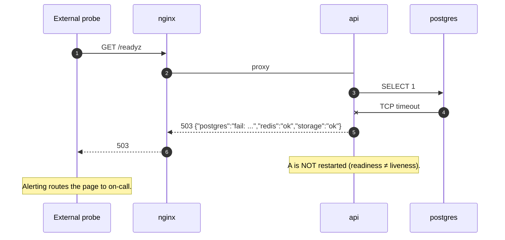

# 15 — Health checks

> Status: Stable
> Audience: SRE, on-call, AI agents wiring orchestration
> Read next: [`14-logging-observability.md`](14-logging-observability.md), [`19-docker-architecture.md`](19-docker-architecture.md)

We expose two HTTP endpoints (`/healthz`, `/readyz`) on the API container,
plus container-level Docker `HEALTHCHECK`s for processes that don't speak
HTTP (bot, worker, cleanup, backup). This document defines the contract,
the matrix of who checks what, and how Docker / external probes consume
them.

---

## 1. Liveness vs readiness

| Probe | Question it answers | What it checks | Reaction on failure |
|---|---|---|---|
| **Liveness** (`/healthz`) | "Is the process alive enough to recover?" | The process responds to HTTP at all | Restart the container |
| **Readiness** (`/readyz`) | "Should I send real traffic?" | DB + Redis reachable, storage writable | Stop sending traffic; DO NOT restart |

If you only remember one rule: **liveness must never call external
dependencies.** A flaky DB must never restart your bot — that just
amplifies outages.

---

## 2. The HTTP endpoints (FastAPI)

Source: `app/api/internal/health.py`.

### `GET /healthz`

```python
@router.get("/healthz")
async def healthz() -> dict[str, str]:
    return {"status": "ok"}
```

- Returns `200 OK` with `{"status": "ok"}` whenever the FastAPI app is
  serving requests.
- No DB, no Redis, no disk.
- Behind nginx, reachable as `https://<server>/healthz` too — see the
  nginx vhost.

### `GET /readyz`

```python
@router.get("/readyz")
async def readyz(...):
    checks = {}
    # Postgres: SELECT 1
    # Redis:    PING → "PONG"
    # Storage:  composition.storage.init()  (mkdir + write probe)
    if any(v != "ok" for v in checks.values()):
        raise HTTPException(503, detail=checks)
    return {"status": "ready", "env": ..., "checks": checks}
```

- Returns `200 OK` with per-component checks when **all** components are
  healthy.
- Returns `503 Service Unavailable` with the same check map when **any**
  check fails. The full breakdown is in the response body.
- Storage check uses `LocalStorage.init()` — idempotent, so repeated
  probes don't churn.

Sample healthy response:

```json
{
  "status": "ready",
  "env": "production",
  "checks": {"postgres": "ok", "redis": "ok", "storage": "ok"}
}
```

Sample failure response (`HTTP 503`):

```json
{
  "detail": {
    "postgres": "ok",
    "redis": "fail: Connection refused",
    "storage": "ok"
  }
}
```

> **Rule:** never make `/readyz` slow. If you add a check, give it a
> short timeout (≤2 s). If the check itself can hang, isolate it with
> `asyncio.wait_for`.

---

## 3. Container HEALTHCHECK matrix

Each Dockerfile / compose service has an opinionated `HEALTHCHECK`. See
`docker/*.Dockerfile` and `deploy/nl{1,2}/docker-compose.yml`.

| Service | Check | Source |
|---|---|---|
| `postgres` (NL-1) | `pg_isready -U $USER -d $DB` | compose |
| `redis` (NL-1) | `redis-cli ping \| grep -q PONG` | compose |
| `bot` (NL-1) | `pgrep -f app.main_bot` | Dockerfile + compose |
| `api` (NL-1, NL-2) | `curl -fsS http://127.0.0.1:$API_PORT/healthz` | compose |
| `worker` (NL-2) | `pgrep -f 'arq\|app.main_worker'` | Dockerfile + compose |
| `cleanup` (NL-2) | (none — short-lived loop; Docker reports as healthy if running) | compose |
| `nginx` (NL-2) | `wget -qO- http://127.0.0.1/healthz \| grep -q ok` | compose |
| `backup` (NL-1) | `pg_isready` against postgres before each run (script-internal) | compose script |
| `migrate` (NL-1) | one-shot job; "completed_successfully" | compose |

### Why mixed strategies?

- **HTTP** for processes that already serve HTTP (api, nginx).
- **`pgrep`** for non-HTTP daemons. We don't want to add a healthcheck
  HTTP server to the bot or worker just for liveness.
- **Vendor command** (`pg_isready`, `redis-cli ping`) for the data
  stores; they know best.

### Default values

```yaml
healthcheck:
  test: [...]
  interval: 30s   # bot, worker
  interval: 15s   # api, nginx
  interval: 10s   # postgres, redis
  timeout: 5-10s
  retries: 3
  start_period: 15-20s
```

`start_period` matters: during cold start, builds, or migrations, we
don't want Docker to restart-loop a perfectly fine container.

---

## 4. Use `depends_on: condition: service_healthy`

We rely on Docker Compose's healthcheck-aware `depends_on` to enforce
startup order:

```yaml
bot:
  depends_on:
    postgres: { condition: service_healthy }
    redis:    { condition: service_healthy }
    migrate:  { condition: service_completed_successfully }
```

Result: `bot` does not start until Postgres and Redis are healthy and
migrations are done. This eliminates an entire class of "first-deploy
flakes" where the bot connects before the DB is ready.

---

## 5. Worker doesn't expose health — why?

The worker is a single-purpose daemon. Adding an HTTP server just for
liveness would:
- Increase the attack surface inside the media plane.
- Introduce a port that shouldn't be reachable from anywhere.

Container-level `pgrep` is enough for liveness ("is the process alive?").
For semantic readiness — "is the worker actually picking up jobs?" — the
true signal is **operational**, not health-endpoint based:

| Symptom | Likely cause |
|---|---|
| arq queue length grows; `download_jobs.PROCESSING` doesn't advance | worker is wedged; check logs, restart |
| arq queue length is 0; new jobs not picked up | worker can't reach Redis, or `_on_startup` failed |
| `worker_startup_check_failed` in logs | `validate_runtime` aborted; fix env, redeploy |

These are covered as alerts in [`24-runbooks.md`](24-runbooks.md).

---

## 6. External probes

Where you probe from depends on what you're guarding against:

| Layer | Probe target | Probe path |
|---|---|---|
| Public internet uptime | `https://<server>/healthz` (nginx) | from outside |
| Application up | `https://<server>/readyz` (nginx → api on NL-2) | from outside |
| NL-1 internal | `http://api:8080/readyz` (compose-internal) | inside NL-1 |
| Per-container | Docker `HEALTHCHECK` | local |

Public `https://<server>/readyz` reaches **NL-2's** API container only;
it confirms NL-2's view of NL-1's DB/Redis. NL-1's own `api` container is
not exposed publicly — by design.

---

## 7. Sequence: cold start

```mermaid
sequenceDiagram
    autonumber
    participant DC as docker compose up
    participant PG as postgres
    participant R  as redis
    participant M  as migrate (one-shot)
    participant B  as bot
    participant A  as api

    DC ->> PG: start; HEALTHCHECK loop
    DC ->> R:  start; HEALTHCHECK loop
    PG -->> DC: healthy
    R  -->> DC: healthy
    DC ->> M:  start (depends_on healthy PG)
    M  -->> DC: completed_successfully
    DC ->> B:  start (depends_on M completed)
    DC ->> A:  start (depends_on PG, R healthy)
    B ->> PG: connect; subscribe to logging
    A ->> A:  /healthz starts returning 200
```

If any HEALTHCHECK fails repeatedly, Docker marks the container
`unhealthy` and (if `restart: unless-stopped`) restarts it. Compose's
`depends_on: service_healthy` will not start downstream services until
the upstream is `healthy`.

---

## 8. Sequence: dependency outage



---

## 9. Adding a new check

Use `/readyz` only for things whose failure means "**don't send me
traffic**". If failure means "**page someone**", build it into your alert
rules, not the readiness probe.

Checklist:

- [ ] Add the check inside `readyz()` in `app/api/internal/health.py`.
- [ ] Wrap with `try/except`; never let an exception escape — set
      `checks["thing"] = "fail: ..."` instead.
- [ ] Bound the check (`asyncio.wait_for` if it can hang).
- [ ] Update this document's sample response and the table.
- [ ] Add a runbook line: "if `readyz` shows `thing: fail`, do X" in
      [`24-runbooks.md`](24-runbooks.md).

---

## 10. Anti-patterns

1. **Mixing liveness and readiness.** A liveness probe that hits the DB
   = restart loops during DB outages.
2. **Long readiness checks.** Anything > 2 s slows orchestrator
   reactions. Keep checks cheap.
3. **`/readyz` returning 200 with `"status":"degraded"`.** Use the HTTP
   status to communicate; don't expect ops tools to parse JSON for
   readiness.
4. **Hidden side effects in checks.** Don't run migrations or write
   files from `/readyz`. The storage check uses `init()` which is
   idempotent and cheap; that's the limit.
5. **Authentication on `/healthz`.** It's accessed by orchestrators and
   load balancers; don't put it behind a token.
6. **Adding a HEALTHCHECK to the worker that opens a socket.** Use
   `pgrep`. We don't expose worker ports.

---

## 11. Common mistakes

| Mistake | Symptom | Fix |
|---|---|---|
| Migration job stuck → bot won't start | Cold-start hangs; bot service stays "created" | Investigate `migrate` logs (`docker compose logs migrate`); fix the offending migration |
| Workers report healthy via `pgrep` but don't process jobs | Queue grows | Check Redis reachability from NL-2; check `worker_started` log appeared after the last restart |
| `/readyz` returns 503 only sometimes | Flaky DB pool / Redis connection | Increase pool size; ensure firewall allows persistent connections |
| Healthcheck `curl` not present in image | "exec: curl: not found" → `unhealthy` | We install `curl` in `api` image; if you build a slimmer image, replace with `wget` (already used in nginx) |
| Probe fails because `start_period` is too short | New deploys flap as `unhealthy` early | Increase `start_period` for slow-starting services |

---

## 12. Future extension points

- **`/metrics`** (Prometheus) on the API container — aggregate counters
  (`jobs_total{status}`, `tempLinks_active`, etc.).
- **Synthetic probes** that download a known small file from `/d/...` to
  validate the *whole* delivery path end-to-end.
- **OpenTelemetry health signal** — emit "ok" beacons that double as
  presence indicators.
- **Worker health endpoint** if we ever expose admin actions (drain,
  pause). Today not needed.
