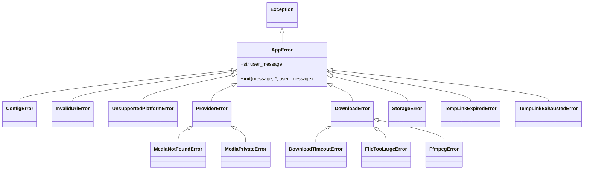
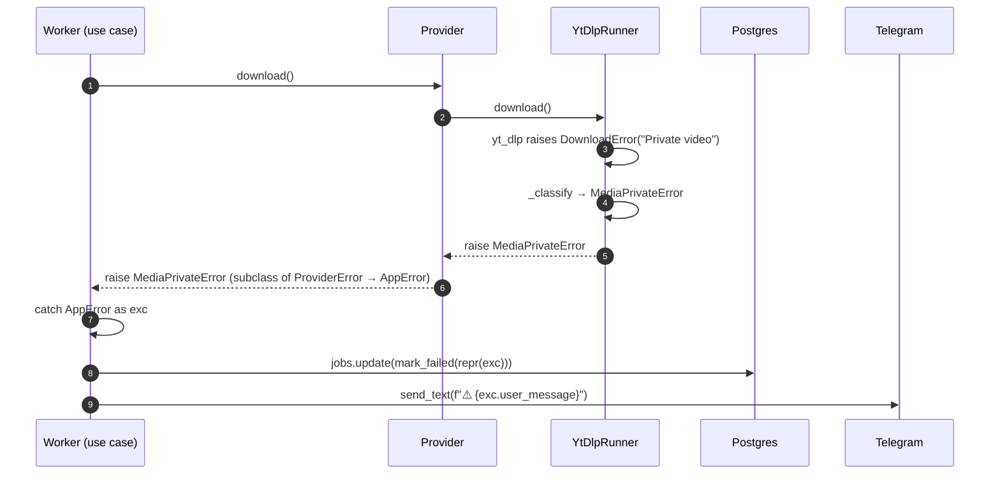

# 16 — Error handling

> Status: Stable
> Audience: backend engineers, AI agents adding features
> Read next: [`14-logging-observability.md`](14-logging-observability.md), [`07-provider-architecture.md`](07-provider-architecture.md)

A small, opinionated exception hierarchy makes the difference between
"users get a friendly message and ops gets a clear log" and "everything
crashes and nothing makes sense". This document defines the contract.

---

## 1. The hierarchy

Source: `app/exceptions.py`.



### `AppError` — the contract

```python
class AppError(Exception):
    user_message: str = "Что-то пошло не так. Попробуйте позже."
    is_retryable: bool = False  # default: permanent

    def __init__(self, message=None, *, user_message=None):
        super().__init__(message or self.__class__.__name__)
        if user_message is not None:
            self.user_message = user_message
```

Three pieces of information per error:
- **`str(exc)`** (the technical message) — for logs / metrics / DB
  `error_message` field. Free-form.
- **`exc.user_message`** — a fixed, friendly Russian sentence we show
  to the user. Per-class default; overridable per-instance.
- **`exc.is_retryable`** — class-level flag (see ADR-0008 §2.1). The
  worker's `process_download_job` re-raises retryable errors so arq
  schedules another attempt; permanent errors go straight to `_fail`.
  Set deliberately on each subclass — never compute it dynamically.

This split is the entire point of the hierarchy.

---

## 2. Class catalogue

| Class | `is_retryable` | Default `user_message` | Typical raise site |
|---|---|---|---|
| `AppError` | `False` | "Что-то пошло не так..." | base only; rarely raised directly |
| `ConfigError` | `False` | "Сервис временно недоступен (ошибка конфигурации)." | startup validators |
| `InvalidUrlError` | `False` | "Это не похоже на ссылку. Пришлите URL целиком." | bot URL detection |
| `UnsupportedPlatformError` | `False` | "Эту площадку я пока не поддерживаю." | `detect_platform → None` |
| `ProviderError` | **`True`** | "Не удалось получить информацию о медиа." | provider catch-all |
| `MediaNotFoundError` | `False` | "Медиа не найдено или удалено." | yt-dlp 404 / removed |
| `MediaPrivateError` | `False` | "Контент приватный или требует авторизации." | yt-dlp "private" |
| `DownloadError` | **`True`** | "Не удалось скачать файл. Попробуйте ещё раз." | yt-dlp generic |
| `DownloadTimeoutError` | `False` | "Скачивание заняло слишком много времени." | per-attempt yt-dlp timeout |
| `FileTooLargeError` | `False` | "Файл слишком большой даже для временной ссылки." | `_deliver_via_link` cap |
| `FfmpegError` | `False` | "Не удалось обработать медиа." | direct ffmpeg failures |
| `StorageError` | `False` | "Ошибка хранилища." | `LocalStorage`, `ensure_within` |
| `TempLinkExpiredError` | `False` | "Ссылка устарела." | reserved (API uses HTTP 410) |
| `TempLinkExhaustedError` | `False` | "Лимит скачиваний по этой ссылке исчерпан." | reserved |

> **Adding a new error class:** subclass the closest existing one; set a
> default `user_message`; document it in this table. Don't invent siblings
> when a more specific subclass is appropriate.

---

## 3. Where each layer maps to what

| Layer | Catches | Raises |
|---|---|---|
| **Bot handlers** | `AppError` (renders `user_message`); `Exception` (generic message + log) | nothing — they consume |
| **Use cases** | `AppError` (split by `is_retryable`: warning + re-raise vs. `_fail`), `Exception` (`_logger.exception` + re-raise so arq can retry) | retryable / unexpected errors propagate to arq; only `is_retryable=False` `AppError`s are persisted as `FAILED` immediately. Last-attempt cleanup (`mark_terminally_failed`) is performed in `process_download_job` (see ADR-0008 §2.1). |
| **Application services** (`DeliveryService`, `TempLinkService`) | none typically | `FileTooLargeError`, `StorageError` |
| **Providers** | yt-dlp `DownloadError`, `aiohttp` errors | map to `MediaNotFoundError`, `MediaPrivateError`, `DownloadError`, `ProviderError` |
| **Runner** (`YtDlpRunner`) | yt-dlp `DownloadError` (via `_classify`) | `MediaPrivateError`, `MediaNotFoundError`, `DownloadError`, `ProviderError` |
| **Storage** (`LocalStorage`, `ensure_within`) | `OSError` | `StorageError` |
| **API** (`/d/{token}`) | `StorageError` (path traversal) | `HTTPException(403/404/410)` |
| **Config** (`get_settings`) | `pydantic.ValidationError` | `RuntimeError("Invalid configuration: ...")` |
| **Worker startup** | n/a | `RuntimeError` if `validate_runtime` returns errors |

---

## 4. Sequence: error mapping in the worker



Note the split: DB gets the raw repr (for ops grep / audit), Telegram
gets the friendly sentence (for user).

---

## 5. Where the user-facing message actually appears

| Surface | Source of text |
|---|---|
| Bot reply on rejected URL | `exc.user_message` directly |
| Bot reply on analyze failure | `exc.user_message` if `AppError`, else generic |
| Bot reply on enqueue failure | `exc.user_message` if `AppError`, else generic |
| Worker progress message after FAILED | `f"⚠️ {user_text}"` where `user_text = exc.user_message` |
| HTTP `/d/{token}` 410 / 404 | English short detail (consumed by browsers) |

> **Localisation:** today messages are Russian-first. If we add another
> language, lift `user_message` into a translation function keyed by
> class name + locale; do not interpolate locale into exception text.

---

## 6. Logging discipline around exceptions

Use the right structlog method:

| Situation | Method | Why |
|---|---|---|
| Recoverable, expected (`AppError`) | `_logger.warning(event, error=str(exc))` | Concise; grep-able |
| Unexpected `Exception` | `_logger.exception(event, error=str(exc))` | Captures traceback |
| Operational state change (no error) | `_logger.info(event, ...)` | n/a |
| Critical failure that aborts the process | `raise RuntimeError(...)` and let the entrypoint log | Keep top-level handler simple |

Examples (real, from the codebase):

```python
except (InvalidUrlError, UnsupportedPlatformError) as exc:
    _logger.info("link_rejected", reason=type(exc).__name__)
    await message.reply_text(exc.user_message)

except AppError as exc:
    _logger.warning("link_analysis_failed", error=str(exc))
    await message.reply_text(exc.user_message)

except Exception as exc:
    _logger.exception("link_analysis_unexpected_error", error=str(exc))
    await message.reply_text("Не удалось обработать ссылку. Попробуйте позже.")
```

This three-tier pattern repeats across all bot entry points; copy it
when you add new ones.

---

## 7. Persisting errors to `download_jobs`

When the worker fails a job:

```python
async def _fail(self, job, user_text, error_repr):
    job.mark_failed(error_repr)         # truncates to 1000 chars
    await self._jobs.update(job)
    await self._sender.send_text(job.chat_id, f"⚠️ {user_text}")
```

`DownloadJob.mark_failed(error_message)` truncates the string to 1000
chars before storage — the column is `text`, but enormous tracebacks pollute
the DB without adding value.

---

## 8. HTTP error responses

Source: `app/api/public/downloads.py`.

| Condition | HTTP code | Body |
|---|---|---|
| token unknown | `404 Not Found` | `{"detail": "Link not found"}` |
| `is_usable() == False` | `410 Gone` | `{"detail": "Link expired or exhausted"}` |
| `ensure_within` raised `StorageError` | `403 Forbidden` | `{"detail": "Invalid path"}` |
| file missing on disk | `410 Gone` | `{"detail": "File no longer available"}` |
| OK | `200 OK` | file bytes / `X-Accel-Redirect` |

We deliberately use HTTP semantics rather than wrapping everything in 200
JSON. Browsers understand 410, and operators can grep nginx logs by
status code.

---

## 9. Error mapping reference (quick table)

| External signal | Detected by | Mapped to | User sees |
|---|---|---|---|
| yt-dlp "Private video" / "login required" | `_classify` | `MediaPrivateError` | "Контент приватный..." |
| yt-dlp "Video unavailable" / 404 | `_classify` | `MediaNotFoundError` | "Медиа не найдено..." |
| yt-dlp "Unsupported URL" | `_classify` | `ProviderError` | generic provider failure |
| Network / DNS / TLS error | yt-dlp wraps as `DownloadError`; `_classify` falls through to `DownloadError` | `DownloadError` | "Не удалось скачать..." |
| arq job timeout (`asyncio.TimeoutError`) | use case `Exception` branch | logged & FAILED | generic worker-failed message |
| `OSError ENOSPC` (disk full) | bubbles from `LocalStorage` | logged & FAILED | generic worker-failed message |
| `pydantic.ValidationError` at startup | `get_settings` | `RuntimeError` | (process exits) |
| Path traversal attempt at `/d/{token}` | `ensure_within` | `StorageError` → HTTP 403 | "Invalid path" |

---

## 10. Anti-patterns

1. **Raising raw `Exception`.** Always pick the most specific `AppError`
   subclass.
2. **Swallowing `AppError` silently.** Either reply to the user or
   re-raise so a higher layer can.
3. **Mixing technical and friendly text in `str(exc)`.** That muddles
   logs. Use `user_message` for the friendly part.
4. **Localising via `if locale == "ru":` inside the exception.**
   Localisation is a presentation concern; keep exceptions language-free
   when we eventually add i18n.
5. **`except Exception as exc: pass`.** Even best-effort blocks must log
   at WARNING.
6. **Re-raising `AppError` after logging at ERROR.** ERROR is for things
   that warrant pager pages; `AppError` is by design recoverable.
7. **Catching `BaseException`.** It includes `KeyboardInterrupt`,
   `SystemExit`, `asyncio.CancelledError`. Never catch it.
8. **Using bare strings for the same condition in multiple places.** If
   you need the same `user_message` in two raise sites, set it as the
   class default; do not duplicate.

---

## 11. Common mistakes

| Mistake | Symptom | Fix |
|---|---|---|
| New provider raises bare `RuntimeError` | Bot shows generic "что-то пошло не так..."; logs lack context | Map to `ProviderError` / `DownloadError` subclass |
| `mark_failed(str(exc))` with a 50 KB traceback | DB row contains noise; UI may render odd characters | We already truncate to 1000 chars; ensure you call `mark_failed`, not `update` directly |
| Caught `Exception` in handler but never replied to user | "Bot is dead" UX | Every error path must reply; copy the three-tier pattern |
| `_logger.error(...)` instead of `_logger.exception(...)` for unexpected errors | No traceback in logs | Use `_logger.exception` |
| Wrapped `AppError` inside another `AppError` losing the original | Hard to grep | Use `raise NewError(...) from exc` for chains |
| Returned 200 JSON with `"error": "..."` from `/d/{token}` | Browsers happily save the JSON as a file | Use proper HTTP codes (404/410/403) |

---

## 12. Future extension points

- **Locale-aware messages**: factor `user_message` into a small
  translation registry keyed by class + locale. Bot reads `update.effective_user.language_code`.
- **Error codes for support**: stamp each `AppError` instance with a
  short code (`E_PROV_PRIVATE`, `E_DL_TIMEOUT`) to display in user
  messages and link to `docs/23-cleanup-retention.md` etc.
- **Error budget tracking**: emit a counter per error class to a future
  `/metrics` endpoint; alert when budgets burn.
