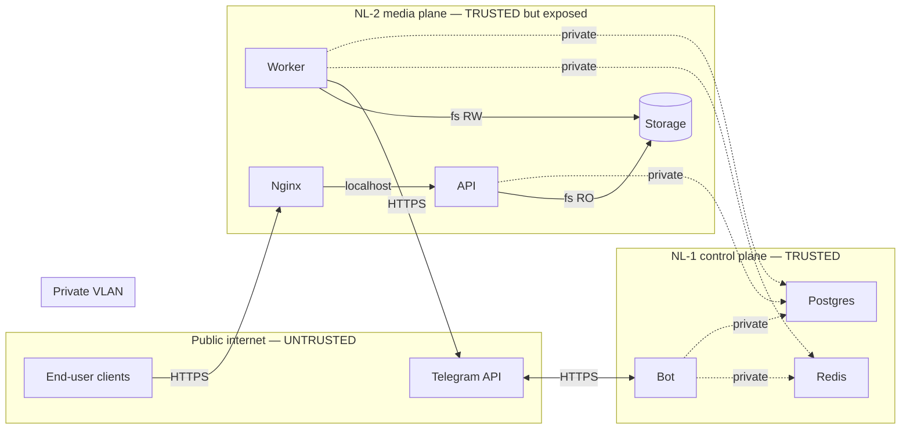

# 17 — Security model

> Status: Stable
> Audience: SRE, security reviewers, AI agents touching auth / network / files
> Read next: [`10-temp-links-and-delivery.md`](10-temp-links-and-delivery.md), [`19-docker-architecture.md`](19-docker-architecture.md)

This document is the security source of truth: threat model, controls in
place, the secrets we manage, and the rules everyone must follow when
changing the system.

We are a small public-internet service that downloads media on behalf of
arbitrary Telegram users and serves files via short-lived links. The
threat model is shaped by that: untrusted input, public delivery surface,
small ops team, single tenant.

---

## 1. Trust boundaries



| Boundary | Who can cross | What's allowed |
|---|---|---|
| Internet → NL-2 | Anyone | only `:80` (redirect) and `:443` (nginx → API for `/d/{token}` and `/healthz`) |
| Internet → NL-1 | No one | NL-1 has no public ports |
| NL-2 → NL-1 (private VLAN) | NL-2 hosts only | Postgres `5432`, Redis `6379` (firewalled to NL-2 IPs) |
| NL-1 → Internet | Bot only | Telegram egress |
| NL-2 → Internet | Worker only | media sources, Telegram egress, ACME |
| Containers → host | None | bind mounts only; non-root user inside containers |

These are enforced by `deploy/scripts/firewall_setup.sh` (`ufw` rules)
plus the absence of `ports:` declarations in the compose stacks.

---

## 2. Threat model (top concerns)

| Threat | Attack vector | Control |
|---|---|---|
| **Token guessing** | enumerating `/d/<token>` | 256-bit random tokens; per-IP `limit_req` (10 r/s, burst 20 nodelay) and `limit_conn` (8 concurrent) on `/d/` in `deploy/nginx/nginx.conf` returning **429**; intake-side limiter ([`36-`](36-rate-limiting.md)) additionally caps job creation; tokens are **redacted in nginx access logs** via `map $request_uri $safe_request_uri` (see §9 + ADR-0008 §2.3) |
| **Token replay from logs** | reading nginx `access.log` / Loki dump | `/d/<token>` is rewritten to `/d/<redacted>` in `log_format`; in-app structlog already truncates token to first 8 chars |
| **Path traversal** | malicious `file_path` from compromised DB | `ensure_within(STORAGE_PATH, ...)` at issue time and serve time |
| **File enumeration** | discovering files outside tokens | `internal;` location in nginx; no autoindex |
| **DoS via huge downloads** | force the worker to fetch enormous files | `MAX_FILE_SIZE_MB` cap; `JOB_TIMEOUT_SECONDS`; concurrency caps |
| **DoS via job spam** | one user enqueues thousands | layered rate limiter L1–L4 ([`36-`](36-rate-limiting.md)); `MAX_CONCURRENT_JOBS_PER_USER`; arq idempotency on double-tap |
| **Stolen bot token** | bot impersonation | rotate via `@BotFather`; secret kept in `.env` only |
| **DB credential leak** | compromised NL-1 → admin access | strong password, private VLAN only, no public listen |
| **Container escape** | yt-dlp parser exploit | non-root `app:1000`, minimal base image, no `--privileged` |
| **Supply chain (yt-dlp/ffmpeg)** | malicious dependency update | pinned versions, GHCR image digests, manual yt-dlp bumps |
| **Malicious URL → SSRF / RCE** | yt-dlp following redirects to internal / metadata hosts | yt-dlp is constrained by `allowed_extractors` + `match_filter` host allowlist; optional `HTTPS_PROXY_URL` adds outbound ACL on NL-2 |
| **Cookie / session leak** | Instagram cookies in logs | bind-mounted RO at `/srv/dwtgbot/secrets/cookies-instagram.txt`, never logged; only the file path is emitted, file content stays inside yt-dlp |
| **Replay of expired link** | resharing public URL | TTL + counter; `is_active=false` after exhaustion |
| **TLS downgrade / no TLS** | MITM | TLS 1.2+ only; HSTS `max-age=63072000; preload` |
| **CSRF on temp links** | n/a | links are GET-only, idempotent (counter aside); no auth state to confuse |
| **XSS via filename in `Content-Disposition`** | quotes in filename | yt-dlp `restrictfilenames=True`; we wrap in double quotes |

---

## 3. Network controls

### NL-1 (control plane)

- **No public ports.** `docker-compose.yml` declares `ports:` for nothing
  on NL-1.
- **`postgres` and `redis` containers** join `dwtgbot_internal` bridge
  network only.
- **Host firewall** (`ufw`):
  - allow SSH from admin IPs only,
  - allow `5432` and `6379` from the **NL-2 private IP** only,
  - default deny inbound.

### NL-2 (media plane)

- **Public ports**: `80/tcp`, `443/tcp` (nginx). Nothing else.
- **API container** binds `0.0.0.0:8080` *inside* its network namespace
  but is NOT published. Nginx reaches it via the internal Docker network.
- **Worker, cleanup, certbot** publish nothing.
- **Host firewall**:
  - allow SSH from admin IPs only,
  - allow `80`, `443` from anywhere,
  - default deny inbound,
  - egress unrestricted (worker needs to reach the world).

`deploy/scripts/firewall_setup.sh` codifies all of the above. **Run it
during install and after any host re-image.**

---

## 4. TLS

- Certbot (Let's Encrypt) issues certs into `letsencrypt_conf` volume,
  rotated every 12 h by the certbot container.
- Nginx vhost forces TLS 1.2 / 1.3, `HIGH:!aNULL:!MD5` cipher list,
  `ssl_prefer_server_ciphers on`, no session tickets.
- HSTS: `max-age=63072000; includeSubDomains; preload` (set in
  `deploy/nginx/snippets/security.conf`).
- HTTP `:80` redirects to HTTPS except for `/.well-known/acme-challenge/`
  (webroot for renewals).

> **Domain rotation**: change `SERVER_NAME`, run `deploy/scripts/certbot_init.sh`,
> reload nginx. Do **not** keep stale certs; revoke the old SAN.

---

## 5. Application-level controls

### Tokens

- 256-bit (`TEMP_LINK_TOKEN_BYTES=32`) URL-safe base64.
- Stored once in `temp_links.token` (UNIQUE); never echoed in logs in full.
- The token alone is the credential; treat it as bearer.

### Paths

- All path construction goes through `app/utils/filenames.py:ensure_within`
  and `sanitize_filename`.
- Worker writes ONLY inside `STORAGE_PATH/jobs/<job_id>/`.
- API resolves `link.file_path` and asserts it's under `STORAGE_PATH`
  again before responding.
- Nginx `internal;` makes `/_protected/` unreachable from the outside.

### Filenames in HTTP responses

- `Content-Disposition: attachment; filename="..."` — the filename comes
  from `file_path.name`, which was created by yt-dlp with
  `restrictfilenames=True`. Result: ASCII-only, no quotes, safe.
- The header is set **once** by the API response that carries
  `X-Accel-Redirect`. Nginx forwards it while serving `/_protected/`; it
  must not add a second bare `Content-Disposition: attachment`, because
  duplicate values create browser-specific download failures.

### Headers (set by nginx for every response)

| Header | Value |
|---|---|
| `Strict-Transport-Security` | `max-age=63072000; includeSubDomains; preload` |
| `X-Frame-Options` | `DENY` |
| `X-Content-Type-Options` | `nosniff` |
| `Referrer-Policy` | `no-referrer` |
| `Permissions-Policy` | `geolocation=(), microphone=(), camera=()` |
| `Cross-Origin-Opener-Policy` | `same-origin` |

Per-endpoint headers added in `conf.d/media.conf.template`:

| Endpoint | Header | Value | Why |
|---|---|---|---|
| `/d/`, `/_protected/` | `Cache-Control` | `no-store` | Token-bound, single-use, time-bounded — must not be cached anywhere. Set on both locations because nginx does not inherit `add_header` once a child location sets one. |
| `/d/`, `/_protected/` | `Pragma` | `no-cache` | HTTP/1.0 fallback for ancient corporate proxies. |
| `/d/`, `/_protected/` | `Expires` | `0` | Same fallback; some intermediaries respect this even when `Cache-Control` is parsed. |
| `/d/` | `429 Too Many Requests` | (response code) | `limit_req` / `limit_conn` rejections — see §2 row "Token guessing". |

Nginx explicitly disables `gzip` and `gunzip` on both `/d/` and
`/_protected/`. Temp-link responses are arbitrary binary files and often
already compressed; transforming them can break range requests and can surface
as Firefox "Corrupted Content Error" / "Ошибка искажения содержимого" if
headers and bytes get out of sync.

### Rate limiting (RL_ENABLED)

`RL_ENABLED` ships **ON by default** (audit fix A11). The layered limiter
(`docs/36-rate-limiting.md`, L1–L4) is the primary DoS control at the
bot edge; with it off, one viral share or a hostile flood can saturate
the worker pool and starve legitimate users.

**Disabling `RL_ENABLED` is a policy decision**, not a deployment
convenience. If you need it off (e.g. a private fleet with trusted
users where observed false-positive rate is unacceptable), document
the reason in an ADR referencing this section and operate with
alternative safeguards (stricter `MAX_CONCURRENT_JOBS_PER_USER`,
narrower `ALLOWED_HOSTS`, closed-network deployment).

### Auth

| Surface | Auth |
|---|---|
| Bot ↔ Telegram | `BOT_TOKEN` |
| `/d/{token}` | the token in the URL |
| `/healthz` | none (intentional) |
| `/readyz` | `API_INTERNAL_TOKEN` via `X-Internal-Token` |
| `/internal/*` | `API_INTERNAL_TOKEN` (plus endpoint-specific auth where applicable) |
| SSH | key-based; root login disabled; sudoers narrow |
| GHCR image pulls | `GITHUB_TOKEN` (in CI) / personal token (local) |

`API_INTERNAL_TOKEN` is required in production by `validate_runtime`.
`/readyz` and every `/internal/*` route now require the
`X-Internal-Token` header; `/healthz` stays intentionally public for
liveness and ACME plumbing, and `/d/{token}` keeps its own bearer-token
model.

### yt-dlp egress guard

- `YtDlpRunner` passes `allowed_extractors=["Youtube", "YoutubeTab", "Instagram"]`
  so generic extractors cannot pivot to arbitrary hosts.
- A `match_filter` allowlist accepts only supported provider/CDN suffixes
  (`youtube.com`, `youtu.be`, `googlevideo.com`, `ytimg.com`,
  `ggpht.com`, `instagram.com`, `cdninstagram.com`, `fbcdn.net`).
- `HTTPS_PROXY_URL` remains the optional Phase-3-strength control for
  outbound ACL at the network layer; when set on NL-2, it applies to both
  `extract_info` and `download`.

---

## 6. Container hardening

- **Multi-stage builds**: build artifacts live in `/opt/venv` only; the
  final image has no compilers (`build-essential` is in the builder stage
  only). See `docker/*.Dockerfile`.
- **Non-root user**: `app:1000` everywhere. `useradd --shell /usr/sbin/nologin`.
- **`tini` as PID 1** for proper signal handling in the bot/api/worker
  images.
- **Read-only mount where possible**: nginx mounts `STORAGE_PATH` as
  `:ro`. Same for the api container in NL-2 (effectively read-only path
  usage).
- **No `--privileged`, no `cap_add`, no `pid: host`, no `network: host`.**
- **Image base**: `python:3.14.4-slim` and `nginx:1.27-alpine` — small
  attack surface, well-maintained. Bump regularly.
- **Healthchecks** restart unhealthy containers without manual
  intervention (see [`15-healthchecks.md`](15-healthchecks.md)).

---

## 7. Secrets management

| Secret | Where it lives | Rotation |
|---|---|---|
| `BOT_TOKEN` | `.env` on NL-1 | via `@BotFather` → update env → restart bot |
| `POSTGRES_PASSWORD` | `.env` on NL-1 + NL-2 | rotate in DB + envs simultaneously; restart bot/api/worker |
| `REDIS_PASSWORD` | same | rotate in `redis-server` config + envs; restart |
| `API_INTERNAL_TOKEN` | `.env` on NL-1 + NL-2 | random 32 bytes; rotate per quarter |
| Let's Encrypt private key | `letsencrypt_conf` volume on NL-2 | auto-rotated by certbot |
| YouTube cookies | host file `/srv/dwtgbot/secrets/cookies-youtube.txt` (mode `0640`), bind-mounted RO into NL-1 `bot` and NL-2 `worker`; path tracked in `YOUTUBE_COOKIES_FILE` env | refresh when worker logs `youtube_cookiefile_missing` or age/auth-gated YouTube videos fail with `MediaPrivateError`; re-upload to **both** hosts and restart bot+worker |
| Instagram cookies | host file `/srv/dwtgbot/secrets/cookies-instagram.txt` (mode `0640`), bind-mounted RO into NL-1 `bot` and NL-2 `worker`; path tracked in `INSTAGRAM_COOKIES_FILE` env | refresh when worker logs `instagram_cookiefile_missing` or users report `MediaPrivateError`; re-upload to **both** hosts and restart bot+worker |
| GHCR token | GitHub Actions secret | rotate per CI policy |
| SSH keys | host `~/.ssh/authorized_keys` | rotate per access policy |

Rules:
- Secrets ARE NOT in git (`.gitignore` covers `.env` and key files).
- Secrets ARE NOT in logs, metrics, or healthcheck responses.
- `.env.example` files contain placeholders only; real values populated
  by `deploy/scripts/install.sh`.
- A leaked secret is rotated **before** root-cause analysis. (Audit
  comes second; stop the bleeding first.)

---

## 8. Input validation

| Input | Validation |
|---|---|
| URL from message | `extract_first_url` (regex), `detect_platform` (host allowlist) |
| `callback_data` | `DownloadCallback.try_decode`, validated against Redis state |
| Filenames from yt-dlp | `restrictfilenames=True`; further `sanitize_filename` if reused |
| File paths from DB | `ensure_within(STORAGE_PATH, ...)` |
| Env values | pydantic types + `Field(...)` bounds + custom validators |
| HTTP path params (`token`) | regex-bounded by FastAPI route; max-length implicit via DB column |

> **Hard rule:** anything that came from outside the application is
> validated *before* it influences a path, a process spawn, or a SQL
> parameter. SQL is parameterized via SQLAlchemy; we never build queries
> by string concatenation.

---

## 9. Logging & PII

See [`14-logging-observability.md`](14-logging-observability.md) for the
full discipline and [`34-data-retention-and-privacy.md`](34-data-retention-and-privacy.md)
for the canonical retention/deletion procedure (DSR runbook, lawful
basis, backup-purge strategies). The security-relevant pieces:

- No tokens, passwords, cookies in logs.
- No Telegram usernames or phone numbers — `user_id` (numeric) only.
- No user-provided URLs, message text, or downloaded titles in logs.
- Truncate temp-link tokens (`token[:8]+"..."`) in application logs.
- **Nginx `access.log` redacts the token segment** of `/d/<token>` URIs
  via a `map $request_uri $safe_request_uri` block — see
  `deploy/nginx/nginx.conf` and ADR-0008 §2.3. The log line contains
  `"uri":"/d/<redacted>"` instead of the live bearer credential. Any
  log shipper or `tail` pipeline inherits this automatically.
- `_logger.exception` for unexpected errors so the traceback is
  captured (necessary for triage).
- For erasure / "right to be forgotten" requests, follow
  [`34-`](34-data-retention-and-privacy.md) §4 — files first (NL-2),
  then DB rows (NL-1), then communicate the backup-aging window to the
  requester.

---

## 10. Sequence: malicious actor probes the system

```mermaid
sequenceDiagram
    autonumber
    participant Atk as Attacker
    participant N as nginx
    participant A as API

    Atk ->> N: GET /d/abcd1234... (guessed token)
    N ->> A: proxy
    A ->> A: get_by_token → None
    A -->> N: 404 Not Found
    N -->> Atk: 404

    Atk ->> N: GET /_protected/anything
    Note over N: location is `internal;` → nginx refuses
    N -->> Atk: 404 Not Found

    Atk ->> N: GET /any-random-path
    N -->> Atk: 404 (default)

    Atk ->> N: GET /d/<real_token_after_5_dl>
    N ->> A: proxy
    A ->> A: link.is_usable() → False
    A -->> N: 410 Gone
    N -->> Atk: 410
```

No information leak in any branch. Token guessing is infeasible at
256-bit entropy; brute force at 1k req/s would take longer than the
universe.

---

## 11. Anti-patterns

1. **Public-facing endpoints without `internal;` for static files.** Use
   `X-Accel-Redirect` always.
2. **Logging tokens / passwords / cookies / Authorization headers.** Just
   don't.
3. **Building shell commands by string concatenation.** Use
   `asyncio.create_subprocess_exec(arg1, arg2, ...)` so each arg is its
   own argv element. We use yt-dlp via Python; we don't build shell
   strings.
4. **Running containers as root.** All services use `app:1000`.
5. **Disabling HSTS or weakening cipher suites for "compatibility".**
   Bump the floor; don't lower it.
6. **`extra="allow"` in `Settings`.** Lets typos silently survive. We use
   `extra="ignore"` and document required vars.
7. **Per-user authentication via "the URL is the auth"** *combined with*
   logging the URL as INFO. Either keep it strictly out of logs, or stop
   relying on it.
8. **Skipping `ensure_within` "because we control the path".** Always
   re-verify at trust boundaries.

---

## 12. Common mistakes

| Mistake | Symptom | Fix |
|---|---|---|
| Forgot to set `API_INTERNAL_TOKEN` in production | startup fails | Generate one (`openssl rand -hex 32`), set in env, redeploy |
| Called `/readyz` without `X-Internal-Token` | 401 Unauthorized | Use `/healthz` for public liveness or send the internal token from private monitors / container healthchecks |
| Exposed Postgres on public IP "for psql access" | external scanners notice in hours | Tunnel via SSH; never expose 5432 publicly |
| Mounted `letsencrypt` as RW into nginx | risk of accidental cert overwrite | We mount `:ro` into nginx; certbot is the only writer |
| Built worker as root | container can write outside the volume | Build with `USER app`; verify with `docker exec` |
| Updated yt-dlp without releasing | yt-dlp pulls untrusted plugins on the fly | Pin in `requirements/base.txt`; audit the changelog |
| Set `cookiefile` to a globally-readable path | other system users can read it | `chmod 600`, `chown app:app`; never world-readable |
| Uploaded `cookiefile` to only one host | extract_info on NL-1 succeeds, download on NL-2 (or vice-versa) falls back anonymous and Instagram returns login-required | Cookies must live on **both** NL-1 (bot does `extract_info`) and NL-2 (worker does the actual download); paths bind-mounted RO into both |
| Allowed `0.0.0.0` on the SSH `AllowUsers` | brute-force lockouts | Restrict via firewall + key-only auth |

---

## 13. Disclosure & incident response

- Email security@ (set up an alias in your domain) — note: the README
  links to `CONTRIBUTING.md` for disclosure guidance.
- On suspected compromise:
  1. Rotate all secrets (bot token, DB password, Redis password,
     `API_INTERNAL_TOKEN`).
  2. Take a backup; snapshot disks for forensics.
  3. Review logs for the affected `request_id` / `job_id`.
  4. Revoke active temp links by setting `is_active=false` and removing
     files (`UPDATE temp_links SET is_active=false; DELETE FROM
     temp_links;` then run cleanup).
  5. Re-image hosts if container escape is suspected.
  6. Post-mortem in repo (`docs/adr/`); add a control to prevent
     recurrence.

---

## 14. Future extension points

- ✅ Per-IP rate limiting at nginx for `/d/` — implemented (see §2 row
  "Token guessing" + the `limit_req_zone` block in
  `deploy/nginx/nginx.conf`).
- ✅ `Cache-Control: no-store` on `/d/` and `/_protected/` — implemented
  (see §6 per-endpoint headers table).
- **WAF / fail2ban** in front of nginx — useful once the deployment is
  internet-public; today, nginx + per-IP `limit_req` covers the realistic
  abuse cases.
- **Real-IP recovery behind a CDN / TCP load balancer.** If you put one
  in front of nginx, add `set_real_ip_from <CIDR>;` and
  `real_ip_header X-Forwarded-For;` in `nginx.conf` so the rate-limit
  zone keys on the *client* IP, not the proxy's. Without this, a single
  CDN edge IP becomes the only "user" the limiter sees.
- **Audit table writes** for security events (admin actions, repeated
  failures, link enumeration).
- **AppArmor / SELinux profile** for the worker container.
- **SBOM** generation in CI (`syft` / `grype`); fail on critical CVEs.
- **Sealed secrets / Vault**.
