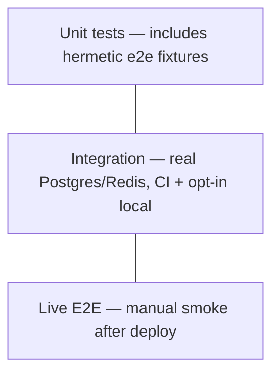

# 18 — Testing strategy

> Status: Stable
> Audience: backend engineers, AI agents adding tests
> Read next: [`27-coding-standards.md`](27-coding-standards.md), [`21-cicd.md`](21-cicd.md)

We optimise for **fast, deterministic, hermetic** tests. The default
`pytest` invocation must run on a developer laptop with no network, no
DB, no Redis, no Telegram, no real ffmpeg downloads — and finish in
seconds. Anything that needs real external systems is opt-in via the
`integration` marker.

---

## 1. Pyramid



| Layer | Volume | Touches real infra | Runs in CI |
|---|---|---|---|
| Unit | the majority | no | yes (`pytest -m "not integration"`) |
| Integration | a few critical paths | yes (DB / Redis) | yes (`pytest -m "integration" --no-cov`) |
| End-to-end | live smoke checks post-deploy | yes (live Telegram / public edge) | manual / blackbox in production |

We don't ship a stricter ratio. The rules are: cover business logic with
units; reserve integration for dependency-tested boundaries; keep live
E2E manual. A small hermetic e2e fixture suite under `app/tests/e2e/`
is still part of the unit layer because it uses only fakes.

---

## 2. Test layout

```
app/tests/
├── conftest.py                      # shared fixtures
├── e2e/test_full_download_flow.py   # hermetic end-to-end with fakes
├── integration/                     # opt-in real infra suites
├── test_callback_codec.py
├── test_config.py
├── test_enqueue_use_case.py
├── test_filenames.py
├── test_providers_youtube.py
├── test_temp_links.py
└── test_url_detection.py
```

We keep tests **next to the code** under `app/`. Reasons:
- Discoverable: opening `app/utils/url.py` you immediately see
  `app/tests/test_url_detection.py` exists.
- Forces module isolation — if a test needs to reach far outside its
  domain, that's a code smell, not a test smell.
- One PYTHONPATH (`.`) — same paths in dev, CI, and prod.

> **Rule:** never test by importing from `app.infrastructure.db.*` in
> a unit test. If you need persistence, use a fake repository (see
> below). If you genuinely need the real one, mark the test
> `integration`.

---

## 3. Fixtures (`conftest.py`)

```python
@pytest.fixture(autouse=True)
def _env(monkeypatch):
    monkeypatch.setenv("BOT_TOKEN", "0000000000:test-token")
    monkeypatch.setenv("APP_ENV", "development")
    monkeypatch.setenv("LOG_LEVEL", "WARNING")
    monkeypatch.setenv("LOG_JSON", "false")
    monkeypatch.setenv("PUBLIC_BASE_URL", "http://localhost:8080")
    monkeypatch.setenv("STORAGE_PATH", "/tmp/dwtgbot-tests/storage")
    monkeypatch.setenv("STORAGE_TMP_PATH", "/tmp/dwtgbot-tests/tmp")

@pytest.fixture(autouse=True)
def _clear_settings_cache():
    from app.config import get_settings
    get_settings.cache_clear()
    yield
    get_settings.cache_clear()
```

Properties:
- **Autouse** ensures every test starts with a known env.
- **`monkeypatch.setenv`** is per-test, automatically restored.
- **`get_settings.cache_clear()`** keeps the singleton from leaking
  values between tests.
- We do **not** create temporary directories by default — tests that need
  files create their own with `tmp_path`.

---

## 4. The four kinds of unit tests we keep

### 4.1 Pure-function tests

Examples: `test_filenames.py`, `test_url_detection.py`.

Pattern:
```python
def test_extract_first_url_simple():
    assert extract_first_url("hi https://youtu.be/x bye") == "https://youtu.be/x"
```

These are the cheapest possible tests. Maximize coverage on
`app/utils/*` here.

### 4.2 Domain-entity tests

Examples: `test_temp_links.py` exercises `TempLink.is_usable` and
`register_use`.

Pattern: construct entity → invoke method → assert state.

```python
link = TempLink(id=1, token="t", job_id=1, file_path="/x", expires_at=in_future,
                max_downloads=2, downloads_count=0, is_active=True, ...)
link.register_use()
assert link.downloads_count == 1
assert link.is_active
link.register_use()
assert not link.is_active   # exhausted
```

These tests own the **state machine invariants**. If you change the
state machine, these tests must change in the same PR.

### 4.3 Use-case tests with fakes

Example: `test_enqueue_use_case.py`. The use case depends on
abstractions — we provide in-memory fakes:

```python
class FakeJobsRepo(JobsRepository):
    def __init__(self): self.created = []
    async def create(self, job):
        job.id = len(self.created) + 1
        self.created.append(job)
        return job
    ...
```

```python
async def test_enqueue_persists_and_publishes():
    jobs, queue = FakeJobsRepo(), FakeQueueProducer()
    uc = EnqueueDownloadUseCase(jobs_repo=jobs, queue=queue)
    out = await uc.execute(...)
    assert jobs.created[0].status == JobStatus.PENDING
    assert queue.published[0].job_id == out.job_id
```

> **Rule:** fakes implement the **public protocol** of the dependency
> (the ABC). They never duplicate ORM behaviour. If a use case needs
> features the protocol doesn't expose, extend the protocol, not the
> fake.

### 4.4 Codec / serializer tests

Example: `test_callback_codec.py`. These guard wire-format invariants
that can't change without breaking deployed clients.

Patterns to include:
- Round trip (`decode(encode(x)) == x`).
- Length bounds (Telegram `callback_data` ≤ 64 bytes).
- Defensive decoding (malformed input returns `None`, not raises).

### 4.5 Guard-тесты структуры репозитория

Проверяют не поведение, а инварианты, которые иначе держались бы только
на ревью:

| Тест | Что проверяет |
|---|---|
| `test_layering.py` | `app/domain` и `app/application` импортируют только stdlib и внутренние модули — без `app.infrastructure`, `app.bot`, `app.api`, `app.workers`, `app.composition` и сторонних SDK ([ADR-0012](adr/0012-application-ports-media-sender-storage.md)) |
| `test_env_examples_sync.py` | каждое поле `Settings` есть в `docs/13-config-and-env.md` и во всех `.env.example` |
| `test_deploy_topology.py` | инварианты compose-стеков `single` / `nl1` / `nl2` |
| `test_composition_smoke.py` | настоящие `build_worker` / `build_api` / `build_cleanup` собираются и закрываются без DB, Redis и Telegram |

Если guard-тест упал, чините код или документацию, а не ослабляйте тест.

---

## 5. Integration tests (opt-in)

Marker: `integration` (declared in `pyproject.toml`).

Default invocation excludes them:
```bash
pytest -m "not integration"
```

To run them locally:
```bash
pytest -m "integration"
```

Use them sparingly. Good candidates:
- Real `YtDlpRunner.extract_info` against a public, stable URL.
- Alembic migration round-trip against a real Postgres.
- nginx + API + storage end-to-end via docker compose `up` in a
  throwaway namespace.

> **Rule:** integration tests must be **idempotent** and **clean up
> after themselves**. Don't pollute shared fixtures or external systems.

---

## 6. What we don't test

We deliberately don't have:
- **Mocks of `python-telegram-bot`'s internals.** Bot handlers are thin
  shells around use cases; we test the use cases directly. Use a fake
  `Update` only when the handler logic is non-trivial.
- **Tests against real Telegram.** Manual smoke after deploy is
  sufficient. Adding a sandbox bot would be valuable but is out of
  scope.
- **Snapshot tests of log lines.** Brittle.
- **Tests that assert specific yt-dlp format strings exist on YouTube.**
  External availability changes; we test our *logic*, not yt-dlp.

---

## 7. Coverage

Coverage is enforced in the default pytest invocation:

```bash
pytest -m "not integration"
```

`pyproject.toml` wires `--cov=app --cov-report=term --cov-report=xml
--cov-fail-under=70` through `addopts`, so every unit-suite run uses the
same bar as CI. Integration-only runs must opt out explicitly:

```bash
pytest -m "integration" --no-cov
```

The threshold is a regression guard, not a design target. Pay attention to:
- **Use cases** — should be heavily covered.
- **Providers** — `build_options` logic in particular.
- **`utils/`** — pure, easy to cover, no excuse for low coverage.

Don't aim for coverage in:
- `app/composition/` (it's wiring; integration test if anything).
- `infrastructure/db/repositories/*` (covered indirectly by
  integration tests).
- Entrypoints (`app/main_*.py`).

---

## 8. CI pipeline (what runs on every PR)

Source: `.github/workflows/ci.yml`.

| Job | Tool | What | Timeout |
|---|---|---|---|
| `lint` | `ruff format --check`, `ruff check` | format + lint | 10 min |
| `typecheck` | `mypy app` | type checks | 10 min |
| `tests` | `pytest -m "not integration"` (with `ffmpeg`, coverage gate 70%) | unit + hermetic e2e | 15 min |
| `integration-tests` | `alembic upgrade head`, `pytest -m "integration" --no-cov` | real Postgres + Redis | 10 min |
| `shell-lint` | `shellcheck` on `deploy/scripts/` | shell hygiene | 5 min |
| `trivy` | Trivy filesystem scan | vulnerable deps / files | 10 min |
| `gitleaks` | Gitleaks detect | committed secrets | 10 min |

These jobs must pass to merge. We use GitHub Actions's `concurrency`
group to cancel superseded runs on the same ref.

---

## 9. Local workflow

```bash
# one-time
python3.14 -m venv .venv
source .venv/bin/activate
pip install -r requirements/base.txt -r requirements/dev.txt

# fast loop
pytest -m "not integration" --no-cov -x

# before pushing
ruff format .
ruff check .
mypy app
pytest -m "not integration"
pytest -m "integration" --no-cov
```

Pre-commit hooks (`.pre-commit-config.yaml`) cover ruff + mypy + a few
generic checks. Install with:
```bash
pre-commit install
```

---

## 10. Adding a new test — checklist

- [ ] File lives in `app/tests/test_<thing>.py`.
- [ ] No real network, DB, Redis, Telegram, ffmpeg subprocess (unit
      tests).
- [ ] If it needs a path, use `tmp_path`.
- [ ] If it tests a use case, supply fakes for repositories and
      services — never real infra.
- [ ] Asserts are specific (no `assert result is not None` alone).
- [ ] Names are sentences (`test_register_use_marks_inactive_when_exhausted`).
- [ ] Don't import from `app.infrastructure.db.*` unless `integration`-marked.

---

## 11. Anti-patterns

1. **`time.sleep` in tests.** Use `freezegun` / inject a clock.
2. **Real network calls disguised as units.** `httpx.Client(...).get(...)`
   in a unit test is a bug.
3. **Asserting on log lines.** Test behaviour, not formatting.
4. **Sharing state across tests via module globals.** Pytest fixtures
   exist.
5. **Mocks of internals (private methods).** Test through the public
   API; mock at the boundary (the protocol).
6. **`pytest.mark.skip("flaky")`.** Either fix it or delete the test.
   Skipped flakies rot.
7. **Long fixtures that prepare a "world" of objects.** If your test
   needs that, it's not a unit test.
8. **Catching exceptions to "pass the test".** Let assertion failures
   surface.

---

## 12. Common mistakes

| Mistake | Symptom | Fix |
|---|---|---|
| Forgot `pytest-asyncio` mode in a new async test | "coroutine was never awaited" | Add `@pytest.mark.asyncio` (mode is configured per file) |
| Test imports `Settings` directly without env | `ValidationError: BOT_TOKEN field required` | Trust autouse fixtures; or override env in the test |
| `get_settings()` returns stale value | flakes when env changes per test | The autouse `cache_clear` fixture handles this; do not bypass |
| Test creates real files in `STORAGE_PATH` | pollutes dev FS | Use `tmp_path` and pass it via `monkeypatch.setenv` |
| Use case test reaches into ORM models | layer violation | Use a fake repository implementing the ABC |
| Integration tests run by default | CI flakes on pull-from-network | Mark with `@pytest.mark.integration`; exclude in default invocation |

---

## 13. Future extension points

- **Property-based tests** (`hypothesis`) for `sanitize_filename`,
  callback codec, `ensure_within`.
- **Testcontainers** for an integration tier that boots Postgres /
  Redis on demand.
- **Smoke tests post-deploy**: a small `pytest` job hitting `/healthz`
  and `/readyz` from outside; opt-in deploy gate.
- **Mutation testing** (`mutmut`) targeted at `app/domain/` to catch
  weak assertions.
