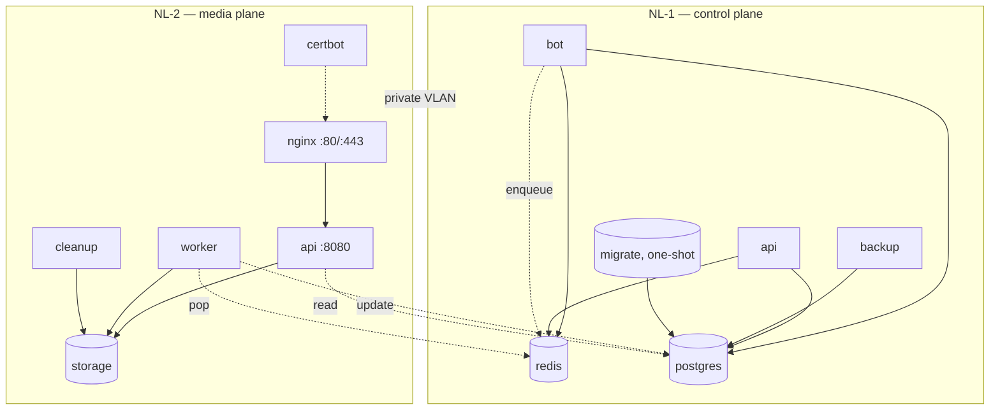

# 19 — Docker architecture

> Status: Stable
> Audience: SRE, DevOps, AI agents touching containers
> Read next: [`20-deployment.md`](20-deployment.md), [`17-security.md`](17-security.md)

This document is the canonical reference for our container layout: which
images exist, what's inside, how they're built, how they run, and how
they wire together. The compose stacks themselves are described in
[`20-deployment.md`](20-deployment.md).

> 🔒 **Locked:** Docker is the only supported deployment mode. Bare-metal
> systemd services are not supported. See ADR-006 (planned).

---

## 1. Image catalogue

| Image | Dockerfile | Used by | Runtime extras |
|---|---|---|---|
| `bot` | `docker/bot.Dockerfile` | NL-1 `bot` service | `tini`, `curl` |
| `api` | `docker/api.Dockerfile` | NL-1 `api`, NL-2 `api` services | `tini`, `curl` |
| `worker` | `docker/worker.Dockerfile` | NL-2 `worker`, `cleanup` services | **`ffmpeg`**, `tini`, `curl` |
| `backup` | `docker/backup.Dockerfile` | NL-1 `backup` service | `postgresql-client`, `gzip`, `bash`, `tini` |
| `nginx` | upstream `nginx:1.27-alpine` | NL-2 `nginx` service | distroless-ish; envsubst at start |
| `postgres` | upstream `postgres:16-alpine` | NL-1 `postgres` service | bundled tooling |
| `redis` | upstream `redis:7-alpine` | NL-1 `redis` service | bundled tooling |
| `certbot` | upstream `certbot/certbot:latest` | NL-2 `certbot` service | renew loop in `entrypoint` |

We build **four** of our own images. The application Python code is
identical across `bot`, `api`, `worker`; the differences are which
entrypoint runs and which OS packages are installed (mainly `ffmpeg` in
the worker).

---

## 2. Build strategy: multi-stage

Every Python image follows the same template:

```Dockerfile
# ---------- builder ----------
FROM python:3.14.4-slim AS builder
RUN apt-get install build-essential gcc                # only in builder
WORKDIR /opt/build
COPY requirements/ requirements/
RUN python -m venv /opt/venv && \
    /opt/venv/bin/pip install -r requirements/prod.txt

# ---------- runtime ----------
FROM python:3.14.4-slim AS runtime
RUN apt-get install tini ca-certificates curl [+ ffmpeg in worker]
RUN groupadd --gid 1000 app && useradd --uid 1000 --gid 1000 app
COPY --from=builder /opt/venv /opt/venv
WORKDIR /app
COPY --chown=app:app app/ migrations/ alembic.ini ./
USER app
ENTRYPOINT ["tini", "--"]
CMD ["python", "-m", "app.main_xxx"]
```

Properties:

| Property | Why |
|---|---|
| Builder vs runtime split | runtime image has no compilers / build deps |
| `pip` into `/opt/venv` | reproducible, no `--user`, no dist-packages mix |
| `python:3.14.4-slim` | small, vetted base; pin patch version (see [ADR-0009](adr/0009-python-314-runtime.md)) |
| `tini` as PID 1 | proper SIGTERM forwarding, no zombie processes |
| Non-root `app:1000` | reduce blast radius of any RCE |
| `--chown=app:app` on COPY | no fix-up `RUN chown` step |
| Layer caching: copy `requirements/` before `app/` | code edits don't re-install deps |
| `HEALTHCHECK` declared in image | works even outside compose |

Argument convention:
```Dockerfile
ARG PYTHON_VERSION=3.14.4
ARG APP_USER=app
ARG APP_UID=1000
ARG APP_GID=1000
```
All overridable from the compose / build CLI. **Do not** change
`APP_UID`/`APP_GID` per environment — host volume permissions assume
`1000:1000`.

---

## 3. Per-image specifics

### `bot`
- Entry: `python -m app.main_bot`.
- No ffmpeg. The bot only does metadata fetches via providers, but the
  same Python lib (`yt_dlp`) is installed so imports stay identical to
  the worker.
- Healthcheck: `pgrep -f app.main_bot`.
- Mounts: nothing beyond the env file.

### `api`
- Entry: `python -m app.main_api`.
- Listens on `8080` (`API_PORT`), bound to `0.0.0.0` inside the
  container's namespace; not published to host.
- `EXPOSE 8080` documents the contract for nginx upstream.
- Healthcheck: HTTP `GET /healthz`.
- Mounts on NL-2: `STORAGE_PATH`, `STORAGE_TMP_PATH` (read-write
  effectively, but only used for read).
- Mounts on NL-1: nothing (it's there for `/healthz` and future admin
  endpoints).

### `worker`
- Entry: `python -m app.main_worker` → starts `arq` worker via
  `WorkerSettings`.
- Includes **`ffmpeg`** (for yt-dlp postprocessing).
- Mounts: `STORAGE_PATH`, `STORAGE_TMP_PATH` (read-write).
- Healthcheck: `pgrep -f 'arq|app.main_worker'`.
- Used twice in NL-2: once as `worker` (job processor), once as
  `cleanup` (running `python -m app.workers.cleanup_worker`).

### `cleanup`
- Same image as `worker`, different `command:`. No separate Dockerfile.

### `backup`
- Slim Debian + `postgresql-client` + `gzip` + `bash`.
- Installs only `pydantic`, `pydantic-settings`, `structlog` (no full
  app). Just enough to read `Settings`.
- Entry: `python -m app.workers.backup_worker`.
- Mounts: `BACKUP_DIR` (host volume).
- Reaches Postgres over the internal docker network.

### `nginx`
- Upstream `nginx:1.27-alpine`.
- Templates: `media.conf.template` is rendered at start via nginx's
  `envsubst` mechanism (`SERVER_NAME`, `API_PORT`).
- Mounts: nginx conf RO, snippets RO, storage RO, letsencrypt RO.
- **Edge protections** (declared in `nginx.conf`, applied in
  `media.conf.template`):
  - `limit_req_zone` per `$binary_remote_addr` for `/d/` (10 r/s,
    burst 20 nodelay) — see [`17-security.md`](17-security.md) §2.
  - `limit_conn_zone` per `$binary_remote_addr` for `/d/` (8
    concurrent).
  - `Cache-Control: no-store` on `/d/` and `/_protected/` — see
    [`10-temp-links-and-delivery.md`](10-temp-links-and-delivery.md) §9.
  - `limit_req_status 429`, JSON access log includes
    `limit_req_status` / `limit_conn_status` for dashboards
    ([`35-metrics-and-slo.md`](35-metrics-and-slo.md) §6).

### `certbot`
- Upstream image; we override `entrypoint` to run a renewal loop
  (`renew --webroot ...; sleep 12h`).
- Restart-on-failure; volumes for `letsencrypt_conf` and `letsencrypt_www`.

### `postgres` / `redis`
- Vanilla images. Configuration via env (`POSTGRES_*`, `--requirepass`).
- No public ports. `pg_isready` / `redis-cli ping` healthchecks.
- Persistent volumes: `dwtgbot_postgres_data`, `dwtgbot_redis_data`.

---

## 4. Stack topology

### 4.0 Compose-фрагменты и стеки (ADR-0011)

Сервисы описаны один раз во фрагментах, а стеки их подключают через
`include` (длинный синтаксис: `path` — список, сливается как цепочка `-f`;
`project_directory: .`; `env_file: .env`). Нужен Docker Compose ≥ 2.24.0;
`install.sh` и `deploy_update.sh` проверяют версию.

| Файл | Содержит |
|---|---|
| `deploy/compose/control.yml` | postgres, redis, migrate, bot, backup; сеть `dwtgbot_internal`; без `ports` |
| `deploy/compose/media.yml` | api, worker, cleanup, nginx, certbot; сеть `dwtgbot_media`; `80/443` только у nginx |
| `deploy/nl1/nl1.overlay.yml` | порты 5432/6379 на `NL1_PRIVATE_IP`; внутренний api (`dwtgbot_api_nl1`) |
| `deploy/single/single.override.yml` | api/worker/cleanup в обеих сетях; `depends_on: migrate`; веса CPU/IO; `oom_score_adj`; пул БД worker |

| Стек | `include.path` |
|---|---|
| `deploy/single` | `control.yml` + `media.yml` + `single.override.yml` |
| `deploy/nl1` | `control.yml` + `nl1.overlay.yml` |
| `deploy/nl2` | `media.yml` |

Относительные пути во фрагментах (`.env`, `../nginx/...`) разрешаются от
каталога стека благодаря `project_directory: .`, поэтому
`cd deploy/single && docker compose up -d` работает так же, как
`compose_stack single up -d`. Якоря `x-*` не переходят между файлами
`include`; каждый overlay объявляет свои копии.

### 4.1 Split (NL-1 + NL-2)



Volumes:

| Volume | Owners | Mode | Purpose |
|---|---|---|---|
| `dwtgbot_postgres_data` | NL-1 postgres | RW | DB files |
| `dwtgbot_redis_data` | NL-1 redis | RW | RDB + AOF |
| `dwtgbot_backups` | NL-1 backup, postgres | RW | dumps |
| `dwtgbot_storage` | NL-2 worker (RW), api (RW logically), nginx (RO), cleanup (RW) | mixed | media files |
| `dwtgbot_storage_tmp` | NL-2 worker, cleanup | RW | scratch |
| `dwtgbot_letsencrypt_conf` | NL-2 certbot (RW), nginx (RO) | mixed | TLS certs |
| `dwtgbot_letsencrypt_www` | NL-2 certbot (RW), nginx (RO) | mixed | ACME webroot |

Bind-mounts (host paths, not named volumes):

| Host path → container path | Owners | Mode | Purpose |
|---|---|---|---|
| `/srv/dwtgbot/secrets` → `/srv/dwtgbot/secrets` | NL-1 bot, NL-2 worker | RW | per-platform auth files (e.g. `cookies-youtube.txt`, `cookies-instagram.txt`) referenced by `YOUTUBE_COOKIES_FILE` / `INSTAGRAM_COOKIES_FILE`. The mount is writable because `yt-dlp` may refresh and save cookies on successful authenticated requests. `deploy_update.sh` (`ensure_secrets_dir`) creates the host directory with mode `0750` and sets cookie files to group `1000` with mode `0660`; the files themselves are uploaded out-of-band by the operator. Missing files are tolerated — providers log `<platform>_cookiefile_missing` and fall back to anonymous fetches. See [`13-config-and-env.md`](13-config-and-env.md#tooling) and [`17-security.md`](17-security.md#7-secrets-management). |

Networks:

| Network | Hosts | Why |
|---|---|---|
| `dwtgbot_internal` | NL-1 only | postgres + redis + bot + api + backup + migrate |
| `dwtgbot_media` | NL-2 only | api + worker + cleanup + nginx + certbot |

There is **no** docker network spanning hosts. Cross-host traffic uses
the host's private VLAN (WireGuard / VPC), reaching the **host IP** of
NL-1 from NL-2.

### 4.2 Single (один хост)

Те же volume с теми же именами, но все на одном хосте. Сети:

| Network | Members (single) |
|---|---|
| `dwtgbot_internal` | postgres, redis, bot, backup, migrate, **api, worker, cleanup** |
| `dwtgbot_media` | nginx, **api, worker, cleanup** |

certbot сети не объявляет и попадает в сеть проекта по умолчанию. nginx и
certbot в `dwtgbot_internal` не входят: у публичного edge нет маршрута к
Postgres и Redis. Порты публикует только nginx (`80`, `443`).

Изоляция тяжёлой нагрузки worker (ffmpeg) на общем хосте:

| Механизм | worker | Прочее |
|---|---|---|
| `mem_limit` / `cpus` | `LIMIT_WORKER_MEM` / `LIMIT_WORKER_CPUS` (2g / 2.0) | `LIMIT_DB_*`, `LIMIT_REDIS_*`, `LIMIT_SMALL_*` |
| `cpu_shares` | `WORKER_CPU_SHARES` (512) | 1024 (по умолчанию) |
| `blkio_config.weight` | 300 (литерал: compose не приводит интерполяцию к числу; нужен планировщик BFQ, иначе Docker игнорирует вес) | не задан (вес ядра по умолчанию) |
| `oom_score_adj` | 500 | postgres −500, redis −300, cleanup 300 |

Имена volume и `container_name` совпадают со split (кроме `dwtgbot_api_nl1`,
которого в `single` нет), поэтому переход `single → split` сводится к
переносу volume на другой хост без переименований
([`24-runbooks.md`](24-runbooks.md) §26).

---

## 5. Process model inside containers

| Container | PID 1 | Children |
|---|---|---|
| bot | `tini` | `python -m app.main_bot` |
| api | `tini` | `python -m app.main_api` (uvicorn) |
| worker | `tini` | `python -m app.main_worker` → `arq` |
| cleanup | `tini` | `python -m app.workers.cleanup_worker` (asyncio loop) |
| backup | `tini` | `python -m app.workers.backup_worker` (sleeps + invokes shell) |
| nginx | `nginx -g 'daemon off;'` | nginx workers |
| postgres / redis | upstream entrypoints | DB workers |

`tini` ensures `SIGTERM` from Docker reaches the Python process and that
zombie children (e.g. ffmpeg subprocess) are reaped. Without it, a slow
shutdown can become a 10-second `SIGKILL`.

---

## 6. Environment injection

```yaml
x-app-env: &app-env
  env_file:
    - .env
```

Every application service inherits the per-stack `.env`. NL-1 and NL-2
each have their **own** env files — they need different `POSTGRES_HOST`
and `REDIS_HOST` values (NL-2 reaches NL-1 via private IP, not the
internal docker service name). В `single` одна `.env` на все сервисы;
worker получает свой `DB_POOL_SIZE` / `DB_MAX_OVERFLOW` через `environment:`
в `single.override.yml` (он приоритетнее `env_file`).

Image tags are also overridable via env:

```yaml
image: ${IMAGE_BOT:-ghcr.io/your-org/dwtgbot-bot:latest}
```

`deploy/scripts/deploy_update.sh` pins a tag (sha or semver) in the
`.env` so deploys are deterministic.

---

## 7. Restart and logging policy

```yaml
x-restart: &restart
  restart: unless-stopped

x-logging: &logging
  logging:
    driver: json-file
    options:
      max-size: "10m"
      max-file: "5"
```

- **`unless-stopped`** for all long-running services. Excludes
  `migrate` (`restart: no`) and one-shot scripts.
- **`json-file` driver** with rotation. Per-container ceiling: 50 MiB
  (5 × 10 MiB). For higher retention, ship to an aggregator (see
  [`14-logging-observability.md`](14-logging-observability.md)).

---

## 8. Healthchecks → orchestration

- Container-level `HEALTHCHECK` (Docker) reports
  `healthy`/`unhealthy`/`starting`.
- Compose `depends_on: condition: service_healthy` enforces startup
  order.
- See [`15-healthchecks.md`](15-healthchecks.md) for the matrix and
  rationale.

---

## 9. Image tagging strategy

CI (`.github/workflows/build-images.yml`) tags every image with:
- `pr-<n>` for PR builds
- `sha-<short>` always
- `<branch>` (e.g. `main`)
- `vMAJOR.MINOR` and `vMAJOR.MINOR.PATCH` on git tags
- `latest` only on push to `main`

Production deploy pins the **explicit sha or semver** tag in NL-1's and
NL-2's `.env` (`IMAGE_BOT`, `IMAGE_API`, `IMAGE_WORKER`, `IMAGE_BACKUP`).
Never deploy `:latest` outside dev — it makes "what was running" a
guessing game.

Multi-arch: enabled (`docker/setup-qemu-action`); we ship `linux/amd64`
and (planned) `linux/arm64`. Pull the right manifest by digest in
production.

---

## 10. Rebuilds and cache

- `cache-from: type=gha,scope=<image>` and `cache-to: type=gha,mode=max,scope=<image>`
  in CI.
- Layer order in Dockerfiles is optimised: requirements first → app code
  last. Editing a single file rebuilds only the final two layers.
- `provenance: false` keeps GHCR manifests minimal.

---

## 11. Anti-patterns

1. **`USER root` in production images.** Always end with `USER app`.
2. **`apt-get install ... && pip install ...` in the same RUN.** Split
   into builder vs runtime; otherwise you ship gcc to production.
3. **`COPY . .` at the start.** Wrecks layer caching. Use targeted
   COPYs.
4. **Putting secrets in the image.** Always env at runtime; bake nothing
   sensitive.
5. **Different UIDs per environment.** Volume permissions break.
6. **Skipping `tini`.** Slow shutdowns, leaked subprocesses.
7. **Publishing internal ports** (`ports:` for postgres, redis, api,
   worker). They don't need it. Единственное исключение — порты данных
   NL-1 на WireGuard IP в `deploy/nl1/nl1.overlay.yml`.
8. **Описывать сервис прямо в стеке** (`deploy/{single,nl1,nl2}/docker-compose.yml`)
   в обход фрагментов `deploy/compose/*`. Стеки начнут расходиться.
9. **Подключать nginx к `dwtgbot_internal`** в `single`: у публичного edge
   появится маршрут к данным.
10. **Latest-tag deploys to production.** Pin shas.
11. **Sharing volumes RW where RO suffices** (e.g. nginx). Always least
    privilege.
12. **Mixing build & runtime in a single stage.** Image bloat + larger
    attack surface.

---

## 12. Common mistakes

| Mistake | Symptom | Fix |
|---|---|---|
| `chown` mismatch on host volume | `PermissionError` on first start | `chown -R 1000:1000 /var/lib/dwtgbot/storage` |
| Bumped `python:3.14` minor → tests fail | new lib behaviour | Pin patch (`3.14.4`); update intentionally |
| Built worker without `ffmpeg` | first job fails with "ffmpeg not found" | Use `worker.Dockerfile`; verify with `docker exec dwtgbot_worker which ffmpeg` |
| Forgot to mount `STORAGE_PATH` into nginx | `404` after API returns 200 | Mount as `:ro`; verify path |
| `migrate` job stuck | bot won't start | `docker compose logs migrate`; fix the migration; rerun |
| Different `APP_UID` between Dockerfile and host | "Permission denied" inside container | Stick with 1000 everywhere |
| Bot container needs ffmpeg (no, it doesn't) | adding it bloats image | Bot truly does not need it; resist the urge |
| `restart: always` on `migrate` | infinite migration loop | Use `restart: no` |
| Compose stack on NL-1 mounting `STORAGE_PATH` | wrong host | Storage lives on NL-2 (в `single` — только в media-сервисах) |
| `include` not supported / `services.include` error | Compose < 2.24 | Обновить `docker-compose-plugin`; `install.sh` → Install Docker |
| `blkio_config.weight expected type 'uint16'` | вес задан через `${VAR}` | Оставить литерал в `single.override.yml` |

---

## 13. Future extension points

- **Distroless base images** for python — smaller, less surface.
- **Read-only root filesystems** (`read_only: true` + tmpfs for
  `/tmp`) on bot/api/worker. Already feasible; needs testing.
- **Image signing** (cosign) and admission policy.
- **SBOM + vuln scanning** in CI (`syft` + `grype`); fail on critical
  CVEs.
- **`docker compose --profile`** to run subsets of services for local
  dev (e.g. without `nginx` + `certbot`).
- **Multi-arch ARM64** for cheap ARM hosts.
