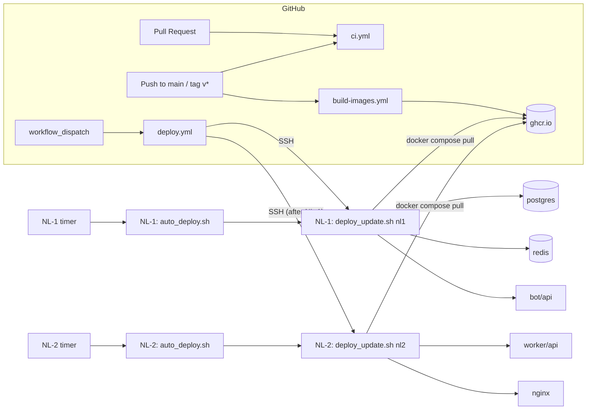
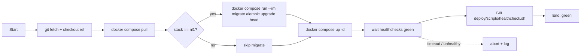

# 21 — CI/CD

> Status: Stable
> Audience: DevOps, release engineers, on-call, AI agents writing
> CI/CD changes
> Companion docs:
> [`19-docker-architecture.md`](19-docker-architecture.md) — what runs,
> [`20-deployment.md`](20-deployment.md) — host-side procedure,
> [`22-backup-restore.md`](22-backup-restore.md),
> [`24-runbooks.md`](24-runbooks.md),
> [`31-troubleshooting.md`](31-troubleshooting.md).

End-to-end pipeline of DWTGBot: GitHub Actions for lint/test,
image build/push to GHCR, and SSH-orchestrated rolling deploy to
NL-1 then NL-2. No fluff — workflow-by-workflow, with secrets,
idempotency rules, failure scenarios, rollback paths, and a
manual fallback for when CI is unavailable.

> 🔒 **Locked decisions** (ADR-0005):
> - **CI host**: GitHub Actions (`ubuntu-latest`).
> - **Registry**: GHCR (`ghcr.io/<org>/<repo>-<svc>`).
> - **Deploy transport**: SSH (`appleboy/ssh-action`) into both hosts.
> - **Operator surface on each host**: `deploy/scripts/deploy_update.sh`.
> - **Order**: NL-1 always before NL-2 (`needs: [nl1]` in `deploy.yml`).

---

## §1 — Pipeline overview



Три GitHub workflow плюс дополнительный host-side автодеплой:

| Stage | Workflow | Trigger | Output |
|---|---|---|---|
| Verify | `ci.yml` | every push + PR | green / red status checks |
| Publish | `build-images.yml` | push to `main` + `v*.*.*` tag + manual | tagged images in GHCR |
| Roll out (manual) | `deploy.yml` | manual (`workflow_dispatch`) | running new images on NL-1, then NL-2 |
| Roll out (automatic) | `deploy/systemd/dwtgbot-autodeploy.timer` + `deploy/scripts/auto_deploy.sh` | periodic host timer | latest green `main` SHA deployed on each host |

Ручной `deploy.yml` остаётся штатным операторским путём. Автодеплой -
это **дополнительный host-side механизм**, который можно установить на
NL-1 и NL-2, если нужен rollout по таймеру без ручного `workflow_dispatch`.

---

## §2 — Workflow inventory

| File | Trigger | Concurrency | Permissions | Purpose |
|---|---|---|---|---|
| `.github/workflows/ci.yml` | `push`, `pull_request` to `main`/`develop` | `ci-${{ github.ref }}`, `cancel-in-progress: true` | `contents: read` | Lint, type-check, unit + integration tests, scanners, shellcheck |
| `.github/workflows/build-images.yml` | `push` to `main`, tags `v*.*.*`, `workflow_dispatch` | (none — concurrent OK) | `contents: read`, `packages: write` | Build & push 4 images to GHCR |
| `.github/workflows/deploy.yml` | `workflow_dispatch` (target + ref) | `deploy-${{ inputs.target }}`, `cancel-in-progress: false` | `contents: read` | SSH into NL-1 then NL-2, run `deploy_update.sh` |
| `deploy/systemd/dwtgbot-autodeploy.timer` + `deploy/scripts/auto_deploy.sh` | systemd timer on each host | `flock` lock per target (`nl1` / `nl2`) | GitHub token on host (`Actions: read`, `Contents: read`, `Deployments: read/write`) | Wait for green `ci.yml` + `build-images.yml`, then run host-side deploy |

**Concurrency contract:**
- CI cancels stale runs on the same branch (PR rebase friendly).
- Builds may overlap (different shas → different tags).
- Deploys are **never cancelled** mid-flight (`cancel-in-progress: false`) — ordering matters more than queue length. A second `deploy.yml` run for the same target queues until the first finishes.

For the canonical install / run / verify order of host-side autodeploy,
see [`20-deployment.md`](20-deployment.md). This document explains the
pipeline roles and credentials; `20-deployment.md` is the operational
playbook agents should follow on hosts.

---

## §3 — `ci.yml` (lint / test / scanners)

Eight parallel jobs, all on `ubuntu-latest`. Each has a `timeout-minutes` to fail fast.

### 3.1 `lint` — ruff (format + lint)

```yaml
- name: ruff format --check
  run: ruff format --check .
- name: ruff check
  run: ruff check .
```

- Pinned to `requirements/dev.txt` (`pip cache` keyed on that file).
- Fails if any file is not formatted, or `ruff check` reports any rule violation.
- **Local equivalent:** `ruff format --check . && ruff check .` or `make lint`.

### 3.2 `typecheck` — mypy

```yaml
- run: mypy app
```

- Type-checks the `app/` package only (not `tests/`).
- Pip cache keyed on `requirements/{base,dev}.txt`.
- **Local equivalent:** `mypy app` or `make typecheck`.

### 3.3 `tests` — pytest

```yaml
- name: Install ffmpeg (for yt-dlp postprocessor probes)
  run: sudo apt-get update -y && sudo apt-get install -y --no-install-recommends ffmpeg

- name: pytest
  env:
    BOT_TOKEN: "0000000000:test-token"
    APP_ENV: development
    LOG_LEVEL: WARNING
    LOG_JSON: "false"
    PUBLIC_BASE_URL: http://localhost:8080
    STORAGE_PATH: ${{ runner.temp }}/dwtgbot/storage
    STORAGE_TMP_PATH: ${{ runner.temp }}/dwtgbot/tmp
  run: pytest -m "not integration"
```

- Installs `ffmpeg` system binary (yt-dlp probes it during option construction).
- Excludes `@pytest.mark.integration` (those run in the dedicated integration job).
- Coverage gate is enforced via `pyproject.toml` `addopts`:
  `--cov=app --cov-report=term --cov-report=xml --cov-fail-under=70`.
- Fake env values are deliberately invalid in production (so tests can never accidentally hit prod resources).
- **Local equivalent:** `pytest -m 'not integration'` or `make test`.

### 3.4 `integration-tests` — Postgres + Redis

```yaml
services:
  postgres: postgres:16-alpine
  redis: redis:7-alpine

- name: alembic upgrade head
  run: alembic upgrade head

- name: pytest -m integration
  run: pytest -m integration --no-cov
```

- Runs the opt-in integration suites against ephemeral Postgres + Redis on every PR.
- `alembic upgrade head` is a migration smoke step, independent from the integration test code itself.
- `--no-cov` avoids applying the unit-suite coverage gate to the narrow integration slice.

### 3.5 `shell-lint` — shellcheck

```yaml
- uses: ludeeus/action-shellcheck@2.0.0
  with:
    scandir: ./deploy/scripts
    severity: warning
```

- Only `deploy/scripts/*.sh` is scanned (production-critical bash).
- Treats `warning` and above as failures.

### 3.6 `trivy` / `gitleaks` — security scanners

- `trivy` scans the repository filesystem for HIGH / CRITICAL vulnerabilities before merge.
- `gitleaks` scans the checked-out repository for committed secrets.
- Both are PR gates, so security regressions fail before image build / deploy.

### 3.7 What CI does NOT do

| Not in CI | Why | Where instead |
|---|---|---|
| Build images | costs minutes on every PR; not all PRs change runtime | `build-images.yml` on `main` |
| Deploy | safety: every deploy is manual | `deploy.yml` (manual dispatch) |
| Live Telegram / public-edge smoke | needs deployed infra and a human eyeball | post-deploy checks in `20-deployment.md` |

### 3.8 Local parity

You can reproduce all of CI locally:

```bash
# Core CI jobs:
ruff format --check . && ruff check . && mypy app && pytest -m "not integration"
pytest -m "integration" --no-cov
shellcheck deploy/scripts/*.sh
```

Or via `make ci` (if defined).

---

## §4 — `build-images.yml` (build & push to GHCR)

### 4.1 What it does

Builds **four** images in parallel (matrix) and pushes them to GHCR:

| Matrix entry | Dockerfile | Image name |
|---|---|---|
| `bot` | `docker/bot.Dockerfile` | `ghcr.io/<org>/<repo>-bot` |
| `api` | `docker/api.Dockerfile` | `ghcr.io/<org>/<repo>-api` |
| `worker` | `docker/worker.Dockerfile` | `ghcr.io/<org>/<repo>-worker` |
| `backup` | `docker/backup.Dockerfile` | `ghcr.io/<org>/<repo>-backup` |

`fail-fast: false` — one image failing doesn't cancel the others.

### 4.2 Tags pushed

`docker/metadata-action@v5` computes tags from the trigger:

| Trigger | Tags pushed |
|---|---|
| Push to `main` | `main`, `sha-<short>` |
| Push tag `v1.2.3` | `v1.2.3`, `1.2.3`, `1.2`, `sha-<short>`, `latest` |
| Pull request | `pr-<num>` (push happens but is not used by deploy) |
| `workflow_dispatch` | `sha-<short>` |

**Rule for production:** pin the **immutable** tag (`sha-<short>` or `1.2.3`) in `IMAGE_*` env vars. Never pin `:latest` or `:main` in production.

`:latest` is **only** attached to semver tag builds (ADR-0008 §2.4) — never to `main` pushes — so a single `:latest` always points to a published release. Compose files use `${IMAGE_*:?...}` so a missing or unset variable fails `docker compose up` with a clear error instead of silently pulling whatever is currently tagged `:latest`. The deploy workflow sets `IMAGE_*` to `ghcr.io/<repo>-<svc>:sha-<short>` derived from `git rev-parse --short=7 HEAD` of the chosen ref before invoking `deploy_update.sh`. A `concurrency:` group on `build-images.yml` serialises overlapping builds for the same git ref to prevent tag races.

### 4.3 Build configuration

```yaml
- uses: docker/setup-qemu-action@v3
- uses: docker/setup-buildx-action@v3
- uses: docker/login-action@v3
  with:
    registry: ghcr.io
    username: ${{ github.actor }}
    password: ${{ secrets.GITHUB_TOKEN }}
```

- QEMU + Buildx → multi-arch build capability (currently default `linux/amd64`).
- Login uses the **automatic** `GITHUB_TOKEN` (no PAT needed) — works because the workflow has `permissions.packages: write`.
- Cache: `cache-from/to: type=gha, scope=${{ matrix.name }}` — per-image GitHub Actions cache (each image has its own scope so they don't pollute each other).
- `provenance: false` — keeps tags simple (no extra `*-attestation` images).

### 4.4 What the workflow does NOT do

- Does not sign images (cosign integration is a future extension).
- Does not scan images (Trivy / Grype) — see §16.
- Does not test images post-build (the underlying source already passed `ci.yml`).

### 4.5 Verifying a build

After `Build & push` completes:

```bash
# List the latest tags for one image
gh api -H "Accept: application/vnd.github+json" \
  /users/<org>/packages/container/<repo>-bot/versions \
  | jq -r '.[] | .metadata.container.tags[]' | sort -u | head

# Inspect what's in the registry (locally)
docker manifest inspect ghcr.io/<org>/<repo>-bot:sha-abc1234
```

---

## §5 — `deploy.yml` (orchestration)

### 5.1 Trigger

```yaml
on:
  workflow_dispatch:
    inputs:
      target:
        type: choice
        options: [nl1, nl2, both]
        default: both
      ref:
        type: string
        default: main
```

Manual only. Operator picks:
- **target**: `nl1` (control plane only), `nl2` (media plane only), `both` (default — full release).
- **ref**: branch / tag / sha to check out on the host (`main` by default).

### 5.2 Two jobs, ordered

```yaml
jobs:
  nl1:
    if: ${{ inputs.target == 'nl1' || inputs.target == 'both' }}
    environment: nl1                       # ← protected env
    ...

  nl2:
    if: ${{ inputs.target == 'nl2' || inputs.target == 'both' }}
    needs: [nl1]                           # ← NL-2 waits for NL-1 (or its skip)
    environment: nl2
    ...
```

**`needs: [nl1]`** ensures NL-1 finishes (or is skipped) **before** NL-2 starts. This is the single most important guardrail in the pipeline:

- On schema-changing PRs, NL-1 runs `migrate alembic upgrade head` first; only then does NL-2's worker (which uses the new schema) start.
- If NL-1 fails, NL-2 is **not** attempted.

### 5.3 Per-job step

Each job runs the same SSH script via `appleboy/ssh-action@v1.0.3`:

```yaml
- uses: appleboy/ssh-action@v1.0.3
  env:
    GITHUB_TOKEN: ${{ github.token }}
  with:
    host: ${{ secrets.NL1_HOST }}
    username: ${{ secrets.NL1_SSH_USER }}
    key: ${{ secrets.NL1_SSH_KEY }}
    port: ${{ secrets.NL1_SSH_PORT || 22 }}
    script_stop: true                      # abort on first non-zero exit
    envs: GITHUB_SHA,GITHUB_REPOSITORY,GITHUB_TOKEN
    script: |
      set -Eeuo pipefail
      cd "${{ secrets.NL1_REPO_PATH }}"
      GH_AUTH_HEADER="AUTHORIZATION: basic $(printf 'x-access-token:%s' "${GITHUB_TOKEN}" | base64 | tr -d '\n')"
      git -c "http.https://github.com/.extraheader=${GH_AUTH_HEADER}" fetch --all --tags
      git checkout "${{ inputs.ref }}"
      git -c "http.https://github.com/.extraheader=${GH_AUTH_HEADER}" pull --ff-only origin "${{ inputs.ref }}" || true
      ASSUME_YES=1 sudo -E bash deploy/scripts/deploy_update.sh nl1
```

- `script_stop: true` + `set -Eeuo pipefail` → first failure aborts the whole script (no half-deploys).
- `git pull --ff-only … || true` → tolerates a detached-HEAD-on-tag checkout (no upstream to pull).
- The runner forwards its ephemeral `GITHUB_TOKEN` over SSH and uses a
  temporary `http.extraheader` for `git fetch` / `git pull`, so private
  host checkouts do not need a separate credential helper.
- `ASSUME_YES=1` → confirms destructive steps in helpers; required for non-interactive runs.

### 5.4 GitHub Environment protection (recommended)

Both jobs reference `environment: nl1` / `environment: nl2`. Configure each in **Settings → Environments**:

| Setting | NL-1 | NL-2 |
|---|---|---|
| Required reviewers | 1+ team members | 1+ team members |
| Wait timer | optional (e.g. 5 min for accidental dispatch) | optional |
| Deployment branches | `main` and `v*` only | `main` and `v*` only |
| Environment secrets | `NL1_*` | `NL2_*` |

Required reviewers convert "manual deploy" into "manual deploy with explicit approval" — protects against accidental dispatch.

### 5.5 Concurrency

```yaml
concurrency:
  group: deploy-${{ inputs.target }}
  cancel-in-progress: false
```

- Two simultaneous `both` deploys queue (don't overlap).
- A `nl1`-only deploy and a `nl2`-only deploy can run concurrently — that's fine because they target different hosts. A `both` deploy serializes against either of the single-target ones.

---

## §6 — `deploy_update.sh` contract (what actually runs on the host)

`deploy.yml` only ferries the trigger and invokes one command per host. The actual work lives in `deploy/scripts/deploy_update.sh <stack>`. It is the **single canonical operator action** for a release — used identically by CI, by humans, and by the host-side `auto_deploy.sh`.

### 6.1 Steps performed



| # | Step | Idempotent? | Failure mode |
|---|---|---|---|
| 1 | `git fetch --all --tags` | yes | network → exit 1, no host change |
| 2 | `git checkout <ref>` + `pull --ff-only` (best-effort) | yes | conflict → exit 1, working tree unchanged |
| 3 | `docker compose -f deploy/<stack>/docker-compose.yml pull` | yes | manifest unknown → exit 1, no container change |
| 4 | NL-1 only: `docker compose run --rm migrate alembic upgrade head` | yes (forward-only; idempotent if at HEAD) | bad migration → exit 1, **DB partially migrated** if mid-flight (see §11.4) |
| 5 | `docker compose up -d` | yes (Compose recreates only changed services) | bad image / config → exit 1 with the offending service named |
| 6 | Wait for healthchecks (poll up to T seconds) | yes | timeout → exit 1, abnormal services left running but `unhealthy` |
| 7 | `bash deploy/scripts/healthcheck.sh` | yes | exit 1 if any probe fails |

Total time on a small change: 30–90 s on NL-1, 60–180 s on NL-2.

`auto_deploy.sh` sets `AUTODEPLOY_SKIP_GIT_PULL=1` before calling
`deploy_update.sh`: the auto-deployer itself already did `git fetch`
and pinned the checkout to the exact target SHA, so the extra
best-effort `git pull` is intentionally skipped to avoid noisy warnings
on detached HEAD.

### 6.2 What it never does

- Never deletes volumes (`-v`).
- Never `git reset --hard`.
- Never edits `.env` (image tags must be updated **before** dispatching a deploy — see §10.3 of `20-`).
- Never bypasses `migrate` on NL-1.

### 6.3 ASSUME_YES contract

Helpers (`helpers.sh`) prompt for confirmation on destructive steps. CI sets `ASSUME_YES=1` to auto-confirm. **Operators running manually should leave it unset** so prompts appear (defence against tired-finger deploys).

---

## §7 — Secrets catalogue

All secrets live in **GitHub → Settings → Secrets and variables**. Use **Environment** secrets (per `nl1` / `nl2` environment) when possible, **Repository** secrets only for things shared across both environments (rare).

### 7.1 Auto-provided

| Secret | Provided by | Used in | Scope |
|---|---|---|---|
| `GITHUB_TOKEN` | GitHub Actions runtime | `build-images.yml` (GHCR push) | per-job, ephemeral |

### 7.2 Required for `deploy.yml`

| Secret | Where | Used by | Notes |
|---|---|---|---|
| `NL1_HOST` | env `nl1` | `deploy.yml` job `nl1` | hostname or IP |
| `NL1_SSH_USER` | env `nl1` | same | non-root admin user (e.g. `ops`) |
| `NL1_SSH_PORT` | env `nl1` | same (defaults to `22`) | |
| `NL1_SSH_KEY` | env `nl1` | same | OpenSSH **private** key (contents of `~/.ssh/id_ed25519`); the **public** key must be in `~ops/.ssh/authorized_keys` on NL-1 |
| `NL1_REPO_PATH` | env `nl1` | same | absolute path on NL-1 (e.g. `/opt/dwtgbot`) |
| `NL2_HOST` | env `nl2` | `deploy.yml` job `nl2` | |
| `NL2_SSH_USER` | env `nl2` | same | |
| `NL2_SSH_PORT` | env `nl2` | same | |
| `NL2_SSH_KEY` | env `nl2` | same | |
| `NL2_REPO_PATH` | env `nl2` | same | |

> **Not** in CI: `BOT_TOKEN`, `POSTGRES_PASSWORD`, `REDIS_PASSWORD`, `API_INTERNAL_TOKEN` — these live **only** on the hosts (`deploy/<host>/.env`). The pipeline never sees them.

### 7.3 Optional (future / extensions)

| Secret | Purpose |
|---|---|
| `COSIGN_PRIVATE_KEY` | image signing |
| `SLACK_WEBHOOK_URL` | deploy notifications |
| `SENTRY_AUTH_TOKEN` | release marker upload |
| `OFFSITE_BACKUP_*` | scripted restore drills |

### 7.4 Host-side autodeploy token

При использовании `deploy/systemd/dwtgbot-autodeploy.timer` каждому
хосту нужен `/etc/dwtgbot/autodeploy.env` с **локальным** GitHub token:

| Variable | Scope | Why |
|---|---|---|
| `GITHUB_TOKEN` | host-local only | query `ci.yml` / `build-images.yml`, create/read deployment statuses, and authenticate `git fetch` against a private GitHub `origin` |

Права, которые нужны этому token:

- `Actions: read`
- `Contents: read`
- `Deployments: read/write`

Этот token нельзя класть в `deploy/nl1/.env`, `deploy/nl2/.env` или CI
secrets: его использует напрямую host-side systemd service.

### 7.5 Rotation procedure

1. Generate the new value (`openssl rand …` or `ssh-keygen -t ed25519 -f new_key`).
2. Update the secret in **GitHub → Environment** (NL-1 or NL-2 scope).
3. For SSH keys: also append the new public key to `~ops/.ssh/authorized_keys` on the host (do not delete the old one yet).
4. Trigger a no-op deploy with the new secret to confirm.
5. Remove the **old** SSH public key from `authorized_keys`.
6. Document the rotation in your team's audit log.

For host-local secrets (`BOT_TOKEN`, `POSTGRES_PASSWORD`, etc.) see `20-deployment.md` §7.3 — pipeline isn't involved.

### 7.6 Logging discipline

| Rule | Why |
|---|---|
| Never `echo $SECRET` in a step | logs visible to anyone with read access |
| Use `::add-mask::` for any value derived from a secret | masks that string in subsequent log lines |
| Don't print `env` in shell scripts run via SSH | risks leaking host-side secrets too |

`appleboy/ssh-action` already streams remote stdout to the runner — assume any `echo` lands in CI logs.

---

## §8 — Idempotency

The pipeline is designed so **every step can be re-run safely** with no extra side effects.

| Step | Re-run effect |
|---|---|
| `ci.yml` jobs | Re-checks the same code; no external mutation. |
| `build-images.yml` for the same sha | Pushes the same `sha-<short>` tag (overwrites if mutable; same digest). |
| `deploy.yml` with same `ref` and `target` | `git checkout` is a no-op; `docker compose pull` re-validates manifests; `migrate` is no-op at HEAD; `up -d` recreates only services with changed config or image. |
| `deploy_update.sh nl1` re-run | Same as a single fresh run. |
| `restore.sh` (out-of-band) | Stops/starts writers; idempotent if pointed at the same dump. |

**Failure rule:** if a deploy fails midway, the safest first action is **re-run the same deploy** (same `ref`, same `target`). If it succeeds on the second attempt, the failure was transient (network blip, GHCR rate limit). If it fails identically, see §11.

---

## §9 — Safe deploy practices

### 9.1 Image tag discipline

- **Never** put `:latest`, `:main`, or `:develop` in production `.env` `IMAGE_*` variables. Always pin `sha-<short>` or `vX.Y.Z`.
- Update `IMAGE_*` in **both** `deploy/nl1/.env` and `deploy/nl2/.env` for services they actually run, then commit (or scope a manual edit and roll back if deploy fails).
- Image tags + git ref together identify the deployed version.

### 9.2 Order is mandatory

- NL-1 always before NL-2. `deploy.yml` enforces this with `needs: [nl1]`.
- Within NL-1: `migrate` runs before `bot`/`api` are recreated (compose `depends_on` enforces).
- Within NL-2: `api` healthy before `nginx` accepts traffic.

### 9.3 No live-host edits

| ❌ Don't | ✅ Do |
|---|---|
| `docker exec bot sed -i ...` to "fix" a bug in prod | branch → PR → CI → build → deploy |
| Edit `docker-compose.yml` on the host | edit in repo, PR, deploy |
| Bump yt-dlp via `docker exec worker pip install` | bump in `requirements/base.txt`, rebuild image, deploy |
| Apply migration via `psql` directly | always via `migrate` container |

Live edits drift; the next deploy reverts them silently.

### 9.4 Gates and approvals

- **Required reviewers** on `nl1` / `nl2` environments (§5.4).
- **Branch protection** on `main`: required CI checks (`lint`, `typecheck`, `tests`, `integration-tests`, `shell-lint`, `trivy`, `gitleaks`).
- **CODEOWNERS** for `deploy/`, `migrations/`, `.github/workflows/` directing review to ops.
- **Required signed commits** (recommended).

### 9.5 Maintenance windows

Most deploys have no user-visible impact (§13 of `20-`). For unavoidable disruption:

1. Announce ≥ 24 h ahead in the bot's status channel.
2. Stop bot first to drain in-flight callbacks (`docker compose stop bot`).
3. Run the disruptive change.
4. Smoke (§10).
5. Restart bot.

---

## §10 — Post-deploy verification

`deploy_update.sh` already runs `healthcheck.sh` at the end. Treat it as a tripwire, not the full smoke. After a deploy completes green, the **operator** should additionally:

### 10.1 Container state

```bash
NL1='docker compose -f deploy/nl1/docker-compose.yml'
NL2='docker compose -f deploy/nl2/docker-compose.yml'
$NL1 ps
$NL2 ps
# All services: State=running, Status contains "healthy"
```

### 10.2 Service-level

```bash
RPW=$(grep ^REDIS_PASSWORD deploy/nl1/.env | cut -d= -f2)
TOK=$(grep ^BOT_TOKEN      deploy/nl1/.env | cut -d= -f2)

docker exec dwtgbot_postgres pg_isready -U dwtgbot -d dwtgbot
docker exec dwtgbot_postgres psql -U dwtgbot -d dwtgbot -c \
  "SELECT version_num FROM alembic_version;"
docker exec dwtgbot_redis    redis-cli -a "$RPW" ping
docker exec dwtgbot_redis    redis-cli -a "$RPW" ZCARD arq:queue
docker exec dwtgbot_bot      curl -fsS "https://api.telegram.org/bot${TOK}/getMe" | jq '.ok'
docker exec dwtgbot_api      curl -fsS http://localhost:8080/healthz | jq
curl -fsS https://media.example.com/healthz | jq
```

### 10.3 Image / version sanity

```bash
for c in dwtgbot_bot dwtgbot_api dwtgbot_worker dwtgbot_backup; do
  docker inspect "$c" -f '{{.Name}} → {{.Config.Image}}'
done
```

Confirm each image tag matches the ref you intended to deploy.

### 10.4 Log triage

```bash
SINCE=10m
for s in nl1 nl2; do
  docker compose -f deploy/$s/docker-compose.yml logs --since=$SINCE --no-color \
    | jq -c 'select(.level=="error" or .level=="warning")' 2>/dev/null \
    | head -30
done
```

A normal post-deploy should produce **zero** errors in the first 10 minutes (warnings about reconnecting to PG/Redis at startup are OK and self-resolve).

### 10.5 End-to-end smoke

The single non-negotiable smoke is: from a Telegram client, paste one URL, pick one small format, receive the file; pick one large format, receive the temp link, click it, get the file.

Then check the DB:

```bash
docker exec -it dwtgbot_postgres psql -U dwtgbot -d dwtgbot -c \
  "SELECT id, status, kind, created_at FROM download_jobs ORDER BY created_at DESC LIMIT 5;"
```

The two newest rows should be `completed`.

### 10.6 What "good" looks like

| Signal | Healthy reading (15 min after deploy) |
|---|---|
| `docker compose ps` | all services `Up (healthy)` |
| `docker inspect ... -f '{{.RestartCount}}'` | unchanged from pre-deploy (no restart loops) |
| Top `error_class` histogram (`31-` Appendix A.5) | no new entries |
| Queue depth (`ZCARD arq:queue`) | trending toward 0 |
| `worker_job_done` rate | matches pre-deploy baseline |
| `https://.../healthz` | returns `{"status":"ok"}` |
| TLS expiry | unchanged (>30 days) |

If any signal is anomalous, jump to §11 / §12.

---

## §11 — Failure scenarios

Per-stage table of common failures, how they manifest, and what to do. Always read the workflow log **first** to know which stage failed.

### 11.1 `ci.yml` failures

| Failed job | Symptom | Cause | Fix |
|---|---|---|---|
| `lint` | `ruff check` errors | new code violates a rule | run `ruff check . --fix` locally; commit |
| `lint` | `ruff format --check` non-zero | unformatted file | run `ruff format .`; commit |
| `typecheck` | `mypy` errors | new code introduced a type regression | fix types in code; do **not** add `# type: ignore` blanket — see `26-cursor-rules.md` |
| `tests` | one or more pytest failures | broken behaviour | reproduce locally with the same env block (§3.3); fix |
| `tests` | timeouts / flakes | test reads network or filesystem state | mark `@pytest.mark.integration` if appropriate, or fix the test |
| `shell-lint` | shellcheck warnings | new bash issues | fix in `deploy/scripts/`; SC1091 for sourced files needs `# shellcheck source=…` annotation |

CI failures **block** the PR merge (branch protection). They never deploy.

### 11.2 `build-images.yml` failures

| Symptom | Cause | Fix |
|---|---|---|
| Job `build (worker)` red, others green | only `worker` Dockerfile broken | re-run after fix; `fail-fast: false` keeps green ones |
| `denied: permission_denied` on push to GHCR | workflow `permissions.packages` missing or org policy | restore `permissions: { packages: write }`; check org package-create policy |
| `failed to compute cache key` | cache scope mismatch after rename | clear actions cache; let the next run re-populate |
| `ENOSPC` during build | runner ran out of disk | shrink image (multi-stage, smaller base); split layers; rerun |
| Build hangs > 30 min | base image registry slow / build looping | re-run; if persistent, file an issue and pin a different base |

A failed build means the new tag does **not** exist in GHCR. Any deploy referencing that sha will fail at `docker compose pull`.

### 11.3 `deploy.yml` (SSH-time) failures

| Symptom | Cause | Fix |
|---|---|---|
| `Permission denied (publickey)` | `NL*_SSH_KEY` mismatch | update secret OR re-add public key on host (§7.4) |
| `host key verification failed` | first-time host key change | accept the new host key on a manual SSH from the runner OR set `ssh-action` `known_hosts` |
| `git: not a git repository` | `NL*_REPO_PATH` wrong | fix the secret to point to the actual repo |
| `git checkout: pathspec '<ref>' did not match` | `ref` typo or branch deleted | re-dispatch with a valid ref |
| `fatal: could not read Username for 'https://github.com'` | the host checkout points to a private HTTPS `origin`, but the deploy path did not forward a GitHub token into `git fetch` / `git pull` | confirm `deploy.yml` still passes `GITHUB_TOKEN`; for host-side autodeploy ensure `/etc/dwtgbot/autodeploy.env` has a valid token with `Contents: read` |
| `docker: command not found` | Docker not installed (host bootstrap incomplete) | run `20-deployment.md` §4 |
| `unauthorized: authentication required` on `docker compose pull` | host's docker isn't logged into GHCR | `docker login ghcr.io -u <user> -p <PAT>` (PAT with `read:packages`) |
| Job times out after 20–25 min | hung healthcheck OR migration | SSH in, read `docker compose logs migrate` and `... ps`; see §11.4 |

### 11.4 `migrate` failures (NL-1)

| Symptom | Likely cause | Fix |
|---|---|---|
| `Target database is not up to date` then bails | revision conflict (someone bypassed alembic) | reconcile manually; never blindly `alembic stamp head` |
| `IntegrityError: NotNullViolation` mid-migration | data violates new constraint | back out the constraint or write a data migration first |
| `relation "x" already exists` | migration ran twice / partial state | `alembic current`; if past failure point, `alembic stamp <next>` only after manual verification |
| Migration appears to hang | long lock (long-running query holding the table) | `SELECT * FROM pg_stat_activity WHERE wait_event IS NOT NULL`; cancel the blocker; re-run migration |
| New ENUM value missing | code uses value but migration didn't add it | add `ALTER TYPE ... ADD VALUE` migration; redeploy |

**Critical rule:** if `migrate` fails partway, the schema is in an unknown state. Do **not** start `bot`/`api`. Either:
- `alembic downgrade -1` if the partial change can be cleanly undone, OR
- restore from the latest pre-deploy dump (`22-backup-restore.md`).

### 11.5 `up -d` (compose) failures

| Symptom | Cause | Fix |
|---|---|---|
| `manifest unknown` | image tag doesn't exist in GHCR | check `IMAGE_*` in `.env`; fix; re-run |
| `bind: address already in use` | leftover container holding port | `docker ps -a`; remove the stray; re-run |
| Service starts then exits 1 | env validation failed (`pydantic` `ValidationError` in `Settings`) | read `docker compose logs <svc>`; correct env; re-run |
| `dependency failed to start` | upstream service unhealthy (e.g. postgres) | fix upstream first; re-run |
| OOM kill on first start | image larger than container memory limit | raise memory limits in compose OR fix the leak |

### 11.6 Healthcheck loop never goes green

| Service | First thing to check |
|---|---|
| `postgres` | `docker compose logs postgres`; check disk; check `POSTGRES_PASSWORD` env consistency |
| `redis` | `docker compose logs redis`; check `REDIS_PASSWORD` |
| `bot` | `getMe` returns `ok`; no `Conflict: terminated by other getUpdates` |
| `api` (NL-1) | reaches `postgres` and `redis` from inside the container |
| `worker` (NL-2) | reaches **NL-1's** `postgres` and `redis` (private network + firewall) |
| `nginx` (NL-2) | `nginx -t` from inside the container; cert files present |

`deploy_update.sh` aborts on a stuck healthcheck and leaves the failing service running so you can inspect it — do **not** `down` blindly.

---

## §12 — Rollback hints

Decision tree mirrors `20-deployment.md` §12.

### 12.1 Did the bad deploy change the schema?

- **No** → §12.2 image-only rollback.
- **Yes, backwards-compatible** → §12.2 still works.
- **Yes, breaking** → §12.3 (rare) or fix-forward.

### 12.2 Image-only rollback (preferred path)

```bash
# Operator on a workstation with repo access:
PREV=sha-abcdef1                                # previous good tag

for env in deploy/nl1/.env deploy/nl2/.env; do
  sed -i "s|^IMAGE_BOT=.*|IMAGE_BOT=ghcr.io/your-org/dwtgbot-bot:${PREV}|"          "$env"
  sed -i "s|^IMAGE_API=.*|IMAGE_API=ghcr.io/your-org/dwtgbot-api:${PREV}|"          "$env"
  sed -i "s|^IMAGE_WORKER=.*|IMAGE_WORKER=ghcr.io/your-org/dwtgbot-worker:${PREV}|" "$env"
  sed -i "s|^IMAGE_BACKUP=.*|IMAGE_BACKUP=ghcr.io/your-org/dwtgbot-backup:${PREV}|" "$env"
done

# Commit & push the env change so it's reproducible
git commit -am "ops: rollback images to ${PREV}" && git push

# Then dispatch deploy.yml with target=both, ref=<the rollback commit>
gh workflow run deploy.yml -f target=both -f ref=<rollback_commit_sha>
```

If you can't (or won't) commit env changes — make the change directly on the host (via SSH), then run `deploy_update.sh` manually. Document the deviation; restore it to git within the day.

### 12.3 Schema rollback (rare)

Forward-only is the policy; downgrade only when fix-forward is impossible. See `20-deployment.md` §12.3 for the exact procedure (stop writers → `alembic downgrade -1` → image rollback → restart writers).

### 12.4 Data rollback (last resort)

Restore from latest good `pg_dump` (`22-backup-restore.md`). Communicate the data-loss window.

### 12.5 Rollback gotchas

| Trap | Avoidance |
|---|---|
| Rolling back NL-2 first | Always NL-1 first (mirrors forward order; migrations may need to be reversed before workers stop) |
| Forgetting to update `IMAGE_BACKUP` | Backup container keeps running new code while others rolled back; usually harmless but inconsistent |
| Rolling back across an ENUM-add migration | The ENUM value still exists in PG; old code may break differently than expected — fix-forward instead |
| Rolling back without re-running `migrate` | If the new migration was idempotent forward, the rollback may need an explicit downgrade |

---

## §13 — Manual deploy fallback (no GitHub Actions)

When CI is down (GitHub incident, network), you can deploy directly. The procedure is the same as what `deploy.yml` does, just with a human in the loop.

### 13.1 Prerequisites

- SSH access to NL-1 and NL-2 with the same key the CI uses (or any admin key in `authorized_keys`).
- The repo cloned at `${REPO_PATH}` on each host (already there if the host was set up per `20-`).
- Image tags pinned in `.env` (commit them; even in manual mode keep git authoritative).

### 13.2 Step-by-step

**On a workstation** — confirm what you'll deploy:

```bash
git fetch --all --tags
git log -1 --format='%h %s' main           # what 'main' currently is
gh workflow view ci.yml --ref main         # CI green on 'main'?
gh api /users/<org>/packages/container/<repo>-bot/versions \
  | jq -r '.[].metadata.container.tags[]' | grep -E 'sha-|^v'
```

**On NL-1** — first:

```bash
ssh ops@nl1
cd /opt/dwtgbot
git fetch --all --tags
git checkout main           # or your tag/sha
git pull --ff-only origin main || true
sudo bash deploy/scripts/deploy_update.sh nl1
# Wait for green; run smoke (§10)
exit
```

**On NL-2** — only after NL-1 is green:

```bash
ssh ops@nl2
cd /opt/dwtgbot
git fetch --all --tags
git checkout main
git pull --ff-only origin main || true
sudo bash deploy/scripts/deploy_update.sh nl2
exit
```

### 13.3 If you need to skip `git pull`

Sometimes the host has uncommitted ops edits (rollback, hotfix). Do not blindly `git pull`. Instead:

```bash
git stash push -m "manual-ops-$(date +%s)"
git checkout <ref>
sudo bash deploy/scripts/deploy_update.sh nl1
# Inspect the stash and reconcile to git later
git stash list
```

Treat any local edit as **technical debt** — port it to a PR within the day.

### 13.4 If a host has lost the registry login

```bash
echo "$GHCR_PAT" | docker login ghcr.io -u "<github-user>" --password-stdin
```

Use a **read-only** classic PAT with `read:packages`. Store it in `/root/.docker/config.json` only (root, mode 0600).

### 13.5 Manual rebuild (no CI)

If GHCR is reachable but GitHub Actions is down, build images **on a workstation** (not on prod hosts):

```bash
docker buildx create --use
TAG=sha-$(git rev-parse --short HEAD)
for svc in bot api worker backup; do
  docker buildx build \
    --platform linux/amd64 \
    -f docker/${svc}.Dockerfile \
    -t ghcr.io/<org>/<repo>-${svc}:${TAG} \
    --push .
done
```

Then update `IMAGE_*` in `.env` to `${TAG}` and run §13.2.

---

## §14 — Safe-deploy checklist

Print this. Pin it near the deploy button.

```
== BEFORE DISPATCH ==
[ ] CI green on the ref you'll deploy (gh workflow view ci.yml --ref <ref>)
[ ] build-images.yml green for that ref; sha-<short> tag exists in GHCR
[ ] No active incidents / open P0 / P1 (24-runbooks.md §24)
[ ] If schema-changing: migration tested locally with throwaway PG
[ ] If env-changing: PRs to deploy/*/.env merged AND match what hosts have
[ ] Window appropriate (low traffic, on-call available)
[ ] Backup ran in the last BACKUP_INTERVAL_SECONDS (ls -laht /var/backups/dwtgbot)

== DISPATCH ==
[ ] gh workflow run deploy.yml -f target=both -f ref=<ref>
[ ] Required reviewer approval given (if env protection enabled)
[ ] Watch the workflow run; do not start a second deploy in parallel

== DURING ==
[ ] NL-1 job green BEFORE NL-2 job starts (needs: [nl1] enforces this)
[ ] If NL-1 fails: STOP. Do not approve NL-2. Diagnose first (§11)
[ ] If migration failed mid-way: see §11.4; do not restart bot/api blindly

== AFTER ==
[ ] §10.1–10.4 verification commands all pass
[ ] §10.5 end-to-end smoke (small + large) succeeded
[ ] §10.6 "what good looks like" signals green for 15 min
[ ] Image tags in `docker inspect` match the deployed ref
[ ] alembic_version matches expected HEAD
[ ] Documented the deployed version in your team's deploy log

== IF SOMETHING GOES WRONG ==
[ ] First action: re-run the same deploy (idempotency rule, §8)
[ ] If repeats: identify failed stage in §11 table; apply listed fix
[ ] If user-visible incident: open the relevant 24-runbook
[ ] Rollback only when fix-forward isn't possible (§12); image-only first
[ ] Communicate; capture knowledge (24- §23)
```

---

## §15 — Common AI / operator mistakes

| # | Mistake | Symptom | Cure |
|---|---|---|---|
| 1 | Edited `.env` on host without committing to git | drifts; next deploy reverts | always edit in repo; PR |
| 2 | Pinned `:latest` "for convenience" | non-deterministic deploy | pin `sha-<short>` or `vX.Y.Z` |
| 3 | Dispatched deploy with `target=both` when NL-1 is broken | NL-2 starts on broken NL-1 schema | use `target=nl1` while debugging; `needs:` already enforces ordering, but explicit is safer |
| 4 | Cancelled a running `deploy.yml` mid-flight | half-deployed state | `cancel-in-progress: false` makes this hard; if you did it anyway, re-run the same deploy |
| 5 | Re-ran deploy hoping migration would skip | partial schema state recurs | first restore a clean DB state per §11.4 |
| 6 | Approved both env reviews without reading job logs | accidental approvals during incident | require the **second** reviewer to read logs |
| 7 | Used a PAT with broader scope than needed for GHCR pulls | credential blast radius | classic PAT, `read:packages` only |
| 8 | Stored `BOT_TOKEN` as a GitHub secret | leakage risk; secret never needed by CI | keep it host-local only |
| 9 | Pushed images for a feature branch and deployed them | non-reproducible from main | only deploy refs that landed on `main`/tags |
| 10 | Mixed manual host edits and CI deploys without reconciling | drift; "worked on Tuesday, broken on Friday" | no ad-hoc edits; if unavoidable, port to repo same day |

---

## §16 — Future extensions

- **Environment promotion**: separate `staging` env on a single host; auto-deploy to staging on push to `main`, manual promotion to prod.
- **Image scanning**: Trivy/Grype step in `build-images.yml` blocking on critical CVEs.
- **Image signing**: cosign sign + verify on pull (admission policy).
- **Slack/Telegram deploy notifications**: post start/finish/rollback.
- **DR drills in CI**: periodic restore of the latest dump into a scratch DB; sanity SQL.
- **Healthcheck-aware deploy gate**: NL-2 only starts after NL-1's `/readyz` is green for N consecutive seconds.
- **Canary deploy**: split worker concurrency across two image tags briefly.

Each of these crosses an ADR-0005 assumption — propose in
`26-cursor-rules.md` and add an ADR before implementing.
