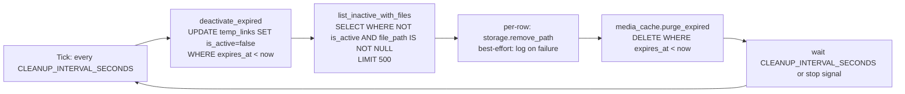

# 23 — Cleanup & Retention

> Status: Stable
> Audience: backend engineers, SRE, on-call, AI agents writing
> retention/cleanup code
> Companion docs:
> [`10-temp-links-and-delivery.md`](10-temp-links-and-delivery.md) — temp link semantics,
> [`12-db-schema.md`](12-db-schema.md) — `temp_links`, `media_cache` tables,
> [`19-docker-architecture.md`](19-docker-architecture.md) — what runs,
> [`20-deployment.md`](20-deployment.md) — host setup,
> [`22-backup-restore.md`](22-backup-restore.md) — interaction with backups,
> [`24-runbooks.md`](24-runbooks.md) — disk-pressure runbook,
> [`31-troubleshooting.md`](31-troubleshooting.md) — diagnosis recipes.

How DWTGBot reclaims storage without losing files users still
need. Anatomy of the cleanup worker, the manual fallback, the
TTL semantics, race conditions and how the design defuses them,
tuning, monitoring, and a checklist.

> 🔒 **Locked invariants** (ADR-0005):
> - **Postgres is the source of truth for retention.** A file is
>   only safe to delete after its `temp_links` row is `is_active=false`.
> - **Inactivate-first, then delete.** Cleanup never `DROP`s rows;
>   it sets `is_active=false` and lets a separate pass remove
>   the bytes.
> - **Idempotent.** A cleanup cycle is safe to repeat; missed
>   ticks are harmless (next cycle catches up).
> - **Best-effort file deletion.** A file delete failure logs a
>   warning and proceeds — never aborts the cycle.

---

## §1 — Purpose and scope

The cleanup loop has **one job**: keep disk usage on the media-plane host (NL-2 в `split`, единственный хост в `single`) under
control by removing files whose access ticket has expired,
without deleting anything a live request might still hand out.

### 1.1 Why automation is required

| Pressure | Without cleanup | What goes wrong |
|---|---|---|
| Per-job storage (50 MB – 2 GiB) | linear growth | disk fills in days |
| Per-job DB row | constant | rows live forever; queries slow |
| Provider info cache (`media_cache`) | unbounded | cache hit ratio drops as DB grows |
| Worker scratch (`STORAGE_TMP_PATH`) | leaked partials on crash | 10s of GiB of orphaned bytes |

### 1.2 What it deliberately does **not** do

| Out of scope | Lives in |
|---|---|
| PostgreSQL physical storage (vacuum / autovacuum / WAL) | Postgres itself + `22-` |
| Redis memory limits / eviction policy | Redis config |
| Backup file rotation | `22-backup-restore.md` §5 |
| Container log rotation | docker `daemon.json` (`20-` §4) |
| Cleanup of **completed jobs** rows | NOT performed automatically; audit-grade table |
| Cleanup of `audit_logs` rows | NOT performed automatically; partition-by-month recipe |

If you want to purge `download_jobs` history, write an explicit
admin task; the cleanup worker won't do it for you (by design —
that table is a forensic record).

---

## §2 — What gets cleaned (catalog by class)

Three independent classes, three independent rules.

### 2.1 The catalog

| # | Class | Where | Trigger | Removed by | Frequency |
|---|---|---|---|---|---|
| 1 | **Expired temp links** | `temp_links` rows + `STORAGE_PATH/jobs/<id>/…` files | `expires_at < now()` OR `downloads_count >= max_downloads` | `cleanup_worker._run_cycle` (continuous loop) | every `CLEANUP_INTERVAL_SECONDS` (default 1 h) |
| 2 | **Expired media cache** | `media_cache` rows | `expires_at < now()` | same cycle, `media_cache.purge_expired()` | same |
| 3 | **Stale scratch dirs** | `STORAGE_TMP_PATH/*` (worker tmp working area) | dir mtime older than `TMP_MAX_AGE_HOURS` (default 24 h) | manual `deploy/scripts/cleanup.sh` | on demand or operator cron |

> Note: scratch (#3) is **not** swept by the running container — only by `cleanup.sh`. If your worker frequently crashes mid-download, schedule `cleanup.sh` via host cron (§5.4).

### 2.2 What "expired" means per class

| Class | Authoritative timestamp | Set by | Default lifetime |
|---|---|---|---|
| Temp link | `temp_links.expires_at` | delivery service when link is created | `TEMP_LINK_TTL_SECONDS` (default 3 600 s = 1 h) |
| Temp link | `temp_links.downloads_count >= max_downloads` | nginx/api on each successful 200 | `TEMP_LINK_MAX_DOWNLOADS` (default 5) |
| Media cache | `media_cache.expires_at` | provider when info is cached | `MEDIA_CACHE_TTL_SECONDS` (default 21 600 s = 6 h) |
| Scratch dir | mtime of the directory | filesystem on creation | `TMP_MAX_AGE_HOURS` (default 24 h) |

### 2.3 What is **NOT** cleaned

| Object | Why kept |
|---|---|
| `download_jobs` rows | forensic / observability; we want history of "what users asked for" |
| `audit_logs` rows | compliance / debugging; manual partition rotation only |
| `STORAGE_PATH/jobs/<id>/` directory **without** any `temp_links` row pointing at it | only happens if cleanup raced with a job that crashed before insert; addressed in §10.4 (orphan sweep, optional) |
| Files referenced by `temp_links` rows that are still **active** | by design (someone might click the link in 1 second) |
| Files referenced by `temp_links` rows that are inactive but `file_path IS NULL` | nothing to delete |

---

## §3 — TTL and expiration logic

### 3.1 Temp links — the "ticket" model

A temp link is a one-shot (with a small `max_downloads` budget) ticket. It expires when **either** condition is met:

```
inactive ⇔ ( now() >= expires_at )  OR  ( downloads_count >= max_downloads )  OR  ( is_active = false )
```

Pseudocode of the gate (executed by the API serving `/links/<token>`):

```python
if link.expires_at <= now() or link.downloads_count >= link.max_downloads:
    return 410        # gone — cleanup will reap shortly
return X-Accel-Redirect(link.file_path)
```

`is_active = false` exists as a third explicit kill switch (operators can mass-deactivate without changing TTL, e.g. during an incident).

### 3.2 Media cache — provider info caching

Provider implementations (`get_info`) cache the resolved metadata in `media_cache` keyed by URL. The cycle calls `purge_expired()`:

```python
purged = await media_cache_repo.purge_expired()
```

Implementation should `DELETE FROM media_cache WHERE expires_at < now()`. This is **safe to delete** because cache misses are reconstituted by re-running `get_info`.

### 3.3 Scratch dirs — filesystem-only

`STORAGE_TMP_PATH/*` is the worker's working area for in-flight downloads. A clean run moves files out into `STORAGE_PATH/jobs/<id>/…` and removes its scratch dir. A crashed run leaves bytes behind. The `find -mmin +N -delete` recipe in `cleanup.sh` reaps them.

### 3.4 Defaults summary

| Var | Default | Where it's used |
|---|---|---|
| `TEMP_LINK_TTL_SECONDS` | `3600` (1 h) | initial `expires_at` for new links |
| `TEMP_LINK_MAX_DOWNLOADS` | `5` | per-link download budget |
| `MEDIA_CACHE_TTL_SECONDS` | `21600` (6 h) | **dual-use** — see §3.4.1 below |
| `CLEANUP_INTERVAL_SECONDS` | `3600` (1 h) | cycle period |
| `TMP_MAX_AGE_HOURS` | `24` | scratch dir age threshold (manual script) |

All can be tuned in `deploy/nl2/.env` (cleanup-side) and `deploy/nl1/.env` (cache-side). В топологии `single` всё задаётся в одном `deploy/single/.env`.

#### 3.4.1 `MEDIA_CACHE_TTL_SECONDS` controls **two** independent things

This is a sharp edge worth knowing before you tune it. The same env var is
used for:

| Consumer | What it controls | Eviction mechanism |
|---|---|---|
| `media_cache` Postgres table | how long a provider's resolved metadata is reusable | `cleanup_worker._run_cycle` calls `media_cache.purge_expired()` once per cycle (§4) |
| Redis `request_state` (per-update conversation state in the bot) | how long an analyzed-but-not-yet-clicked link stays live for the user | Redis TTL eviction at the key level |

Implications:

- **Lowering the value shortens both** at the same time. If you only wanted
  to refresh provider info more aggressively, you'll *also* shorten the
  window during which the user can return and click a previously analyzed
  link. Pick a value that is acceptable for both consumers (typically
  3–12 h).
- **Raising the value lengthens both** — provider metadata can go stale
  (signed URLs, geo gates), and Redis stores more state. Don't push above
  ~24 h without a real need.
- **Tested in both places.** Any change to the default must be reflected
  in `13-config-and-env.md` and verified against
  `app/application/services/request_state.py` (Redis TTL) and
  `media_cache_repo_impl.purge_expired` (Postgres).

> See [`13-config-and-env.md`](13-config-and-env.md) §132 for the
> canonical config reference (one row, two consumers).

---

## §4 — Cleanup worker anatomy

Source: `app/workers/cleanup_worker.py`. The worker is a small,
single-purpose process.

### 4.1 The cycle



### 4.2 Step-by-step (what `_run_cycle` actually does)

```python
# 1. Mark expired temp_links inactive
deactivated = await composition.temp_links_repo.deactivate_expired()

# 2. Pull a bounded batch of inactive rows that still have files on disk
inactive = await composition.temp_links_repo.list_inactive_with_files(limit=500)

# 3. Delete the files (per-row best-effort)
for link in inactive:
    path = Path(link.file_path)
    if path.exists():
        try:
            composition.storage.remove_path(path)
        except Exception:
            log.exception("temp_link_file_remove_failed", path=str(path))

# 4. Drop expired provider info from media_cache
purged = await media_cache_repo.purge_expired()
```

Properties:

- **Inactivate first, delete second.** A row stays in `temp_links` after cleanup deletes its file (`file_path` may stay or be nulled by the repo — implementation choice). The row is the audit trail; its file is not.
- **Bounded batch.** `limit=500` per cycle protects against pathological backlogs (huge incident → first cycle deletes 500, next cycle 500, …). At default cadence (1 h) that's 12 000 files/day max — more than enough for normal traffic.
- **Best-effort file delete.** A `Permission denied` or `FileNotFoundError` logs `temp_link_file_remove_failed` and continues. The cycle never aborts on single-file errors.
- **Idempotent.** Re-running deactivate-expired affects no new rows after the first run; re-listing inactive returns rows whose files truly still exist; deleting an already-deleted file is a no-op (we check `path.exists()` first).

### 4.3 Logged events (taxonomy in `14-`)

| Event | Emitted | Meaning |
|---|---|---|
| `cleanup_started` | once at boot | container is up, will tick every `CLEANUP_INTERVAL_SECONDS` |
| `temp_links_deactivated` | per cycle (only if `count > 0`) | how many rows flipped to inactive |
| `temp_link_files_removed` | per cycle (only if `count > 0`) | how many files were deleted from disk |
| `temp_link_file_remove_failed` | per failure | path that failed; reason in stack trace |
| `media_cache_purged` | per cycle (only if `count > 0`) | how many cache rows dropped |
| `cleanup_cycle_error` | per cycle on uncaught exception | cycle aborted; next tick retries |
| `cleanup_stopped` | once on SIGTERM/SIGINT | shutdown clean |
| `cleanup_startup_check_failed` | once on boot fail | misconfig (likely `STORAGE_PATH` missing/unwritable) |

### 4.4 Startup checks

```python
errors = settings.validate_runtime(require_storage=True, require_tools=False)
```

Worker refuses to start (exit 2) if:
- `STORAGE_PATH` does not exist
- `STORAGE_PATH` is not writable by the in-container UID/GID (1000:1000)

This catches the most common ops mistake (forgot `chown`).

### 4.5 Shutdown

`SIGTERM` and `SIGINT` set an `asyncio.Event`. The current cycle finishes; the wait loop returns; the process exits cleanly. Compose `stop` is therefore safe — never use `kill -9` on this container during a cycle (you'd risk leaving an `is_active=false` row whose file deletion failed silently).

---

## §5 — Cleanup container and schedule

### 5.1 Compose service

Сервис `cleanup` определён во фрагменте `deploy/compose/media.yml`
(ADR-0011); стеки `deploy/single/docker-compose.yml` и
`deploy/nl2/docker-compose.yml` лишь подключают его через `include`, поэтому
сервис и контейнер `dwtgbot_cleanup` одинаковы в обеих топологиях.
Упрощённый вид (актуальное определение — в самом фрагменте):

```yaml
cleanup:
  image: ${IMAGE_WORKER}                       # same image as worker (shares deps)
  env_file: .env
  command: ["python", "-m", "app.workers.cleanup_worker"]
  volumes:
    - storage:/var/lib/dwtgbot/storage
    - storage_tmp:/var/lib/dwtgbot/tmp
    - ./scripts:/scripts:ro
  restart: unless-stopped
  user: "1000:1000"
```

Same image as the worker (one less artifact to maintain). It mounts both the storage and the tmp volumes (read+write), plus the scripts directory (read-only) for use by the manual fallback.

### 5.2 Defaults

| Setting | Default | Effect |
|---|---|---|
| `CLEANUP_INTERVAL_SECONDS` | `3600` | one cycle / hour |
| `TEMP_LINK_TTL_SECONDS` | `3600` (1 h) | "ticket" lifetime |
| `TEMP_LINK_MAX_DOWNLOADS` | `5` | budget per link |
| `MEDIA_CACHE_TTL_SECONDS` | `21600` (6 h) | provider info cache lifetime |
| `STORAGE_PATH` | `/var/lib/dwtgbot/storage` | must exist, owned by `1000:1000` |
| `STORAGE_TMP_PATH` | `/var/lib/dwtgbot/tmp` | same |

### 5.3 Why a container loop, not host cron

| Reason | Explanation |
|---|---|
| Same lifecycle as the app | restart-on-failure, log streaming, health visible in `compose ps` |
| One source of truth (the code) | Python repos / storage abstraction are the same as worker — no duplication |
| Idempotent loop | restart-safe; missed tick is taken on next boot |
| JSON logs | greppable via the same `jq` recipes |

### 5.4 When to ALSO add host cron

Add cron only for things the cycle doesn't do:

```cron
# Sweep stale scratch dirs every 6 hours (worker may have crashed mid-download)
0 */6 * * * cd /opt/dwtgbot && bash deploy/scripts/cleanup.sh >>/var/log/dwtgbot-cleanup.log 2>&1
```

`cleanup.sh` runs `find -mmin +N` against `STORAGE_TMP_PATH` and **also** triggers a one-shot DB cycle (`compose run --rm cleanup`).

### 5.5 Healthiness signal

The cleanup service has `restart: unless-stopped` but no compose healthcheck (it has nothing to listen on). Healthiness is observed via logs:

```bash
NL2='docker compose -f /opt/dwtgbot/deploy/nl2/docker-compose.yml'
# single: NL2='docker compose -f /opt/dwtgbot/deploy/single/docker-compose.yml'

# Recent successful cycles
$NL2 logs --since=24h --no-color cleanup \
  | jq -c 'select(.event | test("temp_links_deactivated|temp_link_files_removed|media_cache_purged|cleanup_started|cleanup_cycle_error"))' \
  | tail -20
```

A healthy run emits *some* of `temp_links_deactivated`, `temp_link_files_removed`, `media_cache_purged` per cycle (only when `count > 0`). On a quiet system you may see only `cleanup_started`. Periodic `cleanup_cycle_error` is the alert signal — see §13.

---

## §6 — Manual cleanup (`deploy/scripts/cleanup.sh`)

Script runs **on the NL-2 host** (в топологии `single` — на единственном
хосте: скрипт сам находит стек с media plane через `find_stack_with media` и
вызывает `compose_stack` из `deploy/scripts/helpers.sh`). Two phases.

### 6.1 What it does

```bash
TMP_MAX_AGE_HOURS="${TMP_MAX_AGE_HOURS:-24}"
TMP_PATH="${STORAGE_TMP_PATH:-/var/lib/dwtgbot/tmp}"

# Phase 1 — sweep scratch dirs
minutes=$((TMP_MAX_AGE_HOURS * 60))
find "${TMP_PATH}" -mindepth 1 -maxdepth 2 -type d -mmin "+${minutes}" \
     -print -prune -exec rm -rf {} +

# Phase 2 — trigger one-shot DB cleanup cycle
compose_stack "${STACK}" run --rm cleanup python -c '
import asyncio
from app.workers.cleanup_worker import _run_cycle, build_api
from app.config import get_settings
from app.infrastructure.db.repositories.media_cache_repo_impl import SqlAlchemyMediaCacheRepository
async def main():
    s = get_settings(); c = build_api(s)
    try:
        await _run_cycle(c, SqlAlchemyMediaCacheRepository(c.core.sessionmaker))
    finally:
        await c.aclose()
asyncio.run(main())'
```

### 6.2 When to run it

| Situation | Why |
|---|---|
| Disk pressure alert (`df` > 80 %) | force a cycle now instead of waiting up to `CLEANUP_INTERVAL_SECONDS` |
| After a worker crash spree | scratch dirs may have leaked |
| Before/after a migration that adds/removes `temp_links` columns | bound the surprise |
| As a periodic safety net (host cron, every 6 h) | catches scratch leaks the container loop doesn't sweep |

### 6.3 Use

```bash
# Default scratch threshold (24 h) + one-shot cycle
sudo bash /opt/dwtgbot/deploy/scripts/cleanup.sh

# Tighter scratch threshold (e.g. 2 h)
sudo TMP_MAX_AGE_HOURS=2 bash /opt/dwtgbot/deploy/scripts/cleanup.sh
```

> Equivalent: `bash deploy/scripts/install.sh` → option **15) Cleanup old files (single / NL-2)**.

### 6.4 Safety properties

- `find -mindepth 1` excludes the `STORAGE_TMP_PATH` directory itself (don't remove the mount point).
- `-mmin +N` matches dirs **strictly older** than N minutes — fresh in-flight downloads (mtime within minutes) are spared.
- Running twice in 5 seconds is safe (no rows to deactivate the second time; nothing to delete the second time).
- The one-shot cycle uses `compose run --rm cleanup` which spins a **separate** container — does not interfere with the long-running `cleanup` service.

---

## §7 — Storage layout & terminology

### 7.1 Where files live (NL-2)

```
/var/lib/dwtgbot/                 (host root; 1000:1000)
├── storage/                      (STORAGE_PATH; bind-mount into worker, api, cleanup)
│   └── jobs/
│       └── <job_id>/             (created by worker per job)
│           ├── input.mp4         (intermediate, optional)
│           ├── output.mp3        (final artifact; referenced by temp_links.file_path)
│           └── ...
└── tmp/                          (STORAGE_TMP_PATH; worker scratch)
    └── <random>/                 (in-flight; deleted after job completion or by cleanup.sh)
```

### 7.2 Terminology

| Term | Meaning |
|---|---|
| **Active link** | `temp_links.is_active = true AND expires_at > now AND downloads_count < max_downloads` |
| **Inactive link** | any of the above flipped (`is_active=false` OR expired OR exhausted) |
| **Reapable file** | the file at `link.file_path` for an inactive link |
| **Orphan file** | a file under `STORAGE_PATH/jobs/<id>/` with **no** `temp_links` row pointing at it (rare; see §10.4) |
| **Scratch leak** | a directory under `STORAGE_TMP_PATH/` that the worker failed to clean (after crash) |
| **Cycle** | one execution of `_run_cycle` |
| **Tick** | the periodic invocation of a cycle by the loop |

### 7.3 Path discipline (P11)

All file paths returned by providers must be **inside** `STORAGE_PATH` — enforced by `ensure_within(path, STORAGE_PATH)` in `app/utils/paths.py`. Cleanup trusts this invariant: it never traverses outside `STORAGE_PATH`. If a provider violates the invariant and writes elsewhere, cleanup will not touch those files (they leak forever). See `30-add-new-provider-guide.md` Appendix D.7.

---

## §8 — State machine: download → delivery → expiration → cleanup

The full lifecycle of a piece of media on disk:

```mermaid
stateDiagram-v2
  [*] --> Downloading: worker starts job
  Downloading --> InScratch: yt-dlp/ffmpeg writes to STORAGE_TMP_PATH
  InScratch --> Persisted: success → move to STORAGE_PATH/jobs/<id>/
  Persisted --> Delivered: small file → Telegram direct send
  Persisted --> LinkActive: large file → temp_links row created (is_active=true)
  LinkActive --> LinkInactive: expires_at<now OR downloads>=max OR manual deactivation
  LinkInactive --> Reaped: cleanup deletes file (next cycle)
  Reaped --> [*]: row stays as audit; bytes gone
  Delivered --> Reaped: small files: also has temp_links row? if yes, same path; if not, file is left and removed by orphan policy
  Downloading --> Crashed: process killed mid-flight
  Crashed --> ScratchLeak: dir in STORAGE_TMP_PATH never cleaned
  ScratchLeak --> Reaped: cleanup.sh sweep (manual / cron)
```



### 8.1 Why this matters for cleanup

The cleanup worker only reaps **files that were registered as temp links**. The catch-all for everything else (small-file direct sends, crashed jobs) is the manual scratch sweep. This is intentional — a single rule (`temp_links.is_active=false → safe to delete file`) is easy to reason about; everything else is operator-driven.

If your `download_pipeline` for **small files** also creates a `temp_links` row (with a short TTL, even if the user never touches it), the cleanup loop will reap it on the next cycle for free. Confirm in `app/application/use_cases/download.py`.

---

## §9 — Race conditions and the design that defuses them

The most dangerous bug class in any cleanup system: deleting a file while someone is reading it. Here's how each potential race is handled.

### 9.1 Inventory of races

| # | Race | What could go wrong | Defence |
|---|---|---|---|
| R1 | Cleanup deactivates a link **between** the API's check and the file open | API returns 410 to a user who saw a fresh link a millisecond ago | `expires_at` is the same source of truth on both sides; user gets a clean 410 (acceptable; very rare) |
| R2 | Cleanup deletes the file **after** the API resolved `file_path` but **before** nginx opens it | nginx returns 5xx | `X-Accel-Redirect` is fast (≤1 ms); cleanup respects `is_active=true` (file only deleted after row is inactive); deactivate-then-delete adds an entire cycle of grace |
| R3 | Cleanup deletes the file **while** nginx is mid-stream | broken stream | OS file descriptor remains open after `unlink(2)` (POSIX semantics) — bytes flow until close; new readers can't open it (correct) |
| R4 | Worker writes to `STORAGE_PATH/jobs/<id>/` after cleanup decided "no row, must be orphan" | new file vaporized | We **don't** sweep orphan files in the standard cycle (only `temp_links`-driven deletes). Orphan sweep is opt-in (§10.4). |
| R5 | Two cleanup containers running (operator typo + auto loop) | double work, locks | DB statements are idempotent; file `unlink` of an already-gone file is a no-op (we `path.exists()` check first) |
| R6 | `deactivate_expired` and `list_inactive_with_files` are not in one transaction | row deactivated by cycle N is picked up by cycle N+1 | Acceptable: cycle N+1 deletes the file; the row stays inactive; `path.exists()` returns false the next cycle — nothing happens |
| R7 | Worker uses the same `STORAGE_TMP_PATH/<random>` as a leftover scratch dir | name collision | UUID-based random names; collision probability negligible; `find -mmin +N` doesn't touch fresh mtimes anyway |
| R8 | Manual `cleanup.sh` runs while the long-running cycle is mid-iteration | conflict | `cleanup.sh` runs in a separate ephemeral container (`compose run --rm cleanup`) — it talks to the same DB; both are idempotent; worst case is a row deactivated by both (no-op the second time) |

### 9.2 Why POSIX `unlink` saves us (R3 in detail)

When nginx serves a temp-link file:

1. Nginx receives the request.
2. API responds with `X-Accel-Redirect: /links/internal/jobs/<id>/...`.
3. Nginx `open(2)` on the file → gets an fd.
4. Nginx `read(2)` / `sendfile(2)` streams bytes.
5. Nginx `close(2)`.

If cleanup `unlink(2)`s the file between steps 3 and 5, **nginx's fd remains valid**: the bytes continue streaming to the user until close (then the inode is reclaimed). This is POSIX-mandated. So even an unfortunate timing leaves the in-flight stream intact.

### 9.3 What the design **doesn't** protect against

| Not protected | Mitigation |
|---|---|
| Two **delivery** services racing to create a temp link for the same job | unique constraint on `(job_id, kind)` in `temp_links` would catch this; check `12-` |
| Filesystem corruption (NL-2 disk failure) | not a cleanup concern — see DR (`22-` §15) |
| Operator running `rm -rf /var/lib/dwtgbot/storage` | nothing protects you from `rm -rf`; that's why backups (`22-` §7) exist |

---

## §10 — Risks: how to NOT delete needed files

Five concrete failure modes and how the design (or operator discipline) prevents them.

### 10.1 Risk: deleting an active link's file

**Cause**: cleanup uses the wrong predicate (e.g. drops `is_active=true` filter). **Defence**: the repo method is named `list_inactive_with_files` — refactors that change its semantics MUST be reviewed against this doc and `12-`.

**Verification (operator-side)**:

```sql
-- An active link MUST have its file present
SELECT id, file_path, expires_at, downloads_count, max_downloads
  FROM temp_links
 WHERE is_active = true AND expires_at > now()
 ORDER BY id DESC LIMIT 50;

-- For each row above, on NL-2:
ssh ops@nl2 'ls -la /var/lib/dwtgbot/storage/jobs/<id>/'
```

If you find missing files for active rows: you have a cleanup bug. Stop the cleanup container, audit, fix, re-deploy.

### 10.2 Risk: deleting a file currently being written

**Cause**: an `_run_cycle` invocation overlapping with a worker's `move-to-final-location` step. **Defence**: workers write to `STORAGE_TMP_PATH`, then atomically `os.rename` (or `shutil.move`) into `STORAGE_PATH/jobs/<id>/`. The cleanup worker only ever looks at files via `temp_links.file_path` — which doesn't exist until *after* the move and the link insert. Therefore a race is impossible by construction.

### 10.3 Risk: deleting before delivery succeeded

**Cause**: short `TEMP_LINK_TTL_SECONDS` + slow Telegram delivery. **Defence**: TTL starts at `temp_links` creation time; small files may not have a `temp_links` row at all (direct send). For large files, default TTL of 24 h is far longer than any realistic delivery RTT.

If you set TTL very low (e.g. 60 s) you increase the chance of cleanup eating a link before the user clicks. Don't. Lower bound = `MAX(60s, MAX_PARALLEL_DOWNLOADS * average_download_time)` — pick comfortably above this.

### 10.4 Risk: orphan files (file on disk, no DB row)

**Cause**: a worker crashed between `move-to-STORAGE_PATH` and `INSERT INTO temp_links`. The file lives forever; cleanup never touches it.

**Defence (built-in)**: none — by design. The standard cycle only reaps via `temp_links`. If you observe persistent orphan growth, opt in to the orphan sweep:

```bash
# One-off audit — list candidate orphans.
# split: Postgres на NL-1, файлы на NL-2 — собираем два списка и сравниваем.
# single: те же команды без ssh на единственном хосте.
ssh ops@nl1 'docker exec dwtgbot_postgres psql -U dwtgbot -d dwtgbot -At -c \
  "SELECT DISTINCT job_id::text FROM temp_links WHERE file_path IS NOT NULL"' \
  | sort > /tmp/linked_jobs.txt
ssh ops@nl2 'find /var/lib/dwtgbot/storage/jobs -mindepth 1 -maxdepth 1 -type d \
  | sed "s|.*/||"' | sort > /tmp/disk_jobs.txt
comm -23 /tmp/disk_jobs.txt /tmp/linked_jobs.txt
```

The output is a list of `job_id`-named dirs **without** any `temp_links` row. After review (no false positives expected — but do review), delete them:

```bash
# CAREFUL — only after the audit list is reviewed
for jid in $(cat orphan_list.txt); do
  ssh ops@nl2 "rm -rf /var/lib/dwtgbot/storage/jobs/$jid"
done
```

Future extension: an opt-in `--orphans` flag on `cleanup.sh` to run the same audit + delete with a confirmation. Out of scope for v1.

### 10.5 Risk: scratch leaks accumulating

**Cause**: workers crashing mid-download leave `STORAGE_TMP_PATH/<random>/` directories. **Defence**: `cleanup.sh` (`find -mmin +N -delete`). **Mitigation**: schedule it via host cron (§5.4) if your worker crashes more than rarely.

---

## §11 — Best practices

### 11.1 Configuration

- **Don't lower `TEMP_LINK_TTL_SECONDS` below 1 hour without rethinking UX**. Users may keep the chat open for a long time.
- **Don't raise it above 7 days without storage planning**. Long TTL = more bytes on disk concurrently.
- **`MEDIA_CACHE_TTL_SECONDS` ≤ a few hours**. Provider responses go stale (geo, signed URLs).
- **`CLEANUP_INTERVAL_SECONDS` ≤ TTL / 4**. So a link spends most of its life eligible for prompt deletion after expiry.
- **`TMP_MAX_AGE_HOURS` ≥ 2 × max expected job runtime**. Don't sweep mid-job.

### 11.2 Operations

- **Never `rm -rf STORAGE_PATH/...` to "free space"**. Use `cleanup.sh`. Manual `rm` skips the `temp_links` deactivation; users get 5xx instead of clean 410.
- **Never edit `temp_links` rows by hand to "force cleanup"** — operate at the column level (`UPDATE … SET is_active=false`); never `DELETE FROM temp_links` (loses audit).
- **Confirm `STORAGE_PATH` ownership** is `1000:1000` after any host-level work. If cleanup logs `temp_link_file_remove_failed: Permission denied`, ownership is wrong (§4.4).
- **Do not run `cleanup.sh` while restoring the database** (`22-` §14). Restore stops/starts services; cleanup may race.

### 11.3 Code

- **Never bypass the storage abstraction**. Use `composition.storage.remove_path(p)` instead of `Path(p).unlink()`. The abstraction enforces `ensure_within(STORAGE_PATH)`.
- **Never DROP rows from `temp_links` in cleanup**. UPDATE only.
- **Never hold the cleanup loop blocked on a slow operation** (e.g. external HTTP call). The worker is single-task by design.
- **New retention classes ⇒ new method on the appropriate repo**. Don't extend `_run_cycle` with ad-hoc `DELETE`s — model the rule explicitly.

### 11.4 Observability

- **Watch the histogram of `temp_link_file_remove_failed`**. Even one a day is noise; ten a day is a bug.
- **Watch disk free trend**, not absolute value (§13). Trend tells you whether retention matches load.

---

## §12 — Tuning frequency and batch size

### 12.1 The default profile

| Knob | Default | Steady-state behaviour |
|---|---|---|
| Cycle period | 1 h | Up to ~1 h delay between expiry and deletion |
| Batch size | 500 (in-code, `list_inactive_with_files(limit=500)`) | Up to 12 000 deletes/day; covers ~99 % of installs |
| TTL | 1 h | Files live ~2 h max from creation |
| Cache TTL | 6 h | At most 1 day of provider info on disk |

Reasonable for: ≤ 5 000 jobs/day with avg file ≈ 200 MB → ≈ 1 TB/day churn, comfortably handled.

### 12.2 When to lower `CLEANUP_INTERVAL_SECONDS`

| Symptom | Tune |
|---|---|
| Disk consistently > 70 % between cycles | `CLEANUP_INTERVAL_SECONDS=900` (15 min) |
| You shortened TTL (e.g. 2 h) and want prompt deletion | `CLEANUP_INTERVAL_SECONDS=300` (5 min) |
| `temp_links_deactivated` count routinely > 500 per cycle | shorter cycle OR larger batch (§12.3) |

### 12.3 When to raise the batch size

The 500-row batch is hard-coded in `cleanup_worker.py`. To raise it:

1. Treat it as code change (`28-implementation-playbook.md`); doc + tests required.
2. Ensure the per-cycle wall time stays bounded — at 500 deletes you have minutes of margin. Above 5 000 you may need backpressure.
3. Better alternative: shorter `CLEANUP_INTERVAL_SECONDS` (cheaper, no code change).

### 12.4 When to raise `TEMP_LINK_TTL_SECONDS`

Only when users complain about clicking too late (e.g. shared in slow channels). Each doubling of TTL roughly doubles peak storage. Always raise *with* a `MAX_FILE_SIZE_MB` review and a `df -h` plan.

### 12.5 Tuning is reversible

All cleanup knobs live in `deploy/nl2/.env` (в `single` — `deploy/single/.env`) and take effect on container restart:

```bash
ssh ops@nl2 'docker compose -f /opt/dwtgbot/deploy/nl2/docker-compose.yml restart cleanup'
# single:
docker compose -f /opt/dwtgbot/deploy/single/docker-compose.yml restart cleanup
```

No DB migration, no risk of data loss. If you dislike a value, change it back.

### 12.6 Avoid

- Setting `CLEANUP_INTERVAL_SECONDS=0` to "disable cleanup" — interpret-as-zero would busy-loop. To disable, `compose stop cleanup`.
- Setting it higher than `TEMP_LINK_TTL_SECONDS` — by the time you tick, links have been expired for a long while; defeats the point.
- Coordinating two cleanup containers — single instance is correct; idempotency makes accidental duplicates safe but wasteful.

---

## §13 — Storage monitoring

### 13.1 Commands (run on NL-2)

```bash
NL2='docker compose -f /opt/dwtgbot/deploy/nl2/docker-compose.yml'
# single: NL2='docker compose -f /opt/dwtgbot/deploy/single/docker-compose.yml'
RPW=$(grep ^REDIS_PASSWORD deploy/nl1/.env | cut -d= -f2)   # single: deploy/single/.env

# 1) Disk usage at a glance
df -h /var/lib/dwtgbot

# 2) Top 20 largest job dirs
du -sh /var/lib/dwtgbot/storage/jobs/* 2>/dev/null | sort -h | tail -20

# 3) Inode usage (small files surprise)
df -i /var/lib/dwtgbot

# 4) Counts: active vs inactive temp links
#    (Postgres: на NL-1 в split, на том же хосте в single)
docker exec -it dwtgbot_postgres psql -U dwtgbot -d dwtgbot -c "
  SELECT is_active, count(*) AS n,
         pg_size_pretty(coalesce(sum(downloads_count),0)::bigint) AS dl_count
    FROM temp_links GROUP BY 1;"

# 5) Stuck-inactive rows (file might still exist)
docker exec -it dwtgbot_postgres psql -U dwtgbot -d dwtgbot -c "
  SELECT count(*) FROM temp_links
   WHERE is_active=false AND file_path IS NOT NULL;"

# 6) Cycle counts in the last 24h
$NL2 logs --since=24h --no-color cleanup \
  | jq -c 'select(.event | test("^(temp_links_deactivated|temp_link_files_removed|media_cache_purged)$"))' \
  | jq -r '.event' | sort | uniq -c

# 7) Failures
$NL2 logs --since=24h --no-color cleanup \
  | jq -c 'select(.event=="temp_link_file_remove_failed" or .event=="cleanup_cycle_error")' \
  | tail -20
```

### 13.2 Useful metrics to track

| Metric | Source | Healthy | Alert |
|---|---|---|---|
| `df` % used on `/var/lib/dwtgbot` | host | < 70 % | > 80 % |
| `df -i` % used | host | < 50 % | > 80 % |
| `temp_links_deactivated` per hour | cleanup logs | matches link creation rate | 0 for > 6 h while creation > 0 |
| `temp_link_files_removed` per hour | cleanup logs | tracks deactivation | < 0.5× deactivation for > 6 h (file leak) |
| `temp_link_file_remove_failed` per hour | cleanup logs | 0 | ≥ 5 |
| `media_cache_purged` per cycle | cleanup logs | tracks cache churn | sustained 0 with active traffic |
| `count(*) WHERE is_active=false AND file_path IS NOT NULL` | DB | 0 most of the time | growing monotonically |

### 13.3 Sample alert rules (pseudo)

```
ALERT DiskHigh        IF df%(/var/lib/dwtgbot) > 80 FOR 10m
ALERT CleanupSilent   IF rate(temp_links_deactivated) == 0 AND rate(link_created) > 0 FOR 2h
ALERT CleanupFailing  IF rate(cleanup_cycle_error) > 0 FOR 30m
ALERT FileRmFailing   IF rate(temp_link_file_remove_failed) > 5/hour FOR 30m
ALERT InactiveBacklog IF count(temp_links is_active=false AND file_path IS NOT NULL) > 1000
```

Wire into your alerting stack of choice. The runbook is `24-runbooks.md` §12 (disk full) / §18 (cleanup not running).

---

## §14 — Operational recipes

### 14.1 Force a cleanup cycle right now

В `single` выполняйте те же команды прямо на единственном хосте (без
`ssh ops@nl2`) и с `-f deploy/single/docker-compose.yml`.

```bash
# Full scratch sweep + DB cycle (most common)
ssh ops@nl2 'sudo bash /opt/dwtgbot/deploy/scripts/cleanup.sh'

# Just the DB cycle (no scratch sweep)
ssh ops@nl2 '
  cd /opt/dwtgbot && docker compose -f deploy/nl2/docker-compose.yml run --rm cleanup \
    python -c "
import asyncio
from app.workers.cleanup_worker import _run_cycle, build_api
from app.config import get_settings
from app.infrastructure.db.repositories.media_cache_repo_impl import SqlAlchemyMediaCacheRepository
async def main():
    s = get_settings(); c = build_api(s)
    try:
        await _run_cycle(c, SqlAlchemyMediaCacheRepository(c.core.sessionmaker))
    finally:
        await c.aclose()
asyncio.run(main())"
'
```

### 14.2 "Dry run" (count-without-delete)

The repo doesn't ship a dry-run, but you can simulate from SQL:

```sql
-- How many would be deactivated NOW
SELECT count(*) FROM temp_links
 WHERE is_active = true
   AND (expires_at < now() OR downloads_count >= max_downloads);

-- How many are already inactive with file_path set (eligible to delete)
SELECT count(*) FROM temp_links
 WHERE is_active = false AND file_path IS NOT NULL;

-- Total bytes that would be reaped (approximate; SUM over actual files)
-- Run on NL-1 (Postgres); stat runs on NL-2 over ssh. В single — без ssh:
docker exec -it dwtgbot_postgres psql -U dwtgbot -d dwtgbot -At -c \
  "SELECT file_path FROM temp_links
    WHERE is_active=false AND file_path IS NOT NULL LIMIT 500" \
  | xargs -r -I{} ssh ops@nl2 'stat -c "%s %n" {} 2>/dev/null' \
  | awk '{s+=$1} END{print s/1024/1024 " MiB across " NR " files"}'
```

### 14.3 Recovering from "deleted too aggressive"

If you discover the cleanup deleted a file you *needed* (e.g. you found an active link pointing at a missing file):

1. **Stop cleanup**: `docker compose stop cleanup`.
2. **Mark the row inactive** so the user gets a clean 410 instead of a 5xx:
   ```sql
   UPDATE temp_links SET is_active=false WHERE id IN (...);
   ```
3. **Re-run the job** to regenerate the file. The worker writes to a *new* path (job-id-keyed); a new `temp_links` row replaces the old.
4. **Audit**: figure out *why* an active row had no file. Fix the bug. Re-enable cleanup.

### 14.4 Mass-deactivate (incident)

```sql
-- Take all currently-active temp links offline (e.g. URL signing key compromised)
UPDATE temp_links SET is_active=false
 WHERE is_active=true;

-- Then trigger a cleanup cycle to delete the now-inactive files
```

This makes every pending click return 410. Users re-submit.

### 14.5 Mass-extend (incident — give users more time)

```sql
-- Give every active link an extra 12 hours
UPDATE temp_links
   SET expires_at = expires_at + interval '12 hours'
 WHERE is_active=true AND expires_at > now();
```

### 14.6 Permanently disable cleanup (debugging)

```bash
# DON'T do this in production. For diagnostic windows only.
ssh ops@nl2 'docker compose -f /opt/dwtgbot/deploy/nl2/docker-compose.yml stop cleanup'
# Re-enable
ssh ops@nl2 'docker compose -f /opt/dwtgbot/deploy/nl2/docker-compose.yml start cleanup'
# single: те же команды с -f /opt/dwtgbot/deploy/single/docker-compose.yml на единственном хосте
```

While disabled, manually keep an eye on `df -h` — disk can fill in hours under load.

---

## §15 — Common mistakes

| # | Mistake | Symptom | Fix |
|---|---|---|---|
| 1 | `rm -rf` on `STORAGE_PATH/jobs/<x>` to free space | active links return 5xx; users complain | always go through `cleanup.sh`; or `UPDATE … is_active=false` first |
| 2 | Setting `TEMP_LINK_TTL_SECONDS=60` "to save space" | links die before users click | use realistic TTL; lower retention via shorter `CLEANUP_INTERVAL_SECONDS` instead |
| 3 | Adding a new retention rule directly inside `_run_cycle` | violates DDD; untested; surprising | add a repo method; cycle calls it explicitly; doc + test (`28-implementation-playbook.md` §13) |
| 4 | Using `Path.unlink` instead of `composition.storage.remove_path` | bypasses `ensure_within` (P11); audit gap | go through the abstraction |
| 5 | Disabling cleanup via `compose stop cleanup` and forgetting to restart | disk fills hours later | restart it; add a runbook reminder |
| 6 | Running two `cleanup` containers (replicas: 2) | wasted DB cycles | the worker is single-instance by design |
| 7 | Editing `temp_links` rows by hand (`DELETE FROM`) instead of `UPDATE … is_active=false` | loses audit; orphan files | always UPDATE columns; never DELETE |
| 8 | Running `cleanup.sh` mid-restore | racy with `restore.sh`; partial state | wait until restore completes (`22-` §14) |
| 9 | Setting wrong ownership on `STORAGE_PATH` | cleanup logs `Permission denied`; files leak | `sudo chown -R 1000:1000 /var/lib/dwtgbot` |
| 10 | Sweeping `STORAGE_TMP_PATH` with `-mmin +0` | deletes the worker's in-flight scratch | `TMP_MAX_AGE_HOURS` ≥ 2× max job duration |
| 11 | "Optimizing" by skipping `path.exists()` before `unlink` | spurious `FileNotFoundError` in logs | keep the check; failure log noise costs more than the syscall |
| 12 | Deleting `media_cache` rows manually to "force a refresh" | racy; confuses providers | rely on TTL; if you must, restart provider container too |
| 13 | Treating `cleanup_cycle_error` as informational | silent backlog grows for hours | alert on this event (§13) |
| 14 | Mounting `STORAGE_PATH` as `:ro` "for safety" | cleanup `Permission denied`; nothing freed | mount RW; rely on `ensure_within` for safety |
| 15 | Adding cleanup logic to the `worker` container (mixing roles) | lifecycle coupling; cleanup pauses during heavy workers | keep `cleanup` as its own container |

---

## §16 — Cleanup checklist

### 16.1 Daily / passive

```
[ ] `df -h /var/lib/dwtgbot` < 70 %
[ ] `df -i /var/lib/dwtgbot` < 50 %
[ ] No `cleanup_cycle_error` in last 24 h
[ ] `temp_link_file_remove_failed` rate near zero
[ ] `count(temp_links WHERE is_active=false AND file_path IS NOT NULL)` < 1 000
```

### 16.2 Weekly

```
[ ] Inspect cleanup logs for new error_classes
[ ] Compare temp_links_deactivated / temp_link_files_removed counts (should track 1:1 over a week)
[ ] Check largest dirs: du -sh /var/lib/dwtgbot/storage/jobs/* | sort -h | tail
[ ] Confirm scratch dir count is reasonable (find /var/lib/dwtgbot/tmp -type d | wc -l)
[ ] Tune CLEANUP_INTERVAL_SECONDS / TTL if disk usage trend is rising
```

### 16.3 Before changing any retention knob

```
[ ] Read §12 "Tuning"
[ ] Confirm the change applies to all hosts
[ ] Confirm CLEANUP_INTERVAL_SECONDS ≤ TTL / 4
[ ] Confirm TMP_MAX_AGE_HOURS ≥ 2 × max job runtime
[ ] Restart the cleanup container; wait for one cycle; observe
[ ] Update `13-config-and-env.md` if the new value is the new default
```

### 16.4 During a disk-full incident

```
[ ] sudo bash /opt/dwtgbot/deploy/scripts/cleanup.sh
[ ] Inspect the result: docker compose logs --tail=50 cleanup
[ ] If pressure remains, lower CLEANUP_INTERVAL_SECONDS to 5–15 min
[ ] If pressure remains, scan for orphans (§10.4)
[ ] If still bad, lower TEMP_LINK_TTL_SECONDS (with user comms)
[ ] If still bad, escalate per 24-runbooks.md §12
```

### 16.5 After any code change touching cleanup

```
[ ] Tests added/updated (unit + integration)
[ ] No `Path(...).unlink` direct calls (only via storage abstraction)
[ ] No `DELETE FROM temp_links` in cleanup code path
[ ] No new retention rule outside `_run_cycle` step list
[ ] Logs use canonical event names (14-)
[ ] Doc updated (this file + 12- if schema changed)
[ ] Operator runbook updated if the change affects ops behaviour
[ ] Deployed cleanup container observed for ≥ 2 cycles green
```

---

## Appendix A — SQL queries for orphan & retention audit

```sql
-- A.1 Counts by state
SELECT
  count(*) FILTER (WHERE is_active=true)  AS active,
  count(*) FILTER (WHERE is_active=false AND file_path IS NOT NULL) AS inactive_with_file,
  count(*) FILTER (WHERE is_active=false AND file_path IS NULL)     AS inactive_no_file
FROM temp_links;

-- A.2 Distribution of remaining TTL on active links
SELECT
  width_bucket(extract(epoch FROM (expires_at - now()))::int, 0, 86400, 24) AS hour_bucket,
  count(*)
FROM temp_links
WHERE is_active=true AND expires_at > now()
GROUP BY 1 ORDER BY 1;

-- A.3 Top 50 oldest inactive rows still holding a file_path (deletion backlog)
SELECT id, job_id, expires_at, file_path
FROM temp_links
WHERE is_active=false AND file_path IS NOT NULL
ORDER BY expires_at ASC LIMIT 50;

-- A.4 Detect rows referencing the same file_path (must not happen)
SELECT file_path, count(*) c
FROM temp_links
WHERE file_path IS NOT NULL
GROUP BY 1 HAVING count(*) > 1
ORDER BY c DESC LIMIT 20;

-- A.5 Average / max / 95p file age at deletion (requires deleted_at; if not present, skip)
-- (Audit-only; retention metric.)

-- A.6 media_cache freshness
SELECT
  count(*)                               AS total,
  count(*) FILTER (WHERE expires_at < now())  AS expired,
  pg_size_pretty(pg_total_relation_size('media_cache')) AS table_size
FROM media_cache;

-- A.7 Audit row growth over time (download_jobs not cleaned)
SELECT date_trunc('day', created_at) AS day, count(*)
FROM download_jobs
GROUP BY 1 ORDER BY 1 DESC LIMIT 30;
```

---

## Appendix B — Future extensions (out of current scope)

- **Orphan sweep flag for `cleanup.sh`** (`--orphans`): walk `STORAGE_PATH/jobs/`, intersect with `temp_links`, prompt to delete orphans.
- **Cleanup metrics endpoint** on the cleanup container (Prometheus): per-cycle counts, last-run timestamp, queue depth of deletes pending.
- **Per-tenant retention** (when multi-tenancy lands): TTL per `chat_id` group.
- **Cold storage tier**: move large rarely-accessed files to cheaper storage with a longer reach-back path.
- **Telegram-`file_id` re-use** (see `22-` §20): if every successful direct send records its Telegram-side `file_id`, the worker can re-deliver without redownload, dramatically lowering the storage need.

Each crosses an ADR-0005 assumption — propose in
[`26-cursor-rules.md`](26-cursor-rules.md) and add an ADR before
implementing.
