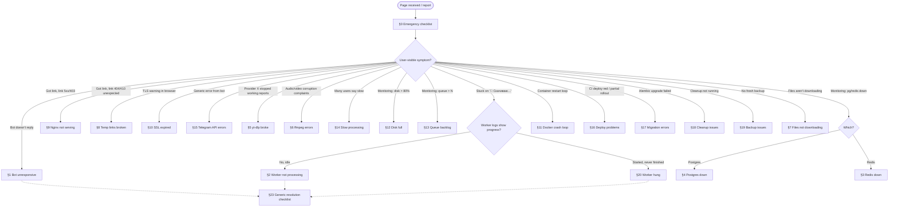

# 24 — Runbooks

> Status: Stable
> Audience: on-call, SRE, anyone paged at 03:00
> Companion docs:
> [`14-logging-observability.md`](14-logging-observability.md) — log events,
> [`15-healthchecks.md`](15-healthchecks.md) — endpoints,
> [`22-backup-restore.md`](22-backup-restore.md) — backup procedures,
> [`23-cleanup-retention.md`](23-cleanup-retention.md) — cleanup,
> [`31-troubleshooting.md`](31-troubleshooting.md) — user-visible symptoms.

This is the **operational playbook**. Twenty runbooks. Each one
follows the same six-section template — read top-to-bottom, copy
the commands, do not improvise.

> **Rule of three:** if you've restarted the same thing three times
> without progress, you're not debugging — you're waiting. **Stop**,
> read the **last** 400 log lines, and pick the right runbook.

---

## §0 — EMERGENCY CHECKLIST (first 5 minutes)

Run **in this order**. Every line is a single shell command. Do not
skip lines.

```bash
# 1) Identify which host you're on (NL-1 = bot/redis/postgres; NL-2 = worker/nginx/api)
hostname
cat /etc/dwtgbot-host 2>/dev/null || echo "NO HOST TAG — check manually"

# 2) Snapshot service status on BOTH stacks (don't trust one host's view)
cd /opt/dwtgbot
ls deploy/nl1/docker-compose.yml >/dev/null 2>&1 \
  && docker compose -f deploy/nl1/docker-compose.yml ps
ls deploy/nl2/docker-compose.yml >/dev/null 2>&1 \
  && docker compose -f deploy/nl2/docker-compose.yml ps

# 3) Public health from outside the stack
curl -fsS --max-time 5 https://media.example.com/healthz \
  || echo "PUBLIC HEALTHZ FAILED"

# 4) Internal readiness
docker exec dwtgbot_api curl -fsS --max-time 5 http://localhost:8080/readyz \
  2>/dev/null || echo "INTERNAL READYZ FAILED"

# 5) Disk pressure on both hosts
df -h / /var/lib/docker /var/lib/dwtgbot 2>/dev/null

# 6) Redis + Postgres pulse
docker exec dwtgbot_redis redis-cli -a "$REDIS_PASSWORD" ping 2>/dev/null \
  || echo "REDIS NO PONG"
docker exec dwtgbot_postgres pg_isready -U dwtgbot -d dwtgbot 2>/dev/null \
  || echo "POSTGRES NOT READY"

# 7) Last 5 minutes of ERROR logs across all containers
for stack in nl1 nl2; do
  test -f deploy/${stack}/docker-compose.yml \
    && docker compose -f deploy/${stack}/docker-compose.yml logs --since=5m --no-color 2>/dev/null \
        | jq -c 'select(.level=="error")' 2>/dev/null | head -30
done
```

After §0 you should know:

- which host owns the symptom (NL-1 or NL-2);
- which container is unhealthy (or none);
- whether disk / Redis / Postgres are alive;
- whether public TLS / DNS / nginx routing works;
- the first ERROR-class log line (the cause is usually there).

**Now jump to the right runbook below.** Do not start fixes until
you have these seven facts.

---

## §0.1 — Triage flowchart



When in doubt: §0 → identify host → pick a runbook → run §23
checklist after the fix.

---

## §0.2 — First-response toolbox

The exact commands you will type 100× this year. Memorize.

```bash
# Pick your stack (assumes repo at /opt/dwtgbot)
cd /opt/dwtgbot
NL1='docker compose -f deploy/nl1/docker-compose.yml'
NL2='docker compose -f deploy/nl2/docker-compose.yml'

# Status
$NL1 ps
$NL2 ps
bash deploy/scripts/healthcheck.sh                    # auto-detects nl1/nl2

# Logs (last 200 lines, follow)
$NL1 logs -f --tail=200 bot
$NL1 logs -f --tail=200 api
$NL2 logs -f --tail=200 worker
$NL2 logs -f --tail=200 nginx
$NL2 logs -f --tail=200 cleanup

# JSON-filter logs (errors only)
$NL1 logs --no-color --since=10m bot \
  | jq -c 'select(.level=="error")'

# Filter by request_id / job_id
$NL2 logs --no-color --since=1h worker \
  | jq -c 'select(.request_id == "a1b2c3d4")'
$NL2 logs --no-color --since=1h worker \
  | jq -c 'select(.job_id == "j_xxx")'

# DB / Redis quick-poke
docker exec -it dwtgbot_postgres psql -U dwtgbot -d dwtgbot
docker exec -it dwtgbot_redis redis-cli -a "$REDIS_PASSWORD"

# Public + internal health
curl -fsS https://media.example.com/healthz
curl -fsS http://api:8080/readyz                      # from inside the NL-2 stack
```

**Convention**: every runbook below assumes you've SSH'd into the
**right** host. Wrong host → you can't see the affected stack →
wasted 10 minutes.

---

## §0.3 — Where things live

| Concern | Host | Container | Volume / path |
|---|---|---|---|
| Telegram bot polling | NL-1 | `dwtgbot_bot` | — |
| Internal API + healthchecks | NL-1 | `dwtgbot_api` | — |
| Postgres | NL-1 | `dwtgbot_postgres` | `dwtgbot_postgres_data` (`/var/lib/postgresql/data`) |
| Redis (queue) | NL-1 | `dwtgbot_redis` | `dwtgbot_redis_data` (`/data`) |
| Backups | NL-1 | `dwtgbot_backup` | `/var/backups/dwtgbot/` |
| Worker (downloads) | NL-2 | `dwtgbot_worker` | `/var/lib/dwtgbot/storage` |
| Nginx + Certbot | NL-2 | `dwtgbot_nginx`, `dwtgbot_certbot` | `dwtgbot_letsencrypt` |
| Cleanup cron | NL-2 | `dwtgbot_cleanup` | `/var/lib/dwtgbot/storage` |
| Public temp links | NL-2 | `dwtgbot_api` (behind nginx) | `/var/lib/dwtgbot/storage/links/` |

All env files: `deploy/nl{1,2}/.env`. Never edit on the live host
without committing the same change to the repo.

---

## §1 — Bot is unresponsive (no replies in Telegram)

### 1.1 Symptoms

- Users say `/start` returns nothing for ≥ 1 minute.
- `bot` container shows no recent activity in logs.
- `bot_unhandled_update` events present but no replies.

### 1.2 Likely causes

| Cause | Signal |
|---|---|
| Container down / restarting | `ps` shows `Restarting` or `Exited` |
| Telegram egress blocked / DNS broken | `httpx` errors mentioning `api.telegram.org` |
| `BOT_TOKEN` invalid (rotated by mistake, typo) | `Unauthorized` (HTTP 401) on every call |
| Postgres unavailable | `cannot connect to "postgres"` at startup |
| Redis unavailable | enqueue fails; `link_analysis_unexpected_error` in logs |
| `getUpdates` long-poll deadlock | bot up + healthy but logs stop at one update |

### 1.3 Quick diagnosis

```bash
NL1='docker compose -f deploy/nl1/docker-compose.yml'
$NL1 ps bot
$NL1 logs --tail=400 --no-color bot | tail -60
docker exec dwtgbot_bot curl -fsS --max-time 5 https://api.telegram.org/bot${BOT_TOKEN}/getMe
docker exec dwtgbot_bot pgrep -af 'app.main_bot|python'
docker inspect dwtgbot_bot -f '{{.State.Status}} {{.RestartCount}} OOM={{.State.OOMKilled}}'
```

### 1.4 Step-by-step fix

1. **Container down** → `$NL1 up -d bot`. If it crash-loops, read
   `--tail=400` for the failing startup line; cause is usually an
   env or import error → §16 if introduced by a deploy.
2. **Egress blocked / DNS broken** → from inside the container:
   `curl -fsS https://api.telegram.org && nslookup api.telegram.org`.
   Restore DNS (`/etc/resolv.conf`) or firewall rule.
3. **Bad token** → rotate via BotFather → update
   `deploy/nl1/.env::BOT_TOKEN` → `$NL1 up -d bot`.
4. **Dependency outage** → §3 (Redis) / §4 (Postgres).
5. **Long-poll deadlock** (rare): logs flat-line on one update;
   `$NL1 restart bot`; file an issue with the offending update id.

### 1.5 Verify

```bash
bash deploy/scripts/healthcheck.sh nl1                       # all green
docker exec dwtgbot_bot curl -fsS https://api.telegram.org/bot${BOT_TOKEN}/getMe \
  | jq '.ok'                                                 # true
# Manual: DM the bot /start → it answers within 2s.
```

### 1.6 Prevent

- Add a synthetic monitor that DMs the bot every 5 min and alerts
  on no-reply within 30s.
- Token rotation runbook in your team's password manager.
- Resource limits in compose (`mem_limit`, `pids_limit`) so OOM
  doesn't silently kill the long-poll loop.
- See [`15-healthchecks.md`](15-healthchecks.md) for the bot
  liveness probe contract.

---

## §2 — Worker is not processing jobs (queue idle)

### 2.1 Symptoms

- Users see "🔄 Скачиваю..." but progress never starts.
- `download_jobs.status='queued'` count grows; `running` stays low/0.
- No `worker_job_done` events in the last few minutes.

### 2.2 Likely causes

| Cause | Signal |
|---|---|
| Worker container exited / restarting | `ps` shows not running; `worker_stopped` |
| Worker can't reach Redis | `worker_started` then `ConnectionError` to Redis |
| Worker can't reach Postgres | `cannot connect to "postgres"` from worker logs |
| Disk full on NL-2 | `OSError: [Errno 28] No space left on device` |
| `ffmpeg` / `yt-dlp` missing in image | `FileNotFoundError: ffmpeg` |
| Worker hung on a single bad job | same `job_id` repeats; see §20 |
| `MAX_PARALLEL_DOWNLOADS=0` set by mistake | worker boots but doesn't pick anything up |

### 2.3 Quick diagnosis

```bash
NL2='docker compose -f deploy/nl2/docker-compose.yml'
$NL2 ps worker
$NL2 logs --tail=400 --no-color worker | tail -60
docker exec dwtgbot_worker pgrep -af 'arq|app.main_worker'

# Queue depth (Redis)
docker exec dwtgbot_redis redis-cli -a "$REDIS_PASSWORD" \
  ZCARD arq:queue
docker exec dwtgbot_redis redis-cli -a "$REDIS_PASSWORD" \
  KEYS 'arq:job:*' | wc -l

# DB-side queue
docker exec -it dwtgbot_postgres psql -U dwtgbot -d dwtgbot -c \
  "SELECT status, count(*) FROM download_jobs GROUP BY 1;"
```

### 2.4 Step-by-step fix

1. **Container down** → `$NL2 up -d worker`. If crash-loops, read
   `--tail=400` for the cause.
2. **Connectivity to Redis** → from inside the worker:
   `docker exec dwtgbot_worker python -c "import redis; r=redis.Redis.from_url('$REDIS_URL'); print(r.ping())"`.
   Fix `REDIS_URL` / network → §3 if Redis itself is down.
3. **Connectivity to Postgres** → likewise; §4 if down.
4. **Disk full** → §12.
5. **Image missing tools** → `docker exec dwtgbot_worker which yt-dlp ffmpeg`.
   If missing → recent image regression; roll back image tag in
   `deploy/nl2/.env::WORKER_IMAGE` and `$NL2 up -d worker`.
6. **`MAX_PARALLEL_DOWNLOADS` misconfigured** → fix in
   `deploy/nl2/.env`; `$NL2 up -d worker`.
7. **Single bad job** → §20.

### 2.5 Verify

```bash
$NL2 logs --since=2m worker | grep -c worker_job_done            # > 0
docker exec dwtgbot_redis redis-cli -a "$REDIS_PASSWORD" ZCARD arq:queue
# Manual: submit a fresh URL via Telegram → completes within expected time.
```

### 2.6 Prevent

- Liveness/readiness probes for the worker that fail when the arq
  pool is not consuming.
- Alert on `worker_job_done` rate dropping to 0 for > 5 min while
  `arq:queue` ZCARD > 0.
- Image base test in CI: `docker run … which yt-dlp ffmpeg`.
- Bound `MAX_PARALLEL_DOWNLOADS` in `Settings` (`ge=1`).
- See [`28-` §13](28-implementation-playbook.md#13-playbook-changing-queue--worker-behaviour)
  for the queue contract.

---

## §3 — Redis is unreachable

### 3.1 Symptoms

- Bot logs: `link_analysis_unexpected_error` or `ConnectionError` to
  Redis when enqueueing.
- Worker idle even though jobs are queued in Postgres.
- `/readyz` reports `redis: fail`.

### 3.2 Likely causes

| Cause | Signal |
|---|---|
| Container down | `ps` shows `Exited` or `Restarting` |
| AOF/RDB write failure | `Background saving error` in Redis logs |
| Disk full on NL-1 | `df -h` near 100% |
| Wrong password from NL-2 worker | `WRONGPASS` in worker logs |
| Wrong `REDIS_URL` after deploy | `nodename nor servname provided` |
| Hit `maxmemory` with `noeviction` | `OOM command not allowed` in worker logs |

### 3.3 Quick diagnosis

```bash
NL1='docker compose -f deploy/nl1/docker-compose.yml'
$NL1 ps redis
$NL1 logs --tail=200 --no-color redis | tail -40
docker exec dwtgbot_redis redis-cli -a "$REDIS_PASSWORD" ping
docker exec dwtgbot_redis redis-cli -a "$REDIS_PASSWORD" info clients | head -10
docker exec dwtgbot_redis redis-cli -a "$REDIS_PASSWORD" info memory \
  | grep -E 'used_memory_human|maxmemory_human|mem_fragmentation_ratio'
df -h /var/lib/docker/volumes/dwtgbot_redis_data/_data
```

### 3.4 Step-by-step fix

1. **Container down** → `$NL1 up -d redis`. If crash-loops, read
   `--tail=400 redis` and check disk first.
2. **Disk full** → free space (rotate logs, prune old backups);
   restart redis.
3. **AOF corrupted** (rare):
   ```bash
   $NL1 stop redis
   docker run --rm -v dwtgbot_redis_data:/data redis:7 \
     redis-check-aof --fix /data/appendonly.aof
   $NL1 up -d redis
   ```
   If unrecoverable: `mv /data/appendonly.aof /data/appendonly.aof.broken`,
   restart. Accept loss of in-flight queue (users will re-enqueue).
4. **Wrong password** → align `REDIS_PASSWORD` in
   `deploy/nl1/.env` and `deploy/nl2/.env`; `$NL1 up -d redis`,
   `$NL2 up -d worker bot api`.
5. **`OOM command not allowed`** → raise `maxmemory` or set
   `maxmemory-policy allkeys-lru` (Redis is queue + cache;
   eviction is acceptable for cache keys, NOT for `arq:*` keys —
   prefer raising memory).

### 3.5 Verify

```bash
docker exec dwtgbot_redis redis-cli -a "$REDIS_PASSWORD" ping       # PONG
docker exec dwtgbot_redis redis-cli -a "$REDIS_PASSWORD" info replication | head
bash deploy/scripts/healthcheck.sh nl1                              # all green
# Manual: submit URL via bot; worker logs show `worker_job_done`.
```

### 3.6 Prevent

- Alert on Redis `info memory.used_memory_pct > 80%`.
- Alert on `info persistence.rdb_last_bgsave_status != ok`.
- Compose `restart: always` for redis.
- AOF + RDB both enabled; daily backup of `appendonly.aof`.
- Don't use `KEYS *` in production scripts (blocks loop).

---

## §4 — PostgreSQL is unreachable

### 4.1 Symptoms

- `/readyz` reports `postgres: fail`.
- Bot/api error: `connection refused` or `password authentication failed`.
- `pg_isready` returns non-zero.

### 4.2 Likely causes

| Cause | Signal |
|---|---|
| Container crashed / OOM-killed | `Exited` in `ps`; `OOMKilled=true` in `inspect` |
| Disk full | `df` near 100%; `pg_isready` fails |
| Corrupted data dir | startup logs say "could not find pg_xact" or "PANIC" |
| `POSTGRES_PASSWORD` misaligned across NL-1/NL-2 | `password authentication failed` in bot/api logs |
| Too many connections | `FATAL: sorry, too many clients already` |
| `pg_hba.conf` mismatch after upgrade | `no pg_hba.conf entry` for `<role>@<host>` |

### 4.3 Quick diagnosis

```bash
NL1='docker compose -f deploy/nl1/docker-compose.yml'
$NL1 ps postgres
$NL1 logs --tail=400 --no-color postgres | tail -60
docker exec dwtgbot_postgres pg_isready -U dwtgbot -d dwtgbot
docker inspect dwtgbot_postgres -f '{{.State.OOMKilled}} restarts={{.RestartCount}}'
df -h /var/lib/docker/volumes/dwtgbot_postgres_data/_data
docker exec dwtgbot_postgres psql -U dwtgbot -d dwtgbot -c \
  "SELECT count(*) FROM pg_stat_activity;"
docker exec dwtgbot_postgres psql -U dwtgbot -d dwtgbot -c \
  "SHOW max_connections;"
```

### 4.4 Step-by-step fix

1. **Container down** → `$NL1 up -d postgres`. Wait 10s; `pg_isready` again.
2. **Disk full** → §12. Postgres refuses writes when datadir is full.
3. **OOM-killed** → raise host memory or lower workload (reduce
   `MAX_PARALLEL_DOWNLOADS`, `shared_buffers`).
4. **Bad password** → align `POSTGRES_PASSWORD` in
   `deploy/nl1/.env` AND `deploy/nl2/.env::POSTGRES_URL`;
   `$NL1 up -d postgres`, `$NL2 up -d worker`.
5. **Too many connections** → kill idle connections:
   ```sql
   SELECT pg_terminate_backend(pid)
   FROM pg_stat_activity
   WHERE state='idle in transaction' AND state_change < now() - interval '10 min';
   ```
   Then look for connection leak (usually a service forgetting
   `async with session`).
6. **Corrupted data dir** → STOP. Take a snapshot of the volume.
   Restore from latest dump:
   ```bash
   bash deploy/scripts/restore.sh /var/backups/dwtgbot/<latest>.sql.gz
   ```
   See [`22-backup-restore.md`](22-backup-restore.md). Escalate to
   DBA if loss > RPO.

### 4.5 Verify

```bash
docker exec dwtgbot_postgres pg_isready -U dwtgbot -d dwtgbot       # accepting connections
docker exec dwtgbot_postgres psql -U dwtgbot -d dwtgbot -c \
  "SELECT count(*) FROM download_jobs LIMIT 1;"                     # query works
bash deploy/scripts/healthcheck.sh nl1                              # all green
```

### 4.6 Prevent

- Daily backups + off-host shipping (§19).
- Alert on `postgres_oom_killed_total > 0`.
- Alert on `pg_stat_activity.count > 0.8 * max_connections`.
- Compose `restart: always` for postgres.
- WAL-archive (PITR) for incidents past last full dump.

---

## §5 — yt-dlp stopped working (upstream extractor broken)

### 5.1 Symptoms

- Spike of `<platform>_classified_error` events across one
  platform (most often YouTube or Instagram after a site change).
- Worker logs: `yt_dlp.utils.ExtractorError`, `Unable to extract
  ...`, `Sign in to confirm you're not a bot`.
- Other platforms unaffected.

### 5.2 Likely causes

| Cause | Signal |
|---|---|
| Upstream site HTML / API changed | one platform broken; others fine; pinned yt-dlp version |
| yt-dlp version too old | `Unsupported URL` for URLs that worked yesterday |
| Cookies expired (auth-gated platform) | `Login required to access` / 403 |
| Geo / IP block tightened | `GeoRestrictedError` or `Sign in to confirm you're not a bot` from NL-2 IP |
| Rate-limited by upstream | bursts of `HTTP Error 429` |

### 5.3 Quick diagnosis

```bash
NL2='docker compose -f deploy/nl2/docker-compose.yml'
$NL2 logs --since=30m --no-color worker \
  | jq -c 'select(.event | test("classified_error"))' \
  | jq -c '{platform: .provider, error_class, ts: .timestamp}' \
  | sort | uniq -c | sort -rn | head

# Pinned yt-dlp version inside the worker
docker exec dwtgbot_worker yt-dlp --version

# Confirm against latest upstream release
curl -fsS https://pypi.org/pypi/yt-dlp/json | jq -r '.info.version'

# Reproduce on a real URL inside the container
docker exec dwtgbot_worker yt-dlp -j --no-warnings 'https://www.youtube.com/watch?v=<id>' \
  2>&1 | head -30
```

### 5.4 Step-by-step fix

1. **Confirm scope** — one platform, not all? If all platforms are
   broken, the worker itself is unhealthy → §2.
2. **Bump yt-dlp** if you're behind:
   - Edit `app/requirements.txt` or worker Dockerfile
     (`yt-dlp==<latest>`).
   - Build + push image; deploy via §16 (don't `pip install` in a
     live container — drift).
   - For an emergency hotfix only: `docker exec dwtgbot_worker
     pip install -U yt-dlp` AND open a same-day PR with the pin.
3. **Site change requires upstream fix** → temporarily disable the
   platform:
   - Set `PROVIDER_<X>_DISABLED=1` in `deploy/nl2/.env`;
     `$NL2 up -d worker`.
   - Pin a banner in user channel: "Provider X temporarily
     unavailable while upstream fixes a bug."
   - Watch yt-dlp issue tracker; un-disable when fix lands.
4. **Cookies expired** (Instagram is the canonical case; same shape for any
   future auth-gated provider) → rotate the cookie file on **both** hosts:
   ```bash
   # Export Netscape cookies.txt from a logged-in browser session.
   for HOST in nl1 nl2; do
     scp cookies-instagram.txt "$HOST:/tmp/"
     ssh "$HOST" 'sudo install -o root -g root -m 0640 \
       /tmp/cookies-instagram.txt \
       /srv/dwtgbot/secrets/cookies-instagram.txt && \
       rm /tmp/cookies-instagram.txt'
   done
   # Restart the containers that read the file.
   ssh nl1 'cd <NL1_REPO_PATH>/deploy/nl1 && sudo docker compose restart bot'
   ssh nl2 'cd <NL2_REPO_PATH>/deploy/nl2 && sudo docker compose restart worker'
   ```
   The path is canonical (`/srv/dwtgbot/secrets/cookies-instagram.txt`,
   mode `0640`) because both compose stacks bind-mount
   `/srv/dwtgbot/secrets:/srv/dwtgbot/secrets:ro` into bot/worker.
   `INSTAGRAM_COOKIES_FILE` in the `.env` files points at exactly that path
   and is auto-synced by `deploy_update.sh::ensure_instagram_cookie_env`.
   Confirm the worker actually picked it up:
   ```bash
   docker exec dwtgbot_worker test -f /srv/dwtgbot/secrets/cookies-instagram.txt && echo OK
   docker logs dwtgbot_worker --since 5m | grep -i instagram_cookiefile_missing || echo "no warnings"
   ```
5. **Geo / bot-detection** → consider rotating egress IP (out of
   scope for runbook; ADR required); short-term, surface a
   `UserFacingError("geo_restricted")` so users see a clean
   message — see [`30-` §13.2](30-add-new-provider-guide.md#132-mapping-cheat-sheet).
6. **Rate-limit** → reduce `MAX_PARALLEL_DOWNLOADS`; ensure
   `RetryableError("upstream_5xx")` is raised so arq backoff
   kicks in.

### 5.5 Verify

```bash
docker exec dwtgbot_worker yt-dlp -j --no-warnings '<canonical url for platform>' \
  | jq -r '.id, .title' | head
$NL2 logs --since=5m --no-color worker | jq -c 'select(.event=="<x>_classified_error")' | wc -l
# expected: error count ≈ 0 in the last 5 min
# Manual: submit URL via Telegram; download succeeds.
```

### 5.6 Prevent

- Pin `yt-dlp` exactly in image; weekly CI job opens a PR to bump.
- Alert on `<platform>_classified_error` rate > N/min for 5 min.
- Per-platform kill switch (`PROVIDER_<X>_DISABLED`) wired to
  config so you can disable in one redeploy.
- Quarterly fixture refresh (see [`30-` §16.6](30-add-new-provider-guide.md#166-runnable-test-commands)).

---

## §6 — ffmpeg errors (encoding / extraction failed)

### 6.1 Symptoms

- Worker logs: `ffmpeg exited with code 1`, `Conversion failed`,
  `Output file does not contain any stream`, `moov atom not found`.
- Audio MP3s missing or 0 bytes; merged MP4s fail Telegram preview.
- `<platform>_classified_error` with `error_class=ffmpeg_failed`.

### 6.2 Likely causes

| Cause | Signal |
|---|---|
| Source media truncated mid-download | `moov atom not found`; `Invalid data` |
| Disk full mid-encode | `No space left on device` |
| ffmpeg missing from image | `FileNotFoundError: ffmpeg` |
| Wrong codec request (provider built bad option) | `Unknown encoder 'libxxx'` |
| ffmpeg too old / too new for input | `unrecognized option`, `Conversion failed` |
| ffmpeg subprocess timed out | `subprocess.TimeoutExpired` from `FFmpegRunner` |

### 6.3 Quick diagnosis

```bash
NL2='docker compose -f deploy/nl2/docker-compose.yml'
$NL2 logs --since=30m --no-color worker \
  | jq -c 'select(.event=="<provider>_classified_error" and .error_class=="ffmpeg_failed")' \
  | head

docker exec dwtgbot_worker ffmpeg -version | head -3
docker exec dwtgbot_worker which ffmpeg
df -h /var/lib/dwtgbot/storage

# Reproduce on a known-bad sample (from a failed job's target_dir)
docker exec dwtgbot_worker bash -lc \
  'ffmpeg -hide_banner -nostdin -i /var/lib/dwtgbot/storage/jobs/<job_id>/input.mp4 -f null - 2>&1 | tail -20'
```

### 6.4 Step-by-step fix

1. **Disk full** → §12 first; ffmpeg often fails as a side-effect.
2. **ffmpeg missing** → image regression; roll back image tag (§16).
3. **Truncated source** → re-trigger the download (user re-submit);
   if it keeps happening on one platform, →§5 (yt-dlp / upstream).
4. **Bad codec request** → check the provider's `download` for the
   `format_spec` / postprocessor used; align with installed ffmpeg
   capabilities (`ffmpeg -encoders | grep <codec>`).
5. **Version mismatch** → pin the ffmpeg version in the worker
   image; bump cautiously.
6. **Timeout** → increase `FFMPEG_TIMEOUT_S` in `deploy/nl2/.env`
   (default ≈ 300s); investigate why a single conversion exceeds
   it (often a 4K-merge on a long video).

### 6.5 Verify

```bash
docker exec dwtgbot_worker ffmpeg -version | head -1
# Manual: submit a YouTube URL → request audio MP3; result
# arrives, plays in Telegram, MIME `audio/mpeg`, size > 0.
$NL2 logs --since=5m --no-color worker \
  | jq -c 'select(.event=="<x>_classified_error" and .error_class=="ffmpeg_failed")' | wc -l   # 0
```

### 6.6 Prevent

- Pin ffmpeg version in worker Dockerfile; smoke-test in CI
  (`ffmpeg -version`).
- Wrap every `FFmpegRunner` invocation with `asyncio.wait_for`.
- Default `FFMPEG_TIMEOUT_S` to a safe upper bound; expose via env.
- Reject upfront in `<Platform>Provider.get_info` when
  `duration_sec > MAX_DURATION_S` to avoid encoding multi-hour
  videos in the first place.

---

## §7 — Files aren't downloading

### 7.1 Symptoms

- User sees "Скачиваю…" then "Готово ✓" but no file/link arrives.
- `worker_job_done` events present but `download_jobs.delivered_at`
  stays NULL.
- `DownloadResult.files=()` warnings in logs.

### 7.2 Likely causes

| Cause | Signal |
|---|---|
| Provider returned empty result silently | `DownloadError("empty_result")` in logs |
| Disk full mid-download | `OSError: [Errno 28]` |
| Download succeeded but delivery failed | `worker_delivery_failed`; Telegram 413 (file too large for Telegram); temp link not created |
| Worker wrote outside `target_dir` (cleanup nuked it) | files exist in `/tmp` instead of `STORAGE_PATH/jobs/<id>/` |
| `STORAGE_PATH` permission issue | `PermissionError` on write |
| Telegram API rejected upload (size/format) | `Request Entity Too Large` (413), `BadRequest: PHOTO_INVALID_DIMENSIONS` |

### 7.3 Quick diagnosis

```bash
NL2='docker compose -f deploy/nl2/docker-compose.yml'
JOB_ID=<id>
$NL2 logs --since=1h --no-color worker \
  | jq -c "select(.job_id == \"$JOB_ID\")" | tail -30

# Inspect the job's target dir
ls -la /var/lib/dwtgbot/storage/jobs/$JOB_ID/ 2>/dev/null

# DB row
docker exec -it dwtgbot_postgres psql -U dwtgbot -d dwtgbot -c \
  "SELECT id, status, file_size_bytes, error_message, delivered_at
   FROM download_jobs WHERE id='$JOB_ID';"
```

### 7.4 Step-by-step fix

1. **Empty result** (`DownloadError("empty_result")`) →
   - re-run with the same URL+option to see if reproducible;
   - if reproducible → provider bug, file an issue and disable
     the option/platform if it spreads;
   - if not → upstream flake, tell user to retry.
2. **Disk full** → §12.
3. **Permission errors** → ensure `/var/lib/dwtgbot/storage`
   is owned by the worker UID:
   `sudo chown -R 1000:1000 /var/lib/dwtgbot/storage` (use the UID
   from the worker Dockerfile).
4. **Telegram 413 on direct send** → expected for files > 50 MB
   (Telegram limit). Delivery service should fall back to a temp
   link; if it doesn't, the bug is in `delivery.py` — file an
   issue.
5. **`PHOTO_INVALID_DIMENSIONS` etc.** — provider returned wrong
   `MediaKind`; check the provider's `download` `kind` selection
   (matches §10 of [`30-`](30-add-new-provider-guide.md#10-download-execution-rules)).
6. **Files outside `target_dir`** → provider violated P11; fix
   provider code (always under `target_dir`, validated with
   `ensure_within`).

### 7.5 Verify

```bash
# After re-submit, the new job should reach delivered_at NOT NULL
docker exec -it dwtgbot_postgres psql -U dwtgbot -d dwtgbot -c \
  "SELECT id, status, delivered_at FROM download_jobs ORDER BY created_at DESC LIMIT 5;"
$NL2 logs --since=2m worker | grep -c worker_job_done                  # > 0
$NL2 logs --since=2m worker | grep -c worker_delivery_failed           # 0
# Manual: submit URL, file or link arrives.
```

### 7.6 Prevent

- Provider unit tests must include "empty result" scenario per
  [`30-` §16.2 #14](30-add-new-provider-guide.md#162-scenarios-that-must-be-covered).
- Alert on `DownloadResult.files=()` rate > N/hour.
- Delivery service gate: never mark `delivered_at` until the user
  actually received the file (Telegram `message_id` returned) or
  temp link row was inserted.
- Storage permissions checked by an init-container or healthcheck.

---

## §8 — Temp links not working

### 8.1 Symptoms

- Tap on `https://media.example.com/d/<token>` returns 404 / 410 /
  403 unexpectedly.
- Logs: `temp_link_not_found`, `temp_link_expired`,
  `temp_link_path_invalid`.
- Users complain links from "5 minutes ago" don't work.

### 8.2 Likely causes

| HTTP code | Cause |
|---|---|
| `404 Not Found` | unknown token; either guess or row deleted |
| `410 Gone` | expired (`expires_at < now()`) or download cap reached (`downloads_count >= max_downloads`) — expected behaviour |
| `403 Forbidden` | `temp_link_path_invalid` — `file_path` outside `STORAGE_PATH`; possible attacker, possible bad row |
| `502 Bad Gateway` | API container down — §9 |
| Token works in browser, fails in Telegram preview | Telegram preview bot fetches with a different UA; rare |

### 8.3 Quick diagnosis

```bash
NL2='docker compose -f deploy/nl2/docker-compose.yml'
TOKEN=<token>

$NL2 logs --since=30m --no-color api \
  | jq -c "select(.token_short == \"${TOKEN:0:8}\")" | head

docker exec -it dwtgbot_postgres psql -U dwtgbot -d dwtgbot -c \
  "SELECT id, file_path, expires_at, max_downloads, downloads_count, is_active
   FROM temp_links WHERE token='$TOKEN';"

curl -I "https://media.example.com/d/$TOKEN" --max-time 5
```

### 8.4 Step-by-step fix

1. **404** → token never existed or was deleted; nothing to fix
   (security feature). If a row should exist, check whether
   cleanup deleted it prematurely (§18).
2. **410 expected** → user message in bot is correct; nothing to do.
   If unexpected, check `TEMP_LINK_TTL_SECONDS` /
   `TEMP_LINK_MAX_DOWNLOADS` in `deploy/nl2/.env`.
3. **403** → row's `file_path` is suspicious. Mark inactive:
   ```sql
   UPDATE temp_links SET is_active=false WHERE id=<id>;
   ```
   Investigate which provider produced the path; fix violation of
   `ensure_within` (P11).
4. **Token works on disk, fails via nginx** → check nginx
   `internal;` location for `/links/`; the API must respond with
   `X-Accel-Redirect: /links/...` and nginx must serve from
   `/var/lib/dwtgbot/storage/links/`. Logs: `nginx access` for the
   token URL + `internal redirect` line.

### 8.5 Verify

```bash
# Insert a known-good token (if needed) by submitting a fresh URL via bot
TOKEN=<fresh token from bot reply>
curl -I "https://media.example.com/d/$TOKEN" | head -1               # HTTP/2 200
curl -fsS "https://media.example.com/d/$TOKEN" -o /tmp/check.bin \
  && file /tmp/check.bin
docker exec -it dwtgbot_postgres psql -U dwtgbot -d dwtgbot -c \
  "SELECT downloads_count FROM temp_links WHERE token='$TOKEN';"     # incremented
```

### 8.6 Prevent

- Always validate file paths via `ensure_within(STORAGE_PATH, path)`
  in providers and delivery (P11).
- Default `TEMP_LINK_TTL_SECONDS` in `Settings`; never `None`.
- Cleanup runs only on `expires_at < now() - grace` so a tiny
  clock drift doesn't 410 fresh links.
- Daily spot-check: take 5 fresh tokens, curl them, log the result.

---

## §9 — Nginx not serving files (502 / 504 / upstream errors)

### 9.1 Symptoms

- Browser sees nginx error page (white page with "502 Bad Gateway"
  etc.).
- `media.example.com/healthz` fails or is slow.
- Nginx access log shows the upstream (api) returning 5xx.

### 9.2 Likely causes

| HTTP code | Cause |
|---|---|
| `502 Bad Gateway` | API container down or unhealthy; nginx upstream resolution failed |
| `504 Gateway Timeout` | API responding slowly (DB issue?) or huge file + low timeouts |
| `503 Service Unavailable` | Rate-limit zone exhausted; or API in `:starting` state |
| `499` (in nginx logs) | Client closed connection — usually mobile network drop |
| `400 Bad Request` (browser) | nginx `client_max_body_size` too small for upload (rare for bot) |
| `nginx: [emerg] ... config test failed` | bad config after deploy |

### 9.3 Quick diagnosis

```bash
NL2='docker compose -f deploy/nl2/docker-compose.yml'
$NL2 ps nginx api
$NL2 logs --tail=200 --no-color nginx | tail -40
$NL2 logs --tail=200 --no-color api   | tail -40

docker exec dwtgbot_nginx nginx -t
docker exec dwtgbot_nginx curl -fsS http://api:8080/readyz --max-time 3 \
  || echo "API unreachable from nginx container"

# Public health
curl -fsS --max-time 5 https://media.example.com/healthz
# Internal health from inside api
docker exec dwtgbot_api curl -fsS http://localhost:8080/readyz --max-time 3
```

### 9.4 Step-by-step fix

1. **API container down** → `$NL2 up -d api`. If crash-loops, read
   `--tail=400 api`.
2. **Slow API (504)** → `/readyz` slow → check Postgres latency
   (§4); raise `proxy_read_timeout` only if you're intentionally
   serving very large files.
3. **Bad config** → fix in repo, deploy via §16. **Never** edit
   `nginx.conf` on the live host.
4. **Rate-limit zone exhausted** → tune `limit_req_zone` rates in
   `deploy/nginx/nginx.conf`; deploy.
5. **Network policy / DNS** → from inside nginx container:
   `getent hosts api`. Should resolve to the compose network IP.
   If not — recreate the network: `$NL2 down && $NL2 up -d`.

### 9.5 Verify

```bash
docker exec dwtgbot_nginx nginx -t                                   # syntax ok
$NL2 logs --tail=20 nginx | grep -E ' (502|503|504) '                # empty
curl -fsS --max-time 5 https://media.example.com/healthz             # ok
curl -I --max-time 5 https://media.example.com/d/<active-token>      # 200
```

### 9.6 Prevent

- Health-check on the upstream (`api:8080/readyz`) defined in
  nginx; serve a static maintenance page when down rather than
  502.
- CI smoke test: build nginx image → `nginx -t` against the real
  config.
- Alert on nginx `5xx` rate > N/min.
- `proxy_read_timeout` aligned with the largest expected file
  fetch (default safe enough).

---

## §10 — SSL certificate expired or about to expire

### 10.1 Symptoms

- Browser shows TLS warning: `NET::ERR_CERT_DATE_INVALID`.
- Monitoring alert "cert expires in N days".
- `certbot` container logs show renewal failure.

### 10.2 Likely causes

| Cause | Signal |
|---|---|
| Renewal job failed silently | `certbot` logs show last attempt failed |
| HTTP-01 challenge failed (port 80 blocked) | `Failed authorization procedure` |
| DNS A/AAAA changed | challenge resolves to wrong IP |
| Rate-limit hit (Let's Encrypt) | `too many certificates already issued` |
| Cert files removed (manual cleanup) | nginx logs say `cannot open certificate file` |

### 10.3 Quick diagnosis

```bash
NL2='docker compose -f deploy/nl2/docker-compose.yml'
$NL2 ps certbot
$NL2 logs --tail=200 --no-color certbot | tail -40

# Cert expiry from outside
echo | openssl s_client -connect media.example.com:443 \
   -servername media.example.com 2>/dev/null \
  | openssl x509 -noout -dates -subject

# Cert files inside the volume
docker exec dwtgbot_nginx ls -la /etc/letsencrypt/live/media.example.com/

# Is :80 publicly reachable?
curl -fsS --max-time 5 http://media.example.com/.well-known/acme-challenge/test \
  ; echo "exit $?"
```

### 10.4 Step-by-step fix

1. **Renewal**:
   ```bash
   bash deploy/scripts/certbot_init.sh   # idempotent: re-issues + reloads nginx
   ```
2. **HTTP-01 failing** → ensure port 80 is open in firewall and
   nginx serves `/.well-known/acme-challenge/`. Test with the
   `curl` above.
3. **DNS issue** → confirm `dig +short A media.example.com`
   matches the NL-2 public IP.
4. **Rate-limit hit** → wait per Let's Encrypt limits; use staging
   server during testing (`--staging`).
5. **Files missing** → restore from backup of
   `/etc/letsencrypt/`; if no backup, re-issue (next renewal).

### 10.5 Verify

```bash
echo | openssl s_client -connect media.example.com:443 \
   -servername media.example.com 2>/dev/null \
  | openssl x509 -noout -dates
# notAfter should be ≥ 60 days out

curl -fsS https://media.example.com/healthz                          # 200
docker exec dwtgbot_nginx nginx -t                                   # ok
```

### 10.6 Prevent

- `certbot` container with `--keep-until-expiring` runs daily.
- Alert at 30 / 14 / 7 / 1 days to expiry.
- Off-host backup of `/etc/letsencrypt/` weekly (it's tiny).
- DNS records under config management (Terraform / similar).

---

## §11 — Docker containers crashing / restart loop

### 11.1 Symptoms

- `docker compose ps` shows `Restarting` or rapidly increasing
  `RestartCount` for one or more services.
- `docker events` shows repeated `start`/`die` for the same
  container.
- Service flaps between healthy/unhealthy.

### 11.2 Likely causes

| Cause | Signal |
|---|---|
| OOM-killed | `docker inspect <c> -f '{{.State.OOMKilled}}'` returns `true` |
| Bad env / missing required var | startup logs say `KeyError`, `pydantic ValidationError` |
| Wrong image tag (broken build promoted) | image hash differs from CI artifact for the deployed sha |
| Failing healthcheck flaps | logs say `unhealthy`; container stays alive but restarts |
| Disk full | `OSError: [Errno 28]` at startup |
| Mount point missing on host | `bind source path does not exist` |
| Permission denied on volume | `PermissionError` or `chown: Operation not permitted` |

### 11.3 Quick diagnosis

```bash
NL=nl2; SVC=worker
NLC="docker compose -f deploy/${NL}/docker-compose.yml"
$NLC ps
$NLC logs --tail=400 --no-color $SVC | tail -80

CID=$(docker ps -aq --filter "name=dwtgbot_${SVC}")
docker inspect "$CID" -f \
  'restarts={{.RestartCount}} status={{.State.Status}} oom={{.State.OOMKilled}} exit={{.State.ExitCode}}'
docker events --since 10m --until now --filter "container=dwtgbot_${SVC}" | head
```

### 11.4 Step-by-step fix

1. **OOM** → `$NLC up -d --no-deps $SVC` to confirm; raise
   `mem_limit` in compose; investigate the leak (worker holding
   buffers? api keeping large file in memory?).
2. **Missing env** → diff `deploy/<stack>/.env` vs
   `docs/13-config-and-env.md`; add the missing key; redeploy.
3. **Wrong image tag** → confirm deployed tag:
   `docker inspect "$CID" -f '{{.Image}}'`; compare against the
   CI artifact for the merged sha. Roll back via §16.
4. **Bind-mount missing on host** →
   `mkdir -p /var/lib/dwtgbot/storage` (or whatever the path is);
   fix ownership; restart.
5. **Disk full** → §12.
6. **Failing healthcheck** → run the healthcheck command manually
   inside the container; fix the upstream that the check probes.

### 11.5 Verify

```bash
$NLC ps                                                              # all Up; RestartCount stable
docker inspect "$CID" -f 'uptime={{.State.StartedAt}} restarts={{.RestartCount}}'
$NLC logs --since=5m $SVC | grep -ciE 'error|exception'              # low / 0
bash deploy/scripts/healthcheck.sh                                   # all green
```

### 11.6 Prevent

- Set `restart: on-failure:5` (not `always`) for services where a
  rapid restart loop should self-stop and page.
- `mem_limit`, `pids_limit`, `cpus` set in compose for each service.
- CI test that compose stack starts and stays up for ≥ 60s.
- Alert on `RestartCount` change > 0 in 5 min.

---

## §12 — Disk full (NL-2 storage or NL-1 backup)

### 12.1 Symptoms

- Worker fails with `OSError: [Errno 28] No space left on device`.
- Postgres refuses writes, returns `could not extend file`.
- Backup script fails to write the dump.
- Monitoring alert: filesystem > 80%.

### 12.2 Likely causes

| Cause | Signal |
|---|---|
| `STORAGE_PATH` (NL-2) full of stale jobs | `du -sh /var/lib/dwtgbot/storage/jobs/* \| sort -h` shows giants |
| Cleanup container failed silently | §18 |
| Backup retention too long on NL-1 | `du -sh /var/backups/dwtgbot/*` |
| Docker logs unbounded | `du -sh /var/lib/docker/containers/*/*-json.log` |
| Postgres WAL piling up (archive failing) | `du -sh /var/lib/docker/volumes/dwtgbot_postgres_data` growing fast |

### 12.3 Quick diagnosis

```bash
df -h / /var/lib/docker /var/lib/dwtgbot 2>/dev/null
du -sh /var/lib/dwtgbot/storage/{jobs,links,tmp} 2>/dev/null
du -sh /var/lib/dwtgbot/storage/jobs/* 2>/dev/null | sort -h | tail -20
du -sh /var/backups/dwtgbot/* 2>/dev/null | sort -h | tail -20
du -sh /var/lib/docker/containers/*/*-json.log 2>/dev/null | sort -h | tail -10
```

### 12.4 Step-by-step fix

(Least destructive first. Do not delete anything until you've
identified the dominant directory.)

1. **Manual cleanup**:
   ```bash
   bash deploy/scripts/cleanup.sh
   ```
2. **Tighten knobs** in `deploy/nl2/.env`, redeploy:
   - `TEMP_LINK_TTL_SECONDS=43200` (12 h)
   - `TEMP_LINK_MAX_DOWNLOADS=3`
   - `MAX_FILE_SIZE_MB=1024`
3. **Mass-deactivate spent links** (NL-1 psql), then cleanup:
   ```sql
   UPDATE temp_links SET is_active=false
   WHERE expires_at < now() OR downloads_count >= max_downloads;
   ```
4. **Truncate scratch aggressively**:
   ```bash
   TMP_MAX_AGE_HOURS=2 bash deploy/scripts/cleanup.sh
   ```
5. **Old backups** (NL-1):
   ```bash
   find /var/backups/dwtgbot -name '*.sql.gz' -mtime +14 -print -delete
   ```
6. **Docker logs** — set `max-size: 50m, max-file: 3` in
   `/etc/docker/daemon.json`; restart docker (will restart
   containers); rotate now:
   ```bash
   truncate -s 0 /var/lib/docker/containers/*/*-json.log
   ```
7. **Last resort** — extend the volume (LVM grow / cloud disk
   resize); keep this off the critical path for a 03:00 page.

### 12.5 Verify

```bash
df -h /var/lib/dwtgbot /var/backups/dwtgbot 2>/dev/null              # < 70%
$NL2 logs --since=5m worker | grep -c 'No space left'                # 0
# Manual: submit a download → completes.
```

### 12.6 Prevent

- Daily `cleanup.sh` (cron + container).
- Alert on `disk_used > 75%` (warn) and `> 85%` (page).
- `daemon.json`: `log-driver: json-file, log-opts {max-size:50m, max-file:3}`.
- `BACKUP_RETENTION_DAYS` env (default 14) enforced by backup
  script.
- Periodic large-job audit: jobs > 1 GB → tighter `MAX_FILE_SIZE_MB`.

---

## §13 — Queue backlog (too many queued jobs)

### 13.1 Symptoms

- Monitoring: `arq:queue` ZCARD > N (usually > a few hundred).
- Users wait minutes between submission and download start.
- Worker logs show steady `worker_job_done` but new submissions
  outpace throughput.

### 13.2 Likely causes

| Cause | Signal |
|---|---|
| One worker, many users (capacity) | `MAX_PARALLEL_DOWNLOADS` low; queue grows monotonically |
| Worker container constantly retrying a poisoned job | repeated `Retry` logs for one `job_id` (§20) |
| Upstream throttling (yt-dlp 429 cycle) | `RetryableError("upstream_5xx")` spike (§5) |
| Scheduled task storm (e.g., cleanup re-enqueueing) | `cleanup_*` events flooding |
| Abuse / spam (one user submitting hundreds) | `bot_url_submitted` per user_id histogram skewed |

### 13.3 Quick diagnosis

```bash
NL1='docker compose -f deploy/nl1/docker-compose.yml'
NL2='docker compose -f deploy/nl2/docker-compose.yml'

# Queue depth + per-status DB counts
docker exec dwtgbot_redis redis-cli -a "$REDIS_PASSWORD" ZCARD arq:queue
docker exec -it dwtgbot_postgres psql -U dwtgbot -d dwtgbot -c \
  "SELECT status, count(*) FROM download_jobs GROUP BY 1;"

# Throughput in the last 10 min
$NL2 logs --since=10m --no-color worker \
  | jq -c 'select(.event=="worker_job_done")' | wc -l

# Top submitters in the last hour (abuse?)
$NL1 logs --since=1h --no-color bot \
  | jq -r 'select(.event=="bot_url_submitted") | .user_id' \
  | sort | uniq -c | sort -rn | head
```

### 13.4 Step-by-step fix

1. **Capacity** → raise `MAX_PARALLEL_DOWNLOADS` in
   `deploy/nl2/.env`; `$NL2 up -d worker`. Watch CPU + disk +
   bandwidth — don't go higher than the host can sustain.
2. **Poisoned job** → §20.
3. **Upstream throttling** → §5; reduce concurrency to back off
   gracefully.
4. **Task storm from internal task** → identify the producer; pause
   it (env flag or a kill switch in code), redeploy.
5. **Abuse** → temporarily increase per-user rate limit in
   `app/bot/middleware/`; add the offender to a denylist if needed
   (admin command). Document the incident and consider
   permanent-rate-limit tightening.

### 13.5 Verify

```bash
docker exec dwtgbot_redis redis-cli -a "$REDIS_PASSWORD" ZCARD arq:queue   # decreasing
$NL2 logs --since=5m worker | grep -c worker_job_done                      # > 0
# Monitoring: queue depth trending down toward steady state.
```

### 13.6 Prevent

- Per-user rate limit (token bucket in `app/bot/middleware/`).
- Auto-scale alert on `queue_depth` SLO breach.
- Admin command: pause/resume new submissions
  (`SUBMISSIONS_DISABLED=1` env flag, hot-reload via worker
  restart).
- Cap arq job `max_tries` (default 5) so doomed jobs don't dwell.

---

## §14 — Slow processing (jobs take too long)

### 14.1 Symptoms

- `worker_job_done` events with high duration (`duration_ms`
  field).
- Users complain "it used to be faster".
- `download_jobs.completed_at - started_at` p95 increased.

### 14.2 Likely causes

| Cause | Signal |
|---|---|
| Network bandwidth saturated on NL-2 | `iftop`/`nload` show 90%+ usage |
| Disk I/O saturated | `iostat -xm 2`: high `%util` on the storage device |
| ffmpeg encoding heavy formats | high CPU; long jobs are 4K merge or audio re-encode |
| Postgres slow (DB lock, autovacuum) | `pg_stat_activity` shows long `wait_event` |
| Provider added a new option that yt-dlp processes serially | duration regression after a deploy |
| Per-job timeout misconfigured (too generous) | jobs that should fail keep running for 10 min |

### 14.3 Quick diagnosis

```bash
NL2='docker compose -f deploy/nl2/docker-compose.yml'

# Recent job durations
$NL2 logs --since=30m --no-color worker \
  | jq -c 'select(.event=="worker_job_done") | {job_id, duration_ms, kind: .download_kind}' \
  | jq -s 'sort_by(.duration_ms) | reverse | .[0:10]'

# Host load
top -bn1 | head -20
iostat -xm 2 3 2>/dev/null | tail -20
ip -s link show

# Postgres slow ops
docker exec -it dwtgbot_postgres psql -U dwtgbot -d dwtgbot -c \
  "SELECT pid, state, wait_event_type, wait_event, query
   FROM pg_stat_activity
   WHERE state != 'idle' ORDER BY query_start LIMIT 20;"
```

### 14.4 Step-by-step fix

1. **Bandwidth** → throttle `MAX_PARALLEL_DOWNLOADS`; consider
   a higher-bandwidth host plan.
2. **Disk I/O** → if `%util` ≈ 100%, the storage volume is the
   bottleneck; reduce parallelism or move `STORAGE_PATH` to a
   faster volume.
3. **CPU-bound encoding** → reduce concurrency; reject overly long
   sources upfront (`MAX_DURATION_S`); avoid unnecessary
   re-encoding.
4. **DB slow** → identify long queries; cancel runaway with
   `SELECT pg_cancel_backend(<pid>);`; investigate query plan;
   add an index.
5. **Recent regression** → bisect against the previous image tag
   (§16). Compare durations from the previous week using DB or
   logs.
6. **Bad timeout** → set sane upper bounds: `YTDLP_TIMEOUT_S`,
   `FFMPEG_TIMEOUT_S`. arq job timeout via `task_timeout`.

### 14.5 Verify

```bash
$NL2 logs --since=10m --no-color worker \
  | jq -c 'select(.event=="worker_job_done") | .duration_ms' \
  | jq -s 'add/length, max'
# Mean and max should drop within an hour after the fix.

# Manual: submit a known-short URL → completes within typical SLO.
```

### 14.6 Prevent

- Per-job duration histogram in metrics; SLO + alert.
- Reject excessively long sources at `get_info` time
  (`MAX_DURATION_S`).
- Capacity test in CI: synthetic job set, p95 must stay below a
  budget.
- Quarterly review of `MAX_PARALLEL_DOWNLOADS` vs host capacity.

---

## §15 — Telegram API errors (429 / 5xx / 401)

### 15.1 Symptoms

- Bot logs: `telegram.error.RetryAfter`, `BadRequest`,
  `Unauthorized`, `TimedOut`.
- Sends fail; user sees the bot "thinking" but no message.
- Spike of `bot_send_failed` events.

### 15.2 Likely causes

| Cause | Signal |
|---|---|
| Hitting Telegram rate limit (per-chat / global) | `RetryAfter: <n>s` |
| Telegram outage or partial degradation | bursts of `BadGateway` / `TimedOut` |
| `BOT_TOKEN` revoked / rotated | `Unauthorized` on every call |
| Sending a message > 4096 chars | `BadRequest: Message is too long` |
| Sending media with wrong MIME / dimensions | `BadRequest: PHOTO_INVALID_DIMENSIONS`, `WRONG_FILE_TYPE` |
| Webhook misconfigured (we use long-polling — should be unset) | `Conflict: terminated by other getUpdates request` |

### 15.3 Quick diagnosis

```bash
NL1='docker compose -f deploy/nl1/docker-compose.yml'

$NL1 logs --since=15m --no-color bot \
  | jq -c 'select(.event | test("send_failed|telegram_error"))' | head
$NL1 logs --since=15m --no-color bot \
  | jq -c 'select(.error_class)' \
  | jq -r '.error_class' | sort | uniq -c | sort -rn

# Confirm token validity from the bot container
docker exec dwtgbot_bot curl -fsS "https://api.telegram.org/bot${BOT_TOKEN}/getMe"
docker exec dwtgbot_bot curl -fsS "https://api.telegram.org/bot${BOT_TOKEN}/getWebhookInfo"
# webhook URL should be empty for long-poll mode
```

### 15.4 Step-by-step fix

1. **`RetryAfter`** → respect `retry_after`. The bot library
   should already back off; if not, lower the per-chat send rate
   in `app/bot/middleware/throttling`.
2. **Telegram outage** → check status.telegram.org; nothing to do
   on our side except wait. Communicate in your channel.
3. **`Unauthorized`** → token rotated; update
   `deploy/nl1/.env::BOT_TOKEN`; `$NL1 up -d bot`.
4. **`Message is too long`** → truncate at 4096 chars in the
   formatter; never send raw exception text.
5. **`PHOTO_INVALID_DIMENSIONS`** etc. → likely provider returned
   wrong `MediaKind` or a file Telegram won't preview;
   fall back to document send.
6. **`Conflict: terminated by other getUpdates`** → another bot
   instance is polling the same token. Find and stop it; never
   set a webhook in long-poll mode:
   ```bash
   curl -fsS "https://api.telegram.org/bot${BOT_TOKEN}/deleteWebhook"
   ```

### 15.5 Verify

```bash
docker exec dwtgbot_bot curl -fsS "https://api.telegram.org/bot${BOT_TOKEN}/getMe" | jq '.ok'
$NL1 logs --since=5m bot | grep -c bot_send_failed                   # 0 or low
# Manual: DM /start → reply.
```

### 15.6 Prevent

- Centralized Telegram client with built-in retry on `RetryAfter`.
- Per-chat throttling middleware (token bucket).
- Truncate any user-facing message at 4096 chars at the formatter
  layer.
- Health-check that calls `getMe` on bot startup; fails fast if
  token is invalid.
- Single source of truth for the token (vault / env), no copies in
  test repos.

---

## §16 — Deploy problems (CI failed, partial rollout, image drift)

### 16.1 Symptoms

- GitHub Actions `Deploy` workflow run is red.
- Some services run the new image, others run the old (drift).
- `deploy_update.sh` exited non-zero.
- Smoke checklist (§0 step 12) fails.

### 16.2 Likely causes

| Cause | Signal |
|---|---|
| CI build / push failed (image not on registry) | `manifest unknown` from compose |
| `deploy_update.sh` failed mid-run | last log lines show error |
| Migration failed inside the deploy → blocks subsequent steps | §17 |
| `.env` change forgotten on one host | service starts with old config |
| Image tag pinned to a bad sha | services stable but with the wrong code |
| Network blip during pull | `error pulling image` |
| Host cannot `git fetch` the private repo checkout | CI log or `journalctl` shows `fatal: could not read Username for 'https://github.com'` |

### 16.3 Quick diagnosis

```bash
NL1='docker compose -f deploy/nl1/docker-compose.yml'
NL2='docker compose -f deploy/nl2/docker-compose.yml'

# What's actually running?
$NL1 ps; $NL2 ps
for c in dwtgbot_bot dwtgbot_api dwtgbot_worker dwtgbot_nginx; do
  docker inspect "$c" -f "{{.Name}} {{.Image}} {{.Config.Labels.\"org.opencontainers.image.revision\"}}" 2>/dev/null
done

# Last 100 lines from the deploy script (CI log) — quoted for context
git log --oneline -5
git status

# Если включён host-side автодеплой:
systemctl status dwtgbot-autodeploy.timer --no-pager
journalctl -u dwtgbot-autodeploy.service -n 200 --no-pager
```

### 16.4 Step-by-step fix

1. **Re-run the deploy** — `deploy_update.sh` is idempotent:
   ```bash
   ASSUME_YES=1 sudo -E bash deploy/scripts/deploy_update.sh nl1
   ASSUME_YES=1 sudo -E bash deploy/scripts/deploy_update.sh nl2
   ```
2. **Image not on registry** → re-trigger the CI build, or build
   locally and push, then re-run deploy.
3. **Migration failure** → §17.
4. **`.env` drift** → `diff <(grep -v '^#' deploy/nl1/.env)
   <(grep -v '^#' deploy/nl1/.env.example)`; align repo and host;
   commit any new keys.
5. **Bad tag** → roll back to the previous good sha:
   - find it: `git log --oneline --merges -10`;
   - update `WORKER_IMAGE`, `BOT_IMAGE`, `API_IMAGE` in
     `.env` files (or whichever variable holds the tag);
   - `deploy_update.sh` again.
6. **Pull error** → manual `docker pull <image>` to surface the
   error; fix network / credentials; redeploy.
7. **Сбой host-side автодеплоя** → проверьте
   `/etc/dwtgbot/autodeploy.env`, затем вручную запустите один цикл:
   ```bash
   systemctl start dwtgbot-autodeploy.service
   journalctl -u dwtgbot-autodeploy.service -n 200 --no-pager
   ```
8. **`git fetch` asks for GitHub credentials on the host** → for
   `deploy.yml`, confirm the workflow still forwards `GITHUB_TOKEN`
   into the remote SSH script; for host-side autodeploy, confirm
   `/etc/dwtgbot/autodeploy.env` has a valid token with
   `Contents: read`, then re-run the cycle.

> **Rule**: never edit live containers to "patch" a bad deploy.
> Roll back image tags in `.env` and redeploy.

### 16.5 Verify

```bash
$NL1 ps; $NL2 ps                                                     # all Up
bash deploy/scripts/healthcheck.sh                                   # all green
# All containers run the same expected sha
for c in dwtgbot_bot dwtgbot_api dwtgbot_worker; do
  docker inspect "$c" -f "{{.Name}} {{.Image}}"
done
# Manual: §0 step 12 smoke list.
```

### 16.6 Prevent

- Idempotent deploy scripts (already true; keep them so).
- Pre-deploy step: `docker compose config` validates each stack.
- Post-deploy step: automated smoke-test job that re-runs §0
  step 12 and pages on failure.
- Image tags pinned by sha (immutable); no floating `:latest` in
  `.env`.
- Required `.env` keys checked at startup by `Settings` — fail
  fast on missing.

---

## §17 — Migration errors (alembic upgrade failed)

### 17.1 Symptoms

- Deploy fails at the migrate step.
- App container exits with `alembic.util.exc.CommandError`.
- DB is at an old revision; new code expects a new schema.

### 17.2 Likely causes

| Cause | Signal |
|---|---|
| Migration depends on data that's not there | constraint violation; FK error |
| Two heads after a bad merge | `Multiple head revisions are present` |
| Forgot `down_revision` chain link | `Can't locate revision identified by 'XYZ'` |
| Live data violates a new NOT NULL | `column "x" contains null values` |
| ENUM addition requires hand-written `ALTER TYPE` (autogen does NOT detect) | new ENUM value works in code, fails in DB |
| Long-running migration timed out | `canceling statement due to statement timeout` |

### 17.3 Quick diagnosis

```bash
docker exec dwtgbot_postgres psql -U dwtgbot -d dwtgbot -c \
  "SELECT version_num FROM alembic_version;"

# What heads exist in the repo?
docker run --rm -v $PWD:/app -w /app python:3.14.4-slim \
  bash -lc "pip install alembic >/dev/null && alembic heads"

# Re-apply manually to see the error verbatim
docker compose -f deploy/nl1/docker-compose.yml run --rm migrate alembic upgrade head
```

### 17.4 Step-by-step fix

1. **Multiple heads** → merge them with a merge migration:
   ```bash
   alembic merge -m "merge heads" <head1> <head2>
   ```
   Commit + redeploy.
2. **Broken chain** → fix `down_revision` in the offending
   migration to point at an existing one; commit + redeploy.
3. **Constraint violation** (data didn't fit new schema) →
   - either back off the constraint (make column nullable; promote
     to NOT NULL in a follow-up after data is fixed),
   - or run a one-shot data fix:
     ```sql
     UPDATE download_jobs SET delivered_at=created_at WHERE delivered_at IS NULL AND status='completed';
     ```
   - then re-run migration.
4. **ENUM addition needed but missing** → write the migration
   per [`30-` Appendix B.3](30-add-new-provider-guide.md#b3--alembic-migration-skeleton-for-enum-addition):
   ```python
   op.execute("ALTER TYPE platform ADD VALUE IF NOT EXISTS 'tiktok'")
   ```
5. **Statement timeout** → split the migration; or run with a
   higher `statement_timeout`:
   ```sql
   SET statement_timeout = '0';
   ```
   for the migration session only — never globally.
6. **Roll back if the migration was applied but app is broken** →
   `alembic downgrade -1`. Note that some migrations are
   intentionally one-way (`downgrade()` is `pass`) — you cannot
   roll back; restore from backup if needed (§19).

### 17.5 Verify

```bash
docker exec dwtgbot_postgres psql -U dwtgbot -d dwtgbot -c \
  "SELECT version_num FROM alembic_version;"          # matches expected head
docker exec -it dwtgbot_postgres psql -U dwtgbot -d dwtgbot -c "\\d download_jobs"
# Restart app:
docker compose -f deploy/nl1/docker-compose.yml up -d bot api
bash deploy/scripts/healthcheck.sh nl1
```

### 17.6 Prevent

- CI step that runs `alembic upgrade head && alembic downgrade -1
  && alembic upgrade head` on a fresh DB.
- Code review checklist: every new migration has been hand-tested
  on a populated dev DB.
- Migrations are **additive first** (nullable column, new index);
  promote to NOT NULL in a separate, later migration.
- Deploy order: **migrate first → restart code second**.
- Off-host backup before every deploy that includes a migration
  (see §19).

---

## §18 — Cleanup issues (stale files, cleanup container failing)

### 18.1 Symptoms

- Disk fills despite "cleanup is enabled" (§12 keeps recurring).
- `cleanup` container exited / unhealthy.
- Old `temp_links` rows stay `is_active=true` past `expires_at`.
- `STORAGE_PATH/jobs/` keeps directories from days ago.

### 18.2 Likely causes

| Cause | Signal |
|---|---|
| Cleanup container crash-loop | `$NL2 ps cleanup` shows not Up |
| Cleanup script error | `cleanup_failed` event in logs |
| `STORAGE_PATH` perms wrong | `PermissionError` |
| Cron schedule wrong inside container | last run timestamp old |
| Path mismatch (script and worker write under different paths) | files exist but cleanup looks elsewhere |
| `is_active=false` rows but files not removed | grace window too long; or script only handles `expires_at` |

### 18.3 Quick diagnosis

```bash
NL2='docker compose -f deploy/nl2/docker-compose.yml'
$NL2 ps cleanup
$NL2 logs --tail=200 --no-color cleanup | tail -40

# Last successful cleanup
$NL2 logs --since=24h --no-color cleanup \
  | jq -c 'select(.event=="cleanup_done") | {ts: .timestamp, removed_files, freed_bytes}' \
  | tail

ls -la /var/lib/dwtgbot/storage/jobs/ 2>/dev/null | head
docker exec -it dwtgbot_postgres psql -U dwtgbot -d dwtgbot -c \
  "SELECT count(*) FROM temp_links WHERE expires_at < now() AND is_active=true;"
```

### 18.4 Step-by-step fix

1. **Cleanup container down** → `$NL2 up -d cleanup`. If
   crash-loops, read `--tail=400 cleanup`.
2. **Manual cleanup right now** to free space:
   ```bash
   bash deploy/scripts/cleanup.sh
   ```
3. **Cron schedule broken** → check container `crontab -l` (or
   the equivalent scheduler config); fix; restart.
4. **Permissions** → `sudo chown -R 1000:1000
   /var/lib/dwtgbot/storage` (UID from worker / cleanup
   Dockerfile); restart.
5. **Path drift** → ensure `STORAGE_PATH` env is identical for
   `worker` and `cleanup` services in compose; deploy.
6. **Stale `temp_links` rows** → run the deactivation SQL from
   §12 step 3; cleanup will then remove the underlying files.

### 18.5 Verify

```bash
bash deploy/scripts/cleanup.sh                          # exits 0
$NL2 logs --since=2m --no-color cleanup \
  | jq -c 'select(.event=="cleanup_done")' | tail -1
df -h /var/lib/dwtgbot/storage                           # decreasing
docker exec -it dwtgbot_postgres psql -U dwtgbot -d dwtgbot -c \
  "SELECT count(*) FROM temp_links WHERE expires_at < now() AND is_active=true;"   # 0
```

### 18.6 Prevent

- `cleanup` container with a healthcheck that fails when no
  successful run in last 25 hours.
- Alert on `cleanup_done` event missing for > 25 h.
- Single source of truth for `STORAGE_PATH` (Settings → both
  services).
- Daily cron + on-demand script (see [`23-cleanup-retention.md`](23-cleanup-retention.md)).
- Deactivation SQL covered by an integration test (cleanup +
  expired-row removal).

---

## §19 — Backup issues (no fresh backup, dump corrupt, off-host shipping broken)

### 19.1 Symptoms

- Latest dump in `/var/backups/dwtgbot/` is older than expected.
- `restore.sh` fails on a recent dump (corrupt).
- Off-host destination (S3 / scp target) is empty or stale.
- `backup` container unhealthy.

### 19.2 Likely causes

| Cause | Signal |
|---|---|
| Backup container down | `$NL1 ps backup` not Up |
| `pg_dump` fails (Postgres down) | `connection refused` in backup logs |
| Disk full on `/var/backups` | `No space left on device` |
| Wrong credentials for off-host destination | `403`, `permission denied` from s3/scp |
| Network issue to off-host | `Connection refused` / `timeout` |
| Restore from a dump dumped with mismatched Postgres version | `pg_restore: error: server version mismatch` |

### 19.3 Quick diagnosis

```bash
NL1='docker compose -f deploy/nl1/docker-compose.yml'
$NL1 ps backup
$NL1 logs --tail=200 --no-color backup | tail -40

ls -laht /var/backups/dwtgbot/*.sql.gz 2>/dev/null | head
df -h /var/backups
docker exec dwtgbot_postgres pg_isready -U dwtgbot -d dwtgbot

# Off-host destination (example: S3)
aws s3 ls s3://my-bucket/dwtgbot/ --human-readable | tail -5
# Or scp
ssh backup-host 'ls -laht /backups/dwtgbot/*.sql.gz | head'
```

### 19.4 Step-by-step fix

1. **Run a backup right now** (don't wait for the schedule):
   ```bash
   bash deploy/scripts/backup.sh
   ```
2. **Backup container down** → `$NL1 up -d backup`. Read logs.
3. **Postgres unreachable** → §4.
4. **Disk full** → §12 (NL-1 backup volume).
5. **Off-host shipping broken**:
   - Re-validate credentials (`aws sts get-caller-identity`);
   - Manually copy:
     ```bash
     aws s3 cp /var/backups/dwtgbot/<latest>.sql.gz s3://my-bucket/dwtgbot/
     # or
     scp /var/backups/dwtgbot/<latest>.sql.gz backup-host:/backups/dwtgbot/
     ```
6. **Corrupt dump** → discard; take a fresh one; investigate
   filesystem health on `/var/backups`.
7. **Version mismatch on restore** → use a Postgres image that
   matches the dump's `pg_dump` version, or re-create the dump
   with the matching version.

### 19.5 Verify

```bash
ls -laht /var/backups/dwtgbot/*.sql.gz | head -1                     # fresh today
gunzip -t /var/backups/dwtgbot/<latest>.sql.gz && echo "gzip ok"     # ok
# Smoke restore on a throwaway DB:
docker run -d --rm --name pgcheck -e POSTGRES_PASSWORD=t \
  -p 55433:5432 postgres:16 >/dev/null
sleep 3
gunzip -c /var/backups/dwtgbot/<latest>.sql.gz \
  | docker exec -i pgcheck psql -U postgres
docker stop pgcheck >/dev/null
echo "restore drill OK"
```

### 19.6 Prevent

- Backup container schedules a daily dump + ships off-host (S3 or
  scp) in the **same** run, so success/failure is one event.
- Alert on "no successful backup event in last 25 h".
- Quarterly **restore drill** — actually restore the latest dump
  to a throwaway DB and run a smoke query.
- `BACKUP_RETENTION_DAYS` (default 14) enforced by script.
- See [`22-backup-restore.md`](22-backup-restore.md) for the full
  procedure.

---

## §20 — Worker hung / single job won't finish

### 20.1 Symptoms

- One `job_id` repeats in worker logs over and over.
- Other jobs are starved (queue grows even though worker is "up").
- The same `download_jobs.id` stays `running` for hours.
- `arq` keeps retrying the same task forever.

### 20.2 Likely causes

| Cause | Signal |
|---|---|
| `RetryableError` raised on a permanent failure | infinite retry loop on the same job (§13.4 case) |
| Subprocess (yt-dlp / ffmpeg) hung without timeout | no exit; CPU near 0; long process visible |
| Network hang (yt-dlp stuck on bad host) | `ESTABLISHED` socket idle for minutes |
| Deadlock in async code | one task spinning, others blocked |
| Disk write blocked (NFS slow / disk failing) | `D` state in `ps`; `iostat` shows `await` huge |
| Image regression: handler in a tight retry loop | very high CPU; same log line repeating |

### 20.3 Quick diagnosis

```bash
NL2='docker compose -f deploy/nl2/docker-compose.yml'
JOB_ID=<id>

$NL2 logs --since=1h --no-color worker \
  | jq -c "select(.job_id == \"$JOB_ID\")" | tail -50

# Subprocesses inside the worker
docker exec dwtgbot_worker ps -ef --forest | head -40
docker exec dwtgbot_worker pgrep -af 'yt-dlp|ffmpeg'

# Open sockets / files
docker exec dwtgbot_worker ss -tnp 2>/dev/null | head -30
docker exec dwtgbot_worker lsof -p $(docker exec dwtgbot_worker pgrep -f 'app.main_worker' | head -1) 2>/dev/null \
  | head -40

# DB state for the job
docker exec -it dwtgbot_postgres psql -U dwtgbot -d dwtgbot -c \
  "SELECT id, status, started_at, error_message FROM download_jobs WHERE id='$JOB_ID';"
```

### 20.4 Step-by-step fix

1. **Cancel the task in arq + fail it in DB** (unblocks the
   queue):
   ```sql
   UPDATE download_jobs
   SET status='failed', error_message='manually failed by operator (hung)'
   WHERE id='<id>' AND status IN ('running','queued');
   ```
   ```bash
   # Drop the arq retry record so it doesn't get re-picked
   docker exec dwtgbot_redis redis-cli -a "$REDIS_PASSWORD" \
     DEL "arq:job:job:<id>"
   # The deduplication key is gone; the user can re-submit and get a
   # fresh job_id.
   ```
2. **Restart the worker** to clear hung subprocess:
   ```bash
   $NL2 restart worker
   ```
3. **Underlying cause** — pick from the table:
   - `RetryableError` misuse → fix provider per
     [`30-` D.10](30-add-new-provider-guide.md#d10--retryableerror-for-permanent-user-errors-p7).
   - Subprocess timeout missing → wrap with `asyncio.wait_for`
     (`YtDlpRunner` / `FFmpegRunner` should already do this).
   - Network hang → reproduce `yt-dlp` on the bad URL with
     `-v --socket-timeout 30 --retries 3`.
   - Async deadlock → look for blocking calls (sync `requests`,
     `time.sleep`) inside coroutines (P5 violation).
   - Disk failing → check `dmesg` on the host; replace volume.
4. **Image regression** → roll back image tag (§16).

### 20.5 Verify

```bash
docker exec -it dwtgbot_postgres psql -U dwtgbot -d dwtgbot -c \
  "SELECT id, status FROM download_jobs WHERE id='<id>';"           # failed
docker exec dwtgbot_redis redis-cli -a "$REDIS_PASSWORD" \
  EXISTS "arq:job:job:<id>"                                          # 0
$NL2 logs --since=2m worker | grep -c worker_job_done                # > 0
# Manual: user re-submits → succeeds with a new job_id.
```

### 20.6 Prevent

- Bound every external call with `asyncio.wait_for` (yt-dlp,
  ffmpeg, network).
- arq `task_timeout` set to a hard ceiling (longer than expected,
  shorter than infinity) — task killed even if subprocess
  doesn't honour SIGTERM.
- `max_tries` bounded (3–5).
- Provider tests cover idempotency and retryability per
  [`30-` §16.2](30-add-new-provider-guide.md#162-scenarios-that-must-be-covered).
- Alert on "single `job_id` retried > 3 times" (poisoned job
  detector).

---

## §21 — Anti-patterns (do NOT do this during incident)

1. **Editing `docker-compose.yml` on the host as a hot fix.**
   Drift guaranteed; commit + deploy. If you really must hot-fix,
   `git stash` your edit and ship it as a PR within 1 hour.
2. **`docker exec ... bash` to "tweak something" then leaving it
   running.** Containers are cattle. Anything you change inside is
   gone on next restart and unreviewable.
3. **`docker compose down -v`** during an incident.
   `-v` removes the volumes — you just deleted Postgres data.
   Never. Use `down` (without `-v`) or `restart`.
4. **`pip install` / `apt install` inside a live container** to
   patch a missing dep. Same drift problem; do it through the
   image build.
5. **Skipping `confirm` prompts in `restore.sh`** to "speed it
   up". Restore is destructive; the prompt is the safety net.
6. **Mass-deleting `temp_links` rows** during an incident. Set
   `is_active=false` instead; cleanup mops files. Deletes break
   audit trail.
7. **Restarting in a panic before reading the logs.** A single
   `logs --tail=400` reveals the cause 80% of the time. Restart is
   often the wrong fix and erases the evidence.
8. **Filing tickets without a `request_id` / `job_id`** when
   reporting a user-visible issue. Always grep logs first;
   include the correlation id in the ticket.
9. **Running migrations against prod from your laptop.** Always
   use the deploy script + the migrate container so the
   environment is reproducible.
10. **Ignoring "no fresh backup" alerts** because "we have one
    from yesterday". RPO is policy, not opinion. §19.

---

## §22 — Common operator mistakes

| Mistake | Symptom | Fix |
|---|---|---|
| Ran a runbook on the wrong host | "container not found"; logs empty | `cd /opt/dwtgbot` and pick the right stack (`nl1` vs `nl2`) |
| Used `docker logs <id>` instead of `docker compose logs <svc>` after a recreate | container ID changed | always `docker compose logs <service>` |
| Restored from a dump with a different schema version | Alembic mismatch on startup | check the dump's last migration; align with current code; re-run alembic |
| "Healthcheck passes but bot still wedged" | Telegram polling stopped (handler deadlock) | restart bot; file an issue with the offending update id |
| Off-host backup shipper missed last 24 h | DR has stale dump | run `bash deploy/scripts/backup.sh` immediately; investigate scheduler |
| Tightened `MAX_FILE_SIZE_MB` to fix disk; users now get rejected | unwanted UX regression | balance the limit against §12 cleanup; communicate the change |
| Disabled cleanup "to investigate" and forgot to re-enable | disk fills 24 h later | `cleanup` container is `restart: always`; never stop it permanently |
| Set `BOT_TOKEN` only on NL-1, not in CI secrets | next deploy clobbers token in `.env` | sync with secrets store before deploying |
| Used `docker system prune -a` during disk pressure | nuked images you needed for rollback | use targeted prune (`docker image prune --filter "until=72h"`) |
| Ran `kill -9` on a worker subprocess to "free a slot" | leaked file handles, leftover temp files | restart the worker container instead |

---

## §23 — Generic resolution checklist (run after EVERY runbook)

Before you call an incident "resolved" and close the page.

**Confirm the fix**
- [ ] The original failing user action now succeeds end-to-end
      (you or a teammate reproduced it).
- [ ] `bash deploy/scripts/healthcheck.sh` is clean on **both**
      hosts (many incidents cross planes).
- [ ] `curl -fsS https://media.example.com/healthz` → `200`.
- [ ] No new ERROR-level log lines in the last 5 minutes:
      `for s in nl1 nl2; do docker compose -f deploy/$s/docker-compose.yml logs --since=5m --no-color | jq -c 'select(.level=="error")' | head; done`

**Confirm no collateral damage**
- [ ] No services restarting in a loop (`docker compose ps` —
      uptime growing, not flapping).
- [ ] Worker is processing again: at least one fresh
      `worker_job_done` event since the fix, OR queue intentionally
      empty.
- [ ] Disk usage on NL-2 is below the alert threshold (`df -h`).
- [ ] Postgres connections normal:
      `SELECT count(*) FROM pg_stat_activity;`
- [ ] No spike of `*_classified_error` in the last 10 min.

**Communicate**
- [ ] Posted "resolved" in the support / ops channel with a one-
      line cause + fix.
- [ ] If a user reported with a `request_id`, the resolution
      message references it.
- [ ] If the fix included a config / secret change, the
      corresponding `.env` change is **committed** (or scheduled),
      not only applied to the live host.

**Capture knowledge**
- [ ] If this was a new failure mode → add a new runbook in this
      file in the same PR as the code/config fix.
- [ ] If this was caused by a missing alert → file an issue to
      add it.
- [ ] If the root cause is a "locked" decision violated by a
      prior change → write a post-incident ADR
      (see [`docs/adr/`](adr/)).

**Plan the follow-up**
- [ ] Decide within 24 h: is a permanent fix needed, or was this a
      one-off? If permanent → file an issue with a clear scope.
- [ ] If the incident exposed missing automation (manual SQL,
      manual restart) → file an automation issue.

If any "Confirm the fix" or "Confirm no collateral damage" box
can't be ticked, the incident is **not** resolved — keep digging.

---

## §24 — When to wake someone up

| Situation | Wake who | Page severity |
|---|---|---|
| Bot down > 5 min | on-call → backend lead at 15 min | **P1 page** |
| Public 5xx surge > 5 min | on-call → SRE lead | **P1 page** |
| Postgres data loss / corruption | DBA + backend lead immediately | **P0 page** |
| Suspected breach | security lead immediately + on-call | **P0 page** |
| Disk > 95 % | on-call | **P1 page** |
| Disk 85–95 % | on-call | **P2 alert** |
| Cert expires < 7 days, certbot failing | on-call | **P2 ticket** |
| Cert expires < 30 days, renewal not yet attempted | on-call | **P3 ticket** |
| CI/CD deploy stuck (no production impact) | tomorrow morning | **P3 ticket** |
| Backup not ran in 25 h | on-call | **P2 alert** |
| Worker queue depth > N for > 30 min | on-call | **P2 alert** |
| Single platform broken (yt-dlp upstream) | on-call → file user-channel notice | **P2 alert** |

Keep escalation contacts (phone numbers, channel handles) in your
team's ops doc, **not** in this repo.

---

## §25 — Quick commands reference (one-page cheat sheet)

The commands you will type 100× this year. Print this section.

### 25.1 Stack control

```bash
# Variables
NL1='docker compose -f deploy/nl1/docker-compose.yml'
NL2='docker compose -f deploy/nl2/docker-compose.yml'

# Status
$NL1 ps                                    # NL-1: bot, api, postgres, redis, backup
$NL2 ps                                    # NL-2: worker, nginx, certbot, cleanup, api

# Logs (live)
$NL1 logs -f --tail=200 bot
$NL2 logs -f --tail=200 worker
$NL2 logs -f --tail=200 nginx

# Restart one service (graceful)
$NL1 restart bot
$NL2 restart worker

# Bring up after stop
$NL1 up -d
$NL2 up -d

# Stop everything (NEVER use -v in production)
$NL1 down
$NL2 down
```

### 25.2 Health & smoke

```bash
bash deploy/scripts/healthcheck.sh                 # auto-detects host
curl -fsS https://media.example.com/healthz        # public
docker exec dwtgbot_api curl -fsS http://localhost:8080/readyz   # internal
docker exec dwtgbot_redis redis-cli -a "$REDIS_PASSWORD" ping
docker exec dwtgbot_postgres pg_isready -U dwtgbot -d dwtgbot
```

### 25.3 Log filtering (JSON)

```bash
# Errors in the last 10 min
$NL1 logs --since=10m --no-color bot | jq -c 'select(.level=="error")'

# By correlation id
$NL2 logs --no-color --since=1h worker \
  | jq -c 'select(.request_id == "<id>" or .job_id == "<id>")'

# Histogram of error classes
$NL2 logs --since=1h --no-color worker \
  | jq -r 'select(.error_class) | .error_class' | sort | uniq -c | sort -rn
```

### 25.4 Database

```bash
# psql shell
docker exec -it dwtgbot_postgres psql -U dwtgbot -d dwtgbot

# Quick queries
SELECT status, count(*) FROM download_jobs GROUP BY 1;
SELECT count(*) FROM temp_links WHERE expires_at < now() AND is_active=true;
SELECT pid, state, query FROM pg_stat_activity WHERE state != 'idle';
SELECT pg_terminate_backend(<pid>);     -- kill a runaway

# Mark a wedged job failed (unblocks queue)
UPDATE download_jobs SET status='failed',
       error_message='manually failed by operator'
WHERE id='<id>' AND status='running';
```

### 25.5 Redis (queue)

```bash
docker exec dwtgbot_redis redis-cli -a "$REDIS_PASSWORD"

# Inside redis-cli:
ZCARD arq:queue                              # queue depth
KEYS arq:job:*                               # in-flight job keys
INFO memory | grep used_memory_human
DEL arq:job:job:<id>                         # drop a stuck dedup key
```

### 25.6 Storage

```bash
df -h /var/lib/dwtgbot/storage /var/backups/dwtgbot
du -sh /var/lib/dwtgbot/storage/{jobs,links,tmp} 2>/dev/null
du -sh /var/lib/dwtgbot/storage/jobs/* | sort -h | tail -20
bash deploy/scripts/cleanup.sh                                  # ad-hoc clean
TMP_MAX_AGE_HOURS=2 bash deploy/scripts/cleanup.sh              # aggressive
```

### 25.7 Backup / restore

```bash
bash deploy/scripts/backup.sh                                   # ad-hoc backup
ls -laht /var/backups/dwtgbot/*.sql.gz | head
gunzip -t /var/backups/dwtgbot/<file>.sql.gz                    # gzip integrity
bash deploy/scripts/restore.sh /var/backups/dwtgbot/<file>.sql.gz
```

### 25.8 Deploy / rollback

```bash
ASSUME_YES=1 sudo -E bash deploy/scripts/deploy_update.sh nl1
ASSUME_YES=1 sudo -E bash deploy/scripts/deploy_update.sh nl2

# Host-side автодеплой
systemctl status dwtgbot-autodeploy.timer --no-pager
systemctl start dwtgbot-autodeploy.service
journalctl -u dwtgbot-autodeploy.service -n 200 --no-pager
systemctl disable --now dwtgbot-autodeploy.timer   # temporary stop
systemctl enable --now dwtgbot-autodeploy.timer    # resume

# Inspect actually-deployed image
for c in dwtgbot_bot dwtgbot_api dwtgbot_worker dwtgbot_nginx; do
  docker inspect "$c" -f "{{.Name}} {{.Image}}"
done

# Roll back: edit deploy/<stack>/.env to previous tag, then deploy_update.sh
```

### 25.9 Telegram & SSL

```bash
# Token sanity
docker exec dwtgbot_bot curl -fsS "https://api.telegram.org/bot${BOT_TOKEN}/getMe" | jq '.ok'

# Cert dates
echo | openssl s_client -connect media.example.com:443 \
  -servername media.example.com 2>/dev/null \
  | openssl x509 -noout -dates -subject

# Force renewal
bash deploy/scripts/certbot_init.sh
```

### 25.10 Workspace

```bash
cd /opt/dwtgbot                                  # repo root
hostname; cat /etc/dwtgbot-host 2>/dev/null      # which plane am I on?
git log --oneline -5                             # last few commits in deployed branch
git status                                       # local drift?
```

---

## Closing note

Every new incident → either matches a runbook above, or **becomes
a runbook in the same PR as the fix.** Twenty runbooks today,
twenty-five tomorrow. The runbook count is a leading indicator of
operational maturity; the mean time to resolution is the trailing
one. Both should improve every quarter.
