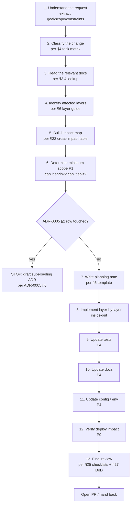
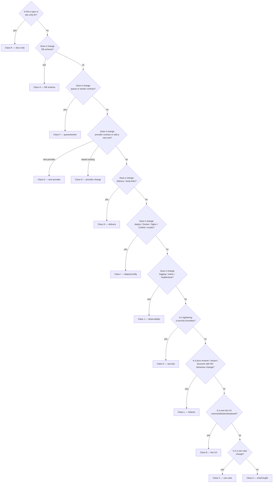
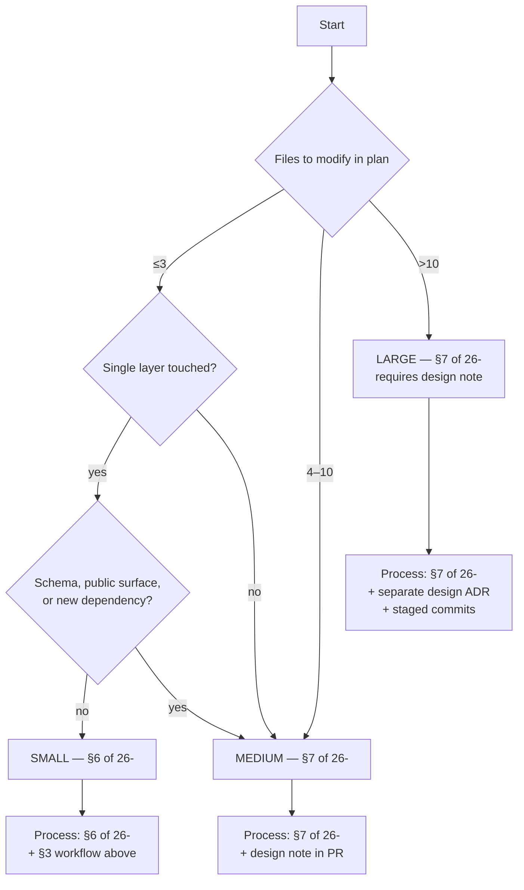
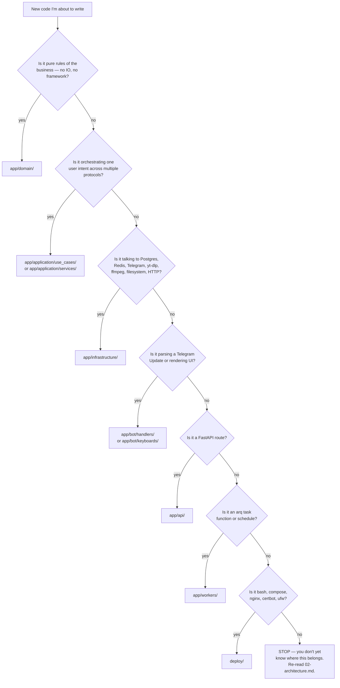

# 28 — Implementation playbook

> Status: Stable
> Audience: every engineer or AI agent making code changes in DWTGBot.
> Companion docs:
> [`25-agent-guide.md`](25-agent-guide.md) — operating manual (the "why"),
> [`26-cursor-rules.md`](26-cursor-rules.md) — operational protocol for AI tools,
> [`27-coding-standards.md`](27-coding-standards.md) — code-level rules,
> [`adr/0005-locked-architectural-assumptions.md`](adr/0005-locked-architectural-assumptions.md)
> — twelve locked rows.

> ⚠️ **Read this BEFORE you start a non-trivial change in DWTGBot.**
>
> `25-` tells you how to *think*. `26-` tells you what to *type or refuse to type*.
> **This document tells you, kind-of-task by kind-of-task, exactly what to do.**
> Treat each playbook as a checklist a pilot reads before takeoff.
>
> The eleven principles **P1–P11** referenced throughout are defined
> canonically in [`25-` §1.A](25-agent-guide.md#1a-mandatory-principles-p1p11--canonical-register)
> and [`26-` §1.A](26-cursor-rules.md#1a-mandatory-principles-p1p11--operational-register).
> If you don't know what `P7` means, stop and read those tables first.

---

## 1. Purpose of this playbook

### 1.1 What this document is

This playbook answers one question, every working day:

> **"I have a change to make in DWTGBot. What is the safest sequence of
> steps that gets it done without breaking the architecture, the queue,
> the deploy story, or the security boundary?"**

It is **not**:

- a tutorial on Python, Telegram, yt-dlp, ffmpeg, Docker, or Nginx;
- a re-statement of `25-agent-guide.md` (which is the *why*);
- a re-statement of `26-cursor-rules.md` (which is the AI-agent *protocol*);
- a re-statement of the topic docs (`docs/06-…` to `docs/24-…`), which
  are the *specs*.

It **is**:

- the **default workflow** for any task larger than a typo;
- the **task-shaped index** of "for change of class X, do steps Y, in
  order Z, then verify W";
- the **enforcement layer** that turns the eleven principles into
  concrete file edits.

### 1.2 Who this is for

| Reader | What this document does for them |
|---|---|
| **Developer** | A pre-flight checklist that survives "I'll just quickly…" |
| **Tech lead / reviewer** | A reference for "what should this PR have touched?" |
| **AI agent (Cursor / Claude / Codex / bespoke)** | An executable script per task class, cross-linked to refusal protocols |
| **DevOps / SRE** | A canonical place for deploy / Docker / Nginx / CI playbooks |
| **First-day joiner** | A way to make a real change in week 1 without breaking anything |

### 1.3 What problem this solves

DWTGBot looks simple ("download a video, send it") and is not. The
real complexity lives in the **invariants** that hold the system
together:

- a two-server topology with a security perimeter;
- a queue with idempotent retries;
- a provider abstraction with explicit contracts;
- a temp-link surface with TTL + counter + path-traversal defence;
- a Postgres schema that is the source of truth;
- a Docker / Nginx / Certbot deploy story that is idempotent.

When changes are made without a playbook, **invariants break by
accident**:

- business logic ends up in a Telegram handler;
- a "tiny" env var is added to `.env.example` only;
- a migration is autogenerated and committed without review;
- a worker grows a process-local cache;
- an Nginx route loses its `internal;` and now serves files unauthenticated.

This playbook makes those mistakes **expensive to make accidentally**:
every change is forced through a known shape, and every known shape
has a checklist that catches the common slips.

### 1.4 Why a strict playbook is needed *in this project specifically*

| Trait of DWTGBot | Why it makes informal change unsafe |
|---|---|
| Two servers, two compose stacks, no shared filesystem | A change in one stack is invisible from the other; you must reason about both |
| Public HTTPS surface for big files | Any change to delivery touches authentication, TTL, headers, and Nginx |
| External binaries (`yt-dlp`, `ffmpeg`) | Output schema drifts; partial failures are normal; subprocess discipline is critical |
| Idempotent queue with retries | A naive change can produce double sends or orphan jobs |
| Postgres ENUMs + JSONB | Migrations have hand-edit requirements autogen does not cover |
| Bash installer with destructive operations | Non-idempotent steps brick servers |
| Multiple runtimes per change (bot, worker, api, scripts) | "Does it still start?" must be asked of every entry point |

In short: **the cost of unprincipled change is much higher here than
in a CRUD app**. The playbook makes that cost visible *before* the
PR lands.

---

## 2. Core implementation philosophy

These are the eleven principles every change is graded against
(canonical definitions live in
[`25-` §1.A](25-agent-guide.md#1a-mandatory-principles-p1p11--canonical-register)
and [`26-` §1.A](26-cursor-rules.md#1a-mandatory-principles-p1p11--operational-register)).
Listed here in working-style language so they read as **mindsets**,
not rules.

### 2.1 The eleven principles in working language

| Code | Principle | Working translation |
|---|---|---|
| **P1** | **Minimal safe scope** | "What is the smallest diff that fully solves this? Anything else goes in a follow-up." |
| **P2** | **Architecture first** | "Where does this code *belong*? Decide that before opening a file." |
| **P3** | **No unrelated changes** | "If it's not in the plan, it's not in the PR." |
| **P4** | **Docs / tests / config evolve together** | "If I changed behaviour, I changed the spec — update both, in the same PR." |
| **P5** | **No infrastructure leakage into domain** | "Domain doesn't import drivers. Application talks to protocols. Always." |
| **P6** | **No business logic in handlers** | "Handlers route. They never decide, query, compute, or orchestrate." |
| **P7** | **Queue semantics preserved** | "Workers can die at any moment; retries must be safe; `_job_id` is a wire-format contract." |
| **P8** | **Provider contracts explicit** | "Application code touches `BaseProvider`, never `YouTubeProvider`. Platform code stays inside its provider." |
| **P9** | **Deploy idempotency reasoned** | "Re-running this script on a healthy host is a no-op. Destructive ops are gated by `confirm`." |
| **P10** | **DB migration reasoned** | "Every schema change has an Alembic migration, a `downgrade()` (or justified empty), and a deploy-order story." |
| **P11** | **Security defaults preserved** | "TLS, HSTS, `internal` Nginx, `ensure_within`, `sanitize_filename`, secrets-via-`Settings`, no public ports on NL-1 — these are floors, not suggestions." |

### 2.2 Operational mindsets that wrap the principles

These are not separate principles — they're the *posture* you adopt
to honour them every day.

- **Production mindset.** Every line ships to a real host, talks to a
  real Telegram, runs against a real Postgres. There is no "dev-only"
  branch in this codebase.
- **Observability by default.** If on-call would search for an event,
  it must exist in the log catalogue. New code without new logs is
  half-done.
- **Rollback thinking.** Every change must answer: *"if this is
  reverted in 10 minutes without a database rollback, does anything
  break?"* If yes, the change needs a two-step plan.
- **Migration thinking.** Schema changes are *forward-only* and
  *deploy-order-aware*. The migration applies first; the new code
  can read the old + new shape; the old shape is removed in a later
  release.
- **Deploy thinking.** Every change to `deploy/`, Compose, Nginx,
  Certbot, GitHub Actions is *re-runnable*. There is no "manual fix
  on the server" path.
- **Safe incremental change.** Refactor → add new path → switch over
  → remove old. Big-bang rewrites are forbidden.
- **Explicit boundaries.** Function signatures, repository protocols,
  provider contracts, env-var schemas, callback codecs — these are
  *contracts*. Treat them as APIs even when there is no external
  consumer.

If you can articulate, for any change, **which P it stresses, which
mindset you applied, and what you intentionally chose not to do**,
you are working in the playbook spirit.

### 2.3 Contracts to preserve when touching hot paths (ADR-0008)

Five contracts came out of the audit and are now load-bearing. If your
change touches one of these, you must preserve it (or write the ADR
that supersedes it) — this is the canonical anti-regression list:

| Contract | Where | Symptom of regression |
|---|---|---|
| `AppError.is_retryable` is the source of truth for retry vs. fail. The use case re-raises retryable / unexpected errors; permanent ones go to `_fail`. The arq wrapper marks `FAILED` only on the **last** attempt. | `app/exceptions.py`, `app/application/use_cases/process_download.py`, `app/infrastructure/queue/tasks.py` | One transient blip = one permanent `FAILED` row; `JOB_MAX_RETRIES` has no effect; metrics show 0 retries on errors that always retried before. |
| Per-user concurrency cap is enforced **atomically** via `JobsRepository.create_if_under_cap` (advisory lock + count + insert in one transaction). Never re-introduce a `count_active_for_user(...)` followed by `create(...)`. | `app/application/use_cases/enqueue_download.py`, `app/infrastructure/db/repositories/jobs_repo_impl.py` | `MAX_CONCURRENT_JOBS_PER_USER` exceeded on bursty / double-tap traffic; per-user worker starvation. |
| Temp-link counter increments **atomically** via `TempLinksRepository.try_register_use` (single `UPDATE ... WHERE ... RETURNING`). Pre-checks (path, file existence) run **before** the atomic call so probes don't burn slots. | `app/api/public/downloads.py`, `app/infrastructure/db/repositories/temp_links_repo_impl.py` | A `max_downloads=1` link served twice; cleanup-race causes 410s to consume the slot anyway. |
| Nginx access logs **redact** the `/d/<token>` segment via `map $request_uri $safe_request_uri`. `log_format` must use `$safe_request_uri`, never `$request` (which embeds the full URI). | `deploy/nginx/nginx.conf` | A Loki dump or `tail access.log` reveals one hour of bearer tokens. |
| Compose `image:` references use the fail-fast form `${IMAGE_*:?...}`; `:latest` only on semver tag builds; deploy.yml exports `IMAGE_*=...:sha-<short>`. | `deploy/nl{1,2}/docker-compose.yml`, `.github/workflows/build-images.yml`, `.github/workflows/deploy.yml` | A clean checkout silently deploys whatever was tagged `:latest`; rollbacks are ambiguous; a CI race overwrites a tag. |

These map onto principles **P7** (queue semantics), **P10** (DB
ordering), **P11** (security defaults). Touching any of them without
an ADR is a violation of P3 (no unrelated changes) — split the work.

---

## 3. Standard workflow for any change

This is the **default operating procedure**. Every non-trivial change
in DWTGBot goes through these thirteen steps in order. Skipping any
step costs more than running it (this is the empirical observation
that built the playbook).

### 3.1 The flowchart



### 3.2 Step-by-step operating procedure

Each step has a **definition of done** for itself. If you can't tick
it, you are not yet in the next step.

| # | Step | This step is done when… |
|---|---|---|
| 1 | **Understand the request** | You can write the goal in **one sentence**, name the surfaces involved (bot/api/worker/infra), and list the explicit constraints. If you can't, ask the user (do **not** guess; see `26-` §17.9.D). |
| 2 | **Classify the change** | The change has a class letter from §4 (small bugfix / feature / provider / queue / DB / deploy / …). The class drives what's mandatory below. |
| 3 | **Read the relevant docs** | You have read at least the universal floor (`README` + `00` + `02` + `03` + `25` + `26`) and the topic doc(s) for this class (per §3.4). |
| 4 | **Identify affected layers** | You can name every layer this change touches and one it does *not* touch. Use `02-architecture.md` §3 + §6 of this doc. |
| 5 | **Build impact map** | Per `§22 What must be updated together`, you have a complete list of files that must change, including docs/tests/config/migration/compose. |
| 6 | **Determine minimum scope (P1)** | You have answered: *"Can this be smaller? Can it split into two PRs (refactor first, behaviour second)?"* If the answer is yes, do it. |
| 7 | **Write the planning note** | Per §5 template; emitted **before** any file edit. `Files NOT touched` is non-empty; `Principles in play` lists at least one P. |
| 8 | **Implement layer-by-layer** | Inside-out: domain → application → infrastructure → entry layer (bot/api/worker) → composition → tests → docs. Save & format after each file. |
| 9 | **Update tests (P4)** | Tests covering the new behaviour exist and pass. Per-class test obligations from §4 are met. |
| 10 | **Update docs (P4)** | Every doc affected per §22 is updated in the **same PR**. Event catalogue, exception catalogue, env-var reference all stay in sync. |
| 11 | **Update config / env (P4)** | If env var added: `app/config.py` + `.env.example` + `deploy/nl{1,2}/.env.example` + relevant compose `environment:` block + `13-config-and-env.md`. |
| 12 | **Verify deploy impact (P9)** | If `deploy/`, Docker, Compose, Nginx, Certbot, or scripts touched: re-runnability checked, idempotency note in PR, `bash -n` + `shellcheck` clean. |
| 13 | **Final review** | §25 checklists run, §27 Definition-of-done passes, §19.9 / §19 P1–P11 gate green. PR description matches §3.3 template. |

### 3.3 PR description template

Every PR description includes (literal markdown to copy):

```markdown
## What
<one-sentence summary of the change>

## Why
<link to issue / user request; the user-visible problem solved>

## How
<3–6 bullets describing the implementation strategy>

## Files touched
- <path> — <one-line reason>

## Migrations
<None | migrations/versions/NNNN_<slug>.py + deploy order note>

## Docs updated
- <path> — <one-line reason>

## Config / env
<None | NEW env var: NAME (in: config.py, .env.example, deploy/nl?/.env.example, compose, 13-)>

## Risk / rollback
<Low | Medium | High; what can break; rollback story>

## Test plan
- [x] Unit tests added/updated
- [x] `pytest -m "not integration"` green locally
- [ ] Integration smoke (describe)
- [ ] Manual verification on NL-1 / NL-2 (describe)

## Principles in play (§1.A of 25- / 26-)
<P1, P3, P4, …>

## Locked decision touched? (ADR-0005 §2)
<No | Yes — superseding ADR: docs/adr/NNNN-<slug>.md>
```

### 3.4 Topic docs lookup (when the request mentions…)

| Topic of request | Open this first |
|---|---|
| Bot UX / new command / button | [`06-bot-flow.md`](06-bot-flow.md) |
| Use case / business logic | [`02-architecture.md`](02-architecture.md), [`16-error-handling.md`](16-error-handling.md) |
| Provider / new platform | [`07-provider-architecture.md`](07-provider-architecture.md), [`30-add-new-provider-guide.md`](30-add-new-provider-guide.md) |
| Background job / worker | [`09-queue-and-workers.md`](09-queue-and-workers.md) |
| Download pipeline (yt-dlp / ffmpeg) | [`08-download-pipeline.md`](08-download-pipeline.md) |
| Public delivery / temp links | [`10-temp-links-and-delivery.md`](10-temp-links-and-delivery.md) |
| Storage / cleanup | [`11-storage-strategy.md`](11-storage-strategy.md), [`23-cleanup-retention.md`](23-cleanup-retention.md) |
| DB / migration | [`12-db-schema.md`](12-db-schema.md) |
| Config / env var | [`13-config-and-env.md`](13-config-and-env.md) |
| Logging / metric | [`14-logging-observability.md`](14-logging-observability.md) |
| Healthcheck | [`15-healthchecks.md`](15-healthchecks.md) |
| Error / user message | [`16-error-handling.md`](16-error-handling.md) |
| Security surface | [`17-security.md`](17-security.md) |
| Tests | [`18-testing-strategy.md`](18-testing-strategy.md) |
| Docker / image | [`19-docker-architecture.md`](19-docker-architecture.md) |
| Deploy / installer | [`20-deployment.md`](20-deployment.md) |
| CI/CD | [`21-cicd.md`](21-cicd.md) |
| Backup / restore | [`22-backup-restore.md`](22-backup-restore.md) |
| Incident response | [`24-runbooks.md`](24-runbooks.md), [`31-troubleshooting.md`](31-troubleshooting.md) |

---

## 4. Task classification matrix

Every change has a **class**. The class determines the mandatory
checks, tests, and docs. If a change spans multiple classes,
**decompose it into smaller PRs** (one per class) — this is not a
suggestion, it is how you keep diffs reviewable.

| Class | Examples | Layers usually touched | Risk | Mandatory checks | Tests required | Docs to update |
|---|---|---|---|---|---|---|
| **A. Small bugfix** | Wrong copy, off-by-one, missed `await` | one file | low | unit test reproducing the bug; minimal diff | one regression test | none usually; if user-visible behaviour changed → topic doc |
| **B. Bot UX feature** | New command, new button, new keyboard | `app/bot/`, possibly `app/application/` | low–med | callback codec round-trip; rate-limit thinking; error message via `AppError` | bot handler test + use-case test (with fakes) | [`06-bot-flow.md`](06-bot-flow.md) handler catalogue, [`16-error-handling.md`](16-error-handling.md) if new exception |
| **C. Use-case change** | Change order of steps; add validation; tighten output | `app/application/`, possibly `app/domain/` | med | layer rule (no infra import), three-tier exception pattern preserved | use-case test with fakes; existing tests still green | [`02-architecture.md`](02-architecture.md) if surface changed; [`16-error-handling.md`](16-error-handling.md) if new exception |
| **D. Provider change** | Format spec tweak; new bucket; better metadata extraction | `app/infrastructure/providers/<platform>/`, fixtures | med | URL detection still works; `BaseProvider` surface unchanged; recorded JSON fixtures updated | provider unit test with fake yt-dlp; URL detection test | [`07-provider-architecture.md`](07-provider-architecture.md) provider table; [`30-add-new-provider-guide.md`](30-add-new-provider-guide.md) if a new entry-style is introduced |
| **E. New provider** | TikTok, SoundCloud | `app/infrastructure/providers/<new>/`, `app/utils/url.py`, `app/composition.py`, registry | med–high | full provider contract; ENUM migration for new `Platform`; URL detection priority | URL detection (3+ shapes), `get_info` against fixture, `build_options` shapes, failure modes | [`07-provider-architecture.md`](07-provider-architecture.md), [`30-add-new-provider-guide.md`](30-add-new-provider-guide.md), `12-db-schema.md` (ENUM), `13-config-and-env.md` (auth/cookies) |
| **F. Queue / worker change** | New task, retry policy, idempotency, status transition | `app/workers/`, `app/application/services/queue.py`, `app/infrastructure/queue/` | high | idempotency contract; bounded `max_tries`; partial-failure path; statelessness | inner-function tests with fake `ctx`; idempotent retry test | [`09-queue-and-workers.md`](09-queue-and-workers.md), [`24-runbooks.md`](24-runbooks.md) if a new failure mode |
| **G. Delivery / temp-link change** | TTL, max-downloads, token format, headers | `app/application/services/delivery.py`, `app/infrastructure/...`, `app/api/public/`, `deploy/nginx/` | high | `internal;` preserved; `X-Accel-Redirect` flow intact; rate limit; security headers | temp-link service tests; public-route tests with fake storage; nginx `nginx -t` | [`10-temp-links-and-delivery.md`](10-temp-links-and-delivery.md), [`17-security.md`](17-security.md) |
| **H. DB schema change** | New column, new table, ENUM addition, index | Alembic, `app/infrastructure/db/models.py`, repository impls | very high | hand-reviewed migration; `downgrade()` (or justified empty); deploy order; backwards compatibility | repo impl test against in-mem; migration apply/downgrade locally | [`12-db-schema.md`](12-db-schema.md); if domain entity touched also `04-domain-model.md` |
| **I. Deploy / config change** | Compose service, Nginx route, Certbot logic, install step | `deploy/`, `docker/` | high | idempotency proven by re-run; YAML anchors / healthchecks / restart policies preserved; security headers intact | manual smoke (re-run script on healthy host); `bash -n` + `shellcheck` | [`19-docker-architecture.md`](19-docker-architecture.md), [`20-deployment.md`](20-deployment.md), [`24-runbooks.md`](24-runbooks.md) if a recovery step changed |
| **J. Observability change** | New log event, metric, healthcheck | code in any layer + `14-logging-observability.md` | low–med | event in catalogue; correlation context bound; no PII / secrets | structured-field round-trip test; if metric, scrape sanity | [`14-logging-observability.md`](14-logging-observability.md) event catalogue; [`15-healthchecks.md`](15-healthchecks.md) if a new probe |
| **K. Security hardening** | Tightening rate limit, adding sanitization, narrowing surface | usually `app/api/`, `app/utils/`, `deploy/nginx/` | very high | threat model still holds; nothing weakened; ADR if surface changes | new test that proves the tightening (e.g. unit test for refused input) | [`17-security.md`](17-security.md); ADR if a new public surface or boundary change |
| **L. Refactor (no behaviour change)** | Rename, extract, restructure | varies | low–med (high if architectural) | tests pass **without modification**; existing log events unchanged; no public surface change | existing test suite — *unmodified* — must stay green | none usually; if a documented pattern changes → matching doc |

### 4.1 Decision tree: "what class is my change?"



If your change matches **multiple leaves**, it is multi-class —
split into multiple PRs.

---

## 5. Change planning protocol

Every non-trivial change is preceded by a **planning note**, emitted
**before** the first file edit. The planning note is the contract
the agent makes with the reviewer about what is and is not in scope.

### 5.1 Planning note template (verbatim — emit before any file edit)

This is the same template as [`25-` §6.A](25-agent-guide.md#6a-plan-template-verbatim--emit-before-any-file-edit)
and [`26-` §3.7](26-cursor-rules.md#37-plan-output-template-verbatim) —
reproduced here so the playbook is self-contained.

```markdown
### Plan

- **Goal:** <one sentence>
- **Class (per §4):** <A | B | C | D | E | F | G | H | I | J | K | L>
- **Principles in play (§2):** <P1, P3, P4, … — list every P this change touches>
- **ADR-0005 §2 row touched?** <No | Yes — row N → STOP, draft superseding ADR (P2)>
- **Reading done:** README, 00, 02, 03, 25, 26, ADR-0005 §2, <topic doc(s)>
- **Files to ADD:**
  - `path/to/new_file.py` — <why>
- **Files to MODIFY:**
  - `path/to/existing.py` — <one-line diff intent>
- **Files to DELETE:** <none | path — why>
- **Files / layers explicitly NOT touched:** (P1 + P3)
  - <e.g. `app/bot/handlers/` — this is a use-case-only change>
- **Migration?** (P10) <No | Yes — `migrations/versions/NNNN_<slug>.py`, deploy order: …>
- **Env var?** (P4) <No | Yes — `<NAME>` added in: config.py, .env.example, deploy/nl{1,2}/.env.example, compose env block, 13- doc>
- **Tests:** (P4) <new file(s) + which conditions; existing tests expected to stay green>
- **Docs to update in this PR:** (P4) <list of `docs/*.md` per §22>
- **Queue / worker contract impact?** (P7) <No | Yes — what changes>
- **Provider contract impact?** (P8) <No | Yes — which `BaseProvider` method>
- **Deploy / script idempotency note?** (P9) <N/A | how re-running stays safe>
- **Security defaults touched?** (P11) <No | Yes — what is weakened/strengthened, with justification>
- **Risks / blast radius:** <what could break; rollback story>
- **Verification:** <commands to run + manual smoke>
```

Hard rules about the plan (mirrors `25-` §6.A):

- **No prose answers.** Bullets and lists only.
- **No `TBD` and no "etc."** Every bullet has a concrete value or `none`.
- **`Principles in play` is mandatory.** Empty for anything beyond a
  typo means the change has not been classified.
- If `Files to MODIFY` exceeds 5 entries, the change is **not** small
  — re-classify per §4.
- If `Files / layers explicitly NOT touched` is empty, the agent
  hasn't thought about scope (P1, P3) — refuse to start coding until
  it has an entry.
- Plan items that violate P7 / P10 / P11 without an idempotency /
  migration / security justification block the plan; do not begin
  coding.

### 5.2 Decision tree: "is this small / medium / large?"



### 5.3 Inputs the planning note must consume

- **Goal sentence.** A reviewer must be able to copy this directly
  into `## What` of the PR.
- **Constraints from the user.** "Do not change DB", "stay under 50 MB
  Telegram limit", "Ubuntu 24.04 only", etc.
- **The current state.** Read the file you're about to edit; do not
  plan against an outdated mental model.
- **The principle audit.** Walk P1–P11; for each, ask "does this
  change stress this principle?" and add to `Principles in play`.
- **The §22 cross-impact map.** For each kind of change, the table
  tells you what else must move.
- **The non-touched negative space.** The single most diagnostic field
  in the plan: what you are *consciously* leaving untouched.

### 5.4 When to stop planning and ask

If after refining the plan once you still have:

- a `TBD`, or
- an unresolved choice between two architectural paths, or
- a touched ADR-0005 row, or
- a missing referenced file/doc,

**stop and surface to the user** using the appropriate refusal script
from [`26-` §17.9](26-cursor-rules.md#179-refusal-scripts-verbatim--copy-fill--send).

---

## 6. Layer selection guide

Where code goes is the single most important architectural decision
made on each change. **Decide the layer before opening the file.**

### 6.1 The decision tree



### 6.2 When to change `app/bot/handlers/` (Telegram handlers)

**Right reasons:**

- A new command, button, or callback parser.
- A change to the user-facing message text or keyboard.
- A new piece of correlation context to bind at the entry point.

**Wrong reasons (use a different layer instead):**

- Adding a DB query → it goes in a use case.
- Computing a file path → it goes in `app/utils/` or in the storage adapter.
- Calling `yt-dlp` → it goes in a provider.
- Reading config → use the `Settings` instance from `BotContainer`.
- Dispatching to multiple sub-flows → that's a use case orchestrator.

**Anti-patterns (P6):**

- Importing from `app/infrastructure/*`.
- `await self.session.execute(...)` inside a handler.
- Building a message body by gluing together provider output verbatim
  (no `AppError` translation).
- Catching `Exception` in the handler and swallowing it.

### 6.3 When to change `app/application/services/` and `app/application/use_cases/`

**Right reasons:**

- A new user intent ("download with audio extraction", "show recent
  history").
- An orchestration step is added or reordered.
- A new validation or business rule.
- A new protocol the application needs from infrastructure (declared
  here, implemented in `app/infrastructure/`).

**Wrong reasons:**

- "I need a faster query" → that's an infrastructure concern; talk to
  the protocol.
- "I want to send a Telegram message from here" → no, return data and
  let the bot layer render.
- "I need to read an env var here" → no, depend on the typed
  `Settings` field via the constructor.

**Anti-patterns (P5):**

- `from sqlalchemy ...` inside a use case.
- `from app.infrastructure...` anywhere in `app/application/`.
- Returning ORM models from a use case.
- Catching `redis.RedisError` directly — application code talks to a
  protocol, not to a driver.

### 6.4 When to change `app/domain/`

**Right reasons:**

- New entity field with a clear invariant.
- New enum value (always paired with an `ALTER TYPE` migration —
  P10).
- New repository protocol method.
- New domain exception type.

**Wrong reasons:**

- Anything involving IO, time, randomness, or env.
- "Let me put a SQLAlchemy `Column` here" — no.
- Catching framework errors here.

**Anti-patterns (P5):**

- Importing anything outside `stdlib`.
- Calling `datetime.utcnow()` (let callers pass time in).
- Reading `app.config.Settings`.

### 6.5 When to change `app/infrastructure/`

**Right reasons:**

- New repository implementation (sql/redis).
- New adapter (Telegram client, yt-dlp runner, ffmpeg runner, storage
  backend).
- Provider tweak.
- New external HTTP client.

**Wrong reasons:**

- Adding business rules ("if file > 50 MB, send via temp link") —
  that's a use case.
- Adding UI rendering — that's the bot layer.

**Anti-patterns (P5, P6):**

- Importing `app/bot/`, `app/api/`, or `app/workers/`.
- Long-lived sessions / connections that aren't disposed of.
- Leaking ORM models out of `app/infrastructure/db/`.

### 6.6 When to change `app/workers/` (arq runtime)

**Right reasons:**

- New arq task function.
- New schedule.
- New retry / backoff policy on an existing task.
- New cleanup or backup task.

**Wrong reasons:**

- Putting business logic in the task body — call a use case.
- Storing state on `self` between invocations (P7 — workers are
  stateless).

**Anti-patterns (P7):**

- Catching `Exception` and continuing — kills retries.
- Mutating shared module-level state.
- Non-deterministic `_job_id`.
- `time.sleep(...)` in async code.

### 6.7 When to change `app/api/` (FastAPI routes)

**Right reasons:**

- New `/healthz`, `/readyz` probe.
- New public route (rare; usually only `/d/{token}` exists).
- Changing the `X-Accel-Redirect` header path (with great care).

**Wrong reasons:**

- Adding business logic — call a use case.
- Streaming files via `FileResponse` — must use `X-Accel-Redirect`.

**Anti-patterns (P11):**

- Skipping `ensure_within` on a path computed from input.
- Returning internal exception strings to the user.
- Adding a new public surface without rate limiting in Nginx.

### 6.8 When to change `deploy/` (Docker, Compose, Nginx, Certbot, scripts)

**Right reasons:**

- New container service.
- New compose env passthrough.
- New Nginx route or security header.
- New Certbot automation.
- New install step.
- Bumped image tag (with CI build evidence).

**Wrong reasons:**

- Adding Python — `deploy/` is bash + YAML + nginx conf + certbot.
- Inlining production secrets — secrets stay in `.env` files on hosts,
  never in repo.

**Anti-patterns (P9, P11):**

- Non-idempotent step without `confirm`.
- `apt install` without `--no-install-recommends`.
- `chmod 777` or unbounded `rm -rf`.
- Removing `internal;` from the storage Nginx location.
- Opening a public port on NL-1.

### 6.9 When to change `docs/` (specs)

**Right reasons:**

- The behaviour you just changed.
- A pattern that just emerged and will repeat.
- A new event name, env var, ADR, or runbook.

**Wrong reasons:**

- "I want to add helpful prose elsewhere" — find the canonical doc and
  edit it.
- Creating a new top-level `docs/<NN>-…md` when an existing one fits.

**Anti-patterns (P3, P4):**

- Behaviour change without doc update in the same PR.
- A new doc file that duplicates content already canonical elsewhere.

### 6.10 When to change `app/tests/`

**Right reasons:**

- A new public function exists.
- A new behaviour exists.
- A regression has occurred (write the test first).
- An existing contract changed (test must update intentionally).

**Wrong reasons:**

- Skipping a flaky test.
- Asserting on log strings (use structured fields, or skip).
- Using `time.sleep` in async tests.

**Anti-patterns (P4):**

- Real network / DB / Redis without `@pytest.mark.integration`.
- Shared mutable state across tests.
- `# type: ignore` left after fixing the underlying issue.

---

## 7. Playbook: adding a new bot command

**Class B (bot UX feature). Risk: low–medium.**

### 7.1 Goal of this kind of change

Expose a new `/command` that the user can invoke. Behaviour must
route through a use case; rendering stays in the bot layer.

### 7.2 Files typically touched

| File / area | Change |
|---|---|
| `app/bot/handlers/<feature>.py` (or extend an existing handler module) | Add `async def handle_<command>(update, context): ...` |
| `app/bot/keyboards/<feature>.py` | Add keyboards if the command needs them |
| `app/bot/callbacks/<feature>.py` | Add callback parsers if the command produces inline buttons |
| `app/bot/application_factory.py` (or wherever `CommandHandler` is registered) | Register the new handler with PTB |
| `app/application/use_cases/<feature>.py` | If new business logic — add or call a use case |
| `app/exceptions.py` | If a new user-meaningful failure exists, add an `AppError` subclass |
| `docs/06-bot-flow.md` | Add the command to the handler catalogue |
| `docs/16-error-handling.md` | If new exception, add to the catalogue |
| `app/tests/test_bot_<feature>.py` | Handler test with fakes |

### 7.3 Step-by-step procedure

1. **Plan (§5).** State the command, the user intent, and what the
   bot will reply with.
2. **Decide if a use case is needed.** If the response is a static
   message or a thin formatting of an already-existing use case, no
   new use case. Otherwise, add the use case in
   `app/application/use_cases/`.
3. **Define the AppError(s).** Any failure the user must understand
   gets a typed exception with a `user_message`.
4. **Write the handler.** It must:
   - bind correlation context (`request_id`, `user_id`, `chat_id`),
   - call the use case via the container,
   - render text + keyboard,
   - use the three-tier exception pattern to map errors to user
     messages.
5. **Register the handler** with PTB in `application_factory.py`.
6. **Add a handler test** using a fake `Update` and a fake use case.
7. **Update docs** (`06-bot-flow.md` handler catalogue;
   `16-error-handling.md` if new exception).
8. **Final review** per §25.

### 7.4 Validation after the change

- Send `/start` and the new command to a real bot in dev; confirm
  reply.
- `pytest -m "not integration" app/tests/test_bot_<feature>.py` green.
- `ruff format && ruff check && mypy app` green.
- `06-bot-flow.md` handler catalogue lists the command.

### 7.5 Anti-patterns (P6, P5)

- ❌ DB or Redis call inside the handler.
- ❌ `yt-dlp` call inside the handler.
- ❌ Computing a file path inside the handler.
- ❌ Storing >64 bytes in `callback_data`.
- ❌ Catching `Exception` in the handler.

### 7.6 Common mistakes

| Mistake | Cure |
|---|---|
| Forgot to register the handler with PTB | Run the bot locally; the command silently does nothing. Register in `application_factory.py`. |
| Used `Update.message.reply_text(...)` directly with raw exception text | Wrap the failure in an `AppError`; render `error.user_message`. |
| Put a query in the handler "for one-shot" | Move to a use case; even one-shot queries belong on the protocol side. |

---

### 7.7 DO / DON'T quick reference

| Do | Don't |
|---|---|
| ✅ Bind correlation context (`request_id`, `user_id`, `chat_id`) at the top of the handler | ❌ Read DB / Redis or call `yt-dlp` from inside the handler (P5, P6) |
| ✅ Delegate to **one** use case from the handler | ❌ Inline 3+ steps of business logic in the handler body (P6) |
| ✅ Render `error.user_message` for any caught `AppError` | ❌ Reply with `str(exc)` or a Python traceback (P11) |
| ✅ Stay under 64 bytes when packing `callback_data` | ❌ Encode large payloads — persist them and send only an id (P6) |
| ✅ Register the handler in `application_factory.py` | ❌ Forget the registration step (silent no-op for the user) |
| ✅ Update `06-bot-flow.md` handler catalogue in the same PR | ❌ Defer the doc update to "later" — it never lands (P4) |
| ✅ Use the three-tier exception pattern at the entry point | ❌ Wrap the handler in a blanket `try/except Exception` (P6, P11) |

### 7.8 Smell signals during this change (halt and re-plan)

- A new file appears under `app/infrastructure/` for "just one query the handler needs" → P5/P6 violation; move to a use case + repo.
- The handler grows past ~30 lines → it's doing too much; extract a use case.
- You are about to import `from app.infrastructure...` in a `app/bot/` file → stop.
- You are about to add a `@property` on the handler class to memoize a yt-dlp call → that belongs in a service / cache adapter, not on the handler.

---

## 8. Playbook: adding a new user flow

**Class B + C. Risk: medium.**

### 8.1 Goal

A "flow" is a multi-step interaction (e.g. "Paste URL → choose
quality → confirm → receive file"). Adding one means designing the
states, the use cases, the messages, and the persistence (if any).

### 8.2 Files typically touched

| File / area | Change |
|---|---|
| `app/bot/handlers/<flow>.py` | Each step is a handler; usually a `MessageHandler` + `CallbackQueryHandler` |
| `app/bot/keyboards/<flow>.py` | Inline keyboards for each step |
| `app/bot/callbacks/<flow>.py` | Callback codec for inter-step state |
| `app/application/services/<flow>.py` | Use cases for each transition |
| `app/application/dto/<flow>.py` | DTOs returned to the bot layer |
| `app/infrastructure/repositories/<flow>.py` | If state persists |
| `app/infrastructure/state_store.py` (Redis) | If short-lived state |
| `app/exceptions.py` | New `AppError` subclasses if needed |
| `docs/06-bot-flow.md` | New flow diagram |
| `docs/14-logging-observability.md` | New log events |
| `app/tests/test_<flow>.py` | One test per state transition |

### 8.3 Step-by-step procedure

1. **Plan (§5).** Sketch the state diagram of the flow. Identify
   inputs, outputs, errors per step.
2. **Define use cases per step.** Each transition is a use case.
3. **Choose state storage.** If state lives < 1 hour and < 1 KB,
   prefer Redis with an explicit TTL. If state must outlive the
   conversation, persist in Postgres.
4. **Design the callback codec.** Encode state transitions in
   `callback_data` as a compact, parsed structure. Stay under 64
   bytes.
5. **Implement use cases first** (P2 — inside-out).
6. **Implement repos / state store next** (infrastructure).
7. **Implement handlers + keyboards last.** Each handler binds
   correlation context, calls one use case, renders.
8. **Add tests** for each transition with fakes.
9. **Document** the flow in `06-bot-flow.md` (mermaid diagram +
   message catalogue).
10. **Add log events** at each transition (`<flow>_step_started`,
    `<flow>_step_done`).

### 8.4 Validation

- Manual run on a dev bot through the full flow + each error branch.
- `pytest -m "not integration" app/tests/test_<flow>.py` green.
- Logs show correlation context across all steps.
- `06-bot-flow.md` updated.

### 8.5 Anti-patterns (P6, P7)

- ❌ State on `self` inside a handler (PTB handlers are not bound
  per-conversation).
- ❌ State only in `chat_data` without a Redis fallback (lost on bot
  restart).
- ❌ Cross-step orchestration in handlers.

### 8.6 Common mistakes

| Mistake | Cure |
|---|---|
| Encoded the entire payload in `callback_data` | Persist payload in DB / Redis; encode only an id |
| Forgot to clear state on error | Add explicit cleanup on the failure path; document TTL fallback |
| State store leaked across users | Always namespace by `user_id` or `chat_id` |

---

### 8.7 DO / DON'T quick reference

| Do | Don't |
|---|---|
| ✅ Sketch the state diagram **before** writing code | ❌ Discover state shape mid-implementation (P2) |
| ✅ One use case per state transition | ❌ Bundle multiple transitions in one handler (P6) |
| ✅ Encode only an **id** in `callback_data`; persist the payload | ❌ Stuff full state into 64 bytes (P6) |
| ✅ Choose state TTL explicitly (Redis if <1h, Postgres if longer) | ❌ Rely on PTB `chat_data` alone (lost on restart) (P7) |
| ✅ Namespace state by `user_id` / `chat_id` | ❌ Share state implicitly across users (P11) |
| ✅ Cleanup state on every error path | ❌ Leak state with no TTL fallback (P9) |
| ✅ Document the flow in `06-` with a mermaid state diagram | ❌ Leave the new flow undocumented (P4) |
| ✅ Emit a structured log event at every transition (`<flow>_step_started`, `<flow>_step_done`) | ❌ Make the flow invisible to on-call (P4) |

### 8.8 Smell signals during this change (halt and re-plan)

- The flow has more than 5 visible states → split into two flows or rethink (probably one is hidden).
- You added more than one new column to support transient state → use Redis with TTL instead.
- The same `callback_data` prefix appears in 3+ unrelated places → the codec needs a versioned namespace.
- A handler now reads from two different repositories → move the read to a use case that returns one DTO.

---

## 9. Playbook: changing provider logic

**Class D. Risk: medium.**

### 9.1 Goal

Adjust how DWTGBot interacts with a specific platform (YouTube,
Instagram, …) without touching the `BaseProvider` contract.

### 9.2 Files typically touched

| File / area | Change |
|---|---|
| `app/infrastructure/providers/<platform>/provider.py` | Tweak `format_spec`, `build_options`, metadata extraction |
| `app/infrastructure/providers/<platform>/options.py` (or similar) | Add/remove buckets |
| `app/utils/url.py` | Only if URL detection needs adjustment |
| `app/tests/test_providers_<platform>.py` | Provider tests against fake yt-dlp |
| `app/tests/fixtures/yt_dlp_<platform>_*.json` | Recorded fixture(s) |
| `docs/07-provider-architecture.md` | Provider table row |
| `docs/13-config-and-env.md` | If new auth / cookies / env var |

### 9.3 Step-by-step procedure

1. **Plan (§5).** State exactly which behaviour is changing.
2. **Confirm the provider contract is unchanged.** `get_info`,
   `build_options`, `download` keep their signatures and semantics.
3. **Inspect real yt-dlp output.** Run `yt-dlp -j <sample-url>` (or
   use an existing recorded fixture) — never guess at field names.
4. **Implement the change inside the provider.** All
   platform-specific logic stays here.
5. **Update the recorded JSON fixtures** that exercise the new branch.
6. **Update tests** for `get_info`, `build_options`, and any failure
   mode that just changed (geo-block, age-gate, empty formats).
7. **Update docs** (`07-provider-architecture.md` provider table; if
   new auth → `13-config-and-env.md`).

### 9.4 Validation

- `pytest -m "not integration" app/tests/test_providers_<platform>.py` green.
- (If feasible) one real-link smoke test against an integration
  fixture — manual.
- Logs from a real download show the new branch being taken.

### 9.5 Anti-patterns (P8)

- ❌ Importing yt-dlp specifics from a use case.
- ❌ Adding a public method on the provider that application code
  begins to call (use the `BaseProvider` protocol only).
- ❌ Changing the meaning of an existing `DownloadOption.key` (it's a
  callback contract; in-flight callbacks would break).

### 9.6 Common mistakes

| Mistake | Cure |
|---|---|
| Trusted yt-dlp to expose a key that doesn't exist | Use `.get()` with defaults; assert in tests against the recorded fixture |
| Changed `format_spec` and broke audio-only path | Add an audio fixture; assert both video and audio paths |
| Renamed an option key silently | Either keep the old key as alias for one release, or version the flow |

---

### 9.7 DO / DON'T quick reference

| Do | Don't |
|---|---|
| ✅ Inspect real `yt-dlp -j <url>` output **before** coding | ❌ Guess at field names (P8) |
| ✅ Add / refresh a recorded JSON fixture to lock the assumption | ❌ Test against live yt-dlp (P4) |
| ✅ Use `info.get(key, default)` for every yt-dlp field | ❌ `info["format"]` direct access — breaks on missing key (P8) |
| ✅ Keep `BaseProvider` surface unchanged | ❌ Add a public method only this provider needs (P8) |
| ✅ Preserve existing `DownloadOption.key` strings | ❌ Rename keys silently — in-flight callbacks break (P8) |
| ✅ Cover the failure-mode you just touched in tests (geo, age, empty `formats`) | ❌ Adjust only the happy path (P4) |
| ✅ Update the provider table row in `07-provider-architecture.md` | ❌ Skip docs because "code is the source of truth" (P4) |

### 9.8 Smell signals during this change (halt and re-plan)

- You're about to change `BaseProvider` surface → that's a §10 (multi-provider) change, not §9.
- The diff also touches `app/application/...` → platform logic is leaking up; move it back into the provider.
- The fixture file becomes >50 KB → trim to the fields under test; keep one full snapshot in `docs/` for reference.
- Two providers' `format_spec` strings start to look similar → resist DRYing them; platform specifics belong in their provider.

---

## 10. Playbook: adding a new provider

**Class E. Risk: medium–high.**

### 10.1 Goal

Add support for a new platform (e.g. TikTok, SoundCloud) by
implementing `BaseProvider` and registering it.

### 10.2 Files typically touched

| File / area | Change |
|---|---|
| `app/domain/enums.py` | Add `Platform.<NEW>` value |
| `migrations/versions/NNNN_add_platform_<new>.py` | `ALTER TYPE platform ADD VALUE '<new>'` |
| `app/utils/url.py` | URL detection for the platform (3+ shapes) |
| `app/infrastructure/providers/<new>/__init__.py` | Module |
| `app/infrastructure/providers/<new>/provider.py` | `<New>Provider(BaseProvider)` |
| `app/infrastructure/providers/<new>/options.py` (or in provider) | `build_options` logic |
| `app/composition.py` | Register in `_build_provider_registry(...)` |
| `app/tests/test_url_detection.py` | URL recognition tests |
| `app/tests/test_providers_<new>.py` | Provider unit tests |
| `app/tests/fixtures/yt_dlp_<new>_*.json` | Recorded fixtures |
| `docs/07-provider-architecture.md` | Provider table row |
| `docs/30-add-new-provider-guide.md` | Worked example block |
| `docs/13-config-and-env.md` | If auth / cookies / env var needed |
| `docs/14-logging-observability.md` | New log events `<new>_*` |

### 10.3 Step-by-step procedure

1. **Plan (§5).** Confirm the platform is supported by yt-dlp.
   Identify URL shapes, formats, auth requirements.
2. **Add the enum value + ALTER TYPE migration.** Migration first
   (P10).
3. **Implement URL detection** in `app/utils/url.py`. Add 3+
   representative URLs to the test.
4. **Implement the provider.** All platform specifics inside
   `<New>Provider`. Implement `get_info`, `build_options`, `download`.
5. **Register** in `_build_provider_registry(...)`.
6. **Write unit tests** with fake yt-dlp output (recorded fixtures).
7. **Write failure-mode tests** (geo block, age gate, empty
   `formats`).
8. **Update docs** (provider table, worked example, config if auth
   needed, log catalogue).
9. **Manual smoke test** with a real URL on dev.

### 10.4 Minimal acceptance criteria

- URL detection: 3+ shapes pass.
- `get_info` returns a populated `MediaInfo` against the fixture.
- `build_options` returns at least one downloadable option.
- `download` writes files inside `target_dir` and returns
  `DownloadResult` with size and mime.
- Tests + docs + composition + migration all in the same PR.

### 10.5 Checklist (copy into PR description)

- [ ] `Platform.<NEW>` enum added.
- [ ] ALTER TYPE migration written and reviewed.
- [ ] URL detection covers ≥3 representative shapes with tests.
- [ ] `<New>Provider` extends `BaseProvider`; no new public methods.
- [ ] All platform specifics live inside the provider class.
- [ ] Recorded JSON fixtures committed.
- [ ] `_build_provider_registry(...)` updated.
- [ ] Provider table in `07-provider-architecture.md` updated.
- [ ] Worked example added to `30-add-new-provider-guide.md`.
- [ ] If auth / cookies / env var → `13-config-and-env.md` + `Settings`.
- [ ] New log event names added to `14-logging-observability.md`.

### 10.6 Anti-patterns (P8, P5)

- ❌ Putting `format_spec` strings in a use case.
- ❌ Adding a `<NewClient>` HTTP layer used directly by application
  code — only the provider is the entry point.
- ❌ Adding the platform to the registry but leaving `Platform` enum
  unchanged.

### 10.7 Common mistakes

| Mistake | Cure |
|---|---|
| Forgot ALTER TYPE → app crashes inserting a job for the new platform | Run `alembic upgrade head`; verify the ENUM contains the new value |
| URL detection returns the wrong platform for a borderline URL | Add the failing shape to the URL test; tighten the matcher |
| Provider crashes on platform-specific JSON shape | Always read live yt-dlp output once; build the fixture from it |

---

### 10.8 DO / DON'T quick reference

| Do | Don't |
|---|---|
| ✅ Confirm yt-dlp supports the platform first | ❌ Start coding before checking upstream support (P2) |
| ✅ Write `ALTER TYPE platform ADD VALUE` migration **before** code | ❌ Add code that inserts the new ENUM value with no migration (P10) |
| ✅ Cover ≥3 URL shapes in detection tests | ❌ Match only the canonical URL form (P8) |
| ✅ Keep all platform specifics inside `<New>Provider` | ❌ Leak `format_spec` strings or platform branches into use cases (P5, P8) |
| ✅ Register in `_build_provider_registry(...)` in `composition.py` | ❌ Add the class but forget composition wiring (P2) |
| ✅ Document failure modes (geo, age, empty `formats`) in tests | ❌ Test only the happy path (P4) |
| ✅ Add new event names (`<new>_*`) to `14-` catalogue | ❌ Land code that emits unfindable events (P4) |
| ✅ Provide a worked example block in `30-add-new-provider-guide.md` | ❌ Leave the next contributor to reverse-engineer your provider (P4) |

### 10.9 Smell signals during this change (halt and re-plan)

- You're tempted to add a new public method to `BaseProvider` "for this platform" → resist; widen the contract only with a separate ADR.
- A second `<New>Adapter` class appears that the use case calls directly → application code must talk to `BaseProvider` only.
- URL detection requires a regex >120 chars → the URL space is wider than you think; split detection by sub-shape.
- The provider needs to write to disk outside `target_dir` → that's a path-traversal risk (P11); keep all writes inside the scratch dir.

---

## 11. Playbook: changing download pipeline

**Class D + F. Risk: medium–high.**

### 11.1 Goal

Adjust how DWTGBot drives `yt-dlp` and `ffmpeg`: filename handling,
temp file lifecycle, size/mime checks, timeouts, retries.

### 11.2 Files typically touched

| File / area | Change |
|---|---|
| `app/infrastructure/runners/yt_dlp.py` | Subprocess invocation; option building |
| `app/infrastructure/runners/ffmpeg.py` | Subprocess invocation; arg construction |
| `app/infrastructure/storage/local.py` (or similar) | `job_dir`, `ensure_within`, `sanitize_filename` use |
| `app/application/services/download.py` (or use case) | Orchestration; size threshold logic |
| `app/utils/filenames.py` | Sanitization rules |
| `app/exceptions.py` | New retryable / permanent failure types |
| `docs/08-download-pipeline.md` | Pipeline narrative + diagrams |
| `app/tests/test_download_pipeline.py` | Tests with fakes for both runners |

### 11.3 Step-by-step procedure

1. **Plan (§5).** State which step changes (subprocess, sanitization,
   file lifecycle, size check).
2. **Confirm subprocess discipline (P11).** `asyncio.create_subprocess_exec(arg, arg)`,
   no `shell=True`, no string concatenation.
3. **If filename handling changes** — re-prove `sanitize_filename` and
   `ensure_within` cover the new cases.
4. **If new size threshold or mime detection** — keep that decision in
   the use case, not in the runner (P5/P6).
5. **If new retry policy** — coordinate with §13 (queue/worker).
6. **Update tests** for both happy and failure paths.
7. **Update `08-download-pipeline.md`** narrative.

### 11.4 Validation

- `pytest -m "not integration" app/tests/test_download_pipeline.py` green.
- A manual local run downloads a small file and writes to a job-scoped
  scratch dir.
- `ensure_within` rejects an attempted path-traversal input (test).

### 11.5 Anti-patterns (P11, P5)

- ❌ `subprocess.run(..., shell=True)` anywhere.
- ❌ Building a path with `os.path.join(STORAGE_PATH, untrusted)` (use
  `ensure_within`).
- ❌ Trusting filenames from yt-dlp metadata as-is.
- ❌ Putting the "small vs. big file" decision in the runner.

### 11.6 Common mistakes

| Mistake | Cure |
|---|---|
| ffmpeg invocation broke on filenames with spaces | Use argv list; never shell-quote manually |
| Scratch dir leaked after a partial failure | Cleanup worker is the safety net; provider must not leave files outside scratch dir |
| Timeout was too short — large videos failed | Make timeout proportional to size estimate; add the value to `13-config-and-env.md` |

---

### 11.7 DO / DON'T quick reference

| Do | Don't |
|---|---|
| ✅ `asyncio.create_subprocess_exec(arg, arg, …)` (argv list) | ❌ `subprocess.run(..., shell=True)` or string concat into a shell (P11) |
| ✅ `ensure_within(STORAGE_PATH, candidate)` for every derived path | ❌ `os.path.join(STORAGE_PATH, untrusted)` (P11) |
| ✅ `sanitize_filename(name)` before writing to disk | ❌ Trust filenames from yt-dlp metadata (P11) |
| ✅ Per-job scratch dir; cleanup task is the safety net | ❌ Mix files from different jobs in one dir (P9) |
| ✅ Keep the "small vs big file" decision in the **use case** | ❌ Embed delivery routing inside the runner (P5, P6) |
| ✅ Bound subprocess time; kill stragglers; surface as `RetryableError` | ❌ Unbounded `await proc.wait()` (P7) |
| ✅ Re-raise on partial failure; let the queue handle retry | ❌ Catch and continue silently (P7) |
| ✅ Stream stdout/stderr to a bounded buffer; log only the tail | ❌ Capture the entire output of long subprocesses (memory + secrets in logs) (P11) |

### 11.8 Pre-flight pattern — the only safe subprocess shape

```python
proc = await asyncio.create_subprocess_exec(
    "ffmpeg",
    "-y",
    "-i", str(input_path),    # str(...) — pathlib.Path goes through unchanged
    "-c:a", "libopus",
    str(output_path),
    stdout=asyncio.subprocess.PIPE,
    stderr=asyncio.subprocess.PIPE,
)
try:
    stdout, stderr = await asyncio.wait_for(proc.communicate(), timeout=DOWNLOAD_TIMEOUT)
except asyncio.TimeoutError:
    proc.kill()
    await proc.wait()
    raise RetryableError("ffmpeg_timeout")
if proc.returncode != 0:
    raise PermanentError("ffmpeg_failed", details=stderr.decode(errors="replace")[-500:])
```

### 11.9 Smell signals during this change (halt and re-plan)

- The diff includes `shell=True` anywhere → revert that hunk.
- The diff includes string concatenation into a subprocess argument → use the argv list.
- The runner now decides what to send to Telegram → push that decision back to the use case.
- A new background helper writes outside `STORAGE_PATH` → that's a perimeter break (P11).

---

## 12. Playbook: changing delivery logic

**Class G. Risk: high.**

### 12.1 Goal

Adjust how files reach the user: small files via Telegram, big files
via tokenised HTTPS link, with TTL, max-downloads, and Nginx
`X-Accel-Redirect` semantics.

### 12.2 Files typically touched

| File / area | Change |
|---|---|
| `app/application/services/delivery.py` | Decision: Telegram upload vs. temp link |
| `app/application/services/temp_link_service.py` | Token issue + lookup + accounting |
| `app/infrastructure/temp_links/repo.py` | DB persistence of `temp_links` rows |
| `app/api/public/downloads.py` | `/d/{token}` route; `X-Accel-Redirect` |
| `app/infrastructure/telegram/sender.py` | Small-file send path |
| `deploy/nginx/sites-available/dwtgbot.conf` | Public route, `internal;`, rate limit |
| `docs/10-temp-links-and-delivery.md` | Narrative + diagrams + token format |
| `docs/17-security.md` | If auth/header/expiry surface changes |
| `app/tests/test_temp_link_service.py` | Service tests |
| `app/tests/test_public_downloads.py` | API tests with fake storage |

### 12.3 Step-by-step procedure

1. **Plan (§5).** Identify the dimension changing: TTL, counter,
   token format, headers, rate limit.
2. **Confirm `internal;` stays on the storage `location` (P11).** No
   exception.
3. **If token format changes** — write a migration if persisted; bump
   a version field in the token; preserve old-token decoding for one
   release window.
4. **Implement service first** (`temp_link_service`).
5. **Implement API route** to use `X-Accel-Redirect`. Never
   `FileResponse`.
6. **Update Nginx** if route or headers change. Test with `nginx -t`
   inside the container.
7. **Update tests + docs**.

### 12.4 Validation

- `pytest -m "not integration" app/tests/test_temp_link_service.py app/tests/test_public_downloads.py` green.
- Manual: issue a token, hit the URL, file downloads via Nginx.
- `curl -I` against an expired or exhausted link returns the right
  status without leaking storage path.

### 12.5 Anti-patterns (P11)

- ❌ `FileResponse(path)` for the public download.
- ❌ Removing `internal;` from the storage location.
- ❌ Logging full tokens (only last 4 chars in debug).
- ❌ Increasing TTL or max-downloads without justification in the PR.
- ❌ Accepting the token as a query parameter in addition to path
  (broadens attack surface).

### 12.6 Common mistakes

| Mistake | Cure |
|---|---|
| Workers leaked because `FileResponse` blocked the event loop | Switch to `X-Accel-Redirect` against the `internal` Nginx location |
| Token leaked into logs via a structured field | Strip to last-4 in the log adapter; write a regression test |
| TTL extended silently | Justify in the PR description; if affects security model, ADR |

---

### 12.7 DO / DON'T quick reference

| Do | Don't |
|---|---|
| ✅ `X-Accel-Redirect` against the `internal` Nginx location | ❌ `FileResponse(path)` from FastAPI for the public download (P11) |
| ✅ Validate token + TTL + counter on every request | ❌ Trust the URL shape alone (P11) |
| ✅ Log only last-4 chars of the token | ❌ Log full tokens or the full token-bearing URL (P11) |
| ✅ Decrement / mark-used inside one DB transaction | ❌ Two-step decrement that races under load (P7, P11) |
| ✅ Justify any TTL or counter change in PR description | ❌ Loosen security defaults silently (P11) |
| ✅ Preserve all security headers + rate limits in Nginx | ❌ Drop a header to "simplify" the conf (P11) |
| ✅ Token is path-only (`/d/{token}`) | ❌ Accept the token as a query parameter alternative (broadens attack surface) (P11) |
| ✅ Update `10-temp-links-and-delivery.md` and `17-security.md` together | ❌ Defer the docs update (P4) |

### 12.8 Smell signals during this change (halt and re-plan)

- You're tempted to remove `internal;` "to test the route from the browser" → use `curl` against the internal `X-Accel-Redirect` chain in a test container instead.
- The token format is widening (longer, more fields) without a versioning marker → add a version byte before deploying.
- You're caching token-lookup results in a process-local dict → P7 violation; use Redis with TTL or no cache.
- You're tempted to add a "preview" route that bypasses the counter → that's a new public surface; needs §K hardening review.

---

## 13. Playbook: changing queue / worker behaviour

**Class F. Risk: high.**

### 13.1 Goal

Add or modify an arq task, change retry policy, or change job-status
transitions — without breaking idempotency, correlation, or
observability.

### 13.2 Files typically touched

| File / area | Change |
|---|---|
| `app/workers/tasks/<task>.py` | The task itself |
| `app/workers/settings.py` | Register task in `WorkerSettings.functions` |
| `app/application/services/queue.py` | Producer protocol |
| `app/infrastructure/queue/producer.py` | Producer impl, `_job_id` derivation |
| `app/infrastructure/db/repositories/jobs.py` | Status transitions |
| `app/exceptions.py` | New `DownloadError` kinds if needed |
| `docs/09-queue-and-workers.md` | Lifecycle + retry + idempotency narrative |
| `docs/14-logging-observability.md` | `worker_*` log events |
| `docs/24-runbooks.md` | New failure mode |
| `app/tests/test_<task>.py` | Task unit test with fake `ctx` |
| `app/tests/test_queue_producer.py` | Idempotency contract |

### 13.3 Step-by-step procedure

1. **Plan (§5).** State the change in queue contract terms:
   `_job_id` formula, `max_tries`, `retry_delay`, status transitions,
   side effects.
2. **Preserve idempotency (P7).** `_job_id = f"job:{job.id}"` (or
   equivalent) is deterministic. A retry of the same logical request
   produces the same observable outcome.
3. **Set bounded `max_tries`.** Never `None`. Pick a value justified
   by failure-mode analysis.
4. **Distinguish retryable transient vs. retryable rate-limit vs.
   permanent (user-meaningful) vs. permanent (programmer error).**
5. **Implement task body.** Re-raise on failure; do not swallow.
6. **Implement / update producer**. Same `_job_id` formula on both
   sides.
7. **Update DB status transitions** (`pending → in_progress →
   success | failed | partial_success`). Each transition is logged.
8. **Add tests:** unit tests for the inner function with fakes; an
   idempotency test that a retry does not double-send.
9. **Update docs** (`09-queue-and-workers.md`, `14-` events,
   `24-runbooks.md` if a new on-call signature emerged).

### 13.4 Validation

- `pytest -m "not integration" app/tests/test_<task>.py app/tests/test_queue_producer.py` green.
- Manual local arq run produces the expected status row and log
  events.
- A re-run of the same job (same `_job_id`) does not produce duplicate
  side effects.

### 13.5 Anti-patterns (P7)

- ❌ Catching `Exception` in the task body.
- ❌ `_job_id` formula with randomness.
- ❌ Mutating module-level state.
- ❌ `time.sleep` (use `await asyncio.sleep`).
- ❌ Storing `MediaInfo` or other state in a process-local dict.
- ❌ Adding an unbounded retry loop.

### 13.6 Common mistakes

| Mistake | Cure |
|---|---|
| Retry uploaded the file twice | Write the "delivered" marker before exiting; subsequent retries detect and short-circuit |
| Worker silently lost status updates | Use the repo methods that emit log events; never `UPDATE` raw |
| `max_tries=None` made a poison job spin forever | Set a finite `max_tries`; route exhausted retries to `failed` with `error_kind` |

---

### 13.7 DO / DON'T quick reference

| Do | Don't |
|---|---|
| ✅ Deterministic `_job_id = f"job:{job.id}"` (or equivalent) | ❌ `_job_id` with randomness, timestamps, or `uuid4()` (P7) |
| ✅ Bounded `max_tries` (e.g. 3-5) | ❌ `max_tries=None` — poison job spins forever (P7) |
| ✅ Distinguish transient / rate-limit / permanent / programmer error | ❌ Treat every exception as retryable (P7) |
| ✅ Re-raise on failure inside the task body | ❌ `except Exception: pass` to "keep worker alive" (P7) |
| ✅ Stateless workers — every job recomputes from inputs | ❌ Module-level `_cache: dict = {}` (P7) |
| ✅ Write the idempotency marker (e.g. `delivered_at`) **before** exit | ❌ Make a retry double-side-effect (P7) |
| ✅ Log each status transition with structured fields | ❌ Update DB silently without log events (P4) |
| ✅ `await asyncio.sleep(...)` for backoff inside async code | ❌ `time.sleep(...)` inside async (blocks the event loop) (P7) |

### 13.8 Idempotency pattern — minimal example

```python
async def deliver(ctx, *, job_id: str) -> None:
    bind_contextvars(job_id=job_id)
    repo = ctx["container"].jobs_repo
    job = await repo.get(job_id)
    if job.delivered_at is not None:
        _logger.info("worker_skipped_already_delivered")
        return  # safe no-op on retry
    try:
        await deliver_to_user(job)
    except RateLimitError as exc:
        raise Retry(defer=ctx["job_try"] * 30)
    except RetryableError:
        raise  # arq will retry
    await repo.mark_delivered(job_id, at=now_utc())
    _logger.info("worker_delivered")
```

### 13.9 Smell signals during this change (halt and re-plan)

- The diff changes `_job_id` derivation → in-flight jobs become orphans; either revert or version the formula.
- `max_tries` raised from 3 to 50 "to be safe" → poison jobs will accumulate; tune `retry_delay` instead.
- The task body now reads `request_id` from a global → use `bind_contextvars` so it survives `await`.
- A new module-level dict appears in `app/workers/...` → state has leaked into the worker process; move to Redis or remove.

---

## 14. Playbook: database schema change

**Class H. Risk: very high.**

### 14.1 Goal

Modify the Postgres schema (column / table / index / ENUM /
constraint) safely, with a forward-only migration, a rollback
story, and a deploy-order note.

### 14.2 When you need a migration

You **need** a migration whenever you:

- add, remove, or rename a column;
- add, remove, or rename a table;
- add, remove, or rename an index or constraint;
- add a value to an existing PostgreSQL ENUM;
- change a column's type or default;
- change a unique-key composition.

You do **not** need a migration for ORM-only changes that don't hit
Postgres (e.g. adding a `__repr__`).

### 14.3 Files typically touched

| File / area | Change |
|---|---|
| `migrations/versions/NNNN_<slug>.py` | Hand-reviewed Alembic migration |
| `app/infrastructure/db/models.py` | ORM model field/table |
| `app/domain/entities/<entity>.py` | If a domain entity changes |
| `app/infrastructure/db/repositories/<repo>.py` | Read/write of the new shape |
| `app/application/use_cases/...` | If use cases consume the new field |
| `docs/12-db-schema.md` | Schema reference |
| `docs/04-domain-model.md` | If domain entity changed |
| `app/tests/test_<repo>.py` | Repo tests against in-memory DB |

### 14.4 Step-by-step procedure

1. **Plan (§5).** State the new shape and the deploy-order story.
2. **Write the migration** (`alembic revision --autogenerate -m "<msg>"`).
3. **Open the generated file and review by hand.** Autogen misses:
   - ENUM value additions (need explicit `op.execute("ALTER TYPE … ADD VALUE …")`),
   - data backfill,
   - rename inferences (treats as drop + create — usually wrong).
4. **Provide `downgrade()`** or document explicitly why empty.
5. **For backfill** — write SQL inside `upgrade()`, gated on
   `if conn.dialect.name == "postgresql"`.
6. **Plan deploy order:** the migration must be **compatible with
   both old and new code**. If not, the change is high-risk and needs
   user approval.
7. **Update ORM model + repository impl + relevant docs.**
8. **Apply locally:** `alembic upgrade head` on a fresh DB; then
   `alembic downgrade -1 && alembic upgrade head` cleanly.
9. **Tests** for the new repo behaviour.

### 14.5 Validation

- Migration applies on a fresh DB.
- Migration applies on top of the current head from a snapshot.
- Downgrade succeeds (or is justified empty).
- Repo tests pass.
- `12-db-schema.md` reflects the new shape.

### 14.6 Migration anti-patterns (P10)

- ❌ Editing a previously-shipped migration file.
- ❌ Dropping a column in the same migration that stops writing to it
  (must be two-step).
- ❌ Renaming a column directly (must be add → dual-write → backfill →
  drop old).
- ❌ Adding a non-null column without default to a populated table.
- ❌ Trusting autogen for ENUM additions.
- ❌ Migrations with side effects beyond schema (no business logic in
  migrations).

### 14.7 Common mistakes

| Mistake | Cure |
|---|---|
| Forgot the explicit ALTER TYPE for an ENUM addition | Hand-edit migration; add `op.execute("ALTER TYPE platform ADD VALUE 'new'")` |
| Schema valid but old code deployed against new schema crashed | Migration was not "compatible with both"; redo as additive + later cleanup |
| Local migration succeeded but staging failed | Local DB was stale; always test on a snapshot of current head |

### 14.8 Migration checklist

- [ ] `alembic revision -m "<imperative msg>"` produced a file.
- [ ] Diff reviewed by hand; ENUM additions / renames / backfill
      explicit.
- [ ] `downgrade()` present (or empty + justified).
- [ ] Migration applied to a fresh DB locally.
- [ ] Migration applied on top of current head locally.
- [ ] Downgrade applied locally then upgrade again.
- [ ] ORM model updated.
- [ ] Repository impl updated.
- [ ] Use cases / docs touched per §22.
- [ ] Deploy order documented in PR description.

---

### 14.9 DO / DON'T quick reference

| Do | Don't |
|---|---|
| ✅ Always write a **new** migration for any schema change | ❌ Edit a previously-shipped migration file (P10) |
| ✅ Hand-review autogenerated diff before committing | ❌ Trust autogen blindly — misses ENUMs and renames (P10) |
| ✅ Explicit `op.execute("ALTER TYPE … ADD VALUE …")` for ENUM additions | ❌ Rely on autogen for ENUM changes (P10) |
| ✅ Provide `downgrade()` body OR an explicit comment-justified empty | ❌ Leave bare `pass` with no comment (P10) |
| ✅ Two-step destructive: add → dual-write → backfill → drop in a later release | ❌ Drop a column in the same migration that stops writing to it (P10) |
| ✅ Migration is **compatible with both old and new code** | ❌ A schema change that breaks the currently-running version (P9, P10) |
| ✅ Test apply on fresh DB **and** on top of current head locally | ❌ Ship with "alembic upgrade head worked locally once" (P10) |
| ✅ Backfill in SQL inside `upgrade()`, gated on dialect | ❌ Backfill in application code post-deploy (race risk) (P10) |

### 14.10 Smell signals during this change (halt and re-plan)

- The migration touches more than one logical change → split the migration.
- The migration contains business logic (`if`, `for`, calls to other modules) → schema migrations are schema-only.
- Renaming a column in one step → use the four-step pattern (add → dual-write → backfill → drop).
- Adding a `NOT NULL` column without `DEFAULT` to a populated table → either add default or split into add-nullable + backfill + alter-not-null.

---

## 15. Playbook: configuration / environment change

**Class I. Risk: medium.**

### 15.1 Goal

Add or modify an environment variable / `Settings` field without
silently breaking dev, prod, or local tests.

### 15.2 The five-place rule (P4)

A new env var **must** be added in all of:

1. `app/config.py` — typed `Settings` field with validation and
   default.
2. `.env.example` — repo-root template.
3. `deploy/nl1/.env.example` and/or `deploy/nl2/.env.example` — per
   plane.
4. The matching `deploy/nl{1,2}/docker-compose.yml`'s
   `environment:` block, so the container actually receives it.
5. `docs/13-config-and-env.md` — variable reference, default,
   purpose, where consumed.

If the var is a secret, `deploy/scripts/install.sh` must generate /
prompt for it.

### 15.3 Step-by-step procedure

1. **Plan (§5).** State the new var, its default, validation, and
   which subsystem(s) consume it.
2. **Add to `Settings`** with a typed default.
3. **Add to all four `.env.example` locations** (root + per-plane).
4. **Pass through compose** in the relevant service `environment:`
   block.
5. **Document** in `13-config-and-env.md` (table row + a short
   paragraph if non-obvious).
6. **If secret:** add to `install.sh` provisioning logic.
7. **Tests:** add a `Settings` validation test (`app/tests/test_config.py`).

### 15.4 Validation

- `pytest -m "not integration" app/tests/test_config.py` green.
- `Settings()` instantiation succeeds with the example `.env`.
- The container under compose receives the var (`docker compose run …
  env | grep <NAME>`).

### 15.5 Anti-patterns (P5, P11)

- ❌ Reading `os.environ[...]` outside `app/config.py`.
- ❌ Adding the var only to `.env.example` (the most common slip).
- ❌ Hard-coding a sensitive default.
- ❌ Logging the value of a secret env var.

### 15.6 Common mistakes

| Mistake | Cure |
|---|---|
| Var visible in dev, missing in prod | Forgot the compose `environment:` block — the most frequent slip |
| Migration didn't pick up the new flag | Ensure the migration runner has the var passed through, not just the app container |
| Test used `monkeypatch.setenv` instead of overriding `Settings` | Override the `Settings` field in the fixture; environment-driven tests are flaky |

---

### 15.7 DO / DON'T quick reference

| Do | Don't |
|---|---|
| ✅ Add the var in **all five places** (`config.py` + `.env.example` + per-plane `.env.example` + compose `environment:` + `13-`) | ❌ Add only to `.env.example` — most common slip (P4) |
| ✅ Strong typed default in `Settings` with validation | ❌ `os.environ["NAME"]` outside `app/config.py` (P5, P11) |
| ✅ Generate / prompt for secrets in `install.sh` | ❌ Hard-code secret defaults in code or compose (P11) |
| ✅ Document purpose, default, and consumer in `13-config-and-env.md` | ❌ Skip docs — future contributors will rediscover (P4) |
| ✅ Override `Settings` field in tests via fixture | ❌ `monkeypatch.setenv` per test (flaky and slow) (P4) |
| ✅ Pass through compose `environment:` block explicitly | ❌ Assume the container inherits host env (P9) |
| ✅ Use `pydantic.Field(..., ge=, le=, pattern=...)` for validation | ❌ Validate in scattered code paths after the fact (P5) |

### 15.8 The five-place template (copy-paste)

See [Appendix B.8](#b8--new-env-var-the-five-place-pattern) for a full
copy-pasteable example covering all five locations.

### 15.9 Smell signals during this change (halt and re-plan)

- The new var is consumed in 3+ unrelated subsystems → it's not one var, it's three; split.
- The default value is "the production value" → defaults must be safe (off / minimal); production overrides via `.env`.
- The var is named `*_URL` or `*_PASSWORD` and not marked secret → review the install-script prompt and the log redaction.
- You're tempted to read it from `os.environ` "just here" → no exceptions to the `Settings` rule (P5).

---

## 16. Playbook: logging / observability change

**Class J. Risk: low–medium.**

### 16.1 Goal

Add or modify log events / metrics / healthcheck signals so on-call
can answer questions during an incident.

### 16.2 Files typically touched

| File / area | Change |
|---|---|
| `app/<layer>/<file>.py` | New `_logger.<level>("<event>", **fields)` calls |
| `app/logging_config.py` | If new processor / context binder |
| `docs/14-logging-observability.md` | Event catalogue |
| `app/tests/test_logging.py` (or per-feature) | Round-trip of structured fields |

### 16.3 Step-by-step procedure

1. **Decide if a new event is justified.** Add one when on-call would
   search for it, when it marks a state transition, or when it marks
   a decision point. Do **not** add events for loop iterations or
   trivial branches.
2. **Pick the event name** (`snake_case`, constant string, no
   f-strings).
3. **Pick the level** (`INFO` for transitions / decisions; `WARNING`
   for handled errors visible to user; `ERROR`/`exception` for
   programmer error).
4. **Bind context.** At the top of every async unit of work:
   `with bind_context(request_id=..., job_id=..., user_id=..., chat_id=...): ...`.
5. **Use structured fields.** Never f-string the message.
6. **Add the event to the catalogue** in `14-logging-observability.md`.

### 16.4 Validation

- The event appears in the catalogue.
- A unit test asserts that the event is emitted with the expected
  structured fields.
- No secrets / tokens / cookies in fields.

### 16.5 Anti-patterns (P11, P4)

- ❌ Logging a full URL containing tokens.
- ❌ Logging the `BOT_TOKEN`, DB password, Redis password, any secret.
- ❌ F-string event names ("makes log searchability brittle").
- ❌ Adding the event without updating the catalogue.

### 16.6 Common mistakes

| Mistake | Cure |
|---|---|
| Logged at `ERROR` for an expected user error | Use `WARNING` for handled / user-meaningful errors; `ERROR` only for programmer-error or unhandled |
| Lost correlation context across an `await` | Use `bind_context(...)` (contextvars survive `await`); never store correlation in `self` |
| Event renamed without doc update | Add a deprecation note in the catalogue; keep old name for one release if alerts depend on it |

---

### 16.7 DO / DON'T quick reference

| Do | Don't |
|---|---|
| ✅ Constant `snake_case` event name (`worker_delivered`) | ❌ F-string event name (`f"job_{job_id}_done"`) (P4) |
| ✅ Bind correlation context once at the top of every async unit | ❌ Pass `job_id` manually through every call (P4) |
| ✅ Structured fields: `_logger.info("event", k=v, k2=v2)` | ❌ Concatenated message strings, no fields (P4) |
| ✅ Add the new event to `14-` catalogue **in the same PR** | ❌ Land code that emits events nobody can find (P4) |
| ✅ INFO for transitions/decisions, WARNING for handled errors | ❌ ERROR for expected user errors (alert noise) (P4) |
| ✅ Strip secrets / tokens before logging | ❌ Log full URLs, cookies, headers, payloads, BOT_TOKEN (P11) |
| ✅ Use `_logger.exception(...)` (no `exc_info=True`) for unexpected exceptions | ❌ Log the exception text alone — loses traceback (P4) |
| ✅ One event per state transition, decision, or external call | ❌ One event per loop iteration (log explosion) (P4) |

### 16.8 Logging shape — good vs bad

```python
# good
_logger.info("worker_delivered", job_id=job_id, bytes=size, mime=mime)

# bad — f-string event name, no structured fields
_logger.info(f"Worker delivered job {job_id} ({size} bytes, {mime})")

# bad — secret in fields
_logger.info("worker_delivered", url=full_signed_url)  # contains a token

# good — strip the secret first
_logger.info("worker_delivered", host=urlparse(url).host, token_tail=token[-4:])
```

### 16.9 Smell signals during this change (halt and re-plan)

- A new `_logger.error(...)` for what is actually expected user input → downgrade to `WARNING`.
- The same field name means different things in different events (`id` is sometimes job, sometimes user) → rename for unambiguity.
- The event count per request is >5 → trim to transitions and decisions, not every step.
- An on-call alert depends on a log string that is not in `14-` catalogue → add it now or rename to a catalogued one.

---

## 17. Playbook: healthcheck change

**Class J. Risk: low–medium.**

### 17.1 Goal

Modify what the bot, worker, or API reports about its readiness or
liveness — without breaking compose / orchestrator probes.

### 17.2 Files typically touched

| File / area | Change |
|---|---|
| `app/api/health.py` (or per-component) | `/healthz` and `/readyz` logic |
| `app/workers/health.py` (or similar) | Worker self-report |
| `deploy/nl{1,2}/docker-compose.yml` | `healthcheck:` block per service |
| `docs/15-healthchecks.md` | Probe catalogue |

### 17.3 Step-by-step procedure

1. **Plan (§5).** State the difference between liveness (am I
   running) and readiness (can I serve traffic).
2. **Implement readiness checks** that actually exercise the
   dependency surface (DB ping, Redis ping, queue stats).
3. **Implement liveness checks** as cheap as possible (always
   succeeds unless the process is broken).
4. **Update compose `healthcheck:`** for the touched service.
5. **Document** in `15-healthchecks.md`.

### 17.4 Validation

- `docker compose ps` shows `healthy` after a fresh `docker compose up -d`.
- An induced dependency outage (stop redis) causes `/readyz` to fail
  but not `/healthz`.

### 17.5 Anti-patterns

- ❌ Liveness check that fails when DB is unavailable (orchestrator
  will restart pointlessly).
- ❌ Readiness check that passes even when DB is down.
- ❌ Healthcheck that takes >5s.

### 17.6 Common mistakes

| Mistake | Cure |
|---|---|
| `/healthz` opened a new DB connection per call | Reuse the pool; cache result for a short window |
| Healthcheck blocks the event loop | Make it async; offload sync probes to a thread |
| Compose `healthcheck:` removed during a YAML edit | Always re-add; review YAML diff explicitly |

---

### 17.7 DO / DON'T quick reference

| Do | Don't |
|---|---|
| ✅ Liveness = "process is alive" — cheap, always true if running | ❌ Liveness fails when a dependency is down (orchestrator restarts pointlessly) (P9) |
| ✅ Readiness probes the actual dependency surface (DB ping, Redis ping) | ❌ Readiness blindly returns 200 (P9) |
| ✅ Cache readiness result for a short window (1-5s) | ❌ Open a fresh DB connection on every probe (P9) |
| ✅ Async + bounded timeout (<5s) | ❌ Sync probe that blocks the event loop (P9) |
| ✅ Update compose `healthcheck:` and `15-` doc together | ❌ Add a code probe but forget compose `healthcheck:` (P4, P9) |
| ✅ Distinguish `200` (ready) from `503` (not ready) | ❌ Always return 200 with a JSON `status: "degraded"` (orchestrators won't act) (P9) |

### 17.8 Smell signals during this change (halt and re-plan)

- The healthcheck takes >2s in the happy path → cache or trim probes.
- The healthcheck does a write to verify writability → don't; that pollutes data and metrics.
- The probe returns DB rows in the response → never; it's a probe, not a query.

---

## 18. Playbook: Docker / Compose change

**Class I. Risk: high.**

### 18.1 Goal

Adjust Docker images, compose stacks, or service composition without
breaking deploy idempotency, restart policy, healthchecks, or env
passthrough.

### 18.2 Files typically touched

| File / area | Change |
|---|---|
| `docker/<image>.Dockerfile` | Build steps; base image; deps |
| `deploy/nl1/docker-compose.yml` and/or `deploy/nl2/docker-compose.yml` | Service definitions |
| `deploy/nl{1,2}/.env.example` | If env added/changed |
| `.github/workflows/build-images.yml` | Build matrix if image changed |
| `docs/19-docker-architecture.md` | Image tag policy + service catalogue |
| `docs/20-deployment.md` | Walkthrough if procedure changed |

### 18.3 The compose preservation rules (P9)

Any compose change must:

- Preserve YAML anchors (`x-app-env`, `x-logging`, etc.).
- Preserve `restart: unless-stopped` on every service.
- Preserve `healthcheck:` blocks (or add them for new services).
- Preserve named networks and volumes.
- Pass through env vars consistently with the plane's `.env`
  template.
- Not expose new ports on NL-1.
- Not co-locate stateful services (`postgres`, `redis`) on NL-2.
- Be accompanied by a one-line "why" in the PR description.

### 18.4 Step-by-step procedure

1. **Plan (§5).** State which service / image / volume / network /
   env changes.
2. **Edit Dockerfile** if image-side change. Multi-stage. Non-root
   user. `tini` as PID 1.
3. **Edit compose** preserving the rules above.
4. **Update env template** if env passthrough added/changed.
5. **Bump image tag** in the build workflow if Dockerfile touched.
6. **Update docs** (image tag policy, service catalogue, deploy
   walkthrough).
7. **Test** by `docker compose up -d` from scratch on a clean state.

### 18.5 Validation

- `docker compose -f deploy/nl{1,2}/docker-compose.yml config` is
  valid.
- All services reach `healthy`.
- A re-run of `docker compose up -d` is a no-op.
- `19-docker-architecture.md` and `20-deployment.md` updated.

### 18.6 Anti-patterns (P9, P11)

- ❌ Removing `restart:` from a service.
- ❌ Removing `healthcheck:` "to simplify".
- ❌ Adding a new compose env passthrough but not adding it to
  `Settings`.
- ❌ Adding a public port to NL-1.
- ❌ Co-locating Postgres or Redis on NL-2.
- ❌ Using `latest` tag for an internal image (use semver/sha tag).

### 18.7 Common mistakes

| Mistake | Cure |
|---|---|
| YAML anchors silently lost during edit | Always diff the rendered config (`docker compose config`) before committing |
| New service had no healthcheck | Add `healthcheck:`; orchestrator can't reason about readiness without it |
| Volume path drifted between two stacks | Re-confirm `STORAGE_PATH` mount points in both compose files and `11-storage-strategy.md` |

---

### 18.8 DO / DON'T quick reference

| Do | Don't |
|---|---|
| ✅ Preserve YAML anchors, named networks, named volumes | ❌ Inline-expand anchors (config drift) (P9) |
| ✅ Every service has `restart: unless-stopped` and `healthcheck:` | ❌ Drop either to "simplify the diff" (P9) |
| ✅ Pin internal images to semver / sha tag | ❌ Use `latest` tag for internal images (P9) |
| ✅ Multi-stage Dockerfile, non-root user, `tini` as PID 1 | ❌ Run as root with single-stage build (P11) |
| ✅ Diff `docker compose config` rendered output before commit | ❌ Trust the YAML diff alone (P9) |
| ✅ Public ports only on NL-2 | ❌ Open a port on NL-1 (P11) |
| ✅ Stateful services (postgres, redis) only on NL-1 | ❌ Co-locate Postgres or Redis on NL-2 (P2) |
| ✅ Pass env via compose `environment:` block, not `env_file:` for sensitive | ❌ Reference `env_file:` for secrets (Compose can leak via `inspect`) (P11) |
| ✅ Mount `STORAGE_PATH` consistently between worker and nginx | ❌ Drift between mount paths in the two services (P9) |

### 18.9 Pre-commit Compose validation

```bash
docker compose -f deploy/nl1/docker-compose.yml config > /dev/null
docker compose -f deploy/nl2/docker-compose.yml config > /dev/null
```

A non-zero exit means the YAML doesn't parse. Catches anchor / typo
slips before the deploy step does.

### 18.10 Smell signals during this change (halt and re-plan)

- A new compose service has no `healthcheck:` → add one or document why it's not needed.
- A new env var is in compose but not in `Settings` → P4 violation.
- The diff renames a network or volume → mounts drift across stacks; halt.
- A `ports:` entry is added on NL-1 → P11 violation; route via NL-2 instead.

---

## 19. Playbook: Nginx / SSL / Certbot change

**Class I + K. Risk: high.**

### 19.1 Goal

Modify Nginx routing, security headers, rate limits, or Certbot
behaviour without breaking the public surface, in-flight downloads,
or certificate renewal.

### 19.2 Files typically touched

| File / area | Change |
|---|---|
| `deploy/nginx/sites-available/dwtgbot.conf` | Routes, locations, headers |
| `deploy/nginx/snippets/security.conf` | Security headers |
| `deploy/nginx/snippets/ratelimit.conf` | Rate limit zones |
| `deploy/certbot/cli.ini` (or similar) | Certbot config |
| `deploy/scripts/certbot_init.sh` | Provisioning |
| `docs/10-temp-links-and-delivery.md` | Public flow + headers |
| `docs/17-security.md` | Security boundaries |

### 19.3 The Nginx preservation rules (P11)

Any Nginx change must:

- Preserve `internal;` on the storage `location`.
- Preserve `limit_req_zone` on public-facing locations.
- Preserve all security headers (HSTS, X-Frame-Options,
  X-Content-Type-Options, Referrer-Policy, etc.).
- Be accompanied by an explanation of the request flow it changes.
- Pass `nginx -t` inside the container.

### 19.4 Certbot rules

Any Certbot change must explain:

- How automatic renewal still works.
- What happens to in-flight downloads during a renewal restart (Nginx
  reloads gracefully — verify).

### 19.5 Step-by-step procedure

1. **Plan (§5).** State the request flow change. Draw it.
2. **Edit Nginx config.** Preserve the rules above.
3. **Test config** (`nginx -t` inside the container; CI also runs
   it).
4. **Reload** with `nginx -s reload`.
5. **Manually trace** a representative request (small file → Telegram;
   large file → temp link) to confirm flow.
6. **Update `10-` and `17-` docs** if the public flow changes.

### 19.6 Validation

- `nginx -t` clean.
- A real download via temp link still works.
- HSTS / security headers present in response.
- Certbot dry-run renewal succeeds.

### 19.7 Anti-patterns (P11)

- ❌ Removing `internal;`.
- ❌ Loosening rate limits without a written reason.
- ❌ Removing or weakening any security header.
- ❌ Hard-coding TLS protocol versions older than TLS 1.2.
- ❌ Adding a public route that bypasses token validation.

### 19.8 Common mistakes

| Mistake | Cure |
|---|---|
| Storage `location` lost `internal;` during a refactor | Always grep for `internal;` after editing the conf |
| Certbot renewal failed because the challenge path moved | Document the challenge location; grep before moving routes |
| Rate limit too tight; legitimate users blocked | Tune burst; add `nodelay`; document in `17-security.md` |

---

### 19.9 DO / DON'T quick reference

| Do | Don't |
|---|---|
| ✅ `internal;` on the storage `location` — never remove | ❌ Strip `internal;` to "test the route directly" (P11) |
| ✅ `limit_req_zone` on every public-facing location | ❌ Remove rate limit "for performance" (P11) |
| ✅ Preserve all security headers (HSTS, X-Frame-Options, X-Content-Type-Options, Referrer-Policy) | ❌ Drop a header during refactor (P11) |
| ✅ `nginx -t` clean before reload | ❌ Reload with untested config (P9) |
| ✅ Test certbot dry-run renewal after every change | ❌ Trust auto-renewal silently (P9) |
| ✅ Document request flow change in `10-` | ❌ Land Nginx changes with no doc update (P4) |
| ✅ TLS ≥ 1.2 only; modern cipher suite | ❌ Re-enable TLS 1.0/1.1 for "compat" (P11) |
| ✅ Token validation done in FastAPI before `X-Accel-Redirect` is set | ❌ Move auth into Nginx (auth becomes invisible to app logs) (P11) |

### 19.10 Pre-commit Nginx validation

```bash
docker run --rm \
  -v "$(pwd)/deploy/nginx:/etc/nginx:ro" \
  nginx:stable \
  nginx -t -c /etc/nginx/nginx.conf
```

### 19.11 Smell signals during this change (halt and re-plan)

- The diff removes any `internal;` directive → revert.
- The diff weakens any `limit_req` zone → require justification + ADR.
- A new public `location` is added without a rate-limit zone → P11 violation.
- Certbot's challenge path moved → renewal will fail next cycle; verify the dry-run.

---

## 20. Playbook: install / deploy script change

**Class I. Risk: high.**

### 20.1 Goal

Modify `deploy/scripts/*.sh` (install, deploy, restore, firewall,
cleanup, certbot, …) without breaking idempotency, OS targeting, or
operator safety.

### 20.2 Files typically touched

| File / area | Change |
|---|---|
| `deploy/scripts/install.sh` | TUI installer |
| `deploy/scripts/deploy_update.sh` | Pull + reload |
| `deploy/scripts/restore.sh` | Backup restore |
| `deploy/scripts/firewall_setup.sh` | UFW rules |
| `deploy/scripts/certbot_init.sh` | TLS provisioning |
| `deploy/scripts/cleanup.sh` | Storage / log cleanup |
| `deploy/scripts/lib/*.sh` | Shared helpers (`log_*`, `confirm`, `require_*`) |
| `docs/20-deployment.md` | Walkthrough |
| `docs/24-runbooks.md` | If a recovery flow changed |

### 20.3 Hard rules for every script change (P9)

- `set -Eeuo pipefail` at the top.
- **Idempotent**: re-running on a healthy system is a no-op.
- Destructive operations gated by `confirm "..." "N"`.
- Pass `bash -n` and `shellcheck --severity=warning`.
- Use logging helpers (`log_info`, `log_warn`, `log_step`) — no raw
  `echo`.
- Preserve the OS target check (Ubuntu 24.04 LTS).
- Tested by re-running on a system where it has already been run.

### 20.4 Step-by-step procedure

1. **Plan (§5).** State the new step / behaviour.
2. **Implement using the patterns** in `deploy/scripts/lib/`.
3. **Verify idempotency** by running on a fresh VM, then re-running.
4. **Verify recovery** by deleting one of the post-conditions and
   re-running.
5. **Lint:** `bash -n` + `shellcheck`.
6. **Update docs** (`20-deployment.md`; `24-runbooks.md` if a
   recovery flow changed).

### 20.5 Validation

- `bash -n deploy/scripts/<file>.sh` parses.
- `shellcheck --severity=warning deploy/scripts/<file>.sh` clean.
- Re-run on a healthy system is a no-op.
- Re-run after manually breaking a post-condition heals the system.
- Both NL-1 and NL-2 install paths complete (per `20-deployment.md`).

### 20.6 Anti-patterns (P9, P11)

- ❌ `apt install` without `--no-install-recommends`.
- ❌ `mkdir` without `-p`.
- ❌ `chmod 777`.
- ❌ `rm -rf $UNSET_VAR`.
- ❌ Destructive op without `confirm`.
- ❌ Inlining a secret in a script.
- ❌ Changing OS target check without an ADR (Ubuntu 24.04 is locked).

### 20.7 Common mistakes

| Mistake | Cure |
|---|---|
| Script worked locally, broke on a fresh VM | Test on a *fresh* VM, not your dev host |
| Re-run created duplicate cron entries | Check before insert (`if ! crontab -l | grep -q ...`) or use a dedicated `*.cron` file in `/etc/cron.d/` |
| `set -e` swallowed an expected non-zero exit | Wrap with `|| true` for that one command, with a comment |

---

### 20.8 DO / DON'T quick reference

| Do | Don't |
|---|---|
| ✅ `set -Eeuo pipefail` at script top | ❌ Bare `bash` script with no strict mode (P9) |
| ✅ Use `confirm "Destructive: ..." "N"` for risky ops | ❌ Run `rm -rf` / `apt purge` without prompt (P9) |
| ✅ Idempotent: re-run on healthy host = no-op | ❌ Assume "first run only" semantics (P9) |
| ✅ Use `log_info` / `log_step` / `log_warn` helpers | ❌ Raw `echo` (loses log structure) (P4) |
| ✅ Pass `bash -n` and `shellcheck --severity=warning` | ❌ Land a script that hasn't been linted (P9) |
| ✅ Preserve OS target check (Ubuntu 24.04) | ❌ Loosen target check — locked by ADR-0005 (P2) |
| ✅ Test re-run after manually breaking a post-condition | ❌ Test only the green path (P9) |
| ✅ Quote variables: `"${VAR}"`, never bare `$VAR` | ❌ `rm -rf $VAR` (catastrophic if `VAR` is empty) (P11) |
| ✅ Use `mktemp -d` for scratch; trap cleanup | ❌ Hard-coded `/tmp/<name>` (collisions, no cleanup) (P9) |

### 20.9 Idempotent step pattern (copy-paste)

```bash
ensure_dir() {
  local path="${1:?}"
  if [[ -d "${path}" ]]; then
    log_info "directory exists: ${path}"
    return 0
  fi
  mkdir -p "${path}"
  log_info "created: ${path}"
}

ensure_systemd_unit() {
  local unit="${1:?}"
  if systemctl is-enabled --quiet "${unit}"; then
    log_info "systemd unit already enabled: ${unit}"
    return 0
  fi
  systemctl enable --now "${unit}"
  log_info "enabled: ${unit}"
}
```

### 20.10 Smell signals during this change (halt and re-plan)

- A step writes to `/etc/...` without checking the current value first → re-run will overwrite legitimate operator edits.
- A destructive op runs without `confirm` → revert.
- The script depends on the user being in a specific directory (`cd somewhere`) → use `SCRIPT_DIR` and absolute paths.
- A new step downloads from a URL without checksum verification → P11; pin the SHA.

---

## 21. Playbook: CI/CD change

**Class I. Risk: medium–high.**

### 21.1 Goal

Modify GitHub Actions workflows (lint, test, build, deploy) without
breaking required gates, image tagging, or post-deploy checks.

### 21.2 Files typically touched

| File / area | Change |
|---|---|
| `.github/workflows/ci.yml` | Lint + typecheck + tests |
| `.github/workflows/build-images.yml` | Image build + push to GHCR |
| `.github/workflows/deploy.yml` (manual SSH) | Deploy invocation |
| `docs/21-cicd.md` | CI/CD narrative |

### 21.3 Hard rules

- Preserve required gates: lint (`ruff`), typecheck (`mypy`), tests
  (`pytest`), shellcheck.
- Preserve image tagging policy (semver / sha; never `latest` for
  internal).
- Do not introduce new secrets without user approval (and rotation
  plan).
- Preserve caching (build performance regressions matter).
- Document behaviour change in `21-cicd.md`.

### 21.4 Step-by-step procedure

1. **Plan (§5).** State the workflow change.
2. **Edit YAML.** Preserve the rules above.
3. **Validate locally** with `actionlint` or VS Code GH Actions
   plugin.
4. **Trigger on a branch** before merging to `main`.
5. **Update `21-cicd.md`** if behaviour changed.

### 21.5 Validation

- The workflow runs to green on a feature branch.
- Required gates still required.
- Image build still produces a tagged image at the expected location.

### 21.6 Anti-patterns

- ❌ Skipping a gate "temporarily".
- ❌ Hard-coding a secret in YAML.
- ❌ Pushing `latest` tags for internal images.
- ❌ Removing build cache.
- ❌ A workflow that uses `actions/checkout@master` (pin a version).

### 21.7 Common mistakes

| Mistake | Cure |
|---|---|
| New step ran on a fork PR with secrets exposed | Gate by `if: github.event.pull_request.head.repo.fork == false` |
| Cache key included a wildcard that always missed | Compute key from `hashFiles(...)` over the right set |
| Deploy workflow lacked post-deploy verification | Add a `curl /readyz` step or smoke task |

---

### 21.8 DO / DON'T quick reference

| Do | Don't |
|---|---|
| ✅ Preserve required gates (`ruff`, `mypy`, `pytest`, `shellcheck`) | ❌ Skip a gate "temporarily" (P4) |
| ✅ Pin actions to a SHA or version tag (`actions/checkout@v4`) | ❌ Use `@master` / `@main` (supply-chain risk) (P11) |
| ✅ Compute cache keys from `hashFiles(...)` over the right set | ❌ Use a constant cache key (always misses or stale) (P9) |
| ✅ Validate workflows locally with `actionlint` | ❌ Push raw YAML and "see what breaks" (P9) |
| ✅ Gate fork-PR jobs by `if: github.event.pull_request.head.repo.fork == false` for secret-bearing steps | ❌ Run secret-bearing steps on fork PRs (P11) |
| ✅ Add post-deploy verification (`curl /readyz` + smoke) | ❌ Declare deploy "done" on green Action alone (P9) |
| ✅ Use `permissions:` block to scope GITHUB_TOKEN | ❌ Inherit default (broad) permissions (P11) |
| ✅ Run image build + push only on `main` / tagged refs | ❌ Build + push on every PR (cost + tag pollution) (P9) |

### 21.9 Smell signals during this change (halt and re-plan)

- A new secret is referenced (`${{ secrets.NEW_THING }}`) without an approval note → halt; secrets need a rotation plan.
- A required gate is moved to `continue-on-error: true` → revert.
- The deploy step lacks any post-deploy probe → add `curl /readyz` + smoke task.
- The workflow uses `actions/checkout@master` or any unpinned action → pin to a version.

---

## 22. What must be updated together

When you change X, **also review/update Y and Z**. This is the most
practical anti-drift table in the playbook — when reviewing a PR,
walk this table and ask "did the author update each row?".

| You changed | You must also update |
|---|---|
| **Provider interface** (`BaseProvider`) | Every provider impl, registry in `composition.py`, `07-provider-architecture.md`, `30-add-new-provider-guide.md`, tests across all providers |
| **A specific provider** | Provider impl, recorded fixtures, `07-` provider table, tests for that provider |
| **`Platform` enum** | ALTER TYPE migration, `composition.py` registry, `07-`, `30-`, URL detection tests |
| **Use case signature** | Bot/API/worker callers, tests, `02-architecture.md` if surface relevant |
| **DB schema (table / column / index / ENUM)** | Alembic migration, ORM model, repo impl, tests, `12-db-schema.md`, deploy-order note in PR |
| **Domain entity** | Use cases that touch it, repo mapping in infra, tests, `04-domain-model.md` |
| **Repository protocol** | Every implementation, every use case using it, tests |
| **Queue producer / consumer (`_job_id`, retry, status)** | Producer + worker task, `09-queue-and-workers.md`, `14-` events, `24-runbooks.md`, tests |
| **Temp-link logic (TTL, counter, token format)** | Service, repo, public route, Nginx route, `10-temp-links-and-delivery.md`, `17-security.md`, tests |
| **Storage layout (`STORAGE_PATH` subtree)** | Storage adapter, cleanup task, Nginx mount, compose volume, `11-storage-strategy.md`, `23-cleanup-retention.md` |
| **Cleanup behaviour** | Cleanup task, `23-cleanup-retention.md`, possibly `24-runbooks.md` |
| **Backup behaviour** | Backup script, restore script, `22-backup-restore.md`, `24-runbooks.md` |
| **Bot command / handler / callback** | `app/bot/`, `application_factory.py`, tests, `06-bot-flow.md` |
| **Callback codec format** | Codec module, every consumer, tests, `06-bot-flow.md` (or its codec section) |
| **Exception class (`AppError` subclass)** | Use case raising it, handler mapping it, tests, `16-error-handling.md` |
| **Log event name / fields** | Code emitting it, `14-logging-observability.md` event catalogue |
| **Healthcheck** | Code emitting it, compose `healthcheck:`, `15-healthchecks.md` |
| **Env var / Settings field** | `app/config.py`, `.env.example`, `deploy/nl{1,2}/.env.example`, compose env block, `13-config-and-env.md`, install script if secret |
| **Dockerfile** | Image-tag policy in `19-docker-architecture.md`, build workflow |
| **Compose service** | Per-stack docs in `19-` and `20-`, healthcheck if applicable, env block consistency |
| **Nginx route** | `10-temp-links-and-delivery.md`, security headers per `17-`, rate-limit per `17-` |
| **Nginx security header** | `17-security.md` |
| **Certbot behaviour** | `20-deployment.md` deploy walkthrough |
| **Install script step** | `20-deployment.md` walkthrough, possibly `24-runbooks.md` |
| **Operator script (restore / firewall / cleanup)** | `20-deployment.md`, `22-backup-restore.md`, `23-cleanup-retention.md`, `24-runbooks.md` |
| **CI workflow** | `21-cicd.md` |
| **Coding rule** | `27-coding-standards.md` |
| **Workflow / agent rule** | `25-agent-guide.md` and `26-cursor-rules.md` (and the matching `.cursor/rules/*.mdc` if exists) |
| **A locked decision** | New ADR (`docs/adr/NNNN-<slug>.md`) supersedes the row of ADR-0005 §2 + every doc that referenced the old decision |
| **A new term used in 3+ docs** | `33-glossary.md` |

If a doc update is unclear, **err on the side of updating** (P4) — a
slightly redundant note is cheaper than a stale spec.

---

## 23. Common implementation anti-patterns

These are the patterns that, if reviewed for, catch the majority of
broken PRs. Each is tagged with the violated principle (§2 / §1.A).

### 23.1 Scope and rhythm

- ❌ Changing many things at once "since I'm here" — **P1, P3**.
- ❌ Refactoring without an explicit user request — **P1, P3**.
- ❌ Bundling a bugfix and a feature in the same PR — **P1, P3**.
- ❌ Reformatting unrelated files — **P3**.
- ❌ Renaming opportunistically — **P1, P3**.
- ❌ Skipping the §5 plan step — **P1, P2**.

### 23.2 Wrong-layer placement

- ❌ Putting business logic in a Telegram handler — **P6**.
- ❌ Returning ORM models from a use case — **P5**.
- ❌ Importing infrastructure from domain or application — **P5**.
- ❌ Adding a top-level `app/services/` or `app/helpers/` package —
  **P2**.
- ❌ Bypassing `composition.py` for DI — **P2, P5**.

### 23.3 Provider / pipeline

- ❌ Mixing Telegram presentation logic with provider logic — **P8,
  P6**.
- ❌ Calling `yt-dlp` outside of `YtDlpRunner` / a provider — **P8**.
- ❌ Changing `BaseProvider` surface without coordinating all
  providers — **P8**.
- ❌ Trusting yt-dlp output as schema-stable — **P8**.

### 23.4 Queue / worker

- ❌ Silent change to `_job_id` format — **P7**.
- ❌ Catching `Exception` to keep workers alive — **P7**.
- ❌ Storing state on `self` between job invocations — **P7**.
- ❌ Unbounded retry loop — **P7**.
- ❌ Adding randomness to `_job_id` — **P7**.

### 23.5 DB

- ❌ Schema change without a migration — **P10**.
- ❌ Editing a previously-shipped migration — **P10**.
- ❌ Drop column in the same step that stops writing to it — **P10**.
- ❌ Trusting autogen for ENUM additions — **P10**.
- ❌ Migrations with side effects beyond schema — **P10**.

### 23.6 Deploy / config

- ❌ Non-idempotent deploy step — **P9**.
- ❌ Destructive deploy step without `confirm` — **P9**.
- ❌ Adding env var only in one place — **P4**.
- ❌ Hard-coding a secret in code or compose — **P11**.
- ❌ Compose change losing healthcheck / restart / anchor — **P9**.
- ❌ Public port added on NL-1 — **P11**.
- ❌ `internal;` removed from the storage Nginx location — **P11**.

### 23.7 Subprocess / paths / IO

- ❌ `subprocess.run(..., shell=True)` — **P11**.
- ❌ `os.path.join(STORAGE_PATH, untrusted)` — **P11**.
- ❌ Skipping `sanitize_filename` on a candidate filename — **P11**.

### 23.8 Observability

- ❌ Logging full URLs, tokens, secrets, cookies — **P11**.
- ❌ F-string event names — **P4**.
- ❌ Adding a new event without updating the catalogue — **P4**.
- ❌ Missing correlation context binding — **P4**.

### 23.9 Documentation / tests

- ❌ Behaviour change without a doc update in the same PR — **P4**.
- ❌ Behaviour change without a test in the same PR — **P4**.
- ❌ `pytest.mark.skip` to bypass a flaky test — **P4**.
- ❌ Placeholder doc sections (`## To be filled in`) — **P4**.
- ❌ A new top-level doc file when an existing one fits — **P3**.

---

## 24. Common mistakes by AI agents

These are the high-frequency slips observed in past AI-authored PRs.
Each row carries the violated principle and the cheapest cure.

| # | Mistake | Symptom | Cure | Principle |
|---|---|---|---|---|
| 1 | Started coding without reading docs | Pattern disagrees with `02-architecture.md` | Revert; do §3 startup; re-plan | P2 |
| 2 | Skipped the §5 plan | Files outside scope appear | Revert drive-bys; emit plan now | P1, P2 |
| 3 | Over-refactored "while at it" | Unrelated rename / format / extract in diff | Revert; open a separate PR | P1, P3 |
| 4 | DB call inside Telegram handler | `from app.infrastructure...` in `app/bot/...` | Move logic to use case | P5, P6 |
| 5 | Returned ORM model from a use case | Use case sees `<X>Model` | Map to domain entity in the repo impl | P5 |
| 6 | Hidden coupling via `from x import y` cycles "fixed" with `TYPE_CHECKING` | Unexpected `if TYPE_CHECKING:` to dodge cycle | Fix the layering, not the import | P5 |
| 7 | Forgot to register a new arq task | `WorkerSettings.functions` missing entry | Add it; restart worker locally | P7 |
| 8 | Changed `_job_id` format silently | In-flight jobs become orphans | Revert; if change needed, version it | P7 |
| 9 | Used `subprocess.run(..., shell=True)` | `shell=True` in diff | Switch to `create_subprocess_exec(arg, arg)` | P11 |
| 10 | Logged a full URL or token | Secret-bearing URL in fields | Strip secrets; log host + last-4 only | P11 |
| 11 | Added env var only to `.env.example` | Compose service can't see it | Add to all five places per §15 | P4 |
| 12 | Forgot ENUM ALTER TYPE in migration | Autogen migration missing it | Hand-edit migration | P10 |
| 13 | Edited a shipped migration | Diff to `migrations/versions/<old>.py` | Revert; write a new migration | P10 |
| 14 | Catch `Exception` to make a test pass | `except Exception: pass` in diff | Remove; fix or update test contract | P7, P11 |
| 15 | `print()` for "quick debug" | `print(...)` left in diff | Replace with `_logger.debug(...)` or remove | P4 |
| 16 | Wrong assumption about provider output | Crashed on missing key | `.get()` with defaults; assert against fixture | P8 |
| 17 | Temp file leaks | Scratch dirs grow unboundedly | Re-raise on failure; cleanup worker handles the rest | P7, P9 |
| 18 | Carelessly edited compose file | YAML anchors / healthcheck lost | Diff `docker compose config` before committing | P9 |
| 19 | Suggested swap to `aiogram` / `dramatiq` / `loguru` | Diff replaces a locked dep | Revert; locked by ADR-0005 | P2 |
| 20 | Cached `MediaInfo` in a process-local dict | Module-level `_cache: dict = {}` | Move to Redis with TTL or remove | P7 |
| 21 | Created a new top-level package | `app/services/`, `app/helpers/`, `app/core/` | Use existing layers; if no fit → ADR | P2 |
| 22 | Stored a 200-byte payload in `callback_data` | `callback_data` >64 bytes | Persist in DB; encode an id | P6 |
| 23 | `pytest.mark.skip` on a flaky test | Skipped test in diff | Fix the flake or delete the test with justification | P4 |
| 24 | Streamed a public file via `FileResponse` | `FileResponse(path)` in `app/api/public/...` | Use `X-Accel-Redirect` against `internal` Nginx location | P11 |
| 25 | Added a non-idempotent install step | Re-run breaks the host | Use the patterns in §20.3 | P9 |
| 26 | Deleted or moved a doc without updating index | Broken link in `docs/README.md` | Update index; never silent-delete docs | P4 |
| 27 | Healthcheck talks to DB on every request | Pool exhaustion | Cache the result for a short window | P9 |
| 28 | Skipped `ensure_within` on a derived path | Path-traversal exposure | Always `ensure_within(STORAGE_PATH, ...)` | P11 |
| 29 | Loosened a security default for "perf" | TLS / HSTS / rate-limit relaxed | Revert; require ADR if truly needed | P11 |
| 30 | Dependency added to `pyproject.toml` without asking | New line in deps | Revert; surface to user; await approval | P1, P2 |

If your diff hits **two or more** rows, stop and re-plan. The change
is signalling a misunderstanding, not a coding slip.

---

## 25. Checklists

Each checklist is **self-contained** — copy into PR description as
appropriate.

### 25.1 General change checklist

- [ ] Plan (§5.1 template) emitted before any file edit.
- [ ] `Files NOT touched` field non-empty.
- [ ] `Principles in play` lists at least one P (or `none` for typo).
- [ ] ADR-0005 §2 not touched (or: superseding ADR drafted).
- [ ] Implemented inside-out (domain → application → infra → entry →
      composition → tests → docs).
- [ ] No drive-by edits.
- [ ] No formatting churn outside changed code.
- [ ] `ruff format` / `ruff check` / `mypy` / `pytest -m "not integration"` clean.
- [ ] Docs updated per §22.
- [ ] PR description matches §3.3.

### 25.2 Feature checklist

- [ ] Use case implemented in `app/application/...`.
- [ ] Handler / API route only **routes** to the use case (P6).
- [ ] DTO / response shapes defined where they belong.
- [ ] New `AppError` (if any) in `app/exceptions.py` + `16-` doc.
- [ ] Tests for happy path + at least one failure path.
- [ ] Logging at boundaries; correlation context bound.
- [ ] Docs (`06-` / `07-` / `08-` / etc. as relevant) updated.

### 25.3 Provider checklist

- [ ] All platform specifics inside `<Platform>Provider`.
- [ ] `BaseProvider` contract unchanged.
- [ ] URL detection covers ≥3 representative shapes.
- [ ] Recorded yt-dlp JSON fixtures committed.
- [ ] Provider tests cover happy path + failure modes (geo, age,
      empty `formats`).
- [ ] `07-provider-architecture.md` table row updated.

### 25.4 Migration checklist

- [ ] `alembic revision -m "<imperative msg>"` produced a file.
- [ ] Diff reviewed by hand (ENUM, renames, backfill explicit).
- [ ] `downgrade()` present (or empty + justified).
- [ ] Migration applied to a fresh DB locally.
- [ ] Migration applied on top of current head locally.
- [ ] Downgrade applied locally then upgrade again.
- [ ] ORM model + repo impl + use cases updated.
- [ ] `12-db-schema.md` updated.
- [ ] Deploy order documented in PR.

### 25.5 Queue / worker checklist

- [ ] `_job_id` formula deterministic; not changed unless versioned.
- [ ] `max_tries` finite.
- [ ] `retry_delay` exponential for transient.
- [ ] Idempotency: a retry does not double-side-effect.
- [ ] Status transitions logged.
- [ ] Worker is stateless (no `self` state across jobs).
- [ ] Tests for happy path + idempotent retry.
- [ ] `09-queue-and-workers.md` and `14-` events updated.

### 25.6 Deploy checklist

- [ ] `set -Eeuo pipefail` at script top.
- [ ] Idempotent: re-run on a healthy host is a no-op.
- [ ] Destructive op gated by `confirm`.
- [ ] `bash -n` + `shellcheck --severity=warning` clean.
- [ ] Logging via helpers, not raw `echo`.
- [ ] OS target check (Ubuntu 24.04) preserved.
- [ ] Re-run on a system that had a post-condition broken heals.
- [ ] `20-deployment.md` (and `24-` if recovery) updated.

### 25.7 Docker / Compose checklist

- [ ] YAML anchors preserved.
- [ ] `restart: unless-stopped` on every service.
- [ ] `healthcheck:` blocks preserved or added.
- [ ] Named networks / volumes preserved.
- [ ] Env var passthrough consistent with `.env` template.
- [ ] No new public port on NL-1.
- [ ] Stateful services not co-located on NL-2.
- [ ] `19-docker-architecture.md` and (if procedure changed)
      `20-deployment.md` updated.

### 25.8 Nginx / Certbot checklist

- [ ] `internal;` preserved on storage `location`.
- [ ] `limit_req_zone` preserved on public-facing locations.
- [ ] Security headers preserved.
- [ ] `nginx -t` clean.
- [ ] Real download via temp link still works.
- [ ] Certbot dry-run renewal succeeds.
- [ ] `10-temp-links-and-delivery.md` and `17-security.md` updated.

### 25.9 Docs update checklist

- [ ] Every doc affected per §22 has been updated.
- [ ] `docs/README.md` index updated if a new doc was created.
- [ ] `docs/adr/README.md` index updated if a new ADR was created.
- [ ] No placeholder sections (`## TBD`).
- [ ] No new top-level doc that duplicates existing canonical content.
- [ ] If a locked decision changed: superseding ADR exists and every
      stale reference updated.

### 25.10 Release readiness checklist

- [ ] CI green (lint + typecheck + tests + shellcheck + image build).
- [ ] All §25.1–25.9 checklists relevant to this change ticked.
- [ ] Risk + rollback story in PR description.
- [ ] Deploy order documented (especially for migrations).
- [ ] Manual smoke tested on dev (small + big file).
- [ ] No new TODOs without owner + issue.
- [ ] Reviewer / user has acked.

---

## 26. Examples of safe change scope

Concrete examples calibrate intuition for "is this PR too wide?".

### 26.1 SAFE — small bugfix (Class A)

**Goal:** Fix typo in a Telegram error message.

**Plan:**

- Class A.
- Files MODIFY: `app/bot/handlers/start.py` (typo string).
- Files NOT touched: anything else.
- Tests: existing test still green.
- Docs: none.

**Suspicious if:**

- The diff also tweaks unrelated handlers.
- The diff "while there" reformats imports.

### 26.2 SAFE — new bot command (Class B)

**Goal:** Add `/help` command listing available actions.

**Plan:**

- Class B.
- Files ADD: `app/bot/handlers/help.py`,
  `app/tests/test_bot_help.py`.
- Files MODIFY: `app/bot/application_factory.py` (register handler),
  `docs/06-bot-flow.md` (handler catalogue).
- No DB, no Redis, no use case (static response).
- Tests: handler test with fake Update.

**Suspicious if:**

- The diff also touches a use case (you're adding logic in handler).
- The diff adds a new module under `app/application/`.

### 26.3 SAFE — provider enhancement (Class D)

**Goal:** Add 1440p bucket to YouTube `build_options`.

**Plan:**

- Class D.
- Files MODIFY: `app/infrastructure/providers/youtube/options.py`,
  `app/tests/test_providers_youtube.py`,
  `app/tests/fixtures/yt_dlp_youtube_1440p.json`,
  `docs/07-provider-architecture.md`.
- Files NOT touched: `BaseProvider`, application code, callback codec.
- No DB, no compose, no Nginx.

**Suspicious if:**

- The diff also tweaks Instagram provider "for symmetry".
- The diff renames a `DownloadOption.key` (in-flight callbacks
  break).

### 26.4 SAFE — DB column addition (Class H)

**Goal:** Add `download_jobs.user_agent` column for diagnostics.

**Plan:**

- Class H.
- Files ADD: `migrations/versions/0007_add_user_agent.py`.
- Files MODIFY: `app/infrastructure/db/models.py` (model),
  `app/infrastructure/db/repositories/jobs.py` (write path),
  `docs/12-db-schema.md`.
- Files NOT touched: `app/domain/`, use cases (no business logic
  consumes `user_agent` yet).
- Migration is **additive nullable** — old code reads/writes without
  the column.
- Deploy order: migration first, code second.

**Suspicious if:**

- The migration is non-additive (NOT NULL without default).
- The same PR also adds business logic that depends on the column
  (split into two PRs: schema first, behaviour later).

### 26.5 SAFE — temp-link improvement (Class G)

**Goal:** Lower default temp-link TTL from 4h → 2h.

**Plan:**

- Class G.
- Files MODIFY: `app/config.py` (default), `.env.example` /
  `deploy/nl{1,2}/.env.example` (commented default),
  `docs/10-temp-links-and-delivery.md`,
  `docs/13-config-and-env.md`.
- Files NOT touched: token format, public route, Nginx, repo.
- Tests: existing TTL test parameterized on the new default.

**Suspicious if:**

- The diff also touches the token format ("while there").
- The diff loosens (raises) the TTL — that would be P11 and require
  justification.

### 26.6 SUSPICIOUS — worker retry tweak that snowballs (Class F)

**Goal stated:** "Retry rate-limited yt-dlp errors with longer backoff."

**Reasonable plan:**

- Class F.
- Files MODIFY: `app/workers/tasks/download.py` (retry mapping),
  `app/exceptions.py` (new `RateLimitError`?), tests, `09-` doc, `14-`
  events catalogue, `24-runbooks.md` (new failure pattern).

**Why it's "suspicious":** F-class changes routinely creep. Watch for:

- Diff also changes `_job_id` (breaks in-flight) — split out.
- Diff also adds an in-process cache "since we're touching the
  worker" — P7 violation.
- Diff also changes `max_tries` for an unrelated task — split out.

If any of these appear, **stop and split**.

---

### 26.7 BAD — refactor + behaviour change in one PR

**Stated goal:** "Refactor `download.py` to extract the threshold logic, **and** raise the size threshold from 50 MB to 100 MB."

**Why this is bad:** Two classes (L + G) in one PR. If a regression
appears, the reviewer cannot tell whether the refactor or the
threshold change is responsible. Rollback granularity is wrong.

**Tell-tale signs:** rename / extract appears in the same diff as a
config or behaviour change.

**Cure:** split into two PRs in dependency order:

1. **PR1** — pure refactor (Class L). Behaviour identical; existing
   tests pass without modification.
2. **PR2** — threshold change (Class G). Tiny diff; obviously safe to
   review and revert.

### 26.8 BAD — schema + business logic in one PR

**Stated goal:** "Add `download_jobs.user_agent` column **and** show
the user_agent in the user's history command."

**Why this is bad:** H + B in one PR. If business logic crashes, you
can't roll it back without rolling back the migration (or you ship
with an applied migration and reverted code — also bad).

**Tell-tale signs:** an Alembic migration in the same PR as a use
case that consumes the new column.

**Cure:** split in deploy order:

1. **PR1** — additive migration + write path (Class H). Safe to
   deploy alone; old code unaffected.
2. **PR2** — read path + UI (Class B). Depends on PR1 being deployed.

Document the dependency in the PR description ("requires PR #N
deployed first").

### 26.9 BAD — drive-by formatting

**Stated goal:** "Fix one bug in the queue producer."

**The actual diff:**
- 1 file with the bugfix (3 lines changed).
- 8 unrelated files with whitespace / import-order / quote-style
  changes because the editor's auto-format ran.

**Why this is bad:** the real change is hidden in noise; the reviewer
can't tell intent from accident; small risk of subtle regression in
"untouched" code.

**Tell-tale signs:** `git diff --stat` shows many files but mostly
whitespace-only diffs.

**Cure:**

1. Stage **only the bugfix** in the PR.
2. `git checkout -- <unrelated files>` to drop the formatting churn.
3. If formatting *actually* needs project-wide cleanup, do that in a
   dedicated, single-purpose PR (Class L — refactor) so reviewers can
   skim it as "format only".

### 26.10 BAD — "while I'm here" creep

**Stated goal:** "Add a TikTok provider."

**The actual PR:**
- New TikTok provider (Class E — fine).
- "Improvements" to YouTube provider's `format_spec` (Class D —
  unrelated).
- A renamed `DownloadOption.key` for "consistency" (Class D — breaks
  in-flight callbacks).
- New columns in `download_jobs` for analytics (Class H —
  unrelated).

**Why this is bad:** four classes (E + D + D + H) bundled. Reviewers
either rubber-stamp or ask for a split — both wasteful.

**Tell-tale signs:** the PR description has multiple unrelated
"What" bullets; the diff touches >10 files outside the new provider's
directory.

**Cure:**

1. Land the new provider **and only the new provider** in this PR.
2. Open separate PRs for the YouTube tweak, the rename (with a
   migration / deprecation plan), and the analytics columns.
3. If under time pressure, drop the extras entirely and revisit
   later — premature optimisation costs more than the time saved.

---

## 27. Definition of done

A change is **done** when **all** of the following hold. The
playbook treats partial fulfilment as not done — there is no
"almost done" status.

### 27.1 Code complete

- [ ] All planned files modified; no surprises in the diff.
- [ ] `ruff format`, `ruff check`, `mypy app`, `pytest -m "not integration"` clean.
- [ ] Modern typing (`X | None`, `list[...]`); `from __future__ import annotations`.
- [ ] `_logger = get_logger(__name__)` at module top where logging exists.

### 27.2 Architecture respected

- [ ] No layer-direction violation (P5).
- [ ] No business logic in handlers (P6).
- [ ] No new top-level package under `app/` (P2).
- [ ] `composition.py` updated if a new dependency is wired (P2).
- [ ] No locked decision violated (or: superseding ADR in this PR) (P2).

### 27.3 Tests updated

- [ ] At least one test per public function added.
- [ ] Tests are hermetic (no real network / DB / Redis).
- [ ] Integration tests marked `@pytest.mark.integration`.
- [ ] Per-class test obligations from §4 are met (P4).

### 27.4 Docs updated

- [ ] Every doc affected per §22 is updated in this PR (P4).
- [ ] If a new doc was created, `docs/README.md` index is updated.
- [ ] If a new ADR was created, `docs/adr/README.md` index is
      updated.

### 27.5 Logging / observability considered

- [ ] New code paths an on-call engineer would care about have log
      events in the catalogue (P4).
- [ ] Correlation context bound at the top of each unit of work.
- [ ] No PII / token / cookie / secret in logs (P11).

### 27.6 Config handled

- [ ] If a new env var: present in all five places per §15.2 (P4).
- [ ] If a secret: install script generates / prompts for it (P11).

### 27.7 Deploy impact checked

- [ ] If new container service: `restart`, `healthcheck`, `logging`,
      `network` set (P9).
- [ ] If install script touched: `bash -n` + `shellcheck` clean +
      idempotency proven (P9).
- [ ] If Nginx touched: `nginx -t` clean; `internal;` preserved on
      storage location (P11).

### 27.8 No unrelated edits

- [ ] No drive-by edits in the diff (P3).
- [ ] No formatting churn outside changed code (P3).
- [ ] No silent renames / deletions (P3).

### 27.9 No security regressions

- [ ] No new public exposure of NL-1 services (P11).
- [ ] No raw user input in shell, SQL, or path (P11).
- [ ] No secrets in diff (P11).
- [ ] No security default loosened (P11).

### 27.10 No operational regressions

- [ ] Healthchecks still pass.
- [ ] `composition.py` still wires every entry point.
- [ ] No new background task without schedule + cleanup behaviour
      considered (P9).

### 27.11 Principles compliance (P1–P11) gate

Same as [`25-` §19.9](25-agent-guide.md#199-principles-compliance-p1p11-gate)
and [`26-` §19](26-cursor-rules.md#19-final-operating-procedure-checklist).
A single unchecked P box means "not done"; document any exception in
the PR description with reviewer sign-off and (for P2 / P11) a
superseding ADR.

---

## 28. Quick reference

The fifteen daily rules. If you remember nothing else from this
playbook, keep these.

1. **Every change is classified (§4).** No class → no plan → no code.
2. **The plan is verbatim (§5.1).** No `TBD`. `Files NOT touched`
   non-empty. `Principles in play` non-empty.
3. **Read first (§3.4).** Universal floor + topic doc + ADR-0005 §2.
4. **Layer first (§6).** Decide where it goes before opening the
   file.
5. **Inside-out (§7–§21).** Domain → application → infra → entry →
   composition → tests → docs.
6. **One PR = one concern (P1, P3).** If the diff sprawls, split it.
7. **No business logic in handlers (P6).** Handlers route, period.
8. **Domain stays framework-free (P5).** stdlib imports only.
9. **Provider contracts are sacred (P8).** `BaseProvider` surface
   only; platform code stays inside the provider.
10. **Queue contracts are sacred (P7).** Deterministic `_job_id`,
    bounded `max_tries`, idempotent retries, stateless workers.
11. **Schema changes always migrate (P10).** Hand-reviewed; two-step
    for destructive; never edit shipped migrations.
12. **Deploy is idempotent (P9).** Re-run on a healthy host is a
    no-op; destructive ops gated by `confirm`.
13. **Security defaults are floors (P11).** TLS, HSTS, `internal;`,
    `ensure_within`, `sanitize_filename`, secrets-via-`Settings`.
14. **Docs / tests / config travel with code (P4).** Same PR, no
    exceptions.
15. **When in doubt, refuse and ask.** Use [`26-` §17.9](26-cursor-rules.md#179-refusal-scripts-verbatim--copy-fill--send)
    refusal scripts; never invent architecture silently.

---

## Appendix A — One-screen "where to start" by task

| You want to… | Open this section |
|---|---|
| Add a new bot command | §7 |
| Add a new user flow | §8 |
| Tweak existing provider | §9 |
| Add a new provider | §10 |
| Touch yt-dlp / ffmpeg | §11 |
| Touch delivery / temp links | §12 |
| Touch queue / worker | §13 |
| Change DB schema | §14 |
| Change config / env | §15 |
| Add log / metric / healthcheck | §16, §17 |
| Touch Docker / Compose | §18 |
| Touch Nginx / Certbot | §19 |
| Touch install / deploy script | §20 |
| Touch CI/CD | §21 |
| Just remind me what to update | §22 |
| Just remind me what NOT to do | §23 |
| Just remind me of common slips | §24 |
| Just hand me the right checklist | §25 |
| Calibrate "is this scope OK?" | §26 |
| Am I done? | §27 |
| One screen of daily rules | §28 |
| Copy-paste a code template | Appendix B |
| Pre-merge sanity grep | Appendix C |

---

## Appendix B — Code templates (copy-pasteable skeletons)

These templates are the **canonical shape** of the most common
artifacts in DWTGBot. Start from them — do not invent your own
variant unless you have a specific reason (and document it).

### B.1 — New `AppError` subclass

```python
# app/exceptions.py
class FeatureUnavailableError(AppError):
    """Raised when the requested feature is disabled by config."""

    code = "feature_unavailable"
    user_message = "Эта функция временно недоступна."

    def __init__(self, *, feature: str) -> None:
        super().__init__(f"feature {feature} disabled")
        self.feature = feature
```

Then add a row to `docs/16-error-handling.md` exception catalogue (P4).

### B.2 — New use case (application layer)

```python
# app/application/use_cases/<feature>.py
from __future__ import annotations

from dataclasses import dataclass

from app.application.dto.<feature> import <Feature>Request, <Feature>Result
from app.application.services.<protocol> import <Protocol>


@dataclass(slots=True)
class <Feature>UseCase:
    repo: <Protocol>

    async def execute(self, req: <Feature>Request) -> <Feature>Result:
        # 1. validate input (raise AppError subclasses on bad input)
        # 2. orchestrate via protocols ONLY (no app.infrastructure.* imports)
        # 3. return a DTO (never an ORM model)
        ...
```

Wire in `app/composition.py` (P2):

```python
self.<feature>_use_case = <Feature>UseCase(repo=self.<feature>_repo)
```

### B.3 — New provider (infrastructure layer)

```python
# app/infrastructure/providers/<new>/provider.py
from __future__ import annotations

from pathlib import Path

from app.application.services.providers import BaseProvider
from app.domain.entities import DownloadOption, DownloadResult, MediaInfo
from app.domain.enums import Platform


class <New>Provider(BaseProvider):
    platform = Platform.<NEW>

    def matches(self, url: str) -> bool:
        # detect ≥3 URL shapes (canonical, share, mobile)
        ...

    async def get_info(self, url: str) -> MediaInfo:
        info = await self._yt_dlp.extract_info(url)
        return MediaInfo(
            platform=self.platform,
            title=info.get("title", ""),
            duration=info.get("duration"),
            uploader=info.get("uploader"),
            thumbnail_url=info.get("thumbnail"),
        )

    def build_options(self, info: MediaInfo) -> list[DownloadOption]:
        # platform-specific bucketing logic
        ...

    async def download(
        self, opt: DownloadOption, target_dir: Path
    ) -> DownloadResult:
        # delegate to YtDlpRunner; never call subprocess directly
        ...
```

Register in `app/composition.py` `_build_provider_registry(...)` (P2).

### B.4 — New arq task (worker layer)

```python
# app/workers/tasks/<task>.py
from __future__ import annotations

from arq import Retry
from structlog.contextvars import bind_contextvars

from app.exceptions import PermanentError, RateLimitError, RetryableError
from app.logging_config import get_logger

_logger = get_logger(__name__)


async def <task_name>(ctx: dict, *, job_id: str, **kwargs) -> None:
    bind_contextvars(job_id=job_id)
    container = ctx["container"]
    use_case = container.<task_name>_use_case
    try:
        await use_case.execute(job_id=job_id, **kwargs)
    except RateLimitError as exc:
        _logger.warning("<task>_rate_limited", reason=exc.code)
        raise Retry(defer=ctx["job_try"] * 60)
    except RetryableError as exc:
        _logger.warning("<task>_retry", reason=exc.code)
        raise Retry(defer=ctx["job_try"] * 30)
    except PermanentError:
        # let arq mark the job failed; do NOT swallow
        raise
```

Register in `app/workers/settings.py`:

```python
class WorkerSettings:
    functions = [..., <task_name>]
    max_tries = 5
    max_jobs = 10
```

### B.5 — Alembic migrations (three canonical shapes)

**Additive nullable column (safe, two-step rename starts here):**

```python
"""add user_agent to download_jobs

Revision ID: 0007_add_user_agent
Revises: 0006_<prev>
"""
from alembic import op
import sqlalchemy as sa

revision = "0007_add_user_agent"
down_revision = "0006_<prev>"
branch_labels = None
depends_on = None


def upgrade() -> None:
    op.add_column(
        "download_jobs",
        sa.Column("user_agent", sa.String(length=255), nullable=True),
    )


def downgrade() -> None:
    op.drop_column("download_jobs", "user_agent")
```

**ENUM value addition (autogen always misses this):**

```python
def upgrade() -> None:
    op.execute("ALTER TYPE platform ADD VALUE IF NOT EXISTS 'tiktok'")


def downgrade() -> None:
    # PostgreSQL does not support DROP VALUE on ENUM types.
    # Downgrade is a no-op; rollback path: restore from backup if needed.
    pass
```

**Two-step destructive (add new — do NOT drop old in same migration):**

```python
def upgrade() -> None:
    # Phase 1: add new column. Phase 2 (next release) backfills + dual-writes.
    # Phase 3 (release after): drop old column.
    op.add_column(
        "download_jobs",
        sa.Column("delivered_at", sa.DateTime(timezone=True), nullable=True),
    )


def downgrade() -> None:
    op.drop_column("download_jobs", "delivered_at")
```

### B.6 — FastAPI healthcheck route

```python
# app/api/health.py
from fastapi import APIRouter, Depends, status
from fastapi.responses import JSONResponse

from app.composition import get_container, BotContainer

router = APIRouter()


@router.get("/healthz", status_code=200)
async def healthz() -> dict:
    """Liveness probe — cheap, always green if process is up."""
    return {"status": "ok"}


@router.get("/readyz")
async def readyz(container: BotContainer = Depends(get_container)):
    """Readiness probe — exercises real dependency surface."""
    db_ok = await container.db.ping()
    redis_ok = await container.redis.ping()
    if not (db_ok and redis_ok):
        return JSONResponse(
            status_code=status.HTTP_503_SERVICE_UNAVAILABLE,
            content={"status": "degraded", "db": db_ok, "redis": redis_ok},
        )
    return {"status": "ready"}
```

Pair with compose `healthcheck:` block (P9):

```yaml
healthcheck:
  test: ["CMD", "curl", "-fsS", "http://localhost:8080/readyz"]
  interval: 30s
  timeout: 5s
  retries: 3
  start_period: 30s
```

### B.7 — Bash script header (idempotent + strict mode)

```bash
#!/usr/bin/env bash
# <one-line description of what the script does>
# Re-running on a healthy host is a no-op.
set -Eeuo pipefail
IFS=$'\n\t'

readonly SCRIPT_DIR="$(cd "$(dirname "${BASH_SOURCE[0]}")" && pwd)"
# shellcheck source=lib/common.sh
source "${SCRIPT_DIR}/lib/common.sh"

require_root
require_ubuntu_24

cleanup() {
  local rc=$?
  # release locks, remove temp dirs, etc.
  return "${rc}"
}
trap cleanup EXIT

main() {
  log_step "Doing the thing"
  if already_done; then
    log_info "Nothing to do"
    return 0
  fi
  confirm "About to <destructive op>. Continue?" "N" || exit 1
  do_the_thing
  log_info "Done"
}

main "$@"
```

### B.8 — New env var (the five-place pattern)

**1. `app/config.py` — typed Settings field:**

```python
class Settings(BaseSettings):
    feature_x_enabled: bool = Field(
        default=False,
        description="Enable feature X (consumed by app/application/use_cases/x.py).",
    )
```

**2. `.env.example` — repo root:**

```bash
# Feature X — disabled by default; enable per environment.
FEATURE_X_ENABLED=false
```

**3. `deploy/nl1/.env.example` and/or `deploy/nl2/.env.example`:**

```bash
FEATURE_X_ENABLED=false
```

**4. `deploy/nl{1,2}/docker-compose.yml` — service `environment:`:**

```yaml
services:
  bot:
    environment:
      FEATURE_X_ENABLED: "${FEATURE_X_ENABLED:-false}"
```

**5. `docs/13-config-and-env.md` — variable reference table:**

```markdown
| `FEATURE_X_ENABLED` | bool | `false` | Enable feature X. Consumed by `<feature>UseCase`. |
```

If the var is a secret, also update `deploy/scripts/install.sh` to
prompt for / generate it (P11).

### B.9 — Plan-emit skeleton

The verbatim plan template lives in [§5.1](#51-planning-note-template-verbatim--emit-before-any-file-edit).
Copy from there. Do not paraphrase — the field structure is what
makes the plan reviewable.

---

## Appendix C — Pre-merge grep recipes

Run **before** opening a PR. Each recipe catches a specific
high-frequency slip. None of these is a substitute for the §25
checklists — they are the cheap mechanical sweep that frees the
checklist for judgement calls.

> All recipes assume `rg` (ripgrep) is installed. Substitute
> `grep -rn` if not.

### C.1 — Layer-direction violations (P5)

```bash
# Domain must not import anything outside stdlib:
rg -n "^from app\." app/domain/                          # expected: empty

# Application must not import infrastructure:
rg -n "^from app\.infrastructure" app/application/       # expected: empty

# Bot / API / Worker must not directly import DB models or impls:
rg -n "^from app\.infrastructure\.db" app/bot/ app/api/ app/workers/  # expected: empty
```

A non-empty result means a layer rule was broken.

### C.2 — Subprocess discipline (P11)

```bash
rg -n "subprocess\.run\(.*shell=True"  app/              # expected: empty
rg -n "os\.system\("                   app/              # expected: empty
rg -n "shell=True"                     app/              # expected: empty (deploy scripts only)
```

### C.3 — Path safety (P11)

```bash
rg -n "os\.path\.join\(.*STORAGE_PATH" app/              # use ensure_within instead
rg -n "Path\(.*STORAGE_PATH.*\)"       app/              # check each call site goes through ensure_within
```

### C.4 — Env var leakage (P5)

```bash
rg -n "os\.environ\[" app/ -g '!app/config.py'           # expected: empty
rg -n "os\.getenv\("  app/ -g '!app/config.py'           # expected: empty
```

### C.5 — Error handling (P7, P11)

```bash
rg -n "except Exception\b" app/                          # each match needs a justification comment
rg -n "except\s*:"         app/                          # bare except — never
```

### C.6 — Async hygiene (P7)

```bash
rg -n "time\.sleep\("      app/                          # use asyncio.sleep in async paths
rg -n "requests\."         app/                          # use httpx.AsyncClient in async paths
```

### C.7 — Logging hygiene (P4, P11)

```bash
rg -n "print\("            app/                          # expected: empty
rg -n '_logger\.(info|warning|error|exception)\(f"' app/ # f-string event names — bad
rg -n "BOT_TOKEN|DB_PASSWORD|REDIS_PASSWORD" app/        # expected: empty
```

### C.8 — Delivery safety (P11)

```bash
rg -n "FileResponse\("    app/api/                       # expected: empty for public routes
rg -n "internal;"         deploy/nginx/                  # must remain on storage location
rg -n "X-Accel-Redirect"  app/api/                       # confirm presence on the public download path
```

### C.9 — Test hygiene (P4)

```bash
rg -n "pytest\.mark\.skip"              app/tests/       # each match needs justification
rg -n "@pytest\.mark\.integration"      app/tests/       # confirm new integration tests are marked
rg -n "time\.sleep"                     app/tests/       # async tests should not sleep
```

### C.10 — Migration hygiene (P10)

```bash
# Diff against main: shipped migrations must not be modified.
git diff --name-only origin/main...HEAD -- migrations/versions/
git diff origin/main...HEAD -- migrations/versions/ | grep "^---" | grep -v "+++"
# A non-empty second line = an existing migration was edited — STOP.
```

### C.11 — PR-size sanity (P1, P3)

```bash
git diff --stat origin/main...HEAD | tail -1
git diff --name-only origin/main...HEAD | wc -l
# >10 files OR >300 lines OR multiple subsystems → re-classify per §4
# and consider splitting.
```

### C.12 — Compose / Nginx config sanity (P9)

```bash
docker compose -f deploy/nl1/docker-compose.yml config > /dev/null
docker compose -f deploy/nl2/docker-compose.yml config > /dev/null
docker run --rm \
  -v "$(pwd)/deploy/nginx:/etc/nginx:ro" \
  nginx:stable nginx -t -c /etc/nginx/nginx.conf
```

### C.13 — Shell script hygiene (P9)

```bash
shellcheck --severity=warning deploy/scripts/*.sh deploy/scripts/lib/*.sh
bash -n deploy/scripts/*.sh
```

### C.14 — Docs / event-catalogue parity (P4)

```bash
# New log events that aren't in the catalogue:
comm -23 \
  <(rg -No '_logger\.\w+\("(\w+)"' --replace '$1' app/ | sort -u) \
  <(rg -No '`(\w+)`' --replace '$1' docs/14-logging-observability.md | sort -u)
# Non-empty output = an event is emitted but not catalogued. Add it.
```

### C.15 — Cursor-rules drift

```bash
# .cursor/rules content must mirror the canonical doc claim:
diff -u <(grep -A 100 'principles' docs/26-cursor-rules.md | head -50) \
        <(grep -A 100 'principles' .cursor/rules/00-project-overview.mdc | head -50)
```

### C.16 — Quick "all of the above" pre-flight

```bash
make pre-merge-grep   # if a Make target exists; otherwise paste the above into a script
```

A clean run of C.1–C.15 plus the relevant §25 checklist + the §27
DoD = ready to push.

---

## Appendix D — Pointer index

If you remember nothing else, remember **where to look**:

| Need | Place |
|---|---|
| Why this project insists on these rules | §1, §2, ADR-0005 |
| What the eleven principles **mean** | [`25-` §1.A](25-agent-guide.md#1a-mandatory-principles-p1p11--canonical-register), [`26-` §1.A](26-cursor-rules.md#1a-mandatory-principles-p1p11--operational-register) |
| The verbatim plan template | §5.1 (or [`25-` §6.A](25-agent-guide.md#6a-plan-template-verbatim--emit-before-any-file-edit)) |
| What to do for class X of change | §§7–21 |
| What to update alongside what | §22 |
| What never to do | §23, §24 |
| Did I forget anything? | §25 (10 checklists), §27 (DoD) |
| Quick refusal scripts | [`26-` §17.9](26-cursor-rules.md#179-refusal-scripts-verbatim--copy-fill--send) |
| Code skeletons | Appendix B |
| Pre-merge mechanical sweep | Appendix C |
