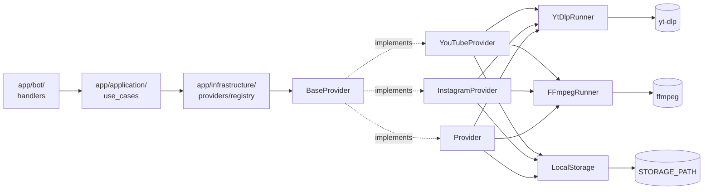
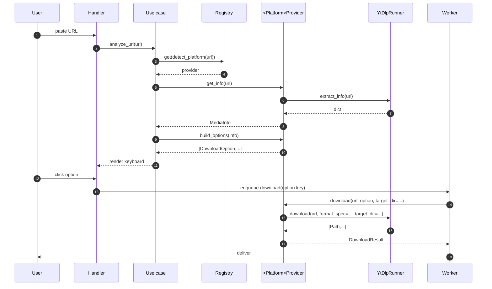
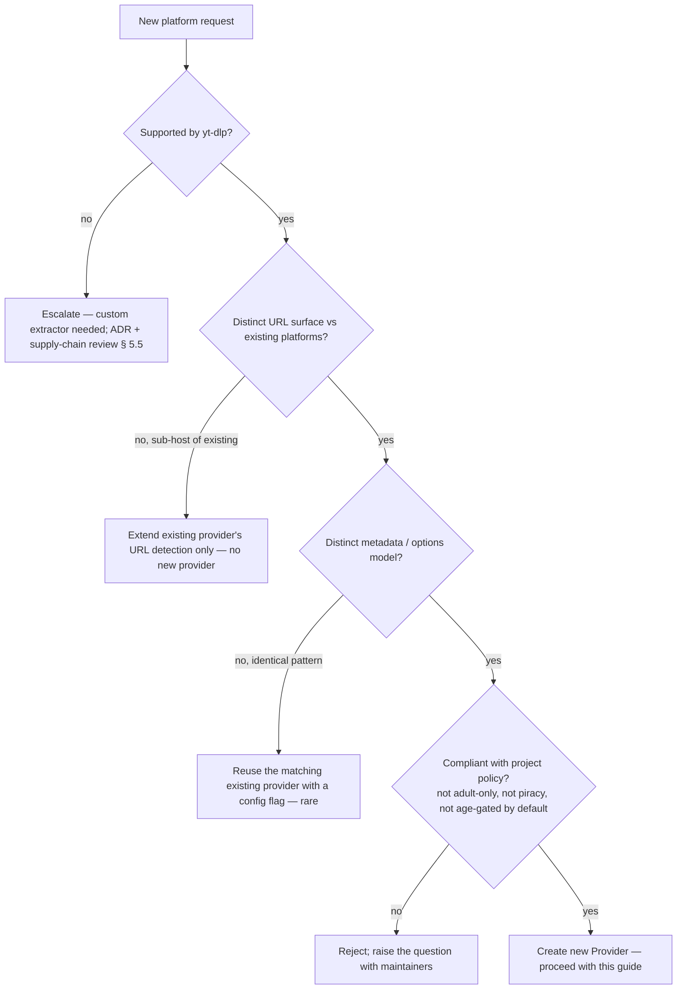

# 30 — Add a new provider (platform) guide

> Status: Stable
> Audience: every engineer or AI agent introducing a new media platform
> (TikTok, Vimeo, Twitter/X, Reddit, SoundCloud, …) into DWTGBot, **or
> tweaking an existing provider**.
> Companion docs:
> [`07-provider-architecture.md`](07-provider-architecture.md) — current providers + interfaces,
> [`08-download-pipeline.md`](08-download-pipeline.md) — pipeline anatomy,
> [`25-agent-guide.md`](25-agent-guide.md) — operating manual,
> [`26-cursor-rules.md`](26-cursor-rules.md) — operational protocol,
> [`27-coding-standards.md`](27-coding-standards.md) — code-level rules,
> [`28-implementation-playbook.md`](28-implementation-playbook.md) — change-class playbooks,
> [`29-feature-development-guide.md`](29-feature-development-guide.md) — feature-level lifecycle,
> [`adr/0005-locked-architectural-assumptions.md`](adr/0005-locked-architectural-assumptions.md) — locked decisions.

> ⚠️ **Read this BEFORE you create or modify a `<Platform>Provider`.**
>
> The eleven principles **P1–P11** referenced throughout are defined
> canonically in [`25-` §1.A](25-agent-guide.md#1a-mandatory-principles-p1p11--canonical-register)
> and [`26-` §1.A](26-cursor-rules.md#1a-mandatory-principles-p1p11--operational-register).
> The **provider contract is sacred (P8).** This document defines it.

---

## 1. Purpose of this guide

### 1.1 What this document is

The **single canonical recipe** for:

- adding a new platform (e.g. TikTok) to DWTGBot;
- extending an existing provider with a new capability (e.g. a new
  YouTube quality bucket);
- changing how an existing provider exposes metadata, options, or
  results.

It defines **the provider contract** (`BaseProvider` surface and
its semantic guarantees), the **boundary** between platform-
specific code and the rest of the system, and the **end-to-end
workflow** to ship a provider without breaking architecture, UX,
queue, deploy, or tests.

### 1.2 What this document is NOT

- It is **not** a yt-dlp tutorial — see upstream docs.
- It is **not** the queue or worker playbook — see [`28-` §13](28-implementation-playbook.md#13-playbook-changing-queue--worker-behaviour).
- It is **not** the bot UX playbook — see [`28-` §§7–8](28-implementation-playbook.md#7-playbook-adding-a-new-bot-command).
- It is **not** the security baseline — see [`17-security.md`](17-security.md).

### 1.3 Why a provider-specific guide exists

Providers are **the highest-leverage extensibility surface** in the
project (every new platform plugs in here) and **the easiest place
to break architecture**:

- platform-specific branches leak into use cases / handlers (P5,
  P6, P8 violations);
- yt-dlp output is trusted blindly (P8 violation);
- new providers smuggle queue / DB / config changes (P7, P10
  violations);
- ENUM additions land without migrations (P10);
- cookies / tokens get logged (P11);
- in-flight `DownloadOption.key` strings get renamed silently,
  breaking pending callbacks (P8).

This guide front-loads the discipline so a provider is shipped in
**one focused PR** that respects every contract.

### 1.4 Who this is for

| Reader | What this document does for them |
|---|---|
| **Engineer** | Step-by-step workflow (§24) + worked example (§25) + checklists (§§26–27) |
| **Reviewer** | A reference for "what should a provider PR look like?" + anti-patterns (§22) |
| **AI agent (Cursor, etc.)** | Verbatim contract + DO/DON'T + 25-mistake catalogue + skeletons (Appendix B) |
| **Tech lead** | Decision tree for "does this need its own provider?" (§5) |

---

## 2. Provider architecture recap

### 2.1 Where providers sit



### 2.2 The four layers a provider interacts with

| Layer | What flows in | What flows out |
|---|---|---|
| `app/application/use_cases/` (callers) | URL string + `DownloadOption.key` | `MediaInfo`, `list[DownloadOption]`, `DownloadResult` |
| `app/infrastructure/downloader/` (`YtDlpRunner`) | format spec / postprocessors / target dir | list of file paths / metadata dict |
| `app/infrastructure/postprocess/` (`FFmpegRunner`) | input file + spec | output file path |
| `app/infrastructure/storage/` (`LocalStorage`) | per-job dir | absolute `Path` rooted under `STORAGE_PATH` |

### 2.3 Lifecycle of one URL through the system



The provider is invoked **twice** for one user URL: once
synchronously (analyze) from the bot path, once asynchronously
(download) from the worker. **Both invocations must be safe**.

### 2.4 Locked architectural rows that providers must respect

From [`adr/0005-…` §2](adr/0005-locked-architectural-assumptions.md#2-decision):

- **Row 4** — provider-based design.
- **Row 5** — Redis queue (provider does not call queue directly).
- **Row 6** — Postgres as source of truth (provider returns
  domain entities, not ORM models).
- **Row 7** — temp links for large files (provider doesn't deliver
  — it just produces files; delivery is a separate concern).

A provider PR that touches any of these in a non-additive way
needs a superseding ADR.

---

## 3. Provider contract and responsibilities

### 3.1 The `BaseProvider` surface (frozen)

```python
class BaseProvider(ABC):
    platform: Platform                                   # class attribute

    def __init__(
        self,
        *,
        settings: Settings,
        ytdlp: YtDlpRunner,
        storage: LocalStorage,
    ) -> None: ...

    @abstractmethod
    async def get_info(self, url: str) -> MediaInfo: ...

    @abstractmethod
    def build_options(self, info: MediaInfo) -> list[DownloadOption]: ...

    @abstractmethod
    def default_option(self, info: MediaInfo) -> DownloadOption: ...   # ADR-0010 §2.1

    @abstractmethod
    async def probe_size(
        self, url: str, *, info: MediaInfo, option: DownloadOption
    ) -> int | None: ...

    @abstractmethod
    async def download(
        self,
        url: str,
        option: DownloadOption,
        *,
        target_dir: str,
        on_progress: Callable[[float], None] | None = None,          # ADR-0010 §2.2
    ) -> DownloadResult: ...
```

Защищённые помощники базового класса — используйте их вместо копирования
кода из существующих провайдеров:

| Помощник | Назначение |
|---|---|
| `_cookie_extra_opts(configured, *, missing_event=...)` | `{"cookiefile": path}` для yt-dlp или `None`, если путь пуст или файла нет (тогда пишется `missing_event`, например `"<platform>_cookiefile_missing"`) |
| `_merge_extra_opts(extra_opts, auth_opts)` | объединение опций вызова и авторизации; при конфликте побеждает авторизация |
| `_result_from_files(files, *, title, kind, done_event, empty_error)` | `DownloadResult` из файлов в каталоге задачи: сумма размеров, MIME первого файла, событие `done_event`; пустой список → `DownloadError(empty_error)` |

Имена событий передаются строковыми литералами, не f-строками (правило
логирования). Помощники не расширяют публичный интерфейс, поэтому ADR для
них не нужен.

**This surface is frozen.** Adding a public method, a positional
argument, or a new constructor parameter is an **architectural
change** (P2, P8) and requires:

1. an ADR (because every provider would need to implement it);
2. a sweep across **all** existing providers in the same PR;
3. registry changes if the new method needs routing.

### 3.2 Per-method semantic guarantees

#### 3.2.1 `get_info(url) -> MediaInfo`

| Property | Rule |
|---|---|
| **Async** | Yes; must not block the event loop. Always go through `YtDlpRunner.extract_info` (which uses `asyncio.to_thread`). |
| **Idempotent** | Yes. Calling twice for the same URL must return the same `MediaInfo`. |
| **Side effects** | None. No file writes, no DB writes, no Telegram calls. Read-only. |
| **Failure mode** | Raises `AppError` subclass (see §13). Never returns `None`. |
| **Output discipline** | All values must use `entry.get(key, default)` — never `entry[key]` — when reading yt-dlp output. |
| **`raw` field** | Reserved for **provider-internal** breadcrumbs (e.g. `webpage_url`, `formats`). Use cases must NOT read keys from `raw`. |

#### 3.2.2 `build_options(info) -> list[DownloadOption]`

| Property | Rule |
|---|---|
| **Sync** | Yes. **No IO.** Pure function over `MediaInfo`. |
| **Idempotent** | Yes; same input → same output (including order). |
| **Stable keys** | `DownloadOption.key` strings are part of the **public contract** with in-flight callbacks. Renaming = breaking. |
| **Bounded count** | ≤ 12 options total (Telegram inline-keyboard practical limit; ≤ 6 per row recommended). |
| **No platform leakage** | The `key` may look platform-specific (`yt_1080p`, `ig_zip`) but its **shape is opaque to the bot** — only the provider interprets it back. |

#### 3.2.3 `download(url, option, *, target_dir) -> DownloadResult`

| Property | Rule |
|---|---|
| **Async** | Yes; never block the loop. |
| **Idempotent** | Yes — running twice for the same `(url, option, target_dir)` produces an equivalent `DownloadResult`. The worker may retry. |
| **Output dir** | All produced files live **under** `target_dir` (which is itself under `STORAGE_PATH`). Validated with `ensure_within` (P11). |
| **Empty result** | An empty `files` tuple is a failure → raise `DownloadError`. |
| **Side effects** | Files written under `target_dir`; logs emitted; **no DB writes, no Telegram calls**. |
| **Failure mode** | Raises `AppError` subclass (see §13) — `RetryableError` for transient, `PermanentError` for fatal-for-this-job, `UserFacingError` for user-recoverable. |

### 3.3 What is provider-owned vs registry-owned vs caller-owned

| Concern | Owned by |
|---|---|
| URL → `Platform` mapping | `app/utils/url.py::detect_platform` |
| `Platform` → provider instance | `DefaultProviderRegistry` |
| URL → metadata (`MediaInfo`) | Provider |
| `MediaInfo` → list of options | Provider |
| `DownloadOption.key` semantics | Provider (opaque to caller) |
| Format selection / postprocessor chain | Provider |
| Subprocess execution | `YtDlpRunner` / `FFmpegRunner` (provider calls them) |
| File path safety / `ensure_within` | Provider (must call) |
| Per-job target directory | Caller (worker) — provider receives it |
| Temp link, TTL, delivery | Use case + delivery service (NOT provider) |
| Job state, retries, status | Worker (NOT provider) |

If you find yourself crossing a row in the wrong column, the
design is wrong.

---

## 4. What belongs in a provider and what does not

### 4.1 Belongs in a provider

| Concern | Yes, in `app/infrastructure/providers/<platform>/` |
|---|---|
| Platform-specific URL parsing nuance (e.g. shortcode extraction) | ✅ |
| Platform-specific yt-dlp options (format spec, postprocessors) | ✅ |
| Platform-specific metadata mapping (yt-dlp dict → `MediaInfo`) | ✅ |
| Platform-specific failure detection (DRM, geo, age-gate) | ✅ |
| Platform-specific filename sanitization quirks (e.g. emoji-heavy) | ✅ |
| Platform-specific cookies / auth handling | ✅ (path comes from config) |
| Provider-internal helpers / fixtures | ✅ (in same dir / private) |

### 4.2 Does NOT belong in a provider

| Concern | Belongs elsewhere |
|---|---|
| Telegram formatting / message text | `app/bot/keyboards/`, `app/bot/handlers/` |
| Decision to enqueue / synchronously download | `app/application/use_cases/` |
| `_job_id` derivation, retry policy | `app/workers/` |
| Temp link issuance / TTL | `app/application/services/delivery.py` |
| DB session, ORM, repository implementation | `app/infrastructure/db/` |
| Reading env directly (`os.environ`) | Pass through `Settings` |
| Sending Telegram messages | Bot layer (handler) |
| Direct Redis / arq calls | Worker layer / queue service |
| Direct `subprocess` calls | `YtDlpRunner` / `FFmpegRunner` |

### 4.3 DO / DON'T

| Do | Don't |
|---|---|
| ✅ Keep all platform branches inside `<Platform>Provider` | ❌ Add `if platform == Platform.X` in `app/application/...` (P5, P8) |
| ✅ Use `entry.get(key, default)` for every yt-dlp field | ❌ `entry["format"]` / `info["uploader"]` (P8) |
| ✅ Map yt-dlp dict → `MediaInfo` (domain entity) inside provider | ❌ Return raw yt-dlp dict to caller (P5) |
| ✅ Read auth/cookie path from injected `Settings` | ❌ `os.environ["COOKIES"]` (P5, P11) |
| ✅ Always go through `YtDlpRunner` / `FFmpegRunner` | ❌ `subprocess.run(...)` directly (P11) |
| ✅ Return absolute paths under `target_dir` | ❌ Write outside `target_dir` (cleanup misses; P11) |
| ✅ Raise typed `AppError` subclasses | ❌ `raise Exception(...)` (P11, P4) |

### 4.4 Mis-placement red flags

| Symptom | Diagnosis | Cure |
|---|---|---|
| `if platform == Platform.X:` in a use case | Platform-specific logic leaked out | Move the branch into the provider, or split into a per-platform method behind a stable signature |
| `from app.bot import …` in a provider file | Provider depends on UI layer | Remove import; UI text belongs to bot layer |
| `from app.workers import …` in a provider | Provider depends on worker | Remove; provider knows nothing about queueing |
| `from app.infrastructure.db import …` in a provider | Provider does direct DB access | Move persistence to a use case + repo |
| `os.environ[…]` in a provider | Bypassed `Settings` | Inject the value via constructor |
| `subprocess.run(…)` in a provider | Bypassed runners | Use `YtDlpRunner` / `FFmpegRunner` |

---

## 5. Criteria for deciding whether a new platform deserves a provider

### 5.1 Decision tree



### 5.2 The seven-question deserve-a-provider gate

A new platform deserves its own provider when **all** are true:

- [ ] `yt-dlp -F <url>` returns formats for ≥3 representative URL
      shapes (no extractor work needed).
- [ ] The platform has **distinct** URL hosts not already handled.
- [ ] The metadata model is meaningfully different from existing
      providers (gallery vs single, audio-first vs video-first,
      live vs VOD, …).
- [ ] The expected user volume justifies the maintenance burden
      (yt-dlp upstream changes, periodic breakages).
- [ ] No legal / policy red flag (adult-only platform, piracy-only
      site, content the bot should not redistribute).
- [ ] No hard auth requirement that we can't satisfy (e.g.
      mandatory OAuth flow per user — out of scope).
- [ ] The platform works from NL-2's IP range (в `single` — IP единственного хоста) (no hard geo block
      from Netherlands).

Each unchecked box must be **explicitly waived** in the design
note (§7 of `29-`) with reasoning.

### 5.3 When NOT to add a new provider

- Just for a new URL **shape** of an existing platform
  (e.g. `youtube.com/shorts`) → extend `_YOUTUBE_HOSTS` and the
  detection logic; no new provider.
- For a CDN or mirror that ultimately resolves to an existing
  platform → handle the redirect inside the existing provider.
- "Just in case" platforms with no immediate user demand → wait;
  every provider carries maintenance cost.

### 5.4 When to extend an existing provider instead

- New format / quality / bitrate bucket → modify
  `<Platform>Provider.build_options` and tests.
- Better metadata extraction → modify `<Platform>Provider.get_info`.
- New URL host alias for the same platform → modify
  `app/utils/url.py` host set + tests.

These are **F-Prov** changes per [`29-` §11](29-feature-development-guide.md#11-developing-a-provider-related-feature),
not new providers.

### 5.5 Escalation: non-yt-dlp custom extractor

If yt-dlp does not support the platform:

1. **Stop.** Open an ADR — this changes architecture (a new
   external code surface, supply-chain risk, custom maintenance).
2. Implement an *extractor* in
   `app/infrastructure/extractors/<platform>.py` with a
   provider-internal interface.
3. The provider class wraps the extractor and **still conforms to
   `BaseProvider` exactly** — public surface unchanged.
4. Pin and vendor any third-party scraper carefully ([`17-` §3](17-security.md)).
5. Independent review for the supply-chain risk.

---

## 6. Pre-implementation checklist for a new provider

This is the **gate before any file edit**. Cross-ref §5.1 of
[`28-`](28-implementation-playbook.md#51-planning-note-template-verbatim--emit-before-any-file-edit) and §7.1 of
[`29-`](29-feature-development-guide.md#71-mini-design-note-template-verbatim) for the verbatim plan / mini-design note.

### 6.1 The fourteen-question gate

- [ ] **Platform name + canonical hosts identified** (≥3 URL
      shapes: canonical, share/short, mobile/embed).
- [ ] **`yt-dlp -j <url>` inspected on a real URL** — actual JSON
      keys recorded; no guessing.
- [ ] **`yt-dlp -F <url>` inspected** — known formats listed.
- [ ] **Auth requirement decided** — none / cookies / OAuth /
      token; storage location for secrets if any.
- [ ] **Geo / age / DRM constraints noted** — what fails from
      NL-2 IP (в `single` — IP хоста), anonymous user.
- [ ] **Media model decided** — single video / single audio /
      gallery / playlist / live (only first three are first-class
      supported).
- [ ] **Option set sketched** — list of `DownloadOption.key`
      strings (≤ 12).
- [ ] **`Platform` enum addition planned** — including the
      `ALTER TYPE ... ADD VALUE` migration shape (P10).
- [ ] **Registry wiring planned** — entry in `app/composition/`.
- [ ] **Failure modes enumerated** — geo block, private content,
      DRM, age gate, deleted, rate-limited.
- [ ] **Logging events named** — `<platform>_get_info_started`,
      `<platform>_download_done`, etc. (added to [`14-`](14-logging-observability.md)).
- [ ] **Test plan written** — fixture file path, ≥3 URL detection
      cases, ≥4 failure-mode cases.
- [ ] **Docs to update listed** — `07-`, `12-` (ENUM), `13-` if
      auth, `14-`, `30-` (worked-examples row).
- [ ] **§7 mini-design note (`29-` §7.1) emitted** — including
      `Out-of-scope`, `Layers explicitly NOT touched`, rollback
      story.

If even one box is unchecked, **do not start coding**.

### 6.2 What to record from `yt-dlp -j` (mandatory)

For the chosen sample URL, save into the design note:

- `id` (and stability across runs)
- `title`, `uploader`, `webpage_url`
- `duration` (seconds; missing for live)
- `thumbnail` / `thumbnails`
- `formats` summary (count, distinct heights, distinct codecs)
- presence of `entries` (gallery vs single)
- any platform-specific quirk (e.g. `is_live`, `was_live`)

This is **not optional**. Every later mistake about provider
output traces back to skipping this step (P8).

### 6.3 Anti-patterns at the gate

| Symptom at the gate | Likely violation | Cure |
|---|---|---|
| "yt-dlp will probably handle it" — no real test | P2, P8 | Run `yt-dlp -j` now; record results |
| One URL sample only | P8 | Test ≥3 shapes — each one is a different code path in `detect_platform` |
| "Cookies later, no biggie" | P11 | If auth is required, design env + storage + redaction now |
| "Gallery flag — figure it out in code" | P2 | Decide media model before files are touched |
| "Migration is trivial — autogen will handle the ENUM" | P10 | Autogen does NOT detect `ALTER TYPE ADD VALUE`; hand-write |

### 6.4 Gather the gate answers — literal commands

Run these in your local shell (or a throwaway venv with `yt-dlp`
installed). Paste the output **verbatim** into the design note —
do not paraphrase.

```bash
# 0) Make sure yt-dlp is installed and up-to-date
python3 -m pip install -U yt-dlp >/dev/null
yt-dlp --version
# expected: a yyyy.mm.dd version. Record it in the design note.

# 1) Pick three representative URL shapes for the platform.
#    Example for TikTok:
URL_CANON="https://www.tiktok.com/@officialtiktok/video/7290000000000000000"
URL_SHORT="https://vm.tiktok.com/ZS6abcdef/"
URL_MOBILE="https://m.tiktok.com/v/7290000000000000000.html"

# 2) For each URL, dump full metadata as JSON.
#    --no-warnings keeps the output JSON-clean.
#    --no-playlist avoids fanning out into channel pages.
for U in "$URL_CANON" "$URL_SHORT" "$URL_MOBILE"; do
  echo "=== $U ==="
  yt-dlp -j --no-warnings --no-playlist "$U" \
    | python3 -c 'import json,sys;d=json.load(sys.stdin);
print({k: d.get(k) for k in
       ("id","title","uploader","webpage_url","duration",
        "thumbnail","is_live","was_live","drm",
        "extractor","extractor_key")})'
done

# 3) For each URL, dump available formats.
for U in "$URL_CANON" "$URL_SHORT" "$URL_MOBILE"; do
  echo "=== $U ==="
  yt-dlp -F --no-warnings "$U" | head -40
done

# 4) Probe a known FAILURE shape (private/live/geo) to confirm
#    the exception class yt-dlp surfaces for that platform.
URL_FAIL="https://www.tiktok.com/@nonexistent/video/0"
yt-dlp -j --no-warnings "$URL_FAIL" 2>&1 | tail -20
# Record the exception class name (yt_dlp.utils.<X>) and the
# message substring you'll match in the catch-and-translate block.
```

What you must persist into the design note from this output:

| Field | Source command | Where it lives in the doc later |
|---|---|---|
| yt-dlp version on which fixtures were recorded | `yt-dlp --version` | Top of §25.1 design note |
| `extractor_key` per URL shape | `yt-dlp -j` | Mini-design note, sanity check |
| `id`, `title`, `duration`, `thumbnail`, `webpage_url` | `yt-dlp -j` | §8 mapping → `MediaInfo` |
| Presence of `entries`, `is_live`, `was_live`, `drm` | `yt-dlp -j` | §§8, 12 (rejection rules) |
| Distinct `format_id` count, codecs, max height | `yt-dlp -F` | §9 `build_options` shape |
| Failure-mode exception class + matching substring | `yt-dlp -j` on bad URL | §13 catch-and-translate code |

Save the cleaned-up JSON of one happy-path URL to
`app/tests/fixtures/yt_dlp_<platform>_video.json` immediately —
that's the fixture the unit tests will load.

```bash
# Save the fixture — happy-path video
mkdir -p app/tests/fixtures
yt-dlp -j --no-warnings --no-playlist "$URL_CANON" \
  > app/tests/fixtures/yt_dlp_<platform>_video.json
python3 -c 'import json; json.load(open("app/tests/fixtures/yt_dlp_<platform>_video.json"))' \
  && echo "fixture parses as JSON ✓"
```

> ⚠️ Strip / replace any user-identifying fields (real handle,
> uploader email, signed URL with token query) from the saved
> fixture before committing. Fixtures are public.

### 6.5 Gate verification — copy-paste sanity script

After you have answered every question in §6.1 and run §6.4, run
this **before** opening any code file:

```bash
PLAT=tiktok                                     # set to your platform
NOTE=docs/_drafts/${PLAT}-design-note.md        # path to your design note
test -s "$NOTE" \
  && grep -q '^- yt-dlp version'   "$NOTE" \
  && grep -q '^- Extractor key'    "$NOTE" \
  && grep -q '^- In-scope'         "$NOTE" \
  && grep -q '^- Out-of-scope'     "$NOTE" \
  && grep -q '^- Failure modes'    "$NOTE" \
  && grep -q '^- Rollback'         "$NOTE" \
  && echo "design note PASSES the gate ✓" \
  || { echo "design note INCOMPLETE — fix before coding ✗"; exit 1; }

ls app/tests/fixtures/yt_dlp_${PLAT}_*.json \
  && echo "at least one fixture present ✓" \
  || echo "no fixture recorded yet — record one before §16 tests"
```

If the script does not print both `✓` lines, **stop**. The gate
failed; coding now will violate P1 + P8.

---

## 7. URL detection and routing rules

### 7.1 The host-set discipline

URL detection is **always** performed on the parsed `netloc`,
**never** by substring. Substring matching collides with
adversarial inputs (`https://evil.com/?u=tiktok.com`) and is a P11
violation.

```python
# app/utils/url.py — canonical pattern
from urllib.parse import urlparse
from app.domain.enums import Platform
from app.exceptions import InvalidUrlError, UnsupportedPlatformError

_TIKTOK_HOSTS: frozenset[str] = frozenset({
    "tiktok.com",
    "www.tiktok.com",
    "m.tiktok.com",
    "vm.tiktok.com",
    "vt.tiktok.com",
})

def detect_platform(url: str) -> Platform:
    parsed = urlparse(url)
    if parsed.scheme not in {"http", "https"}:
        raise InvalidUrlError("URL must be http(s)")
    if not parsed.netloc:
        raise InvalidUrlError("URL is missing host")
    host = parsed.netloc.lower().split(":")[0]    # strip port
    if host in _YOUTUBE_HOSTS:
        return Platform.YOUTUBE
    if host in _INSTAGRAM_HOSTS:
        return Platform.INSTAGRAM
    if host in _TIKTOK_HOSTS:
        return Platform.TIKTOK
    raise UnsupportedPlatformError(f"Host not supported: {host}")
```

### 7.2 Rules

- **Hosts live in a `frozenset[str]`** — explicit, not regex.
- **Lowercased + port-stripped** before lookup.
- **Scheme allow-list** = `{"http", "https"}` only.
- **Short-link hosts are added** (e.g. `vm.tiktok.com`) — yt-dlp
  resolves the redirect itself; no need for a manual HTTP call.
- **Unknown host raises `UnsupportedPlatformError`** — never
  silently fall through.

### 7.3 Test obligations

For every new platform: ≥ 3 parametrized cases in
`app/tests/test_url_detection.py`:

- canonical desktop URL,
- mobile / embed URL,
- short-link URL.

Plus ≥ 2 negative cases:

- malicious substring containing the platform name in path/query
  but a foreign host → `UnsupportedPlatformError`,
- `ftp://...`, `file://...` → `InvalidUrlError`.

### 7.4 DO / DON'T

| Do | Don't |
|---|---|
| ✅ Match parsed `netloc` lowercased | ❌ `"tiktok" in url` (P11) |
| ✅ Use `frozenset` for host sets | ❌ `list` (slower) or `set` (mutable) |
| ✅ Strip port | ❌ Compare `tiktok.com:443` literally |
| ✅ Reject `ftp/file` early | ❌ Trust the scheme |
| ✅ Add ≥3 URL shape test cases | ❌ One test per platform (P4) |

---

## 8. Metadata extraction rules

### 8.1 The `get_info` discipline

`get_info` maps the **untrusted** yt-dlp dict into a typed
`MediaInfo` domain entity, with safe defaults for every field.

```python
async def get_info(self, url: str) -> MediaInfo:
    raw = await self._ytdlp.extract_info(url)
    entry: dict[str, Any] = raw["entries"][0] if raw.get("entries") else raw

    media_id = str(entry.get("id") or "")
    if not media_id:
        raise DownloadError("yt-dlp returned no media id")

    return MediaInfo(
        platform=Platform.TIKTOK,
        media_id=media_id,
        title=str(entry.get("title") or "TikTok video"),
        kind=MediaKind.VIDEO,
        duration_sec=float(entry["duration"]) if entry.get("duration") else None,
        thumbnail_url=entry.get("thumbnail"),
        items=(),                       # gallery only
        raw={
            "source_url": url,
            "webpage_url": entry.get("webpage_url"),
        },
    )
```

### 8.2 Rules

- **Every yt-dlp read** uses `entry.get(key, default)`, never
  `entry[key]`.
- **`media_id` is mandatory** — if missing, raise `DownloadError`
  (data integrity).
- **`title` defaults to a static string** — never `None`.
- **`duration_sec` is `None` when absent**, never `0` (a real
  zero-duration audio is not the same as missing duration).
- **`raw` is for provider-internal continuity only** — callers must
  not read keys from it.
- **Live streams** (`entry.get("is_live")`) are rejected here with
  a `UserFacingError` (we don't deliver live to Telegram).
- **DRM-flagged content** (yt-dlp surfaces this) → reject with a
  user-meaningful message.

### 8.3 Gallery / playlist handling

- If `raw.get("entries")` is non-empty, treat as a gallery.
- For galleries, populate `items: tuple[MediaItem, ...]` and use a
  `kind` reflecting the most common item kind (or `MediaKind.MIXED`
  if heterogeneous — define in `app/domain/enums.py` if needed).
- For playlists you do **not** want to deliver as a bundle (e.g. a
  YouTube channel page), reject with `UserFacingError`.

### 8.4 DO / DON'T

| Do | Don't |
|---|---|
| ✅ `entry.get("title") or "default"` | ❌ `entry["title"]` (P8) |
| ✅ Reject `is_live` early | ❌ Try to download a live stream (P8) |
| ✅ Reject DRM with a user message | ❌ Let yt-dlp crash mid-download (P8) |
| ✅ Cast types explicitly (`str(...)`, `float(...)`) | ❌ Trust yt-dlp's types (changes between versions) |
| ✅ Keep `raw` provider-internal | ❌ Read `raw[...]` from a use case (P5) |
| ✅ Map gallery to `items` tuple | ❌ Return only the first entry silently |

---

## 9. Download options construction rules

### 9.1 The `build_options` discipline

`build_options` is **pure** — same input always yields the same
output, in the same order. It is called from the bot path
synchronously; it must not block.

```python
def build_options(self, info: MediaInfo) -> list[DownloadOption]:
    return [
        DownloadOption(
            key="video_default",
            label="Скачать видео",
            kind=MediaKind.VIDEO,
            container="mp4",
        ),
        DownloadOption(
            key="audio_mp3",
            label="Только аудио (MP3)",
            kind=MediaKind.AUDIO,
            bitrate_kbps=192,
            container="mp3",
        ),
    ]
```

### 9.2 Key naming convention (mandatory, public contract)

- `key` strings are **stable forever** once shipped (in-flight
  callbacks reference them).
- Pattern: `<media_kind>[_<quality_or_format>]`, e.g. `video_720p`,
  `audio_mp3`, `gallery_zip`.
- Platform-specific prefixes are allowed (`yt_1440p`,
  `ig_zip_orig`) when ambiguity matters across providers in the
  long term.
- Once a `key` is published, **renaming = breaking change**.

If a `key` must change semantics, add a **new key** alongside the
old one and let `build_options` choose which to expose (gates by
`Settings`).

### 9.3 Telegram inline-keyboard limits

| Limit | Recommended | Hard |
|---|---|---|
| Total buttons | ≤ 6 | ≤ 12 |
| Buttons per row | ≤ 3 | ≤ 6 |
| `callback_data` size | encode an **id**, not the option | 64 bytes |

If your provider would naturally produce more options, group them
under a "More qualities…" sub-menu (separate flow, F-Flow per
[`29-` §10](29-feature-development-guide.md#10-developing-a-new-callback-driven-flow)).

### 9.4 DO / DON'T

| Do | Don't |
|---|---|
| ✅ Return the same options for the same `MediaInfo` | ❌ Vary order between calls (test stability) |
| ✅ Stable `key` strings | ❌ Rename keys silently (P8) |
| ✅ ≤ 12 options total | ❌ "Show all 30 yt-dlp formats" (P6) |
| ✅ Localized `label` (Russian) | ❌ Embed user-facing text in the `key` (P5, P6) |
| ✅ `kind` matches what `download` will produce | ❌ Mismatched `kind` (delivery picks wrong path) |
| ✅ Validate option availability at use case level too | ❌ Trust the user always sends a valid `key` (P11) |

---

## 10. Download execution rules

### 10.1 The `download` discipline

`download` is the **only** point where files are produced. It is
called from the worker, may be retried, and must be **idempotent**.

```python
async def download(
    self,
    url: str,
    option: DownloadOption,
    *,
    target_dir: str,
) -> DownloadResult:
    out_dir = self._target_path(target_dir)
    out_dir.mkdir(parents=True, exist_ok=True)

    if option.kind is MediaKind.AUDIO:
        files = await self._ytdlp.download(
            url,
            format_spec="bestaudio/best",
            target_dir=out_dir,
            postprocessors=[{
                "key": "FFmpegExtractAudio",
                "preferredcodec": "mp3",
                "preferredquality": str(option.bitrate_kbps or 192),
            }],
        )
        files = [p for p in files if p.suffix.lower() == ".mp3"] or files
        kind = MediaKind.AUDIO
    elif option.kind is MediaKind.VIDEO:
        files = await self._ytdlp.download(
            url,
            format_spec=self._format_spec_for(option),
            target_dir=out_dir,
            merge_output_format="mp4",
        )
        kind = MediaKind.VIDEO
    else:
        raise DownloadError(f"Unsupported kind for TikTok: {option.kind}")

    if not files:
        raise DownloadError("TikTok download produced no files")

    total = sum(f.stat().st_size for f in files if f.exists())
    primary = files[0]
    mime = mimetypes.guess_type(primary.name)[0] or "application/octet-stream"
    return DownloadResult(
        files=tuple(str(f) for f in files),
        total_size_bytes=total,
        primary_mime=mime,
        title=out_dir.name,
        kind=kind,
    )
```

### 10.2 Rules

- **All file writes go under `target_dir`** — caller-controlled,
  per-job. The worker handles cleanup; the provider must not
  invent its own scratch dir.
- **`ensure_within(STORAGE_PATH, target_dir)` guarantee** — already
  enforced by the worker / `LocalStorage` before `download` is
  called; the provider re-verifies any path it constructs from
  yt-dlp output.
- **Empty result is a failure** — never silently return
  `DownloadResult(files=(), …)`.
- **Subprocess discipline (P11)** — never `subprocess.run(...)`.
  Always `YtDlpRunner` / `FFmpegRunner` (which use
  `asyncio.create_subprocess_exec` with arg lists, never `shell=True`).
- **Timeouts** — `YtDlpRunner` already wraps with `asyncio.wait_for`;
  if you add an extra ffmpeg pass, wrap it too.
- **Idempotency** — if the worker retries, the same
  `(url, option, target_dir)` triple must produce an equivalent
  result. Re-running should not double-process or double-write.

### 10.3 Retryable vs permanent (raised by `download`)

See §13 for the full taxonomy. Quick rule:

| Cause | Class |
|---|---|
| Network blip, 5xx, 429 | `RetryableError` |
| Geo block | `UserFacingError` (permanent for this user) |
| Private / removed content | `UserFacingError` |
| DRM | `UserFacingError` |
| Empty `formats` | `UserFacingError` |
| ffmpeg malformed input | `PermanentError` (data integrity) |
| Unexpected programmer error | bubble (let arq mark `failed`) |

### 10.4 DO / DON'T

| Do | Don't |
|---|---|
| ✅ Use injected `YtDlpRunner` / `FFmpegRunner` | ❌ `subprocess.run(...)` (P11) |
| ✅ Write under `target_dir` only | ❌ Write to `/tmp` or a custom scratch (P9, P11) |
| ✅ Wrap external calls with timeouts | ❌ Indefinite hangs (P9) |
| ✅ Raise typed errors per §13 | ❌ Bare `Exception(...)` (P11, P4) |
| ✅ Idempotent on retry | ❌ Double-side-effect on retry (P7) |
| ✅ Validate produced filenames | ❌ Trust yt-dlp's filename for path traversal (P11) |
| ✅ Log `<platform>_download_started` / `_done` with sizes | ❌ Log full URL with token (P11) |

---

## 11. File handling rules

### 11.1 Path safety (P11)

Every produced file path passes through:

1. **`sanitize_filename`** — strips path separators, NUL, leading
   dots; re-encodes to ASCII-safe form for yt-dlp's output template
   when the title comes from user-controlled metadata.
2. **`ensure_within(STORAGE_PATH, file_path)`** — guarantees no
   `..` traversal escape.

```python
from app.utils.fs import ensure_within, sanitize_filename

safe_name = sanitize_filename(info.title)
out_path = out_dir / safe_name
ensure_within(self._settings.storage_path, out_path)
```

### 11.2 Output template discipline

When passing `outtmpl` to yt-dlp, **never** include raw
user-controlled fields:

```python
# BAD — title may contain '/'
outtmpl = f"{out_dir}/%(title)s.%(ext)s"

# GOOD — bind to id
outtmpl = f"{out_dir}/%(id)s.%(ext)s"
# rename to a sanitized human name AFTER download
```

### 11.3 Cleanup contract

- **Per-job cleanup is the worker's job** — it removes
  `target_dir` after delivery / failure (see [`23-cleanup-retention.md`](23-cleanup-retention.md)).
- The provider must **only** write under `target_dir`. Anything
  outside escapes cleanup and accumulates as disk garbage.
- Retries must not orphan files — write under `target_dir`, which
  is preserved across retries of the same `_job_id`.

### 11.4 DO / DON'T

| Do | Don't |
|---|---|
| ✅ `sanitize_filename` for any title-derived name | ❌ Trust `entry.get("title")` for paths (P11) |
| ✅ `ensure_within(STORAGE_PATH, path)` for every output | ❌ `os.path.join(STORAGE_PATH, untrusted)` (P11) |
| ✅ Use `%(id)s` in `outtmpl` | ❌ Use `%(title)s` raw in `outtmpl` (P11) |
| ✅ Stay under `target_dir` | ❌ Write to `/tmp` or `~` (P9, P11) |
| ✅ Use absolute paths in `DownloadResult.files` | ❌ Relative paths (delivery breaks) |

---

## 12. Provider-specific validation rules

### 12.1 Validation that lives in the provider

| Check | Where |
|---|---|
| URL syntax (scheme + host) | `app/utils/url.py` |
| Platform support | `app/utils/url.py` (raises `UnsupportedPlatformError`) |
| Live stream rejection | `<Platform>Provider.get_info` |
| DRM rejection | `<Platform>Provider.get_info` or `download` (whichever surfaces first) |
| Private / age-gated rejection | `<Platform>Provider.get_info` (when surfaced by yt-dlp) |
| Empty `formats` | `<Platform>Provider.get_info` |
| Per-platform size cap (rare) | `<Platform>Provider.download` |

### 12.2 Validation that does NOT live in the provider

| Check | Where |
|---|---|
| Telegram 50 MB direct-send threshold | `app/application/services/delivery.py` |
| Job concurrency cap | `app/application/services/queue.py` |
| User rate limiting | `app/bot/middleware/` (per-user throttle) |
| Domain-wide allowlist / denylist | `app/utils/url.py` |
| Cookie file existence | `app/config.py` validator |

### 12.3 DO / DON'T

| Do | Don't |
|---|---|
| ✅ Validate platform-specific constraints in the provider | ❌ Reach into `Settings.telegram_max_bytes` from a provider (P5) |
| ✅ Reject early in `get_info` when possible | ❌ Let `download` produce a 1 GB file just to discover it's too large (P7) |
| ✅ Surface a user-meaningful message (`UserFacingError`) | ❌ Surface yt-dlp's raw error string (P11) |

---

## 13. Error handling rules

### 13.1 Provider error taxonomy

Every error a provider raises must be a typed `AppError` subclass.
There are four buckets:

| Class | Meaning | Worker behaviour | User-facing message? |
|---|---|---|---|
| `RetryableError` | Transient external failure (network, 5xx, 429) | Retry with backoff (bounded) | "Сервис временно недоступен, попробуйте позже" |
| `UserFacingError` | Permanent for this URL/option, but user can act (geo, private, DRM, removed, age-gated) | Mark `failed`, no retry | Specific human message |
| `PermanentError` | Permanent failure, NOT user-recoverable (data integrity, malformed input) | Mark `failed`, no retry | "Не удалось обработать файл" |
| `AppError` (uncaught subclass) | Programmer error / unexpected | Let it bubble to arq → `failed` | Generic "Произошла ошибка" |

### 13.2 Mapping cheat sheet

| Symptom | Class to raise |
|---|---|
| `ConnectionError`, `TimeoutError` from yt-dlp | `RetryableError("network_timeout")` |
| HTTP 429 / 5xx surfaced by yt-dlp | `RetryableError("upstream_5xx")` |
| `yt_dlp.utils.GeoRestrictedError` | `UserFacingError("geo_restricted")` |
| `yt_dlp.utils.UnsupportedError` | `UserFacingError("unsupported_url")` |
| Live stream detected | `UserFacingError("live_not_supported")` |
| DRM flag in metadata | `UserFacingError("drm_protected")` |
| `entries` empty / no `formats` | `UserFacingError("no_formats")` |
| `ffmpeg` non-zero exit | `PermanentError("ffmpeg_failed")` |
| `download` returned no files | `DownloadError("empty_result")` |

### 13.3 The catch-and-translate pattern

```python
try:
    raw = await self._ytdlp.extract_info(url)
except yt_dlp.utils.GeoRestrictedError as exc:
    raise UserFacingError("geo_restricted", details=str(exc)) from exc
except yt_dlp.utils.DownloadError as exc:
    if "HTTP Error 429" in str(exc) or "HTTP Error 5" in str(exc):
        raise RetryableError("upstream_5xx", details=str(exc)) from exc
    raise UserFacingError("unsupported_url", details=str(exc)) from exc
```

### 13.4 What is NEVER done

- ❌ `raise Exception("something broke")` — untyped errors break
  worker classification.
- ❌ `except Exception: pass` — silently lost failures.
- ❌ `except Exception: log.error(...); return DownloadResult(files=(), ...)`
  — empty result is a contract violation.
- ❌ Embedding the user's URL in the error message (PII / token
  leak risk; P11). Log the host instead.

### 13.5 DO / DON'T

| Do | Don't |
|---|---|
| ✅ Raise typed `AppError` subclass | ❌ `raise Exception(...)` (P11) |
| ✅ Catch yt-dlp specific exceptions; classify | ❌ `except Exception` (P7, P11) |
| ✅ Use `from exc` to preserve cause | ❌ Lose stack trace |
| ✅ Sanitize `details` (strip URLs/cookies) | ❌ Embed raw URLs in error messages (P11) |
| ✅ Log the classification (`error_class=...`) | ❌ Log the raw exception text only |

---

## 14. Retryability rules

### 14.1 The single rule

**Only `RetryableError` is retried.** Everything else is terminal
for the job (the worker marks `failed`, no more attempts).

### 14.2 Retry budget

- Per [`28-` §13](28-implementation-playbook.md#13-playbook-changing-queue--worker-behaviour),
  `max_tries` is bounded (typically 3–5).
- Backoff is `arq`'s exponential jitter; do not implement custom
  retry loops inside the provider.
- A `RetryableError` raised on the **last** try becomes a job
  failure; that's by design.

### 14.3 Idempotency under retry

For `download`, the third call must produce the same observable
state as the first:

- Same files at the same paths under `target_dir` (overwrite is
  fine).
- Same `DownloadResult.files` length and total size (modulo
  upstream changes).
- No double-charging an external resource (no API quota burned
  twice for the same logical work — providers don't typically have
  this concern, but if you add one, design for idempotency).

### 14.4 DO / DON'T

| Do | Don't |
|---|---|
| ✅ Raise `RetryableError` for transient failures only | ❌ Raise `RetryableError` for "user pasted a private link" (infinite retry of doomed work) (P7) |
| ✅ Make `download` idempotent | ❌ Append to a counter on each retry (P7) |
| ✅ Trust arq for backoff | ❌ `await asyncio.sleep(60); retry()` inside provider (P7) |
| ✅ Final `RetryableError` → `failed` is acceptable | ❌ Catch `RetryableError` and "convert" to a user error (lose retry signal) |

---

## 15. Logging rules for providers

### 15.1 Mandatory events

For every provider, emit these structured events (catalogue them
in [`14-`](14-logging-observability.md)):

| Event | When | Level | Required fields |
|---|---|---|---|
| `<platform>_get_info_started` | Top of `get_info` | INFO | `request_id`, `url_host`, `url_path_hash` |
| `<platform>_get_info_done` | Bottom of `get_info` (success) | INFO | + `media_id`, `kind`, `duration_sec` |
| `<platform>_download_started` | Top of `download` | INFO | `job_id`, `option_key`, `target_dir` |
| `<platform>_download_done` | Bottom of `download` (success) | INFO | + `files_count`, `total_bytes`, `primary_mime` |
| `<platform>_classified_error` | In the catch-and-translate block | WARNING | `error_class`, `details_truncated` |
| `<platform>_unexpected_error` | `except Exception:` (rare; programmer error) | ERROR | full traceback (no secrets) |

### 15.2 Fields to include

- `request_id` (analyze path) or `job_id` (worker path) — bound at
  the caller, not added per-event.
- `url_host` — never the full URL.
- `url_path_hash` — first 8 chars of `sha256(path)` for grouping.
- `option_key` — opaque, safe to log.
- `media_id` — safe to log.
- `target_dir` — relative to `STORAGE_PATH`, not absolute.

### 15.3 Fields NEVER to log

- Full URLs (PII / token risk).
- Cookies, `Authorization` headers, OAuth tokens.
- yt-dlp's full `info` dict (often contains user IDs, signed URLs).
- File contents.
- Error messages containing URLs verbatim — sanitize first.

### 15.4 DO / DON'T

| Do | Don't |
|---|---|
| ✅ Constant `<platform>_<noun>_<verb>` event name | ❌ F-string event name (`f"tiktok_{id}_done"`) (P4) |
| ✅ Bind `request_id` / `job_id` at caller | ❌ Pass them through every call as args (P4) |
| ✅ Log `url_host`, `url_path_hash` | ❌ Log full URL (P11) |
| ✅ Truncate `details` to ≤ 500 chars | ❌ Dump full yt-dlp info dict (P11) |
| ✅ Add new events to `14-` catalogue same PR | ❌ Land code emitting unfindable events (P4) |

---

## 16. Testing requirements for a new provider

### 16.1 Minimum test files

- `app/tests/test_url_detection.py` — extend with new platform
  cases (≥3 positive, ≥2 negative).
- `app/tests/test_providers_<platform>.py` — new file.
- `app/tests/fixtures/yt_dlp_<platform>_<scenario>.json` — recorded
  yt-dlp output for each scenario.

### 16.2 Scenarios that MUST be covered

| # | Scenario | Method | Expected |
|---|---|---|---|
| 1 | Happy path — single video | `get_info` | Valid `MediaInfo` with `kind=VIDEO` |
| 2 | Happy path — single audio (if applicable) | `get_info` | `kind=AUDIO` |
| 3 | Gallery (if applicable) | `get_info` | `items` non-empty |
| 4 | Live stream | `get_info` | Raises `UserFacingError("live_not_supported")` |
| 5 | DRM (if applicable) | `get_info` | Raises `UserFacingError("drm_protected")` |
| 6 | Geo-blocked | `get_info` | Raises `UserFacingError("geo_restricted")` |
| 7 | Private / removed | `get_info` | Raises `UserFacingError(...)` |
| 8 | Empty `formats` | `get_info` | Raises `UserFacingError("no_formats")` |
| 9 | yt-dlp 429 | `get_info` | Raises `RetryableError("upstream_5xx")` |
| 10 | `build_options` stability | `build_options` | Two calls produce identical lists |
| 11 | `build_options` shape | `build_options` | ≤12 options; all `key`s unique |
| 12 | `download` happy video | `download` | `DownloadResult.files` non-empty; under `target_dir` |
| 13 | `download` happy audio | `download` | Audio file extension matches |
| 14 | `download` empty result | `download` | Raises `DownloadError("empty_result")` |
| 15 | `download` idempotent | `download` (run twice) | Same `files` tuple length, sizes equivalent |

### 16.3 Hermetic test discipline (P4)

- **No real yt-dlp calls** in unit tests. Inject a `FakeYtDlp`
  (skeleton in [Appendix B.2](#b2--fakeytdlp-skeleton)).
- **No real ffmpeg calls** — inject a fake `FFmpegRunner` if
  needed.
- **No real network**. Anything that needs the wire is marked
  `@pytest.mark.integration` and excluded from default CI.
- Use **recorded fixtures** (`yt_dlp -j <url> > fixture.json`) to
  drive `FakeYtDlp.extract_info`. Refresh quarterly or when
  upstream changes.

### 16.4 URL detection test pattern

```python
import pytest
from app.utils.url import detect_platform
from app.domain.enums import Platform
from app.exceptions import UnsupportedPlatformError, InvalidUrlError


@pytest.mark.parametrize("url", [
    "https://www.tiktok.com/@u/video/12345",
    "https://vm.tiktok.com/ZS6abc/",
    "https://m.tiktok.com/v/12345.html",
])
def test_tiktok_detection_positive(url):
    assert detect_platform(url) is Platform.TIKTOK


@pytest.mark.parametrize("url", [
    "https://evil.com/?u=tiktok.com",                # substring trap
    "https://example.org/tiktok/video/1",
])
def test_tiktok_detection_negative(url):
    with pytest.raises(UnsupportedPlatformError):
        detect_platform(url)


def test_invalid_scheme_rejected():
    with pytest.raises(InvalidUrlError):
        detect_platform("ftp://www.tiktok.com/@u/video/12345")
```

### 16.5 DO / DON'T

| Do | Don't |
|---|---|
| ✅ Inject `FakeYtDlp` fixture | ❌ Call real `yt-dlp` in unit tests (P4) |
| ✅ Cover all 15 scenarios from §16.2 | ❌ "Happy path only" coverage (P4) |
| ✅ Refresh recorded JSON quarterly or on upstream break | ❌ Pin a 3-year-old fixture (P4) |
| ✅ Test that `build_options` is stable across calls | ❌ Skip option-stability test (P8) |
| ✅ Test idempotency of `download` (call twice) | ❌ Skip retry test (P7) |
| ✅ Mark integration tests | ❌ Mix integration + unit in CI (P4) |

### 16.6 Runnable test commands

Exact invocations to copy-paste. Each block is self-contained.

**Run only your new provider's tests (fastest dev loop):**

```bash
PLAT=tiktok
pytest -x -q app/tests/test_providers_${PLAT}.py
# -x = stop at first failure
# -q = quiet (one dot per test)
```

**Run URL detection cases for the new platform only:**

```bash
PLAT=TIKTOK
pytest -x -q -k "${PLAT,,}" app/tests/test_url_detection.py
# expected: at least 5 tests collected (3 positive + 2 negative)
```

**Run the full unit suite (must be green before PR):**

```bash
pytest -q -m "not integration"
# expected: all green; no skipped tests inside the new provider file
```

**Coverage gate for the new provider file:**

```bash
PLAT=tiktok
pytest -q --cov=app/infrastructure/providers/${PLAT} \
          --cov-report=term-missing \
          app/tests/test_providers_${PLAT}.py
# expected: ≥ 90% line coverage; the only allowed misses are
# the bare `except Exception` defensive branches (if any).
```

**Verify scenario coverage matches §16.2 (15 mandatory cases):**

```bash
PLAT=tiktok
grep -cE '^(async )?def test_' app/tests/test_providers_${PLAT}.py
# expected: >= 15
```

**Refresh a fixture from the live platform (rare, only on upstream
break):**

```bash
PLAT=tiktok
URL_CANON='https://www.tiktok.com/@officialtiktok/video/7290000000000000000'
yt-dlp -j --no-warnings --no-playlist "$URL_CANON" \
  > app/tests/fixtures/yt_dlp_${PLAT}_video.json
python3 -c "import json; json.load(open('app/tests/fixtures/yt_dlp_${PLAT}_video.json'))" \
  && echo "fixture parses ✓"
git diff --stat app/tests/fixtures/yt_dlp_${PLAT}_video.json
# expected: a small diff. If it's huge — yt-dlp upstream changed
# significantly; review extractor key + downstream `get_info` mapping.
```

**Confirm no real network in unit tests (P4):**

```bash
# Should be empty — unit tests must NOT import requests / aiohttp / yt_dlp directly.
grep -nE '^(import|from) (requests|aiohttp|yt_dlp)( |$)' \
  app/tests/test_providers_*.py | grep -v 'yt_dlp.utils'
# expected: empty
```

**Speed budget for the new provider's tests:**

```bash
PLAT=tiktok
pytest --durations=10 -q app/tests/test_providers_${PLAT}.py
# expected: every test < 0.5s wall-clock. If any is slower,
# you're probably hitting real I/O — fix before merge.
```

**Pre-merge "all greens" one-liner:**

```bash
ruff format --check . \
  && ruff check . \
  && mypy app \
  && pytest -q -m "not integration" \
  && echo "PRE-MERGE OK ✓"
```

If any line of the chain prints anything other than `OK` /
green dots, **do not open the PR**.

---

## 17. Documentation requirements for a new provider

A provider PR is **not done** until every doc below is updated in
the same PR.

### 17.1 Mandatory doc updates

| Doc | Update |
|---|---|
| [`07-provider-architecture.md`](07-provider-architecture.md) | Add row to provider table (platform name, file path, supported features: video / audio / gallery / live) |
| [`12-db-schema.md`](12-db-schema.md) | Note the ENUM addition (new value of `platform`) |
| [`13-config-and-env.md`](13-config-and-env.md) | If new env vars (cookies, auth) — full row per `13-` template |
| [`14-logging-observability.md`](14-logging-observability.md) | Add the new event names from §15.1 |
| [`16-error-handling.md`](16-error-handling.md) | If new `AppError` subclass — catalogue row |
| [`17-security.md`](17-security.md) | If new auth / cookies / token storage — surface review |
| [`24-runbooks.md`](24-runbooks.md) | If new operational failure mode (e.g. "TikTok is rate-limiting us") |
| [`30-add-new-provider-guide.md`](30-add-new-provider-guide.md) (this file) | Add a row to §25 worked-examples for the new platform |

### 17.2 When an ADR is required (P11, P2)

Open an ADR in the same PR if any of these is true:

- A non-yt-dlp custom extractor is introduced (§5.5).
- The provider widens the public attack surface (e.g. accepts
  user-provided cookies).
- The provider relaxes a security default (rate limit, sanitization,
  filename rules).
- The provider requires a new external service in production (a
  proxy, a VPN, a third-party API).

### 17.3 Cross-cutting doc map

Always run the [`28-` §22 cross-impact matrix](28-implementation-playbook.md#22-what-must-be-updated-together)
on the diff. If a row applies, update its associated doc in the
same PR.

### 17.4 DO / DON'T

| Do | Don't |
|---|---|
| ✅ Update every doc per §17.1 in the same PR | ❌ "Docs in a follow-up" (P3, P4) |
| ✅ Add a worked-example row to §25 of this file | ❌ Silent provider addition (P4) |
| ✅ Update `docs/README.md` index if new doc files appear | ❌ Add a doc that isn't indexed |
| ✅ Open an ADR when §17.2 triggers | ❌ Loosen a security default silently (P11) |

### 17.5 Copy-paste snippets for mandatory doc updates

Use these as the **starting point** — adapt the placeholders, keep
the structure, never invent your own format.

#### 17.5.1 `docs/07-provider-architecture.md` — provider table row

Add (or update) one row in the providers table. Pattern:

```markdown
| `<X>Provider` | `Platform.<X>` | `app/infrastructure/providers/<x>.py` | video / audio[ / gallery] | yt-dlp | none[ / cookies via `PROVIDER_<X>_COOKIES`] |
```

Fill columns top-to-bottom: class name, ENUM value, file path,
supported `MediaKind`s, download engine, auth requirement.

#### 17.5.2 `docs/12-db-schema.md` — ENUM addition note

Add a row in the "Schema changelog" section:

```markdown
| `0008_add_<x>_platform_enum` | added `Platform.<X>` | `ALTER TYPE platform ADD VALUE IF NOT EXISTS '<x>'` (one-way; downgrade no-op per Postgres limitation) |
```

#### 17.5.3 `docs/14-logging-observability.md` — event catalogue rows

Add **all six** event names from §15.1 to the structured-events
table. Pattern:

```markdown
| `<x>_get_info_started`     | INFO    | provider | request_id, url_host, url_path_hash                                  | top of `<X>Provider.get_info`                |
| `<x>_get_info_done`        | INFO    | provider | + media_id, kind, duration_sec                                       | bottom of `get_info` on success              |
| `<x>_classified_error`     | WARNING | provider | error_class, details_truncated                                       | catch-and-translate in get_info or download  |
| `<x>_unexpected_error`     | ERROR   | provider | exc_type, traceback (sanitized)                                      | bare `except Exception` (rare)               |
| `<x>_download_started`     | INFO    | provider | job_id, option_key, target_dir                                       | top of `<X>Provider.download`                |
| `<x>_download_done`        | INFO    | provider | + files_count, total_bytes, primary_mime                             | bottom of `download` on success              |
```

#### 17.5.4 `docs/16-error-handling.md` — new error classification

Only if you introduced a new `AppError` subclass (rare):

```markdown
| `<NewError>` | permanent | user-facing | `<X>Provider.get_info` raises when <condition>; user message: "<…>" |
```

#### 17.5.5 `docs/17-security.md` — new auth surface

Only if the provider needs cookies / OAuth / token storage:

```markdown
### Provider auth: `<X>`

- Storage: `/srv/dwtgbot/secrets/cookies-<x>.txt`, `root:1000 0660` — в `single` на единственном хосте, в `split` файл нужен на обоих хостах (NL-1 и NL-2).
- Каталог смонтирован RW в `bot` и `worker`: yt-dlp записывает обновлённые cookies обратно в файл.
- Env var: `PROVIDER_<X>_COOKIES` — absolute path inside the container.
- Lifecycle: rotated manually; never logged; never copied into temp dirs.
- Supply-chain: no third-party scraper added; only `yt-dlp` consumes the file.
```

#### 17.5.6 `docs/24-runbooks.md` — operational runbook entry

Only if a new operational failure mode emerges (e.g. platform-wide
rate-limit episode):

```markdown
### Runbook: `<X>` is rate-limiting us

**Symptom**: spike of `<x>_classified_error` events with
`error_class=upstream_5xx`; jobs eventually fail after `max_tries`.

**Diagnose**:
1. `docker logs nl2-worker --since 1h | grep <x>_classified_error | head`
2. Confirm error_class distribution.
3. Check yt-dlp upstream issue tracker for an active outage.

**Mitigate**:
- Pause the platform: set `PROVIDER_<X>_DISABLED=1`, restart worker.
- Inform users via pinned channel message.
- Resume when upstream recovers; clear the env flag.

**Rollback trigger**: if disabling does not stop the symptom, the
issue is upstream-of-provider — see §<…> incident playbook.
```

#### 17.5.7 `docs/30-add-new-provider-guide.md` (this file) — §25 worked-example row

Add a single line at the bottom of §25 (worked-examples
catalogue):

```markdown
| `<X>` | shipped <yyyy-mm-dd> by @<author> | <one-line scope: e.g. "single video; audio extraction; no cookies; no gallery"> |
```

#### 17.5.8 `docs/README.md` — index entry

Only if a new doc file (not just a new section) was created:

```markdown
- [`<NN-newdoc>.md`](<NN-newdoc>.md) — <one-line purpose>
```

> ✅ **Sanity** after pasting all snippets: run
> `git diff --stat docs/` — every doc you touched should appear.
> If any are missing, you violated P4.

---

## 18. UX requirements when introducing a new provider

### 18.1 Default: zero bot-layer changes

If `get_info` returns sane `MediaInfo` and `build_options` returns
a sane list, **the bot layer needs no change**:

- The analyze handler renders title + thumbnail.
- The keyboard handler renders one button per `DownloadOption`.
- The deliver handler ships the result as Telegram media or a
  temp link based on size.

If your provider design forces a bot-layer change, **stop and
re-design** — most likely a platform-specific behaviour leaked
out (P5, P6, P8 violation).

### 18.2 Legitimate bot-layer changes

Only these motivate a handler change:

- **Confirmation step** for an expensive / irreversible operation
  (e.g. downloading a 30-item gallery as zip). Use F-Flow per
  [`29-` §10](29-feature-development-guide.md#10-developing-a-new-callback-driven-flow).
- **Per-platform extra info** that no other provider exposes
  (e.g. "this Vimeo video is 4K — large file warning"). Better:
  expose via `MediaInfo` (e.g. an optional `warning` field) so
  the handler stays platform-agnostic.

### 18.3 Localization

- All `DownloadOption.label` strings are **Russian** (per
  current product policy).
- All `UserFacingError` messages are Russian.
- New messages live alongside existing ones (no new locale file).

### 18.4 DO / DON'T

| Do | Don't |
|---|---|
| ✅ Keep handler / keyboard / callback codec untouched | ❌ Add `if platform == Platform.NEW` to a handler (P6, P8) |
| ✅ Localize all user-facing strings (Russian) | ❌ Mix English & Russian (UX inconsistency) |
| ✅ Use F-Flow for any new multi-step UX | ❌ Add ad-hoc state to `chat_data` (P7) |

---

## 19. Queue / worker implications of a new provider

### 19.1 Default: zero queue / worker changes

A new provider should fit the **existing** download task. If it
does, the worker code does not change.

### 19.2 Legitimate worker changes

Only these motivate a worker change:

- A genuinely different lifecycle (e.g. multi-stage: download +
  pack-zip + deliver). Treat as a separate feature with its own
  task per [`29-` §12](29-feature-development-guide.md#12-developing-a-queueworker-feature).
- A platform-specific timeout that differs from the global default.
  Better: expose via `Settings` and read inside the provider's
  internal call to `YtDlpRunner`.

### 19.3 What a new provider must NOT do (P7)

- ❌ Touch `_job_id` derivation.
- ❌ Touch retry policy / `max_tries`.
- ❌ Add a new task type "just for this platform".
- ❌ Add module-level state in the worker.
- ❌ Read DB / Redis directly from the provider.

### 19.4 DO / DON'T

| Do | Don't |
|---|---|
| ✅ Fit into the existing `download_job` task | ❌ Define a new arq task per platform (P7) |
| ✅ Surface platform-specific config via `Settings` | ❌ Add `if platform == ...` in worker code (P5, P8) |
| ✅ Make `download` idempotent so retries are safe | ❌ Rely on a "first-try" assumption (P7) |

---

## 20. Config / env implications of a new provider

### 20.1 When new env vars are needed

| Need | Env var name pattern |
|---|---|
| Cookie file path | `PROVIDER_<PLATFORM>_COOKIES` |
| OAuth client id / secret | `PROVIDER_<PLATFORM>_OAUTH_CLIENT_ID`, `…_SECRET` |
| Per-provider rate limit | `PROVIDER_<PLATFORM>_RATE_LIMIT` |
| Per-provider timeout override | `PROVIDER_<PLATFORM>_TIMEOUT_S` |

### 20.2 The five-place rule (mandatory)

Every new env var lives in **all** of:

1. `app/config.py` — typed `Settings` field with default + validation.
2. `.env.example` — repo root.
3. `deploy/single/.env.example` и `deploy/nl1/.env.example` и/или `deploy/nl2/.env.example`.
4. `environment:` block в соответствующем фрагменте `deploy/compose/{control,media}.yml` (стеки `deploy/{single,nl1,nl2}` только `include` их).
5. `docs/13-config-and-env.md`.

If secret: also `deploy/scripts/install.sh` (generate / prompt).

### 20.3 Cookie file storage

If the provider needs cookies:

- Каталог `/srv/dwtgbot/secrets` bind-mount'ится в `bot` и `worker`:
  `/srv/dwtgbot/secrets/cookies-<platform>.txt` (в `single` — один хост,
  в `split` файл нужен и на NL-1, и на NL-2).
- Path passed via env var.
- Каталог смонтирован RW (yt-dlp сохраняет обновлённые cookies).
- Права на хосте `root:1000 0660`, каталог `0750` (per [`17-security.md`](17-security.md)).
- **Never** logged. **Never** copied into temp dirs.

### 20.4 DO / DON'T

| Do | Don't |
|---|---|
| ✅ Add env var in **all five** places | ❌ `.env.example` only (P4) |
| ✅ Default = "auth disabled / off" | ❌ Default = "use my dev cookies" (P11) |
| ✅ Read via injected `Settings` | ❌ `os.environ[...]` (P5, P11) |
| ✅ Validate in `Settings` (path exists if non-empty) | ❌ Crash at first use (P9) |
| ✅ Cookies file is `root:1000 0660`, never world-readable | ❌ World-readable cookies (P11) |

---

## 21. Deployment / ops implications of a new provider

### 21.1 ENUM migration (mandatory; P10)

Adding a `Platform` enum value requires a new alembic migration:

```python
# migrations/versions/<rev>_add_tiktok_platform_enum.py
"""add tiktok platform enum

Revision ID: <rev>
Revises: <prev>
"""
from alembic import op


def upgrade() -> None:
    op.execute(
        "ALTER TYPE platform ADD VALUE IF NOT EXISTS 'tiktok'"
    )


def downgrade() -> None:
    # Postgres can't drop a single enum value safely.
    # The migration is intentionally one-way; we accept this
    # asymmetry per docs/12-db-schema.md.
    pass
```

**Rules:**

- `IF NOT EXISTS` for idempotency on re-apply (P9).
- `downgrade()` is empty with a justifying comment (Postgres
  limitation; documented).
- Migration applies first; provider code that writes the new ENUM
  value deploys second.

### 21.2 Deploy order

For a new provider:

1. **PR1** ships ENUM migration + provider code (both — the new
   ENUM is only used by the new provider, so they can ship
   together).
2. Migration is applied first on production (manual or via
   `deploy/scripts/migrate.sh`).
3. Worker container is restarted (picks up new provider via
   composition).
4. Bot container is restarted (picks up new URL detection +
   keyboard rendering).

### 21.3 Idempotency

Provider deploys must be idempotent (P9):

- Running the migration twice is a no-op (`IF NOT EXISTS`).
- Restarting workers / bot picks up the new provider without
  manual setup.
- Cookie file mount paths are created by the install script if
  missing.

### 21.4 Smoke tests post-deploy

- `/d/health` and `/readyz` green on both planes.
- Manual: paste a real URL of the new platform → analyze succeeds.
- Manual: trigger one happy-path download → file delivered.
- Manual: trigger one failure mode (private content URL) → user
  message is correct.
- Logs show new event names from §15.1.

### 21.5 DO / DON'T

| Do | Don't |
|---|---|
| ✅ `ALTER TYPE … ADD VALUE IF NOT EXISTS` | ❌ Trust autogen for ENUM additions (P10) |
| ✅ Migration first, code restart second | ❌ Restart code before migration (P9, P10) |
| ✅ Test rollout on staging first | ❌ Deploy direct to production untested (P9) |
| ✅ Update install script if new secret | ❌ Require operator to know about the secret out-of-band (P9, P11) |
| ✅ Verify cookies live only in `/srv/dwtgbot/secrets` (`0750` dir) | ❌ Bake cookies into the image (P11) |

---

## 22. Common anti-patterns

### 22.1 Contract violations

- ❌ **Bypassing `BaseProvider`** — implementing an ad-hoc class
  and wiring it into a use case directly. **P2, P8.**
- ❌ **Adding a public method to `BaseProvider` for one platform's
  needs.** **P2, P8.**
- ❌ **Leaking `info` dict to the caller** (returning yt-dlp dict
  in `MediaInfo.raw` and reading it from a use case). **P5.**
- ❌ **Changing `BaseProvider.__init__` signature.** **P2.**
- ❌ **Returning `None` from a provider method.** **P4.**
- ❌ **Renaming a `DownloadOption.key` after release.** **P8.**

### 22.2 Wrong-layer placement

- ❌ Platform branch in a use case (`if platform == Platform.X:`).
  **P5, P6, P8.**
- ❌ Telegram message text inside a provider. **P5, P6.**
- ❌ DB call inside a provider. **P5.**
- ❌ Reading env directly inside a provider. **P5, P11.**
- ❌ `subprocess.run(...)` inside a provider. **P11.**
- ❌ `import` from `app.bot` / `app.workers` / `app.api` /
  `app.infrastructure.db` inside a provider. **P5.**

### 22.3 Routing

- ❌ Substring-based platform detection (`"tiktok" in url`). **P11.**
- ❌ Trusting a non-`http(s)` scheme. **P11.**
- ❌ Case-sensitive host comparison. **(bug)**
- ❌ Adding new platform without ≥3 URL detection tests. **P4.**

### 22.4 Metadata

- ❌ `entry["field"]` without `.get()`. **P8.**
- ❌ Trusting yt-dlp's types (no `str(...)` / `float(...)` cast).
  **P8.**
- ❌ Returning the raw yt-dlp dict in `raw`. **P5, P11.**
- ❌ Failing to reject `is_live`. **P8.**
- ❌ Failing to reject DRM. **P8.**

### 22.5 Options

- ❌ Returning >12 options. **(UX)**
- ❌ Renaming `DownloadOption.key` strings. **P8.**
- ❌ User-facing text encoded into the `key`. **P5, P6.**
- ❌ Non-stable order across calls. **P8.**

### 22.6 Download / files

- ❌ Writing outside `target_dir`. **P9, P11.**
- ❌ Skipping `sanitize_filename` for a title-derived path. **P11.**
- ❌ Skipping `ensure_within`. **P11.**
- ❌ Returning `DownloadResult(files=())`. **P4.**
- ❌ Non-idempotent `download`. **P7.**

### 22.7 Errors / retries

- ❌ Bare `Exception(...)`. **P11.**
- ❌ `except Exception: pass`. **P7, P11.**
- ❌ `RetryableError` for permanent user errors (infinite retry).
  **P7.**
- ❌ Custom `await asyncio.sleep(...); retry()` loop. **P7.**
- ❌ Embedding the user URL in the error message. **P11.**

### 22.8 Logging

- ❌ Full URL in log fields. **P11.**
- ❌ Cookies, OAuth tokens in logs. **P11.**
- ❌ F-string event names. **P4.**
- ❌ Adding new event without catalogue update. **P4.**
- ❌ Missing `request_id` / `job_id` correlation. **P4.**

### 22.9 Deploy

- ❌ ENUM addition without migration. **P10.**
- ❌ Editing a previously-shipped migration. **P10.**
- ❌ Cookies baked into image. **P11.**
- ❌ Provider added but not registered in `app/composition/`. **P2.**

---

## 23. Common mistakes by AI agents

These are the high-frequency slips observed in past AI-authored
provider PRs. Each row carries the violated principle and the
cheapest cure.

| # | Mistake | Symptom | Cure | Principle |
|---|---|---|---|---|
| 1 | Started coding without `yt-dlp -j` inspection | Crashes on missing dict key | Run `yt-dlp -j`; record fixture; use `.get()` | P8 |
| 2 | Added `if platform == Platform.NEW` in a use case | Branch outside provider | Move logic into the provider | P5, P6, P8 |
| 3 | Skipped the alembic migration for the new ENUM | DB rejects inserts: `invalid input value for enum platform` | Add `ALTER TYPE … ADD VALUE IF NOT EXISTS` migration | P10 |
| 4 | Forgot to register provider in `app/composition/` | Bot replies "Platform not supported" | Add entry to `build_provider_registry` | P2 |
| 5 | `entry["field"]` direct access | KeyError on a mildly different yt-dlp output | `entry.get(field, default)` | P8 |
| 6 | Trusted yt-dlp's types | TypeError on numeric vs string | Explicit `str(...)`, `float(...)`, `int(...)` casts | P8 |
| 7 | Renamed a `DownloadOption.key` "for clarity" | In-flight callbacks for the old key fail | Revert; add new key alongside if needed | P8 |
| 8 | Substring URL detection (`"tiktok" in url`) | False positives on adversarial URLs | Use `frozenset` of hosts on parsed `netloc` | P11 |
| 9 | Returned the raw yt-dlp dict in `MediaInfo.raw` | Use case starts reading `raw[...]` keys | Map to typed fields; keep `raw` provider-internal | P5 |
| 10 | `subprocess.run(...)` inside provider | New `subprocess` import in `app/infrastructure/providers/` | Use `YtDlpRunner` / `FFmpegRunner` | P11 |
| 11 | Wrote files to `/tmp` instead of `target_dir` | Cleanup misses; disk fills | Always under `target_dir` | P9, P11 |
| 12 | Skipped `sanitize_filename` | Path traversal possible via crafted title | Always sanitize title-derived names | P11 |
| 13 | Returned `DownloadResult(files=())` on partial failure | "Download succeeded" but user gets nothing | Raise `DownloadError("empty_result")` | P4 |
| 14 | Non-idempotent `download` (appended to a counter) | Retries double-write | Make `download` overwrite, not append | P7 |
| 15 | Caught `Exception` to "keep workers alive" | Failures silently lost; no retry | Let typed errors bubble; classify properly | P7, P11 |
| 16 | `RetryableError` for "private content" | Infinite retry on doomed URL | `UserFacingError` for permanent user errors | P7 |
| 17 | Logged the full URL with token | Token leaks to logs | Log `url_host` + `url_path_hash` only | P11 |
| 18 | Logged yt-dlp's `info` dict | PII / signed URLs leak | Log only the `media_id`, `kind`, `duration_sec` | P11 |
| 19 | F-string event name (`f"tiktok_{id}_done"`) | Unfindable in logs | Constant event name + `id` as field | P4 |
| 20 | Tested only the happy path | Edge cases break in prod | Cover all 15 scenarios from §16.2 | P4 |
| 21 | Tested against real yt-dlp | CI flaky; depends on upstream | Inject `FakeYtDlp`; use recorded fixtures | P4 |
| 22 | Added new env var only to `.env.example` | Var is `None` in prod | All five places (§20.2) | P4 |
| 23 | Cookies baked into image | Secret leaks via image registry | Bind-mount `/srv/dwtgbot/secrets`; `root:1000 0660` on host | P11 |
| 24 | Added a public method to `BaseProvider` for one platform | All providers must now implement it; broken | Keep platform-specific behaviour inside the platform's provider | P2, P8 |
| 25 | Registered provider but `Platform` enum not extended | `Platform.NEW` doesn't exist | Add ENUM value first; then provider; then registry | P2, P10 |

If the diff hits **two or more** rows, halt and re-plan — the
provider PR is signalling a misunderstanding, not a coding slip.

---

## 24. Step-by-step provider implementation workflow

Inside-out order (per [`28-` §3 standard workflow](28-implementation-playbook.md#3-standard-workflow-for-any-change)).

### Step 1 — Emit the design note (§7.1 of `29-`)

Including the ten yt-dlp-output records from §6.2.

### Step 2 — Add the `Platform` enum value

```python
# app/domain/enums.py
class Platform(str, Enum):
    YOUTUBE = "youtube"
    INSTAGRAM = "instagram"
    TIKTOK = "tiktok"   # ← new
```

### Step 3 — Write the alembic migration

`migrations/versions/<rev>_add_<platform>_platform_enum.py` — pattern
in [Appendix B.3](#b3--alembic-migration-skeleton-for-enum-addition).

Run `alembic upgrade head` locally; verify on a fresh DB and on
top of current head.

### Step 4 — Add URL detection

Edit `app/utils/url.py` — add `_<PLATFORM>_HOSTS` frozenset and
the dispatch line.

### Step 5 — Create the provider file

`app/infrastructure/providers/<platform>.py` — implement
`get_info`, `build_options`, `download` per §§3, 8–11. Skeleton
in [Appendix B.1](#b1--baseprovider-implementation-skeleton).

### Step 6 — Wire into the registry

`app/composition/`:

```python
from app.infrastructure.providers.tiktok import TikTokProvider

def build_provider_registry(settings, storage):
    ytdlp = YtDlpRunner(settings)
    yt = YouTubeProvider(settings=settings, ytdlp=ytdlp, storage=storage)
    ig = InstagramProvider(settings=settings, ytdlp=ytdlp, storage=storage)
    tk = TikTokProvider(settings=settings, ytdlp=ytdlp, storage=storage)
    return DefaultProviderRegistry([yt, ig, tk])
```

### Step 7 — Add config / env (if needed)

If auth / cookies / per-platform tunable: apply the §20 five-place
rule.

### Step 8 — Add tests

- Extend `test_url_detection.py` (≥3 positive, ≥2 negative).
- Create `test_providers_<platform>.py` (≥15 scenarios from §16.2).
- Record fixtures in `app/tests/fixtures/yt_dlp_<platform>_*.json`.
- Run `pytest -m "not integration"` — green.

### Step 9 — Update docs (§17.1 mandatory list)

`07-`, `12-` ENUM note, `13-` (if env), `14-` (events),
`16-` (if new error class), `17-` (if security surface), `24-`
(if runbook), and add a §25 row in this file.

### Step 10 — Pre-merge sweep & deploy

- Run [Appendix C](#appendix-c--pre-merge-grep-recipes-for-provider-work) grep recipes.
- Validate `docker compose -f deploy/single/docker-compose.yml config`
  (`single`) и `docker compose -f deploy/nl1/docker-compose.yml config`
  + `… nl2/…` (`split`).
- Verify `nginx -t` if nginx changed (rare for provider work).
- Apply migration to prod; restart worker (NL-2 в `split`); restart bot (NL-1 в `split`).
- Smoke test per §21.4.

### Step 11 — Per-step verification commands

After each step above, **stop and run the matching command**. If
it does not print the `✓` line, do not proceed.

```bash
PLAT_LOWER=tiktok
PLAT_UPPER=TIKTOK
PLAT_PASCAL=TikTok
```

| Step | Verification command | Expected output |
|---|---|---|
| 1 | `test -s docs/_drafts/${PLAT_LOWER}-design-note.md && echo "✓"` | `✓` |
| 2 | `grep -nE "${PLAT_UPPER}\\s*=\\s*\"[a-z_]+\"" app/domain/enums.py` | one match |
| 3 | `grep -lE "ALTER TYPE platform ADD VALUE" migrations/versions/*${PLAT_LOWER}*.py` | one path |
| 3 | `alembic upgrade head && echo "✓"` (against a throwaway DB) | `✓` |
| 4 | `pytest -x -q -k "${PLAT_LOWER}" app/tests/test_url_detection.py` | all green; ≥5 tests |
| 5 | `python3 -m py_compile app/infrastructure/providers/${PLAT_LOWER}.py && echo "✓"` | `✓` |
| 5 | `grep -c "class ${PLAT_PASCAL}Provider(BaseProvider):" app/infrastructure/providers/${PLAT_LOWER}.py` | `1` |
| 6 | `grep -c "${PLAT_PASCAL}Provider" app/composition/` | `≥ 2` (import + instantiation) |
| 7 | `grep -nE "PROVIDER_${PLAT_UPPER}_" app/config.py .env.example deploy/{single,nl1,nl2}/.env.example 2>/dev/null \| wc -l` | matches OR `0` if no env added |
| 8 | `pytest -x -q app/tests/test_providers_${PLAT_LOWER}.py` | all green; ≥15 tests |
| 8 | `grep -cE '^(async )?def test_' app/tests/test_providers_${PLAT_LOWER}.py` | `≥ 15` |
| 9 | `for d in docs/07-provider-architecture.md docs/12-db-schema.md docs/14-logging-observability.md; do grep -q "${PLAT_PASCAL}\\\|${PLAT_LOWER}" "$d" \|\| echo "MISS $d"; done` | empty (no `MISS`) |
| 10 | `bash <(sed -n '/^### C\\.15/,/^```$/p' docs/30-add-new-provider-guide.md \| sed -n '/^```bash/,/^```/p' \| sed '1d;$d')` | empty (no findings) |
| 10 | `docker compose -f deploy/single/docker-compose.yml config >/dev/null && echo "✓"` | `✓` |
| 10 | `docker compose -f deploy/nl1/docker-compose.yml config >/dev/null && echo "✓"` | `✓` |
| 10 | `docker compose -f deploy/nl2/docker-compose.yml config >/dev/null && echo "✓"` | `✓` |

If any verification fails, **fix it before the next step**. Each
step builds on the previous; skipping verification cascades into
debugging hell at Step 10.

---

## 25. Example: adding `TikTokProvider`

A complete walkthrough — design note → ENUM → URL detection →
provider → registry → tests → docs → rollout note → risks.

### 25.1 Design note (excerpt)

```markdown
### Feature mini-design note

- Title: TikTokProvider
- Goal: support downloading TikTok videos / audio via yt-dlp
- User story: As a USER, I want to paste a TikTok link so that I can download the video or audio
- Class (§4 of 29-): F-NewProv (+ F-DB for ENUM, + F-Cfg if cookies)
- Principles in play: P2, P4, P8, P10, P11

- In-scope:
  - Single-video TikTok URLs (canonical, vm., vt., m. shapes)
  - VIDEO and AUDIO download options
- Out-of-scope (explicit):
  - TikTok galleries (separate PR if/when needed)
  - Live streams
  - Watermark toggle (separate F-Prov PR)
  - Cookies / login (separate F-Cfg PR if needed)

- Impacted layers: domain (enum), infrastructure (provider, url),
  composition, db (migration), tests, docs
- Layers explicitly NOT touched: bot, application/use_cases (URL
  flow is platform-agnostic), workers, api, deploy/nginx

- Data model impact: ENUM addition (Platform.TIKTOK); migration
  shape: ALTER TYPE … ADD VALUE IF NOT EXISTS; downgrade empty
  with comment
- Queue impact: none (fits existing download_job)
- Provider impact: BaseProvider surface unchanged
- Delivery impact: none
- Config impact: none in PR1 (cookies deferred)

- Logs: tiktok_get_info_started, tiktok_get_info_done,
  tiktok_classified_error, tiktok_download_started,
  tiktok_download_done

- Tests: 15 scenarios (§16.2) + 5 URL detection cases

- Docs: 07-, 12-, 14-, 30- (worked-example row)

- Risks: yt-dlp output drift; TikTok HTML changes; geo block from
  NL-2 (rare). Mitigation: recorded fixtures, classified errors,
  user-meaningful messages.

- Rollback: code revert is safe (ENUM stays; harmless); migration
  downgrade is no-op (Postgres limitation, documented).

- Verification:
  - Local: alembic upgrade head; pytest; manual URL via dev bot.
  - Production: log query for tiktok_get_info_started; manual
    smoke per §21.4.
```

### 25.2 Files in PR1

| # | File | Action |
|---|---|---|
| 1 | `app/domain/enums.py` | Add `Platform.TIKTOK = "tiktok"` |
| 2 | `migrations/versions/<rev>_add_tiktok_platform_enum.py` | New migration |
| 3 | `app/utils/url.py` | Add `_TIKTOK_HOSTS` + dispatch line |
| 4 | `app/infrastructure/providers/tiktok.py` | New provider |
| 5 | `app/composition/` | Register `TikTokProvider` |
| 6 | `app/tests/test_url_detection.py` | Extend with TikTok cases |
| 7 | `app/tests/test_providers_tiktok.py` | New test file (15 scenarios) |
| 8 | `app/tests/fixtures/yt_dlp_tiktok_video.json` | New |
| 9 | `app/tests/fixtures/yt_dlp_tiktok_geo_blocked.json` | New |
| 10 | `app/tests/fixtures/yt_dlp_tiktok_live.json` | New |
| 11 | `docs/07-provider-architecture.md` | Provider table row |
| 12 | `docs/12-db-schema.md` | ENUM note row |
| 13 | `docs/14-logging-observability.md` | New event names |
| 14 | `docs/30-add-new-provider-guide.md` | §25 worked-example row update |

### 25.3 Key code

#### 25.3.1 ENUM addition

```python
# app/domain/enums.py
class Platform(str, Enum):
    YOUTUBE = "youtube"
    INSTAGRAM = "instagram"
    TIKTOK = "tiktok"
```

#### 25.3.2 Migration

```python
# migrations/versions/0008_add_tiktok_platform_enum.py
"""add tiktok platform enum

Revision ID: 0008
Revises: 0007
"""
from alembic import op

revision = "0008"
down_revision = "0007"
branch_labels = None
depends_on = None


def upgrade() -> None:
    op.execute("ALTER TYPE platform ADD VALUE IF NOT EXISTS 'tiktok'")


def downgrade() -> None:
    # Postgres can't drop a single ENUM value safely; intentional asymmetry.
    # See docs/12-db-schema.md.
    pass
```

#### 25.3.3 URL detection

```python
# app/utils/url.py
_TIKTOK_HOSTS: frozenset[str] = frozenset({
    "tiktok.com",
    "www.tiktok.com",
    "m.tiktok.com",
    "vm.tiktok.com",
    "vt.tiktok.com",
})

def detect_platform(url: str) -> Platform:
    parsed = urlparse(url)
    if parsed.scheme not in {"http", "https"}:
        raise InvalidUrlError("URL must be http(s)")
    if not parsed.netloc:
        raise InvalidUrlError("URL is missing host")
    host = parsed.netloc.lower().split(":")[0]
    if host in _YOUTUBE_HOSTS:
        return Platform.YOUTUBE
    if host in _INSTAGRAM_HOSTS:
        return Platform.INSTAGRAM
    if host in _TIKTOK_HOSTS:
        return Platform.TIKTOK
    raise UnsupportedPlatformError(f"Host not supported: {host}")
```

#### 25.3.4 Provider

```python
# app/infrastructure/providers/tiktok.py
"""TikTok provider — yt-dlp powered."""

from __future__ import annotations

import mimetypes
from typing import Any

import yt_dlp.utils as ytdlp_errors
from structlog.contextvars import bind_contextvars

from app.domain.entities.media_info import (
    DownloadOption,
    DownloadResult,
    MediaInfo,
)
from app.domain.enums import MediaKind, Platform
from app.exceptions import (
    DownloadError,
    PermanentError,
    RetryableError,
    UserFacingError,
)
from app.infrastructure.providers.base import BaseProvider
from app.logging_config import get_logger
from app.utils.fs import ensure_within, sanitize_filename
from app.utils.url import url_path_hash

_logger = get_logger(__name__)


class TikTokProvider(BaseProvider):
    platform = Platform.TIKTOK

    async def get_info(self, url: str) -> MediaInfo:
        bind_contextvars(provider="tiktok", url_host="tiktok.com",
                         url_path_hash=url_path_hash(url))
        _logger.info("tiktok_get_info_started")
        try:
            raw = await self._ytdlp.extract_info(url)
        except ytdlp_errors.GeoRestrictedError as exc:
            _logger.warning("tiktok_classified_error", error_class="geo_restricted")
            raise UserFacingError("geo_restricted") from exc
        except ytdlp_errors.DownloadError as exc:
            text = str(exc)
            if "HTTP Error 429" in text or "HTTP Error 5" in text:
                _logger.warning("tiktok_classified_error", error_class="upstream_5xx")
                raise RetryableError("upstream_5xx", details=text[:500]) from exc
            _logger.warning("tiktok_classified_error", error_class="unsupported_url")
            raise UserFacingError("unsupported_url") from exc

        entry: dict[str, Any] = (
            raw["entries"][0] if raw.get("entries") else raw
        )
        if entry.get("is_live"):
            _logger.warning("tiktok_classified_error", error_class="live_not_supported")
            raise UserFacingError("live_not_supported")

        media_id = str(entry.get("id") or "")
        if not media_id:
            raise UserFacingError("no_media_id")

        info = MediaInfo(
            platform=Platform.TIKTOK,
            media_id=media_id,
            title=str(entry.get("title") or "TikTok video"),
            kind=MediaKind.VIDEO,
            duration_sec=float(entry["duration"]) if entry.get("duration") else None,
            thumbnail_url=entry.get("thumbnail"),
            items=(),
            raw={
                "source_url": url,
                "webpage_url": entry.get("webpage_url"),
            },
        )
        _logger.info("tiktok_get_info_done", media_id=media_id,
                     kind=info.kind.value, duration_sec=info.duration_sec)
        return info

    def build_options(self, info: MediaInfo) -> list[DownloadOption]:
        return [
            DownloadOption(
                key="video_default",
                label="Скачать видео",
                kind=MediaKind.VIDEO,
                container="mp4",
            ),
            DownloadOption(
                key="audio_mp3",
                label="Только аудио (MP3)",
                kind=MediaKind.AUDIO,
                bitrate_kbps=192,
                container="mp3",
            ),
        ]

    async def download(
        self,
        url: str,
        option: DownloadOption,
        *,
        target_dir: str,
    ) -> DownloadResult:
        out_dir = self._target_path(target_dir)
        ensure_within(self._settings.storage_path, out_dir)
        out_dir.mkdir(parents=True, exist_ok=True)
        bind_contextvars(provider="tiktok", option_key=option.key,
                         target_dir=str(out_dir.relative_to(self._settings.storage_path)))
        _logger.info("tiktok_download_started")

        if option.kind is MediaKind.AUDIO:
            files = await self._ytdlp.download(
                url,
                format_spec="bestaudio/best",
                target_dir=out_dir,
                outtmpl="%(id)s.%(ext)s",
                postprocessors=[{
                    "key": "FFmpegExtractAudio",
                    "preferredcodec": "mp3",
                    "preferredquality": str(option.bitrate_kbps or 192),
                }],
            )
            files = [p for p in files if p.suffix.lower() == ".mp3"] or files
            kind = MediaKind.AUDIO
        elif option.kind is MediaKind.VIDEO:
            files = await self._ytdlp.download(
                url,
                format_spec="bestvideo*+bestaudio/best",
                target_dir=out_dir,
                outtmpl="%(id)s.%(ext)s",
                merge_output_format="mp4",
            )
            kind = MediaKind.VIDEO
        else:
            raise PermanentError(f"unsupported_kind:{option.kind.value}")

        if not files:
            raise DownloadError("empty_result")

        for f in files:
            ensure_within(self._settings.storage_path, f)

        primary = files[0]
        total = sum(f.stat().st_size for f in files if f.exists())
        mime = mimetypes.guess_type(primary.name)[0] or "application/octet-stream"
        _logger.info(
            "tiktok_download_done",
            files_count=len(files),
            total_bytes=total,
            primary_mime=mime,
        )
        return DownloadResult(
            files=tuple(str(f) for f in files),
            total_size_bytes=total,
            primary_mime=mime,
            title=sanitize_filename(out_dir.name),
            kind=kind,
        )
```

#### 25.3.5 Registry wiring

```python
# app/composition/
from app.infrastructure.providers.tiktok import TikTokProvider

def build_provider_registry(settings: Settings, storage: LocalStorage) -> ProviderRegistry:
    ytdlp = YtDlpRunner(settings)
    yt = YouTubeProvider(settings=settings, ytdlp=ytdlp, storage=storage)
    ig = InstagramProvider(settings=settings, ytdlp=ytdlp, storage=storage)
    tk = TikTokProvider(settings=settings, ytdlp=ytdlp, storage=storage)
    return DefaultProviderRegistry([yt, ig, tk])
```

#### 25.3.6 URL detection tests (excerpt)

```python
# app/tests/test_url_detection.py
import pytest
from app.utils.url import detect_platform
from app.domain.enums import Platform
from app.exceptions import InvalidUrlError, UnsupportedPlatformError


@pytest.mark.parametrize("url", [
    "https://www.tiktok.com/@user/video/12345",
    "https://vm.tiktok.com/ZS6abcdef/",
    "https://m.tiktok.com/v/12345.html",
])
def test_tiktok_detection_positive(url):
    assert detect_platform(url) is Platform.TIKTOK


@pytest.mark.parametrize("url", [
    "https://evil.com/?u=https://tiktok.com",
    "https://example.org/tiktok/video/1",
])
def test_tiktok_detection_negative(url):
    with pytest.raises(UnsupportedPlatformError):
        detect_platform(url)


def test_invalid_scheme_rejected_for_tiktok():
    with pytest.raises(InvalidUrlError):
        detect_platform("ftp://www.tiktok.com/@user/video/12345")
```

#### 25.3.7 Provider tests (excerpt)

```python
# app/tests/test_providers_tiktok.py
import json
from pathlib import Path

import pytest

from app.config import Settings
from app.domain.enums import MediaKind
from app.domain.entities.media_info import DownloadOption, MediaInfo
from app.exceptions import DownloadError, RetryableError, UserFacingError
from app.infrastructure.providers.tiktok import TikTokProvider

FIXTURES = Path(__file__).parent / "fixtures"


def _load(name: str) -> dict:
    return json.loads((FIXTURES / name).read_text())


class FakeYtDlp:
    def __init__(self, info: dict | Exception, files: list[Path] | None = None):
        self._info = info
        self._files = files or []

    async def extract_info(self, url: str) -> dict:
        if isinstance(self._info, Exception):
            raise self._info
        return self._info

    async def download(self, url: str, **kw) -> list[Path]:
        return list(self._files)


def _settings(tmp_path: Path) -> Settings:
    return Settings(_env_file=None, storage_path=str(tmp_path),
                    bot_token="x", postgres_url="postgresql://x", redis_url="redis://x")


@pytest.mark.asyncio
async def test_get_info_happy_video(tmp_path):
    p = TikTokProvider(settings=_settings(tmp_path),
                       ytdlp=FakeYtDlp(_load("yt_dlp_tiktok_video.json")),
                       storage=None)
    info = await p.get_info("https://www.tiktok.com/@u/video/12345")
    assert info.kind is MediaKind.VIDEO
    assert info.media_id == "12345"


@pytest.mark.asyncio
async def test_get_info_live_rejected(tmp_path):
    p = TikTokProvider(settings=_settings(tmp_path),
                       ytdlp=FakeYtDlp(_load("yt_dlp_tiktok_live.json")),
                       storage=None)
    with pytest.raises(UserFacingError, match="live_not_supported"):
        await p.get_info("https://www.tiktok.com/@u/live/1")


def test_build_options_stable(tmp_path):
    p = TikTokProvider(settings=_settings(tmp_path), ytdlp=None, storage=None)
    info = MediaInfo(platform=p.platform, media_id="x", title="t", kind=MediaKind.VIDEO)
    a = p.build_options(info)
    b = p.build_options(info)
    assert a == b
    assert len(a) <= 12
    assert len({o.key for o in a}) == len(a)  # unique keys


@pytest.mark.asyncio
async def test_download_empty_result_raises(tmp_path):
    p = TikTokProvider(settings=_settings(tmp_path),
                       ytdlp=FakeYtDlp(info={}, files=[]),
                       storage=None)
    opt = DownloadOption(key="video_default", label="x",
                         kind=MediaKind.VIDEO, container="mp4")
    with pytest.raises(DownloadError, match="empty_result"):
        await p.download("https://www.tiktok.com/@u/video/12345",
                         opt, target_dir=str(tmp_path))


@pytest.mark.asyncio
async def test_download_idempotent_overwrite(tmp_path):
    f1 = tmp_path / "12345.mp4"
    f1.write_bytes(b"x")
    p = TikTokProvider(settings=_settings(tmp_path),
                       ytdlp=FakeYtDlp(info={}, files=[f1]),
                       storage=None)
    opt = DownloadOption(key="video_default", label="x",
                         kind=MediaKind.VIDEO, container="mp4")
    r1 = await p.download("https://www.tiktok.com/@u/video/12345",
                          opt, target_dir=str(tmp_path))
    r2 = await p.download("https://www.tiktok.com/@u/video/12345",
                          opt, target_dir=str(tmp_path))
    assert len(r1.files) == len(r2.files)
```

### 25.4 Doc updates

- `docs/07-provider-architecture.md` — add row:
  `| TikTok | tiktok | app/infrastructure/providers/tiktok.py | video, audio | yt-dlp |`.
- `docs/12-db-schema.md` — note ENUM addition.
- `docs/14-logging-observability.md` — add events `tiktok_*`.
- `docs/30-add-new-provider-guide.md` (this file) — add a row to a
  worked-examples summary table:
  `| TikTok | shipped 2026-MM-DD | single video; audio extraction; no cookies; no gallery |`.

### 25.5 Rollout note

- Apply migration `0008_add_tiktok_platform_enum` first.
- Restart worker (loads `TikTokProvider`; NL-2 в `split`).
- Restart bot (loads new URL detection; NL-1 в `split`).
- Smoke test:
  - paste a real TikTok URL → analyze succeeds, options shown;
  - click "Скачать видео" → file delivered;
  - paste a known-live TikTok → user-meaningful "live not
    supported" message;
  - logs show `tiktok_get_info_done`, `tiktok_download_done`.

### 25.6 Risks

- yt-dlp upstream may change TikTok extractor — fixtures need
  refresh quarterly.
- TikTok may rate-limit our IP from NL-2; mitigation:
  `RetryableError("upstream_5xx")` triggers arq backoff.
- Watermark behaviour subject to TikTok changes; not in scope for
  PR1.

---

## 26. Minimal acceptance checklist

The bare minimum for **a provider to function**. If any of these
is unticked, the provider is **not acceptable** for merge.

- [ ] `Platform.<X>` ENUM value added.
- [ ] Alembic migration with `ALTER TYPE … ADD VALUE IF NOT EXISTS`.
- [ ] URL detection: ≥3 positive + ≥2 negative test cases pass.
- [ ] `<Platform>Provider` implements all three abstract methods.
- [ ] Provider registered in `app/composition/`.
- [ ] `BaseProvider` surface unchanged (no new public methods).
- [ ] At least one happy-path `get_info` test passes against
      a recorded fixture.
- [ ] At least one happy-path `download` test passes with a
      `FakeYtDlp`.
- [ ] At least one user-facing failure mode (geo, private, live)
      tested.
- [ ] No `subprocess.run`, no `os.environ`, no `from app.bot`,
      `from app.workers`, `from app.infrastructure.db` inside the
      provider file.
- [ ] No full URL in any log line; no cookie / token logged.
- [ ] `docs/07-` provider table updated.
- [ ] CI green (`pytest -m "not integration"`, lint, typecheck).

---

## 27. Definition of done

The full bar — what a **production-ready** provider PR looks like.
Tied to P1–P11.

### 27.1 Goal & scope

- [ ] §29 mini-design note in PR description; `Out-of-scope` non-empty.
- [ ] No drive-by edits in the diff.
- [ ] `BaseProvider` surface unchanged.
- [ ] No platform-specific branches outside `<Platform>Provider`.

### 27.2 Architecture (P2, P5, P6, P8)

- [ ] No layer-direction violation.
- [ ] No business logic in handlers.
- [ ] No reads from `MediaInfo.raw` in any caller.
- [ ] All yt-dlp / ffmpeg calls go through runners.
- [ ] No new top-level package under `app/`.

### 27.3 Tests (P4)

- [ ] All 15 scenarios from §16.2 covered.
- [ ] URL detection ≥3 positive + ≥2 negative.
- [ ] `build_options` stability test.
- [ ] `download` idempotency test.
- [ ] `pytest -m "not integration"` green locally.
- [ ] Fixtures recorded in `app/tests/fixtures/yt_dlp_<platform>_*.json`.

### 27.4 Docs (P4)

- [ ] `docs/07-` provider table updated.
- [ ] `docs/12-` ENUM note updated.
- [ ] `docs/14-` events catalogued.
- [ ] `docs/16-` updated if new error class.
- [ ] `docs/17-` updated if new auth / cookies surface.
- [ ] `docs/24-` updated if new operational failure mode.
- [ ] `docs/30-` (this file) §25 worked-example row added.
- [ ] `docs/README.md` and `docs/adr/README.md` updated if new
      doc / ADR file appears.

### 27.5 Logging (P4, P11)

- [ ] All §15.1 events emitted.
- [ ] `request_id` / `job_id` bound at caller.
- [ ] No full URL, cookie, or token logged anywhere.

### 27.6 Config (P4, P11)

- [ ] If new env var: present in **all five** places (§20.2).
- [ ] If secret: install script generates / prompts; `0600` on host.
- [ ] Default = "feature off / safe".

### 27.7 Queue / worker (P7)

- [ ] No new arq task for this platform.
- [ ] No `_job_id` change.
- [ ] No `max_tries` change.
- [ ] `download` is idempotent on retry.

### 27.8 DB (P10)

- [ ] Migration uses `ALTER TYPE … ADD VALUE IF NOT EXISTS`.
- [ ] `downgrade()` is empty with a comment justifying (Postgres
      limitation).
- [ ] Migration applied on fresh DB AND on top of current head
      locally.

### 27.9 Deploy (P9)

- [ ] Migration deploy first; container restart second; documented
      in PR description.
- [ ] Smoke test plan per §21.4 in PR description.
- [ ] Rollback story documented.

### 27.10 Pre-merge mechanical sweep

- [ ] [`28-` Appendix C](28-implementation-playbook.md#appendix-c--pre-merge-grep-recipes) recipes pass.
- [ ] [Appendix C](#appendix-c--pre-merge-grep-recipes-for-provider-work) of this file passes.

### 27.11 P1–P11 gate

- [ ] **P1** scope minimal.
- [ ] **P2** architecture-first; no `BaseProvider` surface drift.
- [ ] **P3** no unrelated changes.
- [ ] **P4** docs / tests / config together.
- [ ] **P5** no infrastructure / framework leakage into application
      / domain.
- [ ] **P6** no business logic in handlers.
- [ ] **P7** queue semantics preserved.
- [ ] **P8** provider contract explicit; `MediaInfo` typed; `.get()`
      everywhere; stable `key` strings.
- [ ] **P9** deploy idempotent; rollout order documented.
- [ ] **P10** ENUM migration explicit and idempotent.
- [ ] **P11** sanitize / `ensure_within` / no secrets logged /
      `internal;` for storage / no `subprocess(shell=True)`.

A single unticked P box = "not done".

---

## 28. Quick reference

The fifteen daily rules. If you remember nothing else, keep these.

1. **`BaseProvider` surface is frozen.** Adding a public method =
   ADR.
2. **Provider work happens in ONE PR** — ENUM + migration +
   detection + provider + registry + tests + docs together.
3. **Inspect `yt-dlp -j` before writing code.** Record a fixture.
4. **`entry.get(key, default)` for every yt-dlp read.** Never
   `entry[key]`.
5. **Detect platforms by parsed `netloc` in a `frozenset`.** Never
   substring.
6. **`build_options` is pure and stable.** Same input → same output,
   same order. ≤ 12 buttons.
7. **`DownloadOption.key` strings are forever.** Never rename a
   shipped key.
8. **`download` writes only under `target_dir`.** Sanitize names;
   `ensure_within` every path.
9. **All errors are typed `AppError` subclasses.** Map yt-dlp
   exceptions to `RetryableError` / `UserFacingError` /
   `PermanentError`.
10. **Only `RetryableError` retries.** Permanent user errors are
    permanent.
11. **Never `subprocess.run`.** Always `YtDlpRunner` /
    `FFmpegRunner`.
12. **Never log full URLs / cookies / tokens.** `url_host` +
    `url_path_hash`.
13. **Five-place rule for new env vars.** All five or none.
14. **ENUM addition = `ALTER TYPE … ADD VALUE IF NOT EXISTS`** —
    new alembic migration; one-way; commented downgrade.
15. **Default zero changes** to bot, application use cases, queue,
    worker, delivery, nginx. If you must change them, the design
    is leaking.

---

## Appendix A — Pointer index

| Need | Place |
|---|---|
| Provider contract surface | §3 (this doc) |
| What goes inside vs outside provider | §4 (this doc) |
| Decide if a new provider is justified | §5 (this doc) |
| Pre-flight gate | §6 (this doc); §7.1 of [`29-`](29-feature-development-guide.md) for design note |
| URL detection rules | §7 (this doc) |
| Metadata extraction rules | §8 (this doc) |
| Options construction rules | §9 (this doc) |
| Download execution rules | §10 (this doc) |
| File handling / path safety | §11 (this doc); [`17-`](17-security.md) |
| Error taxonomy | §13 (this doc); [`16-error-handling.md`](16-error-handling.md) |
| Retry policy | §14 (this doc); [`28-` §13](28-implementation-playbook.md#13-playbook-changing-queue--worker-behaviour) |
| Logging events catalogue | [`14-logging-observability.md`](14-logging-observability.md) |
| Tests | §16 (this doc); [`18-testing-strategy.md`](18-testing-strategy.md) |
| Docs to update | §17 (this doc); [`28-` §22](28-implementation-playbook.md#22-what-must-be-updated-together) |
| ENUM migration shape | §21 (this doc); [`28-` §14](28-implementation-playbook.md#14-playbook-database-schema-change) |
| Five-place rule for env | §20 (this doc); [`28-` §15](28-implementation-playbook.md#15-playbook-configuration--environment-change) |
| Anti-patterns | §22 (this doc) |
| AI agent mistakes | §23 (this doc) |
| Step-by-step workflow | §24 (this doc) |
| TikTok end-to-end example | §25 (this doc) |
| Acceptance / DoD | §§26–27 (this doc) |
| Code skeletons | Appendix B (this doc) |
| Pre-merge grep recipes | Appendix C (this doc); [`28-` Appendix C](28-implementation-playbook.md#appendix-c--pre-merge-grep-recipes) |
| BEFORE / AFTER code samples for the worst anti-patterns | Appendix D (this doc) |
| Literal commands to gather gate answers | §6.4 (this doc) |
| Runnable test commands | §16.6 (this doc) |
| Copy-paste doc-update snippets | §17.5 (this doc) |
| Per-step verification commands | §24 Step 11 (this doc) |

---

## Appendix B — Code skeletons

### B.1 — `BaseProvider` implementation skeleton

```python
# app/infrastructure/providers/<platform>.py
"""<Platform> provider — yt-dlp powered."""

from __future__ import annotations

import mimetypes
from typing import Any

import yt_dlp.utils as ytdlp_errors
from structlog.contextvars import bind_contextvars

from app.domain.entities.media_info import (
    DownloadOption,
    DownloadResult,
    MediaInfo,
)
from app.domain.enums import MediaKind, Platform
from app.exceptions import (
    DownloadError,
    PermanentError,
    RetryableError,
    UserFacingError,
)
from app.infrastructure.providers.base import BaseProvider
from app.logging_config import get_logger
from app.utils.fs import ensure_within, sanitize_filename
from app.utils.url import url_path_hash

_logger = get_logger(__name__)


class <Platform>Provider(BaseProvider):
    platform = Platform.<X>

    async def get_info(self, url: str) -> MediaInfo:
        bind_contextvars(provider="<x>", url_host="<x>.com",
                         url_path_hash=url_path_hash(url))
        _logger.info("<x>_get_info_started")
        try:
            raw = await self._ytdlp.extract_info(url)
        except ytdlp_errors.GeoRestrictedError as exc:
            raise UserFacingError("geo_restricted") from exc
        except ytdlp_errors.DownloadError as exc:
            text = str(exc)
            if "HTTP Error 429" in text or "HTTP Error 5" in text:
                raise RetryableError("upstream_5xx", details=text[:500]) from exc
            raise UserFacingError("unsupported_url") from exc

        entry: dict[str, Any] = (
            raw["entries"][0] if raw.get("entries") else raw
        )
        if entry.get("is_live"):
            raise UserFacingError("live_not_supported")

        media_id = str(entry.get("id") or "")
        if not media_id:
            raise UserFacingError("no_media_id")

        info = MediaInfo(
            platform=Platform.<X>,
            media_id=media_id,
            title=str(entry.get("title") or "<X> media"),
            kind=MediaKind.VIDEO,    # or AUDIO / MIXED
            duration_sec=float(entry["duration"]) if entry.get("duration") else None,
            thumbnail_url=entry.get("thumbnail"),
            items=(),                # populate for galleries
            raw={
                "source_url": url,
                "webpage_url": entry.get("webpage_url"),
            },
        )
        _logger.info("<x>_get_info_done", media_id=media_id,
                     kind=info.kind.value, duration_sec=info.duration_sec)
        return info

    def build_options(self, info: MediaInfo) -> list[DownloadOption]:
        # PURE. Stable. ≤12 options. Stable order.
        return [
            DownloadOption(key="video_default", label="Скачать видео",
                           kind=MediaKind.VIDEO, container="mp4"),
            DownloadOption(key="audio_mp3", label="Только аудио (MP3)",
                           kind=MediaKind.AUDIO, bitrate_kbps=192,
                           container="mp3"),
        ]

    async def download(
        self,
        url: str,
        option: DownloadOption,
        *,
        target_dir: str,
    ) -> DownloadResult:
        out_dir = self._target_path(target_dir)
        ensure_within(self._settings.storage_path, out_dir)
        out_dir.mkdir(parents=True, exist_ok=True)
        bind_contextvars(provider="<x>", option_key=option.key,
                         target_dir=str(out_dir.relative_to(self._settings.storage_path)))
        _logger.info("<x>_download_started")

        if option.kind is MediaKind.AUDIO:
            files = await self._ytdlp.download(
                url, format_spec="bestaudio/best",
                target_dir=out_dir, outtmpl="%(id)s.%(ext)s",
                postprocessors=[{
                    "key": "FFmpegExtractAudio",
                    "preferredcodec": "mp3",
                    "preferredquality": str(option.bitrate_kbps or 192),
                }],
            )
            files = [p for p in files if p.suffix.lower() == ".mp3"] or files
            kind = MediaKind.AUDIO
        elif option.kind is MediaKind.VIDEO:
            files = await self._ytdlp.download(
                url, format_spec="bestvideo*+bestaudio/best",
                target_dir=out_dir, outtmpl="%(id)s.%(ext)s",
                merge_output_format="mp4",
            )
            kind = MediaKind.VIDEO
        else:
            raise PermanentError(f"unsupported_kind:{option.kind.value}")

        if not files:
            raise DownloadError("empty_result")
        for f in files:
            ensure_within(self._settings.storage_path, f)

        primary = files[0]
        total = sum(f.stat().st_size for f in files if f.exists())
        mime = mimetypes.guess_type(primary.name)[0] or "application/octet-stream"
        _logger.info("<x>_download_done",
                     files_count=len(files), total_bytes=total,
                     primary_mime=mime)
        return DownloadResult(
            files=tuple(str(f) for f in files),
            total_size_bytes=total,
            primary_mime=mime,
            title=sanitize_filename(out_dir.name),
            kind=kind,
        )
```

### B.2 — `FakeYtDlp` skeleton

```python
# app/tests/fakes/yt_dlp.py — новый файл (создать); каталога app/tests/fakes/ пока нет,
# существующие фейки определены прямо в тестах или в app/tests/conftest.py
from __future__ import annotations

from pathlib import Path


class FakeYtDlp:
    """Hermetic stand-in for YtDlpRunner. Inject into a provider."""

    def __init__(
        self,
        info: dict | Exception,
        files: list[Path] | None = None,
    ) -> None:
        self._info = info
        self._files = files or []
        self.extract_calls: list[str] = []
        self.download_calls: list[tuple[str, dict]] = []

    async def extract_info(self, url: str) -> dict:
        self.extract_calls.append(url)
        if isinstance(self._info, Exception):
            raise self._info
        return self._info

    async def download(self, url: str, **kw) -> list[Path]:
        self.download_calls.append((url, kw))
        return list(self._files)
```

### B.3 — Alembic migration skeleton for ENUM addition

```python
# migrations/versions/<rev>_add_<platform>_platform_enum.py
"""add <platform> platform enum

Revision ID: <rev>
Revises: <prev>
Create Date: <yyyy-mm-dd>
"""
from alembic import op

revision = "<rev>"
down_revision = "<prev>"
branch_labels = None
depends_on = None


def upgrade() -> None:
    op.execute(
        "ALTER TYPE platform ADD VALUE IF NOT EXISTS '<platform>'"
    )


def downgrade() -> None:
    # Postgres can't drop a single enum value safely.
    # The migration is intentionally one-way; we accept this
    # asymmetry per docs/12-db-schema.md. Re-deploy with the
    # value present is harmless.
    pass
```

### B.4 — Registry wiring snippet

```python
# app/composition/ — partial
from app.infrastructure.providers.<platform> import <Platform>Provider

def build_provider_registry(settings, storage):
    ytdlp = YtDlpRunner(settings)
    yt = YouTubeProvider(settings=settings, ytdlp=ytdlp, storage=storage)
    ig = InstagramProvider(settings=settings, ytdlp=ytdlp, storage=storage)
    new = <Platform>Provider(settings=settings, ytdlp=ytdlp, storage=storage)
    return DefaultProviderRegistry([yt, ig, new])
```

### B.5 — Fixture loader pattern

```python
# app/tests/test_providers_<platform>.py — top of file
import json
from pathlib import Path

FIXTURES = Path(__file__).parent / "fixtures"

def load_fixture(name: str) -> dict:
    return json.loads((FIXTURES / name).read_text(encoding="utf-8"))
```

---

## Appendix C — Pre-merge grep recipes for provider work

Run these mechanical sweeps before opening the PR. All should
produce **empty** output (or only the intended new lines).

### C.1 — No layer-direction violations from inside a provider (P5)

```bash
# Provider must not import from bot, workers, api, or db
rg -n "^from app\\.(bot|workers|api|infrastructure\\.db)" \
   app/infrastructure/providers/
# expected: empty
```

### C.2 — No `subprocess` use inside providers (P11)

```bash
rg -n "^import subprocess|^from subprocess" \
   app/infrastructure/providers/
# expected: empty
```

### C.3 — No `os.environ` inside providers (P5, P11)

```bash
rg -n "os\\.environ" app/infrastructure/providers/
# expected: empty (use Settings)
```

### C.4 — No bare `entry[...]` access (P8)

```bash
# Allow entry.get(...), forbid entry["..."]
rg -n 'entry\[".+"\]' app/infrastructure/providers/
# expected: empty
```

### C.5 — No bare `Exception` raises in providers (P11)

```bash
rg -n 'raise Exception\(' app/infrastructure/providers/
# expected: empty
```

### C.6 — No `except Exception:` swallow in providers (P7, P11)

```bash
rg -n 'except Exception:\s*$|except Exception:\s*pass' \
   app/infrastructure/providers/
# expected: empty
```

### C.7 — No full URL in log lines from providers (P11)

```bash
# Heuristic: any literal URL inside a logger call within providers
rg -n '_logger\.(info|warning|error|debug)\(.*https?://' \
   app/infrastructure/providers/
# expected: empty (use url_host + url_path_hash)
```

### C.8 — No f-string event names in providers (P4)

```bash
rg -n '_logger\.[a-z]+\(\s*f"' app/infrastructure/providers/
# expected: empty
```

### C.9 — Provider registered in `app/composition/` (P2)

```bash
PLAT=tiktok    # set to your new platform
rg -n "${PLAT^}Provider" app/composition/
# expected: at least one match (import + instantiation)
```

### C.10 — `Platform.<X>` exists (P2)

```bash
PLAT=TIKTOK
rg -n "${PLAT}\\s*=\\s*\"[a-z_]+\"" app/domain/enums.py
# expected: one match (the new enum row)
```

### C.11 — Alembic migration with `ALTER TYPE … ADD VALUE` (P10)

```bash
rg -n "ALTER TYPE platform ADD VALUE" migrations/versions/
# expected: one new file matched
```

### C.12 — URL detection has at least 3 positive cases (P4)

```bash
PLAT=tiktok
rg -n "Platform\\.${PLAT^^}" app/tests/test_url_detection.py | wc -l
# expected: >= 3
```

### C.13 — Provider tests file exists and imports the provider (P4)

```bash
PLAT=tiktok
rg -n "from app\\.infrastructure\\.providers\\.${PLAT} import ${PLAT^}Provider" \
   app/tests/test_providers_${PLAT}.py
# expected: one match
```

### C.14 — Docs updated (P4)

```bash
PLAT=TikTok
rg -n "${PLAT}" docs/07-provider-architecture.md docs/14-logging-observability.md docs/30-add-new-provider-guide.md
# expected: matches in all three
```

### C.15 — All-of-the-above pre-flight (P1, P3)

```bash
# A single sweep that should be silent if the PR is clean.
{
  rg -n "^from app\\.(bot|workers|api|infrastructure\\.db)" app/infrastructure/providers/ ;
  rg -n "^import subprocess|^from subprocess" app/infrastructure/providers/ ;
  rg -n "os\\.environ" app/infrastructure/providers/ ;
  rg -n 'entry\[".+"\]' app/infrastructure/providers/ ;
  rg -n 'raise Exception\(' app/infrastructure/providers/ ;
  rg -n 'except Exception:\s*$|except Exception:\s*pass' app/infrastructure/providers/ ;
  rg -n '_logger\.(info|warning|error|debug)\(.*https?://' app/infrastructure/providers/ ;
  rg -n '_logger\.[a-z]+\(\s*f"' app/infrastructure/providers/ ;
} | head -50
# expected: empty
```

---

## Appendix D — BEFORE / AFTER code samples for the worst anti-patterns

The single highest-leverage section for AI agents. Each block
shows the **exact wrong code** that has actually been written, the
exact replacement, and the principle violated. Match the symptom in
your diff; replace verbatim.

### D.1 — `entry["field"]` direct access (P8)

```python
# BAD — KeyError on the first yt-dlp version that drops the key
async def get_info(self, url: str) -> MediaInfo:
    raw = await self._ytdlp.extract_info(url)
    return MediaInfo(
        platform=Platform.TIKTOK,
        media_id=raw["id"],
        title=raw["title"],
        kind=MediaKind.VIDEO,
        duration_sec=raw["duration"],
        thumbnail_url=raw["thumbnail"],
    )
```

```python
# GOOD — every read defended; explicit types; mandatory id checked
async def get_info(self, url: str) -> MediaInfo:
    raw = await self._ytdlp.extract_info(url)
    entry = raw["entries"][0] if raw.get("entries") else raw
    media_id = str(entry.get("id") or "")
    if not media_id:
        raise UserFacingError("no_media_id")
    return MediaInfo(
        platform=Platform.TIKTOK,
        media_id=media_id,
        title=str(entry.get("title") or "TikTok video"),
        kind=MediaKind.VIDEO,
        duration_sec=float(entry["duration"]) if entry.get("duration") else None,
        thumbnail_url=entry.get("thumbnail"),
    )
```

**Why**: yt-dlp output is untrusted. Defaults preserve the
contract (`MediaInfo` fields never `None` where caller expects a
value); explicit casts neutralize type drift between yt-dlp
versions.

---

### D.2 — Substring URL detection (P11)

```python
# BAD — adversarial URL https://evil.com/?u=tiktok.com routes to TikTok
def detect_platform(url: str) -> Platform:
    if "youtube" in url:   return Platform.YOUTUBE
    if "instagram" in url: return Platform.INSTAGRAM
    if "tiktok" in url:    return Platform.TIKTOK
    raise UnsupportedPlatformError(url)
```

```python
# GOOD — parsed netloc, frozenset, scheme allow-list
_TIKTOK_HOSTS: frozenset[str] = frozenset({
    "tiktok.com", "www.tiktok.com",
    "m.tiktok.com", "vm.tiktok.com", "vt.tiktok.com",
})

def detect_platform(url: str) -> Platform:
    parsed = urlparse(url)
    if parsed.scheme not in {"http", "https"}:
        raise InvalidUrlError("URL must be http(s)")
    if not parsed.netloc:
        raise InvalidUrlError("URL is missing host")
    host = parsed.netloc.lower().split(":")[0]
    if host in _YOUTUBE_HOSTS:   return Platform.YOUTUBE
    if host in _INSTAGRAM_HOSTS: return Platform.INSTAGRAM
    if host in _TIKTOK_HOSTS:    return Platform.TIKTOK
    raise UnsupportedPlatformError(f"Host not supported: {host}")
```

**Why**: substring routing is a known SSRF / open-redirect-class
class of bug. The `frozenset` is also faster.

---

### D.3 — Platform branch in a use case (P5, P6, P8)

```python
# BAD — provider-specific knowledge leaked into the application layer
class AnalyzeUrlUseCase:
    async def execute(self, url: str) -> AnalyzeResult:
        platform = detect_platform(url)
        provider = self._registry.get(platform)
        info = await provider.get_info(url)
        if platform is Platform.INSTAGRAM and info.items:
            label = "Скачать всё одним архивом"   # ← UX text in use case
            extra = DownloadOption(key="ig_zip", label=label,
                                   kind=MediaKind.VIDEO)
            options = provider.build_options(info) + [extra]
        else:
            options = provider.build_options(info)
        return AnalyzeResult(info=info, options=options)
```

```python
# GOOD — the option lives in InstagramProvider.build_options;
# the use case is platform-agnostic
class AnalyzeUrlUseCase:
    async def execute(self, url: str) -> AnalyzeResult:
        platform = detect_platform(url)
        provider = self._registry.get(platform)
        info = await provider.get_info(url)
        return AnalyzeResult(info=info, options=provider.build_options(info))
```

```python
# GOOD — InstagramProvider owns the gallery option
class InstagramProvider(BaseProvider):
    def build_options(self, info: MediaInfo) -> list[DownloadOption]:
        opts = [
            DownloadOption(key="video_default", label="Скачать видео",
                           kind=MediaKind.VIDEO, container="mp4"),
        ]
        if info.items:
            opts.append(DownloadOption(
                key="ig_zip",
                label="Скачать всё одним архивом",
                kind=MediaKind.VIDEO,
                container="zip",
            ))
        return opts
```

**Why**: every `if platform == Platform.X` outside a provider is a
ratchet — the next platform adds another branch in the same place
until the use case is unreadable.

---

### D.4 — `subprocess.run` inside a provider (P11)

```python
# BAD — bypasses YtDlpRunner; no async; no timeout; no shell-escape;
#       no logging; cannot be unit-tested without a real binary
async def download(self, url: str, option, *, target_dir: str):
    out_dir = self._target_path(target_dir)
    cmd = f"yt-dlp -f best -o {out_dir}/%(id)s.%(ext)s {url}"
    subprocess.run(cmd, shell=True, check=True)
    files = list(out_dir.iterdir())
    return DownloadResult(files=tuple(str(f) for f in files), ...)
```

```python
# GOOD — YtDlpRunner handles asyncio + timeout + arg-list + logging
async def download(self, url: str, option, *, target_dir: str):
    out_dir = self._target_path(target_dir)
    ensure_within(self._settings.storage_path, out_dir)
    out_dir.mkdir(parents=True, exist_ok=True)
    files = await self._ytdlp.download(
        url,
        format_spec="bestvideo*+bestaudio/best",
        target_dir=out_dir,
        outtmpl="%(id)s.%(ext)s",
        merge_output_format="mp4",
    )
    if not files:
        raise DownloadError("empty_result")
    for f in files:
        ensure_within(self._settings.storage_path, f)
    total = sum(f.stat().st_size for f in files if f.exists())
    primary = files[0]
    mime = mimetypes.guess_type(primary.name)[0] or "application/octet-stream"
    return DownloadResult(
        files=tuple(str(f) for f in files),
        total_size_bytes=total,
        primary_mime=mime,
        title=sanitize_filename(out_dir.name),
        kind=MediaKind.VIDEO,
    )
```

**Why**: `shell=True` plus user-derived `url` is the canonical
shell-injection vector. Going through `YtDlpRunner` also makes the
provider unit-testable with `FakeYtDlp`.

---

### D.5 — Bare `Exception` catch + empty result (P7, P11, P4)

```python
# BAD — every failure is silently swallowed; user sees "success"
#       but no file is delivered
async def download(self, url: str, option, *, target_dir: str):
    try:
        files = await self._ytdlp.download(url, target_dir=self._target_path(target_dir))
    except Exception as exc:
        _logger.error("download failed: %s", exc)
        files = []
    return DownloadResult(
        files=tuple(str(f) for f in files),
        total_size_bytes=0,
        primary_mime="application/octet-stream",
        title="",
        kind=MediaKind.VIDEO,
    )
```

```python
# GOOD — errors are classified; empty result is an error;
#        retryable vs permanent is explicit
async def download(self, url: str, option, *, target_dir: str):
    try:
        files = await self._ytdlp.download(
            url,
            format_spec="bestvideo*+bestaudio/best",
            target_dir=self._target_path(target_dir),
            outtmpl="%(id)s.%(ext)s",
            merge_output_format="mp4",
        )
    except ytdlp_errors.GeoRestrictedError as exc:
        raise UserFacingError("geo_restricted") from exc
    except ytdlp_errors.DownloadError as exc:
        text = str(exc)
        if "HTTP Error 429" in text or "HTTP Error 5" in text:
            raise RetryableError("upstream_5xx", details=text[:500]) from exc
        raise UserFacingError("unsupported_url") from exc

    if not files:
        raise DownloadError("empty_result")
    # ... build DownloadResult as in D.4 ...
```

**Why**: silent failure breaks the worker's classification. With
typed errors, arq retries `RetryableError`, marks `UserFacingError`
as permanent and the user sees a clean message — both correct
behaviours that the bad version destroys.

---

### D.6 — Renamed `DownloadOption.key` (P8)

```python
# BAD — "for clarity"; in-flight callbacks for "video_default"
#       silently fail because the key is now "video_mp4"
def build_options(self, info: MediaInfo) -> list[DownloadOption]:
    return [
        DownloadOption(key="video_mp4",   label="Скачать видео",  kind=MediaKind.VIDEO),  # WAS: video_default
        DownloadOption(key="audio_mp3_v2", label="Только аудио", kind=MediaKind.AUDIO),  # WAS: audio_mp3
    ]
```

```python
# GOOD — keep old keys forever; add new keys alongside if you must
def build_options(self, info: MediaInfo) -> list[DownloadOption]:
    return [
        DownloadOption(key="video_default", label="Скачать видео",
                       kind=MediaKind.VIDEO, container="mp4"),
        DownloadOption(key="audio_mp3", label="Только аудио (MP3)",
                       kind=MediaKind.AUDIO, bitrate_kbps=192,
                       container="mp3"),
    ]
```

**Why**: the `key` is the only identifier that travels through the
Telegram callback and the arq job payload. Changing it after
release breaks every job that was already enqueued.

---

### D.7 — Writing outside `target_dir` (P9, P11)

```python
# BAD — `/tmp` is outside cleanup scope; disk fills; filename
#       traversal possible via title
async def download(self, url: str, option, *, target_dir: str):
    tmp = Path("/tmp") / f"{datetime.now():%Y%m%d}-{option.key}"
    tmp.mkdir(parents=True, exist_ok=True)
    files = await self._ytdlp.download(
        url, format_spec="best", target_dir=tmp,
        outtmpl=f"{info.title}.%(ext)s",   # title may contain '/'
    )
    ...
```

```python
# GOOD — caller-controlled target_dir; outtmpl bound to %(id)s;
#        ensure_within validates
async def download(self, url: str, option, *, target_dir: str):
    out_dir = self._target_path(target_dir)
    ensure_within(self._settings.storage_path, out_dir)
    out_dir.mkdir(parents=True, exist_ok=True)
    files = await self._ytdlp.download(
        url, format_spec="best", target_dir=out_dir,
        outtmpl="%(id)s.%(ext)s",
    )
    for f in files:
        ensure_within(self._settings.storage_path, f)
    ...
```

**Why**: anything outside `STORAGE_PATH` escapes `cleanup.sh`
([`23-`](23-cleanup-retention.md)). `%(title)s` in `outtmpl` is a
known yt-dlp foot-gun for path traversal.

---

### D.8 — Logging the full URL with token (P11)

```python
# BAD — signed URL with auth token now in long-term log retention
_logger.info("download finished", url=url, files=files)
```

```python
# GOOD — host + path-hash only; never the query string
from app.utils.url import url_path_hash
_logger.info(
    "tiktok_download_done",
    url_host=urlparse(url).netloc.lower(),
    url_path_hash=url_path_hash(url),
    files_count=len(files),
)
```

**Why**: signed URLs and OAuth callback tokens regularly appear in
yt-dlp inputs; logs are a long-lived secret-spill surface.

---

### D.9 — ENUM addition without migration (P10)

```python
# BAD — ENUM extended in code only; first INSERT in prod fails:
#       "invalid input value for enum platform: \"tiktok\""
class Platform(str, Enum):
    YOUTUBE = "youtube"
    INSTAGRAM = "instagram"
    TIKTOK = "tiktok"     # ← code-only; DB schema not updated
```

```python
# GOOD — same diff, plus an alembic migration in the same PR
# migrations/versions/0008_add_tiktok_platform_enum.py
def upgrade() -> None:
    op.execute("ALTER TYPE platform ADD VALUE IF NOT EXISTS 'tiktok'")

def downgrade() -> None:
    # Postgres can't drop a single enum value safely.
    pass
```

**Why**: SQLAlchemy autogen does **not** detect new ENUM values.
Without the migration, the ENUM value is "known to Python" but
"unknown to Postgres" — every insert fails on the new platform.

---

### D.10 — `RetryableError` for permanent user errors (P7)

```python
# BAD — every retry is doomed; arq burns max_tries on a private link
except ytdlp_errors.GeoRestrictedError as exc:
    raise RetryableError("geo_restricted") from exc
except ytdlp_errors.DownloadError as exc:
    if "private" in str(exc).lower():
        raise RetryableError("private_content") from exc
    raise
```

```python
# GOOD — permanent for this URL → UserFacingError; no retry
except ytdlp_errors.GeoRestrictedError as exc:
    raise UserFacingError("geo_restricted") from exc
except ytdlp_errors.DownloadError as exc:
    text = str(exc)
    if "private" in text.lower():
        raise UserFacingError("private_content") from exc
    if "HTTP Error 429" in text or "HTTP Error 5" in text:
        raise RetryableError("upstream_5xx", details=text[:500]) from exc
    raise UserFacingError("unsupported_url") from exc
```

**Why**: `RetryableError` is the only signal arq honours for
backoff. Use it for transient failures only; abusing it converts
a clean failure into max-tries-of-pointless-work and confuses the
user with delayed responses.

