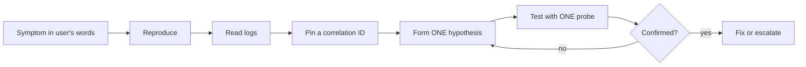
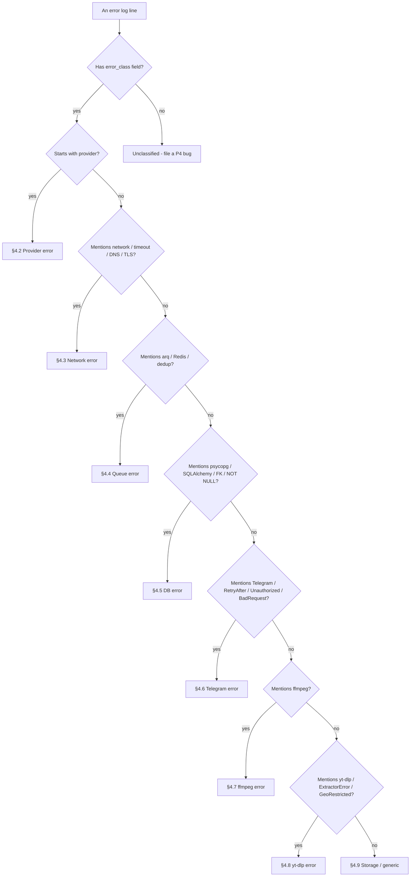

# 31 — Troubleshooting (developer & deep-dive guide)

> Status: Stable
> Audience: developers, on-call engineers, AI agents diagnosing
> incidents
> Companion docs:
> [`14-logging-observability.md`](14-logging-observability.md) — log schema,
> [`15-healthchecks.md`](15-healthchecks.md) — health endpoints,
> [`24-runbooks.md`](24-runbooks.md) — operational "what to do",
> [`16-error-handling.md`](16-error-handling.md) — error class hierarchy,
> [`30-add-new-provider-guide.md`](30-add-new-provider-guide.md) — provider contract.

> The runbooks (`24-`) tell operators **what to do** when a known
> failure occurs. **This document tells you how to find the cause**
> when the symptom is confusing — how to read the logs, how to
> distinguish a provider failure from a network glitch from a queue
> stall, and which command answers each question.
>
> If the symptom matches a runbook in `24-` exactly, jump there.
> If it doesn't — start here.

---

## §1 — How to approach debugging

### 1.1 The five-rule diagnosis method



1. **Symptom in the user's words.** Start with "user clicked X →
   nothing happened", not with "redis looks weird". The user's
   sentence is the only thing you'll be able to verify against.
2. **Reproduce before fixing.** Even partially. If you can't
   reproduce, you can't verify the fix.
3. **Logs are the source of truth.** Memory of "I think we
   changed X yesterday" is not. `git log -p --since=24h` is.
4. **Pin a correlation ID early.** Every flow carries a
   `request_id` (analyze path) and a `job_id` (worker path). One
   `jq` query on either replaces fifteen guesses.
5. **One change at a time.** When you "fix" two things at once,
   you don't know which one worked. Document each probe.

### 1.2 Reproduce-first protocol

Before forming hypotheses:

- Get the **exact** failing input from the user (URL, command,
  timestamp).
- Get a **correlation ID** if available (the bot logs
  `bot_url_submitted` with `request_id`; ask for the
  approximate timestamp + user id).
- Run the **same input** in staging or with a minimal local
  setup — does it fail the same way?
- Capture the **first ERROR-class log line** from the failing
  attempt. That line is your hypothesis seed.

If you cannot reproduce after 15 minutes:

- Confirm you used the **right** input (copy-paste, not retype).
- Check whether the upstream (yt-dlp / Telegram / target site)
  has changed since the failure (§5.6).
- Mark the symptom **intermittent** and switch to §2.4
  (flapping).

### 1.3 Correlation IDs — the master key

Every log line emitted by the project carries a small set of
**bound** fields (via `structlog`'s `contextvars`):

| Field | Bound at | Lives until |
|---|---|---|
| `request_id` | bot handler entry / API request entry | end of the request |
| `user_id`, `chat_id` | bot handler entry | end of the request |
| `job_id` | use case `enqueue_job` | end of the worker task |
| `provider`, `option_key` | provider methods | scope of the provider call |
| `url_host`, `url_path_hash` | provider methods | scope of the provider call |

**Reading rule:** if you have **any one** of `{request_id,
job_id, user_id+timestamp_window}`, you can fetch the entire
flow with a single `jq` filter (§3.4 / §3.5).

If a log line lacks these — that's a bug; file a P4 issue.

### 1.4 One change at a time

When testing hypotheses:

- Change exactly one input / config / version per probe.
- Write down what you changed and what you expected vs what you
  got.
- Revert before the next probe (so the system stays in a known
  state).

This is dull. It also halves your mean time to resolution.

### 1.5 Don't restart before reading logs

A panic-restart erases the smoking gun. Even when you "have to"
restart:

```bash
# Snapshot logs FIRST
NL2='docker compose -f deploy/nl2/docker-compose.yml'
$NL2 logs --no-color --tail=2000 worker > /tmp/worker.before-restart.$(date +%s).log
# Now restart
$NL2 restart worker
```

Read the snapshot before anything else.

### 1.6 The 5-minute triangulation script

When the symptom is **unclear**, run this end-to-end before
forming any hypothesis. It tells you which subsystem to suspect.

```bash
NL1='docker compose -f deploy/nl1/docker-compose.yml'
NL2='docker compose -f deploy/nl2/docker-compose.yml'
SINCE=15m

echo "== 1) Container status (both planes) =="
$NL1 ps; $NL2 ps

echo "== 2) Last ERRORs across the system =="
for s in nl1 nl2; do
  test -f deploy/$s/docker-compose.yml \
    && docker compose -f deploy/$s/docker-compose.yml logs \
       --no-color --since=$SINCE \
       | jq -c 'select(.level == "error" or .level == "warning")' 2>/dev/null \
       | head -30
done

echo "== 3) Top error_class histogram =="
for s in nl1 nl2; do
  test -f deploy/$s/docker-compose.yml \
    && docker compose -f deploy/$s/docker-compose.yml logs --no-color --since=$SINCE \
       | jq -r 'select(.error_class) | .error_class' 2>/dev/null \
       | sort | uniq -c | sort -rn
done

echo "== 4) Queue depth + DB job state =="
docker exec dwtgbot_redis redis-cli -a "$REDIS_PASSWORD" ZCARD arq:queue
docker exec -it dwtgbot_postgres psql -U dwtgbot -d dwtgbot -c \
  "SELECT status, count(*) FROM download_jobs GROUP BY 1;"

echo "== 5) Health endpoints =="
curl -fsS --max-time 5 https://media.example.com/healthz   || echo "PUBLIC FAIL"
docker exec dwtgbot_api curl -fsS --max-time 5 http://localhost:8080/readyz || echo "READY FAIL"

echo "== 6) Disk pressure =="
df -h / /var/lib/dwtgbot 2>/dev/null
```

Read the output **top to bottom**. The dominant `error_class`
in step 3 is your subsystem (use §4 to translate it to a cure).

---

## §2 — Common failure patterns

### 2.1 Pattern catalogue

Each row maps a pattern signature to the suspect subsystem **and**
the first command to run.

| # | Pattern signature | Suspect subsystem | First command | Detail |
|---|---|---|---|---|
| 1 | Bot silent; nothing in `bot` logs | Telegram polling stopped / token rotated | `docker exec dwtgbot_bot curl -fsS https://api.telegram.org/bot${BOT_TOKEN}/getMe` | §4.6 |
| 2 | Bot replies 'analyzing…' but never the keyboard | provider `get_info` failing or hanging | `$NL1 logs --since=10m bot \| jq -c 'select(.event \| test("classified_error"))'` | §4.2 |
| 3 | Keyboard appears, click → 'queued', then nothing | worker idle or queue not consumed | `docker exec dwtgbot_redis redis-cli -a "$REDIS_PASSWORD" ZCARD arq:queue` + §3.5 | §4.4 |
| 4 | Worker logs show start then silence (no `_done`) | hung subprocess (yt-dlp / ffmpeg) | `docker exec dwtgbot_worker pgrep -af 'yt-dlp\|ffmpeg'` | §5.8 |
| 5 | `worker_job_done` present but user got no file | delivery failed (Telegram 413, temp link not created) | grep `worker_delivery_failed`; check `temp_links` row | §4.6 / §5.4 |
| 6 | Big file: link arrives, click → 502/504/403 | nginx / api / `temp_links.file_path` mismatch | `$NL2 logs nginx \| tail; $NL2 logs api \| tail` | §4.3 |
| 6a | Big file: link click → 410 "Link expired or exhausted" before user downloaded | temp-link counter consumed by preview/crawler or repeated probes | nginx logs for `TelegramBot (like TwitterBot)` and DB `downloads_count` | §5.10 |
| 6b | Firefox shows "Corrupted Content Error" / "Ошибка искажения содержимого" | client/content-encoding mismatch, duplicate headers, or a local TLS-inspecting client | `curl --compressed -D /tmp/headers.txt -o /tmp/body.bin https://.../d/<token>` | §5.10 |
| 7 | One platform broken, others fine | provider / yt-dlp upstream change | `docker exec dwtgbot_worker yt-dlp --version` + reproduce | §5.6 |
| 8 | All platforms broken at once | yt-dlp itself missing / image regression | `docker exec dwtgbot_worker which yt-dlp ffmpeg` | §5.6 |
| 9 | Spike of 5xx in API logs | DB or Redis behind it; or readiness false | §1.6 step 4 + 5 | §4.4 / §4.5 |
| 10 | "It worked yesterday" generic regression | recent deploy | `git log --oneline --since=48h` + `docker inspect <c> -f '{{.Image}}'` | §6 |
| 11 | Disk fills despite cleanup | cleanup container down or stuck | `$NL2 ps cleanup` + `$NL2 logs cleanup` | §4.9 |
| 12 | Long jobs get killed mid-way | arq `task_timeout` or ffmpeg timeout | grep `worker_task_timeout`, `subprocess.TimeoutExpired` | §5.1 |
| 13 | "Random" failures with no pattern | flapping (§2.4) | sample 20 failures, look at common field | §2.4 |
| 14 | Container restart loop with no obvious cause | OOM / failing healthcheck | `docker inspect <c> -f '{{.State.OOMKilled}}'`; check probe | §4.9 |
| 15 | Migrations failed mid-deploy | bad migration / data violates new schema | `docker compose run --rm migrate` to surface | §4.5 |

### 2.2 Cascading failures

One root cause looks like ten symptoms. Recognize the pattern by
**sequence in time**, not by surface complaint.

| Root | Surface symptoms (in order) |
|---|---|
| Postgres down | bot fails on URL submit → `bot_send_failed` → users re-submit → queue depth grows → workers idle → /readyz red |
| Redis down | bot fails on enqueue → users re-submit → bot logs `link_analysis_unexpected_error` → workers idle |
| Disk full on NL-2 | worker fails on download → ffmpeg fails → temp link writes fail → cleanup also fails |
| yt-dlp upstream change (one platform) | spike of `<x>_classified_error` for that platform → workers seem busy → users on **other** platforms unaffected |
| Worker hung on one job | repeated `Retry` for one job_id → queue grows → other users wait → arq finally times out the job |

**Diagnosis tip:** sort log lines by `timestamp`, find the
**earliest** ERROR/WARNING — that's usually the root.

```bash
$NL1 logs --since=1h --no-color bot \
  | jq -c 'select(.level=="error" or .level=="warning")' \
  | jq -s 'sort_by(.timestamp) | .[0:5]'
```

### 2.3 Silent failures (no error, wrong result)

Hardest class. Examples and tell-tales:

| Symptom | Tell-tale | Probe |
|---|---|---|
| `worker_job_done` but `delivered_at` NULL | delivery service returned without writing the row | grep `worker_delivery_*` for that `job_id` |
| Audio MP3 is 0 bytes; logs say "done" | provider returned `DownloadResult.files=()` and worker accepted | `ls -la /var/lib/dwtgbot/storage/jobs/<id>/`; provider P4 violation |
| Same URL works in dev, fails in prod | env / cookies / IP geo difference | reproduce inside the prod worker: `docker exec … yt-dlp -j …` |
| Wrong file delivered | `option_key` confused; provider mapped wrong format | grep `<provider>_download_done`; inspect `option_key` and `kind` |
| Cleanup deleted a fresh link | `expires_at` clock drift; cleanup filter wrong | check `temp_links.expires_at` and `cleanup` event log |

If logs show "success" but the user disagrees, **trust the user**
— look at what was *actually* delivered (bytes on disk, message
in Telegram chat).

### 2.4 Flapping / intermittent failures

Definition: failure rate is non-zero but not 100%. Steps:

1. **Quantify**: count failures over time:
   ```bash
   $NL2 logs --since=1h --no-color worker \
     | jq -c 'select(.event | test("classified_error"))' \
     | jq -r '.timestamp[0:16]' | sort | uniq -c
   ```
2. **Group**: by `provider` / `error_class` / `url_host`:
   ```bash
   $NL2 logs --since=1h --no-color worker \
     | jq -c 'select(.error_class) | {p: .provider, e: .error_class, h: .url_host}' \
     | sort | uniq -c | sort -rn | head
   ```
3. **Compare**: is one bucket dominant? If yes, your "random"
   failure is actually a deterministic failure scoped to that
   bucket → it's not flapping.
4. **If genuinely random** (no dominant bucket): suspect
   infrastructure (DNS, transient network), upstream rate limit
   (intermittent 429), or a race condition in code.

### 2.5 Heisenbugs (works in dev, fails in prod only)

Common causes ranked by frequency:

1. **Different env value** (most common — `Settings` field
   defaults to one thing in dev, another in prod).
2. **Different image** (dev uses `:latest`, prod uses pinned tag
   that's older).
3. **Different IP geo** (yt-dlp from your laptop vs from NL-2).
4. **Different Postgres version** (dev image vs prod managed
   service).
5. **Different ffmpeg / yt-dlp version**.
6. **Cookies / auth** present in dev, missing in prod.
7. **Concurrency**: dev serves one user, prod serves N (race
   conditions surface).

Diagnose by **reproducing inside the prod container**:

```bash
docker exec -it dwtgbot_worker bash -lc \
  'yt-dlp --version && ffmpeg -version | head -1 && env | grep -E "^PROVIDER_|^MAX_|^STORAGE_"'
docker exec dwtgbot_worker yt-dlp -j --no-warnings '<failing url>' | head -30
```

If it fails inside the container but works on your laptop, the
delta is environmental — not in your code.

---

## §3 — Log analysis guide

### 3.1 Log format

All services emit **JSON-line** logs (`structlog` + JSON
renderer). Mandatory fields per line:

| Field | Type | Always present? | Notes |
|---|---|---|---|
| `timestamp` | RFC3339 string | yes | UTC |
| `level` | `info` / `warning` / `error` / `debug` | yes | |
| `event` | constant string | yes | e.g. `worker_job_done` |
| `logger` | dotted module name | yes | `app.workers.tasks.download` |
| `request_id` | UUID-like | when in a request scope | bound by handler |
| `job_id` | string | when in a worker task | bound by use case |
| `user_id` / `chat_id` | int | when in bot handler | bound by handler |
| `error_class` | constant string | on failure paths | maps to taxonomy in `16-` |
| `details_truncated` | string ≤ 500 chars | on classified errors | sanitized |
| `provider`, `option_key`, `url_host`, `url_path_hash` | string | provider methods | bound by provider |

**Event names are constants** — never f-strings (P4). If you see
an f-string event name, file a bug.

See [`14-logging-observability.md`](14-logging-observability.md)
for the canonical event catalogue.

### 3.2 Where logs live (per service / host)

| Service | Host | Container | Stream |
|---|---|---|---|
| Bot | NL-1 | `dwtgbot_bot` | stdout (json) |
| Internal API | NL-1 | `dwtgbot_api` | stdout (json) |
| Postgres | NL-1 | `dwtgbot_postgres` | stderr (server log; not JSON) |
| Redis | NL-1 | `dwtgbot_redis` | stdout (text) |
| Backup | NL-1 | `dwtgbot_backup` | stdout (text + json events) |
| Worker | NL-2 | `dwtgbot_worker` | stdout (json) |
| Public API | NL-2 | `dwtgbot_api` | stdout (json) |
| Nginx | NL-2 | `dwtgbot_nginx` | stdout/stderr (access + error) |
| Cleanup | NL-2 | `dwtgbot_cleanup` | stdout (json) |
| Certbot | NL-2 | `dwtgbot_certbot` | stdout (text) |

Access via `docker compose -f deploy/<host>/docker-compose.yml
logs <service>`.

### 3.3 The ten essential `jq` queries

```bash
# Aliases — set once
NL1='docker compose -f deploy/nl1/docker-compose.yml'
NL2='docker compose -f deploy/nl2/docker-compose.yml'

# 1. Errors only
$NL1 logs --since=10m --no-color bot \
  | jq -c 'select(.level == "error")'

# 2. Warnings + errors
$NL2 logs --since=1h --no-color worker \
  | jq -c 'select(.level == "warning" or .level == "error")'

# 3. Filter by event name
$NL2 logs --since=1h --no-color worker \
  | jq -c 'select(.event == "worker_job_done")'

# 4. Filter by request_id (one bot flow)
$NL1 logs --no-color --since=1h bot \
  | jq -c 'select(.request_id == "a1b2c3d4")'

# 5. Filter by job_id (one worker task)
$NL2 logs --no-color --since=1h worker \
  | jq -c 'select(.job_id == "j_xxx")'

# 6. Filter by user_id (one user's recent activity)
$NL1 logs --since=1h --no-color bot \
  | jq -c 'select(.user_id == 12345678)'

# 7. Histogram of error_class
$NL2 logs --since=1h --no-color worker \
  | jq -r 'select(.error_class) | .error_class' \
  | sort | uniq -c | sort -rn

# 8. Histogram of providers raising errors
$NL2 logs --since=1h --no-color worker \
  | jq -c 'select(.event | test("classified_error"))' \
  | jq -r '.provider // "unknown"' \
  | sort | uniq -c | sort -rn

# 9. Per-minute timeseries of an event
$NL2 logs --since=1h --no-color worker \
  | jq -r 'select(.event == "worker_job_done") | .timestamp[0:16]' \
  | sort | uniq -c

# 10. Top N slowest jobs
$NL2 logs --since=1h --no-color worker \
  | jq -c 'select(.event == "worker_job_done" and .duration_ms != null) | {job_id, duration_ms}' \
  | jq -s 'sort_by(.duration_ms) | reverse | .[0:10]'
```

### 3.4 Following one `request_id` end-to-end

A typical analyze flow has these events, in order:

| Order | Event | Service | Source line example |
|---|---|---|---|
| 1 | `bot_url_submitted` | bot | `app/bot/handlers/url.py` |
| 2 | `<provider>_get_info_started` | bot (via provider) | `app/infrastructure/providers/<x>.py` |
| 3 | `<provider>_get_info_done` (or `_classified_error`) | bot | same |
| 4 | `bot_options_rendered` | bot | `app/bot/keyboards/options.py` |
| 5 | `bot_option_clicked` | bot | `app/bot/handlers/callbacks.py` |
| 6 | `use_case_enqueue_job` | bot | `app/application/use_cases/enqueue_download.py` |

Fetch the whole flow:

```bash
RID=a1b2c3d4
$NL1 logs --no-color --since=1h bot \
  | jq -c "select(.request_id == \"$RID\")" \
  | jq -s 'sort_by(.timestamp) | .[] | {ts: .timestamp, level, event, error_class}'
```

What to look at:

- The **last** event before silence is your hypothesis seed.
- Missing event 4 → provider failed at step 3 (look for `_classified_error`).
- Missing event 6 → enqueue failed (Redis? See §4.4).

### 3.5 Following one `job_id` end-to-end

Worker task events:

| Order | Event | Where |
|---|---|---|
| 1 | `worker_job_started` | `app/workers/tasks/download.py` |
| 2 | `<provider>_download_started` | provider |
| 3 | `<provider>_download_done` (or `_classified_error`) | provider |
| 4 | `worker_delivery_started` | delivery service |
| 5 | `worker_delivery_done` (or `worker_delivery_failed`) | delivery service |
| 6 | `worker_job_done` | worker task |

Fetch:

```bash
JID=j_xxx
$NL2 logs --no-color --since=2h worker \
  | jq -c "select(.job_id == \"$JID\")" \
  | jq -s 'sort_by(.timestamp) | .[] | {ts: .timestamp, level, event, error_class, files_count, total_bytes}'
```

What to look at:

- Missing event 3 → §5.6 (yt-dlp issue) or §5.5 (ffmpeg).
- Event 3 OK but 5 missing → §5.4 (Telegram-side).
- Event 5 = `worker_delivery_failed` → check `error_class` field.
- Event 6 missing → worker hung (§5.8) or crashed (`worker_unexpected_error`).

### 3.6 Aggregations / histograms

The fastest way to understand "what's broken right now" is to
ask "what's the dominant signal?". Recipes:

```bash
# Most frequent error_class in the last hour
$NL2 logs --since=1h --no-color worker \
  | jq -r 'select(.error_class) | .error_class' \
  | sort | uniq -c | sort -rn | head

# Failures per provider per minute (spotting upstream incidents)
$NL2 logs --since=1h --no-color worker \
  | jq -c 'select(.event | test("classified_error"))' \
  | jq -r '"\(.timestamp[0:16]) \(.provider // "unknown") \(.error_class // "?")"' \
  | sort | uniq -c | sort -rn | head -20

# 95p / max duration in the last 30 minutes
$NL2 logs --since=30m --no-color worker \
  | jq -r 'select(.event=="worker_job_done") | .duration_ms' \
  | sort -n | awk '{a[NR]=$1} END{print "p50",a[int(NR*0.5)]," p95",a[int(NR*0.95)]," max",a[NR]}'

# Top N most active users
$NL1 logs --since=1h --no-color bot \
  | jq -r 'select(.event=="bot_url_submitted") | .user_id' \
  | sort | uniq -c | sort -rn | head
```

### 3.7 What is NOT in logs (and why)

| Not in logs | Why |
|---|---|
| Full URLs, query strings | P11 — may contain tokens, signed parameters |
| Cookies, OAuth tokens, `BOT_TOKEN` | P11 — secrets |
| File contents | P11 — privacy + size |
| Raw yt-dlp `info` dict | P11 — contains user IDs, signed CDN URLs |
| User PII beyond `user_id` | privacy minimisation |
| Stack traces with secret-like strings | sanitized to `details_truncated` ≤ 500 chars |

If you need any of the above to debug — reproduce locally or
inspect the live container directly. **Do not** add them to logs
"just for this incident".

---

## §4 — Error classification — telling subsystems apart

### 4.1 Decision tree



The `error_class` field (per `16-error-handling.md`) is the
canonical input. If it's missing on an error line, that's a P4
violation worth fixing.

### 4.2 Provider errors

**Signature**: log event matches `<provider>_classified_error` or
`<provider>_unexpected_error`. `provider` field set.

**Origin**: raised inside `app/infrastructure/providers/<x>.py`
and translated to one of:

- `RetryableError` — transient (5xx, 429) — worker retries
- `UserFacingError` — permanent for this URL (geo, DRM,
  private, live, no_formats) — clean user message
- `PermanentError` — data integrity / programming error
- `DownloadError("empty_result")` — provider produced no files

**Confirmation**:

```bash
NL2='docker compose -f deploy/nl2/docker-compose.yml'
JID=<job>
$NL2 logs --no-color --since=2h worker \
  | jq -c "select(.job_id==\"$JID\" and .event | test(\"classified_error\"))"

# What the provider did just before
$NL2 logs --no-color --since=2h worker \
  | jq -c "select(.job_id==\"$JID\")" \
  | jq -s 'sort_by(.timestamp) | .[] | {ts: .timestamp, event, error_class, details_truncated}'
```

**Distinguishing from other classes**: provider errors **always**
carry the `provider` field, whereas network/queue/DB errors
carry their own subsystem signature. If `error_class` reads
`upstream_5xx` but `provider` is unset — that's network, not
provider (§4.3).

**Cure path**: §5.6 (yt-dlp), `30-` Appendix D for code-level
fixes, `24-` §5 for operational rollout.

### 4.3 Network errors

**Signature**: log mentions one of:

- `httpx.ConnectError`, `httpx.ReadTimeout`,
  `httpx.ConnectTimeout`
- `aiohttp.ClientConnectorError`,
  `aiohttp.ServerTimeoutError`
- `socket.gaierror` (DNS), `ssl.SSLError` (TLS handshake)
- `urllib3.exceptions.NameResolutionError`
- HTTP 5xx / 429 from upstream (Telegram, yt-dlp's targets)

**Origin**: any layer that does network I/O — bot ↔ Telegram
API; worker ↔ yt-dlp's targets; api ↔ DB; nginx ↔ upstream.

**Confirmation**:

```bash
# DNS inside the failing container
docker exec dwtgbot_worker getent hosts api.telegram.org
docker exec dwtgbot_worker getent hosts www.youtube.com

# TLS handshake
docker exec dwtgbot_worker bash -lc \
  'echo | openssl s_client -connect api.telegram.org:443 -servername api.telegram.org 2>&1 | head -10'

# Egress reachability
docker exec dwtgbot_worker curl -fsS --max-time 5 https://api.telegram.org   ; echo "exit $?"
docker exec dwtgbot_worker curl -fsS --max-time 5 https://www.youtube.com   ; echo "exit $?"

# Inter-container resolve (compose network)
docker exec dwtgbot_nginx getent hosts api
docker exec dwtgbot_api getent hosts postgres
```

**Distinguishing from upstream-content errors** (yt-dlp 403 on
authorisation): a **network** error fails on connect/handshake;
an **upstream-content** error connects fine but the body says
"403" or "removed". `curl -I <url>` (just HEAD) confirms — if
HEAD succeeds, the network is fine and the failure is
content-level (§4.8).

### 4.4 Queue errors

**Signature**: log mentions one of:

- `arq.connections.RedisError`
- `redis.exceptions.ConnectionError` /
  `redis.exceptions.AuthenticationError`
- `WRONGPASS`, `OOM command not allowed`, `LOADING`
- `TaskTimeout`, `Retry`, `MaxTriesExceeded`
- `_job_id` collision messages

**Origin**: enqueue side (bot/api) or consume side (worker).

**Confirmation**:

```bash
# Redis health
docker exec dwtgbot_redis redis-cli -a "$REDIS_PASSWORD" ping
docker exec dwtgbot_redis redis-cli -a "$REDIS_PASSWORD" info clients | head
docker exec dwtgbot_redis redis-cli -a "$REDIS_PASSWORD" info memory | grep -E 'used_memory_human|maxmemory_human'

# Queue depth + dedup keys
docker exec dwtgbot_redis redis-cli -a "$REDIS_PASSWORD" ZCARD arq:queue
docker exec dwtgbot_redis redis-cli -a "$REDIS_PASSWORD" KEYS 'arq:job:*' | head

# DB-side counts (worker may be alive but queue empty)
docker exec -it dwtgbot_postgres psql -U dwtgbot -d dwtgbot -c \
  "SELECT status, count(*) FROM download_jobs GROUP BY 1;"
```

**Distinguishing from worker-not-running**: queue full + worker
silent → queue OR worker. Test:
`$NL2 logs --since=2m worker | grep worker_job_started`. If 0
when ZCARD > 0, the **worker** isn't consuming (likely connection
to Redis broken from the worker side — check `REDIS_URL` /
password); if non-zero, the worker is consuming and just slow.

### 4.5 DB errors

**Signature**: log mentions one of:

- `psycopg.OperationalError` (connection refused, server gone)
- `psycopg.errors.UniqueViolation`,
  `psycopg.errors.ForeignKeyViolation`,
  `psycopg.errors.NotNullViolation`
- `sqlalchemy.exc.IntegrityError`,
  `sqlalchemy.exc.DataError`,
  `sqlalchemy.exc.InvalidRequestError`
- `alembic.util.exc.CommandError`
- `password authentication failed` / `no pg_hba.conf entry`
- `FATAL: sorry, too many clients already`
- `invalid input value for enum platform: "xyz"`

**Origin**: any layer that touches DB.

**Confirmation**:

```bash
docker exec dwtgbot_postgres pg_isready -U dwtgbot -d dwtgbot
docker exec -it dwtgbot_postgres psql -U dwtgbot -d dwtgbot -c \
  "SELECT count(*) FROM pg_stat_activity;"
docker exec -it dwtgbot_postgres psql -U dwtgbot -d dwtgbot -c \
  "SELECT pid, state, wait_event_type, wait_event,
          query_start, substring(query for 80) AS q
   FROM pg_stat_activity WHERE state != 'idle' ORDER BY query_start LIMIT 20;"
docker exec dwtgbot_postgres psql -U dwtgbot -d dwtgbot -c \
  "SELECT version_num FROM alembic_version;"
```

**Distinguishing connection vs schema vs data**:

| Field in error | Likely root |
|---|---|
| `OperationalError: connection refused` | `pg` container down (§4 of `24-`) |
| `password authentication failed` | env / password drift |
| `IntegrityError: UniqueViolation` | code didn't dedupe before insert |
| `IntegrityError: NotNullViolation` | migration / code mismatch (often after a partial deploy) |
| `invalid input value for enum platform` | ENUM addition without migration (P10) |
| `relation "x" does not exist` | DB at wrong revision (alembic mismatch) |

### 4.6 Telegram API errors

**Signature**:

- `telegram.error.RetryAfter` (429 with `retry_after`)
- `telegram.error.Unauthorized` (401)
- `telegram.error.BadRequest` (400 — malformed args)
- `telegram.error.TimedOut` / `NetworkError` (5xx, network)
- `telegram.error.Conflict` (`getUpdates` from another instance)

**Origin**: bot polling / sending.

**Confirmation**:

```bash
# Token sanity
docker exec dwtgbot_bot curl -fsS "https://api.telegram.org/bot${BOT_TOKEN}/getMe" | jq '.ok'
# Webhook should be empty (we long-poll)
docker exec dwtgbot_bot curl -fsS "https://api.telegram.org/bot${BOT_TOKEN}/getWebhookInfo" | jq

# Last failed sends
$NL1 logs --since=15m --no-color bot \
  | jq -c 'select(.event | test("send_failed|telegram_error"))' | head
```

**Distinguishing**:

| Signal | Class |
|---|---|
| `RetryAfter` | rate limit; respect `retry_after` (auto-handled by lib if you let it) |
| `Unauthorized` | token rotated / wrong; §1 of `24-` |
| `Conflict` | another instance polling same token |
| `BadRequest: Message is too long` | message > 4096 chars; truncate in formatter |
| `BadRequest: PHOTO_INVALID_DIMENSIONS` etc. | wrong `MediaKind` from provider; fall back to document send |
| `NetworkError` / `TimedOut` | transient, lib retries; persistent → §4.3 |

Cure path: §15 of `24-`.

### 4.7 ffmpeg errors

**Signature**: stderr substrings emitted by `ffmpeg`:

- `ffmpeg exited with code 1` / `non-zero return`
- `Conversion failed!`
- `Output file does not contain any stream`
- `moov atom not found` (truncated MP4 input)
- `Invalid data found when processing input`
- `Unknown encoder 'libxxx'`
- `unrecognized option`
- `subprocess.TimeoutExpired` (wrapper around ffmpeg)

**Origin**: `app/infrastructure/postprocess/ffmpeg_runner.py`
called from a provider's `download`.

**Confirmation**:

```bash
# Reproduce on the offending file
docker exec dwtgbot_worker bash -lc \
  'ffmpeg -hide_banner -nostdin -i /var/lib/dwtgbot/storage/jobs/<id>/input.mp4 -f null - 2>&1 | tail -30'

# Available encoders (mismatch between provider request and image)
docker exec dwtgbot_worker ffmpeg -hide_banner -encoders | grep -E 'libmp3lame|aac|libx264'

# Version
docker exec dwtgbot_worker ffmpeg -version | head -3
```

**Distinguishing from yt-dlp errors**: ffmpeg errors appear
**after** the download completed; the worker log will show
`<provider>_download_done` first (or partially), then the ffmpeg
error. yt-dlp errors come **before** `_download_done`.

Cure path: §6 of `24-`.

### 4.8 yt-dlp errors

**Signature**: stderr or exception types:

- `yt_dlp.utils.ExtractorError`
- `yt_dlp.utils.GeoRestrictedError`
- `yt_dlp.utils.DownloadError` (generic)
- `yt_dlp.utils.UnsupportedError`
- substrings: `Sign in to confirm you're not a bot`,
  `HTTP Error 429`, `HTTP Error 403`, `Login required`,
  `This video is no longer available`, `Private video`

**Origin**: `app/infrastructure/downloader/ytdlp_runner.py`,
called from a provider's `get_info` or `download`.

**Confirmation**:

```bash
# Pinned version
docker exec dwtgbot_worker yt-dlp --version

# Reproduce inside the worker (do NOT log full URL afterwards)
docker exec dwtgbot_worker yt-dlp -j --no-warnings '<failing url>' 2>&1 | tail -30
docker exec dwtgbot_worker yt-dlp -F --no-warnings '<failing url>' 2>&1 | head -30

# Failure histogram by platform / message
$NL2 logs --since=1h --no-color worker \
  | jq -c 'select(.event | test("classified_error"))' \
  | jq -r '"\(.provider) \(.error_class)"' | sort | uniq -c | sort -rn
```

**Distinguishing patterns**:

| Substring in `details_truncated` | Class | Cure |
|---|---|---|
| `HTTP Error 429` | `RetryableError("upstream_5xx")` | reduce concurrency |
| `HTTP Error 5\d\d` | `RetryableError("upstream_5xx")` | wait, retries handle it |
| `HTTP Error 403`, `Sign in to confirm` | `UserFacingError` (likely needs cookies / IP rotation) | §5 of `24-` |
| YouTube `HTTP Error 403` on download while `-F` lists formats | JS challenge unsolved (`yt-dlp -v` → `JS runtimes: none`) | image must include `deno` + `yt-dlp-ejs` (`yt-dlp[default,deno]` in `requirements/base.txt`); §5 of `24-` |
| `GeoRestricted` | `UserFacingError("geo_restricted")` | inform user |
| `Private video` / `Login required` | `UserFacingError("private_content")` | inform user |
| `Unsupported URL` | `UserFacingError("unsupported_url")` | URL detection bug or upstream change |
| `Unable to extract` | extractor broken (yt-dlp version) | §5 of `24-` |

### 4.9 Filesystem / storage / OOM errors

**Signature**:

- `OSError: [Errno 28] No space left on device`
- `PermissionError`
- `IsADirectoryError`, `FileNotFoundError`
- `OOMKilled=true` from `docker inspect`
- container restart loop with no application-level error

**Confirmation**:

```bash
df -h /var/lib/dwtgbot /var/backups/dwtgbot /var/lib/docker 2>/dev/null
docker inspect dwtgbot_worker -f '{{.State.OOMKilled}} restarts={{.RestartCount}}'
docker exec dwtgbot_worker ls -la /var/lib/dwtgbot/storage | head
```

Cure: §12 (disk) / §11 (containers) of `24-`.

---

## §5 — Diagnostic recipes (per failure mode)

### 5.1 Timeouts

**Where can it time out?**

| Layer | Mechanism | Default | Symptom in logs |
|---|---|---|---|
| HTTP client to Telegram | `httpx` connect / read timeout | 10s | `httpx.ReadTimeout` |
| HTTP client to yt-dlp targets | yt-dlp internal `--socket-timeout` | (varies) | yt-dlp's `Read timed out` |
| yt-dlp subprocess | `YtDlpRunner` `asyncio.wait_for` | `YTDLP_TIMEOUT_S` (e.g. 600) | `subprocess.TimeoutExpired` |
| ffmpeg subprocess | `FFmpegRunner` `asyncio.wait_for` | `FFMPEG_TIMEOUT_S` (e.g. 300) | `subprocess.TimeoutExpired` |
| arq job | `task_timeout` | (settings) | `worker_task_timeout` |
| Postgres statement | `statement_timeout` | (DB-side; default 0) | `canceling statement due to statement timeout` |
| Nginx upstream | `proxy_read_timeout` | (nginx.conf) | `upstream timed out` |

**Triangulation**:

```bash
# Which layer? Look at the stack trace and the elapsed time.
# A subprocess timeout shows the runner; a network timeout shows httpx; a Postgres timeout shows psycopg.
NL2='docker compose -f deploy/nl2/docker-compose.yml'
$NL2 logs --since=1h --no-color worker \
  | jq -c 'select(.event | test("timeout|TimedOut"))' | head
```

**Recipes**:

- `subprocess.TimeoutExpired` from yt-dlp/ffmpeg → raise the
  per-runner timeout in env, OR reject overly long sources at
  `get_info` (`MAX_DURATION_S`).
- `httpx.ReadTimeout` to Telegram → usually upstream slowness;
  the lib will retry; if persistent, see §4.6.
- `worker_task_timeout` → arq killed the task at hard ceiling;
  fix the underlying slowness, not the timeout.
- Postgres `canceling statement due to statement timeout` → find
  the slow query (`pg_stat_activity`), add an index or fix the
  N+1.

### 5.2 Corrupt files (0-byte / truncated / wrong codec)

**Telltales**:

- File on disk size = 0.
- `file <path>` says `data` instead of `MP4` / `MP3` /
  `Matroska`.
- Telegram preview broken; user complaint "video doesn't play".
- ffmpeg refuses to open it: `Invalid data found when processing input`.

**Recipes**:

```bash
# Inspect the actual bytes
JID=<job>
ls -la /var/lib/dwtgbot/storage/jobs/$JID/
file /var/lib/dwtgbot/storage/jobs/$JID/*

# Validate with ffprobe
docker exec dwtgbot_worker ffprobe -hide_banner \
  /var/lib/dwtgbot/storage/jobs/$JID/<file> 2>&1 | head -30
```

**Likely causes**:

| Symptom | Cause | Cure |
|---|---|---|
| 0-byte file | yt-dlp wrote the temp file then failed; provider returned `files=()` should have raised `DownloadError("empty_result")` | provider P4 violation; see `30-` D.5 |
| Truncated MP4, `moov atom not found` | upstream cut short / network drop mid-download | re-trigger; if persistent, §5.6 |
| Audio extension `.mp3` but format is OPUS | provider's postprocessor not actually invoked; `option.bitrate_kbps` mismatch | check provider's `download` method |
| Right format but won't play in Telegram | wrong `MediaKind` from provider; Telegram expects MP4 + H.264 + AAC for native preview | see `30-` D.6 |

### 5.3 Wrong / bad URLs

**Telltales**: bot replies "URL not supported" or "URL is missing
host"; or detects the wrong platform.

**Recipes**:

```python
# Repro detection in a Python REPL inside the bot container
docker exec -it dwtgbot_bot python -c "
from app.utils.url import detect_platform
print(detect_platform('<url>'))
"
```

**Likely causes**:

| Symptom | Cause | Cure |
|---|---|---|
| Valid TikTok URL → `UnsupportedPlatformError` | host not in `_TIKTOK_HOSTS` (new short-link domain) | extend the frozenset; add tests |
| `https://evil.com/?u=tiktok.com` routes to TikTok | substring-based detection (P11 violation) | switch to parsed `netloc` per `30-` D.2 |
| `youtube.com/shorts/...` "unsupported" | YouTube provider's URL handling missed shorts | extend handler; add tests |
| `m.tiktok.com` works in dev, fails in prod | host set differs between branches; check `git diff` |

If detection succeeds but `get_info` fails → it's a provider /
yt-dlp problem (§4.2 / §5.6), not a URL problem.

### 5.4 Telegram-side delivery failures

**Telltales**: `worker_job_done` emitted; `worker_delivery_failed`
also emitted (or no `worker_delivery_done`); user receives nothing.

**Recipes**:

```bash
NL2='docker compose -f deploy/nl2/docker-compose.yml'
JID=<job>
$NL2 logs --no-color --since=2h worker \
  | jq -c "select(.job_id == \"$JID\" and (.event | test(\"delivery\")))"
```

**Likely causes**:

| Error | Cause | Cure |
|---|---|---|
| `RetryAfter: 30s` | rate limit | back off; reduce per-chat send rate |
| `Request Entity Too Large` (413) | file > 50 MB on direct send | delivery service must fall back to temp link |
| `BadRequest: PHOTO_INVALID_DIMENSIONS` | provider returned `MediaKind.PHOTO` for a video | fix provider's `kind` selection |
| `BadRequest: WRONG_FILE_TYPE` | extension/MIME mismatch | provider should set `primary_mime` correctly |
| `Unauthorized` | token rotated | §15.4 of `24-` |
| `Conflict: terminated by other getUpdates` | another bot instance polling same token | stop the duplicate |
| Delivery succeeded by Telegram but user says "nothing" | wrong `chat_id` in delivery; rare | grep delivery event for `chat_id` |

### 5.5 ffmpeg-side failures

See §4.7 for confirmation. Common patterns:

| Stderr substring | Cause | Cure |
|---|---|---|
| `Conversion failed!` + `Invalid data` | corrupt source (re-trigger) | §5.2 |
| `Output file does not contain any stream` | yt-dlp delivered an HTML page instead of a video | upstream block; §5.6 |
| `Unknown encoder 'libxxx'` | encoder not in image | pin ffmpeg with the encoder; rebuild image |
| `subprocess.TimeoutExpired` | encoding longer than `FFMPEG_TIMEOUT_S` | reject long sources at `get_info`; or raise timeout |
| `moov atom not found` | input MP4 truncated | re-download; §5.2 |

### 5.6 yt-dlp-side failures

See §4.8 for confirmation. Recipes:

```bash
# Reproduce inside the worker
docker exec dwtgbot_worker yt-dlp -j --no-warnings '<failing url>' 2>&1 | tail -30

# Compare against latest yt-dlp
docker exec dwtgbot_worker yt-dlp --version
curl -fsS https://pypi.org/pypi/yt-dlp/json | jq -r '.info.version'

# Try the same URL with verbose mode (do NOT paste the output anywhere public)
docker exec dwtgbot_worker yt-dlp -v --no-warnings '<failing url>' 2>&1 | tail -50

# Reproduce on a different IP (your laptop) to isolate geo / IP block
yt-dlp -j --no-warnings '<failing url>' 2>&1 | tail -30
```

**Likely causes**:

| Substring | Cause | Cure |
|---|---|---|
| `Unable to extract` | extractor broken in our pinned version | bump yt-dlp pin (§5 of `24-`) |
| `Sign in to confirm you're not a bot` | bot-detection on yt-dlp's IP | rotate egress IP / cookies (out of scope short-term) |
| `HTTP Error 429` | upstream rate limit | reduce concurrency |
| `HTTP Error 403` | auth required / cookies expired | rotate cookies: `sudo bash deploy/scripts/cookies_setup.sh instagram` on every host running bot/worker (see [`24-runbooks.md` §5.4 step 4](24-runbooks.md)) |
| `Private video` | user pasted a private link | clean user message |
| `Sign in required to access this content` | age-gate / login required (Instagram public posts now hit this when the egress IP is bot-flagged) | install Instagram cookies with `deploy/scripts/cookies_setup.sh instagram` (single host, or NL-1 + NL-2); provider auto-passes them as `cookiefile` — see [`20-deployment.md`](20-deployment.md) §4a.5 |
| worker log: `instagram_cookiefile_missing` | `INSTAGRAM_COOKIES_FILE` set but file absent inside the container | check the bind-mount (`docker exec dwtgbot_worker ls -l /srv/dwtgbot/secrets/`) and that `/srv/dwtgbot/secrets` is `root:1000 0750` and the file `root:1000 0660` (container runs as uid/gid 1000) |
| `This live event will begin in N hours` | live stream | reject in `get_info` |
| `DRM` | DRM-protected | reject in `get_info` |

### 5.7 Slow downloads

See §14 of `24-` for the operational fix. Diagnostic recipes:

```bash
# Top 10 slowest jobs in last 30 min
$NL2 logs --since=30m --no-color worker \
  | jq -c 'select(.event=="worker_job_done") | {job_id, duration_ms, kind: .download_kind, total_bytes}' \
  | jq -s 'sort_by(.duration_ms) | reverse | .[0:10]'

# Host-side bottleneck
top -bn1 | head -20
iostat -xm 2 3 | tail -20
nload -t 1000 eth0     # interactive

# DB locks (rare but possible)
docker exec -it dwtgbot_postgres psql -U dwtgbot -d dwtgbot -c \
  "SELECT pid, state, wait_event_type, wait_event, query
   FROM pg_stat_activity WHERE wait_event IS NOT NULL ORDER BY query_start LIMIT 20;"
```

If duration grew suddenly → recent regression (§6 of this doc; §16 of `24-`).
If duration grows gradually with usage → capacity (`MAX_PARALLEL_DOWNLOADS`).

### 5.8 Stuck / hung jobs

See §20 of `24-` for the operational unstick. Diagnostic recipes:

```bash
JID=<id>
docker exec dwtgbot_worker ps -ef --forest | head -40
docker exec dwtgbot_worker pgrep -af 'yt-dlp|ffmpeg|app.main_worker'
docker exec dwtgbot_worker ss -tnp 2>/dev/null | head
docker exec -it dwtgbot_postgres psql -U dwtgbot -d dwtgbot -c \
  "SELECT id, status, started_at, error_message
   FROM download_jobs WHERE id='$JID';"
docker exec dwtgbot_redis redis-cli -a "$REDIS_PASSWORD" \
  EXISTS "arq:job:job:$JID"
```

Tells you: is a subprocess actually running? Is the DB row stuck
in `running`? Is the dedup key blocking re-submit?

### 5.9 Memory pressure / OOM

```bash
# Per-container memory
docker stats --no-stream

# Was anything OOM-killed?
for c in dwtgbot_worker dwtgbot_bot dwtgbot_api dwtgbot_postgres; do
  docker inspect "$c" -f "$c oom={{.State.OOMKilled}} restarts={{.RestartCount}}"
done

# Host-level
free -h
dmesg | grep -i -E 'oom|killed' | tail
```

Cure: §11 of `24-`. Common root cause for the worker is reading
a huge file fully into memory instead of streaming — fix in code.

### 5.10 Temp-link download failures (`410`, Firefox corruption, crawler)

Use this when the bot successfully produced a large-file temp link but the
browser cannot download it.

#### A. Confirm the deployed version first

```bash
cd /opt/DWTGBot
git log -1 --oneline
docker compose -f deploy/nl2/docker-compose.yml --env-file deploy/nl2/.env images
systemctl is-active dwtgbot-autodeploy.timer 2>/dev/null || true
sudo cat /var/lib/dwtgbot/autodeploy/nl2.last_successful_sha 2>/dev/null || true
```

If images or checkout are older than the fix you expect, deploy via the TUI:

```bash
bash deploy/scripts/install.sh
# [16] Update to latest main (autodeploy now)
```

#### B. Distinguish `HEAD` from `GET`

`curl -I` sends `HEAD`. The `/d/{token}` endpoint accepts `GET` only, so
`curl -I https://.../d/<token>` returning `405 Allow: GET` is expected and
does not test the file path.

Use a real GET:

```bash
TOKEN='<fresh-token>'
curl -s --compressed -o /tmp/body.bin -D /tmp/headers.txt \
  "https://media.example.com/d/${TOKEN}"
echo "== headers =="; sed -n '1,40p' /tmp/headers.txt
echo "== body =="; wc -c /tmp/body.bin; file /tmp/body.bin
```

Expected for a healthy MP4 temp link:

- no `Content-Encoding` header,
- `Content-Length` equals `wc -c`,
- `file /tmp/body.bin` identifies the media format,
- nginx access log has `status=200` and `body_bytes_sent` close to file size.

#### C. Diagnose unexpected `410 Gone`

`410 {"detail":"Link expired or exhausted"}` is correct when the token is
expired, inactive, or `downloads_count >= max_downloads`. If the user sees it
on the first apparent click:

```bash
docker compose -f deploy/nl2/docker-compose.yml --env-file deploy/nl2/.env \
  logs --since=10m nginx | grep -E '/d/|TelegramBot|status":410'
```

Signals:

| Signal | Meaning | Fix |
|---|---|---|
| `TelegramBot (like TwitterBot)` hits `/d/<token>` before the user clicked | the URL was exposed in message text or preview generation found it | temp-link URL must live only in `InlineKeyboardButton(url=...)`; no URL in the message body |
| browser/user agent hits same token many times | client retries or multiple manual opens exhausted `TEMP_LINK_MAX_DOWNLOADS` | issue a fresh link; consider raising the max only with product justification |
| token was tested with `curl` before opening in browser | the test consumed one use | request a fresh link before user smoke |

#### D. Diagnose Firefox "Corrupted Content Error"

If Firefox shows "Corrupted Content Error" / "Ошибка искажения содержимого"
but `curl --compressed` downloads a valid full file, the server bytes are
good. Check:

- `Content-Encoding` should be absent for `/d/` responses.
- `Content-Disposition` should appear once, with `filename=...`.
- Test Chrome/Safari and Firefox private window; local HTTPS inspection
  (VPN, antivirus, extensions) can surface as nginx `SSL_read() failed ...
  bad record mac` and client-side decode failures.

Server-side guardrails live in `deploy/nginx/conf.d/media.conf.template`:
`gzip off; gunzip off;` on `/d/` and `/_protected/`, and only the API sets
`Content-Disposition`.

---

## §6 — Common AI-agent debugging mistakes

These are the high-frequency mistakes seen in AI-authored bug
hunts. Match the symptom; correct the approach.

| # | Mistake | Symptom | Cure |
|---|---|---|---|
| 1 | Started fixing before reading the latest 400 log lines | Repeatedly "fixes" wrong layer; never converges | Read first; one-grep before any change |
| 2 | Restarted the failing container immediately | Smoking gun erased; same failure recurs | Snapshot logs first (§1.5) |
| 3 | Changed three things at once | Cannot tell which fix worked | One change, observe, iterate |
| 4 | Treated `RetryableError` rate as the symptom, not the cause | "Increased `max_tries`" — masks upstream issue | Look at `details_truncated`; classify upstream cause first |
| 5 | Added `try: ... except Exception: pass` to silence | Symptom hidden, not gone | Classify the exception, raise typed error per `16-` |
| 6 | Logged the failing URL verbatim "for visibility" | Token / signed URL leak (P11) | `url_host` + `url_path_hash` only |
| 7 | Bumped yt-dlp inside a live container with `pip install` | Drift; next deploy reverts | Update pin in image; rebuild; deploy |
| 8 | Diagnosed using a fresh dev DB | "Can't reproduce"; prod has different data | Reproduce inside a prod-shaped environment (or read prod logs) |
| 9 | Inferred the cause from a single log line | Wrong subsystem suspected | Use §3.4 / §3.5 to fetch the **whole** flow |
| 10 | Treated a "warning" as the root cause | Real ERROR was 30 lines below | Sort by `timestamp`; pick **earliest** ERROR |
| 11 | Fixed code without a failing test | Regression returns next deploy | Write a failing test first; fix until green |
| 12 | "Increased the timeout to make it pass" | Latent issue still present | Find the slow path; fix it (§5.1, §5.7) |
| 13 | Blamed Telegram before checking `getMe` | Wasted ops capital | `curl getMe`; if `ok:true`, look elsewhere |
| 14 | Edited compose / nginx on the live host | Drift; lost on next deploy | PR the change |
| 15 | Trusted "should be deterministic" without verifying | Heisenbug missed | Use §2.5 protocol |
| 16 | Asked for "more logs" instead of using existing ones | Slow; sometimes blocked | Re-read existing logs; correlation ID FTW |
| 17 | Mass-reset queue / DB rows during incident | Audit trail destroyed | Mark `is_active=false`, `status='failed'`; never DELETE |
| 18 | Patched the symptom in the bot layer instead of provider | Same bug recurs in the next provider | Place the fix in the right layer (`28-`/`30-`) |
| 19 | Wrote new code instead of finding which commit broke it | Bug still present | `git log --oneline --since=…`; bisect against the previous tag |
| 20 | Kept escalating without a clear hypothesis | Wakes others without progress | Form one hypothesis per probe (§1.1) |

If two or more rows match your last hour, **stop**, run §1.6
triangulation cleanly, and restart from §1.1.

---

## §7 — Common configuration mistakes

The recurring configuration foot-guns. Match the symptom; check
the file.

| Symptom | Likely misconfig | Where to check |
|---|---|---|
| Bot starts fine, no replies | `BOT_TOKEN` rotated by mistake | `deploy/nl1/.env` |
| Worker idle even though queue grows | `REDIS_PASSWORD` mismatch between NL-1 and NL-2 | `deploy/nl1/.env` ⊕ `deploy/nl2/.env::REDIS_URL` |
| `Conflict: terminated by other getUpdates` | another process / duplicate bot polling same token | bot replicas / dev env still up |
| `password authentication failed` from worker | `POSTGRES_URL` on NL-2 has stale password | `deploy/nl2/.env::POSTGRES_URL` |
| `invalid input value for enum platform` | new `Platform.X` shipped without ENUM migration (P10) | `migrations/versions/` lacks `ALTER TYPE … ADD VALUE` |
| `Bad Gateway` (502) on links | nginx cannot reach `api` or cached a stale Docker IP | `deploy/nginx/conf.d/media.conf.template`; verify dynamic `resolver 127.0.0.11` + variable `proxy_pass` and restart nginx |
| `403 Forbidden` on links with `temp_link_path_invalid` | `temp_links.file_path` outside `STORAGE_PATH` | provider P11 violation; `file_path` audit |
| Cookies expired / 403 on a platform | cookies file missing or stale on either host (Instagram needs both NL-1 and NL-2) | `deploy/{single,nl1,nl2}/.env::INSTAGRAM_COOKIES_FILE` and host file `/srv/dwtgbot/secrets/cookies-instagram.txt` (bind-mount into bot+worker). Rotate per [`24-runbooks.md` §5.4 step 4](24-runbooks.md). |
| `MAX_PARALLEL_DOWNLOADS=0` (typo) → workers idle | env mistyped | `deploy/nl2/.env` + `Settings` validation (Field `ge=1`) |
| Default `TEMP_LINK_TTL_SECONDS` accidentally 0 | links 410 immediately | `Settings` defaults; `13-config-and-env.md` |
| `STORAGE_PATH` differs between worker and cleanup | files orphaned; cleanup doesn't reach them | `deploy/nl2/docker-compose.yml::worker.environment` ⊕ `cleanup.environment` |
| Old image tag pinned in `.env` after deploy | new code "doesn't take effect" after a plain rolling restart | `deploy/<host>/.env::IMAGE_*`; prefer TUI `[16] Update to latest main` / `dwtgbot-autodeploy.service` for real advancement |
| `proxy_read_timeout` too low for big files | sporadic 504 on links | `deploy/nginx/conf.d/media.conf.template` |
| Off-host backup destination unreachable | `Connection refused` in backup logs | `BACKUP_DEST_*` env + network |
| `MAX_FILE_SIZE_MB` higher than disk allows | recurring §12 (disk full) | `deploy/nl2/.env` + `df` |
| `BOT_TOKEN` set in NL-1 but missing from NL-2 secret store | next deploy clobbers it | secrets-management automation |
| `HTTPS_ONLY=0` accidentally in prod | links served over HTTP | `deploy/nl2/.env` |
| Letsencrypt staging cert in production | TLS warning in browser | `deploy/scripts/certbot_init.sh` `--staging` flag mistakenly set |

**Diagnosis pattern**: any time a symptom is "worked yesterday,
fails today" → diff env first:

```bash
# Diff actual env in container vs repo
diff <(docker exec dwtgbot_worker env | sort) \
     <(grep -v '^#' deploy/nl2/.env | sort) | head -40
```

Anything in one and not the other is a candidate.

---

## §8 — Fastest debugging checklist (one page)

Print and pin near the keyboard. Use **before** any code change.

```
== TRIAGE ==
[ ] Ran §1.6 (5-minute triangulation) — know the suspect subsystem
[ ] Have a request_id OR job_id OR (user_id + ~timestamp window)
[ ] Read the FIRST ERROR line in the affected service's logs
[ ] Identified earliest event in the failing flow (sort by timestamp)

== HYPOTHESIS ==
[ ] One hypothesis written down (in the ops channel or your notes)
[ ] One probe to confirm it (single command or query)
[ ] Predicted output written down BEFORE running the probe

== CONFIRM ==
[ ] Probe ran; output matches prediction → cause confirmed
[ ] OR doesn't match → discard hypothesis, form a new one
[ ] DO NOT change code/config without a confirmed cause

== FIX ==
[ ] Smallest change that addresses the cause
[ ] Tested against the failing repro
[ ] Committed in repo (no live-host edits)
[ ] §23 of 24- generic resolution checklist completed

== CAPTURE ==
[ ] If new failure mode → new entry in 24- (runbook) and/or this doc (recipe)
[ ] If env / config trap → add to §7 of this doc
[ ] If AI-agent slip → add to §6 of this doc
```

---

## Appendix A — `jq` one-liners cheat sheet

```bash
NL1='docker compose -f deploy/nl1/docker-compose.yml'
NL2='docker compose -f deploy/nl2/docker-compose.yml'

# A.1 Errors only
$NL1 logs --since=15m --no-color bot | jq -c 'select(.level=="error")'

# A.2 By request_id
$NL1 logs --no-color --since=1h bot \
  | jq -c 'select(.request_id == "<id>")'

# A.3 By job_id (across worker + bot)
for s in nl1 nl2; do
  docker compose -f deploy/$s/docker-compose.yml logs --no-color --since=2h \
    | jq -c 'select(.job_id == "<id>")'
done

# A.4 Sorted timeline of one flow
$NL2 logs --no-color --since=2h worker \
  | jq -c 'select(.job_id == "<id>")' \
  | jq -s 'sort_by(.timestamp) | .[]'

# A.5 Top error_class
$NL2 logs --since=1h --no-color worker \
  | jq -r 'select(.error_class) | .error_class' \
  | sort | uniq -c | sort -rn | head

# A.6 Failures grouped by provider
$NL2 logs --since=1h --no-color worker \
  | jq -c 'select(.event | test("classified_error"))' \
  | jq -r '"\(.provider) \(.error_class)"' \
  | sort | uniq -c | sort -rn

# A.7 Per-minute event count
$NL2 logs --since=1h --no-color worker \
  | jq -r 'select(.event=="worker_job_done") | .timestamp[0:16]' \
  | sort | uniq -c

# A.8 P50/P95/Max duration
$NL2 logs --since=1h --no-color worker \
  | jq -r 'select(.event=="worker_job_done") | .duration_ms' \
  | sort -n | awk '{a[NR]=$1} END{
      print "p50",a[int(NR*0.5)]; print "p95",a[int(NR*0.95)]; print "max",a[NR]
    }'

# A.9 Top users by submission count
$NL1 logs --since=1h --no-color bot \
  | jq -r 'select(.event=="bot_url_submitted") | .user_id' \
  | sort | uniq -c | sort -rn | head

# A.10 Anything WITHOUT a request_id (correlation gaps)
$NL1 logs --since=1h --no-color bot \
  | jq -c 'select((.request_id == null) and (.level=="info" or .level=="warning"))'
```

---

## Appendix B — SQL diagnostic queries

```sql
-- B.1 Per-status job counts
SELECT status, count(*) FROM download_jobs GROUP BY 1 ORDER BY 2 DESC;

-- B.2 Stuck running jobs (started > 30 min ago, still running)
SELECT id, user_id, started_at, now() - started_at AS age, error_message
FROM download_jobs
WHERE status = 'running' AND started_at < now() - interval '30 min'
ORDER BY started_at ASC;

-- B.3 Recent failures by error_message keyword
SELECT id, status, created_at, error_message
FROM download_jobs
WHERE status = 'failed' AND created_at > now() - interval '1 hour'
ORDER BY created_at DESC
LIMIT 30;

-- B.4 Temp links that should be reaped but aren't
SELECT id, token, file_path, expires_at, downloads_count, max_downloads, is_active
FROM temp_links
WHERE is_active = true
  AND (expires_at < now() OR downloads_count >= max_downloads)
ORDER BY expires_at ASC
LIMIT 50;

-- B.5 Orphan rows (no corresponding storage dir)
-- (Run after listing /var/lib/dwtgbot/storage/jobs from the host)
SELECT id, status, file_path
FROM download_jobs
WHERE status = 'completed'
  AND file_path IS NOT NULL
  AND created_at > now() - interval '7 days';

-- B.6 Connection pressure
SELECT count(*) FROM pg_stat_activity;
SELECT pid, state, wait_event_type, wait_event,
       query_start, substring(query for 100) AS q
FROM pg_stat_activity
WHERE state != 'idle'
ORDER BY query_start LIMIT 30;

-- B.7 Long idle-in-transaction (connection leaks)
SELECT pid, application_name, state, state_change, query_start, query
FROM pg_stat_activity
WHERE state = 'idle in transaction'
  AND state_change < now() - interval '5 min';

-- B.8 Slowest known queries (requires pg_stat_statements)
SELECT mean_exec_time, calls, query
FROM pg_stat_statements
ORDER BY mean_exec_time DESC LIMIT 20;

-- B.9 Alembic revision (matches expected head?)
SELECT version_num FROM alembic_version;

-- B.10 Audit log scan (if you maintain one)
SELECT created_at, actor, action, target
FROM audit_log
WHERE created_at > now() - interval '1 hour'
ORDER BY created_at DESC LIMIT 50;
```

---

## Appendix C — Symptom → first command (master table)

The shortest path from symptom to evidence. One line per symptom.

| Symptom | First command |
|---|---|
| Bot silent | `docker exec dwtgbot_bot curl -fsS "https://api.telegram.org/bot${BOT_TOKEN}/getMe"` |
| Bot 'analyzing' forever | `$NL1 logs --since=10m bot \| jq -c 'select(.event \| test("classified_error"))'` |
| Click → nothing | `docker exec dwtgbot_redis redis-cli -a "$REDIS_PASSWORD" ZCARD arq:queue` |
| Worker silent | `$NL2 ps worker; $NL2 logs --tail=200 worker` |
| Worker started, never finishes | `docker exec dwtgbot_worker pgrep -af 'yt-dlp\|ffmpeg'` |
| One platform broken | `docker exec dwtgbot_worker yt-dlp -j --no-warnings '<url>' \| tail -30` |
| All platforms broken | `docker exec dwtgbot_worker which yt-dlp ffmpeg && yt-dlp --version` |
| Link 502/504/403 | `$NL2 logs nginx \| tail -40 ; $NL2 logs api \| tail -40` |
| Link 410 unexpected | `psql … 'SELECT expires_at, downloads_count, max_downloads FROM temp_links WHERE token=…'` |
| TLS warning in browser | `echo \| openssl s_client -connect media.example.com:443 -servername media.example.com 2>/dev/null \| openssl x509 -noout -dates` |
| Disk full warning | `df -h /var/lib/dwtgbot ; du -sh /var/lib/dwtgbot/storage/jobs/* \| sort -h \| tail` |
| Queue keeps growing | `$NL2 logs --since=10m worker \| grep -c worker_job_done` |
| Slow downloads | `$NL2 logs --since=30m worker \| jq -c 'select(.event=="worker_job_done")\|{job_id,duration_ms}' \| jq -s 'sort_by(.duration_ms)\|reverse\|.[0:10]'` |
| Telegram 401 | `docker exec dwtgbot_bot curl -fsS https://api.telegram.org/bot${BOT_TOKEN}/getMe \| jq` |
| Migration error | `docker compose -f deploy/nl1/docker-compose.yml run --rm migrate alembic upgrade head` |
| Cleanup not running | `$NL2 logs --since=24h cleanup \| jq -c 'select(.event=="cleanup_done")' \| tail` |
| Backup not fresh | `ls -laht /var/backups/dwtgbot/*.sql.gz \| head` |
| Container restart loop | `docker inspect <c> -f '{{.State.OOMKilled}} {{.RestartCount}}'` |
| "Worked yesterday" regression | `git log --oneline --since=48h ; for c in dwtgbot_bot dwtgbot_worker; do docker inspect "$c" -f "{{.Name}} {{.Image}}"; done` |
| Heisenbug | `docker exec dwtgbot_worker yt-dlp -j --no-warnings '<url>'` (reproduce inside prod) |

---

## Closing note

Debugging is 80% reading and 20% changing. Every minute spent in
`jq` saves ten minutes spent in restarts. If a recurring symptom
isn't in this doc — add it in the same PR as the fix. The
recipe count is a leading indicator of debugging maturity.
