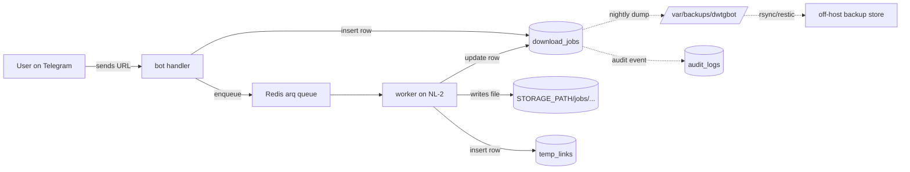

# 34 — Data retention and privacy

> Status: Stable
> Audience: backend engineers, DPO / legal liaison, on-call SRE,
> AI agents touching user data
> Companion docs:
> [`12-db-schema.md`](12-db-schema.md) — what we store and where,
> [`14-logging-observability.md`](14-logging-observability.md) — what is in logs (and what is not),
> [`17-security.md`](17-security.md) — threat model & secret handling,
> [`22-backup-restore.md`](22-backup-restore.md) — backup retention,
> [`23-cleanup-retention.md`](23-cleanup-retention.md) — file/link retention.

What user data DWTGBot stores, for how long, why, and how to delete it
on request. This is the operational counterpart to the legal/policy
text — without this document, the privacy policy is wishful thinking.

> 🔒 **Locked invariants** (P11):
> - **No bytes of user content (URLs, message text, file contents) appear in logs.** Logs carry only ID-shaped values: `request_id`, `job_id`, `user_id`, `chat_id`.
> - **PII never leaves the database except via explicit dump.** No third-party telemetry, no remote logging by default.
> - **Deletion procedures are operator-driven and reversible-until-purge.** Backups carry data forward — they are part of the retention surface.

---

## §1 — Inventory: what user data we store

The schema is canonical in [`12-db-schema.md`](12-db-schema.md).
This table classifies every field by privacy role.

### 1.1 Personal data

| Table | Field | Class | Why we keep it |
|---|---|---|---|
| `download_jobs` | `user_id` | **PII** (Telegram user identifier) | tying a download attempt to the user, audit |
| `download_jobs` | `chat_id` | **PII** (Telegram chat identifier) | knowing where to deliver the result |
| `download_jobs` | `source_url` | **user-provided content** | the link the user shared |
| `download_jobs` | `title` | **third-party PII possible** (channel/account names appear here) | UX (we show it back) |
| `download_jobs` | `error_message` | may include URL fragments | diagnostics |
| `download_jobs` | `extra` (JSONB) | platform-specific metadata; **may include PII** | provider-specific |
| `download_jobs` | `selected_option_key`, `selected_format` | non-PII | which option the user clicked |
| `download_jobs` | `file_path`, `file_size`, `mime_type` | non-PII | bookkeeping |
| `download_jobs` | `telegram_file_id`, `public_url` | references to delivered content | re-delivery / tracking |
| `download_jobs` | timestamps | non-PII | audit / analytics |
| `temp_links` | `token` | short-lived secret | grants access to one file |
| `temp_links` | `file_path` | references stored bytes (possibly PII via filename) | delivery |
| `temp_links` | `job_id` (FK → `download_jobs`) | indirect PII | backref |
| `audit_logs` | `payload` (JSONB) | **may include PII** depending on event | security/compliance forensic record |
| `media_cache` | `source_url`, `metadata_json` | not user-tied (cached per URL globally) | provider response cache |
| `app_settings` | `value` (JSONB) | non-PII | runtime feature flags |

### 1.2 Stored bytes

| Location | Class | Content |
|---|---|---|
| `STORAGE_PATH/jobs/<id>/...` (NL-2 disk) | **user-requested content** | the actual media files (videos, images, audio) |
| `STORAGE_TMP_PATH/<random>/...` (NL-2 disk) | **transient user-requested content** | in-flight worker scratch |
| Postgres dumps in `/var/backups/dwtgbot/` (NL-1 disk) | **PII at rest** | full snapshot of `download_jobs`, `temp_links`, `audit_logs` |
| Off-host backup copies (S3 / restic / rsync target) | **PII at rest** | same as above, possibly multiple revisions |
| Container logs (Docker JSON-file driver) | **non-PII by policy (P11)** — only IDs | structured logs |

### 1.3 Out of scope (we deliberately do not store)

- Telegram message text other than the URL the user shared
- Telegram first/last/username of the user (only the numeric `user_id`)
- IP addresses (the bot does not see them; the API only sees the
  Nginx-attached `X-Forwarded-For` for `/d/<token>` requests, and that is
  not persisted)
- Cookies / browser fingerprints
- Geolocation
- Any data from chats the bot is not added to

If a future feature would store any of the above, it requires a new ADR
and a privacy-policy revision before implementation.

---

## §2 — Retention windows

Each class has its own clock. The retention surface is the **maximum**
of all clocks for the same datum.

### 2.1 Per-class table

| Class | Where | Lifetime today | Mechanism | Tunable? |
|---|---|---|---|---|
| Live PII rows | `download_jobs`, `temp_links`, `audit_logs` | **forever** by design | not auto-purged (audit-grade) | yes — see §4 |
| Inactive temp links | `temp_links is_active=false` | row stays forever; file deleted within ~`CLEANUP_INTERVAL_SECONDS` | `cleanup_worker` (see [`23-`](23-cleanup-retention.md) §4) | tune `TEMP_LINK_TTL_SECONDS` |
| Stored media bytes | `STORAGE_PATH/jobs/...` | until link inactive **and** cleanup cycle deletes (≈ `TEMP_LINK_TTL_SECONDS + CLEANUP_INTERVAL_SECONDS`) | cleanup worker | yes — `TEMP_LINK_TTL_SECONDS` |
| Worker scratch | `STORAGE_TMP_PATH/...` | until next `cleanup.sh -mmin +N` (default 24 h) | manual / cron | `TMP_MAX_AGE_HOURS` |
| Provider info cache | `media_cache` | `MEDIA_CACHE_TTL_SECONDS` (6 h default) | cleanup worker `purge_expired` | yes |
| Postgres dumps (on-host) | `/var/backups/dwtgbot/` | `BACKUP_RETENTION_DAYS` (14 d default) | `backup.sh` `find -mtime` | yes |
| Postgres dumps (off-host) | external store | operator-defined (recommend ≤ 90 d for PII) | external rotation | yes |
| Container logs | host disk via Docker | per `daemon.json` (`max-size`, `max-file`) | docker rotation | yes |
| Audit logs (`audit_logs` table) | inside the DB | **forever today**; partition-by-month + drop-old recommended (§5) | manual SQL | yes |

### 2.2 Why "forever" for `download_jobs`

The decision to keep `download_jobs` rows indefinitely is intentional:

- **Audit / forensic value** — "when did user X request URL Y, what
  result did they get" is the single most useful question post-incident.
- **Abuse investigation** — repeat offenders / fraudulent patterns are
  only detectable across long windows.
- **Operational debugging** — a job that fails today often resembles one
  that failed three months ago; without history we can't see it.

But: this is a **legal liability** under data-subject-rights regimes
(GDPR Art. 17 right to erasure, CCPA right to delete). §4 below is the
mandatory escape hatch.

### 2.3 Recommended caps (if you operate in a regulated jurisdiction)

If your hosting jurisdiction requires bounded retention:

| Class | Suggested cap | How |
|---|---|---|
| `download_jobs` | 365 days | scheduled SQL purge (§5) |
| `audit_logs` | 730 days | partition + drop (§5) |
| Off-host backups containing PII | ≤ 90 days | external rotation policy (`22-` §5) |
| Logs | 30 days | `daemon.json` size cap, plus log shipper retention |

These are not the defaults — opt-in by writing them into `app_settings`
or a cron job.

---

## §3 — Where each datum is reachable from

For deletion to be complete you must touch every reachable copy.
This is the surface map.



### 3.1 Reachability checklist for ONE user's data

If asked to delete user `U`'s data, the operator must visit:

1. `download_jobs WHERE user_id = U` — **rows + every `file_path` they reference**
2. `temp_links WHERE job_id IN (SELECT id FROM download_jobs WHERE user_id=U)` — rows + files
3. `STORAGE_PATH/jobs/<job_id>/` for each job above — files
4. `audit_logs WHERE (payload->>'user_id')::bigint = U` — rows
5. **Latest on-host backup dump** — contains all of the above unless you also rotate that dump (see §4.4)
6. **Off-host backup copies** — same, multiplied by retention
7. Redis `request_state:<request_id>` — if any analyzed-but-not-clicked links are in flight (TTL ≤ `MEDIA_CACHE_TTL_SECONDS`, so typically auto-evicted in 6 h)
8. Container logs — by policy (P11) carry only the numeric `user_id`; an operator may grep and forget the line, but log retention is short (§2.3)

`media_cache` is **not** user-tied (keyed by URL globally) and is
exempt — purging it does not change the privacy surface.

---

## §4 — Procedure: data subject deletion request

This is the canonical runbook. Do all steps in order, do not skip.

> **Before you start.** Get the request in writing (email / ticket / DPO
> form). Record the request ID; you'll write it into the audit log.

### 4.1 Identify the user

```sql
-- Run on NL-1 Postgres
SELECT id, user_id, chat_id, source_url, status, created_at
  FROM download_jobs
 WHERE user_id = :user_id
 ORDER BY created_at;
```

If the requester provided a chat_id instead, use:

```sql
SELECT DISTINCT user_id, count(*), min(created_at), max(created_at)
  FROM download_jobs
 WHERE chat_id = :chat_id
 GROUP BY user_id;
```

Confirm with the requester which `user_id` they mean before proceeding.

### 4.2 Collect the file paths to delete

```sql
\copy (
  SELECT DISTINCT file_path
    FROM (
      SELECT file_path FROM download_jobs WHERE user_id = :user_id AND file_path IS NOT NULL
      UNION
      SELECT file_path FROM temp_links
       WHERE job_id IN (SELECT id FROM download_jobs WHERE user_id = :user_id)
         AND file_path IS NOT NULL
    ) s
) TO '/tmp/dsr_files_user_:user_id.csv'
```

Copy this list to NL-2 (where the files live).

### 4.3 Delete in the correct order

Order matters: drop bytes first (so even if DB delete fails halfway,
the user's content is already gone), then DB rows.

```bash
# === ON NL-2 — delete the bytes ===
NL2_USER_FILES=/tmp/dsr_files_user_<user_id>.csv

# Sanity: every line must start with $STORAGE_PATH (defence-in-depth)
awk -F',' -v root="$STORAGE_PATH" '$1 !~ "^"root {print "REJECTED: "$0; exit 1}' \
  "$NL2_USER_FILES"

# Mark links inactive first so a racing /d/<token> request gets a clean 410
docker exec dwtgbot_postgres psql -U dwtgbot -d dwtgbot -c "
  UPDATE temp_links SET is_active=false
   WHERE job_id IN (SELECT id FROM download_jobs WHERE user_id = :user_id);"

# Then unlink the files (one per line)
while IFS=, read -r path _; do
  rm -f -- "$path"
done < "$NL2_USER_FILES"

# Optionally drop the per-job directory if empty
find "$STORAGE_PATH/jobs" -mindepth 1 -maxdepth 1 -type d -empty -delete
```

```sql
-- === ON NL-1 Postgres — delete the rows ===
BEGIN;

-- Inactive links (FK to download_jobs) — DELETE not UPDATE; user requested erasure
DELETE FROM temp_links
 WHERE job_id IN (SELECT id FROM download_jobs WHERE user_id = :user_id);

-- The jobs themselves
DELETE FROM download_jobs WHERE user_id = :user_id;

-- Audit rows naming this user
DELETE FROM audit_logs
 WHERE payload ? 'user_id'
   AND (payload->>'user_id')::bigint = :user_id;

-- Record THIS deletion as a non-PII audit entry (lawful basis: legitimate interest)
INSERT INTO audit_logs (event_type, payload)
VALUES ('data_subject_request_completed',
        jsonb_build_object('request_id', :request_id,
                           'completed_at', now(),
                           'rows_affected', /* set by COMMIT block in app */ 0));

COMMIT;
```

### 4.4 Address the backups

This is the step most often skipped — and it's the one that breaks GDPR
compliance because the data **does** survive in dumps.

Two strategies, pick one and document it:

#### Strategy A — wait out the retention window (default, simplest)

- The next backup taken **after** §4.3 will not contain the deleted rows.
- Existing dumps will still contain them until they age out.
- After `BACKUP_RETENTION_DAYS` days (default 14), the on-host dumps are
  gone.
- After your off-host retention window, those copies are gone too.
- **Communicate this honestly to the requester**: "deletion completed
  in our live systems on YYYY-MM-DD; backup copies will age out by
  YYYY-MM-DD".

#### Strategy B — purge backups too (only when legally required)

```bash
# 1. Stop new backups during the purge
sudo docker compose -f deploy/nl1/docker-compose.yml stop backup

# 2. Re-create each on-host dump WITHOUT the user's data
#    (load → DELETE → re-dump). Example for one file:
DUMP=/var/backups/dwtgbot/dwtgbot_20260415T021500Z.sql.gz
TMPDB=dwtgbot_purge_$$
docker exec dwtgbot_postgres createdb -U dwtgbot "$TMPDB"
gunzip -c "$DUMP" | docker exec -i dwtgbot_postgres psql -U dwtgbot -d "$TMPDB" --quiet
docker exec dwtgbot_postgres psql -U dwtgbot -d "$TMPDB" -c "
  DELETE FROM temp_links
   WHERE job_id IN (SELECT id FROM download_jobs WHERE user_id = :user_id);
  DELETE FROM download_jobs WHERE user_id = :user_id;
  DELETE FROM audit_logs
   WHERE payload ? 'user_id' AND (payload->>'user_id')::bigint = :user_id;"
docker exec dwtgbot_postgres pg_dump -U dwtgbot "$TMPDB" --no-owner --no-privileges \
  | gzip -9 > "${DUMP%.sql.gz}_purged.sql.gz"
mv "${DUMP%.sql.gz}_purged.sql.gz" "$DUMP"
docker exec dwtgbot_postgres dropdb -U dwtgbot "$TMPDB"

# 3. Repeat for every on-host dump, then for every off-host copy
# 4. Restart backup
sudo docker compose -f deploy/nl1/docker-compose.yml start backup
```

> Strategy B is destructive and slow. Don't pick it casually. Strategy A
> is what most jurisdictions accept, given a reasonable retention cap.

### 4.5 Container logs

By policy (P11) logs contain only `user_id` (a number). To remove
historical lines:

```bash
# Identify
docker compose logs --no-color bot api worker | jq -c 'select(.user_id == :user_id)' | wc -l

# Remove (per-container; requires service restart)
docker compose -f deploy/nl1/docker-compose.yml logs --no-color bot \
  | jq -c 'select((.user_id // 0) != :user_id)' \
  > /tmp/bot.purged.log
# Replace the live JSON file (host path varies by Docker version):
sudo find /var/lib/docker/containers -name '*-json.log' -exec ls -la {} +
# … then move the purged version into place per file. Restart the container.
```

In practice: Docker rotates logs aggressively (`max-size=50m`,
`max-file=5` in `daemon.json`) so the offending lines age out in days.
Most operators consider that sufficient, given log-only PII is the
numeric `user_id`.

### 4.6 Acknowledge

Send a written confirmation back to the requester containing:

- the date/time of completion (live systems),
- the projected date by which all backup copies will have aged out
  (Strategy A) or were purged (Strategy B),
- a statement that media_cache and logs do not contain personal data
  beyond the numeric `user_id`.

### 4.7 If the user just wants to disable, not delete

Some requests are "stop sending me anything" rather than "erase
everything". The right tool is a **deny-list**:

```sql
-- One-time setup (no migration needed; uses app_settings)
INSERT INTO app_settings (key, value)
VALUES ('blocked_user_ids', '[]'::jsonb)
ON CONFLICT (key) DO NOTHING;

-- Add a user to the deny-list
UPDATE app_settings
   SET value = value || jsonb_build_array(:user_id)
 WHERE key = 'blocked_user_ids';
```

The bot must read this list in a middleware and refuse interaction with
deny-listed `user_id`s (this is a feature to add via
`28-implementation-playbook.md` §F-Cmd if not yet present).

---

## §5 — Procedure: scheduled retention enforcement

If you commit to a finite retention window (§2.3), automate it. Manual
runs are reliably forgotten.

### 5.1 `audit_logs` — partition by month, drop old partitions

A monthly cron drops the partition that's now older than the cap
(default 24 months — adjust to your policy).

```sql
-- Initial conversion (one-time, requires migration; see 12-)
-- Partition by month on created_at; index by (event_type, created_at).

-- Monthly job:
DO $$
DECLARE
  cutoff date := (now() - interval '24 months')::date;
  part text := 'audit_logs_' || to_char(cutoff, 'YYYY_MM');
BEGIN
  EXECUTE format('DROP TABLE IF EXISTS %I', part);
END $$;
```

Schedule via host cron on NL-1:

```cron
# Drop a month of audit_logs that's older than 24 months
0 3 1 * * docker exec dwtgbot_postgres psql -U dwtgbot -d dwtgbot \
  -f /opt/dwtgbot/deploy/sql/drop_old_audit_partition.sql \
  >> /var/log/dwtgbot-audit-purge.log 2>&1
```

### 5.2 `download_jobs` — capped retention

If your policy is 365 days max:

```sql
-- Run nightly; bounded batch to avoid long locks
DELETE FROM temp_links
 WHERE job_id IN (
   SELECT id FROM download_jobs
    WHERE created_at < now() - interval '365 days'
    LIMIT 5000
 );

DELETE FROM download_jobs
 WHERE created_at < now() - interval '365 days'
 ORDER BY id
 LIMIT 5000;
```

```cron
# Nightly cap-enforcement (run in batches; loops until "0 rows")
30 3 * * * /opt/dwtgbot/deploy/scripts/purge_old_jobs.sh \
  >> /var/log/dwtgbot-purge.log 2>&1
```

(The script is operator-written; this doc gives the recipe, not the
binary.)

### 5.3 Backup purge automation

`backup.sh` already enforces `BACKUP_RETENTION_DAYS` via `find -mtime`.
For off-host copies (rsync / restic / S3) configure a matching policy
on the *off-host* side — the live host has no view into it. See
[`22-`](22-backup-restore.md) §5.

---

## §6 — What logs may and may not contain (P11 in practice)

| ✅ Allowed | ❌ Forbidden |
|---|---|
| `user_id`, `chat_id`, `request_id`, `job_id` (numbers / hashes) | `source_url` (the user's URL) |
| `platform` (e.g. `youtube`) | message text from the user |
| HTTP method, status code, latency | downloaded file content / titles |
| error_class names, stack traces with file paths | exception messages that embed URLs (must be sanitised) |
| internal token hash prefixes (first 8 chars) for correlation | full tokens |
| schema version, build SHA | environment values containing secrets |

If you find a log line violating this:

1. Triage as a P11 incident (`24-` §16-style).
2. File a ticket to redact the producer.
3. If the offending log is in production, run §4.5-style rotation
   sooner rather than later.

---

## §7 — Lawful basis (template; legal must adapt)

This is **not legal advice**. It's a checklist legal can use.

| Activity | Lawful basis (GDPR Art. 6) | Notes |
|---|---|---|
| Storing `download_jobs` to fulfil a download request | (b) performance of contract / requested service | obvious |
| Storing `audit_logs` for security | (f) legitimate interest | proportionality argument required |
| Retaining backups | (c) legal obligation (where applicable) + (f) legitimate interest | document the cap |
| Sending file via Telegram | (b) performance of service | |
| Issuing temp links | (b) performance of service | |
| Tracking failed jobs across users for fraud | (f) legitimate interest | needs DPIA if at scale |

If you operate under a different jurisdiction's regime, replace the
"lawful basis" column accordingly and revisit §2.3 caps.

---

## §8 — Common mistakes

| # | Mistake | Symptom / consequence | Fix |
|---|---|---|---|
| 1 | Writing the user's URL into a log line | privacy policy lies; potential fine | sanitise; only the number ID |
| 2 | "DELETE FROM download_jobs" without first deleting `temp_links` | FK violation; partial state | follow §4.3 order |
| 3 | Forgetting backups exist (§4.4) | data still recoverable from dump for `BACKUP_RETENTION_DAYS` | document strategy A or B |
| 4 | Adding a new field that contains PII without updating §1.1 | retention surface drift | extend the table when you add a field |
| 5 | Logging `request_id` but not `user_id` (or vice versa) on user-action events | incomplete trace | bind both; see [`14-`](14-logging-observability.md) |
| 6 | Treating `media_cache` as PII (it isn't) | unnecessary purges; cache cold | leave it alone for DSR |
| 7 | Running §4.3 deletes during heavy load | row-level locks; slow queries | batch by 5000 (§5.2) or schedule off-peak |
| 8 | Acknowledging deletion before backups age out (Strategy A) | misleading the requester | be explicit about the projected date |
| 9 | Storing Telegram first/last name to "personalise" | scope expansion | only `user_id` (number); document if you must add more |
| 10 | Letting log files grow unbounded | PII (user_id) lives forever in flat files | enforce `daemon.json` rotation |
| 11 | Off-host backup target with no rotation policy | indefinite PII in S3/restic | always set retention on the off-host side too |
| 12 | Putting `extra` JSONB into a log message | unbounded PII surface | log `keys` only, never `values` |
| 13 | Hand-editing dumps to "redact" a user | corrupts gzip / breaks SQL | use the load → delete → re-dump recipe (§4.4 Strategy B) |
| 14 | Forgetting to update §1.1 when a migration adds a column | classification drift | review checklist in PR template |

---

## §9 — Privacy retention checklist

### 9.1 Per pull request (data-touching change)

```
[ ] Updated §1.1 if a new field stores PII or user content
[ ] Updated §1.2 if new bytes are stored on disk
[ ] No new PII appears in any log line (P11 grep)
[ ] If new schema columns: migration is reversible OR documented as not-reversible
[ ] If new env var: documented in 13- + privacy implications noted here if any
```

### 9.2 Per quarter (operational hygiene)

```
[ ] Re-confirm BACKUP_RETENTION_DAYS matches policy
[ ] Re-confirm off-host backup rotation matches policy
[ ] Re-confirm Docker daemon.json log rotation
[ ] Audit `audit_logs` size and partition status
[ ] Audit `download_jobs` row count and storage growth (vs §2.3 cap if any)
[ ] Run a sample log grep for forbidden content (URLs, message text)
```

### 9.3 Per data subject request

```
[ ] Request received in writing; DSR ticket opened
[ ] User identity confirmed (via Telegram or other channel) — never delete on a numeric user_id alone if the requester is anonymous
[ ] §4.1 — identify rows
[ ] §4.2 — collect file paths
[ ] §4.3 — delete files (NL-2) then rows (NL-1) in that order
[ ] §4.4 — backup strategy chosen (A or B) and documented in the ticket
[ ] §4.5 — log purge if Strategy B
[ ] §4.6 — written acknowledgement to the requester
[ ] Audit log entry inserted with request_id and timestamp
[ ] Ticket closed
```

### 9.4 On a privacy incident (suspected leak)

```
[ ] Stop the bleed (rotate the affected secret if any; pause exports)
[ ] Identify scope (which users / how many rows / what fields)
[ ] §4.5 log redaction if logs leaked
[ ] If reportable in your jurisdiction: notify DPA within mandated window
[ ] If reportable to users: follow notification procedure
[ ] Post-mortem (`adr/`); add a control to prevent recurrence (`17-` §13.6)
[ ] Add the new control to §8 of this document if it's a generalisable lesson
```

---

## §10 — Future extensions

- **Self-service deletion** — a `/forget_me` bot command that performs §4.1–§4.3 with a confirmation dialog. Today this is operator-only. Tracked in `32-roadmap-and-extension-points.md`.
- **Hash-based PII** — store `hashed_user_id = sha256(user_id || global_pepper)` and never the raw number; would let backups exist without raw PII at the cost of lookup complexity. Requires migration + `app_settings` pepper + crypto-erase key rotation.
- **Encrypted-at-rest storage volume** — currently `STORAGE_PATH` and the Postgres volume rely on host-disk encryption. A dedicated `cryptsetup`-managed volume would let "decommission a key" be the deletion primitive.
- **Audit log partitioning** — recipe is in §5.1; landing it as a default migration removes a manual step.
- **DPIA template** — once the system processes >N users / day, run a Data Protection Impact Assessment and store it in `adr/` as a reference document.

Each of these crosses an ADR-0005 assumption — propose in
[`26-cursor-rules.md`](26-cursor-rules.md) and add an ADR before
implementing.
