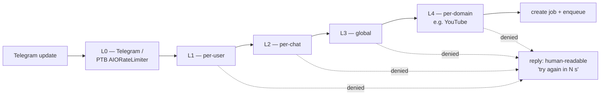

# 36 — Rate limiting

> Status: Stable (L1–L4 implemented in code, gated by `RL_ENABLED=false`
> by default; metrics in §8 implemented in-process per
> [`ADR-0006`](adr/0006-in-process-rate-limit-metrics-exporter.md),
> gated by `METRICS_ENABLED=false` by default)
> Audience: backend / SRE engineers, AI agents touching the bot input edge
> Read first: [`06-bot-flow.md`](06-bot-flow.md),
> [`09-queue-and-workers.md`](09-queue-and-workers.md),
> [`14-logging-observability.md`](14-logging-observability.md),
> [`17-security.md`](17-security.md),
> [`35-metrics-and-slo.md`](35-metrics-and-slo.md)

The "free service that anyone on Telegram can hit" model needs a budget
or it eventually dies — to a popular thread, a scraper, or a single
abusive user. This document defines **what** we limit, **where** we
limit it, **how** the limits behave, and **how** they're observable.

> 🔒 **Locked invariants** (P11):
> - Rate-limit decisions live in the **bot layer**. They never reach into the worker, queue, or DB other than for the storage of counters in Redis.
> - **Counters use Redis only** (no Postgres write path) — they are leaky / approximate by design (P5: queue/Redis is for transient state).
> - **A user must always know they were limited.** Silent drops are forbidden.
> - **No PII flows into limiter telemetry** beyond the numeric `user_id` / `chat_id` (P11; see [`34-`](34-data-retention-and-privacy.md)).

---

## §1 — Why rate-limit?

Three kinds of pain we're avoiding:

1. **Resource exhaustion.** One user spamming 200 URLs in 60 s drains
   worker concurrency, fills `STORAGE_PATH`, and pushes legitimate users
   into a multi-minute queue (B3 / B4 SLOs in
   [`35-`](35-metrics-and-slo.md)).
2. **Upstream wrath.** Hitting YouTube / Instagram from one IP at
   sustained high RPS gets the egress IP throttled or blocked. The
   penalty hits everyone, not the abuser.
3. **Cost runaway.** Bandwidth and disk are not free. A loop of 1 GB
   downloads from one chat is a small DDoS against your own bill.

### What rate-limiting is NOT for

| Not used to | Use instead |
|---|---|
| Block users / abuse policy | Deny-list (`app_settings.blocked_user_ids`) — see [`34-`](34-data-retention-and-privacy.md) §4.7 |
| Stop a deploy regression | Feature flags / rollback ([`21-`](21-cicd.md)) |
| Smooth out yt-dlp upstream errors | Retries with backoff in the worker ([`09-`](09-queue-and-workers.md)) |
| Solve queue backpressure | Limit *intake*, but the real fix is worker scaling ([`37-load-and-capacity.md`](37-load-and-capacity.md)) |

---

## §2 — Layered budget model

Rate limits stack from outside-in. A request that survives all layers
becomes a job; anything denied earlier never enters the queue.



### 2.1 Layer reference

| Layer | Scope | Why this layer | Default | Tunable env |
|---|---|---|---|---|
| **L0** | Telegram-side outbound (PTB sends) | Telegram API caps; we must respect them or get banned | PTB `AIORateLimiter` defaults | n/a (PTB-managed) |
| **L1** | Per `user_id` | Most abuse is per-user | **5 jobs / 60 s**, **20 jobs / 1 h** | `RL_USER_BURST`, `RL_USER_HOURLY` |
| **L2** | Per `chat_id` | Group chats with many members can fan-out; one chat shouldn't dominate | **15 jobs / 60 s** | `RL_CHAT_BURST` |
| **L3** | Global | Catch-all backstop — protects the whole stack from a viral spike | **60 jobs / 60 s** | `RL_GLOBAL_BURST` |
| **L4** | Per upstream domain (e.g. `youtube.com`) | Avoid getting our IP throttled by a single source | **30 jobs / 60 s per domain** | `RL_DOMAIN_BURST` |

> All defaults are deliberately conservative. They should hold for a
> ~100-active-users week-day. See [`37-`](37-load-and-capacity.md) §6
> for tuning recipes when you grow past that.

### 2.2 What "a job" means for limiting

L1 / L2 / L3 / L4 count **enqueue attempts** — i.e. the moment the bot
calls `application/services/jobs.create_and_enqueue`. They do **not**
count `/start`, `/help`, `/status` or callback button taps. Those are
covered by L0 only.

A `/cancel` or a re-click on a previously analysed link is also free
(it doesn't enqueue a new job).

---

## §3 — Algorithm: leaky token buckets in Redis

### 3.1 Why this algorithm

| Choice | Why |
|---|---|
| **Token bucket**, not fixed-window | Smooth burst behaviour; no edge-of-window stampedes |
| **Leaky** (no atomic refill) | One Redis op per check; simple Lua script |
| **Per-layer keys** | A user denied by L1 doesn't poison L2/L3 counters |
| **Approximate (eventual consistency under failure)** | If Redis blips, prefer "let it through" over "lock everyone out" — fail-open is the policy (P11 reads as "user-visible reliability over operator convenience") |

### 3.2 Redis key shape

```
rl:user:{user_id}:burst        TTL 60 s
rl:user:{user_id}:hourly       TTL 3600 s
rl:chat:{chat_id}:burst        TTL 60 s
rl:global:burst                TTL 60 s
rl:domain:{domain}:burst       TTL 60 s
```

> Naming follows the rule in [`data-key-naming.md`] (Redis rules):
> colon-separated, namespace-prefixed, never includes user-controlled
> strings without normalisation. `domain` is normalised to lowercase
> eTLD+1 (e.g. `youtu.be` → `youtube.com`).

### 3.3 Atomic increment-and-check (Lua sketch)

```lua
-- KEYS[1] = rate-limit key
-- ARGV[1] = limit (integer)
-- ARGV[2] = window seconds (integer)
local current = tonumber(redis.call('INCR', KEYS[1]))
if current == 1 then
  redis.call('EXPIRE', KEYS[1], tonumber(ARGV[2]))
end
if current > tonumber(ARGV[1]) then
  return {0, current, redis.call('PTTL', KEYS[1])}    -- denied
end
return {1, current, redis.call('PTTL', KEYS[1])}      -- allowed
```

Single round-trip per layer. Five layers ≈ 5 Redis ops per job-create
attempt; trivially under 1 ms locally.

### 3.4 Failure mode: Redis unreachable

| Symptom | Limiter behaviour | Why |
|---|---|---|
| Redis timeout, slow | **Fail open** (allow). Increment a `rl_redis_error_total` counter. | P11: prefer user-visible reliability. The L0 / queue depth backstops still protect the system. |
| Redis up but Lua errors | Fail open. Log `level=error event=rate_limit_lua_error`. | Same reasoning. |
| Redis returns garbage | Fail open. Log + alert (ticket). | Same. |

> **Do not** fail closed. The bot replying "service unavailable" to a
> normal user because Redis hiccuped is worse than serving one extra
> job. Operators see the alert.

---

## §4 — User-visible behaviour when limited

### 4.1 The reply contract

Every limit denial produces **one** Telegram message of the form:

```
⏳ Slow down — too many requests.

You can try again in {N} seconds.
(limit: {layer_name})
```

Where:

- `{N}` is `ceil(PTTL / 1000)` for the limiting key, **rounded up to a
  human-friendly value** (`{N} ≤ 5 → "5"`, `{N} ≤ 30 → "30"`,
  `{N} ≤ 60 → "60"`, otherwise minutes).
- `{layer_name}` is one of: `personal`, `chat`, `service-wide`,
  `<platform>`. The user sees a *category*, not the limit number — the
  number is operational, not user-facing.

### 4.2 What the user does NOT see

- The exact limit (e.g. "5 / 60 s"). Disclosing it makes evasion easy.
- Other users' counters.
- Internal layer names (`L1`, `L2`, …).
- Stack traces / Redis errors.

### 4.3 Reply throttling

When a user keeps spamming, do **not** reply to every denied attempt —
that itself becomes a Telegram-side rate-limit problem. Use a Redis
"told already" flag:

```
rl:notice:{user_id}    TTL 30 s
```

If the flag is set, deny silently *for that user* until it expires
(this is the **only** time silence is allowed — it's the *follow-up*
denials, not the first one; see P11 invariant in §0).

### 4.4 Group-chat behaviour

If L2 (per-chat) trips in a group, reply **once per `RL_CHAT_NOTICE_TTL`
seconds** in the chat (default 30 s) and otherwise silently deny. The
text is generic ("this chat is rate-limited"), no `user_id` mentioned.

---

## §5 — Where the code lives (actual layout)

> Implemented. The file paths below are real — the `import` statements
> in this section are what the code actually does today. Layout differs
> slightly from the original target proposal (we use the existing
> `app/application/services/` and `app/infrastructure/cache/` folders
> instead of a dedicated `infrastructure/rate_limit/` package — that
> kept the diff small and didn't introduce a new top-level package for
> two files; see [`28-`](28-implementation-playbook.md) §F-File for the
> "minimal safe scope" reasoning).

```
app/
  domain/
    rate_limit.py                       # LimitWindow, LimitDecision, LimitLayer
  application/
    services/
      rate_limit.py                     # evaluate(...) + InMemoryNoticeThrottle
      rate_limit_gate.py                # RateLimitGate Protocol + NoopRateLimitGate
      rate_limit_metrics.py             # RateLimitMetrics Protocol + Noop sink
  infrastructure/
    cache/
      redis_rate_limit_gate.py          # RedisRateLimitGate (Lua + fail-open)
    metrics/
      prometheus_metrics.py             # PrometheusRateLimitMetrics
      server.py                         # MetricsServer (in-process /metrics, ADR-0006)
  bot/
    handlers/
      links.py                          # calls evaluate(...) + bumps first_deny
    container.py                        # carries rate_limit_gate, notice_throttle, metrics
  composition.py                        # picks Redis vs Noop based on RL_ENABLED;
                                         # picks Prometheus vs Noop based on METRICS_ENABLED
  main_bot.py                           # starts/stops MetricsServer
```

### 5.1 The port (domain-side)

```python
# app/domain/rate_limit.py
@dataclass(frozen=True)
class LimitWindow:
    name: str          # "user_burst", "chat_burst", "global_burst", "domain_burst"
    limit: int
    window_s: int

@dataclass(frozen=True)
class LimitDecision:
    allowed: bool
    layer: str | None         # which layer denied (None if allowed)
    retry_after_s: int        # 0 if allowed

# app/application/ports/rate_limit_gate.py
class RateLimitGate(Protocol):
    async def check(self, key: str, window: LimitWindow) -> LimitDecision: ...
```

### 5.2 The use case

```python
# app/application/services/rate_limit.py
async def evaluate(
    *,
    user_id: int,
    chat_id: int,
    domain: str,
    gate: RateLimitGate,
    cfg: RateLimitConfig,
) -> LimitDecision:
    for window, key in (
        (cfg.user_burst,   f"rl:user:{user_id}:burst"),
        (cfg.user_hourly,  f"rl:user:{user_id}:hourly"),
        (cfg.chat_burst,   f"rl:chat:{chat_id}:burst"),
        (cfg.global_burst, "rl:global:burst"),
        (cfg.domain_burst, f"rl:domain:{domain}:burst"),
    ):
        decision = await gate.check(key, window)
        if not decision.allowed:
            return decision
    return LimitDecision(allowed=True, layer=None, retry_after_s=0)
```

### 5.3 The handler integration (bot layer)

```python
# app/bot/handlers/links.py (sketch — see 28- §F-Cmd for the full pattern)
async def handle_link(update, ctx):
    uid, cid = update.effective_user.id, update.effective_chat.id
    domain = normalise_domain(parse_url(message_text))
    decision = await ctx.app.rate_limit.evaluate(
        user_id=uid, chat_id=cid, domain=domain,
        gate=ctx.app.rate_limit_gate, cfg=ctx.app.rl_config,
    )
    if not decision.allowed:
        await reply_rate_limited(update, ctx, decision)   # §4.1
        return
    await ctx.app.jobs.create_and_enqueue(...)
```

### 5.4 What does NOT belong in the limiter

- ❌ Anything Postgres-touching. Counters are Redis-only.
- ❌ Per-platform business rules (e.g. "Instagram needs to wait 2s between fetches"). That belongs to the provider runner ([`07-`](07-provider-architecture.md)).
- ❌ Worker-side limits. Worker concurrency is set by `WORKER_CONCURRENCY` ([`09-`](09-queue-and-workers.md)). Do **not** add a second limiter inside the worker — that's two sources of truth.
- ❌ "Bypass" backdoors keyed on `user_id`. Use the deny-list / allow-list (`app_settings`) instead — see [`34-`](34-data-retention-and-privacy.md) §4.7.

---

## §6 — Configuration

All knobs are in `app/config.py:Settings.RateLimit`. Document new ones
in [`13-config-and-env.md`](13-config-and-env.md) when added.

| Env var | Default | Meaning |
|---|---|---|
| `RL_ENABLED` | `true` | Master switch. `false` → all layers always allow (only L0 active). |
| `RL_USER_BURST` | `5/60` | "limit/window_s". |
| `RL_USER_HOURLY` | `20/3600` | |
| `RL_CHAT_BURST` | `15/60` | |
| `RL_CHAT_NOTICE_TTL` | `30` | Seconds between "this chat is rate-limited" replies in groups. |
| `RL_GLOBAL_BURST` | `60/60` | |
| `RL_DOMAIN_BURST` | `30/60` | Per upstream eTLD+1. |
| `RL_NOTICE_TTL` | `30` | Per-user "told already" TTL (§4.3). |
| `RL_FAIL_OPEN` | `true` | If `false`, Redis errors fail closed. **Don't change without an ADR.** |

### 6.1 Allow-list / deny-list

| Key in `app_settings` | Effect |
|---|---|
| `rate_limit_bypass_user_ids` (JSONB array of int) | Skip L1/L2 for these users. Useful for ops bots. **Never add real users**; document why each entry exists. |
| `blocked_user_ids` (JSONB array of int) | Hard-deny before the limiter runs. See [`34-`](34-data-retention-and-privacy.md) §4.7. |

---

## §7 — Logging contract

Every decision (allowed and denied) emits a structured event. Required
fields:

```json
{
  "event": "rate_limit_decision",
  "decision": "allow" | "deny",
  "layer": "user_burst" | "chat_burst" | "global_burst" | "domain_burst" | null,
  "user_id": 123,
  "chat_id": -456,
  "domain": "youtube.com",
  "retry_after_s": 0,
  "request_id": "..."
}
```

### 7.1 What NOT to log

- ❌ The URL or any part of it (only `domain`).
- ❌ The Telegram message text.
- ❌ The Redis key contents (the `current` count is fine; full keys leak `user_id` patterns but `user_id` is already permitted — see [`34-`](34-data-retention-and-privacy.md) §6).
- ❌ Stack traces from Redis (those go to a separate `rate_limit_redis_error` event).

### 7.2 Signal volume

In normal operation `event=rate_limit_decision` is high-volume — one per
`/d/<token>` and one per link. Make sure log shipping handles it; see
[`14-`](14-logging-observability.md) §10.

---

## §8 — Metrics (cross-ref to [`35-`](35-metrics-and-slo.md))

> **Status:** Implemented. The bot exposes `/metrics` in-process when
> `METRICS_ENABLED=true`. See
> [`ADR-0006`](adr/0006-in-process-rate-limit-metrics-exporter.md) for
> the architecture and `app/infrastructure/metrics/` for the code.

| Metric | Type | Labels | Use |
|---|---|---|---|
| `rate_limit_decisions_total` | Counter | `decision`, `layer` | dashboard pies; trend lines |
| `rate_limit_retry_after_seconds` | Histogram | `layer` | "how late are we asking users to wait" |
| `rate_limit_redis_errors_total` | Counter | `kind` (e.g. `RedisError`, `parse`, `unexpected`) | reliability of the limiter itself; non-zero ⇒ fail-open path engaged |
| `rate_limit_first_deny_total` | Counter | `layer` (+ optional `user_id`, see §8.1) | feeds the "noisy users" panel; bumped only on the first deny per `RL_NOTICE_TTL` window |
| `rate_limit_bypass_used_total` | Counter | – | reserved for the future allow-list bypass; not yet emitted |

### 8.1 Suggested PromQL panels

```promql
# Deny rate by layer (5m)
sum by (layer) (rate(rate_limit_decisions_total{decision="deny"}[5m]))

# p95 retry-after promised to users, by layer
histogram_quantile(0.95,
  sum by (layer, le) (rate(rate_limit_retry_after_seconds_bucket[5m])))

# Limiter reliability — fail-open invocations
sum by (kind) (rate(rate_limit_redis_errors_total[5m]))

# Top "noisy" users (only when METRICS_USER_ID_LABEL=true)
topk(10, sum by (user_id) (rate(rate_limit_first_deny_total[1h])))
```

`METRICS_USER_ID_LABEL` is **off** by default
([ADR-0006](adr/0006-in-process-rate-limit-metrics-exporter.md) §3.2 —
cardinality risk). When it's off, use the structured log event instead:

```logql
# Same answer, no per-user time series
topk(10, sum by (user_id) (rate({app="bot"} |= "rate_limit_first_deny"
                                          | json [1h])))
```

> Privacy: `user_id` here is the numeric Telegram ID, allowed by P11.
> Do not add a `username` or `first_name` label.

---

## §9 — Operating recipes

### 9.1 "Some users complain they hit the limit too often"

```bash
# 1. How many denies per layer in the last hour?
docker compose -f deploy/nl1/docker-compose.yml logs --no-color bot \
  | jq -c 'select(.event=="rate_limit_decision" and .decision=="deny")' \
  | jq -s '[.[] | .layer] | group_by(.) | map({layer: .[0], n: length})'

# 2. Which user_ids are hottest?
docker compose -f deploy/nl1/docker-compose.yml logs --no-color bot \
  | jq -r 'select(.event=="rate_limit_decision" and .decision=="deny") | .user_id' \
  | sort | uniq -c | sort -rn | head

# 3. Confirm legitimate use vs abuse with the per-user job history
psql ... "SELECT created_at, source_url, status FROM download_jobs
          WHERE user_id = :uid ORDER BY id DESC LIMIT 50;"
```

If the deny rate looks legit (real users), tune `RL_USER_BURST` upward
*and* match with worker capacity (see [`37-`](37-load-and-capacity.md)).

### 9.2 "Upstream platform started 429-ing us"

Tighten L4 for that domain temporarily:

```bash
# Temporary, takes effect on next request once env is reloaded
echo 'RL_DOMAIN_BURST=10/60' >> deploy/nl1/.env
docker compose -f deploy/nl1/docker-compose.yml up -d bot
```

Document the change in the incident ticket and revert once the upstream
calms down. If the change sticks, fold it into the default and ADR it.

### 9.3 "Global stampede during a viral moment"

L3 (`RL_GLOBAL_BURST`) is the safety net. Don't disable it. If it fires
constantly:

1. Check queue depth ([`24-`](24-runbooks.md) §13).
2. Check worker saturation (B4 in [`35-`](35-metrics-and-slo.md)).
3. If both look OK, raise `RL_GLOBAL_BURST` step-wise (60 → 120 → 240).
4. If they look bad, **leave the limit** — it's doing its job. Add
   capacity instead (see [`37-`](37-load-and-capacity.md) §3).

### 9.4 "Limiter itself is broken (Redis dead)"

The system fails open by default (§3.4). Concretely you'll see:

- `rate_limit_redis_errors_total` rising
- `rate_limit_decisions_total{decision="allow"}` keeps rising too
- Real downstream protection is now only L0 + worker concurrency

Page severity: **ticket** (limiter is a defence-in-depth layer, not a
single point of failure for the user). Restore Redis per
[`24-`](24-runbooks.md) §3.

### 9.5 "Need to bypass the limit for an internal ops user"

```sql
INSERT INTO app_settings (key, value)
VALUES ('rate_limit_bypass_user_ids', '[]'::jsonb)
ON CONFLICT (key) DO NOTHING;

UPDATE app_settings
   SET value = value || jsonb_build_array(:internal_user_id)
 WHERE key = 'rate_limit_bypass_user_ids';
```

Document the `:internal_user_id` and the reason in the operator wiki.
Audit the list quarterly (delete entries you don't recognise).

---

## §10 — Common mistakes

| # | Mistake | Symptom / consequence | Fix |
|---|---|---|---|
| 1 | Replying to every denied message | Telegram throttles the bot; L0 starts kicking | Implement §4.3 "told already" flag |
| 2 | Counting non-job interactions (`/help`) | Users hit the limit just clicking buttons | Limit only at the enqueue path (§2.2) |
| 3 | Using Postgres for counters | Slow; couples bot latency to DB latency | Redis only (§3.1) |
| 4 | Failing closed when Redis is down | Whole bot becomes unusable on a Redis blip | `RL_FAIL_OPEN=true` (§3.4); never flip to false without an ADR |
| 5 | Logging the user's URL on a denial | PII in logs | Log `domain` only (§7.1) |
| 6 | Per-layer limit values that contradict each other (e.g. user > chat) | A single user can't fully use even their own quota | Verify `user ≤ chat ≤ global`; add a startup assertion |
| 7 | Hard-coding limits in Python | Can't tune without redeploy | Read from `Settings`; document in [`13-`](13-config-and-env.md) |
| 8 | Using string user IDs | Cardinality explosion in metrics | Always integer (matches Telegram + DB schema) |
| 9 | Single-window only (e.g. just `5/60`) | A user can rotate URLs forever at exactly 5/min | Add the hourly window (`20/3600`) too |
| 10 | Forgetting domain normalisation | `youtu.be` and `youtube.com` count separately; abuser exploits | Normalise to eTLD+1 |
| 11 | Putting limit decisions inside the worker | Two sources of truth; the queue already accepted the work | Decide at the bot edge only |
| 12 | Letting bypass-list grow unbounded | Effective limit becomes "no limit" | Quarterly audit; require a comment field |
| 13 | Adding L4 per-platform limits inside provider code | Spreads policy across the codebase | Keep all rate logic in the limiter; provider just exposes its `domain` |
| 14 | Removing the L3 global backstop "because L1/L2 already cover it" | Single bug in L1/L2 = no backstop | Keep L3; cheap insurance |
| 15 | Not exposing `rate_limit_redis_errors_total` | Limiter rots silently | Always wire the exporter (§8) |

---

## §11 — Migration / rollout plan

Steps 1–5 are **done** (code merged, tests in `app/tests/test_rate_limit_*.py`).
Steps 6–10 are operator territory; do them in order, do not skip.

1. ✅ Domain types (§5.1) + tests (`test_rate_limit_evaluate.py`).
2. ✅ `RateLimitGate` port + Redis impl + Lua script + unit tests
   (`test_rate_limit_redis_gate.py`).
3. ✅ `evaluate` use case + tests with `NoopGate`.
4. ✅ Bot handler integration **gated** behind `RL_ENABLED=false`
   (default off — `app/config.py:Settings.RL_ENABLED`).
5. ✅ Prometheus exporter + first-deny counter (this section + §8;
   [`ADR-0006`](adr/0006-in-process-rate-limit-metrics-exporter.md)).
   Tests in `test_rate_limit_metrics.py`. Default `METRICS_ENABLED=false`.
6. ⏳ Deploy. With `METRICS_ENABLED=true` + scrape job, observe
   `rate_limit_decisions_total{decision="allow"}` only; verify volumes.
7. ⏳ Flip `RL_ENABLED=true` for 10 % of traffic via a `user_id % 10`
   bypass list (operator-controlled).
8. ⏳ Watch the dashboard from §8.1 for 48 h. Tune defaults if denials
   look wrong; check `rate_limit_redis_errors_total == 0`.
9. ⏳ Flip `RL_ENABLED=true` globally.
10. ⏳ Add the alerts from [`35-`](35-metrics-and-slo.md) §6 if the deny
    rate becomes one.

Rollback: set `RL_ENABLED=false` and redeploy bot. Metrics keep flowing
(they show only allows). No data migration required (counters expire
naturally).

---

## §12 — Quick reference

```
Layers (default):
  L1 user        5/60s, 20/1h
  L2 chat        15/60s
  L3 global      60/60s
  L4 domain      30/60s
  L0 PTB         (Telegram-managed)

Where it lives: bot edge, before create_and_enqueue
Storage: Redis (Lua, single round-trip per layer)
Failure mode: fail open + alert (RL_FAIL_OPEN=true)
User-visible: human reply, "try again in {N} {unit}"; one notice per RL_NOTICE_TTL
Bypass: app_settings.rate_limit_bypass_user_ids (audited quarterly)
Block: app_settings.blocked_user_ids (see 34- §4.7)

Don't:
  - count /help, callback taps
  - log URLs
  - fail closed
  - put limits in the worker
```
